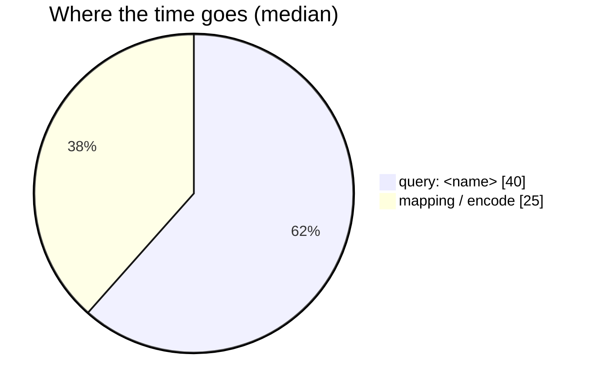

# <RpcName> — performance audit

**Verdict:** 🔴 heavy — <one line: the single worst thing>
**Measured:** <YYYY-MM-DD> · `<service>/<svc>_v1/<rpc>.go` · seed <N> rows in `<table>` · warm, 5 runs

| | median | max |
| --- | --- | --- |
| wall | <x> ms | <x> ms |
| db | <x> ms | <x> ms |
| in Go (wall − db) | <x> ms | <x> ms |
| queries | <n> | |

<!-- `title` is its OWN line — `pie showData title …` does not parse, and a leading-zero value
     (`: 00`) does not either. Run `cd frontend && npm run lint:mermaid`. -->



---

## Queries

| # | What | Rows | Time | Plan | Verdict |
| --- | --- | --- | --- | --- | --- |
| 1 | `SELECT … FROM x WHERE …` | 50 | 4 ms | Index Scan `idx_x_y` | ok |
| 2 | `SELECT … FROM y WHERE id = ?` **×50** | 1 | 0.4 ms ea | Index Scan | 🔴 N+1 |

<!-- Keep the SQL trimmed to the shape. Full text belongs in the plan block below, not the table. -->

---

## Findings

### 1. <Name of the problem> 🔴

<Two lines: what happens, and what it costs. Numbers, not adjectives.>

```
<the EXPLAIN (ANALYZE, BUFFERS) output, trimmed to the relevant nodes>
```

**→ Recommend:** <the fix, and the trade-off it carries. Say which option you would pick.>

### 2. <…> 🟡

**→ Recommend:** <…>

---

## Proposed migration

<!-- Only if an index is recommended. This is a PROPOSAL — it is not applied by the audit
     (HARD RULE 3: the migration belongs to the owning service, and it is the owner's call). -->

```sql
-- backend/services/<svc>/db_migrations/<ts>_add_<name>_index.sql
CREATE INDEX CONCURRENTLY idx_<table>_<cols> ON <table> (<cols>);
```

Cost: <write amplification / size / does it help other RPCs too>.

---

## Not measured

- concurrency (single-caller measurement)
- cache-cold / cold-buffer behaviour
- production data distribution — the seed is uniform, real data is skewed (<how>)
- <anything else>

---

## Open questions

- [ ] <what needs the owner's decision, with the options and the one you would pick>

---

## History

| Date | Median | Queries | Change |
| --- | --- | --- | --- |
| <YYYY-MM-DD> | <x> ms | <n> | first audit |
