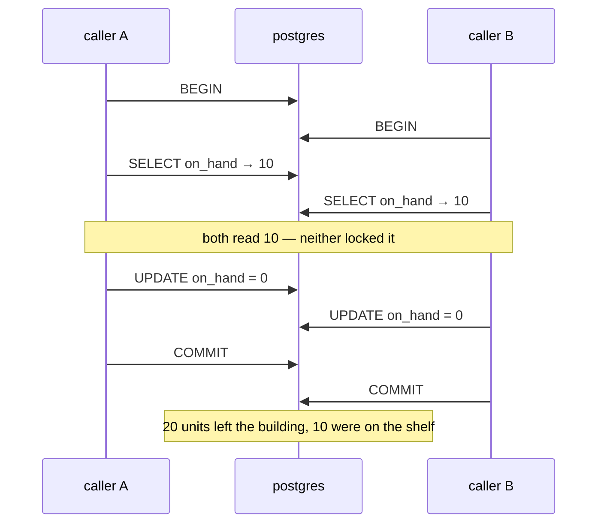

# <RpcName> — concurrency audit

**Verdict:** 🔴 unsafe — <one line: what two callers can do to the warehouse>
**Proved:** <YYYY-MM-DD> · `<service>/<svc>_v1/<rpc>.go` · `<rpc>_race_test.go` (`-tags raceaudit`)
**Isolation:** READ COMMITTED

| | |
| --- | --- |
| race | <n> callers, <what was seeded> |
| result | <the impossible state — "on_hand = −60 on a shelf holding 10"> |
| interleaving | <which step failed to block, or "not run"> |

---

## The losing interleaving

<!-- ⚠ Semicolons END a statement in a sequence message and break the whole diagram.
     Use — or , instead. Run `cd frontend && npm run lint:mermaid`. -->



---

## What the handler does

| Step | Statement | Locks | Safe? |
| --- | --- | --- | --- |
| 1 | `SELECT on_hand FROM stock_levels WHERE …` | none | 🔴 the value is written back at step 3 |
| 2 | `<computed in Go>` | | |
| 3 | `UPDATE stock_levels SET on_hand = ?` | row (too late) | 🔴 |

---

## Findings

### 1. <Name of the race> 🔴

<Two lines: the pattern number from the skill, what two callers do, and what the warehouse ends up
holding. Numbers, not adjectives.>

```
<the race output — the outcome table from res.Report(t), and the final-state assertion that failed>
```

**→ Recommend:** <the fix and its cost. Say which option you would pick.>

| Option | Cost |
| --- | --- |
| `FOR UPDATE` on the read at step 1 | serializes callers on the same shelf — the intended behaviour |
| single-statement `SET on_hand = on_hand - ?` | fastest, but only works when nothing else in the transaction needs the old value |
| a `CHECK (on_hand >= 0)` constraint | a backstop, not a fix — it turns the bug into a 500 |

### 2. <…> 🟡

**→ Recommend:** <…>

---

## Lock order

<!-- Only if this RPC takes more than one lock. The service-wide matrix lives in
     audits/services/<svc>/concurrency/lock-order.md — this section says whether this RPC obeys it. -->

| Acquired | Table | Rows | Obeys the service hierarchy? |
| --- | --- | --- | --- |
| 1st | `restock_requests` | the request | ✅ |
| 2nd | `restock_request_lines` | `ORDER BY id` | ✅ |

---

## Proposed change

<!-- A PROPOSAL. Not applied by the audit — a lock change alters what blocks what across the whole
     service, and a constraint migration belongs to the owning service (HARD RULE 3, HARD RULE 8). -->

```go
// backend/services/<svc>/<svc>_v1/<rpc>.go
err := tx.Raw(`SELECT on_hand FROM stock_levels WHERE … FOR UPDATE`, …).Scan(&onHand).Error
```

```sql
-- backend/services/<svc>/db_migrations/<ts>_<name>.sql   (only if a constraint is recommended)
CREATE UNIQUE INDEX CONCURRENTLY … ;
```

What it costs: <what now blocks on what, and for how long>.

---

## Suspected, not proved

- [ ] <a hypothesis the race could not trigger, and WHY it could not be shown>

---

## Not proved

- this RPC racing its siblings (<name them>) — only self-races were run
- a lock inversion against another service
- behaviour under connection-pool exhaustion
- <anything else>

---

## Open questions

- [ ] <what needs the owner's decision, with the options and the one you would pick>

---

## History

| Date | Race | Result | Change |
| --- | --- | --- | --- |
| <YYYY-MM-DD> | <n>-way | <the impossible state> | first audit |
