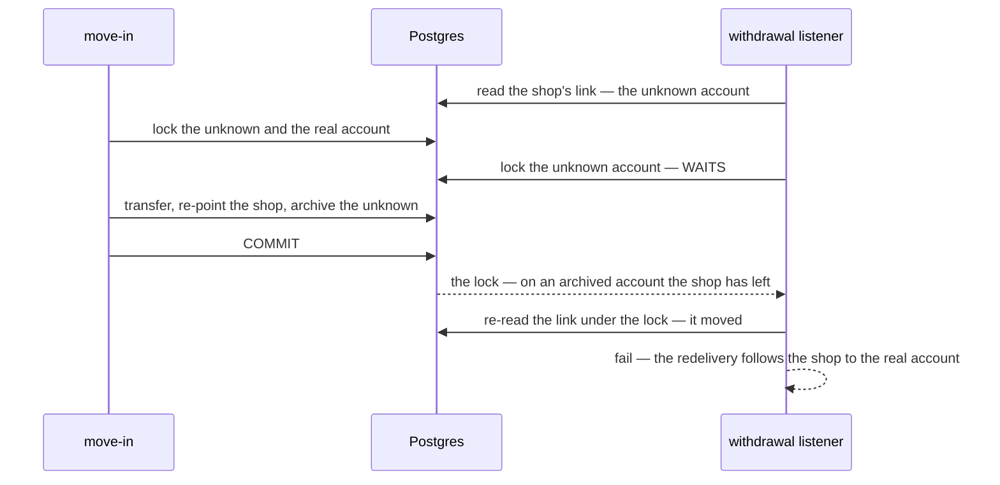

# financial_account_service — lock order

The service-wide matrix the `audit-sql` skill writes unconditionally. Not a finding — the reference the next
write handler is checked against.

**Verdict: one lock, the account row, taken first — and two of them only ever in id order.** Every write locks
`financial_accounts` `FOR UPDATE` before it touches the log, the balance, the daily report or a link, so the
account row is the top of the hierarchy and every child write happens under it. No handler holds a lock across a
call to another service. Raced and interleaved: **safe** — and one check-then-act race in the withdrawal listener
was found and fixed in this pass (below).

| Handler | Lock order | Notes |
| --- | --- | --- |
| `FinancialAccountCreate` | *(new row)* → its own `financial_accounts` row | the number and name pre-checks only pick the message; the unique indexes refuse a racing duplicate, mapped to `already_exists` |
| `FinancialAccountUpdate` | `financial_accounts` (1) | the name check runs under the lock; the unique index backs it |
| `FinancialAccountIdentify` | `financial_accounts` (2, **ORDER BY id**) → `shop_accounts` (by account) | fill-in locks one; move-in locks both, transfers, re-points, archives |
| `FinancialAccountArchive` · `Restore` | `financial_accounts` (1) → `operational_accounts` | the zero check reads the balance UNDER the lock |
| `FinancialAccountTransfer` | `financial_accounts` (2, **ORDER BY id**) | both legs posted under both locks |
| `FinancialAccountCapital` · `Reconcile` | `financial_accounts` (1) | the reconcile's difference is against the balance read under the lock |
| `FinancialAccountShopSet` | *(ShopAccessCheck — outside the transaction)* → `financial_accounts` (1) → `shop_accounts` (upsert on `shop_id`) | the network call is BEFORE the transaction, so no lock is held across it |
| `FinancialAccountOperationalSet` | `financial_accounts` (1) → `operational_accounts` | insert `ON CONFLICT DO NOTHING` |
| the withdrawal listener | `financial_account_event_logs` (claim) → `financial_accounts` (1) | the claim is an `INSERT … ON CONFLICT DO NOTHING`; a new shop's account + link are inserted, the unique `shop_id` deciding a race |
| *(every post)* | under the account lock: `financial_account_logs` → `financial_accounts.balance` → `financial_account_daily_reports` (the day, then later days) | the day rows are per account, so the account lock serialises the upsert and the shift — no advisory lock |

Evidence: [`financial_account_race_test.go`](../../../../backend/services/financial_account_service/financial_account_v1/financial_account_race_test.go) (`raceaudit`), 20 runs clean.

| proved | how |
| --- | --- |
| no lost update on a balance | 8 posts at once → balance 8 000, eight distinct `balance_after`, the day closes on the balance · **Interleave: the second post BLOCKS** and builds on the first's balance |
| no deadlock between opposite transfers | 8 transfers X→Y and Y→X at once → 0 deadlocks, both balances where they started |
| archived only at zero, under concurrency | archive vs a post, 10 rounds → never archived holding money · **Interleave: the archive BLOCKS**, then refuses |
| one real account, one row | 8 creates of one number → 1 row, 7 `already_exists`, 0 `internal` |
| a redelivery posts once | the same event 4× at once → posted once, every delivery acked |
| a new shop gets one unknown account | 4 first withdrawals at once → 1 account, 1 link; the losers fail, are redelivered, and all 4 post once |
| a withdrawal follows a shop moved while it waited | **Interleave** — see below |

---

## Found and fixed in this pass — the listener's link was read before the lock

The withdrawal listener read the shop's `shop_accounts` link, THEN locked the account it named. A
*Which account is this? → move in* committing in between re-points the shop and archives the unknown account — and
the waiting withdrawal, once it got the lock, posted into the archived account its shop had just left (pattern 2,
check-then-act). Proved: with the re-check disabled, the Interleave below fails with *"the withdrawal posted after
the shop moved — into the archived account it left"*.

**Fix (applied — a bug in this pass's own code, not a design change):** re-read the link once the account is
locked; if it moved, return an error so the transaction rolls back with its claim and Pub/Sub redelivers. No second
lock is taken while one is held, so the fix cannot introduce a deadlock. The Interleave
`TestInterleave_Withdrawal_FollowsAShopMovedWhileItWaited` is kept as its regression test.

⚠ The next handler that locks TWO accounts must take them `ORDER BY id`, as `lockAccounts` does — and must not lock
a link row before an account, which would invert this order.
