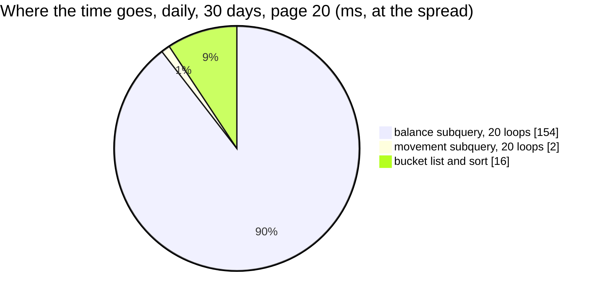

# AnalyticTimeSearch — performance audit

**Verdict:** 🔴 heavy — the balance is re-derived from scratch for EVERY bucket, so the cost grows with the page size and with the length of history (a plan-level N+1)
**Measured:** 2026-10-01 · `financial_account_service/financial_account_v1/analytic_time_search.go` · seed 10 000 `financial_accounts` (200 teams × 50), ~50 000 `financial_account_daily_reports` (the audited team's 50 accounts × 365 days = 18 250, the rest other teams'), 50 000 `financial_account_logs`; then the same at a production-like spread — 400 000 daily rows, the team ~5% · warm, median of 5 · [`analytic_time_search_perf_test.go`](../../../../backend/services/financial_account_service/financial_account_v1/analytic_time_search_perf_test.go), [`distribution_perf_test.go`](../../../../backend/services/financial_account_service/financial_account_v1/distribution_perf_test.go) (`-tags perfaudit`)

| call | median wall | queries |
| --- | --- | --- |
| daily, 30 days, page 20 | **156 ms** (129 ms at the spread) | 1 |
| daily, 365 days, page 20 | **403 ms** | 1 |
| daily, 365 days, page 200 | **3 264 ms** | 1 |
| monthly, 365 days | **186 ms** | 1 |
| daily, 30 days, ONE account | 1 ms | 1 |

One query, so the wall IS that query.



---

## Queries

| # | What | Rows | Time | Plan | Verdict |
| --- | --- | --- | --- | --- | --- |
| 1 | `unnest(buckets)` ⟕ LATERAL movement Σ ⟕ LATERAL `DISTINCT ON (account_id) … day <= bucket_to` | 20 | 172 ms | Nested Loop, **loops=20** over a Bitmap Index Scan of **17 775 rows + a sort** each | 🔴 plan-level N+1 |

---

## Findings

### 1. The balance is recomputed per bucket over the team's whole history 🔴

For every bucket, the LATERAL balance subquery reads every daily row of the team at or before that bucket's last
day and sorts them to pick each account's latest row. 20 buckets × ~17 800 rows × a sort; 200 buckets is 3.3 s. It
scales with **page size × history length**, so a mature team's year gets slower every day the table grows.

```
->  Nested Loop Left Join  (actual time=22.773..170.164 rows=20 loops=1)
      ->  Index Scan using financial_account_daily_reports_team_day_idx on financial_account_daily_reports r  (rows=50 loops=20)
            Index Cond: ((team_id = 20000) AND (day >= b.bucket_from) AND (day <= b.bucket_to))
      Sort Method: quicksort  Memory: 1444kB
      ->  Bitmap Index Scan on financial_account_daily_reports_team_day_idx  (actual rows=17775 loops=20)
            Index Cond: ((team_id = 20000) AND (day <= b.bucket_to))
Execution Time: 171.737 ms
```

The movement subquery beside it is fine — an index range per bucket, 0.05 ms each. The one-account read is 1 ms:
its history is one account's, not fifty.

This is the shape settlement's own `AnalyticTimeSearch` was audited for on 2026-09-14
([settlement_service/performances/AnalyticTimeSearch.md](../../settlement_service/performances/AnalyticTimeSearch.md))
— adopted with the delivery ([analytics-are-delivered-the-settlement-way](../../../../docs/business/financial_account/context_decision.md#analytics-are-delivered-the-settlement-way)),
and with it the finding.

**→ Recommend: the window's opening balance ONCE, then a running sum of the buckets' movement.** The daily row
keeps `close(D) = open(window) + Σ change up to D`, so no bucket needs a per-account "latest row":

```sql
WITH opening AS (            -- once: each account's last close before the window, by the (account_id, day) index
    SELECT COALESCE(SUM(p.close_balance), 0) AS balance
    FROM financial_accounts a
    CROSS JOIN LATERAL (SELECT close_balance FROM financial_account_daily_reports
                        WHERE account_id = a.id AND day < @start ORDER BY day DESC LIMIT 1) p
    WHERE a.team_id = @team
), moved AS (                -- each bucket's movement, as today
    SELECT b.at, …movement sums…
    FROM unnest(@ats, @froms, @tos) b LEFT JOIN LATERAL (…) m ON TRUE
)
SELECT at, …, (SELECT balance FROM opening) + SUM(change) OVER (ORDER BY at) AS close_balance
FROM moved
```

One index probe per account plus one range read of the window — no loop over history. ⚠ The page must be cut AFTER
the running sum (or the sum start from the page's first bucket's opening), because a DESC page starts at the end.
The trade is one more CTE; the result is identical by the daily row's own definition, which the ledger's unit test
(`ledger_test.go`) pins.

**Alternative I would not pick:** cap the daily page smaller. It hides the cost without removing it.

---

## Proposed migration

None. The `(team_id, day)` and `(account_id, day)` indexes are used correctly; the problem is the loop, not the
access path.

---

## Not measured

- concurrency — single caller
- cache-cold behaviour — every buffer was a hit
- years of history — the seed is one year; the per-bucket cost grows with every year after it
- the same fix in settlement's handler — that report's own open question

---

## Open questions

- [ ] Adopt the running-sum read? A handler change, no schema change. **I would — here and in settlement together,
      since the two share the shape.**

---

## History

| Date | Median | Queries | Change |
| --- | --- | --- | --- |
| 2026-10-01 | 156 ms @ 30 daily · 403 ms @ 20 of 365 · 3 264 ms @ 200 | 1 | first audit |
