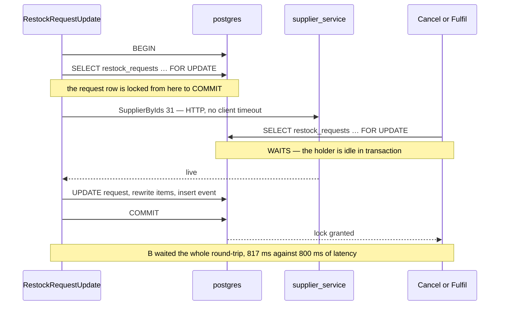

# RestockRequestUpdate — concurrency audit

**Verdict:** ✅ **fixed the same day** (2026-10-07) — the supplier is now asked BEFORE the transaction and the answer
judged under the lock, as [Proposed change](#proposed-change) recommends; Create's call moved above its transaction too.
Re-proved by the inverted race tests below. *Was:* 🔴 unsafe — an edit that changes the supplier held the request's
row lock while it waited for supplier_service, so a Cancel or a warehouse Fulfil waited out the round-trip.

> Fixed rather than discussed because the defect was introduced by the same pass that moved the supplier out — the
> check had been a local read — and the fix decides nothing: same rule (only a changed supplier is checked), same
> errors, no schema. The report stays as the before/after record.
**Proved:** 2026-10-07 · `inventory_service/inventory_v1/restock_request_update.go` · `restock_request_supplier_race_test.go` (`-tags raceaudit`)
**Isolation:** READ COMMITTED

| | |
| --- | --- |
| race | 1 edit pointing the request at a new supplier, with supplier_service taking 800 ms to answer, and 1 Cancel of the same request sent 50 ms later |
| result | the Cancel took **817 ms**, so it waited out the whole round-trip. The data stays correct (the request ends cancelled, supplier 31) |
| interleaving | `Block` held: B (Cancel) blocked on `restock_requests … FOR UPDATE`. The holder, A, was **`idle in transaction`**: waiting on the network, not on Postgres |

The data never goes wrong. This is pattern 6 of the skill (*a lock held across a foreign call*), which is unsafe
by the skill's rule whatever the data does. The lock is only held when the supplier **changes**. An edit that
re-sends the supplier the request already has never makes the call.

---

## The losing interleaving



---

## What the handler does

| Step | Statement | Locks | Safe? |
| --- | --- | --- | --- |
| 1 | `BEGIN` | — | |
| 2 | `SELECT * FROM restock_requests WHERE id = ? AND requesting_team_id = ? … FOR UPDATE` | the request row | ✅ status re-checked under it |
| 3 | `SupplierChecker.SupplierIsLive`, only when the supplier **changes**. In production this is `SupplierByIds` over Connect | **holds step 2's lock** | 🔴 a network round-trip inside the lock |
| 4 | `UPDATE restock_requests SET …` (column map) | same row | ✅ |
| 5 | `INSERT restock_request_events` · `DELETE` + `INSERT restock_request_items` | the request's items | ✅ parent → child, per [lock-order.md](lock-order.md) |
| 6 | `COMMIT` | releases all | |

---

## Findings

### 1. The request row is locked across a call to supplier_service 🔴

Pattern 6. Step 2 locks the request, then step 3 makes an HTTP call to another service before anything else is
written. Every writer that starts at this row waits for that call. That is `RestockRequestCancel`, and
`RestockRequestFulfill` too, so a warehouse person accepting the delivery at the dock waits on a seller's
supplier lookup.

```
| # | tx | step                                                              | took  | outcome                                      |
| 1 | A  | A: RestockRequestUpdate → supplier 31 — locked, asking supplier_service | 672ms | ⏸ blocked (parked in the call) → ok         |
| 2 | B  | B: RestockRequestCancel of the same request — waits on A              | 380ms | ⏸ blocked, released on the other commit → ok |
| 3 | C  | C: who holds B's lock? — then supplier_service answers                 | 35ms  | ok                                           |
waiter ← holder (holder is "idle in transaction")
  waiting:       SELECT * FROM "restock_requests" WHERE id = $1 AND requesting_team_id = $2 … FOR UPDATE
  holder's last: SELECT * FROM "restock_requests" WHERE id = $1 AND requesting_team_id = $2 … FOR UPDATE

timed race, pool, no lock_timeout:  update 808ms · cancel 817ms · supplier_service latency 800ms
```

**How long it can last** (read, not raced): `internalHTTPClient` is `http.DefaultClient`, which has no timeout, and the
`http.Server` sets none either. The lock is bounded only by the inbound request's context. If supplier_service hangs,
the row stays locked until the browser gives up.

**→ Recommend:** ask supplier_service **before** the transaction, and only *enforce* the answer under the lock. The
logic stays the same, and nothing is locked while the question is in flight. I'd pick option 1.

| Option | Cost |
| --- | --- |
| **1. Ask first, enforce under the lock** ← I'd pick | before `Transaction`: if `supplier_id != 0`, call `SupplierIsLive` and keep `(live, err)`. Inside, after the lock: `if !unchanged { if err != nil → err; if !live → NotFound }`. One extra lookup on edits that keep their supplier, with nothing locked. A supplier_service outage still breaks only edits that *change* the supplier, as today |
| 2. Plain read, then call, then lock | read `supplier_id` without a lock, call only on a change, then `FOR UPDATE` and re-check that `supplier_id` did not move in between (else ask again or return `Aborted`). No extra lookup, but more code, and a retry path that is rarely exercised |
| 3. A timeout on the internal client (e.g. 3 s) | a backstop, not a fix. It caps the wait, and the lock is still held across the network |

### 2. The supplier can be deleted between the answer and the commit ✅ not a defect

Proved on `RestockRequestCreate`, and `Update` has the same window: supplier_service answers *live*, then the supplier
is deleted and that commits, then the restock commits naming it. No lock can span two services.

```
| 1 | A | RestockRequestCreate — supplier_service says live, the answer is in flight | ⏸ → ok |
| 2 | B | SupplierDelete in supplier_service                                          | ok     |
| 3 | B | COMMIT                                                                      | ok     |
| 5 | A | COMMIT                                                                      | ok     |
end state: a restock naming the supplier, created 5ms after the supplier's deleted_at
```

The end state is *restock first, then delete*. The system already keeps that state on purpose: a deleted supplier
stays resolvable, and `TestRestockRequest_UpdateKeepsDeletedSupplierItAlreadyHad` keeps a request's deleted supplier.
Only the timestamps disagree with the commit order.

**→ Recommend:** leave it. Option 1 above widens this window by the length of the transaction (milliseconds), and the
same argument still holds.

---

## Lock order

| Acquired | Table | Rows | Obeys the service hierarchy? |
| --- | --- | --- | --- |
| 1st | `restock_requests` | the request, `FOR UPDATE` | ✅ |
| — | *(supplier_service, over HTTP)* | — | 🔴 inside the lock |
| 2nd | `restock_request_items` | the request's items, delete + insert | ✅ |
| 3rd | `restock_request_events` | one insert | ✅ |

No distributed deadlock today: `SupplierByIds` is a plain `SELECT` on `suppliers` and cannot wait on an inventory lock.

---

## Proposed change

<!-- A PROPOSAL. Not applied by the audit (HARD RULE 8). -->

```go
// backend/services/inventory_service/inventory_v1/restock_request_update.go — option 1
newID := req.Msg.GetSupplierId()

var live bool
var liveErr error

if newID != 0 {
	live, liveErr = s.suppliers.SupplierIsLive(ctx, teamID, newID) // nothing is locked yet
}

err := s.db.WithContext(ctx).Transaction(func(tx *gorm.DB) error {
	// … FOR UPDATE, status check as today …
	if newID != 0 && !(rr.SupplierID != nil && *rr.SupplierID == newID) {
		if liveErr != nil {
			return liveErr
		}
		if !live {
			return errRestockSupplierMissing
		}
	}
	// … rest unchanged …
})
```

What it costs: one supplier_service lookup on edits that keep their supplier, with no lock held, so nobody waits on
it. `TestInterleave_RestockRequestUpdate_HoldsTheRequestLockAcrossTheSupplierCall` should then fail its `Block`: B
returns at once. That is the regression test turning green the other way, and it would be rewritten to assert it.

`RestockRequestCreate` makes the same call inside its `Transaction`, but before any statement. It is proved to hold
**no** lock during the call (`TestRace_RestockRequestCreate_HoldsNoLockDuringTheSupplierCall`: 1 backend idle in
transaction, 0 locks). It does pin a pooled connection for the round-trip. Moving that call above `Transaction` is
free and removes the pin.

---

## Suspected, not proved

- [ ] **Connection pinning under a supplier_service brownout.** Each in-flight edit, and each create naming a supplier,
  holds one connection idle in transaction. The pool has no `SetMaxOpenConns`, so under a brownout those connections
  pile up towards Postgres's `max_connections`, and every service shares that database. Not raced. It needs a slow
  supplier_service and real concurrency.
- [ ] **A cycle Postgres cannot see.** If `SupplierByIds` ever took a lock, or supplier_service ever called back into
  inventory while this lock is held, a deadlock would run through HTTP. Postgres's detector would never fire, and both
  sides would hang until a context is cancelled. It is impossible today because the call is a plain read. Option 1
  removes the possibility.

---

## Not proved

- `RestockRequestFulfill` waiting on it. It takes the same `FOR UPDATE` first ([lock-order.md](lock-order.md)), so
  this was read, not raced. Only Cancel was raced
- behaviour with the real Connect client and the access interceptor in the path. The fake parks in-process
- a supplier_service that errors rather than hangs (the error returns and the tx rolls back. Read, not raced)

---

## Open questions

- [ ] **Option 1 (ask first) or option 2 (plain read, then lock and re-check)?** I'd pick 1: it is a smaller diff,
  has no retry path, and its only cost is an unlocked lookup on edits that keep their supplier.
- [ ] **Give `internalHTTPClient` a timeout?** It affects every cross-service call in the process, not just this one,
  so it is a separate decision. It is worth having as a backstop either way.

---

## History

| Date | Race | Result | Change |
| --- | --- | --- | --- |
| 2026-10-07 | Interleave Update ∥ Cancel (5/5), timed 2-way race (5/5) | Cancel waited 817 ms on an 800 ms supplier_service call. Holder `idle in transaction`. Data correct | first audit, after the-supplier-gets-its-own-service turned the in-transaction `supplierExists(tx, …)` read into an RPC |
| 2026-10-07 | `TestRace_RestockRequestUpdate_ACancelDoesNotWaitForTheSupplierRoundTrip`, `TestRace_RestockRequestCreate_HoldsNoTransactionDuringTheSupplierCall` | Cancel **56 ms** on the same 800 ms call; the update then refuses FailedPrecondition (the request is cancelled). Create: 0 backends idle in transaction, 0 locks | ✅ fixed — `askSupplier` before the transaction, the answer judged under the lock; Create asks before `Transaction`. The interleave test that asserted the lock was held was removed with the defect |
