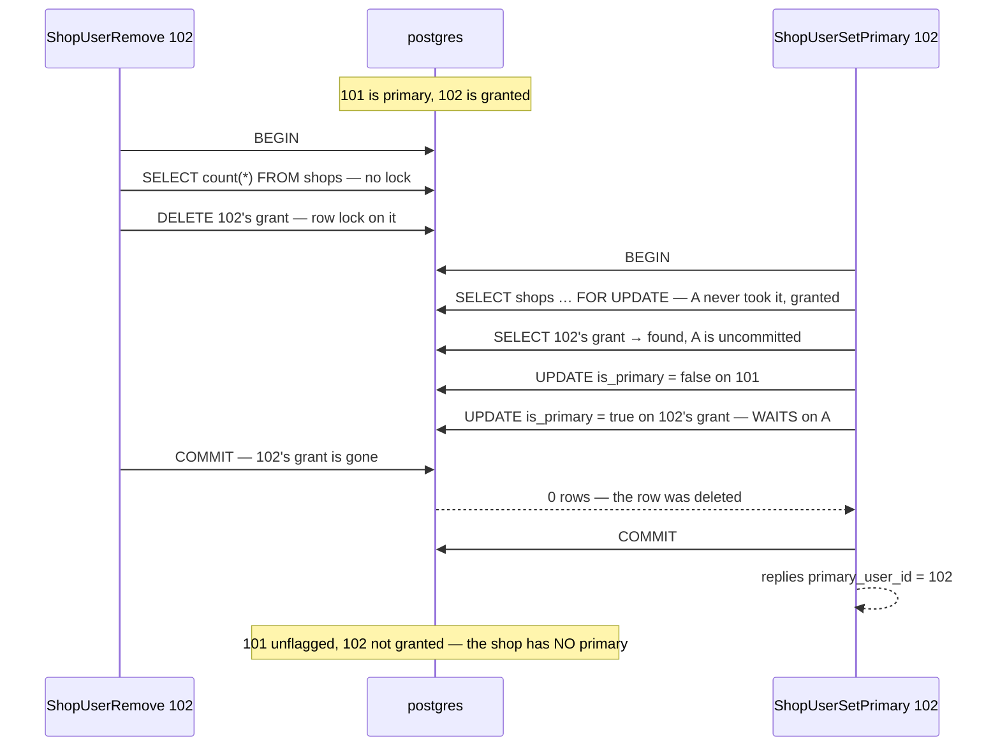

# ShopUserSetPrimary — concurrency audit

**Verdict:** ✅ **fixed 2026-09-29, with option 2**: the set must land, or the whole change rolls back. Was 🟡
unsafe (low impact): a Make primary that raced the removal of the same user's grant replied success, cleared the old
primary, and flagged nobody.
**Proved:** 2026-09-29 · `selling_service/selling_v1/shop_user_set_primary.go` · `shop_user_set_primary_race_test.go` (`-tags raceaudit`)
**Isolation:** READ COMMITTED

| | |
| --- | --- |
| race | `TestInterleave_ShopUserSetPrimary_GrantRemovedMeanwhile`: 101 primary, 102 granted, then Remove 102 in parallel with Make primary 102 |
| result | Make primary replied OK with `primary_user_id = 102`, yet the shop ends as grants `[101]`, primaries `[]`: 101 lost its flag and nobody was set. Reproduced in 10 of 10 runs |
| interleaving | B **did** block (on the row A deleted), was released when A committed, then committed without re-checking |

What holds: 8 Make primary calls at once, 10 rounds, 20 runs, always end with exactly one primary, 0 errors and no
unique violation. A second Make primary waits on `lockShop` and re-reads after it
(`TestInterleave_ShopUserSetPrimary_SecondWaitsAndReReads`). The only hole is `ShopUserRemove`, which never takes the
shop row.

---

## The losing interleaving



---

## What the handler does

| Step | Statement | Locks | Safe? |
| --- | --- | --- | --- |
| 1 | `SELECT id FROM shops … FOR UPDATE` (`lockShop`) | the shop row | ✅ against Add and Make primary. ⚠ Remove never takes it |
| 2 | `SELECT * FROM shop_users WHERE shop_id = ? AND user_id = ? LIMIT 1` — *is 102 granted?* | none | 🔴 the check. Remove can delete the row right after it |
| 3 | `UPDATE shop_users SET is_primary = false WHERE shop_id = ? AND is_primary AND user_id <> ?` | the old primary's row | acts on step 2 |
| 4 | `UPDATE shop_users SET is_primary = true WHERE id = ?` | the grant's row: waits on Remove's delete | ✅ 0 rows → `errNotGranted`, and step 3 rolls back (fixed). Was 🔴: 0 rows, never checked |
| 5 | `SELECT * FROM shops WHERE id = ?`, then the reply sets `primary_user_id = userID` | none | replies what was asked, not what the row holds |

---

## Findings

### 1. Make primary acts on a grant check that ShopUserRemove can invalidate — ✅ fixed

✅ **Option 2 applied (2026-09-29)**, because it changes no lock and a lock change is a discussion. Step 4 now
requires `RowsAffected == 1`, and otherwise returns `errNotGranted`, so the rollback undoes step 3 and 101 keeps its
flag. The regression test passes: B `FailedPrecondition`, grants `[101]`, primaries `[101]`. Option 1 is still the
cleaner shape, since it refuses at the check instead of clearing and undoing, and it is the open question below. What
follows is the finding as proved.

This is pattern 2, check-then-act. B reads the grant *before* A's delete (step 2), and its write *after* it (step 4)
blocks on and then sees that delete. That dependency cycle has no serial order. A committed first, so the serial
answer is: *Make primary is refused (102 has no grant) and 101 keeps its flag.* What B commits instead (old primary
cleared, nobody set) is not the effect of any successful Make primary.

```
| # | tx | step                                                          | took  | outcome                                        |
| 1 | A  | A removes 102's grant                                          | 1ms   | ok                                             |
| 2 | B  | B makes 102 primary — its flag UPDATE waits on the row A deleted | 303ms | ⏸ blocked, released on the other commit → ok |
| 3 | A  | COMMIT                                                         | 2ms   | ok                                             |
| 4 | B  | COMMIT                                                         | 2ms   | ok                                             |
after both commits: B's error <nil>, B's reply primary_user_id=102, grants [101], primaries []
```

**Why it matters:** a shop with no primary cannot import
([a-shop-with-no-primary-cs-cannot-import](../../../../docs/business/settlement/settlement_importer_decision.md#a-shop-with-no-primary-cs-cannot-import)).
Its statements are refused until someone makes a primary, and the admin was just told 102 is primary.
**Why only 🟡:** the table's rules both hold (at most one primary, a flag only on a grant), and the end state equals
*Make primary 102, then remove 102*. It needs two admins acting on the same user in the same instant.

**→ Recommend:** lock the grant at the check (option 1). That is exactly what pattern 2's *safe when* asks for.

| Option | Cost |
| --- | --- |
| **1. `FOR UPDATE` on the step 2 read** ← I'd pick | B waits at the check, then finds no grant: `FailedPrecondition`, nothing cleared. One more row lock, same hierarchy (`shops` → `shop_users`) |
| 2. require `RowsAffected == 1` at step 4, else `errNotGranted` | one line, and the rollback restores 101's flag. B still clears 101 and waits before it undoes |
| 3. `ShopUserRemove` takes `lockShop` too | makes `lockShop`'s own comment true (*"what serialises every change to the shop's primary CS"*) for every writer of `shop_users`. But Remove would then also queue behind order placements on the shop, because of the orders FK ([lock-order.md](lock-order.md#the-lock-no-grep-finds)), unless `lockShop` moves to `FOR NO KEY UPDATE` |

---

## Lock order

| Acquired | Table | Rows | Obeys the service hierarchy? |
| --- | --- | --- | --- |
| 1st | `shops` | the shop, `FOR UPDATE` | ✅ |
| 2nd | `shop_users` | the old primary's row (step 3) | ✅ under the shop lock |
| 3rd | `shop_users` | the new primary's row (step 4) | ✅ |

With option 1, the grant row would come 2nd and the old primary 3rd. No other handler locks two `shop_users` rows in
one transaction, so no inversion is possible.

---

## Proposed change

<!-- A PROPOSAL. Not applied by the audit (HARD RULE 8). -->

```go
// backend/services/selling_service/selling_v1/shop_user_set_primary.go — step 2, option 1
err = tx.
	Clauses(clause.Locking{Strength: "UPDATE"}).
	Where("shop_id = ? AND user_id = ?", shopID, userID).
	Limit(1).
	Find(&grant).
	Error
```

What it costs: a Make primary waits at the check for as long as a Remove of the same user takes (two statements, ~1 ms).
`TestInterleave_ShopUserSetPrimary_GrantRemovedMeanwhile` then passes: B is refused and 101 keeps its flag.

---

## Suspected, not proved

- none

---

## Not proved

- `ShopUpdate` / `ShopDelete` racing it: both UPDATE the shop row, which conflicts with `lockShop`. Read, not raced
- the handlers' behaviour once shops move to `shop_service`
  ([the-shop-gets-its-own-service](../../../../docs/business/shop/context_decision.md#the-shop-gets-its-own-service)):
  the hierarchy and this fix must move with them
- behaviour under connection-pool exhaustion
- a lock inversion against another service: this handler calls none

---

## Open questions

- [ ] **Move from option 2, applied, to option 1**, locking the grant at the check? I would still pick 1: it refuses before
  clearing anything. Or **3**: make `lockShop` the one lock for every change to a shop's grants, with
  `ShopUserRemove` taking it too, which pairs with `FOR NO KEY UPDATE`
  ([the-lock-no-grep-finds](lock-order.md#the-lock-no-grep-finds)).

---

## History

| Date | Race | Result | Change |
| --- | --- | --- | --- |
| 2026-09-29 | Interleave: Remove 102 ∥ Make primary 102, 10/10 | reply "102 primary", shop left with none, 101 unflagged | first audit |
| 2026-09-29 | the same Interleave, and the whole selling suite ×5 | B `FailedPrecondition`, grants `[101]`, primaries `[101]` · every test green | option 2: `RowsAffected == 0` at step 4 → `errNotGranted`, and the rollback restores 101's flag. No lock changed |
