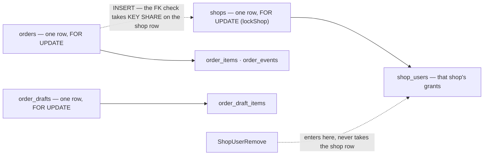

# selling_service — lock order

The service-wide matrix that the `audit-sql` skill writes unconditionally. It is not a finding: it is the reference
the next write handler is checked against.

| | |
| --- | --- |
| Isolation | READ COMMITTED (Postgres default; nothing in this repo raises it) |
| Last swept | 2026-09-29, adding the primary CS (`lockShop` in `ShopUserAdd` and `ShopUserSetPrimary`) |

**Verdict: two hierarchies, no inversion, and one hole.** The shop side locks `shops` before `shop_users`. The order
side locks one `orders` or `order_drafts` row before its children. No handler takes the two sides in opposite orders.
⚠ `ShopUserRemove` writes `shop_users` without the shop row, which is the
[ShopUserSetPrimary](ShopUserSetPrimary.md) finding.

---

## The hierarchy



Parent before child. A handler may enter part-way down, but never in a different relative order.

## Per handler, in acquisition order

| Handler | Locks, in order | Notes |
| --- | --- | --- |
| `ShopUserAdd` | `shops` (`FOR UPDATE`) → `shop_users` (its new row: INSERT, then the flag UPDATE) | the INSERT's FK takes KEY SHARE on the shop row it already holds |
| `ShopUserSetPrimary` | `shops` (`FOR UPDATE`) → `shop_users`: the old primary, then the new one | ⚠ its grant check before them takes no lock ([finding](ShopUserSetPrimary.md)) |
| `ShopUserRemove` | `shop_users` (1 row, DELETE) | ⚠ **no** shop row, so it enters part-way. Its own write is safe, but it is what makes Make primary's check go stale |
| `ShopUpdate` · `ShopDelete` | `shops` (1 row: UPDATE, i.e. a NO KEY UPDATE lock) | conflicts with `lockShop`, so both serialise with the grant writers |
| `ShopCreate` | none: an INSERT | `shops_team_code_active_unique` refuses a duplicate code |
| `OrderCreate` · `OrderDraftPromote` (`placeOrder`) | `orders` INSERT → KEY SHARE on `shops` (the FK) → `order_items` · `order_events` → promote only: `order_drafts` DELETE → **`stock.Pick` inside the transaction** | pattern 6 by design (#149): every lock here is held across the inventory call |
| `OrderCancel` | `orders` (`FOR UPDATE`) → UPDATE → `order_events` → **`stock.Return` inside the transaction** | pattern 6 by design (#70) |
| `OrderConfirm` · `OrderPick` · `OrderPack` · `OrderShip` | `orders` (1 row, `FOR UPDATE`) → UPDATE → `order_events` | |
| `OrderDraftPush` | `order_drafts` (1 row by team, source and external id, `FOR UPDATE`) → `order_draft_items` | a new draft is backed by `order_drafts_external_ref_idx`, and the handler maps its duplicate |
| `OrderDraftUpdate` | `order_drafts` (1 row, `FOR UPDATE`) → `order_draft_items` | |
| `OrderDraftDelete` | `order_drafts` (n rows in one `DELETE … WHERE id IN`) → items by cascade | one statement, index order |

`shop_users_one_primary_idx` (one primary per shop) is a backstop that never fired in any race below. If it ever did,
`dbError` would report it with its generic unique-violation message: *"a shop with this code already exists"*.

---

## the-lock-no-grep-finds

`INSERT INTO orders` checks `orders.shop_id → shops(id)` with a `FOR KEY SHARE` on the shop's row. KEY SHARE
conflicts with exactly one mode: `FOR UPDATE`, which is the one `lockShop` takes.

| Proved | |
| --- | --- |
| a grant change holds back an order on the shop | `TestInterleave_LockShop_HoldsBackAnOrderOnTheShop`: the order INSERT blocked, released on the grant's commit |
| an order in flight holds back a grant change | `TestInterleave_LockShop_WaitsForAnOrderInFlight`: `lockShop` blocked until the order's transaction ended |
| `FOR NO KEY UPDATE` keeps grant changes serial and lets the order through | `TestInterleave_LockShop_NoKeyUpdateLetsTheOrderThrough`: the order did not wait, and a second NO KEY UPDATE still did |

It cannot deadlock: `lockShop` is the **first** lock both grant writers take, so they hold nothing while they wait.
The cost is waiting. `placeOrder` holds its KEY SHARE across `stock.Pick`, so a grant or Make primary on a busy shop
waits for every order being placed on it (each an inventory round trip), and new orders on that shop stall while the
grant holds the row.

**→ Recommend:** use `clause.Locking{Strength: "NO KEY UPDATE"}` in `lockShop`. It still conflicts with itself and
with `ShopUpdate`/`ShopDelete`'s UPDATE, so every guarantee `lockShop` gives today holds, and it stops conflicting with
the FK. Proved on raw SQL above; not applied (HARD RULE 8).

---

## Proved

| Test | Shows |
| --- | --- |
| `TestRace_ShopUserAdd_ManyUsersOnAShopWithNoPrimary` | 8 grants at once × 10 rounds: 8 grants, **exactly one** primary, 0 errors, and a different winner from round to round |
| `TestRace_ShopUserAdd_SameUserAtOnce` | one user 8× at once: 1 grant, it is primary, 0 errors |
| `TestInterleave_ShopUserAdd_SecondGrantWaitsForTheFirst` | **the proof `lockShop` holds.** B blocked on `SELECT "id" FROM "shops" … FOR UPDATE` (named via `pg_blocking_pids`), re-read after A committed, and left 102 unflagged |
| `TestInterleave_ShopUserAdd_WhileThePrimaryIsRemoved` | Remove takes no shop lock, so the grant does not wait. The end state (no primary) is serializable as *grant, then remove*, so it is not a finding |
| `TestRace_ShopUserSetPrimary_ManyUsersAtOnce` | 8 Make primary × 10 rounds: exactly one primary, 0 errors, no unique violation |
| `TestInterleave_ShopUserSetPrimary_SecondWaitsAndReReads` | B blocked, then cleared A's 102 rather than the 101 it had seen before the lock, with no 23505 |
| `TestInterleave_ShopUserSetPrimary_HoldsBackAGrant` | the two handlers share the one lock |
| `TestRace_ShopUserSetPrimary_AgainstGrantsAndRemovals` | 12 mixed callers × 10 rounds: at most one primary, only `FailedPrecondition` refusals, no deadlock |
| ✅ `TestInterleave_ShopUserSetPrimary_GrantRemovedMeanwhile` | the [finding](ShopUserSetPrimary.md)'s regression test. It failed by design, and passes since option 2 was applied (2026-09-29) |

Every passing test ran `-count=20` clean.

```sh
go test -tags raceaudit -run 'TestRace_ShopUser|TestInterleave_ShopUser|TestInterleave_LockShop' -v ./backend/services/selling_service/selling_v1/
```

---

## Seen while sweeping, not audited

- **`OrderDraftPromote`** reads the draft *outside* its transaction, and the draft DELETE inside `placeOrder` does not
  check `RowsAffected`. Two promotes of one draft look able to both place an order, and both pick stock. Suspected,
  not raced: it is outside this pass.

## Not proved

- the order handlers were read, not raced
- an inversion against another service: `placeOrder` and `OrderCancel` call inventory inside their transaction
- the move to `shop_service`
  ([the-shop-gets-its-own-service](../../../../docs/business/shop/context_decision.md#the-shop-gets-its-own-service)):
  this hierarchy moves with it
