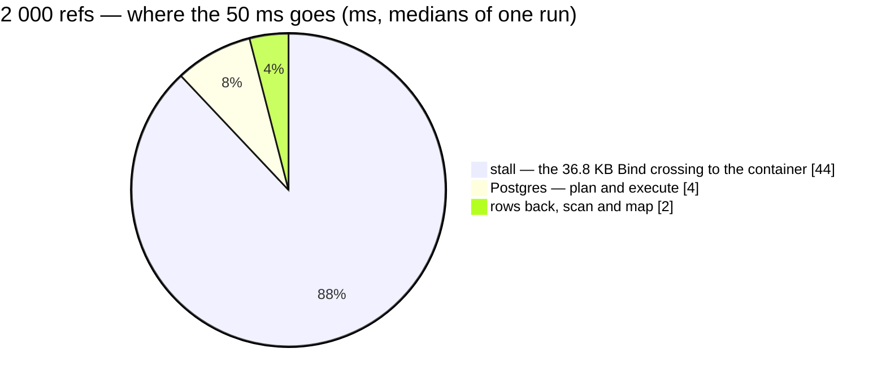

# OrderByExternalRefs — performance audit

**Verdict:** 🟡 heavy — at the contract's cap (2 000 refs) one answer is 1 900 rows, and the query measures 50 ms. The rows are real. Most of the 50 ms comes from this machine's connection to Postgres, not from the query.
**Measured:** 2026-09-29 · `selling_service/selling_v1/order_by_external_refs.go` · seed 50 000 rows in `orders` (5 teams × 10 000, 80% carrying a marketplace ref, 1% a re-used one) · warm, median of 5

| | 20 refs | 2 000 refs |
| --- | --- | --- |
| wall | 0.56 ms | 50.6 · 58.1 · 60.7 ms (three runs) |
| Postgres — EXPLAIN plan + execute | 0.1 + 0.1 ms | 1.3 + 3.0 ms |
| in Go (wall − db) | ~0 | 0.5–1.0 ms |
| queries | 1 | 1 |
| rows answered | 18 | **1 900** |
| response | ~0.8 KB proto · 2.9 KB JSON | ~84 KB proto · ~300 KB JSON |

✅ **No N+1.** There is one query at 20 refs and one at 2 000.

<!-- `title` is its OWN line — `pie showData title …` does not parse. Run `cd frontend && npm run lint:mermaid`. -->



---

## Queries

| # | What | Rows | Time | Plan | Verdict |
| --- | --- | --- | --- | --- | --- |
| 1 | `SELECT id, shop_id, status, created_by_user_id, order_external_ref_id FROM orders WHERE team_id = ? AND order_external_ref_id <> '' AND order_external_ref_id IN (…)` @ 20 | 18 | 0.5 ms | Index Scan `orders_team_external_ref_idx` | ok |
| 1 | the same @ 2 000 | 1 900 | 50 ms | Bitmap Index Scan `orders_team_external_ref_idx` → Bitmap Heap Scan | the plan is right — see finding 2 |

---

## Findings

### 1. The answer at the cap is 1 900 rows 🟡

The contract allows 2 000 refs per call (`max_items`, *"a statement's worth"*), and every order a ref finds is
answered. So the answer grows with the statement: at the cap it is 1 900 rows, ~84 KB as proto and ~300 KB as JSON.
That crosses the skill's 1 000-row line. The request bounds it, the data does not, which is why it has no
`PageFilter`. The one exception: a re-entered ref answers two orders.

**→ Recommend:** keep the 2 000 cap, and write the exemption into the proto beside `max_items`: bounded by the
request, one call per file, ~5 ms of real work (finding 2). A 1 000 cap would split the largest real file
(~1 500 refs) into two calls with no measured gain.

### 2. The 50 ms comes from the path to the container, not from the query ⚪

The plan is a Bitmap Index Scan on `orders_team_external_ref_idx` over 1 900 rows: 1 105 heap blocks, every buffer a
hit, 1.3 ms planning, 3.0 ms execution. The other ~45 ms appears on this Windows host whenever a **Bind message is
larger than ~16 KB, whatever the query**:

| sent (`perfRefsWhereTheTimeGoes`) | median, over two runs |
| --- | --- |
| the handler, with no probe attached | 50.1 · 53.1 ms |
| the same SQL as a literal, every row back (parsed once, then cached) | 6.5 · 4.8 ms |
| the same query through database/sql + pgx directly, 2 001 placeholders | 55.6 ms: not GORM |
| one `text[]` parameter (`= ANY(?)`) instead of 2 000 | 56.0 ms: same bytes, same stall |
| `SELECT length($1)` with a 36 812-byte parameter, so nothing to plan or return | **50.0 · 49.6 ms** |
| `SELECT length($1)` with a 16 000-byte parameter | 0.5 · 0.8 ms |

A bound ref costs ~22 bytes, so the Bind crosses 16 KB at about 750 refs.

```
Bitmap Heap Scan on orders  (actual time=1.898..2.916 rows=1900 loops=1)
  Recheck Cond: ((team_id = 20000) AND (order_external_ref_id = ANY ('{…}'::text[])))
  Heap Blocks: exact=1105
  Buffers: shared hit=1170
  ->  Bitmap Index Scan on orders_team_external_ref_idx  (actual time=1.787..1.787 rows=1900 loops=1)
Planning Time: 1.311 ms
Execution Time: 3.000 ms
```

**→ Recommend:** no change to the RPC. Measure again on Linux (CI's Postgres container) before acting on the 50 ms.
If the stall shows up there too, the only lever is a smaller Bind: have the importer send ~700 refs per call. One
array parameter carries the same bytes, so it does not help.

---

## Proposed migration

None. The plan uses `orders_team_external_ref_idx` (00014) at both sizes.

---

## Not measured

- a Linux host or the production network path: the stall was measured only on Windows + Docker Desktop
- sub-millisecond figures are at this host's clock resolution (steps of 0.5–1 ms are common); at 20 refs, EXPLAIN's
  server times are the reliable ones
- concurrency (single caller)
- cache-cold behaviour: every buffer was a hit
- production distribution: the seed is uniform, while a real team's refs cluster by marketplace and date
- the importer's side: decoding a ~300 KB JSON answer (~84 KB if the call is binary proto)

---

## Open questions

- [ ] Accept a 2 000-row answer as this lookup's designed maximum (keep the cap, record the exemption in the proto)? I
  would pick this. The alternative is to cap refs at 1 000 and have the importer chunk.

---

## History

| Date | Median | Queries | Change |
| --- | --- | --- | --- |
| 2026-09-29 | 0.56 ms @ 20 · 50.6–60.7 ms @ 2 000 (~5 ms of it the query) | 1 | first audit |
