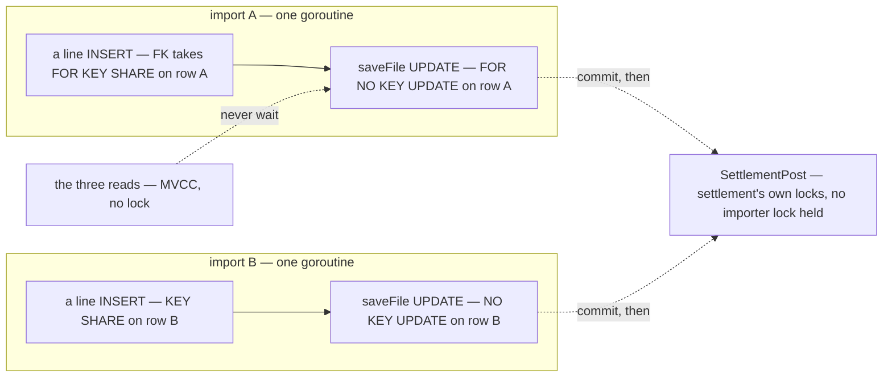

# settlement_importer_service — lock order

This is the service-wide matrix the `audit-sql` skill writes unconditionally. It is not a finding. It is the reference the **next** write handler is checked against.

| | |
| --- | --- |
| Isolation | READ COMMITTED (the Postgres default; nothing in this repo raises it) |
| Last swept | 2026-09-29 — `ShopeeSettlementImport`, `TiktokSettlementImport` (the only writers) |

**Verdict: the service takes no lock of its own and opens no transaction.** Every write is ONE statement in GORM's default per-statement transaction, on the import's **own** `uploaded_files` row or one of its lines. At most one implicit row lock is held at a time, for one statement, so no inversion is possible. Nothing in the service calls `Transaction(`, `FOR UPDATE` or `clause.Locking`.



| Handler | Lock order | Notes |
| --- | --- | --- |
| `ShopeeSettlementImport` | *(none explicit)*. Per line: `uploaded_file_lines` INSERT (its FK takes **FOR KEY SHARE** on its own `uploaded_files` row), then `uploaded_files` UPDATE (**FOR NO KEY UPDATE** on the same row). Each is its own transaction | KEY SHARE and NO KEY UPDATE do not conflict, even on one row (proved below) |
| `TiktokSettlementImport` | the same path: `importStatement` → `runStatement` → `importLine` | |
| `UploadedFileList` · `UploadedFileByIds` · `UploadedFileLineList` | *(none)* — MVCC reads | a read never waits on an import |

No importer statement is open across a foreign call. `ShopAccessCheck`, `document_service`, `OrderByExternalRefs` and `SettlementPost` are all called **between** statements, never inside one (pattern 6 does not apply).

---

## What it relies on

| Relies on | For | Proved by |
| --- | --- | --- |
| **settlement's unique posting key**: `SettlementPost` answers *already there* for a key it has | the ONLY dedupe ([the-row-key-is-the-only-dedupe](../../../../docs/business/settlement/settlement_importer_decision.md#the-row-key-is-the-only-dedupe)). Two uploads of one statement at once must create each key once | settlement's own races: `TestRace_SettlementPost_AbsorbsConcurrentRetries`, and `TestRace_ImportedShopRow_SameKeyWritesOnce` (in progress when this was written). Here the ledger is a locked fake, so what is proved is the importer's side of it: each key reaches the ledger once per upload, and every copy records the same ledger row |
| **one writer per `uploaded_files` row**: the goroutine that created it | `saveFile` writes the tallies as **absolute** values from Go counters (`rows_posted = 5`), not increments | `TestInterleave_TalliesAreKeptByOwnershipNotByTheRowLock`: a second writer waits on the row lock until the first commits, **then overwrites** (5 + 3 reads 3) |
| **BIGSERIAL** ids | N uploads become N rows | the races |

---

## ⚠ The one thing worth watching — the single writer

Every `uploaded_files` row has exactly ONE writer today. The handler creates it, then hands it to one detached goroutine, and `fail` / `recoverImport` run in that same goroutine. No handler, sweeper or retry touches another import's row. A re-upload is a **new** row ([the-row-key-is-the-only-dedupe](../../../../docs/business/settlement/settlement_importer_decision.md#the-row-key-is-the-only-dedupe)).

**→ Why it matters:** the row lock does **not** protect the tallies. It serializes two writers and then lets the last one win, silently. The first writer that is not the import itself turns `saveFile` into a lost update. Examples: a sweeper that marks INTERRUPTED rows `failed`, a Resume or Retry that re-runs a row, a Cancel.

**→ Recommend:** before adding any second writer, move the tallies to increments (`rows_posted = rows_posted + ?`). The interleave shows that form keeps both counts (5 + 3 reads 8). Option C of the [performance audit](../performances/ShopeeSettlementImport.md) does this anyway. And lock nothing on this row `FOR UPDATE`: a plain UPDATE takes NO KEY UPDATE, which lets the file's line INSERTs through, but FOR UPDATE would block them.

---

## Proved

| Test | Setup | Result, ×20 runs |
| --- | --- | --- |
| `TestRace_ShopeeSettlementImport_SameFileEightTimes` | 8 uploads of one 60-row statement, released together. Half the watchers close the tab after row 1. Ledger delayed 2 ms per post | 8 rows DONE, each row's tallies = its own lines, line_no 1..60 once per file, **55 keys created once each** |
| `TestRace_TiktokSettlementImport_SameFileEightTimes` | 8 × a 46-line TikTok statement (fund + affiliate_fee pairs) | 8 rows, **42 keys created once each** |
| `TestRace_SettlementImports_ShopeeAndTiktokAtOnce` | 4 Shopee + 4 TikTok uploads on one importer | each platform exact, no line under another platform's file |
| `TestInterleave_TwoImportsNeverWaitOnEachOther` | two imports mid-transaction, including a line under the other's locked row | **no step blocked**: no contention between imports |
| `TestInterleave_TalliesAreKeptByOwnershipNotByTheRowLock` | a hypothetical second writer | blocked until the first committed, then overwrote (reads 3). The increment form reads 8 |

Also run under `go test -race` ×3: no data race in the detached goroutine, the stream window (`streamSink`), or 8 streams at once. `setup_test.go`'s `fakeOrders` and `fakeStore` append without a lock, so the races use locked stand-ins. The shop fake is read-only and the ledger fake is locked.

```sh
go test -tags raceaudit -run "TestRace_|TestInterleave_" -count=20 -v ./backend/services/settlement_importer_service/settlement_importer_v1/
```

---

## Not proved

- **The ledger under concurrent same-key posts**: faked here. That is settlement's audit.
- **A server stopped between a line's INSERT and its tally UPDATE**: they are two transactions, so the dead row's tally is one behind its lines. The row reads INTERRUPTED and is never written again. Not raced. Option C of the performance audit makes the pair atomic.
- **Several server instances**: each import is still one goroutine on one instance, so ownership holds. Not run.
- **The real Connect clients under many concurrent imports** (pools, timeouts): not run.
