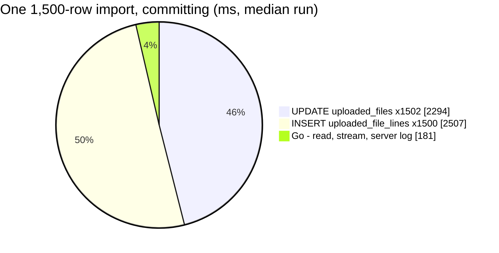
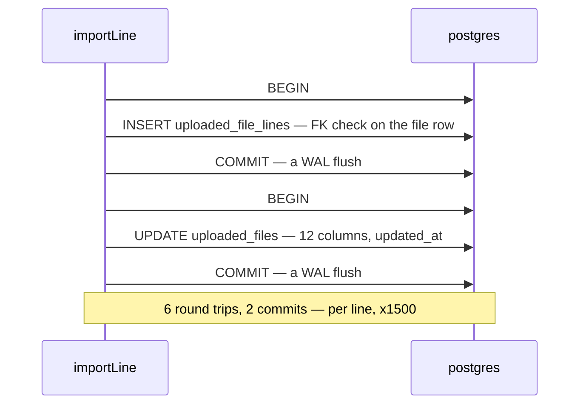

# ShopeeSettlementImport — performance audit

**Verdict:** 🔴 heavy — **by design**: every line is two statements, each in its own BEGIN … COMMIT. That makes 3,003 queries and 3,000 commits for a 1,500-row statement, and query count grows with the rows (N+1).
**Measured:** 2026-09-29 · [`import_run.go`](../../../../backend/services/settlement_importer_service/settlement_importer_v1/import_run.go) (`importLine` → `saveFile`), called through the real stream · seed 49,906 `uploaded_files` (50 teams, the audited one 3,650) + 51,500 `uploaded_file_lines` · a synthetic 1,500-row statement (the largest real one read 1,463) · shop, orders, store and **ledger faked** · warm · [`shopee_settlement_import_perf_test.go`](../../../../backend/services/settlement_importer_service/settlement_importer_v1/shopee_settlement_import_perf_test.go) (`-tags perfaudit`)

| | 150 rows | 1,500 rows | 1,500 rows, **committing** (production shape) |
| --- | --- | --- | --- |
| wall, median | 112 ms | 1.27 s | **4.98 s** (4.45 – 5.71, 3 runs) |
| db | 94 ms | 1.10 s (87%) | 4.80 s (96%) |
| in Go (wall − db) | 18 ms | 0.17 s — the reader alone is 41 ms | 0.18 s |
| queries | 303 | 3,003 | 3,003 + a BEGIN and a COMMIT around each |
| per row | 0.75 ms | 0.85 ms | **3.3 ms** |

The queries grow with the rows: 2.02 per row at 150, 2.002 at 1,500. Nothing else is heavy. There are no Seq Scans (each statement touches one row by key), no statement is slow on the server (≤ 0.13 ms), and Go is 4–13% of the wall.



---

## Queries

| # | What | ×N | Time each — rolled back / **committing** | Plan (server) | Verdict |
| --- | --- | --- | --- | --- | --- |
| 1 | `INSERT INTO uploaded_files … RETURNING id` | 1 | 0.54 / 1.6 ms | Insert — 0.048 ms | ok |
| 2 | `INSERT INTO uploaded_file_lines … RETURNING id` | **×1,500** | 0.35 / **1.67 ms** | Insert + FK trigger (0.088 ms) — 0.126 ms | 🔴 per line |
| 3 | `UPDATE uploaded_files SET <12 columns> WHERE id = ?` | **×1,502** | 0.39 / **1.53 ms** | Index Scan `uploaded_files_pkey` — 0.103 ms | 🔴 per line |

On the server each statement takes about 0.1 ms. The cost is everything around it: the round trips and the commits.

---

## Findings

### 1. Two statements and two commits per line 🔴

`importLine` writes the line (`Create`), then `saveFile` rewrites the file row's tallies and `updated_at` (`Updates`). Production opens GORM with the default config ([`deps.go`](../../../../backend/cmd/app_development/deps.go)), so each write is wrapped in its own BEGIN … COMMIT. A line therefore costs **6 round trips and 2 commits**.



**What it serves.** Under [an-import-finishes-whether-anyone-watches](../../../../docs/business/settlement/settlement_importer_decision.md#an-import-finishes-whether-anyone-watches), a `running` row whose `updated_at` stops moving for **2 minutes** reads INTERRUPTED. The rule needs one move per 2 minutes. As built, `updated_at` moves every ~3 ms, **about 40,000× more often than the rule needs**. The uploader's live progress does not depend on this write: the stream carries the in-memory tallies (`fileToProto(file, …)`). The row's tallies serve the list screen, and the record a stopped server leaves behind.

| how often `updated_at` moves | margin on the 2-minute rule |
| --- | --- |
| as built — every line | ~40,000× |
| every 5 s | 24× |
| every 30 s | 4× |

**→ Recommend: ONE statement per line (option C below).** It keeps every documented behaviour: the line and its tally are written as the import reaches them, and `updated_at` moves with every line. It halves the commits, cuts round trips from 6 to 1, and measured **2.9× faster**. It also makes the line and its tally atomic, and turns the tallies into increments. That retires the one write whose safety rests on each row having a single writer (see [lock-order.md](../concurrency/lock-order.md)). Options D and E buy more speed but change a documented behaviour, so they are the owner's call.

**The options, measured.** Committing, 1,500 lines, two runs, as bare SQL beside the handler ([`TestPerf_ImportLineWriteOptions`](../../../../backend/services/settlement_importer_service/settlement_importer_v1/shopee_settlement_import_perf_test.go)). A bare round trip (`SELECT 1`) is 0.20 ms here.

| Option | per line | 1,500 lines | Trade-off |
| --- | --- | --- | --- |
| **A** · as built | 2.76 – 2.83 ms | 4.2 s | — |
| **B** · the same two writes, `SkipDefaultTransaction` | 1.88 – 1.99 ms | 2.9 s | none in behaviour (each write is one statement, already atomic). A one-line change to a session |
| **C** · ONE statement: `WITH line AS (INSERT …) UPDATE uploaded_files SET rows_x = rows_x + ?, updated_at = NOW()` | **0.98 ms** | **1.5 s** | raw SQL in `importLine`. `updated_at` then comes from the database clock, the same clock the list's INTERRUPTED filter reads |
| **D** · the line INSERT per line, the row UPDATE on a cadence (every ≤ 5 s, and at the end) | ~1.0 ms | 1.5 s | the list's tallies for a RUNNING file lag ≤ 5 s. A stopped server leaves its row up to 5 s of lines behind its own lines. The docs say the row moves "after every line" (schema, rpc.md) |
| **E** · 50 lines per transaction (a multi-row INSERT and one UPDATE) | 0.06 – 0.10 ms | 0.1 s | a stopped server loses up to 49 line records whose ledger rows exist. The same file again records them as EXISTING, so the ledger stays right, but the dead file's page is short. That breaks "every line as the import reaches it" |

### 2. The per-line UPDATE stays HOT, with no index bloat 🟢

Measured on the committing pool: all **4,506 of 4,506** per-line UPDATEs were HOT (`pg_stat_user_tables`), so none of them added an entry to any of the table's three indexes, and none of the indexes grew. None of the 12 columns the UPDATE sets is indexed, and each committed version is pruned on the next update.

**→ Recommend:** nothing to do. The caveat is that this holds while nothing keeps an old snapshot open. Inside one long transaction (the rolled-back measurement), the version chain hopped to a new page every ~37 updates (97% HOT), and finding the row took 48 buffer reads. A long-running transaction elsewhere in production would reproduce that.

### 3. The ledger costs as much again, and is not measured here 🟡

Every posting line also makes one `SettlementPost` call, which is **faked** here. Settlement's own audit ([SettlementPost.md](../../settlement_service/performances/SettlementPost.md)) puts it at ~2.4–3.3 ms per post committing, or 3.5–5.0 s per 1,500 rows. That is the same order as the importer's own bookkeeping (4.2 s as built). So in a real import, roughly half of the database time is the importer writing down what it did.

**→ Recommend:** weigh option C against that. On these numbers, option C alone takes a 1,500-row import's database work from ~8–9 s (4.2 s importer + 3.5–5.0 s ledger) to ~5–6.5 s (1.5 s + the same ledger).

---

## Proposed change

A PROPOSAL, not applied. No migration: every option uses the existing columns and indexes.

```go
// import_run.go — importLine, option C: the line and its tally in one statement
err := s.db.WithContext(ctx).Exec(`
	WITH line AS (
		INSERT INTO uploaded_file_lines (uploaded_file_id, line_no, sheet, unique_id, …)
		VALUES (?, ?, ?, ?, …)
		RETURNING 1
	)
	UPDATE uploaded_files
	SET rows_posted = rows_posted + ?, rows_existing = rows_existing + ?, rows_held = rows_held + ?,
	    rows_skipped = rows_skipped + ?, rows_posted_to_shop = rows_posted_to_shop + ?, updated_at = NOW()
	WHERE id = ?`, …).Error
```

`saveFile` stays for the three whole-row moments: after the read, DONE and FAILED. `tally(file, &line)` stays too, because the stream reads it.

---

## Not measured

- **The real ledger, shop, orders and store**: all four are faked. See finding 3.
- **Commit cost is this machine's**: Docker Desktop on Windows, a bind-mounted data directory, `synchronous_commit = on`. The **counts** (6 round trips, 2 commits per line) carry over to production. The milliseconds will not exactly.
- **The committing run has 3 samples, not 5**: each run is 3,000 commits. The spread was 4.45–5.71 s.
- **Go's clock on this host ticks in ~0.5 ms steps**, so single statements are not timed. Every per-statement figure is a sum over 1,500 statements.
- **Many imports at once**: throughput under concurrent imports was not measured. Correctness under concurrent imports is proved in [lock-order.md](../concurrency/lock-order.md).
- **The statement mix**: the synthetic statement is ~96% order-income rows. The per-line SQL is the same for every outcome.

---

## Open questions

- [ ] **Which line-write shape?** Option C is my pick: faster and no behaviour change. Option B is a one-line fallback. D and E change what the docs promise ("updated_at moves after every line"), so either needs an owner decision and a doc update.
- [ ] **What should INTERRUPTED mean?** In every option, the heartbeat is "a line finished". Nothing bounds one ledger call (the internal clients use `http.DefaultClient`, and the detached context has no deadline). So a `SettlementPost` that hangs for more than 2 minutes reads INTERRUPTED while the import is still alive and stuck. If INTERRUPTED should mean "the process died", a ticker that touches `updated_at` every ~30 s would decouple the two. If it should mean "stalled", a per-call timeout would bound it.

---

## History

| Date | Median | Queries | Change |
| --- | --- | --- | --- |
| 2026-09-29 | 1.27 s rolled back · 4.98 s committing (1,500 rows) | 3,003 | first audit |
