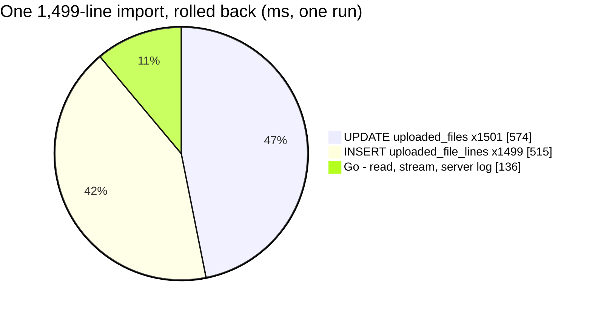

# TiktokSettlementImport — performance audit

**Verdict:** 🔴 heavy — **by design, and the same cause as [ShopeeSettlementImport](./ShopeeSettlementImport.md)**. It is the same per-line path (`importLine` → `saveFile`): 3,001 queries for 1,499 lines, and the count grows with the lines (N+1).
**Measured:** 2026-09-29 · [`tiktok_settlement_import.go`](../../../../backend/services/settlement_importer_service/settlement_importer_v1/tiktok_settlement_import.go) → [`import_run.go`](../../../../backend/services/settlement_importer_service/settlement_importer_v1/import_run.go), called through the real stream · seed 49,906 `uploaded_files` + 51,500 `uploaded_file_lines` · a synthetic TikTok week: 760 orders (700 commissioned), 19 reimbursements, 20 withdrawals, **1,499 lines** · shop, orders, store and ledger faked · warm, median of 5 · [`tiktok_settlement_import_perf_test.go`](../../../../backend/services/settlement_importer_service/settlement_importer_v1/tiktok_settlement_import_perf_test.go) (`-tags perfaudit`)

| | 150 lines | 1,499 lines |
| --- | --- | --- |
| wall, median | 145 ms | **1.30 s** |
| db | 127 ms | 1.15 s (88%) |
| in Go (wall − db) | 18 ms | 0.15 s — the reader alone is 24 ms |
| queries | 303 | 3,001 |
| per line | 0.97 ms | 0.87 ms |

Query count per line is 2.02 at 150 lines and 2.002 at 1,499. The committing cost was measured once, for Shopee, because the per-line statements are identical: **3.3 ms per line, 4.98 s per 1,500**.

---

## Queries

| # | What | ×N | Time each (rolled back) | Plan (server) | Verdict |
| --- | --- | --- | --- | --- | --- |
| 1 | `INSERT INTO uploaded_files … RETURNING id` | 1 | 0.33 ms | Insert | ok |
| 2 | `INSERT INTO uploaded_file_lines … RETURNING id` | **×1,499** | 0.34 ms | Insert + FK trigger | 🔴 per line |
| 3 | `UPDATE uploaded_files SET <12 columns> WHERE id = ?` | **×1,501** | 0.38 ms | Index Scan `uploaded_files_pkey` | 🔴 per line |

---

## Findings

### 1. Two statements and two commits per line 🔴

This is the same code, cost and decision as [ShopeeSettlementImport, finding 1](./ShopeeSettlementImport.md#findings). The per-line `saveFile` keeps `updated_at` moving for the 2-minute INTERRUPTED rule ([an-import-finishes-whether-anyone-watches](../../../../docs/business/settlement/settlement_importer_decision.md#an-import-finishes-whether-anyone-watches)) roughly 40,000× more often than the rule needs.

**→ Recommend:** the same option C (one statement per line, relative tallies), decided ONCE for both RPCs. `importLine` is shared, so one change fixes both.

### 2. A commissioned order costs two lines 🟡

Under [tiktok-affiliate-commission-posts-as-affiliate-fee](../../../../docs/business/settlement/settlement_importer_decision.md#tiktok-affiliate-commission-posts-as-affiliate-fee), each commissioned order yields a `fund` line and an `affiliate_fee` line. Both are posted, both are written and both move the row. A TikTok statement therefore makes about twice the per-line work per order that a Shopee statement does: here, 760 orders became 1,499 lines.

**→ Recommend:** nothing separate. It is the decided shape, and option C halves its cost along with everything else.

---

## Not measured

The same list as [ShopeeSettlementImport](./ShopeeSettlementImport.md#not-measured): the real ledger and clients, this machine's commit cost, Go's ~0.5 ms clock tick, and throughput under concurrent imports. The TikTok committing run was not repeated, because its statements are the Shopee ones.

---

## Open questions

- [ ] The same two as [ShopeeSettlementImport](./ShopeeSettlementImport.md#open-questions): which line-write shape, and what INTERRUPTED should mean. Each is one decision covering both RPCs.

---

## History

| Date | Median | Queries | Change |
| --- | --- | --- | --- |
| 2026-09-29 | 1.30 s rolled back (1,499 lines) | 3,001 | first audit |
