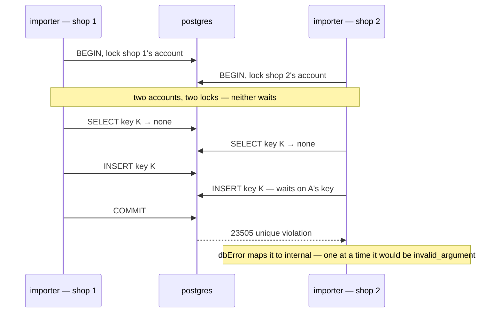

# SettlementPost — concurrency audit

**Scope:** the **imported shop row** — [settlement-asks-the-shop-for-its-primary-cs](../../../../docs/business/settlement/settlement_importer_decision.md#settlement-asks-the-shop-for-its-primary-cs): the ask before the transaction, the shop account's lock, and the idempotency key every retry races.

**Verdict:** 🟡 low — the ask holds no lock, and nothing is lost or written twice. But one key colliding across two accounts **at once** answers `internal`, where one at a time it answers `invalid_argument` — the data is right, the answer is not
**Proved:** 2026-09-29 · `settlement_service/settlement_v1/post_entry.go` + `shop_primary.go` · [`post_entry_import_race_test.go`](../../../../backend/services/settlement_service/settlement_v1/post_entry_import_race_test.go) (`-tags raceaudit`) · every passing test green 20 of 20 (`-count=20`)
**Isolation:** READ COMMITTED

| | |
| --- | --- |
| race | 2 real posters, one key, two shops of one team — 20 rounds |
| result | **20 of 20** losers answered `internal: duplicated key not allowed` — one at a time the same collision answers `invalid_argument` |
| interleaving | B's insert ⏸ blocked 307 ms on A's uncommitted key, released on A's commit into 23505 |

---

## Proved safe — what the ask could have broken

| Pattern | Test | Result |
| --- | --- | --- |
| **6 — a lock held across the ask** | `TestInterleave_ImportedShopRow_TheAskHoldsNoLock` | A's ask **parked** (⏸ 379 ms). Meanwhile B posted to the **same shop** in 40 ms, and `FOR UPDATE NOWAIT` on the shop's account succeeded. Answered, A built on B's committed balance |
| 1 — the account lock behind the ask | `…APosterHoldingTheAccountBlocksTheNext` | B asked, then ⏸ waited 313 ms at the account lock, released on A's commit — and read −3 000, not the stale −1 000: balance −6 000 |
| 1 — lost update in an import's burst | `…ABurstLosesNothingAndCountsForThePrimary` | 16 rows at once, each ask sleeping 5 ms → `last_balance` −136 000 = Σ, every link of the balance chain intact, every `user_id` the primary, every `actor_id` the uploader |
| 1 — imported and hand-posted rows on one account | `…ImportedAndManualShareOneAccount` | 16 mixed → Σ exact, only the 8 imported rows carry the primary |
| 3 — one key written twice | `…SameKeyWritesOnce` | 16 retries of one row at once → **1 row**, 1 caller told `created`, −7 000 once |
| 5 — the fold, with the new attribution | `…FoldsCrossingShopsAndPrimariesNeverDeadlock` | 2 shops × 2 primaries crossed, 8 folds at once → 0 deadlocks, every shop and user total exact |

---

## The losing interleaving



---

## What the handler does

| Step | Statement | Locks | Safe? |
| --- | --- | --- | --- |
| 0 | the ask — `ShopPrimary.PrimaryUser`, a Connect call to `ShopAccessCheck` | none — before BEGIN | ✅ proved · a FAILED ask is held, not returned: a stored row is answered at step 3, a new one refused there, before step 4 |
| 1 | `INSERT shop_settlements … ON CONFLICT DO NOTHING` | none when the account exists | ✅ |
| 2 | `SELECT shop_settlements … FOR UPDATE` | the shop's account row | ✅ serialises every poster on the shop |
| 3 | `SELECT settlement_logs WHERE unique_id = ?` | none — read under the account lock | ✅ same account · 🟡 another account's in-flight key is invisible |
| 4 | `INSERT settlement_logs` — `user_id` = the primary | the key, in `settlement_logs_unique_idx` | 🟡 23505 → `internal` on a cross-account collision |
| 5 | `UPDATE shop_settlements SET last_balance` | the account row, still held | ✅ |
| 6 | publish `SettlementLogPosted` | after COMMIT | ✅ |

---

## Findings

### 1. A key colliding across accounts at once answers internal 🟡

Pattern 3, correctly backed — the unique index holds, and the data is right: one row. But the loser's answer
depends on timing. One at a time, step 3 finds the other shop's row and refuses it as `invalid_argument`
([a-key-held-by-another-account-is-refused](../../../../docs/business/settlement/context_decision.md#a-key-held-by-another-account-is-refused)).
At once, step 3 cannot see the other account's uncommitted row, the insert waits on its key, and the 23505 is
mapped by `dbError` to `internal` — a server fault reported for a caller's key.

```
| 2 | B | B posts key K on shop 2 — … its insert waits on A's key | 307ms | ⏸ blocked, released on the other commit → unique violation: internal: duplicated key not allowed |
a key held by another shop's row: one at a time → invalid_argument · at once → internal
20 rounds of two real posters racing one key on two shops — the loser's answer: map[internal:20]
```

**→ Recommend:** map a unique violation at step 4 to `errUniqueIDTaken`. The mapping is exact, not a guess:
under the account lock a same-account retry is always found by step 3, so a 23505 at step 4 can only be
**another** account's key.

| Option | Cost |
| --- | --- |
| **`errors.Is(err, gorm.ErrDuplicatedKey)` at step 4 → `errUniqueIDTaken`** — I would pick this | one branch. Production opens GORM with `TranslateError` ([`deps.go:34`](../../../../backend/cmd/app_development/deps.go#L34)), so the sentinel is what arrives |
| leave it | the importer holds the line either way, but reads a server fault where the key is at fault |

### 2. The shop-grain lost-update test has been red since 9f20652 — ✅ fixed

✅ **Repaired 2026-09-29** — the test now gives the service a `ShopPrimary` stub, and passes: 8 of 8 posted,
`last_balance` the exact sum. What follows is the finding as it was.

`TestRace_SettlementPost_ShopGrainDoesNotLoseAnUpdate`
([`post_entry_race_test.go:196`](../../../../backend/services/settlement_service/settlement_v1/post_entry_race_test.go#L196))
posts `importer` shop rows through `NewService(db, nil, nil, nil)`. A nil `ShopPrimary` now refuses every one —
**8 of 8 `unavailable`**, so it no longer proves anything about the lost update. The `raceaudit` tag keeps it
out of CI, so nothing noticed. `…ABurstLosesNothingAndCountsForThePrimary` covers the property meanwhile.

**→ Recommend:** give it a `ShopPrimary` stub — it is exactly the importer's burst its own comment describes.
This audit did not edit it.

---

## Lock order

| Acquired | What | Rows | Obeys the [matrix](lock-order.md)? |
| --- | --- | --- | --- |
| — | the ask | none — before BEGIN | ✅ |
| 1st | `shop_settlements` | one row, the shop | ✅ |
| then | `settlement_logs_unique_idx` | one key | ✅ — nothing is locked after it |

One row lock per post, so SettlementPost cannot deadlock itself — and a waiter on a key holds only its own
account, which the key's owner never wants.

---

## Proposed change

<!-- A PROPOSAL. Not applied by the audit. -->

```go
// backend/services/settlement_service/settlement_v1/post_entry.go — step 4
err = tx.Create(&entry).Error
if errors.Is(err, gorm.ErrDuplicatedKey) {
	// Under the account lock a same-account retry was found by the lookup above, so this key is held by
	// ANOTHER account — the answer a sequential collision already gets.
	return errUniqueIDTaken
}

if err != nil {
	return dbError(err)
}
```

What it costs: nothing blocks differently — only the error a collision reports changes.

---

## By design, not a finding

- **The primary is read before the transaction**, so a primary changed between the ask and the commit counts
  the row for the previous one — "the one at import time"
  ([user-id-is-the-orders-creator-else-the-shops-primary-cs](../../../../docs/business/settlement/settlement_importer_decision.md#user-id-is-the-orders-creator-else-the-shops-primary-cs)).
  No lock can make a cross-service read atomic with this write, and taking one would be pattern 6.

---

## Not proved

- this path racing `CancelSale` / order creation's in-process posts — other accounts (the order grain), raced by `post_entry_race_test.go`
- the importer's own transaction around its `SettlementPost` call — settlement_importer_service's audit
- `ShopAccessCheck` stalling on selling's own `FOR UPDATE` (`ShopUserAdd`, set-primary) — its reads are plain SELECTs, which never wait on a row lock under MVCC. By reading, not raced
- **a hung shop service** — no lock is held (proved), but nothing bounds the ask: the internal client is `http.DefaultClient`, with no timeout, so a post waits as long as its caller's context
- connection-pool exhaustion — the handler touches no connection before the ask. By reading

---

## Open questions

- [ ] **Map the cross-account 23505 to `errUniqueIDTaken`?** I would pick yes — one collision, one answer.

---

## History

| Date | Race | Result | Change |
| --- | --- | --- | --- |
| 2026-09-29 | 2-way × 20, one key on two shops | 20 of 20 `internal` | first audit — the imported-shop-row path |
| 2026-09-29 | the shop-grain race (8 posters) + every test in this report, re-run | shop grain: 8 of 8, Σ exact · the collision still `internal` (finding 1 open) | the shop-grain test repaired (finding 2). A failed ask is now held until the idempotency check, and every other test here still passes |
