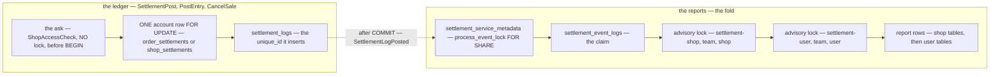

# settlement_service — lock order

The service-wide matrix the `audit-sql` skill writes unconditionally. It is not a finding; it is the reference
the **next** write handler is checked against, and the only artefact that can show a lock inversion — which is
invisible from inside any one handler.

| | |
| --- | --- |
| Isolation | READ COMMITTED (Postgres default — nothing in this repo raises it) |
| Last swept | 2026-09-29 — the imported shop row's ask ([settlement-asks-the-shop-for-its-primary-cs](../../../../docs/business/settlement/settlement_importer_decision.md#settlement-asks-the-shop-for-its-primary-cs)) |

**Verdict: two disjoint lock domains, one row lock per post, a fixed advisory order in the fold — no inversion.**

---

## The hierarchy



---

## Per handler, in acquisition order

| Handler | Locks, in order | Row order within the table |
| --- | --- | --- |
| `SettlementPost` / `PostEntry` / `CancelSale` — an **order** row | `order_settlements` (insert-if-absent, then `FOR UPDATE`) → `settlement_logs` key → the same account row, `UPDATE` | one row — n/a |
| `SettlementPost` — a **shop** row, hand-posted | `shop_settlements` (insert-if-absent, then `FOR UPDATE`) → `settlement_logs` key → the same row, `UPDATE` | one row — n/a |
| `SettlementPost` — an **imported shop** row | *the ask — no lock* → then exactly the hand-posted shop row's order | one row — n/a |
| the fold — `/event/settlement-fold/push` | `settlement_service_metadata` `FOR SHARE` → `settlement_event_logs` claim (PK) → advisory `settlement-shop:{team}:{shop}` → advisory `settlement-user:{team}:{user}` → `shop_settlement_daily_reports`, `shop_settlement_reports` → `user_settlement_daily_reports`, `user_settlement_reports` | the day's row, then every later day in one `UPDATE`, then the state row |
| `AnalyticReplayCompute` | `settlement_service_metadata` compare-and-set (its own statement) → one transaction: `DELETE` shop days → user days → `settlement_event_logs` → the metadata row back | set-based deletes |
| `AnalyticMaintenanceRun` | `DELETE settlement_event_logs` — one statement | set-based |
| `OrderSettlementList`, `OrderSettlementDetail`, `Analytic*` | none — reads | — |

---

## Why there is no cycle

1. **A post takes ONE row lock** — its account — and inserts one key after it. There is no second lock to take
   in the other order, and a waiter on a key holds only its own account, which the key's owner never wants.
2. **The ledger and the reports share no table.** The fold runs off an event published after the post
   commits — never inside it.
3. **The fold's advisory locks are shop THEN user, always**, in two namespaces. A fold never takes a shop key
   after a user key, so two folds can share a key but never wait on each other in a circle. Since 9f20652 an
   imported shop row folds under its **primary CS**, so one person's user key is shared by every shop they are
   primary of — more contention on that key, and still no cycle (crossed and raced, below).
4. **The replay gates the fold through one row.** Its compare-and-set waits for every in-flight fold's
   `FOR SHARE`; every fold after it reads the lock and leaves — the replay's delete never meets a fold.

---

## The cross-service call sits OUTSIDE the matrix — and must stay there

- **The ask is the service's only call into another service**, and it runs before BEGIN — proved: a post to
  the same shop committed while an ask was parked, and `FOR UPDATE NOWAIT` on the account succeeded.
- ⚠ **Never move it inside the transaction.** "Ask only when the key is new", done by asking after the
  transaction's `unique_id` lookup, would hold the shop's account across a network call: every post on the shop
  would queue behind the shop service. A key lookup that spares retries the ask must run **before** BEGIN too
  ([SettlementPost performance finding 2](../performances/SettlementPost.md#2-the-ask-runs-before-the-idempotency-check-)).
- **By design:** the primary is read outside the transaction, so a primary changed between the ask and the
  commit counts the row for the previous one — "the one at import time". No lock can make that read atomic
  with the write.

## ⚠ One key across two accounts

`settlement_logs.unique_id` is unique across the whole log (00002). Two accounts inserting one key at once: the
second waits on the first's key, then fails 23505. No cycle — it holds only its own account — but the answer is
`internal`: [SettlementPost concurrency finding 1](SettlementPost.md#1-a-key-colliding-across-accounts-at-once-answers-internal-).

---

## Proved

| Test | `-count=20` |
| --- | --- |
| `TestInterleave_ImportedShopRow_TheAskHoldsNoLock` | 20 of 20 — the ask holds no lock |
| `TestInterleave_ImportedShopRow_APosterHoldingTheAccountBlocksTheNext` | 20 of 20 — the account lock holds, the waiter re-reads |
| `TestRace_ImportedShopRow_ABurstLosesNothingAndCountsForThePrimary` | 20 of 20 |
| `TestRace_ImportedShopRow_ImportedAndManualShareOneAccount` | 20 of 20 |
| `TestRace_ImportedShopRow_SameKeyWritesOnce` | 20 of 20 |
| `TestRace_ImportedShopRow_FoldsCrossingShopsAndPrimariesNeverDeadlock` | 20 of 20 — 0 deadlocks |
| `TestRace_Fold_ConcurrentDaysKeepTheCarryTrue`, `TestRace_Fold_ARedeliveryStormFoldsOnce` | 20 of 20 |
| `TestRace_SettlementPost_DoesNotLoseAnUpdate`, `…AbsorbsConcurrentRetries` | 20 of 20 — the order grain |
| ⚠ `TestRace_SettlementPost_ShopGrainDoesNotLoseAnUpdate` | **red since 9f20652** — 8 of 8 `unavailable`, a nil `ShopPrimary`. Proves nothing now |
| ⚠ `TestInterleave_ImportedShopRow_AKeyCollidingAcrossShopsAnswersInternal` | **red by design** — the regression test of finding 1 |

```sh
go test -tags raceaudit -run "TestRace_ImportedShopRow|TestInterleave_ImportedShopRow|TestRace_Fold_|TestRace_SettlementPost_" ./backend/services/settlement_service/settlement_v1/
```

## Not proved

- a lock inversion against another service — selling posts in-process **after** its own commit; the importer
  calls over Connect, and whether it holds a lock of its own across that call is its own audit
- a hung shop service — no lock is held, but nothing bounds the ask (`http.DefaultClient`, no timeout)
- connection-pool exhaustion
