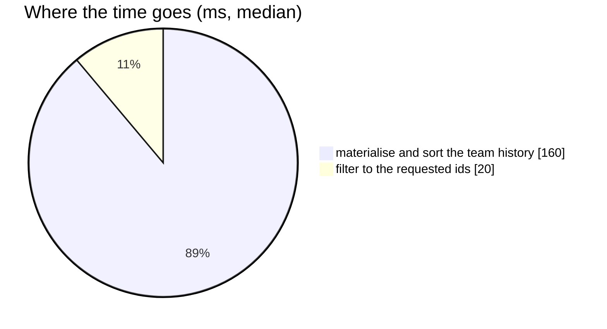

# AnalyticGroupMetric — performance audit

**Verdict:** 🔴 heavy — it aggregates the whole team's history before filtering to the ids it was asked for
**Measured:** 2026-09-14 · `settlement_service/settlement_v1/analytic_group_metric.go` (+ `analytic_group_shared.go`) · seed 100 000 rows in `shop_settlement_daily_reports` · warm, median of 5

| call | median wall | queries |
| --- | --- | --- |
| by shop, 20 ids | **185 ms** | 1 |
| by shop, 200 ids | **178 ms** | 1 |

✅ **No N+1** — one query regardless of how many ids.

---

## Findings

### 1. The same definition as AnalyticGroupSearch, and the same cost 🔴

It reads `groupMetricsCTE` — the `scoped` CTE over every column of the team's history, a temp spill, and a
sort of 50 000 rows — and applies `gid = ANY(@ids)` only at the end. Asking for 20 shops costs the same as
asking for 200. Full plan and working in
[AnalyticGroupSearch finding 1](./AnalyticGroupSearch.md#1-scoped-materialises-every-column-of-the-teams-whole-history-).

**→ Recommend:** the single grouped aggregate proposed there, with `r.<key> = ANY(@ids)` pushed into the
`WHERE` — so a page of 20 reads 20 groups' rows. One shared function serves both RPCs, which keeps the
ranking and the numbers beside it one computation.

---

## Not measured

- concurrency — single caller
- the ROOT-team scope
- a sparse production history

---

## Open questions

- [ ] Adopt it together with AnalyticGroupSearch — they must change together or the order and the numbers
  on the ranking stop being one definition.

---

## History

| Date | Median | Queries | Change |
| --- | --- | --- | --- |
| 2026-09-14 | 185 ms @ 20 ids | 1 | first audit |
