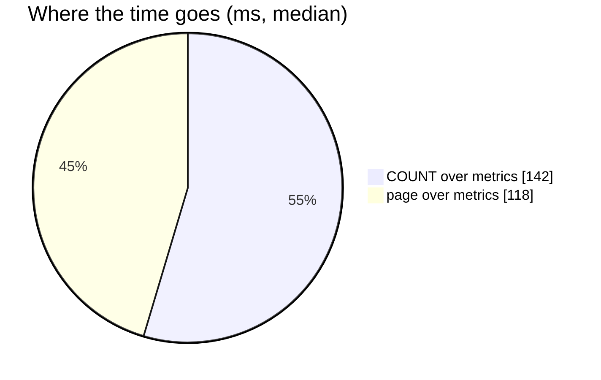

# AnalyticGroupSearch — performance audit

**Verdict:** 🔴 heavy — the whole team's history is materialised and sorted to find each group's latest row, TWICE per call
**Measured:** 2026-09-14 · `settlement_service/settlement_v1/analytic_group_search.go` (+ `analytic_group_shared.go`) · seed 100 000 rows in `shop_settlement_daily_reports` (2 teams × 200 shops × 250 days) + 50 000 in `user_settlement_daily_reports` · warm, median of 5

| call | median wall | queries |
| --- | --- | --- |
| by shop, 30-day window, page 20 | **261 ms** | 2 |
| by shop, 30-day window, page 200 | **247 ms** | 2 |
| by user, 30-day window, page 20 | **254 ms** | 2 |

✅ **No N+1** — the query count stays at 2 from page 20 to page 200.



---

## Queries

| # | What | Rows | Time | Plan | Verdict |
| --- | --- | --- | --- | --- | --- |
| 1 | `groupMetricsCTE … SELECT COUNT(*) FROM metrics` | 1 | 142 ms | Seq Scan 100 000 (50 000 removed) → CTE `scoped` with **temp written=891** → Sort 50 000 → Unique | 🔴 |
| 2 | `groupMetricsCTE … ORDER BY close_balance LIMIT OFFSET` | 200 | 120 ms | the same plan again | 🔴 duplicate work |

---

## Findings

### 1. `scoped` materialises every column of the team's whole history 🔴

`SELECT r.*, r.shop_id AS gid … WHERE team_id = @team AND day <= @end` is referenced twice in the CTE, so
Postgres materialises it — 50 000 wide rows, **spilling to temp** — then sorts all of them to pick each
position's latest day.

```
->  Seq Scan on shop_settlement_daily_reports r  (actual rows=50000 loops=1)
      Rows Removed by Filter: 50000
->  Sort  (actual rows=50000 loops=1)  Sort Key: scoped.shop_id, scoped.team_id, scoped.day DESC
      Buffers: shared hit=1924, temp written=891
      ->  CTE Scan on scoped  (actual time=0.012..107.717 rows=50000 loops=1)
Execution Time: 141.908 ms
```

The Seq Scan is the planner's correct choice here — `day <= end` keeps almost the team's entire history,
so the `(team_id, day)` index would not narrow it. The cost is in what is done with those rows.

**→ Recommend: ONE grouped aggregate, no `DISTINCT ON`.** A group's close at the window's end is
`Σ change WHERE day ≤ end` over its rows (the decided definition), and its movement is the same sum over
`day ≥ start` — both are `FILTER`ed sums in a single `GROUP BY gid`:

```sql
SELECT r.shop_id AS gid,
       SUM(r.change)        FILTER (WHERE r.day >= @start) AS change,
       SUM(r.fund)          FILTER (WHERE r.day >= @start) AS fund,  -- … every tracked column
       SUM(r.change)                                        AS close_balance
FROM shop_settlement_daily_reports r
WHERE r.team_id = @team AND r.day <= @end
GROUP BY r.shop_id
```

Narrow columns, a HashAggregate, no sort of the history and no CTE spill. ⚠ Same trade as
[AnalyticTimeSearch](./AnalyticTimeSearch.md#1-the-position-is-recomputed-per-bucket-over-the-whole-history-):
it reads the position from `change`, which is the definition — the reconcile is what checks the stored
`close_balance` agrees.

### 2. The count re-runs the whole computation 🟡

The search runs the CTE once to `COUNT(*)` and again to page.

**→ Recommend:** `COUNT(*) OVER ()` in the page query, dropping the second statement. Cheap to do alongside
finding 1; on its own it would halve the time without fixing the shape.

### 3. `AnalyticGroupMetric` shares the definition, so it shares the cost 🔴

It runs the same CTE once: **185 ms** for 20 ids, **178 ms** for 200 — the `gid = ANY(ids)` filter applies
only after the whole history is aggregated. The fix above is one function both RPCs read, so it lands for
both at once; with the ids known, the metric query should also push `r.shop_id = ANY(@ids)` into the
`WHERE`, where the scope index can use it.

---

## Proposed migration

None needed for the recommended query — it reads every team row up to the window's end either way. A
covering index would only shave the heap read and is not worth its write cost on a table the fold writes
on every event.

---

## Not measured

- concurrency — single caller
- the ROOT-team scope, which aggregates every team — strictly larger, same shape
- production distribution — the seed is dense (every shop, every day); real history is sparser

---

## Open questions

- [ ] Adopt the single grouped aggregate for search AND metric? Handler change only. **I would.**

---

## History

| Date | Median | Queries | Change |
| --- | --- | --- | --- |
| 2026-09-14 | 261 ms (search) · 185 ms (metric) | 2 · 1 | first audit |
