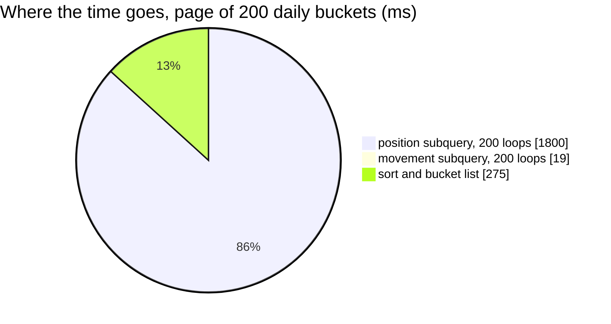

# AnalyticTimeSearch — performance audit

**Verdict:** 🔴 heavy — the position is re-derived from scratch for EVERY bucket, so the cost grows with the page size and with the length of history
**Measured:** 2026-09-14 · `settlement_service/settlement_v1/analytic_time_search.go` · seed 100 000 rows in `shop_settlement_daily_reports` (2 teams × 200 shops × 250 days) + 50 000 in `user_settlement_daily_reports` · warm, median of 5 · `analytic_perf_test.go` (`-tags perfaudit`)

| call | median wall | queries |
| --- | --- | --- |
| daily, 30 days, page 20 | **261 ms** | 1 |
| daily, 250 days, page 200 | **1 651 ms** | 1 |
| monthly, 250 days | 88 ms | 1 |
| daily, one user, 30 days | 1 ms | 1 |

One query, so the wall IS that query — `EXPLAIN` executes in 2 229 ms at 200 buckets.



---

## Queries

| # | What | Rows | Time | Plan | Verdict |
| --- | --- | --- | --- | --- | --- |
| 1 | `unnest(buckets)` ⟕ LATERAL movement Σ ⟕ LATERAL `DISTINCT ON (shop_id, team_id) … day <= bucket_to` | 200 | 2 229 ms | Nested Loop, **loops=200** over a Bitmap Heap Scan of **30 100 rows + sort** each | 🔴 plan-level N+1 |

---

## Findings

### 1. The position is recomputed per bucket over the whole history 🔴

For every bucket, the LATERAL position subquery reads every row of the team at or before that bucket's
last day and sorts them to pick each shop's latest row. 200 buckets × ~30 000 rows × a sort = 9 ms × 200.
It scales with **page size × history length**, so a year of daily points on a mature team gets slower
every day the table grows.

```
->  Aggregate  (actual time=9.000..9.001 rows=1 loops=200)
      ->  Unique  (actual time=7.257..8.989 rows=200 loops=200)
            ->  Sort  (actual rows=30100 loops=200)  Sort Key: r_1.shop_id, r_1.day DESC
                  ->  Bitmap Heap Scan on shop_settlement_daily_reports r_1  (actual rows=30100 loops=200)
                        Index Cond: ((team_id = 2) AND (day <= b.bucket_to))
Execution Time: 2228.883 ms
```

The movement subquery beside it is fine — an index range per bucket, 0.09 ms each.

**→ Recommend: read the position as a RUNNING SUM of `change`, computed once.** By the decided definition
([the-carry-materialises-the-day-boundary-position](../../../../docs/business/settlement/context_decision.md#the-carry-materialises-the-day-boundary-position))
`close(D) = Σ change over every row with day ≤ D`, summed over positions — which needs no per-position
"latest row" at all:

```sql
WITH per_day AS (
    SELECT day, SUM(change) AS change, …movement sums…
    FROM shop_settlement_daily_reports
    WHERE team_id = @team AND day <= @end
    GROUP BY day
), carried AS (
    SELECT day, change, SUM(change) OVER (ORDER BY day) AS close_balance, …
    FROM per_day
)
-- then bucket: Σ movements within [from, to], and close = the carried close at the last day ≤ bucket_to
```

One index range over the team, one sort by day, no loop. ⚠ **The trade**: it trusts the stored `change`
column as the source of the position rather than the stored `close_balance` — which is exactly the
definition, and the reconcile ([analytic Q4](../../../../docs/business/settlement/analytic_context_clarify.md#question))
would check both agree. A read over `close_balance` and one over `Σ change` disagree only on a table
whose carry has drifted, and that is a bug either way.

**Alternative I would not pick**: cap daily pages at a smaller limit. It hides the cost without removing
it — the per-bucket read still grows with history.

---

## Proposed migration

None. The `(team_id, day)` index is used correctly; the plan's problem is the loop, not the access path.

---

## Not measured

- concurrency — single caller
- cache-cold behaviour — every buffer was a `hit`
- production distribution — the seed is uniform: every shop has a row every day. Real shops are sparse,
  which makes the per-bucket sort SMALLER but the history just as long
- the ROOT-team scope (no team filter) — the same shape over every team's rows, so strictly worse

---

## Open questions

- [ ] Adopt the running-sum read? It is a handler change, no schema change. **I would.**

---

## History

| Date | Median | Queries | Change |
| --- | --- | --- | --- |
| 2026-09-14 | 261 ms @ 20 buckets · 1 651 ms @ 200 | 1 | first audit |
