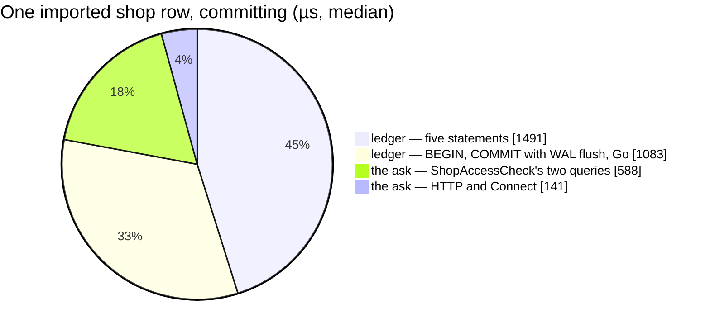

# SettlementPost — performance audit

**Scope:** the **imported shop row** — [settlement-asks-the-shop-for-its-primary-cs](../../../../docs/business/settlement/settlement_importer_decision.md#settlement-asks-the-shop-for-its-primary-cs), a row the importer posts to a shop asks the shop for its primary CS before the ledger transaction — against a hand-posted shop row, which never asks.

**Verdict:** 🔴 heavy — by the N+1 rule, not the clock: a statement asks the shop **one question once per row** — 1 500 `ShopAccessCheck` calls and 3 000 selling queries for a single answer — adding 0.7–1.3 ms and 2 queries to every imported shop row (7 per post, over the threshold of 5)
**Measured:** 2026-09-29 · `settlement_service/settlement_v1/post_entry.go` + `shop_primary.go` · seed 50 000 `settlement_logs` (40 000 order rows, 10 000 shop rows), 10 000 `order_settlements`, 1 000 `shop_settlements`, and selling's 1 000 `shops` + 3 000 `shop_users` · warm, median of 5 **batches of 100 posts** · [`post_entry_import_perf_test.go`](../../../../backend/services/settlement_service/settlement_v1/post_entry_import_perf_test.go) (`-tags perfaudit`)

> **Why batches.** Go's monotonic clock on this Windows host ticks in ~0.5 ms steps — one post is below its
> resolution, so single-call samples read 0 or 0.5 ms. Every figure below is a batch of 100 divided by 100.

| per post, median | manual shop row | imported, stub ask | imported, **Connect ask** | the ask alone |
| --- | --- | --- | --- | --- |
| wall — inside the test transaction | 1.30 ms | 1.28 ms | **2.09 ms** | 0.65 ms |
| wall — **committing** (BEGIN … COMMIT, the production shape) | 2.40 ms | 2.37 ms | **3.30 ms** | 0.66 ms |
| settlement statements | 5 | 5 | 5 | — |
| selling statements (the ask) | — | — | **2** | 2 |
| **× 1 500 rows**, committing | 3.6 s | 3.5 s | **5.0 s** | 1.0 s |

- **stub ≈ manual** — the ledger's own work is unchanged by the change; everything added is the ask.
- **The ask adds 0.7–1.3 ms per imported shop row** (Connect − stub): 33–39 % of the row inside the transaction,
  28–29 % committing. Two runs; the committing wall drifts with fsync on Docker Desktop (a second run read
  2.64 / 3.16 / 4.42 ms), the share held.
- **Per 1 500-row statement: +1.1–1.9 s**, on a ledger that costs 3.5–4.7 s for the same rows.

<!-- µs per imported shop row, Connect ask, committing run 1 -->



---

## Queries

One imported shop row. Time is the statement as GORM sees it (in the test transaction, one batch); the plan
is `EXPLAIN (ANALYZE, BUFFERS)` on the seeded transaction.

| # | What | Rows | Time | Plan | Verdict |
| --- | --- | --- | --- | --- | --- |
| 1 | `INSERT INTO shop_settlements … ON CONFLICT DO NOTHING` | 0 | 0.36 ms | — (write) | ok |
| 2 | `SELECT * FROM shop_settlements WHERE shop_id = ? LIMIT 1 FOR UPDATE` | 1 | 0.32 ms | Index Scan `shop_settlements_pkey`, exec 0.056 ms | ok |
| 3 | `SELECT * FROM settlement_logs WHERE unique_id = ? LIMIT 1` | 0 | 0.21 ms | Index Scan `settlement_logs_unique_idx`, exec 0.021 ms | ok |
| 4 | `INSERT INTO settlement_logs …` | 1 | 0.34 ms | — (write) | ok |
| 5 | `UPDATE shop_settlements SET last_balance = ? …` | 1 | 0.32 ms | — (write) | ok |
| 6 | selling: `SELECT * FROM shops WHERE id = ? AND team_id = ? AND deleted = false … LIMIT 1` | 1 | 0.27 ms | Index Scan `shops_pkey`, exec 0.031 ms | 🔴 **×1 per row, one answer per file** |
| 7 | selling: `SELECT * FROM shop_users WHERE shop_id = ? AND (is_primary OR user_id = ?)` | 2 | 0.30 ms | Index Scan `shop_users_shop_idx`, exec 0.018 ms | 🔴 **×1 per row, one answer per file** |

Every statement executes in under 0.06 ms. The 0.2–0.36 ms each costs is the **round trip** — so a post's cost
is its round-trip count: 5 statements (+ BEGIN and COMMIT) for the ledger, and the ask adds 3 more (one HTTP,
two SQL).

---

## Findings

### 1. One question, asked once per row 🔴

A statement is ONE shop, and the shop has ONE primary for the file ([the one at import time](../../../../docs/business/settlement/settlement_importer_decision.md#user-id-is-the-orders-creator-else-the-shops-primary-cs)) —
yet every imported shop row asks again. Posting a statement of N imported shop rows for one shop:

```
a statement of  20 imported shop rows for ONE shop:  20 asks,  40 selling queries — 1 distinct question
a statement of 200 imported shop rows for ONE shop: 200 asks, 400 selling queries — 1 distinct question
```

The count moves with the statement's size while the answer never changes: the N+1 shape, one level above the
RPC. It is not a query-shape problem — both selling reads are primary-key and index scans under 0.04 ms. It is
**1 500 cross-service round trips** on the largest Shopee sample, each also carrying `ShopAccessCheck`'s
access interceptor in production (not measured here).

**→ Recommend:** memoize the answer per `(team_id, shop_id)` in the composition root's adapter
([`cmd/app_development/shop_primary.go`](../../../../backend/cmd/app_development/shop_primary.go)) for a short
TTL — a statement then asks once. Settlement's contract, the decision and `ShopPrimary` stay as they are.

| Option | Cost |
| --- | --- |
| **a TTL cache in the adapter, keyed `(team_id, shop_id)`** — I would pick this, 60 s | a primary changed mid-import applies within the TTL — still "the one at import time". A hit skips `ShopAccessCheck`'s own authorization, so the key must carry the team; the caller's team scope is already checked by SettlementPost's interceptor, and the answer is the team's own data |
| a batch post — one RPC for N rows, one ask | a contract change on both sides; the per-row "created or already there" answers must be reshaped |
| the importer passes the primary it already asked for | declined — option (a) of importer Q13: nothing a caller sends may name the person |

### 2. The ask runs before the idempotency check 🟡

✅ **The refusal half is fixed (2026-09-29)**. It was a regression of the retry contract, made by the pass
that added the ask. A failed ask is now **held** until the transaction's idempotency check: a stored row is
answered from the ledger whatever the shop says, and only a NEW row is refused, with the ask's own reason,
before anything is written. That costs no extra query, and no network call happens inside the transaction
(`TestSettlementPost_ARetryOfAStoredImportedShopRowNeedsNoAnswerFromTheShop`). ⚠ **The cost half stands.**
A retry still asks when the shop can answer, and finding 1's cache is what removes that. What follows is the
finding as measured.

[`post_entry.go:233`](../../../../backend/services/settlement_service/settlement_v1/post_entry.go#L233) asks before
the transaction's `unique_id` lookup (line 341), so a row that is **already written** still asks:

| | measured |
| --- | --- |
| cost | re-posting one already-written imported shop row, 501 times → **501 asks**. 1.52–1.62 ms a post in the transaction (0.50–0.62 ms of it the ask), 2.7 ms committing. Overlapping statements are the normal case ([the-row-key-is-the-only-dedupe](../../../../docs/business/settlement/settlement_importer_decision.md#the-row-key-is-the-only-dedupe)) |
| availability | re-posting an already-written imported shop row while the shop cannot answer → **`unavailable`**; after its primary was removed → **`failed_precondition`**. The row exists and the honest answer is "already there" |

That is the retry the RPC exists to absorb ([`post_entry.go:17`](../../../../backend/services/settlement_service/settlement_v1/post_entry.go#L17)),
and the repair for a lost publish — "re-post the same `unique_id` to republish it" — now fails for an imported
shop row whenever the shop is down or has lost its primary.

**→ Recommend:** when the ask fails or finds no primary, look the key up before refusing — a row already
written is answered as the retry it is (its `user_id` is already on it), with the same other-account check the
transaction applies. It costs nothing on the happy path, and finding 1's cache carries the cost. The
alternative — look the key up **before** asking — also saves the ask on every retry, at one more indexed read
(~0.2 ms round trip) on every first post. ⚠ Either lookup stays **outside** the transaction: asking inside it
would hold the shop's account across a network call (see the [lock-order matrix](../concurrency/lock-order.md)).

---

## Proposed migration

None — every read is an index scan, and no plan would change with another index.

---

## Not measured

- **the access interceptor on `ShopAccessCheck`** — the httptest server mounts the bare handler; production verifies the forwarded token and reads the caller's roles (cached) on every ask
- a **manager** uploading without a grant — `ShopAccessCheck` then adds a role lookup per ask
- a **real network** between services — the dev server asks itself over loopback (`INTERNAL_BASE_URL`); a deployment with the shop on another host pays a network round trip per row
- the importer's own per-row cost — its `SettlementPost` call over Connect and the stream message
- concurrency — single caller; see [the concurrency audit](../concurrency/SettlementPost.md)
- the commit's fsync on production storage — the committing variant runs on Docker Desktop's disk
- production data distribution — the seed is uniform (1 000 shops × 10 shop rows)

---

## Open questions

- [ ] **Cache the primary per `(team, shop)` in the adapter?** I would pick yes, 60 s — one ask per statement instead of one per row, with no contract change.

---

## History

| Date | Median | Queries | Change |
| --- | --- | --- | --- |
| 2026-09-29 | 2.09 ms in-tx · 3.30 ms committing (imported shop row, Connect ask) | 5 + 2 | first audit — the imported-shop-row path |
| 2026-09-29 | unchanged — the happy path runs the same statements | 5 + 2 | a failed ask is held until the idempotency check: a stored row no longer needs the shop to answer (finding 2's refusal half). A new row whose ask failed now opens and locks its account before it is refused, at the cost of a rollback, never a network call |
