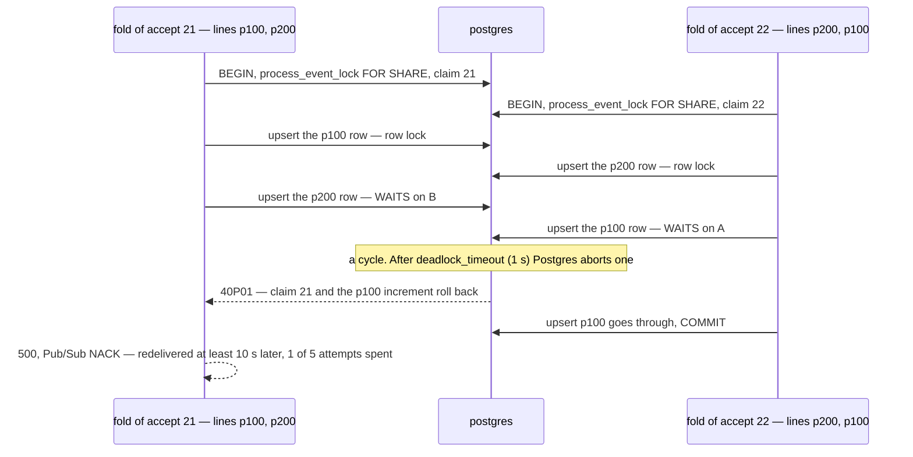

# FoldHandler — concurrency audit

**Verdict:** ✅ **fixed the same day** (2026-10-07) — the fold writes its lines in PRODUCT order — now one upsert, `ORDER BY` product (`foldLines`) — as
[Proposed change](#proposed-change) recommends, so two accepts sharing rows lock them in one order and the second waits.
Re-proved by the same two tests, now passing. *Was:* 🔴 unsafe, data-safe — two accepts of one supplier, team and day
that named the same products in **opposite line order** deadlocked; one fold died with 40P01 and waited on redelivery.

> Fixed rather than discussed because the defect was introduced by the same pass that built the fold, and the fix
> decides nothing: the same figures, the same rows, only the order they are written in. The report stays as the
> before/after record.
**Proved:** 2026-10-07 · `supplier_service/supplier_v1/analytic_fold.go` · [`analytic_fold_race_test.go`](../../../../backend/services/supplier_service/supplier_v1/analytic_fold_race_test.go) (`-tags raceaudit`)
**Isolation:** READ COMMITTED

| | |
| --- | --- |
| race | 2 folds at once: 2 accepts sharing 4 products, one listed forward and one reversed. 30 rounds, 3 runs |
| result | **72 deadlocks in 90 rounds** (22, 25, 25). The data was intact every round once the victim was redelivered |
| interleaving | `TestInterleave_Fold_OppositeLineOrdersDeadlock`: each fold parked before its 2nd line, holding its 1st. Released: **40P01 in 3 of 3 runs** |

The fold also goes through `FoldBackfill`, so a backfill can deadlock a live fold the same way. Everything else in the
fold is proved safe: lost increments, double folds, `figures_live_since` and the replay. See
[lock-order.md](lock-order.md#what-is-proved-and-by-what).

---

## The losing interleaving



---

## What the handler does

One transaction per accept:

| Step | Statement | Locks | Safe? |
| --- | --- | --- | --- |
| 1 | `SELECT … supplier_service_metadata WHERE key = 'process_event_lock' FOR SHARE` | the lock row, shared | ✅ |
| 2 | `INSERT INTO supplier_event_logs … ON CONFLICT (id) DO NOTHING` (the claim) | the event id's index entry | ✅ a second delivery of the same event waits here, then skips |
| 3 | for each line **in `accepted.GetLines()` order**: `INSERT … supplier_product_daily_reports … ON CONFLICT DO UPDATE SET col = d.col + EXCLUDED.col` | one figure row per line | 🔴 the event's order, not a fixed one |
| 4 | live only: `INSERT … supplier_service_metadata ('figures_live_since') ON CONFLICT DO UPDATE … WHERE EXCLUDED.value < value` | the key's row. ON CONFLICT DO UPDATE locks it **even when the WHERE is false** | ✅ always last |

---

## Findings

### 1. A restock's figure rows are locked in the event's line order 🔴

This is pattern 4 (unordered multi-row lock). Day, supplier and team are the same for every line of one fold, so its
rows differ only by product, and it takes them in the order the lines arrive. `RestockAcceptedEvent` builds the lines
in item-id order (`Items` preloaded `ORDER BY id`), so the order is whatever the restock was typed in. Two restocks of
one supplier, team and day that share products in a different order are enough:

- two purchase orders on one truck, accepted back to back,
- **the burst a replay's seek redelivers**, which is the likeliest case: every accept in the range arrives at once.

```
race ×2 — wall 1.005s
| outcome  | n | example                                                              |
| ok       | 1 |                                                                      |
| deadlock | 1 | supplier fold: product 103: ERROR: deadlock detected (SQLSTATE 40P01) |

23 deadlocks in 30 rounds of 2 crossed folds — data intact every round after redelivery
```

**The data is never wrong.** The victim's whole transaction rolls back, its claim included, so the redelivery folds
it exactly once. That was checked in every round. What a deadlock costs:

| Cost | |
| --- | --- |
| a 1 s stall | `deadlock_timeout`: both folds wait it out |
| a 500 and an error log | per victim |
| 1 of 5 delivery attempts | retry backoff starts at 10 s. **After 5 failures the accept is dead-lettered**, and its figures stay missing until a replay reaches it |

**→ Recommend:** sort the lines by `product_id` before the upsert loop. That is one line in `fold()`. Every pair of
folds then takes shared rows in the same order, so the second one waits on the first one's first row and holds nothing
the first one needs. `TestInterleave_Fold_SameLineOrderSerialises` shows this outcome: same order, B blocked on A's
first row, 0 deadlocks.

| Option | Cost |
| --- | --- |
| **sort by `product_id` in `fold()`** (recommended) | none: the same rows in another order. The consumer owns its lock order, so it does not depend on what the publisher sends |
| inventory publishes its lines sorted | a lock-order rule moved into another service's event contract, which no test of this service would catch breaking |
| one multi-row `INSERT … VALUES (…), (…) ON CONFLICT`, sorted | fewer round trips too. But one statement may not hit the same key twice, so two items of one product must be summed first |
| retry 40P01 inside the handler | treats the symptom: the 1 s stall still happens |
| leave it to Pub/Sub | today's behaviour: data-safe, but every deadlock spends an attempt toward the dead-letter queue |

---

## Lock order

| Acquired | Table | Rows | Obeys the service hierarchy? |
| --- | --- | --- | --- |
| 1st | `supplier_service_metadata` | `process_event_lock`, FOR SHARE | ✅ |
| 2nd | `supplier_event_logs` | the event's claim | ✅ |
| 3rd | `supplier_product_daily_reports` | one per line, **event order** | 🔴 no deterministic row order |
| 4th | `supplier_service_metadata` | `figures_live_since` (live only) | ✅ |

---

## Proposed change

<!-- A PROPOSAL. Not applied by the audit (HARD RULE 8). -->

```go
// backend/services/supplier_service/supplier_v1/analytic_fold.go: in fold(), step 3
// ONE ROW ORDER for every fold. Day, supplier and team are this event's, so product is the whole key order.
lines := slices.Clone(accepted.GetLines())
slices.SortFunc(lines, func(a, b *eventsv1.RestockAcceptedLine) int {
	return cmp.Compare(a.GetProductId(), b.GetProductId())
})

for _, line := range lines {
	err = foldLine(tx, day, accepted.GetSupplierId(), accepted.GetTeamId(), line)
	…
```

What it costs: nothing blocks that did not block before. Two folds sharing rows still serialise, but on the **first**
shared row instead of in a cycle. No schema change.

The regression tests are `TestInterleave_Fold_OppositeLineOrdersDeadlock` and
`TestRace_Fold_OppositeLineOrdersNeverDeadlock`. Both assert the safe outcome and **fail until the fix lands**.

---

## Suspected, not proved

- [ ] **A replay's redelivery burst makes it worse than 2-at-a-time.** The seek hands Pub/Sub every accept in the
  range at once, and N folds of one supplier and day overlap N ways. Not raced here, because there is no broker in
  the test. The rate above (≈ 80 % of rounds) is for 2 folds released together.

---

## Not proved

- the fold racing `AnalyticMaintenanceRun`'s prune. Read, not raced: it deletes claims more than 45 days old, and a
  fold inserts today's.
- the dead-letter arithmetic. It is read from `event_source/setup.go` (5 attempts, 10 s to 600 s backoff), not
  exercised.

---

## Open questions

- [x] Sort in the fold (recommended), or require inventory to publish lines sorted? **Sorted in the fold** — the
  consumer owns its lock order, and a publisher's line order is a contract nothing here tests.

---

## History

| Date | Race | Result | Change |
| --- | --- | --- | --- |
| 2026-10-07 | 2-way × 30 rounds × 3 runs, plus a paused interleave | 72 / 90 rounds deadlocked, interleave 3 / 3. Data intact after redelivery | first audit |
| 2026-10-07 | the same two tests, then `-count=5` of both | **0 deadlocks** — every race round and every paused interleave passes; the second fold waits behind the first | ✅ fixed — `linesByProduct` sorts a copy of the lines by `product_id` before the upserts |
| 2026-10-07 | `TestInterleave_Fold_LocksInProductOrderNotEventOrder` (replaces the two paused tests — a single statement has no second line to pause before) · the race, `-count=5` | blocked on product A holding NOTHING on product B; 0 deadlocks | the fold became one upsert ([performance](../performances/FoldHandler.md)); its `ORDER BY` product is the lock order |
