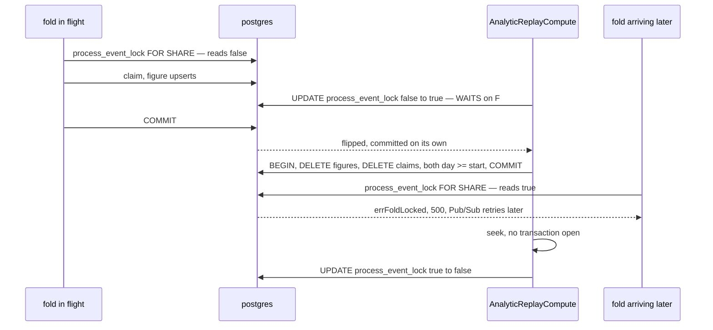

# supplier_service — lock order

The service-wide matrix the `audit-sql` skill writes every time, finding or not. It is the reference the next write
handler is checked against.

**Verdict: the CRUD side is safe and its hierarchy is a line. The figures side is safe** — its one 🔴, the fold
locking a restock's figure rows in the event's line order, was **fixed the same day**: the lines are written in product
order ([FoldHandler.md](FoldHandler.md)). Everything on the figures side is proved safe.

- **CRUD.** `suppliers → supplier_channels`. Only one handler takes an explicit lock: `SupplierChannelCreate`, which
  takes the supplier `FOR SHARE`. Every other write is one guarded `UPDATE` (or an `INSERT`), whose `WHERE` Postgres
  re-checks after any wait. No handler locks two rows of one table, and none takes a store before its supplier. None
  calls another service while holding a lock: `SupplierCreate` asks team_service **outside** any transaction, before
  its `INSERT`.
- **Figures.** The fold is one transaction, `process_event_lock FOR SHARE → claim → figure rows → figures_live_since`.
  The replay takes `process_event_lock` by a compare-and-set `UPDATE` in its **own** transaction, which waits for
  every fold in flight. It deletes in a second transaction and seeks with **no** transaction open.

The two sides share no table.

| | |
| --- | --- |
| Isolation | READ COMMITTED |
| Last swept | 2026-10-07: the figures (fold, backfill, replay). The CRUD side was swept earlier the same day, in the service's first audit (the-supplier-gets-its-own-service) |

## The hierarchy

```
CRUD      suppliers  →  supplier_channels

figures   supplier_service_metadata[process_event_lock]  FOR SHARE
            →  supplier_event_logs            the claim, one row per event
            →  supplier_product_daily_reports one row per line, in PRODUCT order (FoldHandler.md — was the event's)
            →  supplier_service_metadata[figures_live_since]   live folds only
```

`process_event_lock` is not a row lock held across the replay. It is a **value**, flipped by a committed `UPDATE`.
The only row lock involved is each fold's brief `FOR SHARE`, which is what the flip has to wait for.

No foreign key points into these tables from another service (inventory's `restock_requests_supplier_id_fkey` was
dropped by its 00023). So no other service's insert takes a `KEY SHARE` on a supplier row.

## Per handler, in acquisition order

| Handler | Locks, in order | Notes |
| --- | --- | --- |
| `SupplierCreate` | `INSERT suppliers` (new row) | team_service is asked **before**, outside any transaction. No uniqueness to race ([the-supplier-has-no-code](../../../../docs/business/supplier/context_decision.md#the-supplier-has-no-code)) |
| `SupplierUpdate` | `suppliers` (one row, `NO KEY UPDATE`) → unlocked re-read | one `UPDATE` with a column map. Absent fields are untouched |
| `SupplierDelete` | `suppliers` (one row, `NO KEY UPDATE`) | `WHERE deleted_at IS NULL`, re-checked after a wait |
| `SupplierChannelCreate` | `suppliers` **`FOR SHARE`** → `INSERT supplier_channels` (its FK `KEY SHARE` is already covered) | the only explicit lock in the service |
| `SupplierChannelUpdate` | `supplier_channels` (one row) → unlocked re-read | suppliers is only **read**, in a subquery, never locked |
| `SupplierChannelDelete` | `supplier_channels` (one row) | as above |
| `FoldHandler` → `fold` (live) | `process_event_lock` **`FOR SHARE`** → `INSERT supplier_event_logs … ON CONFLICT DO NOTHING` (the claim) → `supplier_product_daily_reports`, an upsert per line **in product order** → `figures_live_since` upsert | one transaction. ✅ the line order, fixed: [FoldHandler.md](FoldHandler.md). The last upsert locks the key's row even when its `WHERE EXCLUDED.value < value` is false |
| `FoldBackfill` → `fold` (backfill) | the same, without `figures_live_since` | reads `figures_backfilled` and `figures_live_since` **unlocked**, before any fold. The marker `INSERT … ON CONFLICT DO NOTHING` is its own statement, last |
| `AnalyticReplayCompute` | ① `UPDATE … process_event_lock` from false to true (compare-and-set, own transaction): waits for every fold's `FOR SHARE` → ② one transaction: `DELETE supplier_product_daily_reports` → `DELETE supplier_event_logs`, both `day >= start` → ③ the seek, **no transaction** → ④ `UPDATE … process_event_lock` back (own transaction) | no row lock is held across the seek. The pre-checks (`figures_live_since`, the retention) are unlocked reads, and only ever made safer by a concurrent fold, which can only lower the cutoff |
| `AnalyticMaintenanceRun` | `DELETE supplier_event_logs WHERE created_at < now − 45 d` (one statement) | takes no `process_event_lock`. Not raced, see [Not proved](#not-proved) |

`FOR SHARE` vs `NO KEY UPDATE` is what makes a supplier delete wait for an in-flight store create. The FK's own
`KEY SHARE` would **not** block it, because a soft delete changes no key column. The same pair is what makes the
replay's lock flip wait for a fold in flight.

## What is proved, and by what

All in `backend/services/supplier_service/supplier_v1/`, `-tags raceaudit`, run ×5 against a private database.

| Claim | Proof | Result |
| --- | --- | --- |
| A delete **waits** for an in-flight store create | `TestInterleave_SupplierChannelCreate_DeleteWaitsForTheCreate`: A parked by a GORM hook **between** its `FOR SHARE` and its `INSERT` | delete `⏸ blocked, released on A's commit`. Holder `idle in transaction` on `SELECT … FOR SHARE`. A's `INSERT` still went through, with no self-deadlock against the queued delete |
| A create **after** a committed delete is NotFound | `TestInterleave_SupplierChannelCreate_AfterTheDeleteIsNotFound` | A's `FOR SHARE` blocked, re-checked `deleted_at IS NULL`, NotFound, 0 stores |
| Creates racing a delete never leave an unreported store | `TestRace_SupplierChannelCreate_VsSupplierDelete`: 7 creates + 1 delete × 30 rounds | stores = creates reported OK, every round. 0 deadlocks |
| Two edits of different fields both land | `TestRace_SupplierUpdate_…` / `TestRace_SupplierChannelUpdate_DifferentFieldsAllLand`: 4-way × 20 | all fields every round |
| …because the second waits and writes only its column | `TestInterleave_SupplierUpdate_SecondWaitsAndKeepsBoth` | B blocked, released. Final and B's reply carry both edits |
| An update queued behind a delete is NotFound | `TestInterleave_SupplierUpdate_QueuedBehindADeleteIsNotFound`, `…ChannelUpdate_QueuedBehindAStoreDeleteIsNotFound` | blocked, then NotFound, row untouched |
| Two deletes: exactly one wins, `deleted_at` written once | `TestRace_SupplierDelete_ExactlyOneWins` / `…ChannelDelete…`: 8-way × 20 · `TestInterleave_SupplierDelete_SecondIsNotFoundAndDeletedAtStays` | 1 OK, 7 NotFound. `deleted_at` = A's value |
| No lock cycle among all six writers | `TestRace_SupplierLockOrder_EveryWriterAtOnceNeverDeadlocks`: 8 mixed writers on one supplier + store × 40 | 0 deadlocks (200 rounds over 5 runs). Only OK / NotFound |

**The figures**: [`analytic_fold_race_test.go`](../../../../backend/services/supplier_service/supplier_v1/analytic_fold_race_test.go)
and [`analytic_replay_compute_race_test.go`](../../../../backend/services/supplier_service/supplier_v1/analytic_replay_compute_race_test.go).
Each safe claim was run ×5, against a private database.

| Claim | Proof | Result |
| --- | --- | --- |
| Two **different** accepts on one row never lose an increment | `TestRace_Fold_DifferentAcceptsOnOneRowLoseNothing`: 8-way × 20, alternating from no row (racing INSERTs) and from an existing row | the exact sum every round |
| …because the second **waits** and adds onto the committed row | `TestInterleave_Fold_SecondAcceptWaitsOnTheRowThenAdds`, from no row and from an existing one | B `⏸ blocked, released`, waiting on the daily-report upsert, A `idle in transaction`. The sum is A + B |
| The **same** accept delivered at once folds exactly once | `TestRace_Fold_SameAcceptEightTimesFoldsOnce`: 8-way × 20, 2 lines | each row once, 1 dedup row, all 8 ACKed |
| …because the second **claim** waits, then skips, or folds if the first rolled back | `TestInterleave_Fold_SameAcceptSecondWaitsOnTheClaim` (commit / rollback) | B blocked on `INSERT INTO supplier_event_logs`. After a commit: skips, once. After a rollback: folds, once |
| ✅ Opposite line orders **no longer deadlock** — fixed; before the fix: | `TestInterleave_Fold_OppositeLineOrdersDeadlock` (paused) · `TestRace_Fold_OppositeLineOrdersNeverDeadlock`: 2-way × 30, 4 products reversed | **40P01 in 3 / 3** paused runs. **72 / 90** race rounds. Data intact after redelivery. ([FoldHandler.md](FoldHandler.md)) |
| …and the fold now locks in **product** order, whatever the event's (the fix) | `TestInterleave_Fold_LocksInProductOrderNotEventOrder` — a third transaction holds product A; the accept listing B first folds | it blocks on product A holding **nothing** on product B (`FOR UPDATE NOWAIT` on B succeeds); 0 deadlocks in the race, `-count=5`. The two paused tests above proved the bug on the per-line fold, which is gone — the fold is one upsert |
| `figures_live_since` ends at the **earliest** live accept | `TestRace_Fold_LiveSinceEndsAtTheEarliest`: 8-way × 20, with no key and with a later key | the minimum every round |
| …because the second write waits and judges the **committed** value | `TestInterleave_Fold_LiveSinceSecondWaitsThenJudgesTheCommittedValue`: 4 cases | B blocked on the metadata upsert every time. Earlier B lowers it, later B leaves it |
| A backfill beside live deliveries of the same accepts counts each **once** | `TestRace_FoldBackfill_BesideLiveFoldsCountsEachAcceptOnce`: 2 backfills + 6 live × 10, accepts sharing rows | each row exact, 1 claim per accept. 43 / 80 folded by a backfill, the rest live |
| …even where the backfill's **cutoff** is stale | `TestInterleave_FoldBackfill_WaitsOnALiveClaimThenSkips`: the live claim uncommitted, so the backfill reads no cutoff | backfill blocked on the claim, then `Folded 0, Skipped 1`. The claim, not the cutoff, is the guard |
| A replay **waits** for a fold in flight, and its delete then sees it | `TestInterleave_Replay_WaitsForAFoldInFlight` | the replay's `UPDATE … process_event_lock` blocked on A's `FOR SHARE`. It deleted A's row **and** A's claim (2 / 2). The redelivery folds it once |
| A fold arriving while the lock is held is **refused**, writes nothing, waits on nothing | `TestInterleave_Replay_AFoldWhileTheLockIsHeldIsRefused`, parked before the figure delete, **between the two deletes**, and inside the seek | `errFoldLocked` in 1–2 ms at all 3 points, in the range and outside it. No row, no claim |
| A replay racing live deliveries counts every accept **once** | `TestRace_Replay_BesideLiveFoldsCountsEveryAcceptOnce`: 1 replay + 8 staggered deliveries × 10, then Pub/Sub's retry and the seek | every row exact. 15 deliveries landed and 65 were refused by the lock, out of 80 |

## The replay and the fold: why the lock is load-bearing

The replay's two `DELETE`s are **two statements**, and so take two snapshots. A fold committing between them would
keep its figures (missed by the first) but lose its claim (caught by the second), and the seek would count it
**twice**. `process_event_lock` makes that interleaving impossible. A fold already past its check holds `FOR SHARE`
until it commits, so the flip waits for it. A fold arriving after the flip reads `true` and refuses.



## SupplierChannelUpdate vs SupplierDelete: no lock, and none needed

The edit's scope check is a **subquery** on `suppliers`, so it never locks the supplier. Three timings, all forced
by Interleave:

| The supplier delete is… | The store edit… | Equivalent serial order |
| --- | --- | --- |
| committed before the edit's `UPDATE` | matches nothing → **NotFound** | delete, then edit |
| in flight (uncommitted) | **does not wait**, and reads the last committed supplier (live), so it lands | edit, then delete |
| committed between the edit's `UPDATE` and its re-read | re-read is NotFound, and the error **rolls the `UPDATE` back** | delete, then edit |

Every outcome is a serial order, and the caller is never told OK about an edit that did not stick. An edit that lands
on a store whose supplier is deleted a moment later is hidden with that supplier, like every other store of it. So it
is **safe**, and locking the supplier `FOR SHARE` here would buy nothing.

## Observed, not a finding

- **A store's `created_at` can be later than its supplier's `deleted_at`, even though the store committed first.**
  `SupplierDelete` stamps `NOW()`, which is its transaction's **start**, taken before it waited on a create's
  `FOR SHARE`. The store's `created_at` is stamped at its `INSERT`. Seen in the Interleave: created 20.166 s, supplier
  deleted 19.807 s. In production the gap is the create's own sub-millisecond lock-to-insert time. Nothing reads the
  two together today.
- **A supplier under a stream of store creates can be slow to delete.** New `FOR SHARE` lockers can join while a
  delete waits. In the 7-creates-vs-1-delete race, 204 creates landed before the delete and only 6 after. That is not
  a correctness issue, and one supplier never gets a burst of store creates.
- **Every live fold briefly serialises on `figures_live_since`.** Its upsert locks the row even when the `WHERE`
  leaves it alone. This shows up in every figures Interleave: the holder's last statement is that upsert. It comes
  after the fold's lines, so it creates no cycle, and accepts arrive far slower than one commit.
- **A refusal spends a delivery attempt.** `errFoldLocked` is a 500, and the subscription dead-letters after 5 attempts
  (backoff 10 s to 600 s, from `event_source/setup.go`). A replay holds the lock for a delete and a seek, which is
  seconds. **A developer's manual switch held for minutes** dead-letters what arrives meanwhile. The seek's first
  redeliveries can also meet the lock before it is released, which costs one attempt each and is recovered by the
  retry.

## Not proved

- `SupplierCreate`'s question to team_service is answered and then acted on without a lock (a team turning
  non-selling in between). Read, not raced: a team's type is not changed by any RPC.
- A cross-service cycle: no handler here calls out while holding a lock, so none can exist today.
- Inventory asking `SupplierByIds` from inside its own locked transaction:
  [RestockRequestUpdate.md](../../inventory_service/concurrency/RestockRequestUpdate.md) — ✅ fixed 2026-10-07: inventory asks before its transaction.
- `AnalyticMaintenanceRun` against a fold or a replay. Read, not raced. It prunes claims received more than 45 days
  ago, while a fold inserts today's, and the replay deletes claims for days inside the broker's 31-day retention. The
  row sets cannot overlap unless an accept's day is more than 14 days after its receipt.
- The replay's flip under a **continuous** stream of folds. New `FOR SHARE` lockers can join ahead of a waiting
  `UPDATE` (see the supplier delete above), so a replay could wait. Not measured.
- A replay's redelivery burst, N folds of one supplier and day at once. With the lines in product order they queue
  rather than deadlock; the burst itself was not raced — there is no broker in the test.

| History | |
| --- | --- |
| 2026-10-07 | first matrix: `suppliers → supplier_channels`, one `FOR SHARE`, 0 deadlocks in 200 sweep rounds |
| 2026-10-07 | the figures: fold, backfill and replay added. One 🔴: the line order ([FoldHandler.md](FoldHandler.md)), 40P01 in 72 of 90 crossed rounds. Data intact. The replay's lock is proved |
| 2026-10-07 | ✅ the line order fixed — product order; the deadlock tests pass, `-count=5` |
