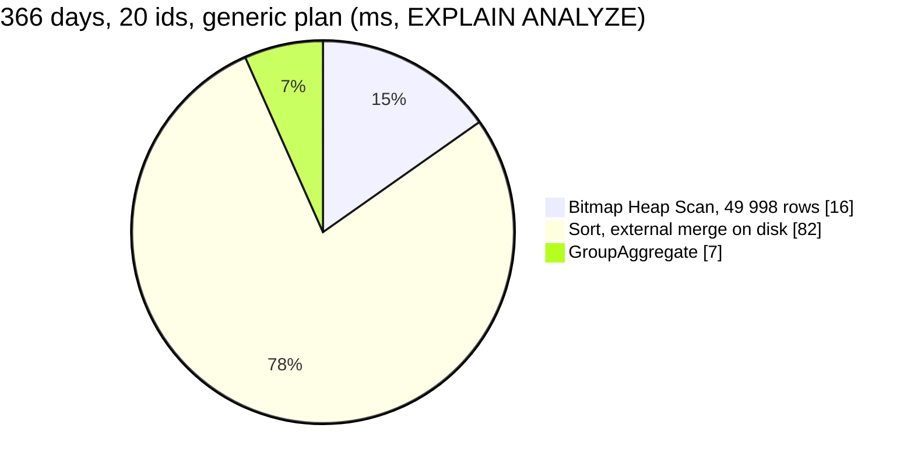

# AnalyticGroupMetric — performance audit

**Verdict:** ✅ **fixed the same day** (2026-10-07) by the date literals in `window()`
([AnalyticGroupSearch.md, finding 2](./AnalyticGroupSearch.md#2-after-five-calls-a-pooled-connection-plans-every-window-as-if-it-were-tiny-)):
a year's page of 20 is now **20 ms**, of 200 is 71 ms; 30 days 2–7 ms. *Was:* 🔴 heavy. Its one statement took **102 ms** for a year's page of 20.

> Fixed rather than discussed because the code was written by the same pass that audited it, and the fixes decide
> nothing: the same figures, the same order, the same contract — only how the statements are shaped. The report stays
> as the before/after record. Re-measured on a FRESH database per test: rolled-back seeds of half a million rows leave
> enough dead rows to make a second run on the same database read ~4× slower.

*Was, in full:* The prepared statement's generic plan expects 27 rows, gets 49 998, and sorts them on disk. On a correct plan it takes 57 ms, which is still over the 50 ms single-query threshold.
**Measured:** 2026-10-07 · `supplier_service/supplier_v1/analytic_group_metric.go` (+ `analytic_shared.go`) · seed **522 070** rows in `supplier_product_daily_reports` (365 days, 2 000 suppliers, 10 000 products, 8 teams), plus a 3-year run (1 563 252 rows) · the ids are what the screen sends: `AnalyticGroupSearch`'s first page by value, which holds the **biggest** suppliers · warm, median of 5 · [`analytic_perf_test.go`](../../../../backend/services/supplier_service/supplier_v1/analytic_perf_test.go) (`-tags perfaudit`)

Headline case: a 366-day window, 20 ids (the Supplier Report's page size).

| | median | max |
| --- | --- | --- |
| wall | 102 ms | 122 ms |
| db | 102 ms | 122 ms |
| in Go (wall − db) | ~0 ms | |
| queries | 1 (also 1 at 200 ids, so there is no N+1) | |



| Case | default | custom | 3 years, custom | |
| --- | --- | --- | --- | --- |
| 30 d · 20 ids | 5.5 ms | 3.0 ms | 5.0 ms | ok |
| 30 d · 200 ids | 7.4 ms | 6.7 ms | 10.2 ms | ok |
| 366 d · 20 ids | **102 ms** | 57 ms | 22 ms | 🔴 |
| 366 d · 200 ids | **106 ms** | 89 ms | 61 ms | 🔴 |
| 366 d · one team · 200 ids | 53 ms | 61 ms | 31 ms | 🟡 |

"Default" is pgx's prepared statements, as production runs them. "Custom" is `plan_cache_mode = force_custom_plan`. In the
3-year run a year is a third of the table, so the planner switches from a seq scan to the `(supplier_id, day)` index.

---

## Queries

| # | What | Rows | Time | Plan | Verdict |
| --- | --- | --- | --- | --- | --- |
| 1 | `SELECT r.supplier_id, SUM(…)×6 FROM reports r WHERE r.day BETWEEN $1 AND $2 AND r.supplier_id IN ($3…$22) GROUP BY r.supplier_id` | 20 | 102 ms default · 57 ms custom | generic: Bitmap Index Scan `supplier_day_idx` (**est. 27, actual 49 998**) → **Sort external merge Disk 3.2 MB**. custom: Parallel Seq Scan, 157 357 removed per worker | 🔴 |

---

## Findings

### 1. The generic plan spills the sort to disk 🔴

This has the same cause as [AnalyticGroupSearch's finding 2](./AnalyticGroupSearch.md#2-after-five-calls-a-pooled-connection-plans-every-window-as-if-it-were-tiny-).
After five executions on one connection, mostly the screen's default 30 days, the statement is planned once for any
window and any ids. It sizes the year at 27 rows, chooses a sorted GroupAggregate, and the 49 998 real rows go to disk.

```
EXECUTE fig_metric('2025-10-06', '2026-10-06', <the top 20 ids>)   -- auto mode, after five 30-day executions
GroupAggregate  (rows=27 → actual rows=20)
  ->  Sort  (rows=27 → actual rows=49998)  Sort Method: external merge  Disk: 3232kB
        ->  Bitmap Heap Scan on supplier_product_daily_reports r  (rows=27 → actual rows=49998)  Heap Blocks: exact=8018
Execution Time: 106.521 ms
```

**→ Recommend: the same fix as the search, which is to send the window's dates as literals in `window()`.** It is one edit and
fixes all four figure reads. The custom plan it restores is the 57 ms one below.

### 2. The page's suppliers are the biggest ones, and their rows are read a second time 🟡

The ids are page 1 of a ranking by value, so they are the suppliers with the most rows: 49 998 for 20 suppliers
over a year, about 10 % of the table. On the right plan that costs 57 ms. `AnalyticGroupSearch`'s page statement has
just grouped these same rows by supplier, and this statement reads them again.

**→ Recommend: keep the two calls.** Ranking ids and then metrics by id is the decided delivery shape
([How Rpc Api Deliver Analytical Data](../../../../docs/business/settlement/analytic_context.md#how-rpc-api-deliver-analytical-data),
[the-report-is-processed-like-settlement](../../../../docs/business/supplier/context_decision.md#the-report-is-processed-like-settlement)).
Returning the page's figures from the search would remove this read, but it is a contract change for ~57 ms. The
366-day window limit proposed in [AnalyticGroupSearch's finding 3](./AnalyticGroupSearch.md#3-the-cost-is-every-row-in-the-window-and-no-limit-is-placed-on-the-window-)
bounds this read too.

---

## Proposed migration

None. In the 3-year run the `(supplier_id, day)` index is used once the window is a fraction of the table. At one
year the parallel seq scan is the planner's correct choice: 10 % of the rows, spread over every page.

---

## Not measured

- concurrency (one caller at a time)
- the production DSN's exec mode. It is assumed to be pgx's default (prepare and cache)
- a page deeper than the first, which holds smaller suppliers and fewer rows, so it is cheaper
- production heap locality. The seed's rows are independent per product, while a real accept writes its lines together, which would make the index path cheaper

---

## Open questions

- [x] Decided together with [AnalyticGroupSearch's open questions](./AnalyticGroupSearch.md#open-questions): the date literals are applied; the window limit is [supplier Q19](../../../../docs/business/supplier/context_clarify.md#question).
- [ ] Return a ranked page's figures from `AnalyticGroupSearch` itself (a contract change)? **I would not** while the read costs ~57 ms.

---

## History

| Date | Median | Queries | Change |
| --- | --- | --- | --- |
| 2026-10-07 | 102 ms @ 366 d, 20 ids (57 ms custom) · 5.5 ms @ 30 d | 1 | first audit |
| 2026-10-07 | **20 ms** @ 366 d, 20 ids · 71 ms @ 200 ids · 2.3 ms @ 30 d | 1 | ✅ the window's dates as literals — a plan per window |
