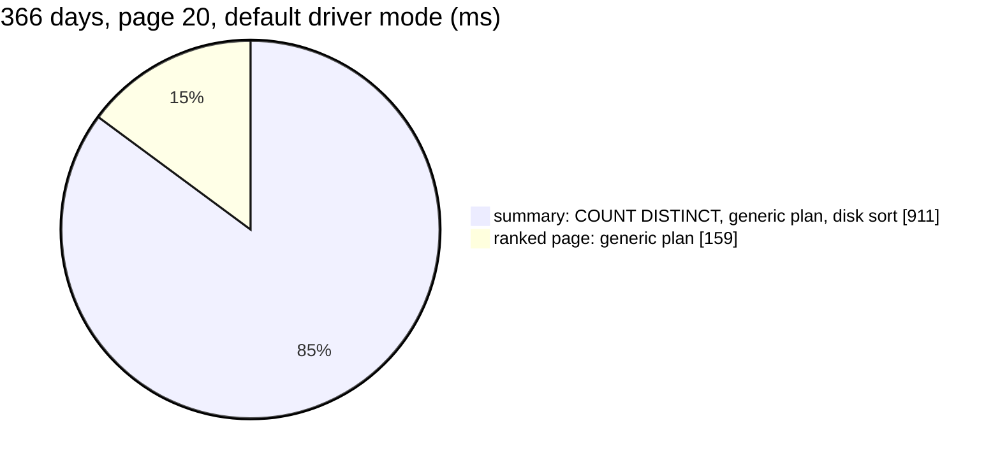
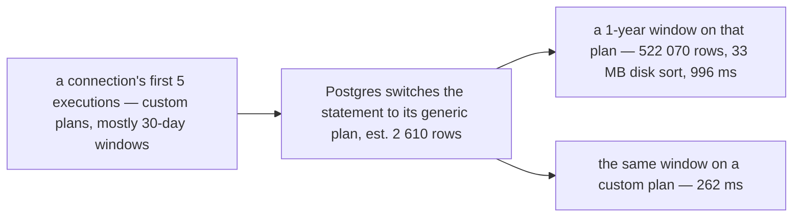

# AnalyticGroupSearch — performance audit

**Verdict:** ✅ **fixed the same day** (2026-10-07) for findings 1 and 2 — one grouped statement for the page and the
totals, and the window's dates as literals. A one-year ranking is now **90 ms** (by broken rate 105 ms, searched 58–79 ms),
30 days 15–18 ms, one statement. Finding 3 — the window has no limit — is the owner's
([supplier Q19](../../../../docs/business/supplier/context_clarify.md#question)). *Was:* 🔴 heavy. A one-year ranking took **1.07 s**.

> Fixed rather than discussed because the code was written by the same pass that audited it, and the fixes decide
> nothing: the same figures, the same order, the same contract — only how the statements are shaped. The report stays
> as the before/after record. Re-measured on a FRESH database per test: rolled-back seeds of half a million rows leave
> enough dead rows to make a second run on the same database read ~4× slower.

*Was, in full:* Its summary uses `COUNT(DISTINCT supplier_id)`, which cannot run in parallel and has to sort every row of the window. The sort spills to disk once the driver's prepared statement switches to its generic plan, and that happens after five executions on one connection.
**Measured:** 2026-10-07 · `supplier_service/supplier_v1/analytic_group_search.go` (+ `analytic_shared.go`) · seed **522 070** rows in `supplier_product_daily_reports` (365 days, 2 000 suppliers, 10 000 products, 8 teams, ~1 430 rows a day), 2 000 `suppliers` (5 % deleted), 6 000 `supplier_channels`. A growth run used **1 563 252** rows (3 years) · warm, median of 5 · [`analytic_perf_test.go`](../../../../backend/services/supplier_service/supplier_v1/analytic_perf_test.go) (`-tags perfaudit`) · Postgres 17, `shared_buffers` 128 MB, `work_mem` 4 MB

Headline case: by restocked value, a 366-day window, page 20.

| | median | max |
| --- | --- | --- |
| wall | 1 071 ms | 1 093 ms |
| db | 1 071 ms | 1 093 ms |
| in Go (wall − db) | ~0 ms | |
| queries | 2 (also 2 at page 200, so there is no N+1) | |



### Every case

"Default" is what production gets: pgx prepares each statement, and the cases share statements the way a pooled
connection does. "Custom" pins `plan_cache_mode = force_custom_plan`, so every execution is planned with its real
window.

| Case | default | custom | |
| --- | --- | --- | --- |
| value · 30 d · page 20 (the screen's default) | 43–95 ms ¹ | 30 ms | ok |
| value · 366 d · page 20 | **1 071 ms** | **296 ms** | 🔴 |
| value · 366 d · page 200 | 1 088 ms | 301 ms | 🔴 |
| value · 366 d · page 10 | 1 011 ms | 297 ms | 🔴 |
| value · 366 d · one restocking team | 172 ms | 200 ms | 🔴 |
| broken rate · 30 d | 74 ms | 42 ms | ok |
| broken rate · 366 d | **1 227 ms** | 368 ms | 🔴 |
| `q=lestari` (13 % of suppliers) · 30 d | 93 ms | 27 ms | ok |
| `q=lestari` · 366 d | 529 ms | 113 ms | 🔴 |
| `q=lestari` · broken rate · 366 d | 405 ms | 117 ms | 🔴 |
| `q=batik` (6 stores) · 366 d | 413 ms | 130 ms | 🔴 |
| **3 years of history**, custom · 30 d / 366 d / all 1 095 d | | 32 ms / **2 402 ms** / **51 975 ms** | 🔴 |

¹ The first case of a process. Two runs gave 30 ms and 95 ms, which is machine noise. The planner is not involved.

---

## Queries

| # | What | Rows | Time (366 d) | Plan | Verdict |
| --- | --- | --- | --- | --- | --- |
| 1 | `SELECT COUNT(DISTINCT r.supplier_id), SUM(…)×6 FROM reports r WHERE r.day BETWEEN $1 AND $2` | 1 | 911 ms default · 243 ms custom | generic: Index Scan `key_idx` (**est. 2 610, actual 522 070**) → **Sort external merge Disk 33 MB**. custom: full Index Scan `supplier_day_idx`, one heap fetch per row (504 717 buffer hits) | 🔴 |
| 2 | `SELECT r.supplier_id … GROUP BY r.supplier_id ORDER BY SUM(r.restock_valuation) DESC LIMIT 20` | 20 | 159 ms default · ~55 ms custom | generic: Index Scan `key_idx` → HashAggregate. custom: Parallel Seq Scan → Partial HashAggregate | 🟡 |

---

## Findings

### 1. `COUNT(DISTINCT)` makes the summary sort every row of the window 🔴

`COUNT(DISTINCT)` needs its input sorted by `supplier_id`, and an aggregate with it is never parallel. Postgres either
sorts the whole window or walks the `(supplier_id, day)` index with one random heap fetch per row. The heap is in
day order, because the fold appends rows day by day.

```
-- custom plan, 1 year (522 070 rows)
Aggregate  (actual time=262.156 rows=1)
  ->  Index Scan using supplier_product_daily_reports_supplier_day_idx  (actual rows=522070)
        Index Cond: ((day >= '2025-10-06') AND (day <= '2026-10-06'))
        Buffers: shared hit=504717
-- custom plan, 3 years, whole history (1 563 252 rows): the same walk, now cache-cold
        Buffers: shared hit=984035 read=527887
Execution Time: 44307.236 ms
```

**→ Recommend: count the groups instead of the distinct ids, and fold the summary into the page statement.** Both
were probed on the same transaction:

| Statement | 1 year | 3 years, 1-year window | 3 years, all history |
| --- | --- | --- | --- |
| today's summary (custom) | 262 ms | 1 509 ms (disk sort) | 44 307 ms |
| `SELECT COUNT(*), SUM(…) FROM (… GROUP BY supplier_id) g` | **91 ms** | 366 ms | **603 ms** |
| page and totals in **one** statement, `COUNT(*) OVER ()` | **68 ms** (replaces both) | | |

```sql
WITH g AS (
    SELECT r.supplier_id, SUM(r.restock_count) AS restock_count, …the six…,
           SUM(r.restock_count + r.shipping_lost_count + r.shipping_broken_count) AS units
    FROM supplier_product_daily_reports r            -- + the q join, as today
    WHERE r.day BETWEEN … AND …                      -- + r.team_id, as today
    GROUP BY r.supplier_id)
SELECT g.supplier_id, COUNT(*) OVER () AS suppliers, SUM(g.restock_count) OVER () AS total_restock_count, …
FROM g
ORDER BY <rankOrder over g's columns>
OFFSET … LIMIT …
```

The plan is a Parallel Seq Scan with a Partial HashAggregate, with no sort of the window and no spill. ⚠ A page past the
end returns no rows, and so no totals. For that page only, run the grouped summary as a second statement. I would
pick the single statement. The fallback is the same SQL with the `ORDER BY` dropped.

### 2. After five calls, a pooled connection plans every window as if it were tiny 🔴

The driver (pgx, default mode) prepares each statement. The window is sent as `$1`/`$2`. After five executions on one
connection, Postgres may switch to the **generic plan**, which is planned once without the dates. Those five
executions are mostly the screen's default 30 days. The generic plan estimates `day BETWEEN $1 AND $2` at **2 610
rows**. Over a year it reads 522 070.

```
EXECUTE fig_sum('2025-10-06', '2026-10-06')   -- auto mode, after five 30-day executions
Aggregate  (actual time=994.539 rows=1)
  ->  Sort  (rows=2610 → actual rows=522070)  Sort Method: external merge  Disk: 33728kB
        ->  Index Scan using supplier_product_daily_reports_key_idx  (rows=2610 → actual rows=522070)
Execution Time: 996.088 ms
```



The switch was measured, not inferred. Run alone on a fresh connection, the 366-day case had a median of 306 ms and a
**max of 1 185 ms**. That run was the sixth execution, the first one Postgres may plan generically. Forced custom: 296 ms, max 314 ms. `AnalyticGroupMetric`
has the same problem ([its report](./AnalyticGroupMetric.md#1-the-generic-plan-spills-the-sort-to-disk-)).
`AnalyticTimeSearch` and `AnalyticProductSearch` do not: their `supplier_id = $3` makes the generic plan the right
one too.

**→ Recommend: send the window's two dates as literals in `window()`**, for example `r.day BETWEEN DATE '2025-10-06' AND
DATE '2026-10-06'`, built from the parsed `time.Time`. The handler formats the string itself, so it can only be
digits and dashes, and nothing user-typed reaches the SQL. Each window then gets its own statement and plan. One
edit fixes all four figure reads.

| Option | Cost |
| --- | --- |
| **literals in `window()`** ✅ | one statement-cache entry per distinct window (pgx LRU, 512 per connection), plus a comment saying why the string is safe |
| `plan_cache_mode=force_custom_plan` in the DSN | changes every service on the shared pool, and replans every statement |
| pgx `default_query_exec_mode=exec` | the same reach as the DSN option |

### 3. The cost is every row in the window, and no limit is placed on the window 🟡

Even fixed, a ranking reads every row of its window: 68–91 ms for a year today, ~370 ms for a year once the table
outgrows the cache (the 3-year run). `AnalyticTimeSearch` limits the series to 366 days, 60 months or 20 years,
but `parseRange` puts no limit on the ranking's window. A "since the start" window grows with every day of business.
The restocking-team filter cannot use an index either: a team's rows are on every page of a day-ordered heap, so a
`(team_id, day)` index would still touch every page.

**→ Recommend: limit the ranking's window to 366 days**, the daily series' limit. It is a validation change, and it
also covers `AnalyticGroupMetric` and `AnalyticProductSearch`. A multi-year ranking would need a monthly rollup
`(month, supplier_id, team_id)` written by the fold. On this seed it holds **6.2× fewer rows** (83 802 against
522 070). Build it only when someone asks for a ranking longer than a year.

---

## Proposed migration

None for findings 1 and 2: they are handler changes. The rollup in finding 3 is a new table, so it is a design
decision ([open questions](#open-questions)) and not an index.

---

## Not measured

- concurrency (one caller at a time)
- the production DSN's exec mode. It is assumed to be pgx's default (prepare and cache), as `cmd/app_development/deps.go` opens it
- production data distribution. The seed's lines are independent per product. Real accepts arrive as clumps of an accept's lines, which does not change this read's row count but does change the heap locality
- `shared_buffers` above 128 MB. The 3-year numbers include disk reads that a larger cache would hide
- the frontend's extra reads (`SupplierByIds`, the team names) that follow the ranking

---

## Open questions

- [x] Adopt finding 1 (one grouped statement for the page and the totals)? **Adopted** — and a page past the end asks for the totals alone.
- [x] Adopt finding 2 (date literals in `window()`) or the DSN-wide `plan_cache_mode`? **The literals.**
- [ ] Limit the ranking's window to 366 days, or plan the monthly rollup for multi-year rankings? **I would add the limit now** and build the rollup only on request. → asked as [supplier Q19](../../../../docs/business/supplier/context_clarify.md#question) — it limits what a person can ask, so it is the owner's.

---

## History

| Date | Median | Queries | Change |
| --- | --- | --- | --- |
| 2026-10-07 | 1 071 ms @ 366 d (296 ms custom) · 30 ms @ 30 d | 2 | first audit |
| 2026-10-07 | **90 ms** @ 366 d (broken rate 105, q 58–79) · 15.6 ms @ 30 d · team 55 ms | **1** | ✅ findings 1 and 2: one grouped statement with `COUNT(*) OVER ()`; dates as literals in `window()` |
