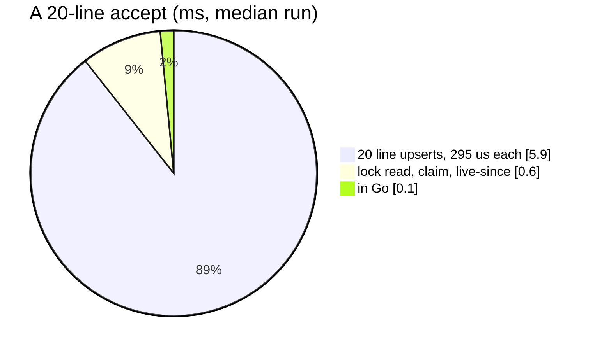
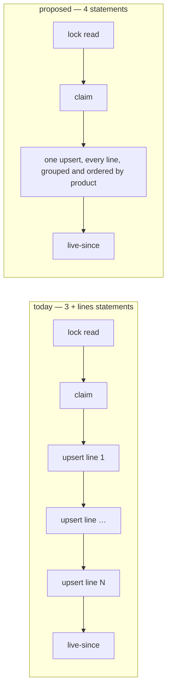

# FoldHandler — performance audit

**Verdict:** ✅ **fixed the same day** (2026-10-07) — ONE upsert for every line (`foldLines`: `unnest`, `GROUP BY` and
`ORDER BY` product), so the fold is **4 statements for any parcel**: 2.1 ms for 20 lines, 5.6 ms for 100. The product
order keeps the concurrency fix ([its report](../concurrency/FoldHandler.md)), re-proved by the race tests. *Was:* 🔴
heavy by the N+1 rule. The fold sent **one upsert per accepted line**, so it ran **3 + lines** statements: 23 for a 20-line accept and 103 for 100 lines.

> Fixed rather than discussed because the code was written by the same pass that audited it, and the fixes decide
> nothing: the same figures, the same order, the same contract — only how the statements are shaped. The report stays
> as the before/after record. Re-measured on a FRESH database per test: rolled-back seeds of half a million rows leave
> enough dead rows to make a second run on the same database read ~4× slower.

*Was, in full:* A 20-line accept takes 7.1 ms and a 100-line one 34 ms, and both numbers grow linearly with the parcel.
**Measured:** 2026-10-07 · `supplier_service/supplier_v1/analytic_fold.go` (`FoldHandler` → `fold` → `foldLine`) · seed **522 070** rows in `supplier_product_daily_reports` (365 days, 2 000 suppliers, 10 000 products, 8 teams) · one `RestockAccepted` of the biggest supplier on the last seeded day, a fresh event id per call · warm, median of 5 · [`analytic_perf_test.go`](../../../../backend/services/supplier_service/supplier_v1/analytic_perf_test.go) (`-tags perfaudit`) · the counts below exclude the test's own `SAVEPOINT`, which production replaces with `BEGIN`

| Lines in the accept | statements | median wall | max |
| --- | --- | --- | --- |
| 1 | 4 | 1.4 ms | 2.2 ms |
| 5 | 8 | 2.7 ms | 3.4 ms |
| 20 | **23** | **7.1 ms** | 7.5 ms |
| 100 | **103** | **34.3 ms** | 35.7 ms |



---

## Queries

| # | What | Rows | Time | Plan | Verdict |
| --- | --- | --- | --- | --- | --- |
| 1 | `SELECT … FROM supplier_service_metadata WHERE key = 'process_event_lock' … FOR SHARE` | 1 | <0.5 ms | Seq Scan of a 3-row table | ok |
| 2 | `INSERT INTO supplier_event_logs … ON CONFLICT (id) DO NOTHING` | 1 | 0.6 ms | pkey arbiter | ok |
| 3 | `INSERT INTO supplier_product_daily_reports … ON CONFLICT (day, supplier_id, product_id, team_id) DO UPDATE` **×lines** | 1 each | 0.30 ms each, 0.05 ms of it in Postgres | `key_idx` arbiter | 🔴 N+1 |
| 4 | `INSERT INTO supplier_service_metadata … ON CONFLICT (key) DO UPDATE … WHERE EXCLUDED.value < …` | 0–1 | <0.5 ms | key arbiter | ok |

---

## Findings

### 1. One round trip per line 🔴

Each line's upsert is cheap inside Postgres (0.05 ms, an index probe and one row). The other ~0.25 ms of each
statement is the round trip. The loop in `fold` pays that once per line, so the fold's time is the parcel's size
times the network.

```
Insert on supplier_product_daily_reports d  (actual time=0.042..0.042 rows=0 loops=1)
  Conflict Resolution: UPDATE
  Conflict Arbiter Indexes: supplier_product_daily_reports_key_idx
  Conflicting Tuples: 1
Execution Time: 0.053 ms
```

**→ Recommend: one upsert for every line of the accept.** It was probed on the same transaction for the 20 lines and took
**0.47 ms** in Postgres for all of them, so the fold becomes 4 statements for any parcel:

```sql
INSERT INTO supplier_product_daily_reports AS d (day, supplier_id, product_id, team_id, …the six…, last_updated)
SELECT CAST(@day AS date), @supplier, l.product_id, @team,
       SUM(l.rc), SUM(l.rv), SUM(l.lc), SUM(l.lv), SUM(l.bc), SUM(l.bv), NOW()
FROM unnest(@products::bigint[], @rc::bigint[], @rv::bigint[], @lc::bigint[], @lv::bigint[], @bc::bigint[], @bv::bigint[])
     AS l(product_id, rc, rv, lc, lv, bc, bv)
GROUP BY l.product_id
ORDER BY l.product_id
ON CONFLICT (day, supplier_id, product_id, team_id) DO UPDATE SET …   -- unchanged
```

- `GROUP BY` is required. If one accept had two lines of the same product, a single statement would fail with
  *ON CONFLICT DO UPDATE command cannot affect row a second time*. Today's loop simply adds the two lines, and the
  sum keeps that result.
- The value stays per line, from `lineValue` in Go, before the sum. That keeps today's arithmetic exactly, because
  each line still rounds once.
- `ORDER BY product_id` makes every fold lock its rows in one order. Today they are locked in the accept's line
  order. Whether that matters under concurrent folds is for the `audit-sql` skill to decide, and it is not claimed here.
- Trade-off: the per-line error (`product %d`) becomes one statement's error. The transaction is all-or-nothing
  already, so nothing is lost but the label.



---

## Proposed migration

None. The upsert's arbiter, `(day, supplier_id, product_id, team_id)`, is the right index. The cost is the number of
statements, not the access path.

---

## Not measured

- concurrency: two accepts of one supplier, day and team folding at once. Run the `audit-sql` skill for that
- `FoldBackfill`, which runs this same fold once per past accept, so its statement count is Σ(3 + lines) over the backfill. It was not timed
- network latency to a non-local Postgres. Each round trip here is ~0.25 ms on localhost, and it would be larger across a network, which strengthens the finding
- Pub/Sub delivery and the push handler's decoding, which happen outside the fold

---

## Open questions

- [x] Fold every line in one upsert? **Adopted** — each line still valued in Go before the sum, so a line rounds once.

---

## History

| Date | Median | Queries | Change |
| --- | --- | --- | --- |
| 2026-10-07 | 7.1 ms @ 20 lines · 34.3 ms @ 100 | 3 + lines | first audit |
| 2026-10-07 | **2.1 ms** @ 20 lines · **5.6 ms** @ 100 | **4** | ✅ one grouped, product-ordered upsert for the whole accept |
