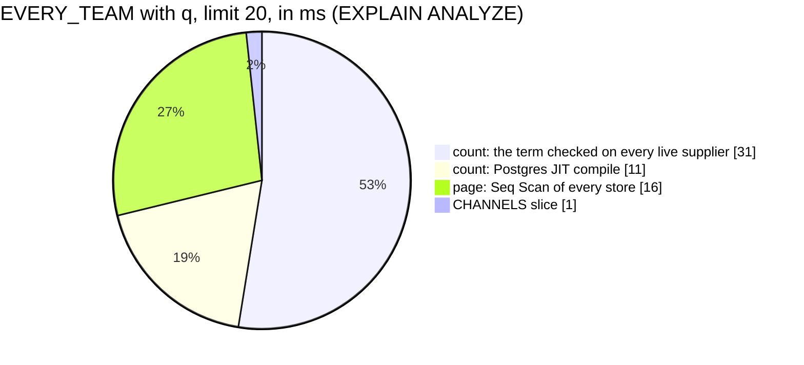

# SupplierList — performance audit

**Verdict:** 🔴 heavy. A Discover search (`EVERY_TEAM` + `q`) checks the search term against **every live supplier and every store**, and does it twice per call (once for the count, once for the page). It takes 56 ms at 10 000 suppliers and 150–240 ms at 30 000. With `channel_type` added, the count alone takes 63 ms at 10 000.
**Measured:** 2026-10-07 · `supplier_service/supplier_v1/supplier_list.go` · seed 10 000 rows in `suppliers` (50 teams × 200, 5 % deleted), 30 300 in `supplier_channels` (3 a supplier, 5 % deleted, channel types skewed toward shopee and tokopedia), plus a 3× run (150 teams, 30 000 suppliers, 90 300 stores) · warm, median of 5 · data request `[SUPPLIER, CHANNELS]`

Headline case: `EVERY_TEAM`, `q = "lestari"`, limit 20, 10 000 suppliers.

| | median | max |
| --- | --- | --- |
| wall | 56.5 ms | 58.4 ms |
| db | 56.5 ms | 58.4 ms |
| in Go (wall − db) | ~0 ms | ~0 ms |
| queries | 3 (the same at limit 20 and limit 200, so no N+1) | |



### Every case, at 1× and 3× volume

| Case | 1×: median wall | 1×: slowest query | 3×: median wall | 3×: slowest query | |
| --- | --- | --- | --- | --- | --- |
| OWN | 1.7 ms | 1.1 ms | 2.1 ms | 1.2 ms | ok |
| OWN, limit 200 | 5.8 ms | 3.5 ms | 5.3 ms | 3.4 ms | ok |
| OWN + q | 32.4 ms | 16.5 ms | 6.2 ms | 2.8 ms | 🟡 [finding 4](#4-own--q-reads-every-teams-stores-at-1-) |
| OWN + `channel_type` | 6.3 ms | 5.5 ms | 2.6 ms | 1.6 ms | ok |
| EVERY_TEAM | 3.0 ms | 2.0 ms | 5.1 ms | 4.8 ms | ok, grows linearly |
| EVERY_TEAM, limit 200 | 5.0 ms | 2.7 ms | 7.4 ms | 4.9 ms | ok |
| **EVERY_TEAM + q** | **56.5 ms** | **41.6 ms** | **156 ms** | **112 ms** | 🔴 [finding 1](#1-the-search-checks-every-supplier-and-every-store-twice-per-call-) |
| **EVERY_TEAM + q, limit 200** | **58.7 ms** | 41.1 ms | **151 ms** | **140 ms** | 🔴 |
| **EVERY_TEAM + q (a rare term)** | **54.4 ms** | 31.3 ms | **174 ms** | **123 ms** | 🔴 |
| **EVERY_TEAM + q + shopee** | **79.5 ms** | **62.9 ms** | **239 ms** | **227 ms** | 🔴 [finding 2](#2-q-and-channel_type-together-check-the-stores-once-per-supplier-) |
| EVERY_TEAM + shopee | 11.6 ms | 13.3 ms | 36.3 ms | 39.0 ms | 🟡 [finding 3](#3-the-channel_type-count-reads-every-store-and-every-supplier-) |
| EVERY_TEAM + shopee, limit 200 | 14.4 ms | 10.4 ms | 47.3 ms | 55.9 ms | 🟡 |
| EVERY_TEAM + bukalapak (a rare type) | 8.4 ms | 7.3 ms | 33.9 ms | 33.9 ms | 🟡 |
| EVERY_TEAM, sorted by name | 8.3 ms | 5.2 ms | 14.9 ms | 10.4 ms | ok ([finding 5](#5-small-and-linear-for-now-)) |
| EVERY_TEAM, page 40 × 200 (OFFSET 7 800) | 12.5 ms | 7.0 ms | 10.7 ms | 6.5 ms | ok |

⚠ Other work was running on the machine during these runs, so the wall times move by up to 1.5× between runs. An
earlier clean run gave 55 ms and 128 ms for the headline case. The EXPLAIN execution times below are steadier. The
pattern was the same in every run.

---

## Queries

| # | What | Rows | Time (1× · 3×) | Plan | Verdict |
| --- | --- | --- | --- | --- | --- |
| 1 | `SELECT count(*) FROM suppliers WHERE deleted_at IS NULL AND (name ILIKE ? OR address ILIKE ? OR contact ILIKE ? OR EXISTS (store with name ILIKE ?))` | 1 | 42 ms · 102 ms | Index Scan `suppliers_team_live_idx` over **all** live suppliers, Filter, plus a hashed SubPlan that is a **Seq Scan on `supplier_channels`** · JIT 8–11 ms | 🔴 |
| 2 | the same `… ORDER BY id DESC LIMIT n` | 20 | 16 ms · 48 ms | Index Scan Backward `suppliers_pkey`, plus **the same Seq Scan on `supplier_channels`** | 🔴 |
| 3 | `supplier_channels WHERE supplier_id IN (the page's ids) AND deleted_at IS NULL ORDER BY supplier_id, id` | ~60 · ~570 | 0.09 ms · 0.3 ms | Index / Bitmap Scan `supplier_channels_supplier_live_idx` | ok: one query at any page size |

---

## Findings

### 1. The search checks every supplier and every store, twice per call 🔴

A substring `ILIKE '%term%'` cannot use a B-tree index. The `OR EXISTS (…)` stops Postgres from turning the store
search into a join. So it runs the store search as a hashed SubPlan, which is a full **Seq Scan of every team's
stores**. The count then checks the term against all 9 500 live suppliers, three columns each. The page query repeats
the store scan. Both costs grow with the **whole** table, across all teams.

```
Aggregate  (actual time=36.837..36.838 rows=1 loops=1)
  ->  Index Scan using suppliers_team_live_idx on suppliers  (actual time=22.494..36.737 rows=1218 loops=1)
        Filter: ((name ~~* '%lestari%') OR (address ~~* '%lestari%') OR (contact ~~* '%lestari%') OR (ANY (id = (hashed SubPlan 2).col1)))
        Rows Removed by Filter: 8282
        SubPlan 2
          ->  Seq Scan on supplier_channels c  (actual time=0.159..14.719 rows=899 loops=1)
                Filter: ((deleted_at IS NULL) AND (name ~~* '%lestari%'))
                Rows Removed by Filter: 29398
JIT:  Functions: 17   Timing: … Total 8.105 ms
Execution Time: 37.490 ms
```

The estimated cost of the count (~118 000) is above Postgres' `jit_above_cost` (100 000). So every Discover search also
pays 6–12 ms to compile the query.

**I probed the fix inside the test's own transaction.** I created `pg_trgm` and the two indexes below there, so they
were rolled back with the test (`TestPerf_SupplierList_TrigramProbe`):

| Count query (EXPLAIN, 1× · 3×) | common term | rare term |
| --- | --- | --- |
| today | 42 ms · 102 ms | 30 ms · 153 ms |
| trigram indexes, handler unchanged | 23 ms · 53 ms | 21 ms · 47 ms |
| trigram indexes + the UNION rewrite | **4.4 ms · 13.9 ms** | **0.34 ms · 0.61 ms** |
| page query, trigram + UNION | 3.9 ms · 8.8 ms | 0.5 ms · 0.9 ms |

The index alone is **not enough**: the store side uses it, but the count still checks every supplier row by row. The
rewrite turns the search into a set of matching ids, and each half of that set reads its own trigram index:

```sql
suppliers.deleted_at IS NULL AND suppliers.id IN (
    SELECT id          FROM suppliers         WHERE deleted_at IS NULL AND (name ILIKE ? OR address ILIKE ? OR contact ILIKE ?)
    UNION
    SELECT supplier_id FROM supplier_channels WHERE deleted_at IS NULL AND name ILIKE ?)
```

**→ Recommend:** add `pg_trgm` and both GIN indexes ([proposed migration](#proposed-migration)), **and** rewrite the `q`
predicate as that `id IN (… UNION …)`. The matching rules stay the same: the same columns, the same live-store rule.
The cost is one extension in the shared database, and a GIN index on each table. Both tables are written by people, a
few rows at a time. In the OWN scope, put `team_id` **inside** both halves ([finding 4](#4-own--q-reads-every-teams-stores-at-1-)).

### 2. `q` and `channel_type` together check the stores once per supplier 🔴

With both filters, the planner starts from the store types (6 438 suppliers with a shopee store). For each of those
suppliers it looks the supplier up and runs the store-name EXISTS separately. That is a Nested Loop of **6 438** index
probes, plus **5 837** per-row SubPlan probes.

```
Aggregate  (actual time=81.991..81.992 rows=1 loops=1)
  ->  Nested Loop  (actual time=8.550..81.795 rows=798 loops=1)
        ->  HashAggregate  ->  Seq Scan on supplier_channels c  (rows=8764)  Rows Removed by Filter: 21533
        ->  Index Scan using suppliers_pkey on suppliers  (actual time=0.011..0.011 rows=0 loops=6438)
              Filter: (… OR EXISTS(SubPlan 1))
              SubPlan 1 ->  Index Scan using supplier_channels_supplier_live_idx  (loops=5837)
Execution Time: 82.183 ms
```

At 1× this count took 38–82 ms across runs, and 143–227 ms at 3×.

**→ Recommend:** the same rewrite as finding 1. I probed it: with `channel_type` kept as its own `EXISTS`, the count
took **6.4 ms · 30.8 ms** (1× · 3×) for a common term and 0.7 · 0.9 ms for a rare one.

### 3. The `channel_type` count reads every store and every supplier 🟡

`EXISTS (… channel_type = ?)` becomes a Hash Join: a Seq Scan of all stores of that type, joined to a Seq Scan of all
9 500 live suppliers. The page query is fast (a Merge Semi Join that stops at the page, under 1.3 ms). The **exact
count** is the cost: 8–12 ms at 1×, 27–47 ms at 3×.

I probed an index on `supplier_channels (channel_type, supplier_id) WHERE deleted_at IS NULL`
(`TestPerf_SupplierList_ChannelTypeIndexProbe`). The store side became a Bitmap Index Scan. The count dropped to
5.8 ms (shopee) and 2.2 ms (bukalapak) at 1×, and 19 ms and 7.5 ms at 3×. The Seq Scan on `suppliers` stays, because
a common type matches most of them.

**→ Recommend:** no index yet. It saves about a third for a common type, and the count stays linear. If Discover
grows past ~50 000 suppliers, the lever is the count itself ([open question](#open-questions)), not an index.

### 4. OWN + q reads every team's stores at 1× 🟡

At 10 000 suppliers, the planner checks one team's 200 suppliers against the same full Seq Scan of every team's
stores: 14–16 ms per query, twice. At 3× it switches to per-row index probes and takes 1.3–2 ms. The plan corrects
itself, but in the band where it does not, one team's search slows down as other teams add stores.

The probed rewrite with `team_id` left **outside** the UNION took 2.8 ms at 1× but **11.7 ms at 3×**. The global id
set grows with every team. That would make the 3× case slower than it is today.

**→ Recommend:** when finding 1 is fixed, put `team_id = ?` inside the suppliers half, and join the stores half to
`suppliers` with `team_id = ?`. Not probed.

### 5. Small and linear for now 🟡

| | 1× | 3× | Plan |
| --- | --- | --- | --- |
| EVERY_TEAM count, no filter | 1.5 ms | 5.0 ms | Seq Scan `suppliers` |
| sorted by name | 3.7 ms | 9.1 ms | Seq Scan + top-N heapsort (no index on `name`) |
| OFFSET 7 800 | 1.7 ms | — | Index Scan Backward `suppliers_pkey`, 8 000 rows walked |

**→ Recommend:** nothing now. Re-audit when Discover holds ~100 000 suppliers.

---

## Proposed migration

A **proposal**, not applied (HARD RULE 3: it belongs to supplier_service and is the owner's call). The indexes are the
ones probed above.

```sql
-- backend/services/supplier_service/db_migrations/00002_supplier_search_trigram.sql
-- +goose NO TRANSACTION
-- +goose Up
CREATE EXTENSION IF NOT EXISTS pg_trgm;
CREATE INDEX CONCURRENTLY suppliers_search_trgm_idx ON suppliers
    USING gin (name gin_trgm_ops, address gin_trgm_ops, contact gin_trgm_ops) WHERE deleted_at IS NULL;
CREATE INDEX CONCURRENTLY supplier_channels_name_trgm_idx ON supplier_channels
    USING gin (name gin_trgm_ops) WHERE deleted_at IS NULL;

-- +goose Down
DROP INDEX CONCURRENTLY IF EXISTS supplier_channels_name_trgm_idx;
DROP INDEX CONCURRENTLY IF EXISTS suppliers_search_trgm_idx;
-- no DROP EXTENSION: another service may come to rely on it
```

Cost: two GIN indexes. Each supplier insert or edit, and each store insert or edit, also writes trigram entries
(`address` is up to 500 characters). Both tables are low-write. The migration also brings the **first** extension into
the shared database.

---

## Not measured

- concurrency (a single caller)
- cache-cold buffers (everything was `shared hit`)
- production data: the seed draws names from 60 words, uniformly. Real supplier names and addresses are longer and
  skewed, and real teams vary in size where the seed gives every team 200.
- search terms of 1–2 characters: trigram indexes cannot narrow them, and nothing in the proto stops them (`q` has
  `max_len 100` and no `min_len`)
- the production server's `jit` / `jit_above_cost` settings (this is a stock Postgres)
- the write cost of the proposed GIN indexes
- the [finding 4](#4-own--q-reads-every-teams-stores-at-1-) rewrite with `team_id` inside the UNION

---

## Open questions

- [ ] **Adopt `pg_trgm`?** It would be the first extension in the shared database. A migration of supplier_service can
  create it (`IF NOT EXISTS`, never dropped). I would adopt it: Discover's store-name search depends on it.
- [ ] **A minimum length for `q`.** Add `min_len: 3` in the proto, or keep the slow path for 1–2 character terms? I
  would add `min_len: 3`: a 2-letter infix search over every team's suppliers is not a useful result anyway.
- [ ] **An exact `total_items` on Discover.** Keep it exact, or cap it (for example "1 000+")? I would keep it exact
  for now. With the rewrite, the `q` count costs 4–14 ms. Revisit the `channel_type` count if Discover grows past
  ~50 000 suppliers.

---

## History

| Date | Median (headline case, 1× · 3×) | Queries | Change |
| --- | --- | --- | --- |
| 2026-10-07 | 56.5 ms · 156 ms | 3 | first audit |
