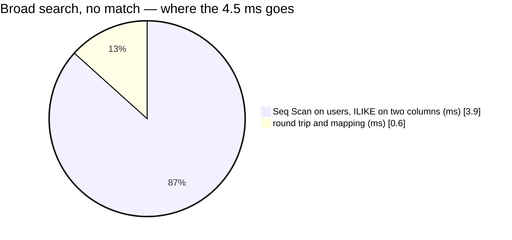

# SearchUser — performance audit

**Verdict:** 🟡 heavy by the rule. Root's and the Administrator's broad search reads every account when nothing matches (a sequential scan on `users`). That takes 4.5 ms at 10 000 users and grows with the table. The Owners' exact search, which is most calls, uses an index and takes 1 ms.
**Measured:** 2026-10-06 · `user_service/user_v1/search_user.go` · seed 10 000 rows in `users` (every one with a phone), 30 000 in `user_team_roles` · warm, median of 5

| | exact username | exact email | exact phone | broad, 10 found | broad, none found |
| --- | --- | --- | --- | --- | --- |
| wall | 0.75 ms | 1.0 ms | 1.0 ms | 1.0 ms | **4.5 ms** |
| queries | 2 | 2 | 2 | 2 | 1 |
| plan | BitmapOr of three index scans | the same | the same, `users_phone_key_idx` | Index Scan `users_pkey`, 500 rows filtered | **Seq Scan, 10 003 rows filtered** |

The second query is `roles_in_team` (`user_team_roles` by team and the found ids, an index scan). It does not run
when nothing is found.



---

## Queries

| # | What | Rows | Time | Plan | Verdict |
| --- | --- | --- | --- | --- | --- |
| 1 | exact — `NOT is_suspended AND (LOWER(username) = ? OR (email <> '' AND LOWER(email) = ?) OR (phone_number <> '' AND user_phone_key(phone_number) = user_phone_key(?)))` | 1 | 0.08 ms | BitmapOr: `users_username_unique`, `users_email_unique`, `users_phone_key_idx` | ok |
| 1 | broad — `NOT is_suspended AND (username ILIKE '%q%' OR name ILIKE '%q%') ORDER BY id LIMIT 10` | 0–10 | 0.3–3.9 ms | Index Scan `users_pkey` + Filter, or Seq Scan | 🟡 |
| 2 | `user_team_roles WHERE team_id = ? AND user_id IN (…)` | ≤ 10 | < 0.1 ms | Index Scan | ok |

---

## Findings

### 1. The broad search reads the whole table when its term is rare 🟡

A substring (`%q%`) cannot use a B-tree index, so Postgres walks the primary key and stops after 10 matches. A
common term stops early (500 rows read for `perfuser50`). A term that matches nobody reads all 10 003 rows. It is
linear: about 45 ms at 100 000 accounts.

```
Seq Scan on users  (actual time=3.861..3.861 rows=0 loops=1)
  Filter: ((NOT is_suspended) AND ((username ~~* '%zzqq%') OR (name ~~* '%zzqq%')))
  Rows Removed by Filter: 10003
Execution Time: 3.893 ms
```

This existed before this change. What changed is who can run it: before, anyone signed in, on every keystroke of
three pickers. Now only Root and the Administrator can (only-member-managers-open-the-search). The Owners and Admins,
who make most of the calls, use the exact search.

**→ Recommend:** leave it for now. Two people can run it, and it costs 4.5 ms at a user count this system will not
reach for a long time. If it ever matters, add the trigram indexes below. I would not add them until the user table
is ten times larger: they cost every account write some time, and pull in an extension.

---

## Proposed migration

A **proposal**, not applied (HARD RULE 3: it belongs to user_service and is the owner's call).

```sql
-- backend/services/user_service/db_migrations/000NN_user_search_trigram.sql
CREATE EXTENSION IF NOT EXISTS pg_trgm;
CREATE INDEX users_username_trgm_idx ON users USING gin (username gin_trgm_ops);
CREATE INDEX users_name_trgm_idx     ON users USING gin (name gin_trgm_ops);
```

Cost: two GIN indexes updated on every user insert and rename, and an extension in the shared database. `UserList`'s
own `ILIKE` over username, name and email would benefit too.

---

## Not measured

- concurrency (a single caller)
- cache-cold buffers
- production data: real names repeat (many "Ani"s), so a common first name stops the walk early more often than the
  uniform seed does

---

## Open questions

- [ ] Trigram indexes for the broad search — now or at ~100 000 accounts? I would wait.

---

## History

| Date | Median | Queries | Change |
| --- | --- | --- | --- |
| 2026-10-06 | 1.0 ms exact · 4.5 ms broad miss | 2 · 1 | first audit — scoped to managers, exact search for Owners and Admins, `users_phone_key_idx` (`00007`) |
| 2026-10-06, later | ~1.0 ms exact phone · 1.2 ms broad | 2 | phones stored in one form (`00008`): the phone arm is `phone_number = ?` on `users_phone_unique`; Root's broad search keeps the exact arms too. The broad miss is unchanged — still a seq scan |
