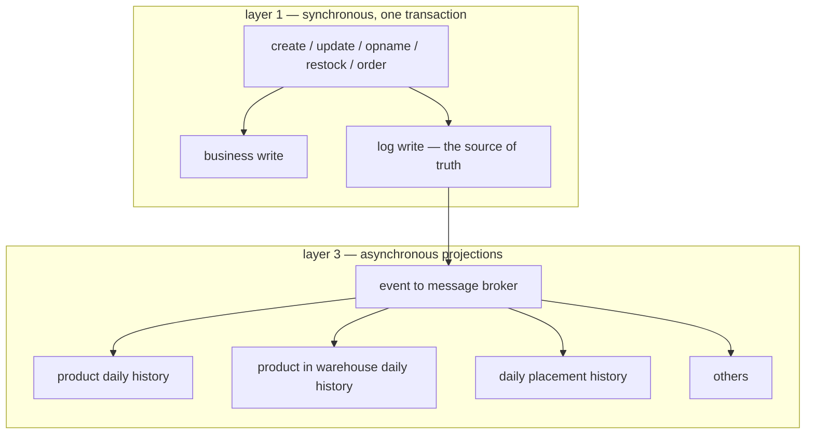
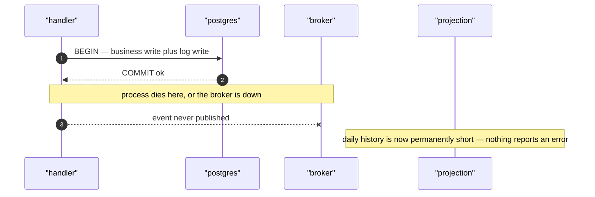
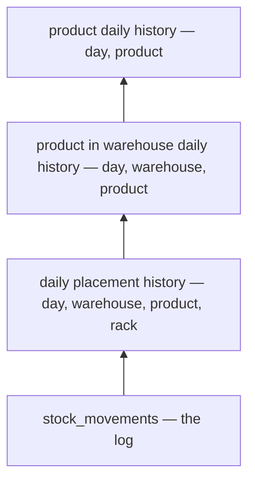
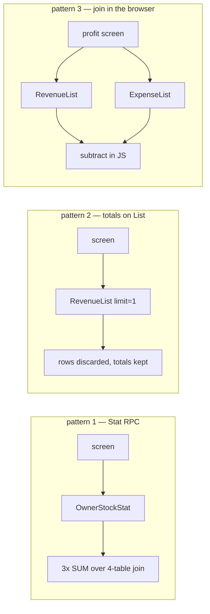
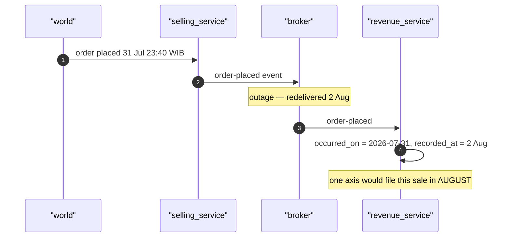
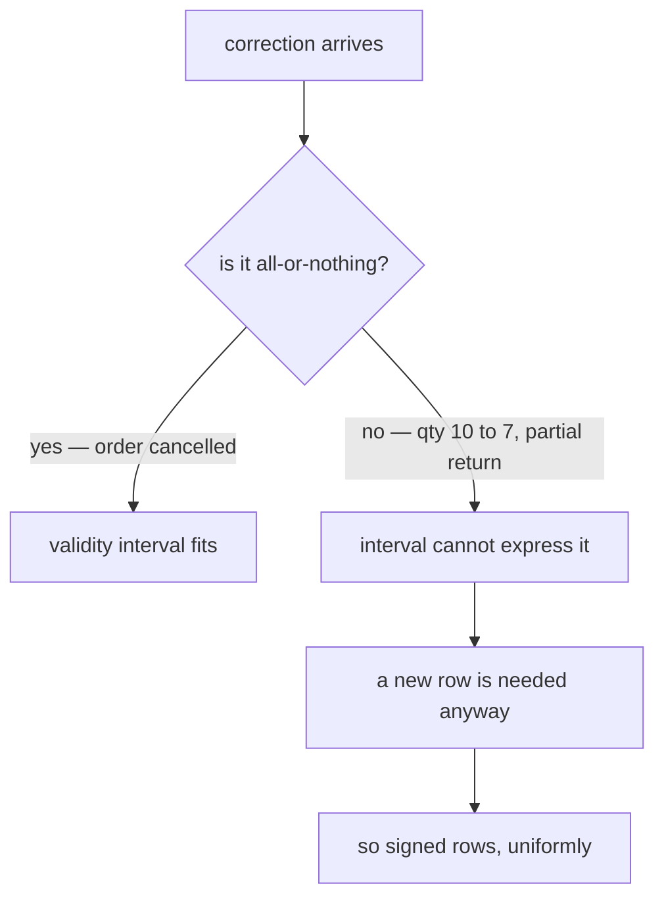
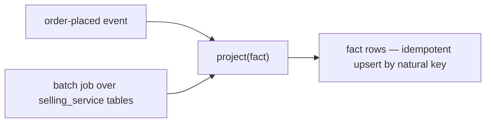

# Data Processing Foundation — statistics & analytics

The architectural primitives for how this system **computes, stores and serves aggregates**.

This is deliberately **not** about business features — no screens, no audiences, no "what report does
the owner want". It is about the plumbing every one of those would sit on. Feature-level design goes
in `plans/<service_name>/brainstorming.md`.

> **How to read this.** Each `§` is ONE primitive. Each ends in a numbered **open question** with
> checkboxes. Tick a box, or write your own answer under it — that is the collaboration. Nothing here
> is decided; the recommendation is an argument to disagree with, not a default that will be built.

---

## Decision log

| # | Decision | Status | Notes |
| --- | --- | --- | --- |
| D1 | Fact grain declared by a unique constraint | **proposed** | §1 — already done once, by instinct |
| D2 | Two time axes (`occurred_on` + `recorded_at`) on every fact row | **OPEN — Q2** | §2 |
| D3 | Business timezone is a system constant, bucketed at write time | **OPEN — Q3** | §2 |
| D4 | Ratios and averages are never stored | **OPEN — Q4** | §3 |
| D5 | Unknown ≠ zero — uncertainty travels as a sibling count | **proposed** | §4 — already done twice |
| D6 | Correction model: signed rows vs validity interval | **OPEN — Q5** | §5 — both exist today |
| D7 | Every projection must be rebuildable in batch | **OPEN — Q6** | §6 |
| D8 | `pkgs/san_stat` holds the machinery, services own their tables | **OPEN — Q7** | §7 |
| D9 | Analytical reads are as-of and carry `as_of_unix` | **OPEN — Q8** | §8 |
| D10 | Where aggregation runs (live SQL / rollup / analytic svc / OLAP) | **OPEN — Q9** | §9 |
| D11 | **Three-layer pipeline: sync log → broker event → daily stat tables** | **OWNER'S PROPOSAL** | §P |
| D12 | The log is the outbox, or the broker is the transport of record | **OPEN — Q10** | §P.3 |
| D13 | One fact table at finest grain, or a table per grain | **OPEN — Q11** | §P.4 |
| D14 | Closing balance in a daily row — how it survives unordered events | **OPEN — Q12** | §P.5 |
| D15 | Open day live vs projected | **OPEN — Q13** | §P.6 |

---

## §P The proposed architecture — three layers *(owner)*

> **This is the owner's proposal and the focus of the discussion.** Stated first and on its own terms.
> The questions it raises are `§P.3`–`§P.6`; the general primitives in `§1`–`§9` are what those
> questions draw on, not a competing design.

**Worked example: `inventory_service`.**

### P.1 The shape

1. **A table holds the source of truth, like a LOG.**
2. On **create / update / opname / restock / order**, the business write and the log write happen in
   **ONE synchronous transaction**.
3. **Second, an event goes to the message broker.**
4. The event is **processed to build up statistical tables** — *product daily history*, *product in
   warehouse daily history*, *daily placement history*, and others.



### P.2 Layers 1 and 2 already exist in inventory

This is the strongest thing about the proposal: **for inventory it is not new machinery, it is naming
a pattern that is already running** and adding layer 3.

| Proposal | What inventory already has |
| --- | --- |
| "a table that holds source of truth like a log" | `stock_movements` — *"the APPEND-ONLY ledger, the source of truth. Every change to on-hand is one row with a cause (Kind) and a signed Delta"* |
| "sync write transaction and log" | `stock_levels` — *"a cache of SUM(delta) over the ledger, **maintained inside each movement's transaction**"* |
| "send event to message broker" | `event_source` + push handlers, already live in `revenue_service` / `settlement_service` |
| "statistical tables" | **nothing yet — this is the new layer** |

So layer 2 (`stock_levels`) is already a **synchronous** projection of the log, and the proposal adds
**asynchronous** projections beside it. That is a coherent split, and worth stating explicitly as the
rule it implies:

> A projection needed to **decide** something (can I pick this? is on_hand >= 0?) is synchronous and
> in the transaction. A projection needed to **report** something is asynchronous off the broker.

`stock_levels` has a `CHECK (on_hand >= 0)` — it *enforces* an invariant, so it cannot be async. A
daily history table enforces nothing, so it can be.

### P.3 ⚠ The dual write is not atomic — and the log already fixes it

Steps 2 and 3 are **two separate writes to two separate systems.** The transaction commits, then the
publish happens. If the process dies in between, or the broker is unreachable, **the event is lost
permanently** — and every daily history table is silently wrong from that moment, with nothing to
detect it. The log says 49 units, the daily history never heard about them, and both look fine.



**The fix is nearly free, because the log is already in the transaction.** Give it a monotonic id
(`stock_movements.ID` is already `BIGSERIAL`) and a publisher cursor, and the log **becomes the
outbox**:

| | Broker is transport of record | **Log is the outbox** |
| --- | --- | --- |
| A lost message means | permanent silent drift | nothing — the cursor has not advanced, it republishes |
| Rebuild a projection | impossible, events are gone | replay by id range |
| Watermark ("is day D complete?") | guesswork, a time-based grace period | exact — cursor position vs max id for that day |
| Extra machinery | none | a cursor table and a publisher loop |

This reframes the broker as a **latency optimisation, not the transport of record**. It also answers
§6 (rebuildability) for free, and gives a real watermark instead of a grace period.

> **Q10.** Is the log the outbox?
> - [ ] Yes — publish by tailing the log with a cursor, broker is an optimisation
> - [ ] No — publish directly after commit, accept that a lost event needs a manual batch repair
> - [ ] Publish directly, but add a periodic reconcile job that compares log vs projection
> - [ ] Other: ______

### P.4 The three named tables are a CUBE — one table or three?

The three tables named are the same facts at three grains:

| Table | Grain | Derivable from the one below? |
| --- | --- | --- |
| product daily history | `(day, product)` | ✅ `GROUP BY` |
| product in warehouse daily history | `(day, warehouse, product)` | ✅ `GROUP BY` |
| daily placement history | `(day, warehouse, product, rack)` | — the finest |



So there is a real choice:

| | Option | ✅ | ❌ |
| --- | --- | --- | --- |
| a | **One table at placement grain**, roll up on read | one projector, one truth — the three views cannot disagree | every product-level read scans rack-level rows |
| b | **Three tables**, three projectors | each read is a single indexed scan | three chances to disagree, and they will |
| c | **One table + coarser ones added only when measured** | starts simple, stays correct | needs the discipline to actually measure |

The row-count argument favours (a) more than it looks: placement grain is *distinct (product, rack)
touched per day*, and a product sits on a handful of racks — so the fan-out over
`(day, warehouse, product)` is small, single digits. The compression against the raw log is still
large either way.

⚠ **`rack_id` is NULLABLE** ("unplaced" is a real state, #135/#136), and `stock_levels` already paid
for this lesson: a nullable column in an identity needs `NULLS NOT DISTINCT` on the unique index and
`IS NOT DISTINCT FROM` in every write, because `rack_id = NULL` matches nothing in SQL — *"it would
silently no-op on unplaced stock"*. Any placement-grain daily table inherits that exact trap.

> **Q11.** One fact table or a table per grain?
> - [ ] a — one table at placement grain, `GROUP BY` on read
> - [ ] b — a table per grain, as named in the proposal
> - [ ] c — start with one, add coarser tables only when measurement demands
> - [ ] Other: ______

### P.5 ⚠ Balance is order-sensitive — the sharpest trap in the design

`stock_movements` carries both:

- **`Delta`** — signed change. Addition **commutes**, so out-of-order arrival is harmless.
- **`Balance`** — *"the on-hand of THIS PLACE after the movement"*. **Order-dependent.**

Pub/Sub does **not** guarantee ordering. So a daily history row that stores a **closing balance**
built from unordered events will sometimes record the second-to-last movement's balance as the day's
close — a plausible, wrong number that no constraint catches.

Three ways out:

| | Option | Notes |
| --- | --- | --- |
| a | Store **only deltas** in the daily row | order-safe by construction, but "closing stock on 12 Jul" is then a running total from the beginning of time |
| b | Store closing balance as **`Balance` of the MAX movement id** for that day and place | correct regardless of arrival order — the log's monotonic id is the tiebreak, not arrival time |
| c | Take a **snapshot** at the day boundary | simple, but unrebuildable — you cannot go back and snapshot last Tuesday |

**(b) is available precisely because `Balance` and a monotonic id are both already on the log row.**
And it makes closing stock for any past day reconstructible — which (c) cannot do. The query is a
window function (`DISTINCT ON (place) ... ORDER BY id DESC`), not a `SUM`, and that shape difference
is worth knowing up front.

This is the concrete resolution of the semi-additive problem in §3: **for inventory, the level IS
derivable from the log**, because the log records on-hand after each movement. A daily history row can
therefore carry both honestly — `delta_in` / `delta_out` (flow, additive) **and** `closing_on_hand`
(level, semi-additive, never summed across days).

> **Q12.** How does the daily row carry the level?
> - [ ] b — closing balance from the MAX movement id per place per day
> - [ ] a — deltas only, derive levels as a running total
> - [ ] c — a snapshot job at the day boundary
> - [ ] Both flow and level columns, with the level flagged as never-summable
> - [ ] Other: ______

### P.6 The open day is a different problem from a closed day

A **closed** day is immutable except for corrections — write it once, read it forever. **Today** is
changing constantly, and any counter kept for it is a hot row every writer contends on.

| | Option | ✅ | ❌ |
| --- | --- | --- | --- |
| a | **Project every day, including today**, incrementally | one code path, one place to read | hot-row contention, and today's number always lags the log |
| b | **Seal closed days, compute TODAY live from the log** | today is exact and live, no contention, no lag | two code paths, and the read is a union |

(b) has a property worth noticing: **it largely dissolves Q8.** "Last 30 days" becomes 29 sealed rows
(one indexed scan) plus one live `SUM` over today's movements only — a small, bounded scan. The number
people look at most is *live*, so the as-of caveat applies only to history, which is immutable anyway.
That is a much easier promise to keep than "the whole dashboard is 40 seconds behind".

Sealing needs to be **repeatable, not final** — a late fact for a sealed day re-seals it rather than
being dropped. With the log-as-outbox (P.3) the trigger is exact: re-seal day D when a movement lands
whose `occurred_on` is D and whose id is above the seal's high-water mark. A `sealed_at` and a
`sealed_through_id` on each daily row make "was this report built from a stale seal?" answerable.

> **Q13.** How is the current day handled?
> - [ ] b — seal closed days, compute today live from the log
> - [ ] a — project every day including today
> - [ ] Other: ______

### P.7 What is still open in the proposal

- **Which timezone `occurred_on` uses**, and that it is computed at write time (§2 / Q3). The log has
  only `CreatedAt TIMESTAMPTZ` today, so "daily" has no defined boundary yet — and
  `revenue_list.go` shows what happens when the boundary is left to the reader.
- **Whether the log is the outbox** (P.3 / Q10) — the one with a permanent, silent failure mode.
- **`Kind` is an int32 enum on the log.** Which kinds a daily table must separate (receive / pick /
  move / adjust / recount) decides its columns, and that is a business question — flagged, not
  answered here.
- **Cross-service dimensions.** `product_id` and `warehouse_id` are opaque ids from other services. A
  daily history keyed on them is fine, but "daily history **by category**" needs a dimension inventory
  does not own — that is §D (frozen vs live dimensions) and it arrives the moment a report groups by
  anything product_service owns.
- **Opname (stock count) is a correction, not a flow.** It is in the proposal's trigger list, and a
  recount that reconciles a shelf from 40 to 37 is not the same kind of fact as picking 3 units, even
  though both are a `-3` delta. Whether a daily table separates them changes what "stock out" means.

---

## §0 Where we are today — facts, not proposals

### 0.1 There are already FOUR ways an aggregate reaches a screen

| | Pattern | Example |
| --- | --- | --- |
| 1 | A dedicated **Stat RPC** returning a `preview` | `OwnerStockStat`, `RestockInboundStat`, `OrderActivityStat` |
| 2 | **`totals` ride along on a List response** | `RevenueList.totals`, `ExpenseList.totals`, `CostLayerList.total_value` |
| 3 | **The frontend joins two services** and does the arithmetic | `useProfit` |
| 4 | **`useEffect` / session cache**, never went through TanStack | `CategorySelect`, `SupplierSelect`, the courier catalogue |



`guidelines/service-guideline.md` separates §Overview from §List so that 1 and 2 are different things.
The code folds totals into List and passes `limit: 1` to avoid paying for rows it throws away. That is
not a bug — it is a **missing pattern being worked around**.

### 0.2 The cross-service join currently happens in the browser

[frontend/src/pages/profit/queries.ts:38-48](../../frontend/src/pages/profit/queries.ts#L38-L48) —
the comment calls it *"THE QUERY THE WHOLE EPIC WAS ABOUT"*:

```ts
const [rev, cost] = await Promise.all([
  revenueClient.revenueList({ teamId, filter: { from, to }, page: totalsOnly }),
  expenseClient.expenseList({ teamId, filter: { from, to, ... }, page: totalsOnly }),
]);
return { revenue: rev.totals, expenses: cost.totals };
```

Three consequences, in increasing order of how much they matter:

- **All-or-nothing coupling.** Correctly defended in the comment — a half-answer would report the
  month's whole margin as profit. But one service's hiccup blanks a screen.
- **No server can ever cache it.** The subtraction happens in a browser, so the answer has no name on
  the server, no cache key, and no way to be precomputed.
- **You cannot GROUP.** "Profit by month for 12 months" is 24 requests. "Revenue by shop" is not
  expressible. With `staleTime: 0`, that is 24 requests **per mount**.

The guideline names four things a stat consists of — **Preview, Daily (time range), Grouping,
Sorting**. Only Preview has a specified shape. The absence of Daily and Grouping is what pushes the
N+1 into the frontend.

### 0.3 The day boundary is UTC, and nothing says so

[backend/services/revenue_service/revenue_v1/revenue_list.go:242](../../backend/services/revenue_service/revenue_v1/revenue_list.go#L242)
— `time.Parse(dateLayout, from)` parses in **UTC**. So "July" runs 1 Jul 07:00 → 1 Aug 07:00 Jakarta.
Every month boundary misattributes seven hours of orders.

The function is otherwise careful — it has a long correct comment about the half-open upper bound. The
timezone is not wrong-because-sloppy, it is wrong because **there is nowhere for a business timezone
to be declared.** That is a foundation gap, not a code defect.

### 0.4 `order_revenues` already answered five primitives — ad hoc

`revenue_service` is already a **read model**: it owns no source of truth, subscribes to
`order-placed` / `order-cancelled` via a push handler, and materializes `order_revenues`. Nobody has
named it as the architecture, but it is one.

And its migration decided five of the six primitives below, by instinct, in comments:

| Primitive | What it decided | Generalizes? |
| --- | --- | --- |
| Grain | `UNIQUE INDEX (order_id)` — *"a duplicate would double every total"* | ✅ yes, §1 |
| Time axes | one — `created_at DEFAULT NOW()` | ❌ **gap**, §2 |
| Additivity | stores derived `expected_margin` | ⚠ defensible, but see §3 |
| Value quality | `cost_known BOOLEAN` — *"a margin over an unknown cost reads as pure profit"* | ✅ yes, §4 |
| Correction | `voided_at` nullable timestamp | ⚠ one of two models, §5 |

**This is the actual problem this doc exists to fix.** Not performance — the primitives are being
decided one migration at a time, by whoever writes it, and the good judgement in `order_revenues` is
not written down anywhere that the next twelve tables will see.

---

## §1 Grain — what one row IS

`order_revenues` gets this right and says why:

> *One record per order. Recording twice is a caller bug, and a duplicate would double every total
> computed from this table — the kind of error that looks like good news.*

**A fact table's grain is a unique constraint, or it is a rumor.** The proposal is only that this
becomes stated rather than re-derived per table.

It also buys idempotency for free, which matters more than it looks: Pub/Sub push is **at-least-once**
and CLAUDE.md already requires a dead-letter policy. Without a natural-key constraint, a redelivery
double-counts silently. With one, it is `ON CONFLICT DO NOTHING`.

> **Q1.** Grain declared as a unique constraint on every fact table, always?
> - [ ] Yes — make it a rule
> - [ ] Yes, but a soft one (some fact tables may be append-only with no natural key)
> - [ ] Other: ______

---

## §2 Time axes — how many, and in what timezone

`order_revenues` has one axis: `created_at TIMESTAMPTZ DEFAULT NOW()`, and every report groups by it.
But that is **when we recorded the fact**, not **when the fact happened**. Those coincide only when
recording is synchronous and never backfilled — neither survives an event-fed projection. An
`order-placed` redelivered after an outage lands with tomorrow's `NOW()`.

| Axis | Means | Answers |
| --- | --- | --- |
| `occurred_on` (DATE, business tz) | when it happened in the world | "sales in July" |
| `recorded_at` (TIMESTAMPTZ) | when we learned it | "what did we believe on 1 Aug" |



The second axis is what makes a report **reproducible**. Without it, re-running last month's report
next week can give a different answer and nobody can tell a correction from a bug.

**Recommendation: both, on every fact row.** They are 8 bytes, and `occurred_on` cannot be
reconstructed later. The cost is real though: every read must declare which axis it groups by, which
is a permanent tax on every query and every proto message.

**On timezone** — `occurred_on` is a `DATE` in a declared business timezone, computed **at write
time**. Then grouping is `GROUP BY occurred_on`: no `AT TIME ZONE` in any query, and no
`created_at::date` defeating the index (which the current code explicitly avoids for that reason).

| | Option | ✅ | ❌ |
| --- | --- | --- | --- |
| a | **Fixed system constant** (`Asia/Jakarta`) | one answer, index-friendly, no per-request logic | wrong if teams ever span WITA/WIT |
| b | **Per team** | correct across provinces | two teams' reports never comparable, joins get hard |
| c | **Per request from the client** | flexible | the same figure changes by who is looking |

> **Q2.** One time axis or two?
> - [ ] Two — `occurred_on` + `recorded_at` on every fact row
> - [ ] One — accept that recording time is the business time
> - [ ] Other: ______
>
> **Q3.** Business timezone:
> - [ ] a — fixed `Asia/Jakarta` system constant
> - [ ] b — per team
> - [ ] c — per request
> - [ ] Other: ______

---

## §3 Additivity classes — what may be STORED

This is the one where `order_revenues` breaks the obvious rule **for a good reason**, and the reason
matters more than the rule.

`expected_margin BIGINT NOT NULL` is a derived value, stored. The comment:

> *Stored rather than derived because #76 reconciles against it, and a number you reconcile against
> must be the one you actually promised.*

That is correct — because `expected_margin` **is not a derived metric at all. It is a recorded
promise** that happens to be computed from other facts. Storing it is the entire point.

But if that generalizes to "store computed metrics", the foundation breaks, because most computed
metrics do not survive aggregation:

| Class | Example | Sums across buckets? |
| --- | --- | --- |
| **Additive** | revenue, qty, cogs, count | ✅ freely |
| **Semi-additive** — a LEVEL | stock on hand | ❌ over time · ✅ over other dimensions |
| **Non-additive ratio** | margin %, fill rate | ❌ ever — store numerator + denominator, divide on read |
| **Non-additive distinct** | unique products sold, active shops | ❌ at all — needs base rows or HLL |
| **Recorded promise** | `expected_margin` | ✅ it is a stored fact, not a ratio |

So the proposed rule is narrower than "never store derived":

> **A fact row stores additive components and recorded promises. A ratio or an average is NEVER
> stored — it is computed at read from two stored components.**

Store `margin_sum` and `order_count`; never `avg_margin`. A stored average summed across twelve
months is wrong in a way no test catches, because the result is plausible.

**The semi-additive row is the sharp one.** `OwnerStockStat.ready_qty` is a **level**, not an event.
An incremental counter over a level goes permanently wrong the first time history is corrected —
someone fixes a movement dated last Tuesday and every downstream counter is silently off forever.
Levels want live queries, plus periodic **snapshots** (a fresh `SUM` at a point in time) when history
is wanted. A snapshot is self-correcting; a counter is not.

> **Q4.** Adopt "ratios and averages are never stored"?
> - [ ] Yes — components only, derive on read
> - [ ] Yes, and additionally: levels never get incremental counters, only snapshots
> - [ ] No — allow stored derived metrics where a caller needs them
> - [ ] Other: ______

---

## §4 Unknown ≠ zero

The best idea already in the codebase, currently one table's good judgement.

`cost_known BOOLEAN NOT NULL DEFAULT FALSE`:

> *0 is a legitimate cost as well as the unknown marker, so without this the two cannot be told apart
> — and a margin over an unknown cost reads as pure profit.*

And `RevenueList` carries `unknown_cost_orders` **beside** the totals:

> *The count is reported rather than the rows being excluded, because both alternatives lie.*

Proposed as a general rule:

> **An aggregate over values of uncertain quality reports the uncertainty as a SIBLING field. Never
> folded into the number, never by dropping the rows.**

It generalizes well past cost — any rollup summing over rows whose inputs are missing, estimated or
unreconciled needs a count of those rows travelling with the total. Otherwise the screen shows a
confident figure over partial data, which is exactly the failure "reads as pure profit" describes.

Same family, already honoured elsewhere: `CostLayerList.total_value` values the KNOWN layers only
(#74), and absent-vs-zero is deliberate in several `ByIds` responses — *"a product with no stock
anywhere is ABSENT rather than a row of zeros"*.

> **Q5a.** Make "uncertainty travels as a sibling count" a rule for every aggregate?
> - [ ] Yes
> - [ ] Yes, and it belongs in `guidelines/service-guideline.md` §Overview as part of the shape
> - [ ] No — case by case
> - [ ] Other: ______

---

## §5 Correction model — two exist today

I initially proposed append-only **signed rows**. `order_revenues` does something different and it is
not the inferior choice:

> *`VoidedAt *time.Time` — a timestamp rather than a boolean because "when did this stop counting" is
> the next question anybody asks, and a boolean cannot answer it.*

That is a **validity interval**, and combined with `created_at` the row is already bi-temporal:
`WHERE created_at <= X AND (voided_at IS NULL OR voided_at > X)` reconstructs any past state. Signed
rows reach the same place with a pure `SUM` and no filter.

| | Validity interval (`voided_at`) | Signed rows |
| --- | --- | --- |
| Aggregate | `SUM` + a correctness-critical `WHERE` | pure `SUM`, no filter to forget |
| Row growth | stable | grows with each correction |
| Partial correction (qty 10 → 7) | needs a new row anyway | natural — a `-3` row |
| Failure mode | **forget the filter → silently overstate** | none, rows just accumulate |
| Audit | needs the interval read correctly | append-only by construction |



What decides it is not elegance but **whether partial corrections exist** — a returned item, a short
receipt, a re-counted shelf. Those are not "this row stopped counting", they are "this row is now a
different number".

**Recommendation: signed rows for fact tables**, while `order_revenues` legitimately keeps `voided_at`
because an order is void or it is not. Two models for two different things is fine. **Silently having
two and not knowing which is which is not.**

> **Q5.** Correction model for fact tables:
> - [ ] Signed rows (append-only, pure SUM)
> - [ ] Validity interval everywhere, for consistency with `order_revenues`
> - [ ] Signed rows for facts, interval for record-of-promise tables — and write down which is which
> - [ ] Other: ______

---

## §6 Rebuildability and idempotency

The one nobody notices until it matters: **can a projection be dropped and rebuilt?**

If not, a bug in the projector is **permanent**. And replay is not the escape hatch here — Pub/Sub
does not retain events indefinitely, so the events that built today's rows are gone.

Which means the projector logic has to be callable two ways:



One function, two drivers. If this is not designed in from the start it never gets retrofitted, and
you end up with derived tables nobody dares delete.

It also implies something about **where the truth lives**: the batch driver can only exist if the
projection is derivable from the owning service's OLTP tables. A fact that exists ONLY because an
event once carried it is unrebuildable by construction.

> **Q6.** Require every projection to be rebuildable in batch from source tables?
> - [ ] Yes — same projector, two drivers, from the first fact table
> - [ ] Yes in principle, build the batch driver later
> - [ ] No — accept forward-only projections
> - [ ] Other: ______

---

## §7 Where the machinery lives — `pkgs/san_stat`?

Every primitive above is **machinery, not domain**. `backend/pkgs/` already holds exactly this kind of
thing, and the existing packages show the pattern:

- `san_caches` — one interface, three implementations, one shared codec, *so they cannot disagree
  about what a cached value looks like*.
- `san_grpc` — mounting and reflection come from the same call, *so a service cannot be served
  without appearing in reflection*.
- `san_testdb` — owns the harness, owns **no schema**.

A `pkgs/san_stat/` would do that job for aggregates:

| Would provide | Would NOT provide |
| --- | --- |
| business-day bucketing (§2) | any table |
| fact-row column conventions (§1, §2, §5) | any migration |
| idempotent upsert by natural key (§1) | any domain metric |
| the read-query builder — filter / bucket / group / metric | any RPC |
| unknown-count propagation (§4) | |

**Zero tables — each service still owns its own** (HARD RULE 3 intact), exactly as `san_testdb` owns
no schema.

Without it, twelve services each invent day-bucketing, and some of them will parse dates in UTC the
way `revenue_list.go` does today.

The tension: **a package enforces, a guideline documents.** `guidelines/service-guideline.md` is
programmer-authoritative and yours. Moving these primitives into code changes what that document is —
from a rule people follow to a rule a compiler follows.

> **Q7.** Should `pkgs/san_stat` exist?
> - [ ] Yes — machinery in code, tables stay per-service
> - [ ] No — keep them as conventions in `guidelines/service-guideline.md`, each service implements
> - [ ] Package for the mechanical parts only (timezone/bucketing/upsert), conventions for the shape
> - [ ] Other: ______

---

## §8 The freshness contract — this one collides with HARD RULE 10

An event-fed rollup is **async**. It cannot be transactionally fresh. HARD RULE 10 says the frontend
is always fresh, and the reason given is that *"the number I am reading was true half a minute ago"*
is not a property a stock count can have.

That reasoning is right for a stock count and **does not transfer to a 30-day revenue trend.**

So the proposal is a second half to the rule rather than an exception to it:

> **Operational reads are live. Analytical reads are as-of — and they carry their own `as_of_unix` so
> the screen can say so.**

The mechanism is the point. A rollup that is 40 seconds behind and *looks* live is the exact failure
HARD RULE 10 was written to prevent, merely relocated. Shipping the timestamp lets the UI render
"as of 14:32" instead of implying live.

**This question gates §9.** If the answer is "everything must be live", then rollups are off the table
entirely and the whole design becomes "how do we make live SQL fast" — materialized views, covering
indexes — which is a much narrower problem.

> **Q8.** May an analytical number be as-of rather than live?
> - [ ] Yes — and it must carry `as_of_unix`
> - [ ] Yes, with no timestamp needed
> - [ ] No — everything stays live, optimise the SQL instead
> - [ ] Other: ______

---

## §9 Where aggregation runs

Gated on Q8. Listed last because it is the decision people usually start with, and it is downstream of
all six primitives.

| | Option | ✅ | ❌ |
| --- | --- | --- | --- |
| a | **Live SQL** (today) | fresh by construction, zero machinery | the 4-join `SUM` is a full scan once tables fill |
| b | **Rollup tables per service**, event-fed — extends the `revenue_service` pattern | HARD RULE 3 holds cleanly, no new infra | cannot join across services; backfill machinery ×12 |
| c | **One `analytic_service`** subscribing to everyone's events | cross-service questions become possible; one backfill tool | duplicates domain semantics, becomes a god-service |
| d | **ClickHouse / Timescale** | actually built for this | new infra to run and back up, for a system with one Postgres |

**Recommendation: (b) now, with fact rows shaped so (c) can be added without a rewrite.** (d) is
premature — and the thing that makes it possible later is the same thing that makes (b) correct now:
an append-only fact table with a declared grain and signed corrections.

One caveat worth stating: (b) cannot answer a **cross-team** question, because a per-service rollup is
scoped by `team_id` and there is no team to iterate that is not every team. Whether that matters is a
business question, deliberately out of scope here — but it is the one thing that would force (c).

> **Q9.** Where does aggregation run?
> - [ ] b — rollup tables per service
> - [ ] a — keep live SQL, optimise it
> - [ ] c — a dedicated `analytic_service`
> - [ ] d — a real OLAP engine
> - [ ] Other: ______

---

## Consolidated open questions

| Q | § | The question | Answer |
| --- | --- | --- | --- |
| Q1 | §1 | Grain as a unique constraint, always? | |
| Q2 | §2 | One time axis or two? | |
| Q3 | §2 | Business timezone — constant, per team, or per request? | |
| Q4 | §3 | "Ratios and averages are never stored" — adopt? | |
| Q5a | §4 | Uncertainty travels as a sibling count — make it a rule? | |
| Q5 | §5 | Signed rows or validity interval? | |
| Q6 | §6 | Require batch rebuildability? | |
| Q7 | §7 | Should `pkgs/san_stat` exist? | |
| Q8 | §8 | May an analytical number be as-of? **(gates Q9)** | |
| Q9 | §9 | Where does aggregation run? | |

**The three I would most want answered first**, because the rest reshuffle around them:

1. **Q8** — it gates §9 entirely. If everything must be live, most of this doc becomes moot.
2. **Q2** — two axes is cheap to add now and impossible to reconstruct later.
3. **Q7** — it decides whether the other answers become code or prose.
