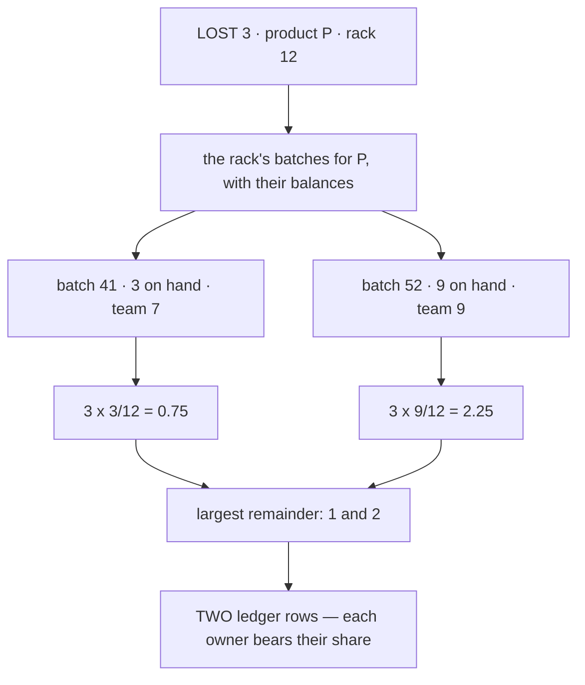
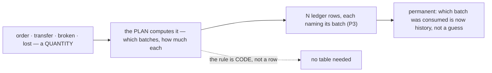
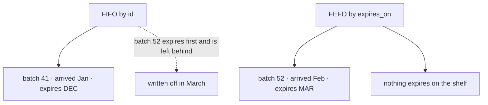
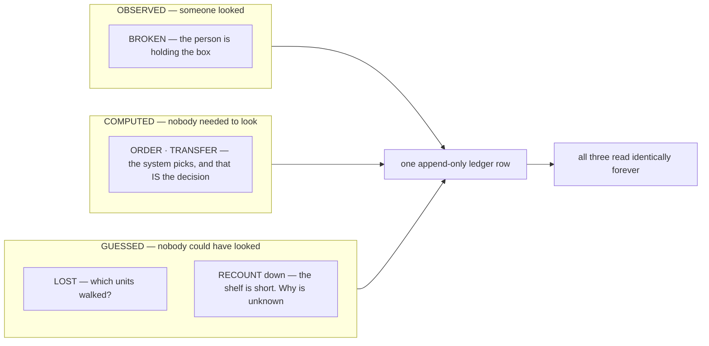
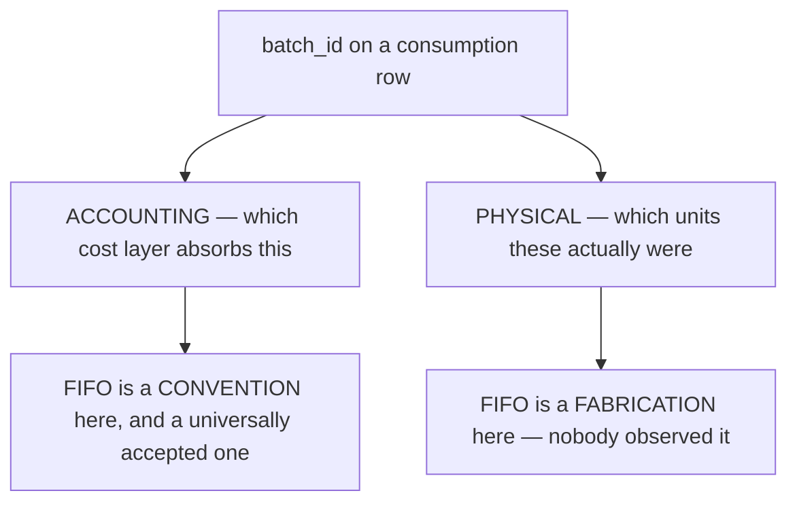
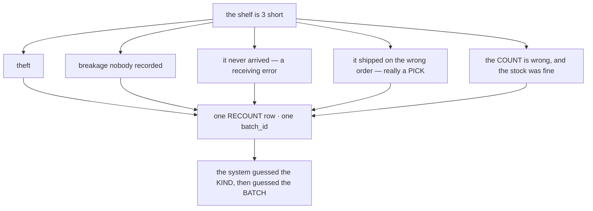
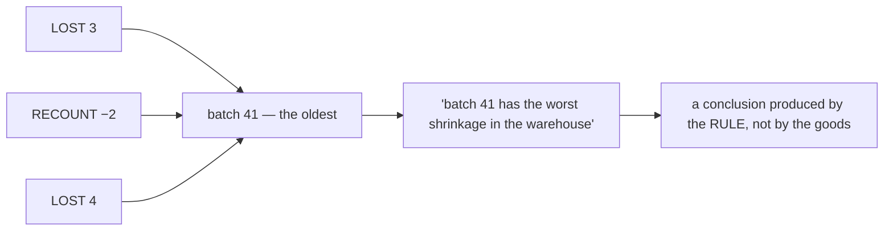
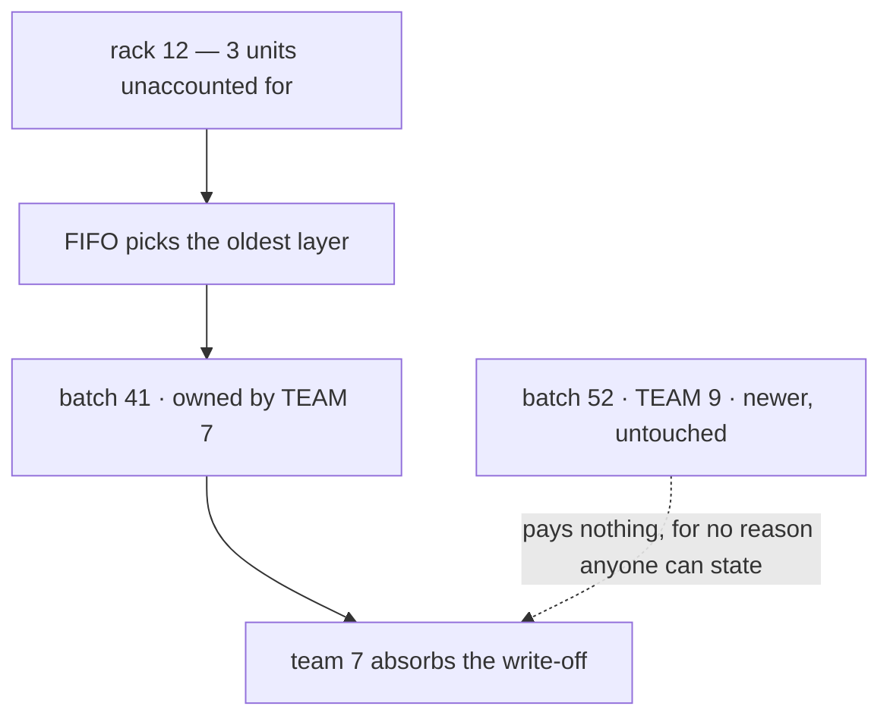

# Batch Selection — how the system chooses which batch a consumption comes from

> ⚠ **`disscuss/` is NOT final.** Mid-argument. Do not build from this.
>
> *Was `stock_provision.md`. Renamed: "provision" implies supplying stock **in**, and this is about
> choosing which batch stock comes **out** of. It also had to avoid colliding with **allocation**, which
> is the word for reserving stock against an order — a feature this system will want separately.*

Split out of [stock_movement_log.md](stock_movement_log.md). Its P7 says *"plan which batches the change
lands on — FIFO"* in one line. That line is a whole feature.

# Proposal

**Closed by the owner.** Everything outside this section is still argument.

| § | Decided |
| --- | --- |
| P1 | **A caller names a quantity, never a batch** — the system computes which batches are consumed, and it is a **rule in code, not a table** |
| P2 | **Who chooses the batch differs per consumption** — `BROKEN` is named by the person holding it; everything else is computed |
| P3 | **Losses attribute PRO-RATA across the batches on the shelf, not FIFO** — cost-layer FIFO and loss attribution are two different rules |

## P2 · Who chooses the batch

| Consumption | Batch chosen by | Why |
| --- | --- | --- |
| `ORDER` · `TRANSFER` | **the system** | nobody is looking at a shelf. The computation *is* the decision — nothing is guessed |
| `BROKEN` | **the caller** | they are holding the box. A computed guess would overwrite an observed fact |
| `LOST` · `RECOUNT` down | **the system**, pro-rata (P3) | nobody could have known. See the rendering rule below |

### ⚠ The rendering rule — a UI rule the schema cannot enforce

A `LOST` or `RECOUNT` row's `batch_id` is an **accounting attribution, never a physical claim**.

| | |
| --- | --- |
| ✅ | *"the loss was costed against batch 41"* |
| ❌ | *"3 units of batch 41 went missing"* |

Nothing in the database stops a screen printing the second one, and somebody investigating shrinkage off
that reading chases the wrong delivery, the wrong supplier, the wrong shelf. `LOST` being its own kind
(P17) makes the distinction *available*; only the UI can make it *true*.

## P3 · Losses are apportioned, not FIFO'd

**Cost-layer FIFO and loss attribution stop being the same rule.** A pick consumes oldest-first, because
that is a genuine cost-flow decision. A loss is **split across the batches on the shelf in proportion to
their balances**, because nobody knows whose units went.

Under FIFO the whole loss would have hit batch 41 — **team 7 paying for team 9's shrinkage because their
delivery arrived first.** In a single-owner warehouse that is a harmless internal convention. Here it
moves money between parties who never agreed to the rule.

### The spec, because "pro-rata" hides three decisions

| | |
| --- | --- |
| **the base** | each batch's `balance` at that rack for that product. Apportioning by *units* is what makes it fair per owner — an owner with more stock bears more |
| **rounding** | units are integers and shares are not. **Largest remainder**, ties broken by ascending `batch_id`, so the split is deterministic and the ledger is reproducible |
| **a batch cannot go negative** | cap any share at that batch's balance and redistribute the excess over the rest, repeating until the loss is placed |

⚠ **A loss now writes MORE ledger rows than a pick of the same size** — one per batch that takes a
share. A loss of 3 across 5 batches is up to 5 rows, most of them 1 unit. `inventory_transaction`
already groups them (P11), so the screen shows one action.

⚠ **Rounding is where a pro-rata rule silently breaks.** Naive `round()` per batch does not sum to the
loss — three shares of 0.5 round to 3 when the loss was 1.5. Largest remainder is the rule that always
sums exactly, which is why it is named here rather than left to the implementer.

---

## The core

**A caller names a quantity, never a batch. The system computes which batches are consumed** (owner) —
and those batch ids become permanent ledger rows (P3 of the ledger doc).

⚠ **This is a RULE, not an entity.** The outcome is already recorded — a pick of 7 spanning 2 batches
*is* 2 ledger rows naming those batches, grouped by their `inventory_transaction`. There is nothing left
for a table to hold.

## ✅ What it closes in the ledger doc

Its critique 1 worried that a transferred batch's `owner_team_id` copy could go stale. Because the plan
**records every batch it consumed**, whose units moved is recoverable from the ledger permanently. The
lineage column I proposed is withdrawn.

---

## Critique — the rule is not one rule

### 1. ⚠ FIFO by batch id is not FEFO, and `expires_on` already exists

`stock_batches.expires_on` is in the schema today — *"perishables only, NULL means does not expire"*,
driving the "expiring ≤ 30 days" badge.

**A batch that arrived later can expire sooner.** Pick FIFO on perishables and the system ships the
fresher goods and leaves the older ones to expire on the shelf — the exact loss the expiry date exists
to prevent.

**→ Recommend: FEFO where `expires_on IS NOT NULL`, FIFO otherwise** — one rule with a documented
tiebreak, not two systems. `ORDER BY expires_on NULLS LAST, id`.

### 2. ✅ Settled — see P2 and P3. The argument that got there:

Every ledger row names a batch, and every row looks equally factual. But the five consumptions were not
equally observed:

#### ⚠ `batch_id` is doing TWO jobs on one row, and only one of them survives a guess

For `BROKEN`, both jobs are answered by the same observed fact. For `LOST` and a downward `RECOUNT`,
the accounting job is legitimately conventional and **the physical job is invented**.

#### The cost is not notional

Rack 12 holds two layers of one product:

| batch | arrived | `unit_cost` | on hand |
| --- | --- | --- | --- |
| 41 | January | 5 000 | 3 |
| 52 | February | 8 000 | 9 |

A `LOST` of 3 units, attributed FIFO, writes off **15 000**. The same 3 units attributed LIFO write off
**24 000**. Nobody knows which is true — and the ledger will state one of them, permanently, in a row
that cannot be edited.

⚠ **That is not an argument against FIFO.** Every inventory system in the world settles this with a cost
flow assumption, because there is no better answer. It is an argument that **the row must not be read as
a physical claim.**

#### Where it actually bites

A screen that says *"batch 41 — 3 units lost"* is asserting something nobody established. Somebody
investigating shrinkage will chase the wrong delivery, the wrong supplier, the wrong shelf.

| | |
| --- | --- |
| ✅ safe reading | *"the loss was costed against batch 41"* |
| ❌ unsafe reading | *"3 units of batch 41 went missing"* |

#### ⚠ A downward RECOUNT is two guesses stacked, not one

`LOST` at least asserts a cause. A recount that comes up short asserts nothing — the shelf is simply not
what the record says, and **five different events produce that identical row**:

⚠ **C5 is the one that inverts everything.** If the count was wrong, the system has just written a
permanent adjustment against a batch to correct a shelf that was never wrong — and P16 means nothing
even records that a human counted rather than a scanner.

#### ⚠ FIFO makes the OLDEST batch absorb every guess — systematically

This is the part I had not traced. Losses are attributed FIFO, and FIFO always names the oldest
surviving layer. So every unexplained unit, forever, is charged to whichever batch has been on the shelf
longest.

**Any analysis of "which delivery / supplier / batch loses the most stock" is structurally biased.** The
answer FIFO produces is *"the oldest one"* — which is also, tautologically, the one that sat around
longest. A real signal and an artefact of the convention are indistinguishable in the output.

#### ⚠⚠ And in a MULTI-OWNER warehouse, the convention moves real money between parties

One rack holds two teams' batches (#232). FIFO attribution therefore decides **whose** loss it is:

| | |
| --- | --- |
| a **single-owner** warehouse | FIFO is an internal accounting convention. Harmless — the money stays in one pocket |
| a **multi-owner** warehouse | FIFO **allocates a real loss between third parties** on the basis of an arbitrary ordering rule |

⚠ **This is the finding that changes the weight of the whole critique.** Labelling hygiene is a
documentation problem. Charging one business partner for another's shrinkage because their delivery
happened to arrive first is a commercial one, and neither party agreed to that rule.

**→ Recommend: losses attribute PRO-RATA across the owners holding that product on that shelf, not
FIFO** — each owner bears the share of the loss their stock represents. It is the ordinary arrangement
in shared and consignment warehousing, and it is the only rule that does not require a reason nobody has.

⚠ Note what this splits: **cost-layer FIFO and loss attribution stop being the same rule.** A pick still
consumes oldest-first, because that is a genuine cost-flow decision. A loss is apportioned, because
nobody knows whose it was.

### 3. Smaller

| ⚠ | → Recommend |
| --- | --- |
| **a shelf can hold two teams' batches** (#232), so a FIFO draw crosses owners freely | fine if the warehouse holds fungible goods and settles by value — **wrong** if a picker must ship the goods the customer's own team owns. This is the one question that turns selection from an accounting rule into a picking constraint |
| **`unit_cost IS NULL` batches** (#74 unknown cost) sort into the same FIFO order as priced ones | decide whether an unknown-cost layer should be consumed **last**, so the books stay explainable for as long as possible |
| **the plan runs under the lock** (P7), so the rule's cost is inside the write transaction | keep it a single indexed read — `ORDER BY expires_on NULLS LAST, id` over one rack's batches for one product |

---

## Question

1. **Rename to `batch_selection.md`?**
2. **FEFO for perishables, or FIFO everywhere?** (§1) *I say FEFO where an expiry exists* — the column is
   already there, and ignoring it guarantees avoidable write-offs.
3. **Must a pick draw from the ordering team's own stock, or is stock fungible across owners on a
   shelf?** (§3) This decides whether selection is an accounting rule or a physical constraint on
   picking. ⚠ **P3 assumes fungible** — apportioning a loss across owners only makes sense if the
   warehouse treats their units as interchangeable. If a pick must draw the customer's own team's stock,
   the same logic says a loss should too, and P3 becomes "pro-rata within the owner", not across them.
4. **Should an unknown-cost batch** (#74, `unit_cost IS NULL`) **be consumed LAST**, so the books stay
   explainable for as long as possible? (§3)
