# Batch Selection — how the system chooses which batch a consumption comes from

> ⚠ **GRAIN CHANGED — [ledger-splits-by-question](database/stock_design.md#ledger-splits-by-question) (owner, 2026-08-07).**
> The ledger splits into a **placement** ledger (no `batch_id`) and a **batch** ledger (no `rack_id`), so
> `(rack, batch)` is no longer a grain. **Rules below phrased in those terms are superseded** — see
> [the-cross-product-grain-was-assumed-everywhere](database/stock_design.md#the-cross-product-grain-was-assumed-everywhere).
> This doc is rewritten once the open sub-parts settle, not before.

> ⚠ **`disscuss/` is NOT final.** Mid-argument. Do not build from this.
>
> *Was `stock_provision.md`. Renamed: "provision" implies supplying stock **in**, and this is about
> choosing which batch stock comes **out** of. It also had to avoid colliding with **allocation**, which
> is the word for reserving stock against an order — a feature this system will want separately.*

Split out of [stock_movement_log.md](stock_movement_log.md). Its P7 says *"plan which batches the change
lands on — FIFO"* in one line. That line is a whole feature.

Siblings: [fifo.md](fifo.md) · [rack_selection.md](rack_selection.md) — the **rack** axis, which this doc
never named, and which turned out to be undecided in three places.

# Proposal

**Closed by the owner.** Everything outside this section is still argument.

| § | Decided |
| --- | --- |
| P1 | **A caller names a quantity, never a batch** — the batch is decided by the picker's scan or by the system, never by the requester. It is a **rule in code, not a table** |
| P2 | **Who chooses the batch differs per consumption** — only `LOST` and `RECOUNT` down are computed |
| P3 | **Losses attribute PRO-RATA across the batches on the shelf, not FIFO** — cost-layer FIFO and loss attribution are two different rules |
| P4 | **FIFO — `ORDER BY batch id`, nothing else.** `expires_on` does not enter selection: it is a human warning, and the "expiring" badge is its only control. *How* that walk runs is [fifo.md](fifo.md) |
| P5 | **Stock is FUNGIBLE across owners on a shelf** — the teams are divisions of one company, so a pick draws FIFO regardless of which division owns the batch |
| P6 | **A pick is OBSERVED, not computed** — the picker scans the batch label, so FIFO is what the system *suggests* and the scan is what the ledger *records* |
| P7 | ⚠ **A `TRANSFER`'s out-leg is NOT scanned — it is provisioned by FIFO** (owner). P6 covers the customer pick only. The units stay inside the company and the destination mints a fresh batch anyway (ledger P12), so the attribution never leaves our own books |

## P2 · Who chooses the batch

| Consumption | Batch chosen by | Why |
| --- | --- | --- |
| `ORDER` | **the picker's SCAN** (P6) | someone is standing at the shelf. What they scan is what left it |
| a `TRANSFER`'s **out-leg** | **the system**, FIFO (P7) | the units stay in the company and B mints a fresh batch — no scan is worth the step |
| `RECEIVE` · `MOVE` · a `TRANSFER`'s in-leg | **the caller** | the batch is already known — it is the delivery, or the thing being moved |
| `BROKEN` | **the caller** | they are holding the box. A computed guess would overwrite an observed fact |
| `LOST` · `RECOUNT` down | **the system**, pro-rata (P3) | nobody could have known. See the rendering rule below |

⚠ **Two rows are computed, and they compute DIFFERENTLY.** A transfer out-leg is **FIFO** — a deliberate
draw, so the cost-layer convention applies. A loss is **pro-rata** — an unattributable discrepancy, where
FIFO would systematically over-blame the oldest layer (P3). Same "the system decides", opposite rule.

### ⚠ The rendering rule — a UI rule the schema cannot enforce

A `LOST` or `RECOUNT` row's `batch_id` is an **accounting attribution, never a physical claim**.

| | |
| --- | --- |
| ✅ | *"the loss was costed against batch 41"* |
| ❌ | *"3 units of batch 41 went missing"* |

Nothing in the database stops a screen printing the second one, and somebody investigating shrinkage off
that reading chases the wrong delivery, the wrong supplier, the wrong shelf. `LOST` being its own kind
(P17) makes the distinction *available*; only the UI can make it *true*.

## P3 · Losses are apportioned, not FIFO'd

**Cost-layer FIFO and loss attribution stop being the same rule.** A pick consumes oldest-first, because
that is a genuine cost-flow decision. A loss is **split across the batches on the shelf in proportion to
their balances**, because nobody knows whose units went.

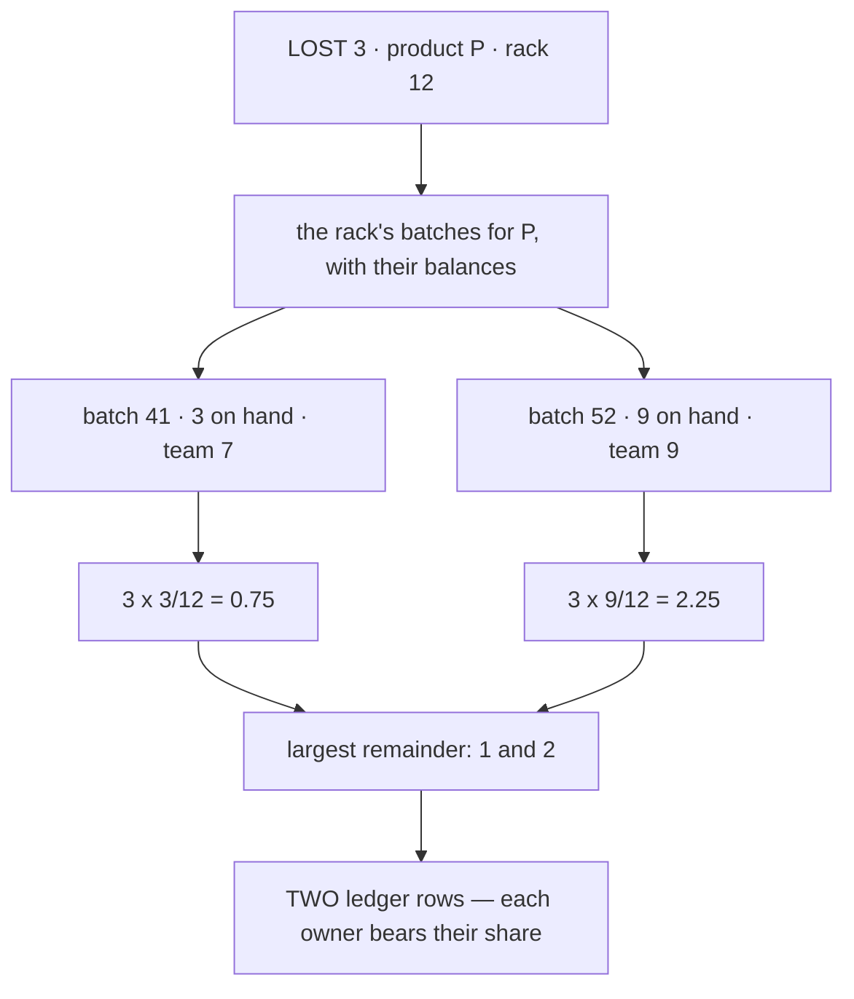

Under FIFO the whole loss would have hit batch 41 — **team 7 paying for team 9's shrinkage because their
delivery arrived first.** In a single-owner warehouse that is a harmless internal convention. Here it
moves money between parties who never agreed to the rule.

### The spec, because "pro-rata" hides three decisions

| | |
| --- | --- |
| **the base** | each batch's `balance` at that rack for that product. Apportioning by *units* is what makes it fair per owner — an owner with more stock bears more |
| **rounding** | units are integers and shares are not. **Largest remainder**, ties broken by ascending `batch_id`, so the split is deterministic and the ledger is reproducible |
| **a batch cannot go negative** | cap any share at that batch's balance and redistribute the excess over the rest, repeating until the loss is placed |

⚠ **A loss now writes MORE ledger rows than a pick of the same size** — one per batch that takes a
share. A loss of 3 across 5 batches is up to 5 rows, most of them 1 unit. `inventory_transaction`
already groups them (P11), so the screen shows one action.

⚠ **Rounding is where a pro-rata rule silently breaks.** Naive `round()` per batch does not sum to the
loss — three shares of 0.5 round to 3 when the loss was 1.5. Largest remainder is the rule that always
sums exactly, which is why it is named here rather than left to the implementer.

## P4 · FIFO — one ordering, and `expires_on` does NOT enter it

**`ORDER BY stock_batches.id`. Nothing else.** Not FEFO, not a tiebreak, not a special case for
perishables.

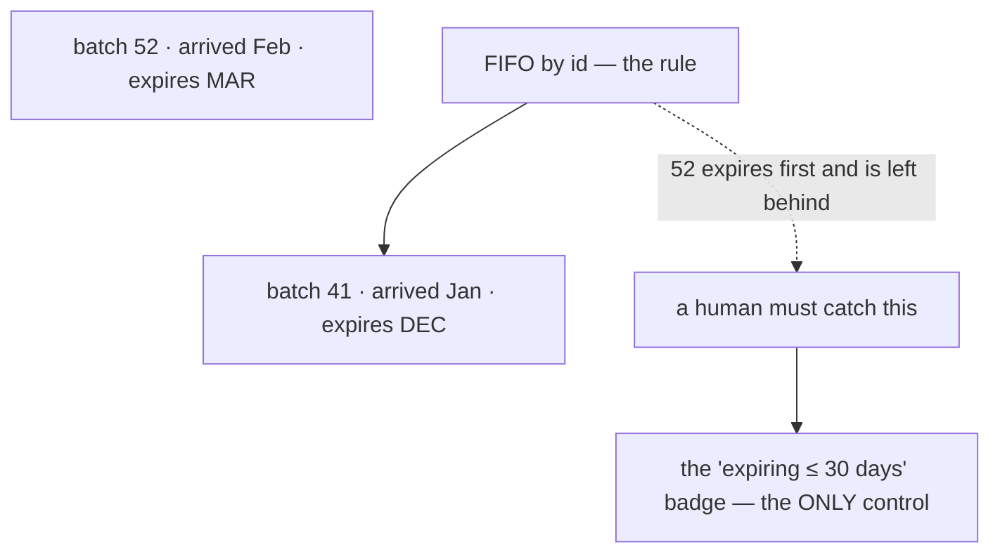

### ⚠ The consequence, stated plainly: `expires_on` changes NO system behaviour

It is a **human warning and nothing else**. It drives the "expiring ≤ 30 days" badge, and a person acts
on it. The picker, the plan, the cost layers and the ledger all ignore it entirely.

This has to be written down because the opposite is the natural assumption. Someone will eventually
find `expires_on` in the schema and conclude the system *handles* expiry. **It does not — a person
does.** Anything that relies on it being enforced is relying on something that was never built.

| | |
| --- | --- |
| ✅ **expiry is OPTIONAL** (owner) | `expires_on` is nullable and set for perishables only. Most batches have none, so FEFO would be a second ordering built for a minority of the catalogue |
| ✅ **and within that minority, the orders usually agree** | a supplier does not normally ship stock that expires sooner than what they shipped last month. FEFO only differs where they diverge — a minority of a minority |
| ✅ **one ordering is one ordering** | batch id already carries the cost-layer order (P17's derivations, the daily projection). A second ordering means two rules that can disagree about which layer a pick consumed |
| ⚠ **the accepted risk** | a later-arriving, sooner-expiring batch sits while fresher goods ship, and is written off as `BROKEN` when it lapses |
| ⚠ **so the badge is load-bearing** | for the products that *do* carry an expiry, it is the entire control for a risk the selection rule deliberately does not manage |

## P5 · Fungible — the teams are divisions, not separate businesses

A pick takes whatever FIFO names, even when the batch belongs to a different division than the one
whose order it is. Value settles between them afterwards.

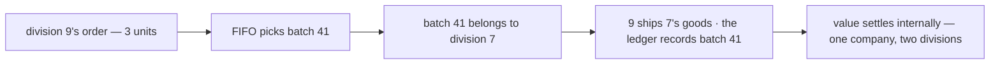

**The objection to fungible was that it sells another party's goods without asking.** Between divisions
of one company that objection does not apply — it is internal pooling, and the settlement is a transfer
between cost centres rather than a sale.

| | |
| --- | --- |
| ✅ **no new machinery** | the ledger already names the batch consumed and the batch names its owner, so *who owes whom* is derivable. Settlement reads what is already written |
| ✅ **no phantom out-of-stock** | the alternative would let a picker stand at a shelf holding 50 units and be told the order cannot be filled |
| ✅ **`StockPick` stays as it is** | owner-constrained picking would have required inventory_service to be told the **ordering team** — an input it does not take, crossing a service boundary it deliberately does not cross (P5 of the ledger doc) |
| ✅ **P3 stands** | pro-rata loss attribution only makes sense over a shared pool. Fungible *is* a shared pool |

⚠ **Revisit if a team is ever an outside party** — a consignor, a marketplace seller, anyone not inside
the company. The technical design does not change; the *permission* to do it does.

## P6 · The scan makes a pick observed — FIFO becomes a suggestion

Batches carry a printed label and **the picker scans it at pick time** (owner). So the batch on a pick
row is not a belief the system formed; it is what left the shelf.

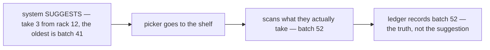

**This narrows P1 rather than replacing it.** A caller still names a quantity, never a batch — and the
system still computes a plan. The plan is now a **recommendation to a person**, and the record comes
from the scan.

| Consumption | Batch decided by | |
| --- | --- | --- |
| `ORDER` | **the picker's scan** | the units leave the company — this is the one draw whose batch cannot be re-decided later |
| a `TRANSFER`'s out-leg | **the system**, FIFO | ⚠ **not scanned** — see P7 |
| `BROKEN` | the caller | unchanged — they are holding it |
| `LOST` · `RECOUNT` down | **the system**, pro-rata (P3) | nobody scans a unit that is missing |

✅ **Observed beats computed where an observation is worth its cost.** In an append-only log a guess that
turns out wrong is indistinguishable from a fact — so the scan buys truth on the draw that books COGS.
P7 declines to buy it on the draw that only moves value between our own buildings.

### ⚠ The consequence: the plan leaves the transaction — for an ORDER only

[stock_movement_log P7](stock_movement_log.md) locks the state rows, reads `old`, plans, and writes —
all inside one database transaction. **A human scan cannot sit inside that.** P7's own rule forbids it:
never hold a shelf's lock across anything slow, and a person walking to a rack is the slowest thing in
the system.

✅ **P7 (this doc) shrinks this hazard to one kind.** A transfer dispatch is computed, so it plans *under*
the lock like every other machine-decided draw and the stale-plan branch below cannot arise for it. Only
the customer pick pays this price.

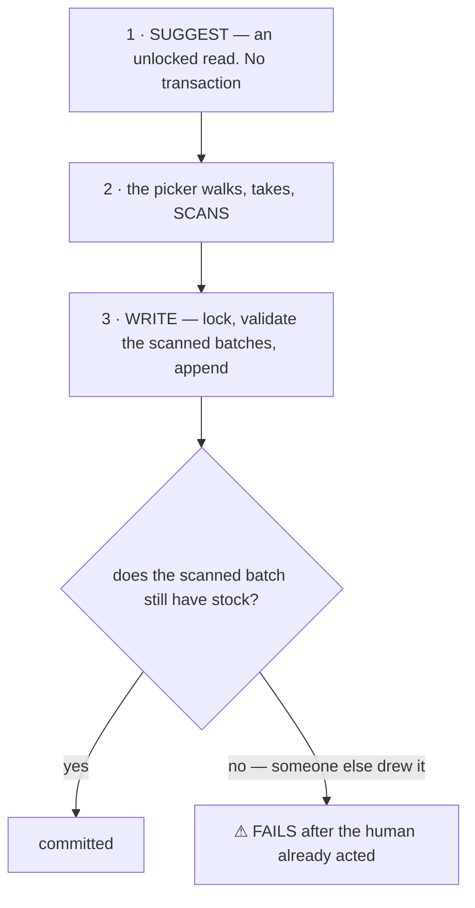

⚠ **That last branch is new.** Under computed-FIFO the plan was made under the lock, so it could not go
stale — P7 made a stale plan structurally impossible. With a scan in the middle, the goods are
physically in the picker's hand and the write can still be refused.

**It is not a reason to go back** — the scan is more truthful, and the failure is rare and visible. But
the recovery ("you have them, the system says you cannot") is a screen someone has to design.

> **PARKED (owner):** the label and scanning design — what is printed, when it is scanned, put-away and
> counting — is **its own topic**. Only its effect on batch selection is recorded here.

## P7 · A transfer's out-leg is FIFO, not scanned

**The scan is not free** — it is a step a person performs per carton, and it buys one thing: an
*observed* batch instead of a computed one. P7 asks where that is worth paying for, and the answer turns
on **whether the attribution can ever be re-decided**.

| | `ORDER` — scanned | `TRANSFER` out-leg — FIFO |
| --- | --- | --- |
| where the units go | **out of the company** | to another of our own buildings |
| what the batch decides | which cost layer is booked as **COGS** | which layer at A is drawn, and what B's new batch costs |
| the batch afterwards | gone with the goods | **consumed at A, a NEW one minted at B** (ledger P12) |
| a wrong choice | money booked against the wrong layer, and the goods are with a customer | value shifts between layers **we still own on both sides** |

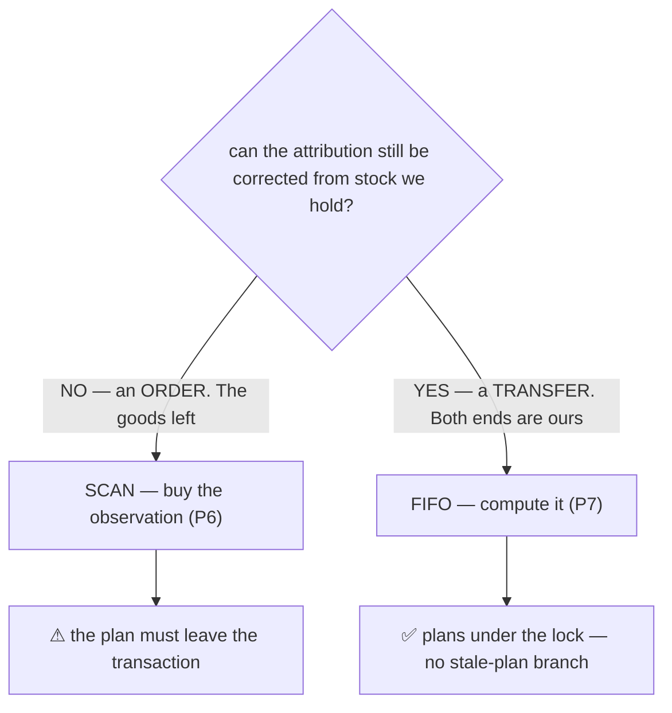

✅ **Total inventory value is identical either way.** FIFO at A cannot create or destroy value — it only
chooses which layer at A is drawn down and therefore what cost rides to B. Both sides of that stay on
our own books, which is exactly what an order pick cannot say.

⚠ **What B mints is its own question — answered in [fifo.md](fifo.md).** FIFO can draw across several
layers at different unit costs, so minting **one** batch in B would mean averaging them. `unit_cost` is
`*int64` — whole rupiah, and `nil` for UNKNOWN — so that average **rounds**, and when one layer's cost is
`nil` it **cannot be expressed at all**. [mint-per-layer](fifo.md#mint-per-layer) mints one batch per source layer instead.

---

## The core

**A caller names a quantity, never a batch** (owner) — and whichever way the batch is then decided,
those batch ids become permanent ledger rows (P3 of the ledger doc).

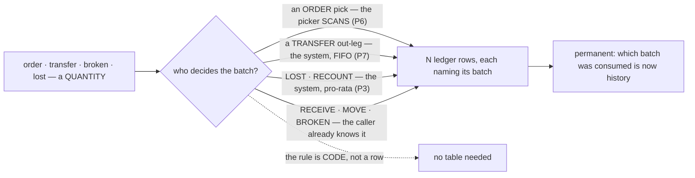

⚠ **This is a RULE, not an entity.** The outcome is already recorded — a pick of 7 spanning 2 batches
*is* 2 ledger rows naming those batches, grouped by their `inventory_transaction`. There is nothing left
for a table to hold.

## ✅ What it closes in the ledger doc

Its critique 1 worried that a transferred batch's `owner_team_id` copy could go stale. Because the plan
**records every batch it consumed**, whose units moved is recoverable from the ledger permanently. The
lineage column I proposed is withdrawn.

---

## Critique — the rule is not one rule

### 1. ✅ Settled — see P4

### 2. ✅ Settled — see P2 and P3. The argument that got there:

Every ledger row names a batch, and every row looks equally factual. But the five consumptions were not
equally observed:

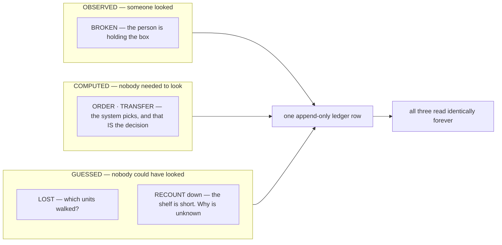

#### ⚠ `batch_id` is doing TWO jobs on one row, and only one of them survives a guess

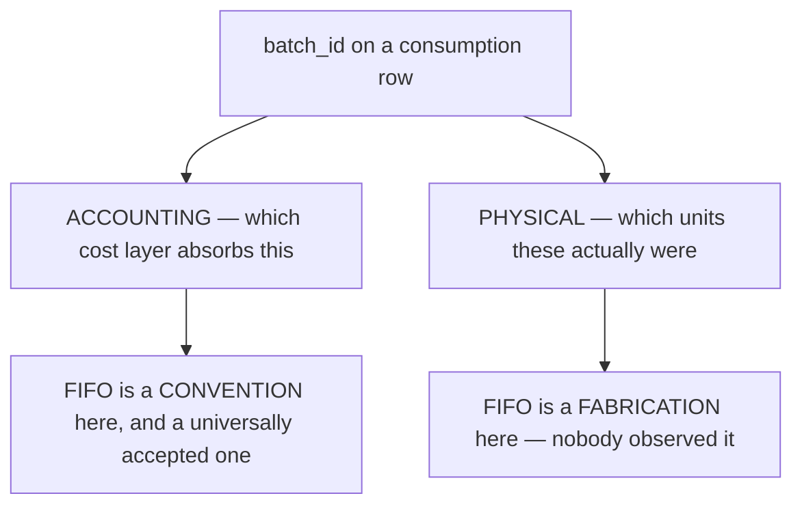

For `BROKEN`, both jobs are answered by the same observed fact. For `LOST` and a downward `RECOUNT`,
the accounting job is legitimately conventional and **the physical job is invented**.

#### The cost is not notional

Rack 12 holds two layers of one product:

| batch | arrived | `unit_cost` | on hand |
| --- | --- | --- | --- |
| 41 | January | 5 000 | 3 |
| 52 | February | 8 000 | 9 |

A `LOST` of 3 units, attributed FIFO, writes off **15 000**. The same 3 units attributed LIFO write off
**24 000**. Nobody knows which is true — and the ledger will state one of them, permanently, in a row
that cannot be edited.

⚠ **That is not an argument against FIFO.** Every inventory system in the world settles this with a cost
flow assumption, because there is no better answer. It is an argument that **the row must not be read as
a physical claim.**

#### Where it actually bites

A screen that says *"batch 41 — 3 units lost"* is asserting something nobody established. Somebody
investigating shrinkage will chase the wrong delivery, the wrong supplier, the wrong shelf.

| | |
| --- | --- |
| ✅ safe reading | *"the loss was costed against batch 41"* |
| ❌ unsafe reading | *"3 units of batch 41 went missing"* |

#### ⚠ A downward RECOUNT is two guesses stacked, not one

`LOST` at least asserts a cause. A recount that comes up short asserts nothing — the shelf is simply not
what the record says, and **five different events produce that identical row**:

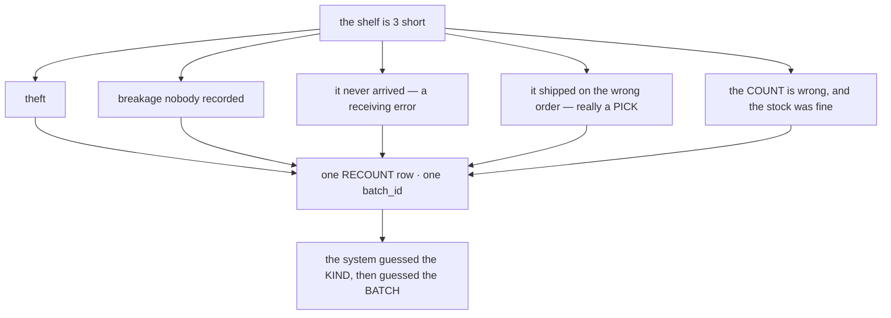

⚠ **C5 is the one that inverts everything.** If the count was wrong, the system has just written a
permanent adjustment against a batch to correct a shelf that was never wrong — and P16 means nothing
even records that a human counted rather than a scanner.

#### ⚠ FIFO makes the OLDEST batch absorb every guess — systematically

This is the part I had not traced. Losses are attributed FIFO, and FIFO always names the oldest
surviving layer. So every unexplained unit, forever, is charged to whichever batch has been on the shelf
longest.

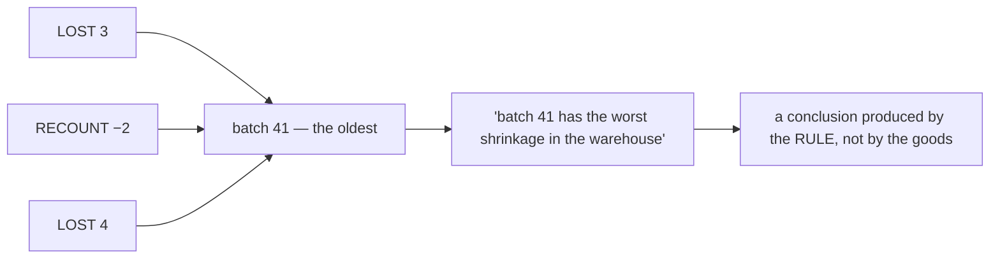

**Any analysis of "which delivery / supplier / batch loses the most stock" is structurally biased.** The
answer FIFO produces is *"the oldest one"* — which is also, tautologically, the one that sat around
longest. A real signal and an artefact of the convention are indistinguishable in the output.

#### ⚠⚠ And in a MULTI-OWNER warehouse, the convention moves real money between parties

One rack holds two teams' batches (#232). FIFO attribution therefore decides **whose** loss it is:

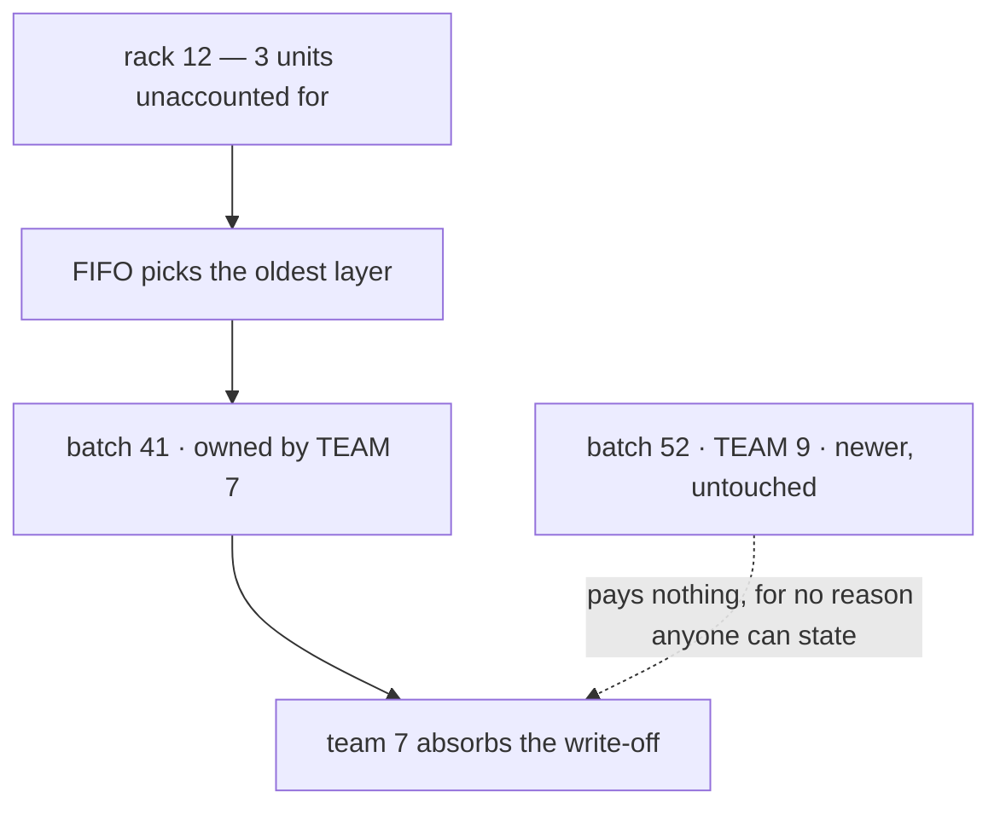

| | |
| --- | --- |
| a **single-owner** warehouse | FIFO is an internal accounting convention. Harmless — the money stays in one pocket |
| a **multi-owner** warehouse | FIFO **allocates a real loss between third parties** on the basis of an arbitrary ordering rule |

⚠ **This is the finding that changes the weight of the whole critique.** Labelling hygiene is a
documentation problem. Charging one business partner for another's shrinkage because their delivery
happened to arrive first is a commercial one, and neither party agreed to that rule.

**→ Recommend: losses attribute PRO-RATA across the owners holding that product on that shelf, not
FIFO** — each owner bears the share of the loss their stock represents. It is the ordinary arrangement
in shared and consignment warehousing, and it is the only rule that does not require a reason nobody has.

⚠ Note what this splits: **cost-layer FIFO and loss attribution stop being the same rule.** A pick still
consumes oldest-first, because that is a genuine cost-flow decision. A loss is apportioned, because
nobody knows whose it was.

### 3. Smaller

| ⚠ | → Recommend |
| --- | --- |
| **a shelf can hold two teams' batches** (#232), so a FIFO draw crosses owners freely | fine if the warehouse holds fungible goods and settles by value — **wrong** if a picker must ship the goods the customer's own team owns. This is the one question that turns selection from an accounting rule into a picking constraint |
| **`unit_cost IS NULL` batches** (#74 unknown cost) sort into the same FIFO order as priced ones | decide whether an unknown-cost layer should be consumed **last**, so the books stay explainable for as long as possible |
| **the plan runs under the lock** (P7), so the rule's cost is inside the write transaction | keep it a single indexed read — `ORDER BY expires_on NULLS LAST, id` over one rack's batches for one product |

---

### 4. ⚠ Is stock FUNGIBLE across owners on a shelf? — the question P3 rests on

One rack holds two teams' batches (#232). Team 9's customer orders 3 units of product P, and batch 41
belongs to **team 7**:

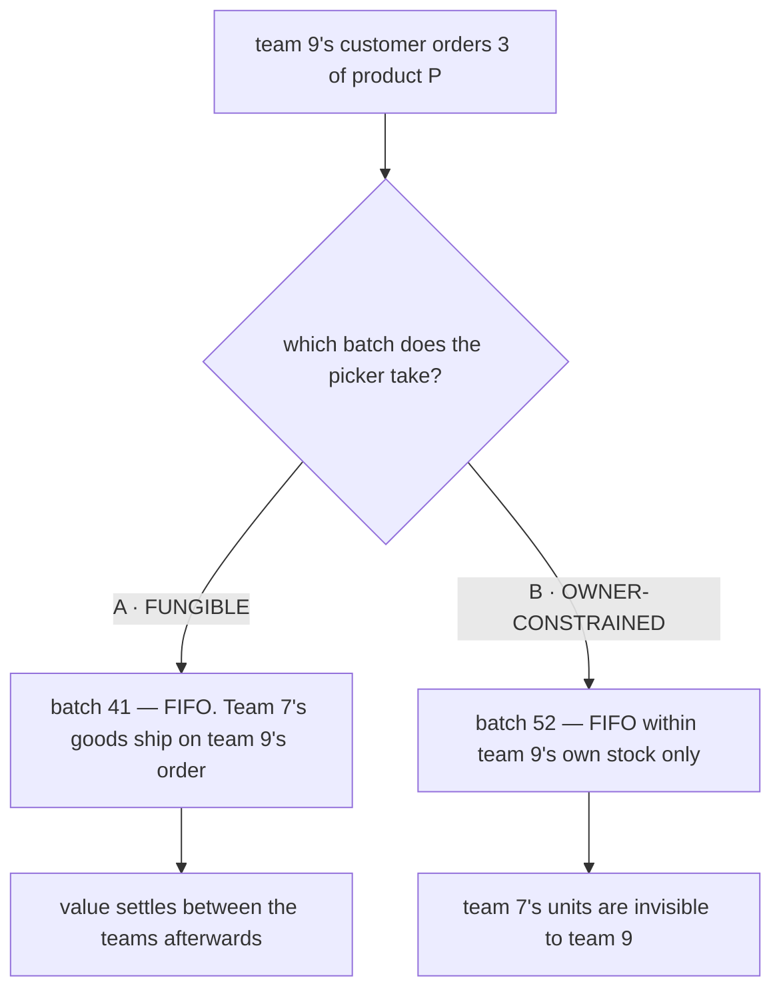

#### What each costs

| | ✅ | ⚠ |
| --- | --- | --- |
| **A · fungible** | **the machinery already exists** — the ledger names the batch consumed, the batch names the owner, so *who owes whom* is derivable with no new table. Picking stays simple | team 7's goods are sold by team 9 without team 7 being asked |
| **B · owner-constrained** | ownership is literal: your stock is yours | ⚠ **the picker sees a full shelf and the system says out of stock.** 50 units of P are there, none are team 9's, the order cannot be filled |

⚠ **B also needs something inventory_service does not have.** It is told product ids, never owners — P5
is explicit that ownership is climbed from the batch. Owner-constrained picking means `StockPick` must
be told **the ordering team**, which is a new input crossing a service boundary.

#### ✅ B *is* enforceable — batches carry a printed label (owner)

I had argued B might be a bookkeeping fiction: two units of the same product from two deliveries look
identical, so *"take from batch 52"* is unenforceable and the ledger would record a batch that is not
the one that left the shelf.

**That argument falls. Batches are labelled.** A picker can tell them apart, so an owner-constrained
rule is a rule the warehouse can actually follow.

⚠ **Which leaves exactly one thing deciding A vs B**, and it is not technical: *are these teams separate
businesses, or divisions of one?* Pooling stock between divisions is ordinary. Selling another company's
goods without asking is not.

⚠ **And the label changes something bigger than this question — see §5.**

#### It decides P3 too

P3 apportions a loss across the owners on a shelf. **That only makes sense under A.** If a pick must
draw the ordering team's own stock, so must a loss — P3 becomes *"pro-rata within the owner"*, and the
whole multi-owner fairness argument evaporates because owners never share a pool.

**→ Recommend A, fungible**, on three grounds: the settlement machinery already exists in the ledger, B
creates a phantom out-of-stock that a warehouse person will not forgive, and B is only honest if batches
are physically distinguishable.

⚠ **But the real question underneath is not technical:** *are these teams separate businesses, or
divisions of one?* Pooling stock between divisions is ordinary. Selling another company's goods without
asking is not — and no schema decision can make that acceptable.

### 5. ✅ Settled — see P6. The argument that got there:

P1 says *"a caller names a quantity, never a batch — the system computes which batches are consumed."*
**A printed label is the thing that can make that false**, and in the good direction.

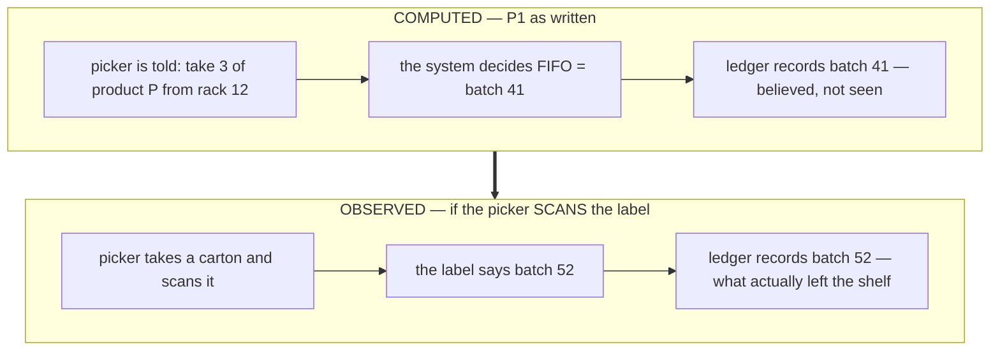

**Observed beats computed every time**, for the same reason `BROKEN` takes its batch from the caller
(P2): a guess that turns out wrong is indistinguishable from a fact once it is in an append-only log.

⚠ **And it demotes FIFO from a rule to a SUGGESTION.** The system says *"the oldest is the one with this
label"*; the picker takes what they take; the ledger records the truth either way. FIFO stops being
something the system enforces and becomes something it recommends — which is all it could ever honestly
have been, since the system was never at the shelf.

#### But a label is not a scan

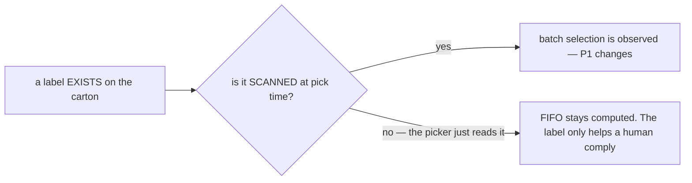

**This is the question the label discussion turns on.** A printed label with no scan step is guidance;
a scanned label is a fact. The schema is unchanged either way — `batch_id` is on the row regardless —
but **who decides it** flips.

#### What a label has to carry, and it depends on the answer above

| | If scanned | If only read |
| --- | --- | --- |
| **batch id** | ✅ required — it is the key being reported | useful, but a human needs the *code*, not the id |
| a human code | helpful | ✅ required — it is all they have |
| **`expires_on`** | ✅ — and this is where P4's "the badge is the only control" stops being true | ✅ **the label is a better control than the badge**: it is at the shelf, where the decision happens |
| product | for a mis-scan check | ✅ so a picker can tell they are at the right pile |
| owner division | ⚠ **not needed** — P5 makes stock fungible, so the picker does not care whose it is | ⚠ same, and printing it invites a rule that no longer exists |

✅ **The expiry line is the most useful thing here.** P4 accepted that a later-arriving, sooner-expiring
batch can be left to lapse, with the "expiring ≤ 30 days" badge as the only control. **A printed expiry
date is a second control, and a better one** — it is in the picker's hand at the moment of choosing,
rather than on a screen somebody has to open.

---

## Question

1. **Should an unknown-cost batch** (#74, `unit_cost IS NULL`) **be consumed LAST**, so the books stay
   explainable for as long as possible?
