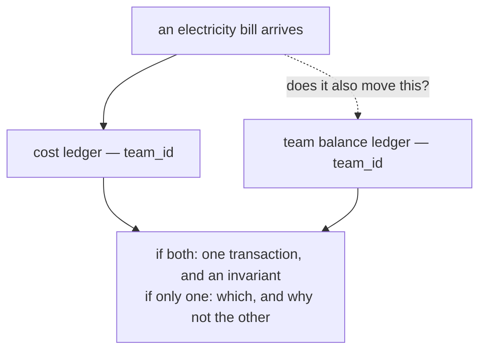

# Clarity — `cost_design.md`

Critique, questions and warnings about [cost_design.md](cost_design.md). That doc is yours; this one is
mine. Answered points are **deleted**, so this is always the current open set.

> The doc is 20 lines, so this one is short too. It grows as the design does.
>
> ✅ **No overlap with `stock_design.md`'s COGS** — I had flagged that risk when this file was empty and
> it did not materialise. That is landed cost *per unit of stock*; this is operating cost *per team*.
> Different grain, different question. (One link between them is worth checking — see #4.)

---

# Critique

| | Problem | → Recommend |
| --- | --- | --- |
| **1** | **`costs` holds a balance and `cost_logs` holds the costs — the names are the wrong way round.** A "cost" is a thing that happened: an electricity bill, an internet invoice. Those are the **log** rows. `costs` is one accumulator per team, which is not a set of costs at all. Every other ledger here reads correctly because its state table is a real entity — `batches` is a lot of goods, `product_placements` is stock on a shelf — but there is no entity called "a cost" with one row per team. | Name the state for what it is: **`team_cost_balances`** (or `cost_balances`), keeping `cost_logs` as it is — that one is already right, since a log row genuinely *is* one cost. |
| **2** | **Is `balance` cumulative or outstanding?** The two are different columns with different rules. A lifetime total *"we have spent 40M on electricity"* only ever rises, never decreases, and "balance" is a misleading word for it. An outstanding amount *"we owe 3M for electricity"* falls when paid — which makes it a **liability**, and something must write the decrease. | Say which. If cumulative, call it `spent_total` and note it is monotonic — that also makes the reconcile check trivial (`sum(change)` where every change is positive). If outstanding, the payment that clears it is a second movement this doc has not described yet. |
| **3** | **No money type stated, and the template's default is `float64`.** Stock justified float by COGS division (`fee / qty`). **Cost has no division** — an electricity bill is an exact amount of rupiah. Inheriting float here imports a rounding problem for a reason that does not apply. | **`int64` rupiah.** This is the second money-only ledger where the stock rationale does not reach (the Payment/Balance one is the other) — worth deciding at the template rather than per doc. |
| **4** | **`warehouse_ops_fee` may belong to both docs.** `stock_design.md`'s `restock_cost_detail` charges a `warehouse_ops_fee` into COGS. If that fee is *derived from* operating costs tracked here, then one number feeds two ledgers and nothing says how. If it is an unrelated per-restock charge, that is fine — but the name suggests otherwise. | Say whether they are connected. If a restock's ops fee is an allocation out of this ledger, that allocation is itself a movement and needs a log entry on this side. |
| **5** | **The grain is `team_id` and nothing states the constraint.** A single-column grain makes it obvious, which is exactly why it gets skipped — but it is still the ledger's `ON CONFLICT` target. Without a unique index, two concurrent cost writes for one team insert two state rows and the balance splits. | State `team_id` unique, as `product_placements` states its composite. |

✅ **One measure, one pair** — `balance` in state, `balance_after` + `change` in the log. That is the
per-measure rule applied correctly first time, and it is the third doc to do it.

---

# Question

1. **Cumulative or outstanding?** (#2) It decides whether this ledger ever goes down, and therefore
   whether it needs a second flow.
2. **How does this relate to [team_balance_desgin.md](team_balance_desgin.md)?** Both are ledgers keyed
   by `team_id` holding money for the same team. If a cost reduces a team's balance, one operation writes
   **both** — which is the cross-ledger invariant problem from
   [`stock_design_clarity.md`](stock_design_clarity.md), arriving in a second place.

---

# Awaiting

- **`## Implementing The Ledger …` is the whole doc so far** — there is no flow, no ERD, and no statement
  of what *creates* a cost. Whether costs are entered by hand, imported, or derived changes who the actor
  is and what the transaction looks like.
- **Filename:** its sibling is `team_balance_desgin.md` — `desgin` is a typo, cheapest to fix before
  anything links to it.
