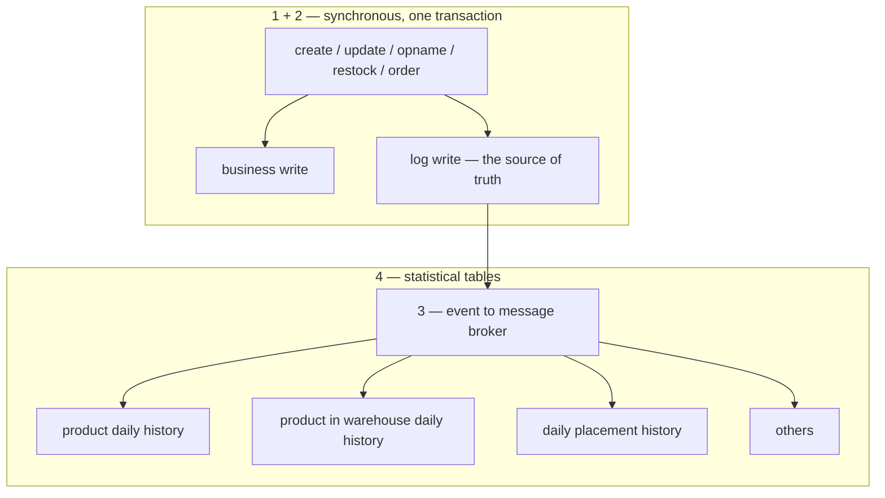
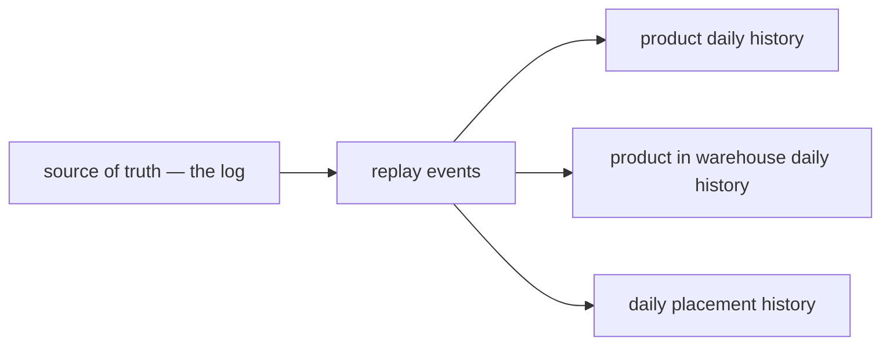

# Daily Stat Data — the pipeline

How statistical / analytical data gets created in this system.

**Worked example: `inventory_service`.**

---

## The concept

1. **A table holds the source of truth, like a LOG.**

2. When **create / update / opname / restock / order** happens, it writes **synchronously in one
   transaction**: the business write **and** the log.

3. **Second, it sends an event to the message broker.**

4. **The event is processed to build up statistical tables**, like:
   - product daily history
   - product in warehouse daily history
   - daily placement history
   - and others

---

## What this maps to in inventory today

| The concept | `inventory_service` |
| --- | --- |
| a table holding the source of truth, like a log | `stock_movements` — *"the APPEND-ONLY ledger, the source of truth"*. Signed `Delta` per row, `Balance` is the on-hand after. |
| sync write transaction + log | `stock_levels` — *"a cache of SUM(delta) over the ledger, **maintained inside each movement's transaction**"*, with `CHECK (on_hand >= 0)` |
| event to the message broker | `pkgs/event_source` + push handlers — already running in `revenue_service` and `settlement_service` |
| statistical tables | **new — this layer does not exist yet** |

Layers 1 and 2 are already live in inventory. Layer 4 is what gets built.

---

## The statistical tables

| Table | Grain |
| --- | --- |
| product daily history | day × product |
| product in warehouse daily history | day × warehouse × product |
| daily placement history | day × warehouse × product × rack |
| others | *TBD* |

---

# Failure handling

**We rely heavily on the event base — Pub/Sub is heavily used.**

**When a statistical table is wrong or missing data, we use a REPLAY EVENT feature to reconstruct it.**

The statistical tables are derived, so they are never repaired by hand. A projection that has drifted, a
projector that had a bug, or a table that is being introduced is filled by replaying the events through
it again.

---

# Pipeline rules — MOVED

These were called final and now live in
[guidelines/architectures/data_pipeline.md](../../guidelines/architectures/data_pipeline.md), which is
authoritative. They are not restated here — a copy in `disscuss/` is how a superseded draft gets read as
current.

---

# Critique

**What is right:** the log being the source of truth means both flow and level are derivable from
history, which most systems cannot do. And the sync/async line is in the right place — `stock_levels`
carries `CHECK (on_hand >= 0)`, so it *enforces* and must be in-transaction; a daily table enforces
nothing and can be async.

⚠ = fails **silently**, produces plausible wrong numbers, nobody files a bug.

### ⚠ 1. The dual write is not atomic

Commit succeeds, then the publish fails or the pod restarts — the event is gone and every stat table is
short from that moment. The publisher **ignores publish errors by design** (*"a revenue failure must not
fail the order"*), which is correct for decoupling and is exactly why nothing catches this.

`stock_movements.ID` is already `BIGSERIAL` and already inside the transaction. A publisher cursor turns
the log into the **outbox**, and then ignoring publish errors becomes safe.

### ⚠ 2. Replay cannot read the broker

Pub/Sub retention is 7 days default, 31 max. The normal case breaks it: **add "daily placement history"
next quarter and it needs every movement ever recorded.** Broker replay gives it a month and a permanent
cliff, and nothing about the table looks wrong.

Replay must read the **log**, by id range. Same mechanism as the outbox — one monotonic id serves
publishing, watermarking, dedup and replay. Bonus: a log replay is naturally id-ordered, so #4 does not
arise on the replay path.

### ⚠ 3. Replay is the cure — there is no diagnosis

Nothing here answers *"how do we know a table is wrong."* Every failure below is silent, so replay only
runs if something tells you to. Needs a companion: a **reconcile check** comparing the log's aggregate
to the projection's per day, plus visible **consumer lag**.

Without it, the honest description is "we can reconstruct data once somebody notices" — and for a stat
table, nobody notices.

### ⚠ 4. `Balance` is order-sensitive, Pub/Sub is unordered

`Delta` commutes, so arrival order is harmless. `Balance` does not. A daily row storing closing balance
from whichever event landed last will sometimes record the second-to-last movement's.

Take `Balance` from the **MAX movement id** per place per day. Correct under any delivery order, needs
no broker config, works identically in dev and prod.

### ⚠ 5. "Daily" has no defined boundary

The log has only `CreatedAt TIMESTAMPTZ`. No business date, no timezone anywhere in the system.

This already happened once: [revenue_list.go:242](../../backend/services/revenue_service/revenue_v1/revenue_list.go#L242)
parses dates with `time.Parse` = **UTC**, so every month runs 07:00→07:00 Jakarta. For a *daily* table
that misfiles a whole evening's picking.

Fix: `occurred_on DATE` in a declared timezone, computed **at write time**.

### ⚠ 6. Replay must recompute, not re-apply — and it races live traffic

Re-applying events doubles a day unless dedup is perfect. **Deleting the day and rebuilding from the
log** is idempotent by construction.

But replaying day D while movements for day D still arrive: replay reads, a new movement lands, the
rewrite erases it, no error anywhere. Fix is a watermark not a lock — recompute up to a known id and
store `sealed_through_id`.

### ⚠ 7. The documented dedup key is wrong

[push_handler.go:20-22](../../backend/services/inventory_service/push_handler.go#L20-L22) prescribes
dedup on `msg.Message.MessageID`. Right shape, wrong key: it is the **transport's** id, new on every
publish, so it misses outbox and replay republishes. Key on the **logical event id** (the log row id).

Also, in dev `MessageID` is the constant `"loopback"`
([event_sender.go:96](../../backend/cmd/app_development/event_sender.go#L96)). Implemented as
documented, **the dev server dedups every event after the first, forever.**

### 8. Dev has no broker

[event_sender.go:18-30](../../backend/cmd/app_development/event_sender.go#L18-L30): *"no retries, no
redelivery, no dead-lettering, and it is **synchronous where production is not**."* So the entire bug
class above is unreproducible where the code is written. The emulator exists
(`docker compose --profile pubsub up -d`) — the question is whether it becomes the default.

Also: the loopback's `deliveries` list hand-mirrors production's topic→subscription config, and already
bit once (#186). A missing entry means dev silently does not project.

### 9. Three tables are three chances to disagree

The three grains are the same facts — the finest produces the others by `GROUP BY`. Three projectors
that *should* agree eventually will not, and a disagreement between two stat tables is nearly
undetectable because both numbers are plausible.

⚠ `rack_id` is **nullable** ("unplaced" is a real state). `stock_levels` already paid for this: a
nullable column in an identity needs `NULLS NOT DISTINCT` and `IS NOT DISTINCT FROM`, or writes
*"silently no-op on unplaced stock"*.

### 10. Opname is a correction, not a flow

A recount reconciling a shelf 40→37 is not the same fact as picking 3 units, though both are `-3`. Sum
them together and shrinkage hides inside throughput. Same for rack-to-rack moves — two movements at
placement grain, netting to zero at warehouse grain. `Kind` is on the log; the daily table has to choose
to keep it.

### 11. Push handlers ride the API mux

Projection work runs in API request handlers. A slow projection returns non-2xx, Pub/Sub reads it as a
NACK and redelivers — load becomes a redelivery storm. Heavy reliance usually means a separate worker.

---

# Question

Answer-first, in order of how much each constrains the rest.

1. **What does replay read from** — the log by id range, or the broker? *(decides whether the failure
   story has a 31-day cliff)*
2. **How is drift detected?** A reconcile job, `sealed_through_id` vs the log's max id, consumer lag, or
   nothing?
3. **Is the log the outbox** — publish by tailing it with a cursor, or publish after commit?
4. **What timezone is a "day"**, and is it computed at write time?
5. **How does a daily row carry the level** — `Balance` at max movement id, deltas only, or both flow
   and level columns?
6. **Does replay recompute a day or re-apply events?**
7. **What is the dedup key** — the logical event id, or `MessageID` as currently documented?
8. **One table at placement grain, or three tables** as named?
9. **Does the daily table separate `Kind`** — and does an internal rack move count as outflow?
10. **Does dev stay on the loopback** or move to the emulator?

**#7 is worth answering on its own** — it is a trap in code that exists today, and implementing the
dedup as documented would break the dev server.
