# Stock — the database schema

> ⚠ **`disscuss/` — NOT final.** **REOPENED 2026-08-07** at the owner's ask and moved back out of
> `guidelines/` (RULE 7b — no copy was left behind). **Nothing here settles anything any more.**
>
> Everything under [`# Proposal`](#proposal) is the design as it stood when it was finalised on
> 2026-08-05 — it is still the best statement of the shape and the siblings should keep deferring to
> it, but it is **argument now, not authority**. [`# Open`](#open) is what I think is worth re-arguing;
> [`# Contradiction`](#contradiction) is what reopening it turned up.

# Proposal

## ledger-splits-by-question

✅ **DECIDED (owner, 2026-08-07): TWO ledgers, split by the QUESTION they answer.** A **placement
ledger** — *where are the units* — and a **batch ledger** — *which cost layer*. ⚠ **The placement ledger
does not carry `batch_id` at all.**

**The grain today is a CROSS PRODUCT, and that is the defect.** `(rack, batch)` forces every physical
write to answer a question with no answer: move 10 units off a shelf holding three layers, and the schema
demands to know *which cost layer you physically carried*. The boxes are identical. Nobody knows.

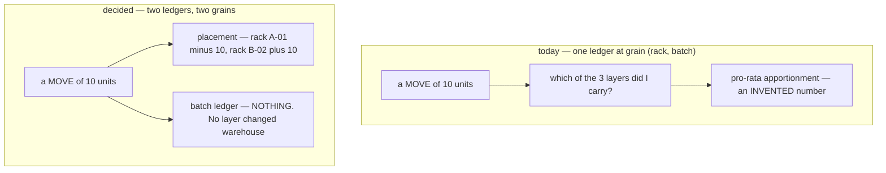

**The principle underneath it: FIFO is a COSTING CONVENTION, not a physical claim.** *First in, first out*
never meant you carried the oldest box. Binding a cost layer to a shelf is what turned an accounting rule
into a warehouse problem — and it is not one.

### the-two-grains

| | Placement ledger | Batch ledger |
| --- | --- | --- |
| **answers** | *where are the units* | *what did they cost, and whose are they* |
| **grain** | `(warehouse, product, rack)` | `(warehouse, product, owner, batch)` |
| **⚠ does NOT carry** | `batch_id`, `owner_team_id`, `unit_cost`, `expires_on` | `rack_id` — ever |
| **guard** | `balance >= 0` — *you cannot pick off a shelf that is empty* | `balance >= 0` — *you cannot consume a layer that is spent* |
| **read by** | the person at the shelf, the scanner, the stocktake | accounting, the owner lens, margin |
| **moved by** | RECEIVE · PICK · MOVE · TRANSFER_OUT/IN · RECOUNT · LOST · BROKEN | RECEIVE · PICK · TRANSFER_OUT/IN · RECOUNT · LOST · BROKEN |

⚠ **`MOVE` exists on ONE side only.** Carrying a box from A-01 to B-02 changes *where*, never *what it
cost* — so it writes **two placement rows and no batch row at all**. That single line is most of what
this split buys.

### the-bridge-is-the-transaction

The two ledgers meet in exactly one place: **the `inventory_transaction` both are lines of.** There is no
FK between them and no join key, by design — a link would reintroduce the cross product through the back
door.

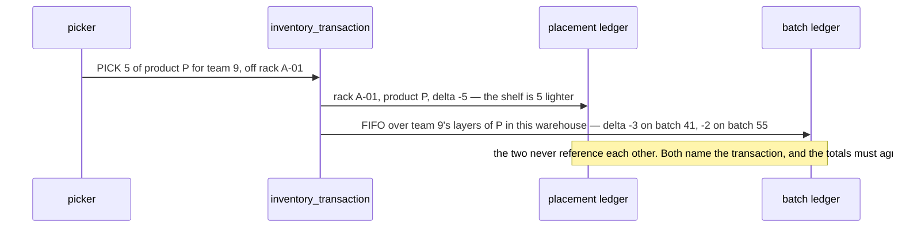

**The equality that replaces the cross product** — and ⚠ **it is the whole cost of this design**:

```
Σ placement.balance   =   Σ batch_level.balance          per (warehouse, product)
   over every rack            over every live batch
```

Today that holds **for free**, because it is the same rows summed two ways. Split, **nothing structural
holds it** — it becomes a first-class reconcile, exactly as load-bearing as the per-batch invariant.

### what-the-split-deletes

| Gone | Why it existed |
| --- | --- |
| **`stock_rack_batches`** — the `rack × batch` cross product | the single largest table, and the source of every problem below |
| **pro-rata apportionment** ([batch_selection](../batch_selection.md)) | a stocktake had to spread one shelf count across invisible layers |
| **FIFO-at-a-rack** ([fifo](../fifo.md)) | a draw walked layers *within a shelf*. FIFO is now warehouse-wide per product+owner, which is what it always meant |
| **`the-claim-pool-has-the-wrong-grain`** ([my #1 open item](#the-claim-pool-has-the-wrong-grain)) | ⚠ **resolved outright.** `lost_claimable` was warehouse-wide on a per-(rack,batch) row. On the batch ledger it is per-batch on a per-batch table — one grain, no ninth table, and [rackdelete-guards-on-balance-alone](#rackdelete-guards-on-balance-alone) stops being a rule |
| **a `MOVE` needing a batch decision** | see above — the clearest case |

⚠ **Row-count is the real win, not table count.** `rack × batch` becomes `rack × product` **plus**
`batch` — a product on 4 shelves across 6 layers is 24 rows today and 10 after.

### the-tables-this-implies

⚠ **PROPOSED, not decided — this is my reading of the owner's decision, not the decision itself.**

```
placement side                        batch side
  stock_rack_levels                     stock_batches         (frozen facts — unchanged)
    (rack, product) → balance           stock_batch_levels    (batch) → balance, lost_claimable
  stock_placement_movements             stock_batch_movements
    the ledger. NO batch_id               the ledger. NO rack_id
```

- **`stock_batch_levels` is 1:1 with `stock_batches` and still a separate table.** A batch never leaves
  its warehouse, so one row per batch — the columns *could* live on `stock_batches`. They must not:
  **the row you LOCK should not be the row you FROZE.** `stock_batches` holds immutable facts and is read
  constantly; the level is the hot, contended row. Merging them puts a write lock on a facts table.
- **Transit is purely a PLACEMENT concern.** A truck is a place, so `stock_transit_levels` /
  `stock_transit_movements` stay on the placement side, and the batch ledger has no transit concept:
  units simply leave A's batch levels at dispatch and are minted in B at accept.
  ⚠ **B learns which layers to mint from A's dispatch transaction's BATCH rows** — the only cross-warehouse
  read, and it is explicit rather than a join.
- **Ten tables, not eight** — an honest count. The cross product is gone; two smaller tables replace it.

### still-open-under-this-decision

| | ⚠ |
| --- | --- |
| **[expiry loses its shelf](#expiry-loses-its-shelf)** | *"which shelf has the stock expiring Friday"* becomes unanswerable. The doc says `expires_on` *"drives a BADGE and nothing else"* — **if that is still true, take the split unchanged.** This is the question I most need answered |
| **[owner loses its shelf](#owner-loses-its-shelf)** | mixed-owner shelves become possible to mis-decrement — physical-wrong and financial-wrong become **independent** errors where one row prevented both |
| **the reconcile** | `Σ placement = Σ batch` needs an owner, a cadence, and a decision about what a mismatch *does* |

---

> ⚠ **Everything below this line is the PRE-SPLIT 2026-08-05 design**, kept because the split does not
> touch most of it — `racks`, `inventory_transactions`, `stock_batches`, `stock_transfers`, the ownership
> rules, the transit reasoning and *"Why not the obvious thing"* all survive intact. **What it says about
> `stock_rack_batches` and `stock_movements` is superseded by
> [ledger-splits-by-question](#ledger-splits-by-question)** and is rewritten when the shape above settles.

**Eight tables** *(pre-split)*. The rule that draws the boundary: **this file owns what carries a QUANTITY OF RECORD** —
a `balance`, a `delta`, or the units a batch was born with — plus the two things those quantities need an
identity for (a place, and the action that moved them).

> ⚠ **`warehouse_products` is deliberately OUT.** *"Which products a warehouse handles"* is an
> **arrangement**, not a quantity — no `balance`, no `delta`, no batch. Named here so the omission reads
> as a decision rather than an oversight.

Behaviour lives elsewhere: [batch_selection](../batch_selection.md) (which
batch) · [fifo](../fifo.md) (how a draw walks) ·
[rack_selection](../rack_selection.md) (which rack) ·
[stock_movement_log](../stock_movement_log.md) (the write protocol, the
reconcile) · [stocktake](../stocktake.md) (counting a shelf).

> ⚠ **Those siblings PREDATE this file's two 2026-08-05 updates.** `stock_movement_log` still diagrams a
> single `stock_movements` with a nullable `rack_id`, and describes found goods by the reversed rule.
> **This file is the later thinking** — it no longer *wins* by authority, but nothing has argued it back.
> Read them for the *argument*, never for the *shape*.

---

## The model

```mermaid
erDiagram
    RACKS ||--o{ STOCK_RACK_BATCHES : "holds — a unit on a shelf"
    RACKS ||--o{ STOCK_MOVEMENTS : "the place — ALWAYS a rack"
    STOCK_TRANSFERS ||--o{ STOCK_TRANSIT_BATCHES : "holds — a unit on the road"
    STOCK_TRANSFERS ||--o{ STOCK_TRANSIT_MOVEMENTS : "the place — ALWAYS a transfer"
    STOCK_TRANSFERS ||--o| INVENTORY_TRANSACTIONS : "dispatched · accepted · cancelled — one each"
    STOCK_BATCHES ||--o{ STOCK_RACK_BATCHES : "how much of this layer sits where"
    STOCK_BATCHES ||--o{ STOCK_TRANSIT_BATCHES : "how much of this layer is travelling"
    STOCK_BATCHES ||--o{ STOCK_MOVEMENTS : "every change to this layer, at a rack"
    STOCK_BATCHES ||--o{ STOCK_TRANSIT_MOVEMENTS : "every change to this layer, on the road"
    INVENTORY_TRANSACTIONS ||--|{ STOCK_MOVEMENTS : "ONE action, N rows"
    INVENTORY_TRANSACTIONS ||--o{ STOCK_TRANSIT_MOVEMENTS : "and its transit lines, if any"
    INVENTORY_TRANSACTIONS ||--o{ STOCK_BATCHES : "the batch-creating kinds"
    INVENTORY_TRANSACTIONS ||--o| INVENTORY_TRANSACTIONS : "reverses — the general UNDO link"

    RACKS {
        bigserial id PK
        bigint warehouse_id "opaque team_service id — NO FK, the service seam"
        text code "painted on the shelf. UNIQUE per warehouse while active"
        text name
        text description
        boolean deleted "soft delete — see the RackDelete note"
        timestamptz created_at
        timestamptz updated_at
    }

    INVENTORY_TRANSACTIONS {
        bigserial id PK "the USER ACTION — every stock change belongs to one"
        bigint warehouse_id "ONE building. A transfer is therefore THREE transactions over time"
        smallint kind "RESTOCK ORDER WAREHOUSE_ADJUSTMENT TRANSFER PICK MOVE RETURN"
        bigint reverses_transaction_id FK "the UNDO link — a RETURN, a cancel, an un-accept"
        text reason "WHY — one per action, never per row"
        bigint actor_user_id "WHO — 0 when the system acted"
        timestamptz created_at
    }

    STOCK_BATCHES {
        bigserial id PK "⚠ ALSO the FIFO order. ORDER BY id IS the algorithm"
        bigint inventory_transaction_id FK "the batch's ORIGIN"
        bigint warehouse_id "no FK. A batch NEVER leaves the warehouse it was minted in"
        bigint product_id "no FK — opaque product_service id"
        bigint owner_team_id "the SELLING team that owns these units. Frozen at mint"
        bigint unit_cost "NULLABLE — NULL is UNKNOWN, never 0. Whole rupiah"
        date expires_on "NULLABLE. Drives a BADGE and nothing else"
        bigint arrived_qty "what was ACCEPTED. Frozen"
        bigint damaged_qty "damage found AT ACCEPTANCE only"
        bigint created_by "0 when unknown"
        bigint accepted_by "0 when unknown"
        timestamptz created_at
        timestamptz accepted_at
    }

    STOCK_RACK_BATCHES {
        bigserial id PK "the ONLY on-hand snapshot"
        bigint rack_id FK "NOT NULL — all stock in a warehouse is on a rack"
        bigint batch_id FK "NOT NULL — there is no unit without a batch"
        bigint warehouse_id "a COPY of the batch's — for the read index"
        bigint product_id "a COPY of the batch's — for the read index"
        bigint owner_team_id "a COPY of the batch's — for the owner lens"
        bigint balance "CHECK >= 0 — the over-draw guard AND the row lock"
        bigint lost_claimable "units LOST from here that a find may still claim back"
        timestamptz updated_at
    }

    STOCK_TRANSIT_BATCHES {
        bigserial id PK "the FOURTH place — stock on the road"
        bigint stock_transfer_id FK "NOT NULL — which journey"
        bigint batch_id FK "NOT NULL — the SOURCE batch. Minting happens at ACCEPT"
        bigint product_id "no FK"
        bigint owner_team_id "a COPY of the batch's — a transit loss costs its true owner"
        bigint balance "CHECK >= 0. Must be 0 once the transfer is not DISPATCHED"
        timestamptz updated_at
    }

    STOCK_MOVEMENTS {
        bigint id PK "⚠ from the SHARED sequence — THE order axis across both ledgers"
        bigint inventory_transaction_id FK "NOT NULL — the action this row is a line of"
        bigint rack_id FK "NOT NULL — the place. No nullable place column exists"
        bigint batch_id FK "NOT NULL"
        bigint warehouse_id "NOT NULL — a COPY of the batch's"
        bigint product_id "a COPY of the batch's"
        bigint owner_team_id "a COPY of the batch's — an EVENT FACT, never rewritten"
        bigint delta "SIGNED, independent of kind"
        bigint after_balance "the balance of THIS rack, THIS batch, after this row"
        smallint kind "RECEIVE PICK MOVE TRANSFER_OUT TRANSFER_IN RETURN RECOUNT LOST BROKEN"
        timestamptz created_at "the ONLY time on the row"
    }

    STOCK_TRANSIT_MOVEMENTS {
        bigint id PK "⚠ the SAME sequence — so history interleaves correctly"
        bigint inventory_transaction_id FK "NOT NULL"
        bigint stock_transfer_id FK "NOT NULL — the place. In transit it is in NO warehouse"
        bigint batch_id FK "NOT NULL"
        bigint product_id "a COPY of the batch's"
        bigint owner_team_id "a COPY of the batch's"
        bigint delta "SIGNED"
        bigint after_balance "the balance of THIS transfer, THIS batch, after this row"
        smallint kind "TRANSFER_OUT TRANSFER_IN LOST_IN_TRANSIT"
        timestamptz created_at
    }

    STOCK_TRANSFERS {
        bigserial id PK "the DOCUMENT — warehouse ops. One truck, days on the road"
        bigint from_warehouse_id "no FK"
        bigint to_warehouse_id "no FK. CHECK it differs from from_warehouse_id"
        smallint state "DISPATCHED · ACCEPTED · CANCELLED"
        bigint dispatched_transaction_id FK "NOT NULL — the row is created AT dispatch"
        timestamptz dispatched_at
        bigint accepted_transaction_id FK "NULL until it arrives"
        timestamptz accepted_at
        bigint cancelled_transaction_id FK "NULL unless the goods came home"
        timestamptz cancelled_at
    }
```

---

## The tables

**Create in this order** — every FK target exists before the FK is written.

```sql
-- 1 ─────────────────────────────────────────────────────── racks · the address
CREATE TABLE racks (
    id           BIGSERIAL   PRIMARY KEY,
    warehouse_id BIGINT      NOT NULL,                 -- no FK — the service seam
    code         TEXT        NOT NULL,
    name         TEXT        NOT NULL DEFAULT '',
    description  TEXT        NOT NULL DEFAULT '',
    deleted      BOOLEAN     NOT NULL DEFAULT FALSE,
    created_at   TIMESTAMPTZ NOT NULL DEFAULT NOW(),
    updated_at   TIMESTAMPTZ NOT NULL DEFAULT NOW(),
    CONSTRAINT racks_code_present CHECK (code <> '')
);
-- a re-labelled shelf frees its code, and two warehouses may both have an 'A-01-3'
CREATE UNIQUE INDEX racks_warehouse_code_active_unique
    ON racks (warehouse_id, code) WHERE deleted = FALSE;
CREATE INDEX racks_warehouse_active_idx ON racks (warehouse_id) WHERE deleted = FALSE;

-- ⚠ `deleted` is a SOFT delete, so `ON DELETE RESTRICT` on the FKs below never fires.
--   A rack holding stock must be refused in CODE (RackDelete sums its balances first),
--   and the nightly reconcile re-checks it. See "Why not the obvious thing" §3.


-- 2 ──────────────────────────────────── inventory_transactions · the USER ACTION
CREATE TABLE inventory_transactions (
    id            BIGSERIAL PRIMARY KEY,
    warehouse_id  BIGINT   NOT NULL,                   -- no FK
    kind          SMALLINT NOT NULL,                   -- mirrors the proto enum number
    reverses_transaction_id BIGINT REFERENCES inventory_transactions (id),
    reason        TEXT     NOT NULL DEFAULT '',
    actor_user_id BIGINT   NOT NULL DEFAULT 0,
    created_at    TIMESTAMPTZ NOT NULL DEFAULT NOW()
);
-- ⚠ NO owner_team_id. An ACTION is not owned — one action may touch several selling
--   teams' goods, and each MOVEMENT names its own owner.


-- 3 ───────────────────────────────────────── stock_batches · the COST LAYER
CREATE TABLE stock_batches (
    id            BIGSERIAL PRIMARY KEY,               -- ⚠ FIFO reads this. Never reorder
    inventory_transaction_id BIGINT NOT NULL
                  REFERENCES inventory_transactions (id) ON DELETE RESTRICT,
    warehouse_id  BIGINT NOT NULL,                     -- no FK, and immutable
    product_id    BIGINT NOT NULL,                     -- no FK
    owner_team_id BIGINT NOT NULL CHECK (owner_team_id > 0),   -- a SELLING team
    unit_cost     BIGINT,                              -- ⚠ NULL = UNKNOWN, never 0
    expires_on    DATE,                                -- NULL = does not expire
    arrived_qty   BIGINT NOT NULL CHECK (arrived_qty >= 0),
    damaged_qty   BIGINT NOT NULL DEFAULT 0 CHECK (damaged_qty >= 0),
    created_by    BIGINT NOT NULL DEFAULT 0,           -- a USER id: 0 = nobody did the paperwork
    accepted_by   BIGINT NOT NULL DEFAULT 0,
    created_at    TIMESTAMPTZ NOT NULL DEFAULT NOW(),
    accepted_at   TIMESTAMPTZ NOT NULL DEFAULT NOW()
);
CREATE INDEX stock_batches_wh_product_idx ON stock_batches (warehouse_id, product_id, id);
CREATE INDEX stock_batches_owner_idx      ON stock_batches (owner_team_id, product_id, id);


-- 4 ──────────────────────────── stock_rack_batches · the ONLY on-hand snapshot
CREATE TABLE stock_rack_batches (
    id            BIGSERIAL PRIMARY KEY,
    rack_id       BIGINT NOT NULL REFERENCES racks (id)         ON DELETE RESTRICT,
    batch_id      BIGINT NOT NULL REFERENCES stock_batches (id) ON DELETE RESTRICT,
    warehouse_id  BIGINT NOT NULL,                     -- no FK — a copy of the batch's
    product_id    BIGINT NOT NULL,                     -- no FK — a copy of the batch's
    owner_team_id BIGINT NOT NULL CHECK (owner_team_id > 0),
    balance       BIGINT NOT NULL DEFAULT 0 CHECK (balance >= 0),

    -- units LOST from this (rack, batch) that a find may still claim back.
    -- ⚠ It is DERIVABLE from the ledger and stored anyway — see "Why not the obvious thing" §6.
    lost_claimable BIGINT NOT NULL DEFAULT 0 CHECK (lost_claimable >= 0),

    updated_at    TIMESTAMPTZ NOT NULL DEFAULT NOW(),
    UNIQUE (rack_id, batch_id)
);
CREATE INDEX stock_rack_batches_wh_product_idx ON stock_rack_batches (warehouse_id, product_id);
CREATE INDEX stock_rack_batches_rack_idx       ON stock_rack_batches (rack_id);
CREATE INDEX stock_rack_batches_owner_idx      ON stock_rack_batches (owner_team_id, warehouse_id, product_id);
-- the claim pool is walked warehouse-wide on every find. Losses are rare, so the
-- partial index stays tiny where the full one would scan every shelf holding the product.
CREATE INDEX stock_rack_batches_claim_pool_idx
    ON stock_rack_batches (warehouse_id, product_id, batch_id, rack_id) WHERE lost_claimable > 0;

-- ⚠ An emptied row is pruned, so the prune condition is `balance = 0 AND lost_claimable = 0`.
--   A rack that lost its whole stock keeps its row exactly as long as the loss is
--   still claimable — which is the row a find has to find.


-- 5 ─────────────────────────────────── stock_transfers · the JOURNEY document
CREATE TABLE stock_transfers (
    id                BIGSERIAL PRIMARY KEY,
    from_warehouse_id BIGINT   NOT NULL,               -- no FK
    to_warehouse_id   BIGINT   NOT NULL,
    state             SMALLINT NOT NULL,               -- DISPATCHED · ACCEPTED · CANCELLED

    -- ONE transaction FK per lifecycle transition, each PAIRED with its timestamp.
    -- Named for the EVENT, never the direction: a direction does not name a warehouse,
    -- because a cancel's inbound leg lands back in A.
    dispatched_transaction_id BIGINT NOT NULL UNIQUE
                      REFERENCES inventory_transactions (id) ON DELETE RESTRICT,
    dispatched_at     TIMESTAMPTZ NOT NULL,

    accepted_transaction_id   BIGINT UNIQUE
                      REFERENCES inventory_transactions (id) ON DELETE RESTRICT,
    accepted_at       TIMESTAMPTZ,

    cancelled_transaction_id  BIGINT UNIQUE
                      REFERENCES inventory_transactions (id) ON DELETE RESTRICT,
    cancelled_at      TIMESTAMPTZ,

    CHECK (from_warehouse_id <> to_warehouse_id),
    -- the fork: accepted or cancelled, never both
    CHECK (accepted_transaction_id IS NULL OR cancelled_transaction_id IS NULL),
    -- each timestamp travels with its transaction
    CHECK ((accepted_transaction_id  IS NULL) = (accepted_at  IS NULL)),
    CHECK ((cancelled_transaction_id IS NULL) = (cancelled_at IS NULL))
);
CREATE INDEX stock_transfers_incoming_idx ON stock_transfers (to_warehouse_id,   state, dispatched_at);
CREATE INDEX stock_transfers_outgoing_idx ON stock_transfers (from_warehouse_id, state, dispatched_at);

-- ⚠ NO owner_team_id. A transfer is a WAREHOUSE operation: one truck carries several
--   selling teams' goods, and each leg is ONE transaction covering all of them.


-- 6 ───────────────────────────── stock_transit_batches · the FOURTH place
CREATE TABLE stock_transit_batches (
    id                BIGSERIAL PRIMARY KEY,
    stock_transfer_id BIGINT NOT NULL REFERENCES stock_transfers (id) ON DELETE RESTRICT,
    batch_id          BIGINT NOT NULL REFERENCES stock_batches (id)   ON DELETE RESTRICT,
    -- ⚠ NO warehouse_id, on purpose. In transit it is in NO warehouse, and the
    --   transfer already names both ends. A column here could only lie about which.
    product_id        BIGINT NOT NULL,
    owner_team_id     BIGINT NOT NULL CHECK (owner_team_id > 0),
    balance           BIGINT NOT NULL DEFAULT 0 CHECK (balance >= 0),
    updated_at        TIMESTAMPTZ NOT NULL DEFAULT NOW(),
    UNIQUE (stock_transfer_id, batch_id)
);
CREATE INDEX stock_transit_batches_transfer_idx ON stock_transit_batches (stock_transfer_id);
CREATE INDEX stock_transit_batches_owner_idx    ON stock_transit_batches (owner_team_id, product_id);


-- ─── the SHARED order axis. Both ledgers draw from it, so ids interleave.
--     ⚠ Give either table its own BIGSERIAL and history stops being orderable.
CREATE SEQUENCE stock_movement_id_seq;


-- 7 ─────────────────── stock_movements · THE LEDGER at a RACK. Append-only.
CREATE TABLE stock_movements (
    id            BIGINT PRIMARY KEY DEFAULT nextval('stock_movement_id_seq'),
    inventory_transaction_id BIGINT NOT NULL
                  REFERENCES inventory_transactions (id) ON DELETE RESTRICT,

    rack_id       BIGINT NOT NULL REFERENCES racks (id)         ON DELETE RESTRICT,
    batch_id      BIGINT NOT NULL REFERENCES stock_batches (id) ON DELETE RESTRICT,

    warehouse_id  BIGINT NOT NULL,                     -- no FK — a copy of the batch's
    product_id    BIGINT NOT NULL,                     -- no FK — a copy of the batch's
    owner_team_id BIGINT NOT NULL CHECK (owner_team_id > 0),

    delta         BIGINT   NOT NULL CHECK (delta <> 0),
    after_balance BIGINT   NOT NULL CHECK (after_balance >= 0),
    kind          SMALLINT NOT NULL,
    created_at    TIMESTAMPTZ NOT NULL DEFAULT NOW()
);
CREATE INDEX stock_movements_wh_product_idx ON stock_movements (warehouse_id, product_id, id DESC);
CREATE INDEX stock_movements_rack_idx       ON stock_movements (rack_id,  id DESC);
CREATE INDEX stock_movements_batch_idx      ON stock_movements (batch_id, id DESC);
CREATE INDEX stock_movements_txn_idx        ON stock_movements (inventory_transaction_id);
CREATE INDEX stock_movements_owner_idx      ON stock_movements (owner_team_id, product_id, warehouse_id, id DESC);
-- retry safety: a replayed action cannot write its lines twice.
-- ⚠ This WORKS only because no column in the key is nullable — see "Why not the
--   obvious thing" §2. Postgres treats NULLs as DISTINCT, so a key containing one
--   can never collide, and a unique index over it rejects nothing.
CREATE UNIQUE INDEX stock_movements_txn_once
    ON stock_movements (inventory_transaction_id, rack_id, batch_id);


-- 8 ──────────── stock_transit_movements · THE LEDGER on the road. Append-only.
CREATE TABLE stock_transit_movements (
    id            BIGINT PRIMARY KEY DEFAULT nextval('stock_movement_id_seq'),
    inventory_transaction_id BIGINT NOT NULL
                  REFERENCES inventory_transactions (id) ON DELETE RESTRICT,

    stock_transfer_id BIGINT NOT NULL
                  REFERENCES stock_transfers (id) ON DELETE RESTRICT,
    batch_id      BIGINT NOT NULL REFERENCES stock_batches (id) ON DELETE RESTRICT,

    -- ⚠ NO warehouse_id, and no rack_id. In transit the goods are in NO warehouse,
    --   and the transfer already names both ends. Absence says it better than a
    --   NULL did — the same reasoning stock_transit_batches already uses.
    product_id    BIGINT NOT NULL,
    owner_team_id BIGINT NOT NULL CHECK (owner_team_id > 0),

    delta         BIGINT   NOT NULL CHECK (delta <> 0),
    after_balance BIGINT   NOT NULL CHECK (after_balance >= 0),
    kind          SMALLINT NOT NULL,
    created_at    TIMESTAMPTZ NOT NULL DEFAULT NOW()
);
CREATE INDEX stock_transit_movements_transfer_idx ON stock_transit_movements (stock_transfer_id, id DESC);
CREATE INDEX stock_transit_movements_batch_idx    ON stock_transit_movements (batch_id, id DESC);
CREATE INDEX stock_transit_movements_txn_idx      ON stock_transit_movements (inventory_transaction_id);
CREATE UNIQUE INDEX stock_transit_movements_txn_once
    ON stock_transit_movements (inventory_transaction_id, stock_transfer_id, batch_id);


-- ─── one batch's whole history, in order. The only place the two ledgers meet.
CREATE VIEW stock_ledger AS
    SELECT id, inventory_transaction_id, batch_id, product_id, owner_team_id,
           delta, after_balance, kind, created_at,
           rack_id, NULL::BIGINT AS stock_transfer_id, warehouse_id
      FROM stock_movements
    UNION ALL
    SELECT id, inventory_transaction_id, batch_id, product_id, owner_team_id,
           delta, after_balance, kind, created_at,
           NULL::BIGINT AS rack_id, stock_transfer_id, NULL::BIGINT AS warehouse_id
      FROM stock_transit_movements;
-- ⚠ The view is for READING history. Never write through it, and never let a
--   query that needs a rack read from it — that reintroduces the nullable column
--   the split exists to remove.
```

---

## The rules the schema depends on

Short statements only. Each is enforced by code, not by a constraint, and each has a reason that is easy
to undo by accident — so they are restated here rather than left to the behaviour docs.

⚠ **Each row is a NAMED decision and the name is its anchor** (RULE 12) — link to `#the-name`, never
quote the row. Two names below were **renamed when their verdict changed**, which is the price of a name
carrying its verdict: see [names-that-reversed-were-never-regrepped](#names-that-reversed-were-never-regrepped).

| | |
| --- | --- |
| <a id="ownership-is-a-selling-team"></a>**ownership-is-a-selling-team** | `warehouse_id` is a **warehouse team** (it handles the goods and carries the access scope). `owner_team_id` is a **selling team** (it owns them and carries the money). They are both `team_service` ids and they are **not interchangeable** — ⚠ and nothing in this design ever needs the exception: **a warehouse never owns stock**, because [a person names the selling team](#the-owner-is-named-by-a-person) before any batch is created |
| <a id="ownership-is-copied"></a>**ownership-is-copied** | on all three tables that carry a quantity, and on **no** other. The batch is authoritative; the rest are copies the reconcile checks |
| <a id="ownership-is-frozen-at-mint"></a>**ownership-is-frozen-at-mint** | it is never corrected — like `unit_cost` and `arrived_qty`. A keying error is fixed by **reversing the acceptance and redoing it**, which is possible until the goods move. A genuine change of hands is a **handover event**, and that feature does not exist yet. ⚠ **Neither does the reversal** — see [debts](#debts) |
| <a id="every-unit-is-in-a-known-place"></a>**every-unit-is-in-a-known-place** | a rack, or a transfer in flight. There is no "somewhere" — and since [the ledger is two tables](#the-ledger-is-two-tables), no row can even express one |
| <a id="rackdelete-guards-on-balance-alone"></a>**rackdelete-guards-on-balance-alone** | ⚠ **never on `lost_claimable`.** A shelf can reach `balance = 0` while an open claim still points at it, and a claim only closes when someone finds the units — so guarding on it would make any shelf that ever lost stock **undeletable forever**. The claim belongs to the loss, not the furniture: it survives the rack, the pool walk never filters on rack state, and a find writes its row at the rack it was *found* at |
| <a id="a-batch-never-leaves-its-warehouse"></a>**a-batch-never-leaves-its-warehouse** | a transfer **mints** new batches at the destination, one per source layer, copying `unit_cost`, `expires_on` and `owner_team_id` verbatim |
| <a id="a-cancel-returns-what-is-left"></a><a id="cancel-reverses-the-dispatch"></a>**a-cancel-returns-what-is-left** ⚠ *renamed from `cancel-reverses-the-dispatch`* | not what was dispatched — units may have been lost mid-flight. It names no racks and mints no batches |
| <a id="found-recovers-a-loss"></a>**found-recovers-a-loss** | a find draws down `lost_claimable` across the **whole warehouse** for that product — a mislaid unit turns up on a *different* shelf — oldest cost layer first (`ORDER BY batch_id, rack_id`). The units **rejoin the batches they were lost from**, so *"at the price they were lost at"* needs no rule of its own: the pool row **is** a batch row, and the batch carries `unit_cost` |
| [a-find-is-the-only-drain](#a-find-is-the-only-drain) | there is **no expiry, no write-off and no clock**. A loss nobody ever finds stays claimable. ⚠ The accepted cost: after some years the pool is rarely empty, so a surplus almost always finds something to claim, and a *receiving* error can hide inside old shrinkage |
| <a id="a-find-never-refuses"></a>**a-find-never-refuses** ⚠ *reverses the old `no-prior-loss-is-refused`* | more found than the pool can cover? Claim what it covers, then **mint ONE batch for the rest at the last known price** — the highest-id batch for that product in this warehouse with a non-`NULL` `unit_cost`. No priced batch exists → `unit_cost = NULL`. `expires_on` is always `NULL` — unknowable without a delivery |
| [the-owner-is-named-by-a-person](#the-owner-is-named-by-a-person) | the warehouse person picks it from a select. That one choice **scopes the claim pool AND owns whatever mints beyond it** — so there is no placeholder owner in this design. ⚠ Never inherited from the price batch, never resolved server-side — see [the-owner-is-named-by-a-person](#the-owner-is-named-by-a-person) |
| <a id="the-mint-enters-as-receive"></a>⚠ **the-mint-enters-as-receive** | the batch is born with `arrived_qty`, and `found` counts `RECOUNT⁺` — spelling the mint as a `RECOUNT` counts the same units on **both sides** of the per-batch invariant. It is also the honest reading: these units *arrived*, there is simply no paperwork |
| <a id="delta-is-signed-independently-of-kind"></a>**delta-is-signed-independently-of-kind** | `kind` says which ACTION, the sign says which direction. No `_IN` / `_OUT` pair is needed where a sign already carries it |
| <a id="kind-mirrors-the-proto-enum"></a>**kind-mirrors-the-proto-enum** | never a Postgres `ENUM`, never text — so no constraint here hardcodes a value that lives in the contract |

## Invariants

```
-- per (place, batch): the three must agree. ⚠ ONE LEDGER PER PLACE KIND — a rack
--    reconciles against stock_movements, a transfer against stock_transit_movements.
--    Neither check ever has to filter out the other's rows.
stock_rack_batches.balance    = after_balance at MAX(id) = Σ delta
                                -- over stock_movements         for that (rack, batch)
stock_transit_batches.balance = after_balance at MAX(id) = Σ delta
                                -- over stock_transit_movements for that (transfer, batch)

-- per batch: every place a unit can be
arrived + found = ready + in_transit + used + broken + lost + lost_in_transit + damaged_at_acceptance
    ready        = Σ stock_rack_batches.balance
    in_transit   = Σ stock_transit_batches.balance
    used         = Σ |delta| WHERE kind = PICK
    found        = Σ  delta  WHERE kind = RECOUNT AND delta > 0   -- CLAIMED units only.
                                                                 -- A mint is a RECEIVE and lands in `arrived`.

-- the claim pool: an EQUALITY, because a find is the only thing that moves it
-- ⚠ per BATCH, summed across racks — a find decrements at the rack the units were LOST
--    from while writing its ledger row at the rack they were FOUND at, so it does NOT
--    hold per (rack, batch)
Σ stock_rack_batches.lost_claimable = Σ |delta| WHERE kind = LOST − Σ delta WHERE kind = RECOUNT AND delta > 0

-- per transfer: it must close
SUM(stock_transit_batches.balance) = 0   for every transfer whose state <> DISPATCHED

-- the copies must still match their source
owner_team_id, product_id  on stock_rack_batches, stock_transit_batches,
                              stock_movements and stock_transit_movements  =  the batch's
warehouse_id               on stock_rack_batches and stock_movements       =  the batch's
                              -- the two transit tables carry none, by design
-- and a rack must be in the warehouse the row claims, and must not be soft-deleted
--    while it holds stock
```

⚠ **The reconcile is part of the design, not a nice-to-have.** Two stored numbers and several unenforceable
copies exist precisely so that nothing recomputes them — which is exactly why nothing would notice them
drifting.

---

## the-claim-pool

**Found goods are the UNDOING of a loss, not a receipt.** `lost_claimable` is the quantity a find may
claim back — it goes up on a `LOST`, and down on a find.

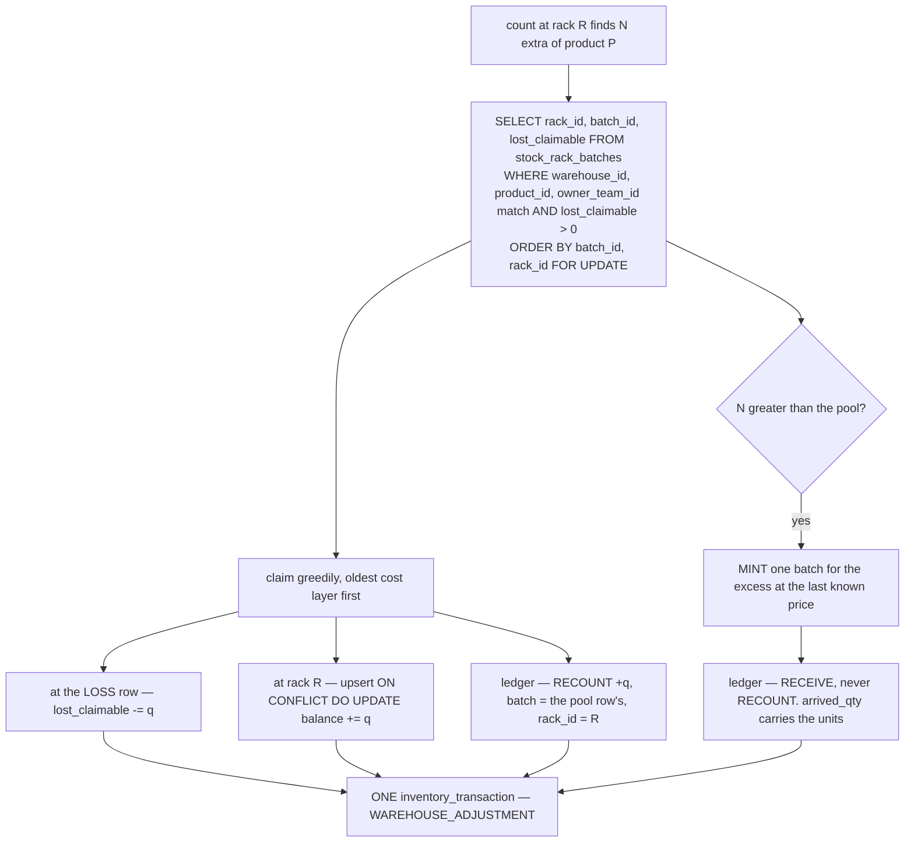

### a-find-is-the-only-drain

A claim closes when `lost_claimable` reaches **0**, and by nothing else. **This is what makes the pool an
equality rather than an inequality** — every movement of the counter has a ledger row behind it, so it is
exactly reproducible. Any write-off or expiry added later reopens that, and the reconcile check has to
weaken with it.

### the-owner-is-named-by-a-person

**A warehouse person selects the owning selling team, and they do it BEFORE anything is written.**

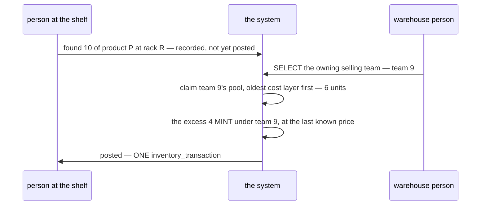

**One selection serves both halves.** The team scopes *which* pool is walked, and it owns *whatever*
mints beyond it. There is therefore **no placeholder owner anywhere in this design** — no house team, no
"unassigned" bucket, no warehouse-owned stock. `owner_team_id` always names a real selling team, so the
rule above never bends and `owner_team_id == warehouse_id` stays a reliable smell.

**The owner arrives in the request, and that is load-bearing.** The server validates
`owner_team_id > 0` and never resolves a team itself — no synchronous `team_service` call inside the
write transaction that holds the pool's row locks.

- ⚠ **The person naming the team is not the person counting.** A counter measures a shelf and cannot know
  whose units these are; the selection belongs to whoever reviews before posting.
- ⚠ **Scope the picker, and make it admin-only.** Someone who can assign found goods to any team can give
  stock away. Offer the selling teams that trade in this warehouse — ⚠ **no known relation supplies that
  list**, see [debts](#debts).
- ⚠ **The accepted consequence: there is no "decide later".** The action cannot proceed without a named
  team, so a person who does not know has to find out. That is deliberate — a placeholder owner is a
  question nobody ever comes back to.

### the-remainder-mints-at-last-price

`FOR UPDATE` on the pool rows is the whole concurrency story — the rows being decremented are the rows
being locked, so two simultaneous finds cannot read the same pool. The rows are locked in
`batch_id, rack_id` order, which is the same order every other draw takes.

⚠ **The control this removes:** a count can now create stock with no document behind it. The
`inventory_transaction` carries the actor and the reason, so it is attributable — but *"stock cannot be
conjured by counting"* was true before this and is not true now, and anything that leaned on that sentence
needs re-reading.

---

## the-ledger-is-two-tables

**A rack and a transfer-in-flight are different shapes, so they get different tables.** One row type
carries a rack and a warehouse; the other carries a transfer and no warehouse at all.

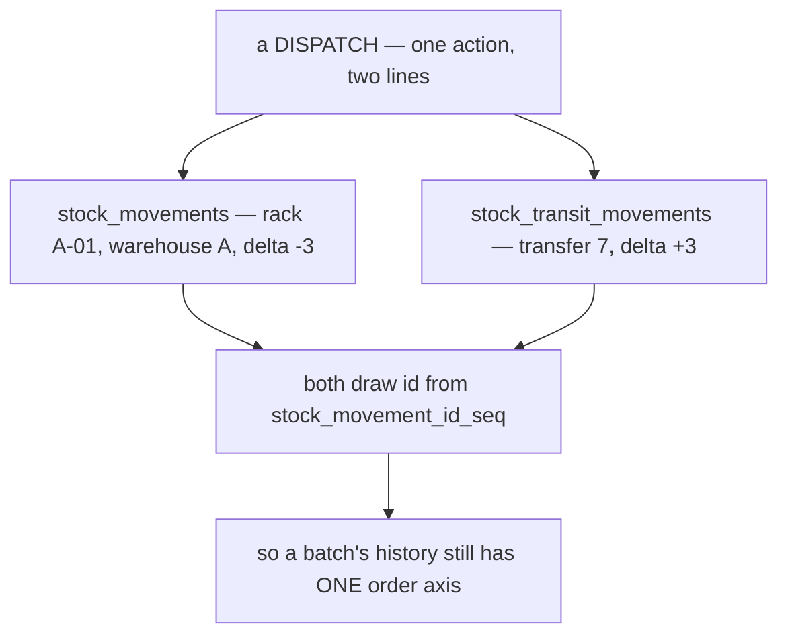

- ⚠ **The shared `SEQUENCE` is load-bearing.** *"`id` is THE order axis. Never order by a timestamp"*
  only survives because both tables draw from `stock_movement_id_seq`. Give either its own `BIGSERIAL`
  and the two logs can no longer be interleaved.
- **Read a batch's whole history through the `stock_ledger` view**, ordered by `id`. That view is the
  only place the two meet, it is **read-only**, and a query that needs a rack must go to
  `stock_movements` directly — reading racks through the view reintroduces the nullable column the split
  removed.
- ✅ **`warehouse_id` is simply absent on the transit table.** The earlier design needed a `CHECK` to force
  it `NULL` in transit, because a transit row claiming warehouse A made a dispatch's two legs net to zero
  and A's own history said nothing left the building. Absence needs no constraint.
- ✅ **`LOST_IN_TRANSIT` now has nowhere else to live**, and the claim pool cannot accidentally see it —
  the pool reads `stock_movements`, which has no transit rows to exclude.

### transit-is-a-place

**A truck is the FOURTH place a unit can be**, alongside a rack, and it has a state row of its own —
`stock_transit_batches`. A dispatch does not delete units and re-create them on arrival: it moves them
*into* transit, where they have a balance that can be counted, lost from, and reconciled.

- A shortfall on arrival stays behind as a `LOST_IN_TRANSIT` on the transit ledger — the two ends
  therefore **differ legitimately**, and `arrived_qty` is what was *accepted*, never what was dispatched.
- The transfer names both ends, so **no `warehouse_id` exists on either transit table.** In transit the
  goods are in *no* warehouse, and a column there could only lie about which.
- `SUM(balance) = 0` for every transfer that is not `DISPATCHED` — transit is a place goods pass
  through, never one they rest in.

---

## Why not the obvious thing

**Six decisions here look wrong at a glance. Each is right for a reason found by getting it wrong first.**
This section is the guard on them — do not "fix" one without reading its row.

| Looks wrong | Why it is not |
| --- | --- |
| **1 · `owner_team_id` COPIED onto an append-only ledger** | The natural fix is to join `stock_batches` instead. **It has no source to join from** — the batch's link to the restock (`restock_request_item_id`) was dropped when the transaction became the batch's origin, and a transfer-minted batch never had one. The column is also an **event fact** (*who owned these units when this happened*), not a cache — ownership is frozen, so it is never rewritten and the ledger stays append-only in the strong sense |
| **2 · TWO ledger tables for ONE ledger** | Splitting an append-only log looks like a normalisation mistake — and the obvious alternative, one table with a nullable `rack_id`/`stock_transfer_id` pair and an `XOR CHECK`, is what this design had until it produced **two bugs from the same cause**. ⚠ **`NULL` breaks equality**: `rack_id = NULL` is never true, so a plain `=` silently matched nothing and reported phantom *"insufficient stock"* for goods on the shelf — every read and lock then had to remember `IS NOT DISTINCT FROM`. ⚠ **`NULL` breaks uniqueness**: Postgres treats NULLs as DISTINCT, and the `XOR` guaranteed **every** row carried one, so the retry-safety unique index could never reject anything — a replayed action doubled its balances in silence. Two `NOT NULL` tables end both, structurally: the `XOR CHECK` disappears because "neither, or both" stops being expressible. See [the-ledger-is-two-tables](#the-ledger-is-two-tables) |
| **3 · `ON DELETE RESTRICT` on a SOFT-deleted `racks`** | The FK never fires, because a soft delete is an `UPDATE`. It is kept because a hard delete must still be refused, but **it is not the guard** — the guard is `RackDelete` summing balances, plus a reconcile check. Do not read the FK as protection |
| <a id="transitions-name-the-columns"></a>**4 · THREE transaction FKs on `stock_transfers`** *(= `transitions-name-the-columns`)* | One column per lifecycle transition looks redundant against a single "current transaction". It is not: a **direction does not name a warehouse** — a cancel's inbound leg lands back in **A**, so a shared column would make the destination's "incoming" screen silently pick up the source's returns |
| **5 · no `owner_team_id` on `inventory_transactions`** | Every other quantity-bearing table has one, so its absence looks like an oversight. **An action is not owned** — one `LOST` on a shelf legitimately spans two selling teams, and forcing a single value there would either be a lie or split one action into several transactions |
| **6 · `lost_claimable` is DERIVABLE and stored anyway** | The invariants prove it is exactly `Σ\|LOST\| − Σ RECOUNT⁺`, so it reads like the cached `lost` / `broken` columns that were **rejected** for that very reason. The difference is what it is FOR: **it is the row a find LOCKS.** `SELECT … WHERE lost_claimable > 0 … FOR UPDATE` is the entire concurrency control, and an aggregate cannot be locked. ⚠ The rejected columns were cumulative — they never return to zero, so the row could never be pruned. This one drains, so it does |

⚠ **The pattern behind 1, 2 and 5: a fact was filed in the wrong bucket, and nothing re-checked it.**
The rule *"copy immutable facts, join mutable ones"* is correct — `owner_team_id` was simply misfiled as
mutable on the strength of one untested sentence, and every consequence followed from that.

⚠ **The pattern behind 2 and 4: a late decision met early rules.** Adding a fourth place (transit) did not
just add a table — it invalidated every rule phrased in terms of *racks*. **When a decision widens a
concept, grep for the OLD word, not the new one.**

---

## debts

**Claims this doc makes that are NOT built.**
⚠ **Two rules above describe a correction path the system does not have.** They are deferred, not
forgotten (owner, 2026-08-05) — and they are listed here because a doc asserting an unbuilt behaviour is
worse than one that stays quiet.

### restock-acceptance-has-no-undo

*"A keying error is fixed by reversing the acceptance and redoing it."* **No RPC does this.** Until one
exists, an acceptance keyed to the wrong selling team, price or quantity is **permanent in practice** —
the design says otherwise and the system does not agree with it.

**What it would be:** one `inventory_transaction` whose `reverses_transaction_id` names the acceptance,
carrying a negative `RECEIVE` line for every line the acceptance wrote. The batch **stays** — the ledger
is append-only, and a batch that existed for an hour is a fact — its balance returns to zero, and history
reads forwards as *"received, then un-received."*

| | |
| --- | --- |
| **the precondition** | *"no movement on any of the acceptance's batches other than its own `RECEIVE` rows"* — one SQL predicate, so the fix is enforced rather than trusted |
| ⚠ **not a generic `TransactionReverse`** | reversal means something different per kind — a transfer's undo is a cancel with its own leg, a pick's is a return. One RPC per reversible action |
| ⚠ **it cannot cover moved goods** | anything already picked or transferred needs the **handover**, which also does not exist |

### the-owner-picker-has-no-scope

[the-owner-is-named-by-a-person](#the-owner-is-named-by-a-person) says the picker should offer *"the
selling teams that trade in this warehouse."* ⚠ **No known relation supplies that list** — `warehouse_products`
is products ↔ warehouse, not teams ↔ warehouse, and whether `team_service` has one is unconfirmed.

**Until it is answered the picker is unscoped**, which means an admin can assign found goods to any team
in the company. That is the *only* control on a screen that creates stock out of a count, so it has to be
settled before the picker is built — not before the schema ships.

---

⚠ **Three rules under `# Proposal` are behaviour, not schema** — found goods, a cancel's return, and
*"a keying error is fixed by reversing the acceptance"*. They belong in the behaviour docs, and now that
this file is `disscuss/` too there is no longer a demotion argument keeping them here. **Where they land
is an open question** — see [behaviour-rules-are-squatting-here](#behaviour-rules-are-squatting-here).

---

# Open

**Six things I would re-argue.** Ordered by how much of the schema moves if the answer changes.
Nothing here is a bug report against a working system — none of it is built.

| | The weakness | → Recommend |
| --- | --- | --- |
| **1** | [which shelf holds the stock expiring Friday](#expiry-loses-its-shelf) | ⚠ **the question I most need answered** — if `expires_on` is badge-only, take the split unchanged |
| **2** | [a mixed-owner shelf can be decremented for the wrong owner](#owner-loses-its-shelf) | accept it, and let the reconcile catch it — but say so out loud |
| **3** | [`RECOUNT⁻` has no term in the per-batch invariant](#recount-minus-has-no-home) | a short count is a `LOST` — and the `CHECK` says so |
| **4** | [`damaged_qty` is a quantity of record with no ledger row](#damage-has-no-ledger-row) | acceptance writes `RECEIVE` + `BROKEN`, two lines |
| **5** | [the claim pool's lock order is not the order a find takes](#the-find-locks-in-two-passes) | one ordered `FOR UPDATE` over every row touched |
| **6** | [nine `kind`s, two tables, nothing enforcing the split](#kind-is-unconstrained-per-table) | a per-table `CHECK`, at a price |

<a id="the-claim-pool-has-the-wrong-grain"></a>

> ✅ **CLOSED by [ledger-splits-by-question](#ledger-splits-by-question): `the-claim-pool-has-the-wrong-grain`.**
> `lost_claimable` sat on `stock_rack_batches`, whose *other* quantity reconciled at a different grain —
> which is why the prune condition needed two columns, `RackDelete` had to be told to ignore one, and a
> partial index existed to find the rows where the second grain was live. **Three rules, one cause.** On
> `stock_batch_levels` it is per-batch on a per-batch table. No ninth table, and
> [rackdelete-guards-on-balance-alone](#rackdelete-guards-on-balance-alone) stops being a rule.

## expiry-loses-its-shelf

**The split's sharpest cost, and it is a warehouse question, not a schema one.** `expires_on` rides the
batch; the placement ledger has no `batch_id`. So *"go pull the milk expiring Friday"* has no answer —
the system knows a layer is expiring and knows a shelf holds 40 units, and **cannot connect them**.

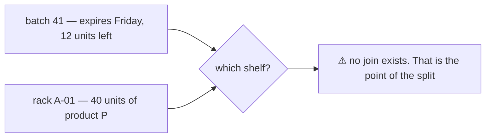

**→ Recommend: take the split unchanged — IF the doc's own claim still holds.** It says `expires_on`
*"drives a BADGE and nothing else"*. A badge is a **product-level** warning (*this product has stock
expiring*), and that survives the split intact. **If someone must physically FIND the expiring units, the
split cannot answer it** and the honest options are:

| Option | Cost |
| --- | --- |
| **a) accept it** — expiry is a badge, and a human walks the shelf | free. ⚠ only honest if nobody is ever asked to pull by date |
| **b) a placement HINT** — `stock_rack_levels.oldest_batch_id`, advisory, never a quantity | cheap, but ⚠ it is a **derived pointer with no invariant** — the exact misfiling *Why not the obvious thing* §1/§5 records twice |
| **c) keep a `(rack, batch)` side table** for expiry only | ⚠ **this is the cross product coming back**, scoped. I would refuse it — it re-earns every problem the split deletes |

⚠ **I would not choose (b) or (c) without the warehouse question being answered first.** *Does anyone
pull stock by expiry date?* If no, this whole item disappears.

## owner-loses-its-shelf

`owner_team_id` rides the batch too, so **placement does not know whose units a shelf holds.** Today one
row prevents two different errors at once. Split, they become independent:

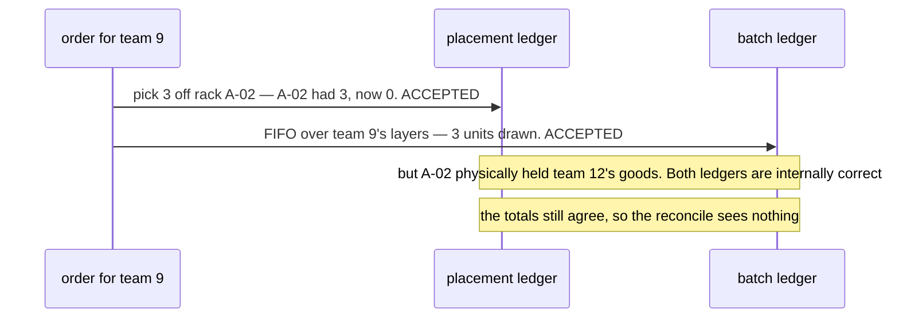

⚠ **The reconcile does NOT catch this** — `Σ placement = Σ batch` per (warehouse, product) still holds.
Only a per-owner shelf count would, and that is exactly the cross product the split removes.

**The counter-argument, and I think it wins:** the two guards are **complementary, not redundant**. Team 9
ordering 5 when only 4 of their layers exist is refused by the batch ledger and would have been *allowed*
by a shelf that holds 10 mixed units. Today's single row conflates *"the shelf is empty"* with *"this
owner is out of stock"*, and those are different refusals with different fixes.

**→ Recommend: accept it, and write it down as accepted** — beside
[ownership-is-a-selling-team](#ownership-is-a-selling-team), not in a debts list. ⚠ **The alternative is
worse than the problem:** the only structural fix is `(rack, product, owner)` placement, which is the
cross product again with `owner` standing in for `batch`.

## recount-minus-has-no-home

[delta-is-signed-independently-of-kind](#delta-is-signed-independently-of-kind) says the sign is free on
every kind. The per-batch invariant does **not** agree:

```
found = Σ delta WHERE kind = RECOUNT AND delta > 0
```

There is no `RECOUNT AND delta < 0` term **anywhere on either side**. So a negative `RECOUNT` decrements
`ready` with nothing to absorb it, and the per-batch invariant fails by exactly that quantity. Meanwhile
[stocktake](../stocktake.md) assumes a short count fills the claim pool — i.e. writes a **`LOST`**.

**→ Recommend: make it structural, not conventional** — `CHECK (kind <> RECOUNT OR delta > 0)`. A short
count is a `LOST`, which is the only spelling that keeps the claim-pool equality true. The `CHECK`
hardcodes one enum number, and [kind-mirrors-the-proto-enum](#kind-mirrors-the-proto-enum) warns against
exactly that — ⚠ **so this is a genuine trade-off, not a free fix.**

## damage-has-no-ledger-row

The invariant reads `arrived + found = ready + … + damaged_at_acceptance`, so `arrived_qty`
**includes** the damaged units. Nothing states what the acceptance's `RECEIVE` delta is, and both
readings break something:

| If `RECEIVE.delta` = | Then |
| --- | --- |
| `arrived_qty` | `ready` overstates by `damaged_qty` — the invariant is false the moment damage is recorded |
| `arrived_qty − damaged_qty` | ⚠ `damaged_qty` becomes the **only quantity of record with no ledger row**, and `Σ delta` no longer reconstructs the batch |

**→ Recommend: the acceptance writes TWO lines** — `RECEIVE +arrived_qty`, then `BROKEN −damaged_qty`,
same `inventory_transaction`. `damaged_qty` drops to a convenience copy the reconcile checks, the ledger
stays a complete account, and `BROKEN` is a kind that already exists.

⚠ **This collides with `stock_movements_txn_once`** — two rows for the same `(transaction, rack, batch)`
is exactly what that index rejects. Either the index key gains `kind`, or damage is its own transaction.
**I'd add `kind` to the key**; a reversing transaction will want the same freedom.

## the-find-locks-in-two-passes

[the-remainder-mints-at-last-price](#the-remainder-mints-at-last-price) claims *"`FOR UPDATE` on the pool
rows is the whole concurrency story"*. It is not — the find **also** upserts the rack it was found at
(`E2` in [the-claim-pool](#the-claim-pool)), and that row is normally *not* in the pool set.

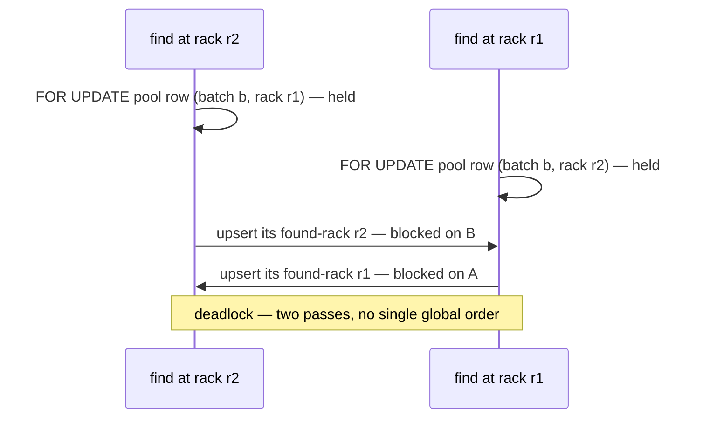

**→ Recommend: one ordered pass over every row the transaction will touch** — union the found-rack rows
into the pool `SELECT`, order the whole set by `(batch_id, rack_id)`, lock once. ⚠ **And prove it with
[`san_race`](../../../backend/pkgs/san_race/), not by argument** — this is precisely what the `audit-sql`
skill exists for, and *"two callers at the same second is the normal case"* here.

## kind-is-unconstrained-per-table

`stock_movements.kind` documents nine values, `stock_transit_movements.kind` three — and **nothing
enforces either list.** A `PICK` on the transit ledger or a `LOST_IN_TRANSIT` on the rack ledger inserts
cleanly, and the second one would be silently invisible to the claim pool, which
[the-ledger-is-two-tables](#the-ledger-is-two-tables) lists as a benefit of the split.

**→ Recommend: `CHECK (kind IN (…))` per table** — same trade-off as
[recount-minus-has-no-home](#recount-minus-has-no-home): it buys a structural guarantee by hardcoding
enum numbers the contract owns. ⚠ **Owner's call, and it should be the same call for both.**

## behaviour-rules-are-squatting-here

Three rules here are behaviour: [found-recovers-a-loss](#found-recovers-a-loss),
[a-cancel-returns-what-is-left](#a-cancel-returns-what-is-left), and the reversal sentence in
[ownership-is-frozen-at-mint](#ownership-is-frozen-at-mint). They stayed because moving them to
`disscuss/` would have **demoted** them. ⚠ **That argument is gone** — this file is `disscuss/` now.

**→ Recommend: leave them until something is promoted again.** Moving them now costs three edits and
buys nothing, and [restock_reversal](../restock_reversal.md) is already arguing the third one.

---

# Contradiction

## the-cross-product-grain-was-assumed-everywhere

[ledger-splits-by-question](#ledger-splits-by-question) removes `(rack, batch)` as a grain — and **eleven
places assert it**, across this file and five siblings. ⚠ **One cause, eleven sites** (RULE 11: group by
cause). None of them is wrong about anything *except* the grain, which is why they read as fine.

> **The per-batch invariant:** *"`ready` = `Σ stock_rack_batches.balance`"* — that table does not exist
> after the split, and `ready` is now a **placement** total that does not know the batch.

| Where | What it assumes |
| --- | --- |
| the per-batch invariant · [the-claim-pool](#the-claim-pool) flowchart · [Why not the obvious thing §6](#why-not-the-obvious-thing) · [ownership-is-copied](#ownership-is-copied) *("all three tables that carry a quantity")* | `stock_rack_batches` exists and a claim is rack-scoped |
| [batch_selection](../batch_selection.md) | pro-rata apportionment of a shelf count across layers |
| [fifo](../fifo.md) | a draw walks layers **within a rack** |
| [rack_selection](../rack_selection.md) | which rack a *batch* sits on |
| [stocktake](../stocktake.md) | a count resolves to `(rack, batch)` rows |
| [rack_batch_mutation](../rack_batch_mutation.md) | *"the ONE door into the stock_movements ledger"* — ⚠ there are **two doors** now, one per ledger |

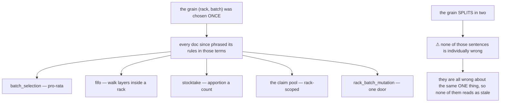

**→ RECOMMEND — do not rewrite the siblings yet.** The shape has three open sub-parts
([still-open-under-this-decision](#still-open-under-this-decision)), and rewriting five docs against a
shape that may still move is how a second round of contradictions gets manufactured. **Mark, then
rewrite:** each sibling gets one banner line naming this decision, and the rewrite happens when
[expiry-loses-its-shelf](#expiry-loses-its-shelf) is answered.

⚠ **What stops it recurring** — this is the *third* time a grain change rippled unseen, and the earlier
two are already recorded here: *"when a decision widens a concept, grep for the OLD word, not the new
one"* (the transit case). **A grain is not a word, so grep cannot find it.** The check that works is
mechanical and different: **list every table the decision deletes, then grep for the TABLE NAME.**
`stock_rack_batches` found all six sites in this file in one pass.

## names-that-reversed-were-never-regrepped

**21 of the 42 anchor links pointing at this file were dead** — 7 distinct names, one cause.

> **RULE 12:** *"every reference to it is a markdown link to the section that defines it"* … *"If a
> decision REVERSES, rename it and grep every reference."*

The rules table **names** its decisions but its rows are table cells, so **not one of them had an anchor**.
Every sibling link landed at the top of the file, reading as if it had resolved.

| Dead anchor | × | What actually happened |
| --- | --- | --- |
| `#ownership-is-copied` | 6 | never had an anchor — a table row |
| `#found-recovers-a-loss` | 5 | row **reworded** to *"found goods CLAIM a recorded loss"* |
| `#transit-is-a-place` | 3 | the concept survived; the **heading** was dissolved into `the-ledger-is-two-tables` |
| `#ownership-is-frozen-at-mint` | 3 | never had an anchor |
| `#cancel-reverses-the-dispatch` | 2 | ⚠ **the VERDICT reversed** — a cancel returns *what is left*, not the dispatch |
| `#transitions-name-the-columns` | 1 | folded into *Why not the obvious thing §4* |
| `#-two-kinds-of-team-…-can-own` | 1 | a decorated heading, dissolved into a row |

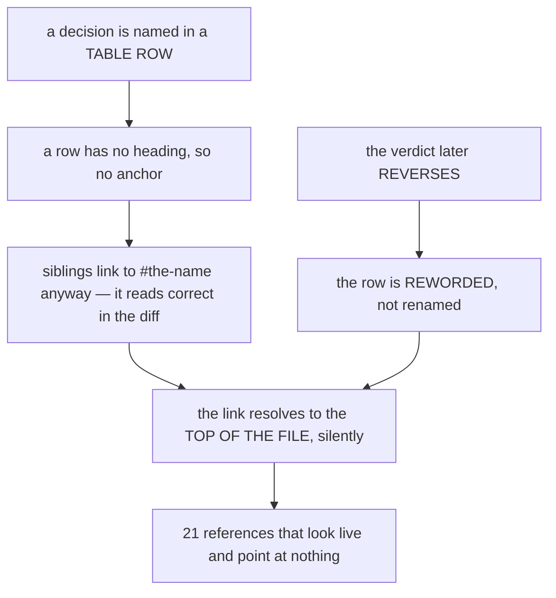

**→ RECOMMEND — two things, both applied above.**
1. **Every named decision gets a real anchor**, even in a table: `<a id="the-name"></a>` in the first
   cell, and the cell **is** the kebab name. Done for all 14 rows; the two dissolved concepts got their
   headings back ([transit-is-a-place](#transit-is-a-place), `transitions-name-the-columns`).
2. ⚠ **A reworded row is a RENAME.** `cancel-reverses-the-dispatch` → `a-cancel-returns-what-is-left`
   keeps the old id as an alias **only** so 2 live references still land — an alias is a migration, not a
   home. **What stops it recurring:** the anchor check is mechanical — resolve every
   `stock_design.md#x` against the file's headings and ids. It found all 21 in one pass, and eyeballing
   the diff had found none of them across three commits.

## the-promotion-changelog-outlived-its-fix

*"Corrections applied at promotion"* still asserted, as a stated fix:

> `stock_movements.warehouse_id` is **NULL in transit**, with a `CHECK` tying it to `rack_id`

The ledger split reversed exactly that: `warehouse_id` is **`NOT NULL`**, the `CHECK` is gone, and transit
rows are **not in that table at all**. Two sections of the same file gave opposite answers, and the wrong
one read as authoritative because it was headed *"applied"*.

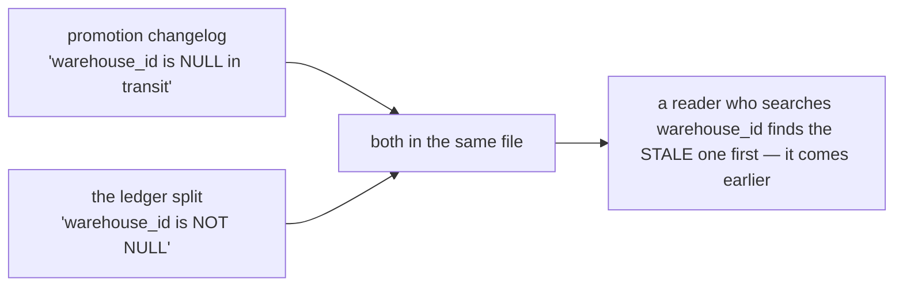

**→ RECOMMEND — a changelog of a decision that later reversed is not history, it is a second copy of the
old answer.** All three retrospective sections are **deleted**, not corrected: their durable guards
already sit beside what they protect (the `NULL`/uniqueness warning on `stock_movements_txn_once`, the
*"not interchangeable"* note on the ownership rule, the `RackDelete` guard in the rules table). **What
stops it recurring:** the same rule that already governs `disscuss/` — *"prune it as points get settled"*
(RULE 8b.9). A section describing *how the doc changed* is the first thing to go stale and the last thing
anyone re-reads.

---

# Question

1. ⚠ **Does anyone ever pull stock BY EXPIRY DATE?** *"Go get the units expiring Friday"* — is that a real
   job someone does at a shelf, or does `expires_on` genuinely only drive a badge? **This is the one
   answer that changes the shape** — see [expiry-loses-its-shelf](#expiry-loses-its-shelf). Everything
   else I can propose around.
2. **Can one rack hold TWO selling teams' units of the same product?** If shelves are owner-segregated in
   practice, [owner-loses-its-shelf](#owner-loses-its-shelf) is not a risk at all and I will delete it.
   If they are mixed, I recommend accepting the exposure rather than fixing it — confirm?
3. **`stock_batch_levels` as a separate 1:1 table, or columns on `stock_batches`?** I argue separate —
   *the row you LOCK should not be the row you FROZE* — at the cost of a tenth table. Your call.
4. **The `CHECK`-vs-[kind-mirrors-the-proto-enum](#kind-mirrors-the-proto-enum) trade-off comes up twice**
   ([3](#recount-minus-has-no-home) and [6](#kind-is-unconstrained-per-table)). Is hardcoding an enum
   number in a constraint ever acceptable, or is that rule absolute? It wants one answer, not two.
