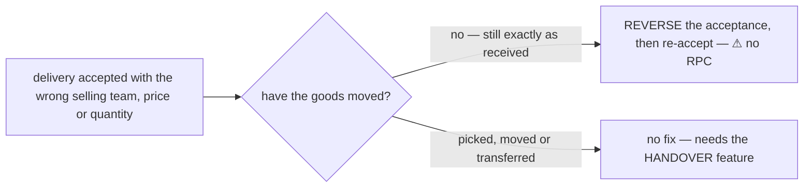
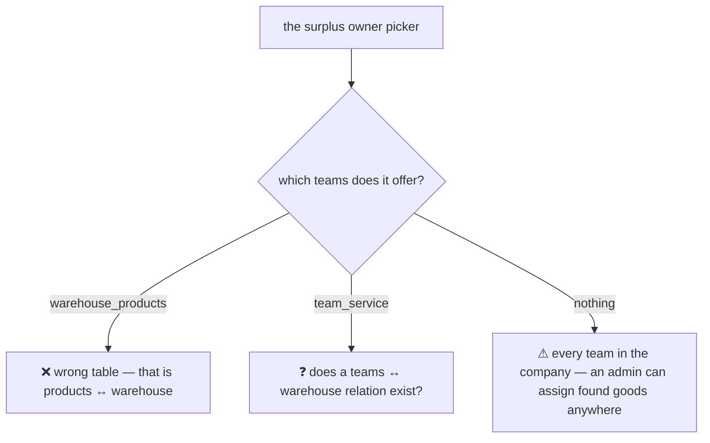
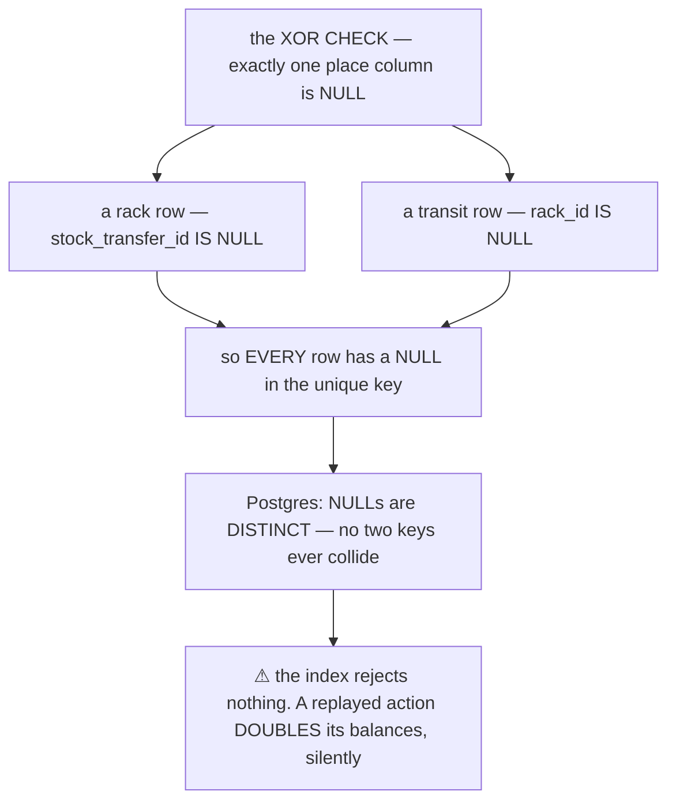
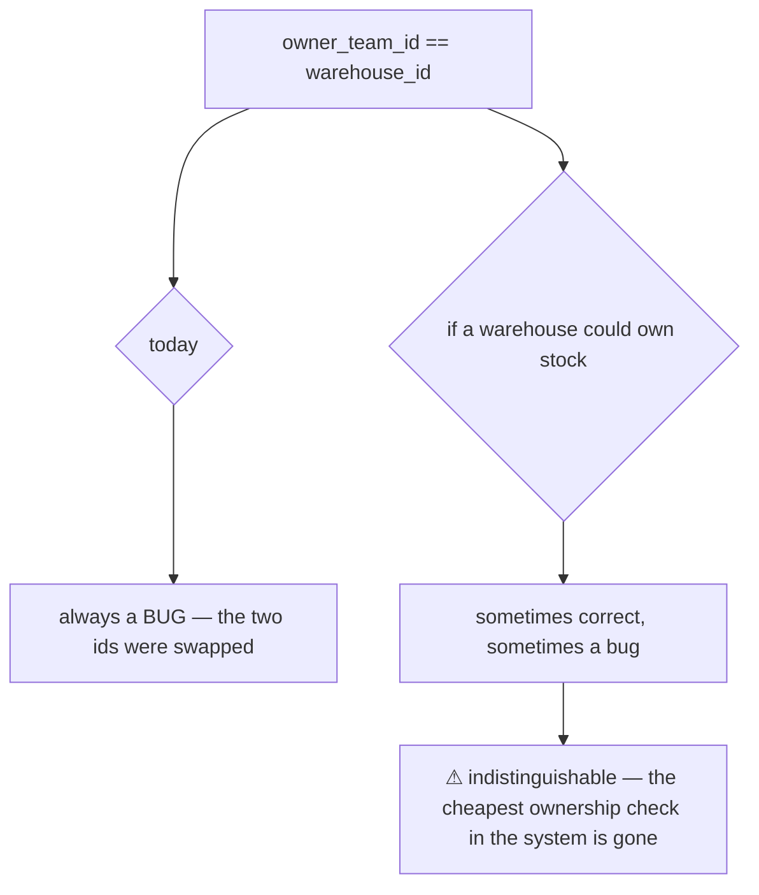
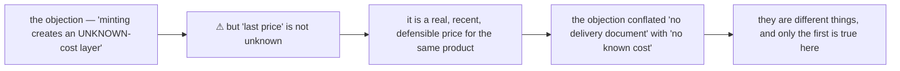
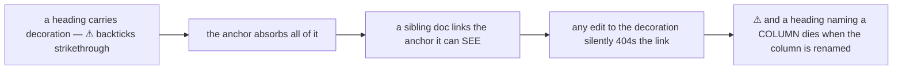

# Stock schema — the open items, and the contradiction record

> ⚠ **`disscuss/` is NOT final.** Mid-argument. Do not build from this.

The schema is **final** and lives at
[guidelines/architectures/database/stock_design.md](../../../guidelines/architectures/database/stock_design.md).
Two rounds have been promoted into it and **deleted from here** (HARD RULE 7b):

| Promoted 2026-08-05 | |
| --- | --- |
| [the-claim-pool](../../../guidelines/architectures/database/stock_design.md#the-claim-pool) | found goods — `lost_claimable`, [a-find-is-the-only-drain](../../../guidelines/architectures/database/stock_design.md#a-find-is-the-only-drain), [the-remainder-mints-at-last-price](../../../guidelines/architectures/database/stock_design.md#the-remainder-mints-at-last-price), [the-owner-is-named-by-a-person](../../../guidelines/architectures/database/stock_design.md#the-owner-is-named-by-a-person) |
| [the-ledger-is-two-tables](../../../guidelines/architectures/database/stock_design.md#the-ledger-is-two-tables) | no nullable place column — `stock_movements` + `stock_transit_movements`, one shared sequence |

⏸ **Nothing here is awaiting a decision.** Every item is **parked** — deferred by the owner, with its
reasoning kept so it can be picked up without re-deriving it. Everything below `# Contradiction` is the
**record**, kept because HARD RULE 11 requires it.

---

## ⏸ `RestockAcceptReverse` — an undo that is claimed but not built

The guideline says a mis-keyed delivery is fixed by **reversing the acceptance and re-accepting**.
`reverses_transaction_id` is the general undo link, so the schema supports it — ⚠ **but no RPC has ever
been specified for it**, so the stated fix is unreachable and ownership errors are permanent in practice.

**What it would do.** One `inventory_transaction` whose `reverses_transaction_id` names the acceptance,
carrying a negative `RECEIVE` line for every line the acceptance wrote — the batch stays, its balance
returns to zero, and the ledger reads forwards as *"received, then un-received"*.

| | |
| --- | --- |
| **why not delete the batch** | the ledger is append-only. A batch that existed for an hour is a fact, and `ON DELETE RESTRICT` is there to stop exactly that shortcut |
| **the precondition** | ⚠ *"no movement on any of the acceptance's batches other than its own `RECEIVE` rows"* — checkable in one SQL predicate, so the fix stops being a claim about discipline |
| **why not a generic `TransactionReverse`** | reversal means something different per kind. A transfer's undo is a cancel with its own leg, a pick's undo is a return. One RPC per reversible action, each with its own precondition |
| ⚠ **what it does NOT cover** | anything already picked or transferred. That is the handover, and it does not exist |

⏸ **DEFERRED (owner, 2026-08-05).** ⚠ The accepted cost: until it is built, the guideline states a
correction path that cannot be taken, so an acceptance keyed to the wrong selling team is **permanent** —
the design says otherwise and the system does not agree with it.

## ⏸ The team picker has no scope to draw on

[the-owner-is-named-by-a-person](../../../guidelines/architectures/database/stock_design.md#the-owner-is-named-by-a-person)
says the picker should offer *"the selling teams that trade in this warehouse"* — ⚠ **and I do not know
that this relation exists.**

⏸ **DEFERRED (owner, 2026-08-05).** ⚠ It has to be answered **before the picker is built**, not before the
schema ships — but it is not cosmetic: an unscoped picker is the only control on a screen that creates
stock out of a count.

## ⏸ Also parked

| | |
| --- | --- |
| **the stocktake REVIEW screen** | where the team select actually lives. ✅ *"We design later"* (owner) — [stocktake](../stocktake.md#a-surplus-line-fails-alone) holds the requirement (`surplus_owner_team_id`, frozen on the line) |
| **a HANDOVER between selling teams** | team 7 genuinely selling stock to team 9. Its own movement kind, screen and money question — **a feature, not a gap**, and the reason ownership can be frozen without that being a trap |
| **the mirror into `docs/database-schema.md`** | HARD RULE 3 requires it. Nothing to mirror until the first migration exists |
| **three behaviour rules sitting in the schema guideline** | found goods, a cancel's return, and *"a keying error is fixed by reversing the acceptance"*. ⚠ **They cannot move yet** — `batch_selection` and `stock_movement_log` are still in `disscuss/`, so moving a settled rule there would DEMOTE it |

---

# Contradiction

## the-retry-guard-never-fired

Found while the owner was reviewing *"Why not the obvious thing"*. **One cause, two symptoms** — and the
cause had been written down as a *virtue*.

| Site | Said |
| --- | --- |
| the guideline, "Why not the obvious thing" §2 | *"`rack_id` NULLABLE, and `warehouse_id` too … a `NULL` rack means **in transit**, which is a KNOWN place"* — defended as correct |
| the same file, index comment | *"retry safety: a replayed action cannot write its lines twice"* |

**Both cannot be true.** The `XOR CHECK` guarantees **every** row carries a NULL in one of the two place
columns, and Postgres treats NULLs as **distinct** in a unique index — so the key can never collide and
the index rejects nothing. Not just transit rows: *every* row.

⚠ **And the second symptom was already recorded elsewhere as a fixed bug:**
[stock_movement_log](../stock_movement_log.md) lists *"`IS NOT DISTINCT FROM` in every lock and read —
`rack_id = NULL` is never true in SQL, so a plain `=` silently found nothing and reported phantom
'insufficient stock'."* Same column, same property of NULL, treated as a query-writing habit rather than
as evidence against the column.

→ **RESOLVED by [the-ledger-is-two-tables](../../../guidelines/architectures/database/stock_design.md#the-ledger-is-two-tables)**
(owner) — two `NOT NULL` tables sharing one sequence. The unique indexes now have no nullable column, the
`XOR CHECK` is gone because "neither, or both" stopped being expressible, and `IS NOT DISTINCT FROM` is
needed nowhere.

→ **What stops it recurring:** ⚠ **"Why not the obvious thing" is a defence, and a defence can be wrong.**
That section justified the nullable columns on the grounds that a `NULL` rack is *unambiguous* — which is
true, and irrelevant. The cost of `NULL` was never ambiguity; it is that **`NULL` breaks equality and
uniqueness**. When defending a nullable column, argue about `=` and `UNIQUE`, not about meaning. And when
the same property has already produced one recorded bug, that is evidence, not a footnote.

## a-warehouse-cannot-own-stock

Found while settling who owns a minted batch. **One cause, one site — caught before it landed.**

| Site | Says |
| --- | --- |
| the guideline's rules table | *"`owner_team_id` is a **selling team** … They are both `team_service` ids and they are **not interchangeable**"* |
| the decision, as first stated | *"the **warehouse** can mint the batch"* — i.e. put a warehouse team's id in `owner_team_id` |

⚠ **The damage would not have been the wrong value — it would have been the LOST SIGNAL.**
`owner_team_id == warehouse_id` is today a reliable smell that the two ids were swapped by accident. Make
it legitimate for one case and the check stops working everywhere.

→ **RESOLVED by [the-owner-is-named-by-a-person](../../../guidelines/architectures/database/stock_design.md#the-owner-is-named-by-a-person)** (owner) —
and resolved **better than the fix I proposed**. I reached for a *house selling team per warehouse*, which
keeps the rule unbent but adds a team row, a `team_service` creation hook and a lifecycle to maintain. The
owner's flow removes the problem instead of accommodating it: **a warehouse person selects the selling
team before anything is written**, so no batch is ever ownerless and there is nothing for a placeholder to
hold.

→ **What stops it recurring:** the question *"what value goes in this column?"* is shaped like a schema
question, so it got a schema answer. It was a **flow** question — and the flow already had a person
standing at the exact point where the answer is known. ⚠ Also: when a rule says two things are *"not
interchangeable"*, an exception does not merely bend the rule — **it disables every check built on it.**

## the-remainder-reversal

⚠ **`the-remainder-cannot-exist` was reversed by the owner on 2026-08-05.** The verdict is now
[the-remainder-mints-at-last-price](../../../guidelines/architectures/database/stock_design.md#the-remainder-mints-at-last-price).
HARD RULE 12 requires the rename and this record — a name carries its verdict, so a reversed name must not
stay in circulation.

**The original contradiction was real and is worth keeping.** Two sites disagreed:

| Site | Said |
| --- | --- |
| the guideline's rules table | *"**No prior loss → refused**: the goods arrived, so they enter by restock. **Stock cannot be conjured by counting**"* |
| the found-goods design, as it then stood | *"the remainder's batch — use the last price batch. Does it **join** that batch or **mint** a new one?"* |

**It was resolved the wrong way.** The refusal was chosen on the argument that minting *"re-creates the
stray unknown-cost layer the rule exists to avoid."*

→ **What was actually wrong with the refusal:** it left physical units unenterable in one action, and it
assumed a screen could preview the pool — which
[a blind count cannot](../stocktake.md#the-preview-does-not-survive-a-blind-count).

✅ **The guideline has been updated.** Both false sentences are gone, and the update is recorded in
[the found-goods update](../../../guidelines/architectures/database/stock_design.md#the-found-goods-update--2026-08-05).

→ **What stops it recurring:** the refusal was argued from a *property of the stock* — unknown cost — that
the proposal did not actually have. **Check that the objection describes the option in front of you, not a
neighbouring one.**

## decorated-headings-rot-anchors

Found while renaming `recoverable` → `claimable`. **One cause, four sites.** HARD RULE 12 says *"the
heading IS the name — alone, unpunctuated"*, and four headings here had been written with decoration:

| Was | Anchor it actually produced |
| --- | --- |
| `### ⚠ the-cost — a counter change is invisible…` | `#-the-cost--a-counter-change-is-invisible-to-the-ledger` |
| ``#### ⚠ What drains `lost_recoverable` `` | `#-what-drains-lost_recoverable` — **and it embedded the column name**, so renaming the column broke the link |
| ``#### ⚠ `broken_recoverable` — which of two things?`` | `#-broken_recoverable--which-of-two-things` — same |
| `### ~~the-pool-is-warehouse-wide~~ — ✅ still true…` | struck through by an earlier edit, so `#the-pool-is-warehouse-wide` **already 404'd** |

⚠ **[stocktake.md](../stocktake.md) linked four of these**, so a doc written against them pointed at
anchors that no longer resolved — invisible in review, because the markdown renders fine either way.

→ **All four were renamed to bare kebab-case, and every reference repointed.** ⚠ All four have **since
been deleted outright** — two questions got answered, two sections moved to the guideline — which is the
point: a question-shaped heading is a poor address, because a settled question leaves a dead one behind.

→ **What stops it recurring:** ⚠ **never put a column or table name in a heading.** A heading is a stable
address, and a schema name is the thing most likely to change — those two properties are in direct
conflict. Put the identifier in the body, where a rename is a find-and-replace rather than a broken link.

## ordinals-are-still-in-use

⚠ Not fixed, recorded so it is not re-entrenched. [HARD RULE 12](../../../CLAUDE.md) requires named,
linked decisions — but the sibling behaviour docs are numbered `P1…P23` throughout, and **`P7` already
means two different things** across `batch_selection.md` and `stock_movement_log.md`. Renaming is its own
pass over those two docs.

⚠ **Those docs also now DRIFT from the promoted schema** — `stock_movement_log.md` still diagrams a single
`stock_movements` with a nullable `rack_id`. The guideline is authoritative; that doc has not been
rewritten, and should be when it is next opened.

---

## Question

**None.** Everything is either promoted to the guideline or parked above.

⚠ **Two parked items are DEBTS the guideline has already taken on**, so they are worth naming when the
next stock work starts:

| | What the guideline claims today |
| --- | --- |
| `RestockAcceptReverse` | *"a keying error is fixed by reversing the acceptance and redoing it"* — no RPC does this |
| the picker scope | *"the selling teams that trade in this warehouse"* — no known relation supplies that list |

Neither blocks the first migration. Both make an authoritative doc describe something the system does not
yet do, which is the failure mode HARD RULE 11 exists to keep visible.
