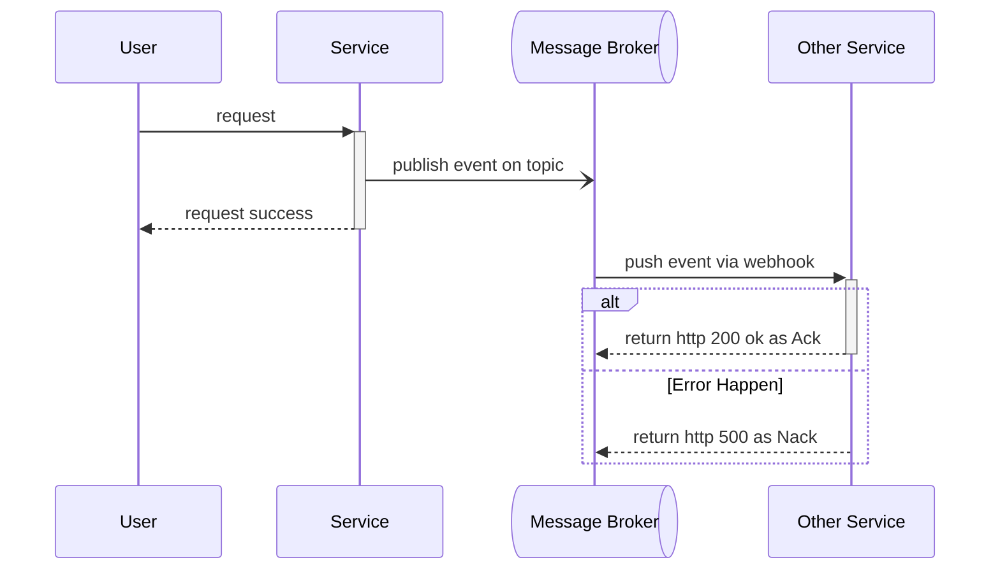
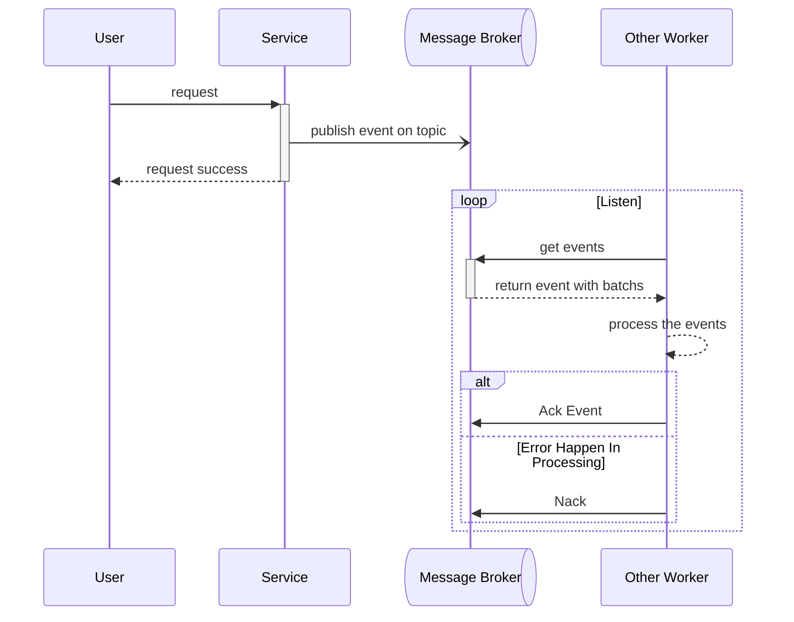

# Event Library Architecture.

## General Brief.
1. Responsbility Scope of this libary is :
    - every service can use same interface to send event to message broker.
    - provide framework that cover how each service listen/receive event.

2. How we receive event is have 2 implementation.
    - http push event.
    - pull event.

3. Message Broker are supported is:
    - Google Pub/Sub
    - local sqlite **(intended for mocking in development)**

4. We create reused library that can use accross service that named `san_event` at `pkgs/san_event`


## Http Push Event.
1. For malformed event is send to [deadletter](#dead-letter).
2. Every service must obey this rule:
    - every service must have one webhook for one topic. 



## Pull Event Flow
1. For malformed event, event is send to [deadletter](#dead-letter).




## How Each Service Send Event
1. we have interface:
    ```go

    type EventSender func(ctx context.Context, evt Event) error

    ```
    and every message broker have own implementation of that.
    ```go
    func NewPubsubEventSender(client *PubsubClient) EventSender {
      ....
    }

    func NewRabbitMqEventSender(client *RabbitmqCLient) EventSender { // defer this implementation
      ....
    }

    ```
  2. when we call `EventSender` its delivery guaranteed, its message broker responsible. we don't mind of that.


## Dead Letter
1. we have 1 reserved topic that name `deadletter`
2. what event become deadletter is:
    - parsing error

3. in library we have stadarize how we send event to deadletter.
    ```go

    type MarkAsDeadletter func(ctx context.Context, evt Event) error

    ```
    and every message broker have own implementation of that.
    ```go
    func NewPubsubMarkAsDeadletter(client *PubsubClient) MarkAsDeadletter {
      ....
    }

    func NewRabbitMqMarkAsDeadletter(client *RabbitmqCLient) MarkAsDeadletter { // defer this implementation
      ....
    }

    ```


## Event Schema Proto & Structure.
1. we must have option proto
    ```proto
    message EventOption {
      string topic = 1
    }
    extend google.protobuf.MessageOptions {
      EventOption san_event = 50099;
    }

    ```
    so its can registered in custom event. And when we send event, no need define topic again. just get from proto.

2. because event rely on proto message, each dev must follow this rule:
    - don't rename field proto.
    - don't doing renumbered field proto.

3. we have project unified event schema that helping for easy parsing.
    ```proto

    message RestockCreate {
      ...
    }

    message RestockAccept {
      ...
    }

    message DataEvent {
      option (san_event.topic) = "selling-topic";
      google.protobuf.Timestamp occured_at = 1
      oneof data {
        RestockCreate restock_create = 2
        RestockAccept restock_accept = 3
        ... and other 
      }

    }

    ```


## How Each Service Register Pull Event Worker Function.
- incomplete, still thinking


## Pub/Sub Push (Http Push) implementation.
1. because Pub/Sub have own event structure. we need to wrap our event on that.


# Every Service Rule.
## How Each Service Register Http Push Event Webhook.


1. Every 
  ```go
  type [ServiceName]PushHttpHandler http.HandlerFunc

  func New[ServiceName]PushHttpHandler(topic string, handler [ServiceName]PushHandler) [ServiceName]PushHttpHandler {
    return [ServiceName]PushHttpHandler(event_source.NewMuxPushhandler(event_source.PushHandler(handler)))
  }

  ```