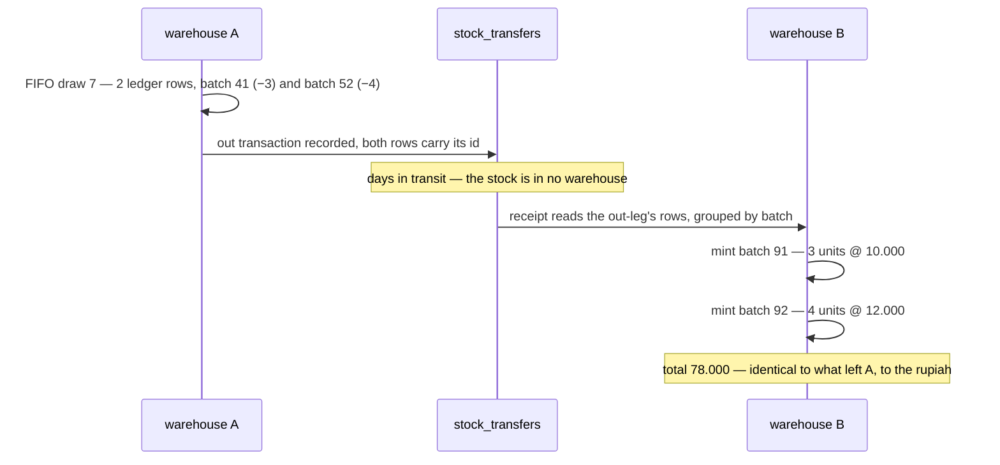
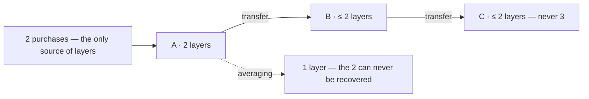
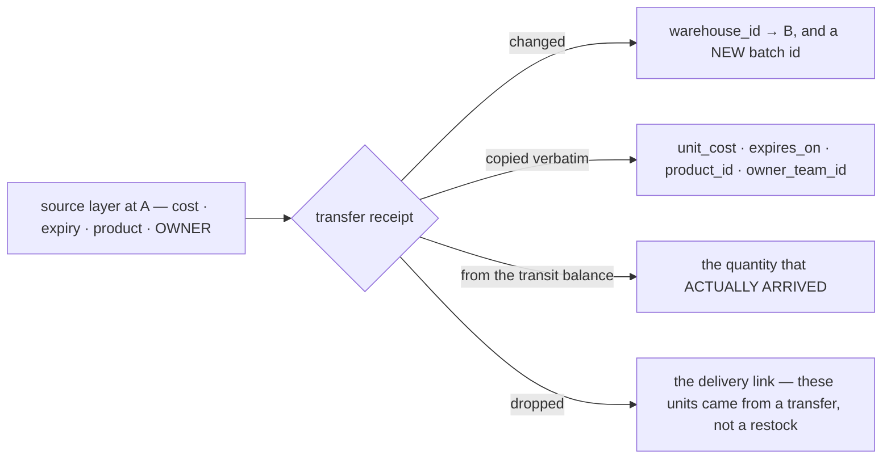
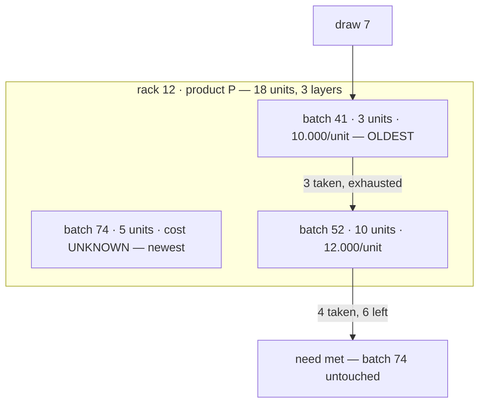
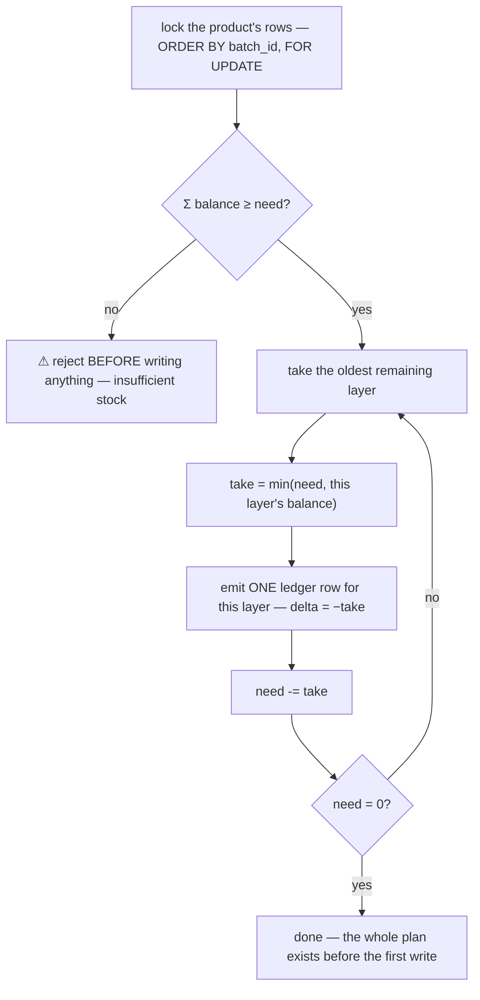
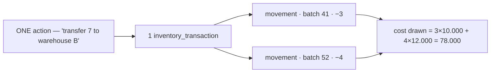
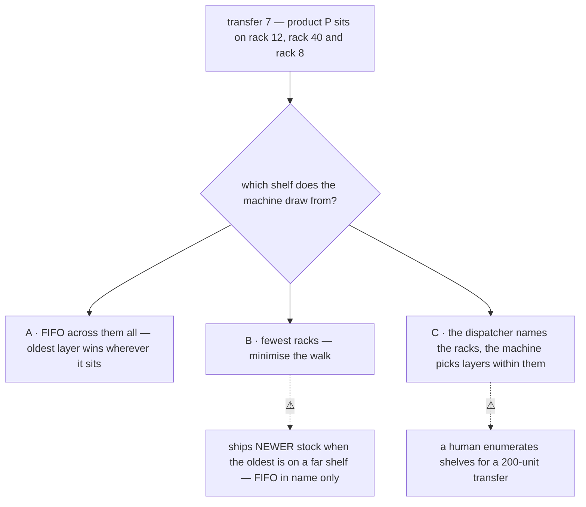
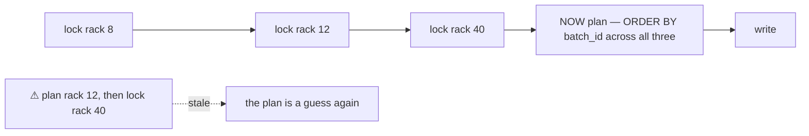
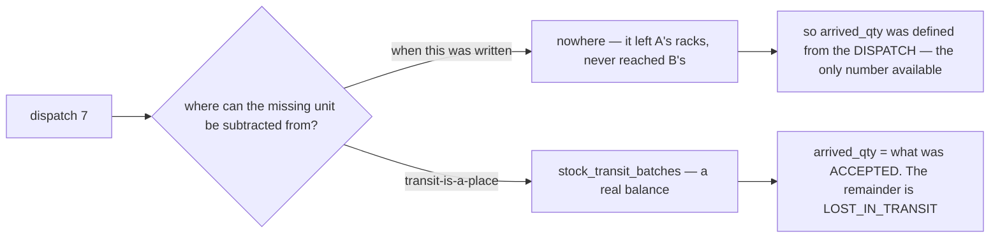
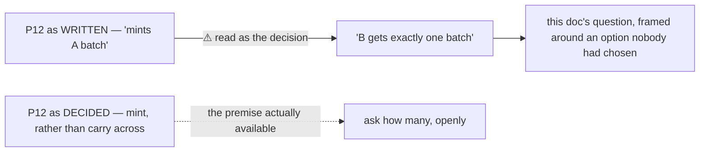

# FIFO — how a draw takes stock

> ⚠ **GRAIN CHANGED — [ledger-splits-by-question](database/stock_design.md#ledger-splits-by-question) (owner, 2026-08-07).**
> The ledger splits into a **placement** ledger (no `batch_id`) and a **batch** ledger (no `rack_id`), so
> `(rack, batch)` is no longer a grain. **Rules below phrased in those terms are superseded** — see
> [the-cross-product-grain-was-assumed-everywhere](database/stock_design.md#the-cross-product-grain-was-assumed-everywhere).
> This doc is rewritten once the open sub-parts settle, not before.

> ⚠ **`disscuss/` is NOT final.** Mid-argument. Do not build from this.

How the system walks a shelf's cost layers when something is drawn, and what that walk produces.
[batch_selection.md](batch_selection.md) decided **who** chooses a batch; this doc is **how** the machine
chooses when it is the one choosing.

Siblings: [batch_selection.md](batch_selection.md) · [rack_selection.md](rack_selection.md) · [guidelines/…/stock_design.md](database/stock_design.md) ·
[stock_movement_log.md](stock_movement_log.md)

> **Decisions here are NAMED and LINKED, never numbered** (HARD RULE 12) — every mention of
> [mint-per-layer](#mint-per-layer) is a link to the section that decides it, so a reference can be
> **read** instead of looked up. The siblings still use ordinals and are pending the same treatment; see
> [Question](#question).

# Proposal

**Closed by the owner.** Everything outside this section is still argument.

| Decision | |
| --- | --- |
| [mint-per-layer](#mint-per-layer) | **A transfer receipt mints ONE BATCH PER SOURCE LAYER in B** — never one averaged batch. `unit_cost`, `expires_on` and `owner_team_id` copied exactly from the out-leg's ledger rows. ⚠ **Quantity is what was ACCEPTED** — see the amendment |
| [facts-travel](#facts-travel) | **A layer's FACTS travel with it — only `warehouse_id` changes.** A transfer moves goods between buildings. It does not make them younger, cheaper, non-perishable — **or somebody else's** |

## mint-per-layer

**A transfer receipt mints one batch in B per source layer the out-leg drew from.**



**What the receipt inserts.** One `stock_batches` row per distinct `batch_id` in the out-leg, and one
`stock_rack_batches` row per `(new batch, rack)` the receiver names:

| New batch field | Comes from |
| --- | --- |
| `warehouse_id` | **B** — this is the whole point of minting ([stock_movement_log](stock_movement_log.md) P12) |
| `product_id` | the source batch |
| `unit_cost` | ⚠ **copied verbatim, including `nil`.** Never computed |
| `expires_on` | ⚠ **copied verbatim, including `nil`** — see [facts-travel](#facts-travel) |
| `arrived_qty` | ⚠ **AMENDED — what was ACCEPTED, not what was dispatched.** *Was: `−Σ delta` of the out-leg rows for that source batch.* A shortfall now stays behind in `stock_transit_batches` as a `LOST_IN_TRANSIT` ([transit-is-a-place](database/stock_design.md#transit-is-a-place)), so the two numbers differ whenever a truck arrives short |
| `damaged_qty` | **0** — a transfer receipt is not a damage assessment. Damage found on arrival is a `BROKEN` movement afterwards, with its own actor |
| the batch's ORIGIN | `inventory_transaction_id` → the `TRANSFER` transaction. ⚠ **Not `restock_request_item_id`** — that column is `NOT NULL` today and would have blocked every non-delivery batch |
| `accepted_at` | the moment of receipt in B |
| `accepted_by` / `created_by` | ⚠ **open — see below** |

⚠ **`created_by` / `accepted_by` have no obvious answer on a minted batch.** On a delivery they are two
different people — whoever raised the restock, and whoever accepted it. A transfer has **two people in
two buildings, days apart**: A's dispatcher and B's receiver.

| | | |
| --- | --- | --- |
| A · `created_by` = A's dispatcher, `accepted_by` = B's receiver | mirrors the delivery meaning — one person caused the units to exist here, another confirmed them | ⚠ `created_by` points at a user in **another warehouse**, which no other batch does |
| B · both = B's receiver | every id on B's batch is a B person | loses who sent it — recoverable only through the transaction |
| C · both **0** (unknown), origin via the transaction | ✅ honest. The batch was minted by the *system* on receipt, and the two humans are on the two `inventory_transaction` rows, where they belong | a batch list showing "accepted by" is blank for transfers |

**→ Recommend C.** `created_by` / `accepted_by` answer *"who did the paperwork on this batch"*, and for a
minted batch **nobody did** — the machine created it from a rule. The two real actors are already
recorded, once each, on the transaction that dispatched and the transaction that received. Copying them
onto the batch is denormalising an answer that would then have two homes.

### Why not one averaged batch

Two facts about the column, and neither is a matter of taste:

| | |
| --- | --- |
| ⚠ **the money does not divide** | `unit_cost` is `*int64`, **whole rupiah**. 78.000 for 7 units rounds to 78.001 (invented) or 77.994 (destroyed). Exact is impossible |
| ⚠ **`nil` has no average** | `nil` means UNKNOWN, never 0 (#74). Averaging a draw spanning a known and an unknown layer must either invent a discount on the known units or destroy their cost entirely. **One `*int64` cannot hold *"12 units at a known cost and 1 unknown"*** |

✅ **And it cannot explode.** A transfer never *creates* a layer — the batches minted at B equal the
layers drawn at A, bounded by the purchases those units descend from. Averaging does not bound the count;
it **destroys** layers, irreversibly.



The real cost is **(k − 1) extra rows per transfer**, k = layers spanned. A transfer that fits inside the
oldest layer mints exactly one batch — the common case, identical either way.

### Two consequences worth stating

⚠ **The receipt is NOT writable from the transfer document alone.** It must read the out-leg's ledger rows
— a join on `inventory_transaction_id`, which [stock_movement_log](stock_movement_log.md) P11 already made
the grouping key — because only those rows know which layers were drawn. `TransferReceive` (P23) must be
specified with that read in it.

⚠ **A short receipt apportions PRO-RATA, not FIFO.** 7 dispatched, 6 arrive: nobody knows which unit was
lost in transit, which is exactly [batch_selection](batch_selection.md) P3's case. The shortfall spreads
across the drawn layers by largest-remainder. No new rule — and averaging has the same shortfall while
being unable to say which layer it came from.

✅ **And the shortfall now has somewhere to BE.** When this was written the missing unit had no place to
be subtracted from — it had left A's racks and never reached B's, and a movement needs a place.
[transit-is-a-place](database/stock_design.md#transit-is-a-place) gives it one: the apportioned remainder
stays in `stock_transit_batches` and is written off as `LOST_IN_TRANSIT`, against **the source layer at
its own price**. The pro-rata rule above is unchanged — it just decrements something real now.

✅ **Schema impact: none.** `stock_batches` already holds `(warehouse_id, product_id, unit_cost,
expires_on, arrived_qty)`, and the ledger already names its batch per row. This is a rule about **how many
rows the receipt inserts**, not a new column.

## facts-travel

**A layer's facts travel with it. Only `warehouse_id` changes.**



⚠ **`expires_on` is the sharper half.** An averaged cost is wrong by rupiah — a dropped expiry is wrong
by *kind*. The "expiring" badge ([batch_selection](batch_selection.md) P4) is the only control the
warehouse has over perishables and it reads this column, so crossing a building must not silently switch
it off.

⚠ **`owner_team_id` joins the list** ([ownership-is-copied](database/stock_design.md#ownership-is-copied)).
**A transfer is a warehouse operation, not a sale** — the goods are moved between buildings by warehouse
staff, and the **selling team that owns them does not change.** Dropping it would hand B's warehouse team
ownership of another division's stock, which is
[the category error](database/stock_design.md#ownership-is-a-selling-team) written
into every transferred batch.

**Inherited, and not reopened here:**

| From | |
| --- | --- |
| [batch_selection](batch_selection.md) P3 | a **loss** is pro-rata, not FIFO — FIFO is for a *deliberate* draw |
| [batch_selection](batch_selection.md) P4 | FIFO is `ORDER BY batch_id`, nothing else. `expires_on` does not enter selection |
| [batch_selection](batch_selection.md) P7 | a transfer's out-leg is FIFO, not scanned |
| [stock_movement_log](stock_movement_log.md) P7 | rows are locked `ORDER BY batch_id`, racks ascending, and the plan is made under the lock |

---

## The shelf is a stack of layers

One product on one rack is not a number. It is **N cost layers**, oldest at the bottom:



## The walk



✅ **The sufficiency check comes first.** [stock_movement_log](stock_movement_log.md) P7 holds the lock, so
`Σ balance` is a fact rather than a guess — an over-draw is refused before a single row is appended, not
half-written and rolled back.

```sql
-- the read that FIFO orders. ORDER BY is the whole algorithm.
SELECT id, rack_id, batch_id, balance
  FROM stock_rack_batches
 WHERE warehouse_id = :w AND product_id = :p AND rack_id = ANY(:racks)
   AND balance > 0
 ORDER BY batch_id
   FOR UPDATE;
```

⚠ **`ORDER BY batch_id` is doing two jobs** — it is the FIFO order *and* the canonical lock order that
prevents deadlock. They must stay the same expression: sorting FIFO by anything else (an `arrived_at`, an
`expires_on`) would silently reintroduce the deadlock that ordering closed.

## One action → N ledger rows

**This is the property everything else follows from.** A draw of 7 is not one movement:

| | batch | delta | after_balance |
| --- | --- | --- | --- |
| row 1 | 41 | **−3** | 0 |
| row 2 | 52 | **−4** | 6 |

Both rows carry the **same `inventory_transaction_id`** — that is what makes them one action. The ledger
records layers, the transaction records the intent.



## What FIFO is NOT

| | | Why not |
| --- | --- | --- |
| ❌ the rule for a **loss** | `LOST` · `RECOUNT` down are **pro-rata** | FIFO systematically over-blames the oldest layer for units nobody saw go |
| ❌ the rule for an **order pick** | the picker **scans** | FIFO is the suggestion, the scan is the record |
| ❌ sorted by **expiry** | `ORDER BY batch_id`, nothing else | expiry is a human warning, and a second sort key breaks the lock order |

---

## Proposed — still open

| Decision | Proposed |
| --- | --- |
| [one-row-per-layer](#one-row-per-layer) | A FIFO draw takes `min(need, balance)` per layer oldest-first and emits **one ledger row per layer**, all under the lock, sufficiency checked before the first write |
| [rack-order](#rack-order) | ⚠ **A machine-decided draw spans racks, ordered by `batch_id`** — the rack falls out of the layer choice, it does not constrain it. **Nothing decides this today.** ⚠ **MOVED to [rack_selection.md](rack_selection.md)** — the owner's auto-placement feature turned this into a whole question. Deleted from here once [fifo-then-consolidate](rack_selection.md#fifo-then-consolidate) is closed |
| [no-cost-sorting](#no-cost-sorting) | An unknown-cost batch is **not** sorted last — `ORDER BY batch_id`, nothing else |
| [return-reads-the-ledger](#return-reads-the-ledger) | A `RETURN` does **not** walk FIFO — it reverses the *exact* batches the original pick took, read via `reverses_transaction_id` |

## one-row-per-layer

The walk above, stated as a rule: **one ledger row per layer touched**, planned entirely under the lock
before anything is written. Not a new choice — it is what [The walk](#the-walk) and
[One action → N ledger rows](#one-action--n-ledger-rows) already describe, and nobody has said it out loud.

## rack-order

⚠ **Nothing in any doc decides which RACK a machine-decided draw pulls from.** The plan-per-kind table
says only *"A's shelves"*. That was harmless while every draw was human-decided — and
[batch_selection](batch_selection.md) P7 made the transfer out-leg machine-decided without anyone noticing
this followed.



**→ Recommend A.** A rack is an **address, not a fact about age**. Drawing from the near shelf because it
is near means shipping newer stock, which is the exact thing FIFO exists to prevent — so the walking cost
is a **pick-path** problem (order the resulting list by rack code so the walk is sensible), not a reason
to change which units are drawn.

⚠ **A carries one hard constraint on the write protocol.** If a draw spans racks, **every rack must be
locked first — ascending by rack id — and only then is the plan computed across them.** Plan-then-lock
would read rack 12, lock rack 40, and find it changed.



✅ **The selection order and the lock order are different things, and both survive.** Racks are locked
ascending by **rack id** (deadlock); layers are then chosen ascending by **batch_id** (FIFO). They never
conflict, because all the locking finishes before any planning starts.

## no-cost-sorting

An unknown-cost (`nil`) batch is drawn in its turn like any other. **The reason to sort it last was to
keep it out of an average** — and [mint-per-layer](#mint-per-layer) removed the average, so a `nil` layer
now stays `nil` on exactly the units it applied to. A second sort key would also break the lock ordering
described in [The walk](#the-walk).

## return-reads-the-ledger

A `RETURN` reverses the **exact** batches the original pick took, read from the ledger via
`reverses_transaction_id`. It does not walk FIFO — the batches are already a matter of record, and
recomputing them would replace a fact with a guess.

---

# Contradiction

Per HARD RULE 11. **Two.**

## 2 · `arrived_qty` was defined from the DISPATCH, because nowhere else could hold a shortfall

**Example.** [mint-per-layer](#mint-per-layer) sets a minted batch's `arrived_qty` to *"`−Σ delta` of the
out-leg rows"* — **what left A** — while the section two headings below says a short receipt is real:
*"7 dispatched, 6 arrive."* **Both cannot be true**: B's batch would claim 7 units with 6 on the shelf,
and [P17](stock_movement_log.md)'s `arrived = ready + used + …` invariant fails on every short receipt.



→ **RECOMMEND.** Amended above. **The cause is worth naming: a value was defined from the wrong end
because the right end had no table.** Not a slip — the design genuinely had no place to hold in-transit
stock, so the definition bent around the gap. **What stops it recurring: when a definition reaches for a
number from the far side of a process, ask whether the near side simply has nowhere to store one.**

## 1 · mint-per-layer made eleven sites in the ledger doc stale

**Example.** [stock_movement_log](stock_movement_log.md) P12 was written as *"mints **a** new batch"* and
its plan-table row as *"the system mints **one** in B"*. **P12 answered "mint or carry across?" — it never
answered "how many?"** I then framed this doc's question *from* that singular, presenting one averaged
batch as the incumbent option.

**→ Recommend.** Recorded in full as
[stock_movement_log § Contradiction 2](stock_movement_log.md#2--an-incidental-detail-of-the-writing-was-read-as-part-of-the-decision--twice),
because the *cause* lives there and has now happened twice: **an incidental detail of the writing read as
part of the decision.** All eleven sites are fixed.



---

## Withdrawn

| I had proposed | Why it went |
| --- | --- |
| **one averaged batch at B** | I argued nobody asks *"what did this delivery cost"* after a transfer. **The wrong test** — the question is not whether anyone asks, it is whether the field can hold the answer. `unit_cost *int64` cannot represent a mixed known/unknown draw at all, in any rounding |

## Question

1. **[one-row-per-layer](#one-row-per-layer), [rack-order](#rack-order),
   [no-cost-sorting](#no-cost-sorting), [return-reads-the-ledger](#return-reads-the-ledger) — confirm?**
   [rack-order](#rack-order) is the only genuinely new choice; the other three are consequences of
   decisions already closed that nobody has said out loud.
2. **Do the siblings get converted to named-and-linked decisions too?** HARD RULE 12 says they should.
   `stock_movement_log.md` has P1–P23 with ~200 references and `batch_selection.md` has P1–P7 — a large
   mechanical sweep with no design content, so it is worth scheduling deliberately rather than drifting
   into two conventions. ⚠ Until it happens, cross-doc references from here can only link to the **file**,
   not the decision, because the siblings' headings are not anchorable by name.
