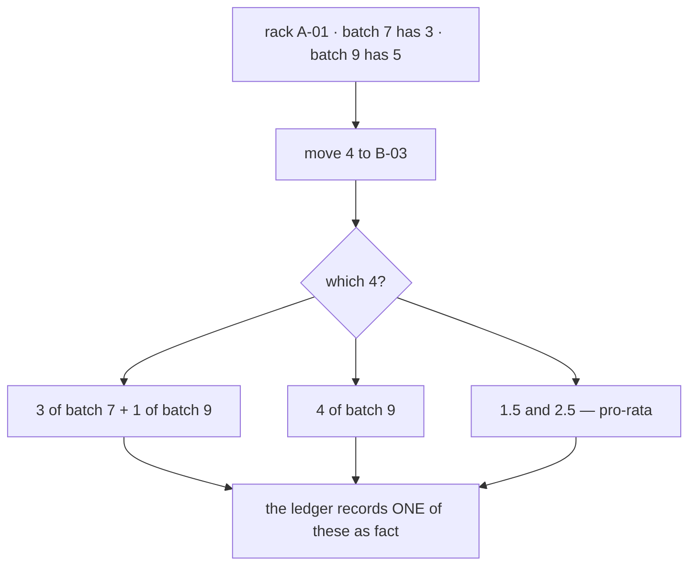
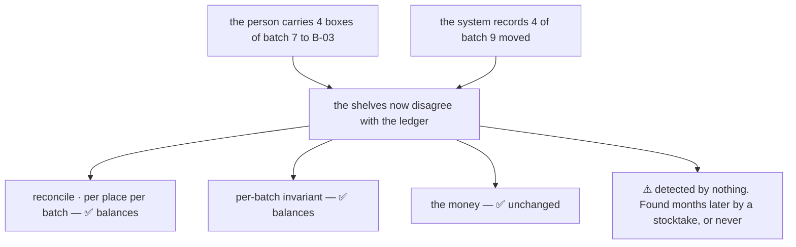
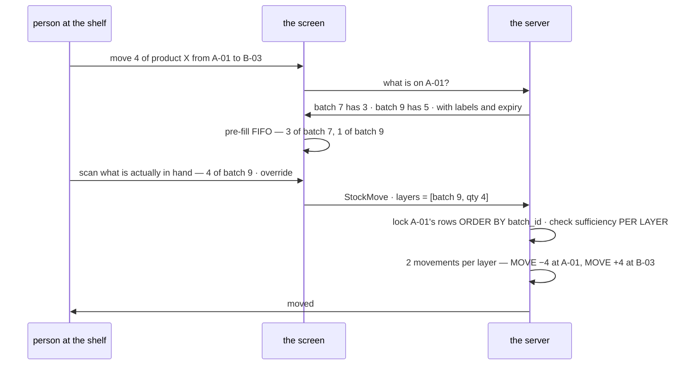
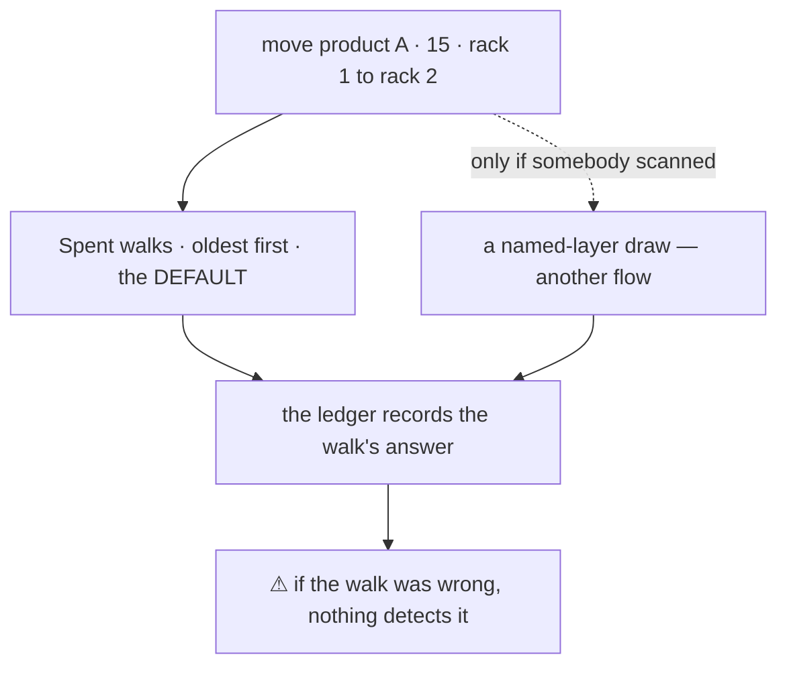
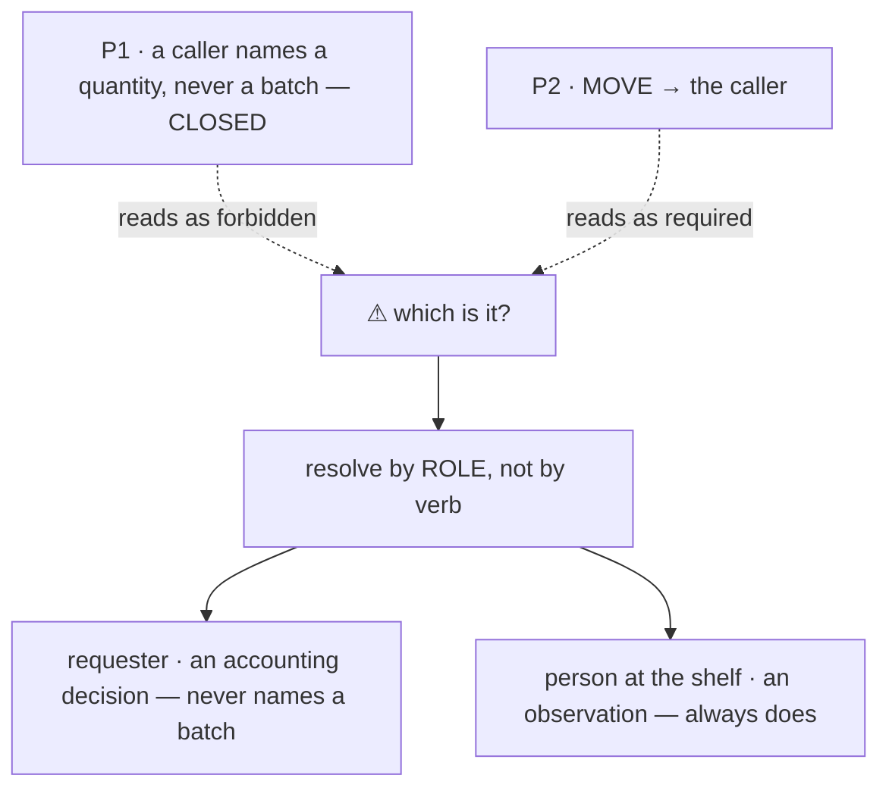

# Which layers a move takes

> ⚠ **`disscuss/` — NOT final.** Nothing here is decided.
>
> Subtopic of [batch_selection](batch_selection.md) — its **P2** row for `MOVE` says *"the caller"* in four
> words, and that is a whole algorithm. Siblings: [fifo](fifo.md) (how a draw walks) ·
> [rack_selection](rack_selection.md) (which rack) · [restock_reversal](restock_reversal.md) (which leans on
> `MOVE` being able to fix a mis-placement).

**Nothing is under `# Proposal` yet.**

---

## The question



**It is an algorithm question, and it is a different algorithm from every other draw** — because a move is the
one consumption where **getting it wrong costs nothing and shows nowhere.**

## a-wrong-layer-on-a-move-is-invisible

This is the argument the whole doc turns on, so it comes first.

| the draw | pick the wrong layer and… |
| --- | --- |
| an `ORDER` pick | the wrong `unit_cost` reaches COGS. **The money is wrong, and the money is watched** |
| a `LOST` | it is an attribution nobody could have known — [P3](batch_selection.md) makes pro-rata the honest answer |
| a **`MOVE`** | ⚠ **nothing.** No cost changes, no total changes, both `(rack, batch)` rows still equal their logs, every invariant still balances. **The only thing that is wrong is the physical world** — and no check in this system looks there |



**→ Recommend:** because no downstream check can catch it, the batch on a move must be **observed, not
computed** — and where it is computed, the computation must be the one most likely to be physically true, not
the one that is fairest on paper.

## a-move-is-observed-like-a-pick

> ⚠ **CONTESTED by the owner's flow** — [rack_batch_mutation](rack_batch_mutation.md#the-move-flow) has `Spent()`
> walk the shelf and *return* the layers, so the walk is the record and no scan appears. Kept here as the
> argument, with the hybrid in [# Contradiction](#contradiction). Not settled either way.

[P6](batch_selection.md) already solved this shape for a pick: *"a pick is OBSERVED, not computed — the picker
scans the batch label, so FIFO is what the system **suggests** and the scan is what the ledger **records**."*

**A move is the same act.** Somebody is holding the box. The label is in their hand — it is the *only* moment
the layer is knowable for free.

**→ Recommend: apply P6 verbatim to `MOVE`.** The system suggests FIFO-within-the-rack, the scan records what
actually moved. This also dissolves the P1/P2 conflict below: **P1 forbids a *requester* choosing a layer as an
accounting decision. A scan is not a choice, it is an observation** — the same reason P1 and P6 coexist for a
pick.

## layers-are-explicit-in-the-request

> ⚠ **OVERRULED by the owner's flow** for the ordinary move — the request carries a **product and a quantity**,
> and the session walks. The shape below is what a *scanned* override would need, and
> a named-layer draw is [deferred to the adjust / pick flow](rack_batch_mutation.md#a-named-layer-verb-has-no-caller-here).

**→ Recommend:** the request carries the layers, and there is no scalar quantity to be ambiguous about.

```proto
message StockMoveRequest {
  uint64 team_id      = 1;  // the warehouse — use_scope
  uint64 from_rack_id = 2;  // both ends are real racks. There is no unplaced pile
  uint64 to_rack_id   = 3;
  repeated MoveLayer layers = 4;  // at least one
  string reason = 5;
}
message MoveLayer {
  uint64 batch_id = 1;
  int64  quantity = 2;  // > 0
}
```

| | |
| --- | --- |
| **no scalar `quantity`** | a shelf holds several layers, so one number cannot say what moved. `2N` movements for `N` layers, one transaction |
| **one source, one destination** | spreading one shelf across three is `N` calls. A multi-destination move would be making a **rack** decision, which is [rack_selection](rack_selection.md)'s job, not this verb's |
| **`product_id` is not in the request** | ⚠ it is **derivable** from the batch and would otherwise be a second source of truth to disagree with it. Validate that every layer is the same product if the UI needs that, do not take it as input |
| **the destination MERGES** | `(to_rack, batch)` upserts — units join the row already there. No new batch, no cost event, `expires_on` unchanged. A layer split across two shelves is normal and always was |

## fifo-within-the-rack-is-the-suggestion

What the screen pre-fills when the person does not care which layer — and what a caller with no scanner gets.

```sql
-- the layers on THIS shelf, oldest first. Locked in the canonical order, so a move
-- cannot deadlock against a pick or a transfer walking the same product.
SELECT batch_id, balance
  FROM stock_rack_batches
 WHERE rack_id = :from_rack AND product_id = :product AND balance > 0
 ORDER BY batch_id
   FOR UPDATE;
-- then: sufficiency FIRST, then take min(need, balance) per layer, oldest first.
```

Same three rules as [fifo](fifo.md)'s draw: **`ORDER BY batch_id` and nothing else** (it is the FIFO order *and*
the lock order — a second sort key reintroduces the deadlock), **sufficiency checked before the first write**,
**one movement per layer touched**.

⚠ **`ORDER BY batch_id` here is a guess about the shelf, not a cost convention.** On a pick, oldest-first *is*
the accounting rule. On a move there is no accounting question at all — FIFO is chosen only because the oldest
layer is the one nearest the front of the shelf, which makes it the most likely thing a person picked up.

## never-spill-to-another-rack

The named shelf holds 5 and the request says 8.

**→ Recommend: refuse.** Never quietly take the other 3 from B-07. Which shelf goods come off is a **rack**
decision, and a move has exactly one source by construction — spilling would make one request perform a
put-away the person never agreed to, at shelves they are not standing at.

## no-pro-rata-on-a-move

[P3](batch_selection.md) apportions a **loss** across the layers on a shelf, and that is right *there*: nobody
knows whose units went missing, so FIFO would systematically over-blame the oldest layer.

**→ Recommend: never on a move.** *"1.5 of batch 7 and 2.5 of batch 9"* describes a distribution **nobody
performed**, and it rounds. Pro-rata is honest about ignorance when the truth is unknowable — on a move the
truth was standing right there holding the box.

## the-alternative-that-dissolves-it

Worth naming so it is rejected on purpose, not by omission: **one batch per (rack, product)** — then *"move 4"*
is never ambiguous again, and this entire doc disappears.

**→ Recommend: no.** It forces a second shelf every time the same product is restocked, which is rack sprawl in
a warehouse whose shelves are the scarce thing. And it cannot be enforced honestly: found goods rejoin the batch
they were lost from ([the-claim-pool](database/stock_design.md#the-claim-pool)),
at the rack they were **found** at — so the schema would have to refuse a find, or break its own rule.

---

## Proposed Design



| name | what it decides |
| --- | --- |
| [a-wrong-layer-on-a-move-is-invisible](#a-wrong-layer-on-a-move-is-invisible) | no invariant can catch it, so it must be observed rather than computed |
| [a-move-is-observed-like-a-pick](#a-move-is-observed-like-a-pick) | ⚠ **contested** — [P6](batch_selection.md) applied verbatim would mean FIFO suggests and the scan records. The owner's flow has the walk record |
| [layers-are-explicit-in-the-request](#layers-are-explicit-in-the-request) | ⚠ **overruled** for the ordinary move — product + quantity in, the walk decides. A named layer belongs to the adjust / pick flow, not here |
| [fifo-within-the-rack-is-the-suggestion](#fifo-within-the-rack-is-the-suggestion) | `ORDER BY batch_id` at that rack — a guess about the shelf, not a cost rule |
| [never-spill-to-another-rack](#never-spill-to-another-rack) | short at the named shelf means refuse, never borrow from another |
| [no-pro-rata-on-a-move](#no-pro-rata-on-a-move) | proportional splitting invents a distribution nobody performed |
| [the-alternative-that-dissolves-it](#the-alternative-that-dissolves-it) | one batch per rack is rejected — rack sprawl, and a find would break it |

---

# Contradiction

## this doc wanted the caller to name the layers — the owner's flow computes them

> **this doc:** *"the request carries the layers, and there is no scalar quantity to be ambiguous about"*, because
> [a wrong layer on a move is invisible](#a-wrong-layer-on-a-move-is-invisible) to every check in the system.

> **the owner's flow** ([rack_batch_mutation](rack_batch_mutation.md#the-move-flow)): *"call `Spent()` → walk
> `batch_racks` → return `(batch 1, qty 5), (batch 2, qty 5)`"* — the handler passes a **product and a quantity**,
> and the session decides.

Both cannot be the default. The flow's version is simpler at every call site and needs no scanner.

**→ RECOMMEND — the hybrid, and it costs nothing:** the **walk is the default and the record**
(`Spent(rack, product, qty, kind)`), and a named layer stays reachable through
a **named-layer draw** ([deferred to the adjust / pick flow](rack_batch_mutation.md#a-named-layer-verb-has-no-caller-here)) for the cases that are genuinely observed — `BROKEN`, a
scanned pick, an `UNRECEIVE`. A move then computes unless somebody scanned, and nothing in the API pretends an
observation happened when it did not.

⚠ **What we are buying, stated plainly:** with the walk as the record, a person who carries batch 9's boxes while
the system writes batch 7 leaves **no trace any check can find** — every invariant still balances. That is an
accepted cost, not a solved problem. It shows up as a stocktake surprise months later, or never.



## P1 says a caller never names a batch — P2 says a move's caller does

Both are in [batch_selection](batch_selection.md), and **P1 is inside `# Proposal`, closed by the owner**:

> **P1:** *"**A caller names a quantity, never a batch** — the batch is decided by the picker's scan or by the
> system, never by the requester."*

> **P2, the same doc, one screen down:** `RECEIVE · MOVE · a TRANSFER's in-leg` → *"**the caller** — the batch
> is already known"*.

⚠ **This doc was one message away from building on the wrong one.** *"`batch_selection` already rules this — on
a `MOVE` the batch is the caller's"* was asserted in chat, citing P2, without noticing that the **closed**
decision says the opposite in general terms.

**→ RECOMMEND:** the words are the problem, not the rules. P1's *"caller"* means the **remote requester making
an accounting decision**. P2's *"caller"* means the **person at the shelf reporting what they see**. P6 already
names that difference for a pick — *suggested* vs *recorded* — so:

- **P1 keeps its verdict** and gains P6's exception explicitly: *a caller names a quantity, never a batch —
  except where a batch is OBSERVED, which is a scan and not a decision.*
- **P2's `MOVE` row reads *"the scan"*, not *"the caller"*** — the same words as the `ORDER` row, because it is
  the same act.

What stops it recurring: **a decision table whose cells are role words needs the roles defined once.** *"The
caller"* meant two different people in two rows of one table, and neither row was wrong on its own.



---

## Question

1. **Is a move scanned in practice?** My whole recommendation rests on it. If your people re-shelve without
   scanning anything, then FIFO-within-the-rack stops being a *suggestion* and becomes the record — and
   [a-wrong-layer-on-a-move-is-invisible](#a-wrong-layer-on-a-move-is-invisible) says nothing will ever catch
   the drift. I would still take FIFO over pro-rata, but you should know that is what we are buying.
2. **Do you want *scanned* and *suggested* to be distinguishable on the movement?** A boolean is cheap now and
   impossible to backfill later. Against it: [P6](batch_selection.md) has the same gap for picks and has not
   needed it, and a flag nobody fills honestly is worse than no flag.
3. **Should the move screen show `expires_on` per layer?** It is the one case where the person genuinely should
   override FIFO — moving the *nearest-expiry* layer to the picking face is a real warehouse job, and
   [P4](batch_selection.md) deliberately keeps expiry out of *selection*. Showing it as a badge does not break
   P4. Confirming that reading.
