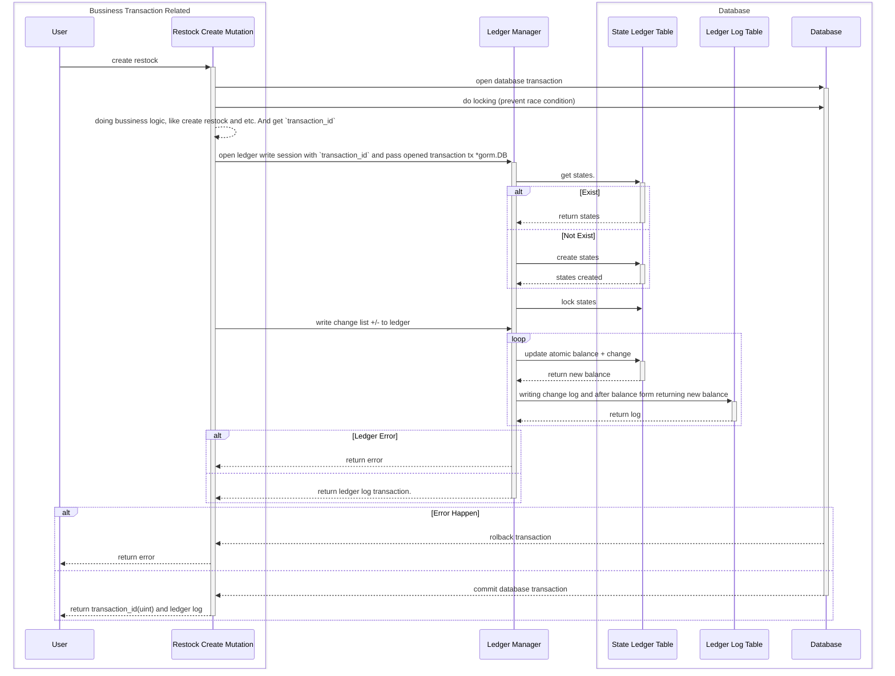
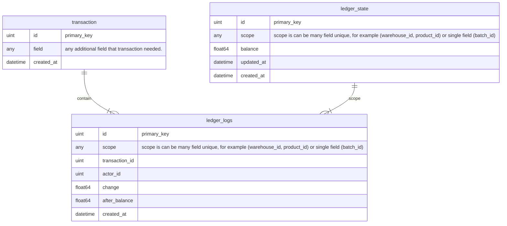
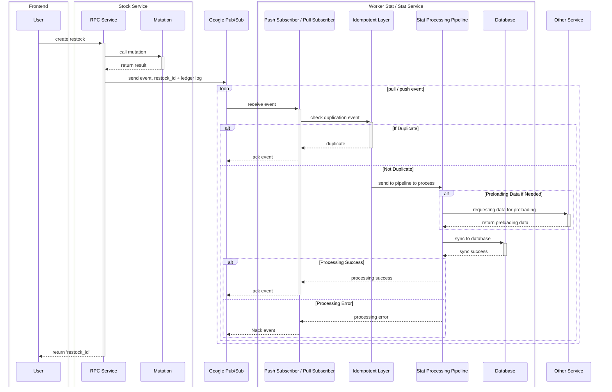
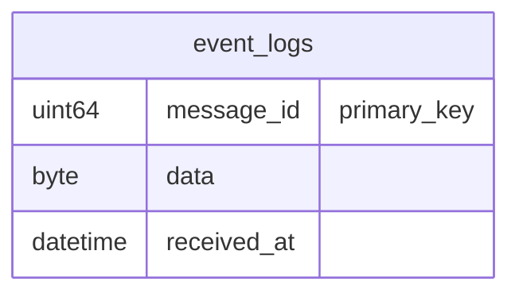
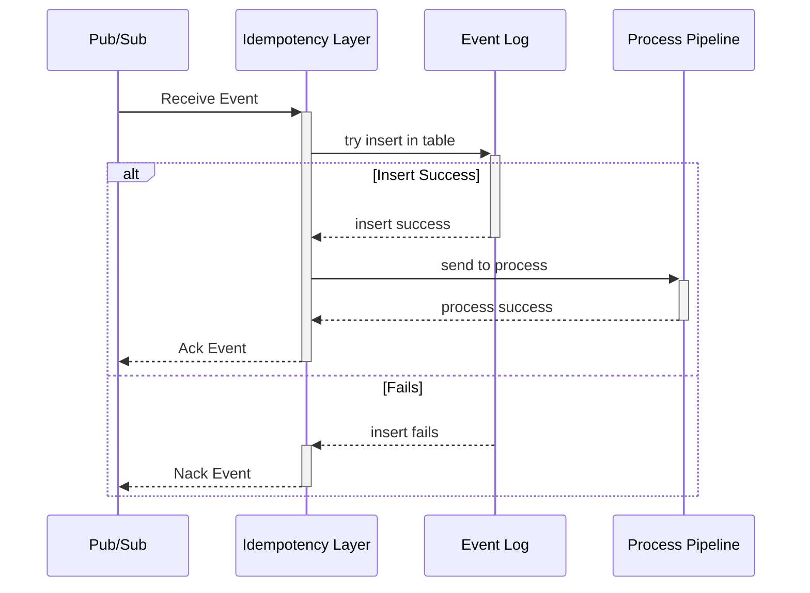

# Mutation and Ledger Log Concept.

## Implementation Plan.
This ledger design to accomodate :
1. Stock Ledger.
2. Order Revenue Ledger. 

## What is mutation ?
mutation is bussiness logic like `RestockCreateMutation`, `RestockAcceptMutation`

## Ledger
There is 2 component about the ledger.
1. state.
2. ledger log.
3. scope.

Ledger is using for audit and source of truth of event processing.

## State.
State is keep the ledger state.

## Log.
Ledger Log is history record of state change.


## Flow Mutation and Ledger.


## Entity Relationship.

## What is `transaction` Mean in Schema ?

## What is `scope` in Erd ?

# Statistic Design.

## General Guideline.
1. **Statistic is streaming and reconcile every midnight + 1 hour**.
2. **Statistic have plan to be covered :**
	- Time Based Metric:
		- daily
		- monthly
		- yearly
	
	- Group Based Metric like:
		- Product Grouped.
		- User Grouped.

3. **Complex Statistic can be heavy if we just rely on database query. For handle that we use event streaming and materialize table.**
	<br>Instead of :
	```mermaid
	sequenceDiagram

	participant ui as Frontend/UI
	participant srv as Service RPC
	participant db as Database

	ui->>+srv: Request Stat
	srv->>+db: run heavy (join, filter, and sort)
	db-->>-srv: return data
	srv-->>-ui: Return Stat
	```
	
	<br>The Solution :
	```mermaid
	sequenceDiagram

	participant ui as Frontend/UI
	participant srv as Service RPC
	participant db as Materialize Metric Table
	participant st as StatProcessing
	participant pub as Pub/Sub

	ui->>+srv: Request Stat
	srv->>+db: simple select query
	db-->>-srv: return data
	srv-->>-ui: Return Stat

	loop Processing loop
		pub->>st: receive event
		st<<->>db: sync
	end
	

	```


## General Flow and How Ledger Become **Source of Truth** of statistic.
**For Flow we take StockCreate for example.**



## Idempotency Layer.
1. Every Worker Stat / Service that receiving event has own Idempotency Layer.
2. Every service has own table. for Example:
	- StockService &rarr; that be `stock_event_logs`
	- OrderService &rarr; that be `order_event_logs`
3. For Keeping performance, we run periodic flush delete when `received_at` < `6 month`


### Schema.


### Idempotency Flow.
This Explain how we check idempotency event.


## Pipeline Code Design.


## HTTP Push Subscriber Flow.

## Pull Subscriber Flow.

## Stat Processing Pipeline.
Before Explaining how we processing statistic. 