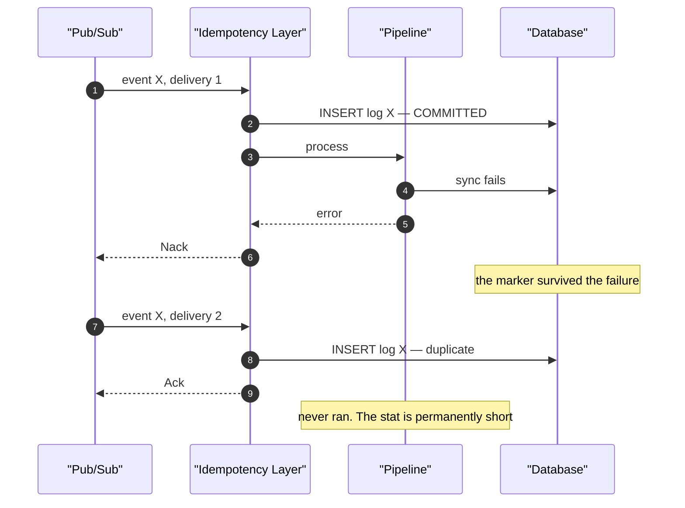
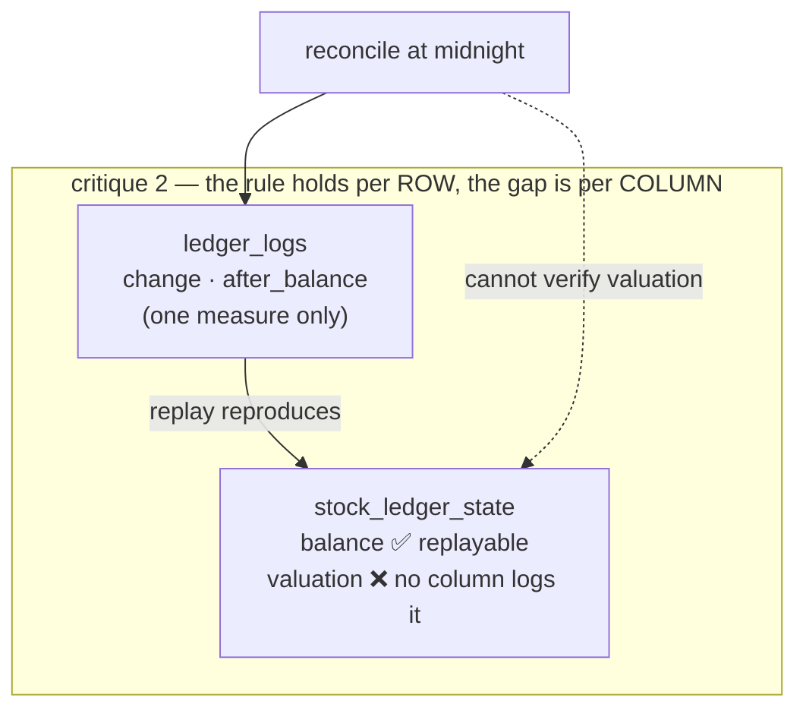
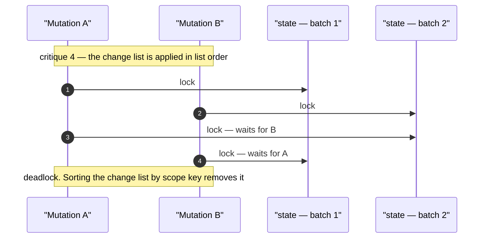

# Clarity — `mutation_and_ledger.md`

Critique, questions and warnings about [mutation_and_ledger.md](mutation_and_ledger.md). That doc is
yours; this one is mine. Re-examined whenever you update it — answered points are **deleted** here,
not struck through, so this file is always the *current* open set.

> **Last pass:** `## Ledger Log.` now states the rule — *"service that implemented that design cannot
> change the `State` without log recorded in `Ledger Log`"*. That closes the question of **whether**
> state may move unlogged. What is left is that the template cannot **express** it for a second
> measure (critique #2) — and that the rule now makes `float64` a breach of your own contract, not
> just a preference (critique #1).

---

# Contradiction

## The idempotency design re-decides what `event_library.md` already settled

[`guidelines/architectures/event_library.md`](../../guidelines/architectures/event_library.md) is
**authoritative** (RULE 7b). Its `# 3. Dedup` section decides this exact question, and the draft
answers it differently in three places — one cause, three sites. Unchanged for three passes.

| # | `mutation_and_ledger.md` says | the guideline says | which is wrong |
| --- | --- | --- | --- |
| 1 | `sub->>idem: check duplication event` — a **read** before the write | *"Dedup IS the write, never a predicate before it"* — `INSERT … ON CONFLICT DO NOTHING`, rows-affected is the answer | the draft. The guideline ships a diagram of this exact check-then-act race |
| 2 | `event_logs.message_id uint64` as the primary key | *"`MessageID` … is correct here for the same reason it is **wrong for event dedup**"* — a republished event gets a **new** message id, so it dedups nothing. Also: Pub/Sub message ids are **strings** | the draft, twice |
| 3 | `Insert Fails → Nack Event` | a duplicate is `Duplicate` → **Ack**. Only a transient `error` nacks | the draft — and it contradicts **itself**: the first flow diagram says `duplicate → ack`, the idempotency diagram says insert-fails → nack |

**→ Recommend:** delete the idempotency schema and both idempotency diagrams from the draft, and
reference `san_event`'s `EventDedup.Claim(ctx, tx, e)` instead. It is already decided, already
diagrammed, and already handles the three cases above. The draft keeps only what is *stat-specific*.

## `Claim` takes a `tx` — the draft's layer commits the marker before processing

The bigger half of the same cause. The draft's `idem` inserts, and *then* hands off to `pipe`. The
guideline's signature is `Claim(ctx, tx, e)` — **the caller's transaction** — precisely so the two
commit together.

**→ Recommend:** one transaction around `Claim` + the pipeline's writes. A processing failure must
roll the marker back, or a retry can never do the work.

---

# Critique

| | Problem | → Recommend |
| --- | --- | --- |
| **1** | **`float64` breaks the rule you just wrote.** `## Ledger Log.` now makes the log the **source of truth** for state — which only holds if replaying the log reproduces the state. Binary float cannot represent `0.1`, and `after_balance` *accumulates* the error, so `sum(change)` and the stored `balance` drift apart. The doc's own guarantee fails silently, and money is where it shows. | Stock quantity → **integer** (base unit). Money → **`numeric`** or integer minor-units. Never float in a ledger. This is now a correctness bug against the doc, not a style preference. |
| **2** | **The per-measure shape has been decided in the INSTANCE, and the template still does not say it.** [stock_design.md](stock_design.md) now doubles both state and log for its two measures — that answers this critique by doing it. But the template still shows one `change` / `after_balance` and never mentions measures, so the *next* service gets no guidance and invents its own shape. Two ledgers that disagree about this cannot share tooling or a reconcile pass. | Promote the answer into the template: **every state measure carries its own `change` and `after_balance` in the log.** Stock has now arrived at exactly that — four columns, one pair per measure — so the template is only being asked to state what its first instance already proved it needed. |
| **3** | **"not a `library`" collides with your own event guideline's reasoning.** A pattern with no shared code means every service hand-writes the write protocol: the upsert, the `RETURNING`, capturing `after_balance`, ordering the change list. `event_library.md` shipped a default dedup impl for a *weaker* version of this argument — *"twelve hand-written `ON CONFLICT` statements is a lot of surface for SQL with several easy mistakes in it"*. The ledger write is harder SQL than dedup, and #1's rule now depends on every service getting it right. | Not in conflict — **template for the TABLES, library for the PROTOCOL.** Each service owns its tables, columns and migration (that is the architecture, and the template says so); a thin `san_ledger` owns the write session that #4–#6 are about. Exactly the split `san_event` already uses. |
| **4** | **Lock ordering is undefined → deadlock.** `mut` locks its business rows, then `lg` locks state rows, and the change list is applied in a `loop` in list order. Two mutations touching the same two scopes in opposite order deadlock. This is the normal case here — people work in pairs on one stock level. | **Sort the change list by scope key inside the ledger write session** before applying. Cheap, invisible to callers, impossible to get wrong at a call site — and it exists once if #3 is a library. Then run the `audit-sql` skill on the first mutation. |
| **5** | **`lock states` and `update atomic balance + change` are redundant.** If the update is `UPDATE … SET balance = balance + ? RETURNING balance`, the row lock is implicit and the explicit lock does nothing. If the explicit lock is what protects it, "atomic" is doing nothing. | Drop the `lg->>st: lock states` step. `UPDATE … RETURNING` **is** the protocol — and a guard becomes `WHERE balance + ? >= 0` with zero-rows-affected as the rejection. |
| **6** | **Get-or-create state races.** `alt Exist / else create` — two concurrent transactions both miss, both insert, one dies on the unique violation and takes the whole business transaction with it. Same check-then-act shape the event guideline rejects. | Collapse the `alt` and the `loop` into one statement: `INSERT … ON CONFLICT (scope…) DO UPDATE SET balance = ledger_state.balance + EXCLUDED.change RETURNING balance`. Create and apply become the same write, and the race disappears rather than being handled. |
| **7** | **The publish is outside the transaction.** `rpc->>pub: send event` runs after `mut` returns. Crash in between and the event is gone — yet the brief's claim is that the ledger is the *source of truth*. | Either a **transactional outbox** (event row written in the ledger's tx, a relay publishes), or state plainly that **midnight reconcile is the recovery mechanism, not a safety net** — in which case reconcile must rebuild any metric from the ledger alone. Which leads to #8. |
| **8** | **`Preloading Data if Needed` breaks reconcilability.** If the pipeline enriches an event with a live read from `srv` at processing time, replaying that event at midnight gets a *different* answer, because the other service's data moved. Reconcile would then "correct" a right number to a wrong one. | Preloaded values must be **frozen into the event payload at publish time**, not fetched at processing time — the event guideline's *"an event carries CHANGE, never a level"* is the same instinct. If a value genuinely cannot be frozen, that metric is not reconcilable and must be excluded from the midnight pass. |
| **9** | **The template leaves `any scope` free, but the CONSTRAINT is what makes it work.** As a template `any scope` is fair — a service picks its own columns. What is not optional is that those columns be **NOT NULL and carry a unique index**: `## Scope` says *"scope is unique"*, but nothing makes an implementer enforce it, and #6's upsert has no conflict target without it. | One line in the template: *scope columns are NOT NULL, and carry a composite unique index — that index is the conflict target of the ledger write.* Nullable scope silently breaks uniqueness in Postgres (`NULL != NULL`), which surfaces as duplicate state rows months later. |
| **10** | **Reversal is undefined — and the new rule makes it urgent.** If state cannot move without a log entry, then a *deleted or edited* log entry silently breaks the guarantee for every row after it. The doc never says the log is append-only, or how a cancelled restock is undone. | State both: **append-only, and reversal is a compensating entry** carrying `reverses_id`. This is the sentence that makes `## Ledger Log.`'s rule survive contact with a cancellation. |

---

# Question

1. **Does the new rule extend per-measure?** (critique #2) I recommend yes — every state measure gets
   its own log column, or the rule cannot be enforced for valuation.
2. **Does "not a library" forbid a `san_ledger` write-session helper**, or only forbid shared *tables*?
   (critique #3) I recommend allowing the helper — #4, #5 and #6 are one piece of SQL that should
   exist once rather than three times, and the new rule now leans on it being right.
3. **Does the draft's idempotency section survive at all**, or does it defer to `event_library.md`'s
   `Claim`? I recommend deferring and deleting it from the doc.

> **Routed out:** the stock-units question was mine to ask in the wrong place — this doc is a
> template and cannot decide stock's column types. It now lives in
> [stock_design_clarity.md](stock_design_clarity.md), where `stock_design.md` answered half of it
> (`int` quantity ✅) and left the other half open (`float64` valuation ❌).

---

# Awaiting

Empty headings in your doc, listed so they are not mistaken for oversights — nothing from me until
they are written:

- `## Pipeline Code Design.`
- `## HTTP Push Subscriber Flow.` · `## Pull Subscriber Flow.` — note `backend/pkgs/event_source/`
  already has `push.go`, and `event_library.md` `# 2. Receiving` decides the driver contract.
- `## Stat Processing Pipeline.`

**Sibling doc:** [stock_design.md](stock_design.md) now has its own
[stock_design_clarity.md](stock_design_clarity.md). Anything that is a *stock* decision belongs
there, not here.

**Clean:** every mermaid diagram parses, yours included (`npm run lint:mermaid`).
