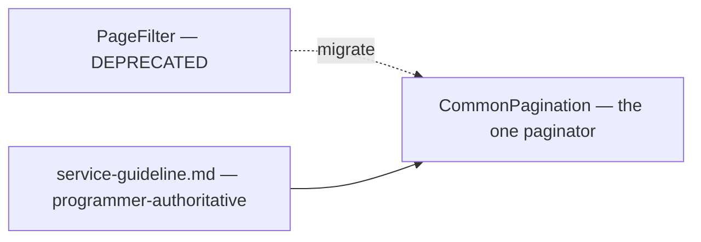
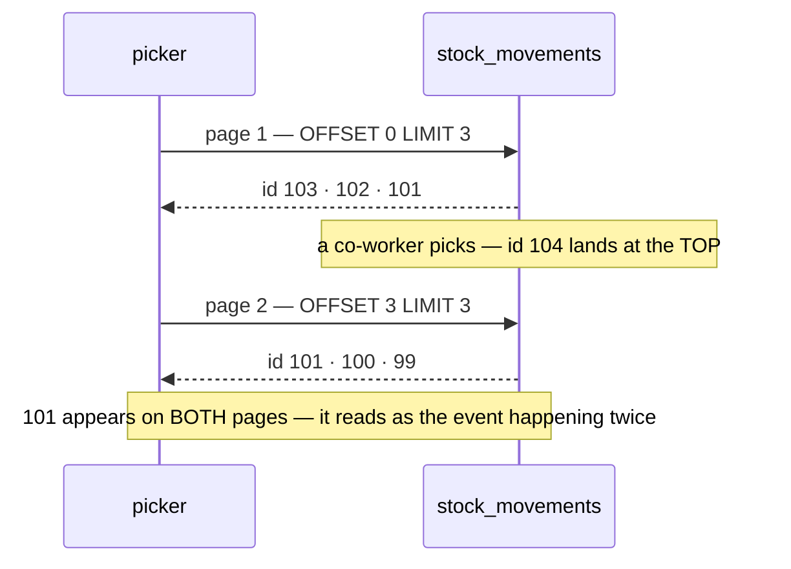

# Pagination

> ⚠ **`disscuss/` is NOT final.** Mid-argument. Do not build from this.

How every list RPC pages — the shared messages, the deprecation, and the one list shape a page-number
pager cannot serve.

Sibling: [stock_movement_log.md](stock_movement_log.md) — the ledger is the read that forced this
question. Governed by [service-guideline.md](../../guidelines/service-guideline.md), which is
**programmer-authoritative**.

# Proposal

**Closed by the owner.** Everything outside this section is still argument.

| § | Decided |
| --- | --- |
| P1 | **`PageFilter` is DEPRECATED.** `CommonPagination` is the one paginator. The refactor is its own piece of work |

## P1 · One paginator — `CommonPagination`

Two shared paginators exist, with identical shapes:

| | Where | Shape | Used by |
| --- | --- | --- | --- |
| `PageFilter` | `common/v1/page.proto` | `page` + `limit` | 15 proto files — every list not yet migrated |
| **`CommonPagination`** | `common/v1/list.proto` | `page` + `limit` | the **guideline's** list shape — every governed List / ByIds RPC |

Same two fields, so a migration is mechanical per RPC. **Not designed here** — the sequencing, the
`PageInfo` story, and whether it lands in one sweep or per service are their own discussion.

---

## Critique — what is still open

### 1. ⚠ A page-number pager cannot page an append-only, newest-first list

Every ledger read pages with `OFFSET`
([stock_history.go:61](backend/services/inventory_service/inventory_v1/stock_history.go#L61),
`rack_history.go`, `owner_stock_history.go`, `batch_detail.go`). New rows land at the **top**, so a
movement recorded between two page turns pushes every row down one:

`staleTime: 0` (HARD RULE 10) makes this the **normal** case, not a race: every page turn is a fresh
query against a table a second person at the same shelf is actively writing to.

⚠ **It matters more on a ledger than anywhere else.** A product list repeating a row is an annoyance; a
*ledger* repeating a row is the feature failing at its only purpose, which is to make a number
believable. The reader sees the same pick twice and concludes the log is lying.

**→ Recommend keyset for these reads** — `WHERE id < :cursor ORDER BY id DESC LIMIT n`. Stable, and
O(page) instead of O(offset).

### 2. ⚠ Where does the cursor live? — and it is ONE question with the total count

The cursor and the total count are the request half and the response half of the same decision.
`PageInfo` returns `current_page` / `total_page` / `total_items` — a contract that **requires** the
`COUNT(*)` keyset exists to avoid.

| | | Cost |
| --- | --- | --- |
| **A · cursor on the shared paginator** | one place, every list can opt in | a **guideline change**, and 37 governed RPCs gain a field they ignore — "optional, honoured by some" is exactly the contract ambiguity that breeds bugs |
| **B · `before_id` on each ledger RPC's own filter** | no shared type changes, no guideline change. "rows before id X" **is** a filter | `page.page` becomes meaningless on those RPCs and must be documented as ignored |
| **C · a dedicated `LedgerPage { before_id, limit }`** | cleanest contract — nothing meaningless | a **third** paginator, deviating from the guideline shape |

**→ Recommend B**, and P1's deprecation makes it stronger rather than weaker.

✅ **B is the only option independent of the paginator refactor.** A and C both put a cursor *into* the
paginator layer, so both would have to be reconciled with the `PageFilter` → `CommonPagination`
migration. A `before_id` on a domain filter is untouched by it — those RPCs swap paginators like every
other RPC and their cursor never moves.

⚠ **`PageInfo` must change for these RPCs either way.** `total_page` and `total_items` cannot be produced
without the count. Replace them with **`has_more`**, which keyset gives for free: fetch `limit + 1`,
return `limit`, report whether the extra row existed.

---

## Question

1. **Is "movement 12,481 of 40,332" a number anyone uses?** If not — and at a shelf I do not think it is
   — then losing the total is not a cost, it is the point. This decides §2.
2. **Does the cursor go on the domain filter (B), or is it worth widening the shared paginator (A)?**
   *I say B*, on blast radius alone.
3. **Sequencing of the `PageFilter` → `CommonPagination` migration** — one sweep, or per service as each
   is touched? Not designed here.
