# RackBatchMutation — the one door into the stock_movements ledger

> ⚠ **GRAIN CHANGED — [ledger-splits-by-question](database/stock_design.md#ledger-splits-by-question) (owner, 2026-08-07).**
> The ledger splits into a **placement** ledger (no `batch_id`) and a **batch** ledger (no `rack_id`), so
> `(rack, batch)` is no longer a grain. **Rules below phrased in those terms are superseded** — see
> [the-cross-product-grain-was-assumed-everywhere](database/stock_design.md#the-cross-product-grain-was-assumed-everywhere).
> This doc is rewritten once the open sub-parts settle, not before.

> ⚠ **`disscuss/` — NOT final.** Only `# Proposal` is the owner's. Everything below it is argument.
>
> The write side of [stock_design](database/stock_design.md) (⚠ **reopened — no longer authoritative**).
> Siblings: [move_layers](move_layers.md) · [fifo](fifo.md) · [batch_selection](batch_selection.md) ·
> [restock_reversal](restock_reversal.md).
>
> **`ledger` = `stock_movements`** (owner). This doc writes **`stock_movements` ledger** in prose so no reader has
> to remember which table is meant — see [vocabulary](vocabulary.md).

# Proposal

## decided

**Closed by the owner. Each links to its diagram and spec — nothing is restated here.**

| decision | |
| --- | --- |
| [the-move-flow](#the-move-flow) | the session walks the shelf, returns the layers, and `Add()` consumes them. The handler owns the transaction and the action |
| [the-boundary](#the-boundary) | the session does **operations**, the handler does **lifecycle**. On error it returns the error and nothing else. **One transaction, no `SAVEPOINT`** |
| [the-ledger-is-stock-movements](#the-ledger-is-stock-movements) | the appender writes `stock_movements` only, and the term is always qualified |
| [rows-are-never-deleted](#rows-are-never-deleted) | an emptied row is `UPDATE`d to 0 and stays |
| [an-abort-is-the-whole-undo](#an-abort-is-the-whole-undo) | an error aborts the transaction, and that is the entire undo |
| [the-rack-is-the-lock-token](#the-rack-is-the-lock-token) | the gate is the **`racks` row**, ascending id — not the balance rows |
| [the-walk-is-one-table](#the-walk-is-one-table) | `Spent()` walks **`stock_rack_batches`** — `product_id` is a predicate on the row, never a join |

**Still open:** who calls the gate ([gates-are-declared-then-enforced](#gates-are-declared-then-enforced)), the
**pool** gate, `Claim` as a fourth verb, and `RECOUNT` positive-only.

---

**The owner's shape.** A primitive that owns every write to `stock_rack_batches` + `stock_movements`, scoped to
one action.

| rule | |
| --- | --- |
| **1 · one transaction** | the session lives **within** one db transaction — it does not own it |
| **2 · it takes the transaction at construction** | `NewRackBatchMutation(tx *gorm.DB, inventoryTransactionID uint)` → a **session** |
| **3 · three functions** | `Move()` · `Spent()` · `Add()` |
| **4 · it is ONLY rack-batch ops** (owner) | on error it **returns the error** and does nothing else. `BEGIN` / `COMMIT` / `ROLLBACK` are purely the `StockMove` handler's |

## the-boundary

**✅ The session does operations. The handler does lifecycle.** (owner) Stated as a contract in both directions,
because everything below hangs off it.

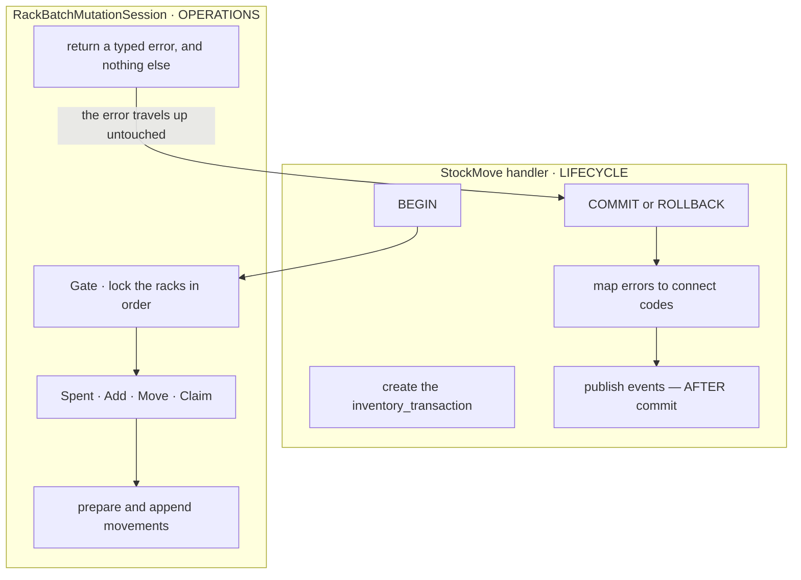

| the session PROMISES | the handler must PROVIDE |
| --- | --- |
| it never calls `BEGIN`, `COMMIT` or `ROLLBACK` | a live transaction, and the decision to end it |
| on error it returns immediately — **no cleanup, no compensating write** | the `ROLLBACK`. Which is the whole undo ([an-abort-is-the-whole-undo](#an-abort-is-the-whole-undo)) — and a write after an error would fail with `25P02` anyway |
| it returns **typed domain errors**, never `connect.Error` | the mapping to `connect` codes. The session is not an RPC layer, exactly as `errRestockNotPending` + `restockErr()` already split it |
| it never publishes, evicts a cache, or calls another service | doing all of that **after** commit |
| it never creates the `inventory_transaction` | creating it, and passing its id |
| every write is gated and ordered | the rack **set** — `Gate()` sorts it |

✅ **ONE transaction, no `SAVEPOINT` (owner).** The `StockMove` handler opens it, the session runs inside it, and
nothing nests. The reason is kept beside the rule rather than in a decision log, because it is invisible from the
call site:

> gorm's nested `Transaction()` opens a `SAVEPOINT`, and rolling back to one **releases the row locks taken inside
> it**. The gate would silently stop holding while the outer transaction carried on and committed — and the session
> cannot detect that.

**→ Recommend making it structural, not remembered: `gorm.Config{DisableNestedTransaction: true}`** at the
composition root. With it, an inner `Transaction()` joins the outer one instead of opening a savepoint, so the rule
cannot be broken by someone adding a *"sub-step"* later.

✅ **Verified free to turn on:** there is **no nested `tx.Transaction(`** anywhere in non-test backend code today
(44 top-level `.Transaction(func` calls, none inside another), and the flag is currently unset — so nothing
presently relies on partial-rollback semantics that flipping it would change.

⚠ **One thing the boundary still cannot guarantee, so it stays the handler's:** **the transaction is the contention
window.** The gate has no release, so how long the handler keeps the transaction open **is** how long the shelf is
blocked. Everything avoidable belongs before `BEGIN` or after `COMMIT`.

**The errors it returns**, so the handler can map them without string-matching:

| error | means | handler maps to |
| --- | --- | --- |
| `ErrInsufficientBalance` | the shelf cannot cover the draw | `FailedPrecondition` |
| `ErrRackNotGated` | a verb touched a rack `Gate()` never took | `Internal` — a programmer error, loud in tests |
| `ErrLayerAlreadyWritten` | this action already wrote that `(rack, batch)` | `Internal`, or `AlreadyExists` on a replay |
| `ErrRackNotInWarehouse` | the gate `SELECT` returned fewer rows than asked | `NotFound` — never `PermissionDenied`, which would confirm the id exists |
| `ErrBatchNotInWarehouse` | a named layer belongs elsewhere | `NotFound` |

✅ **And this is why there are two objects, not one.** `RackBatchMutation` is the **wired dependency** — it holds
the `stock_movements` ledger appender and nothing per-request, so it is a Wire provider (HARD RULE 4). The
**session** is the per-transaction instance, which Wire cannot build because `tx` only exists at runtime.

## the-move-flow

**The owner's concept, as drawn.** A `RackBatchMutation` hands out a **session**, the session walks the shelf
itself, and the plan it returns is what the second leg consumes.

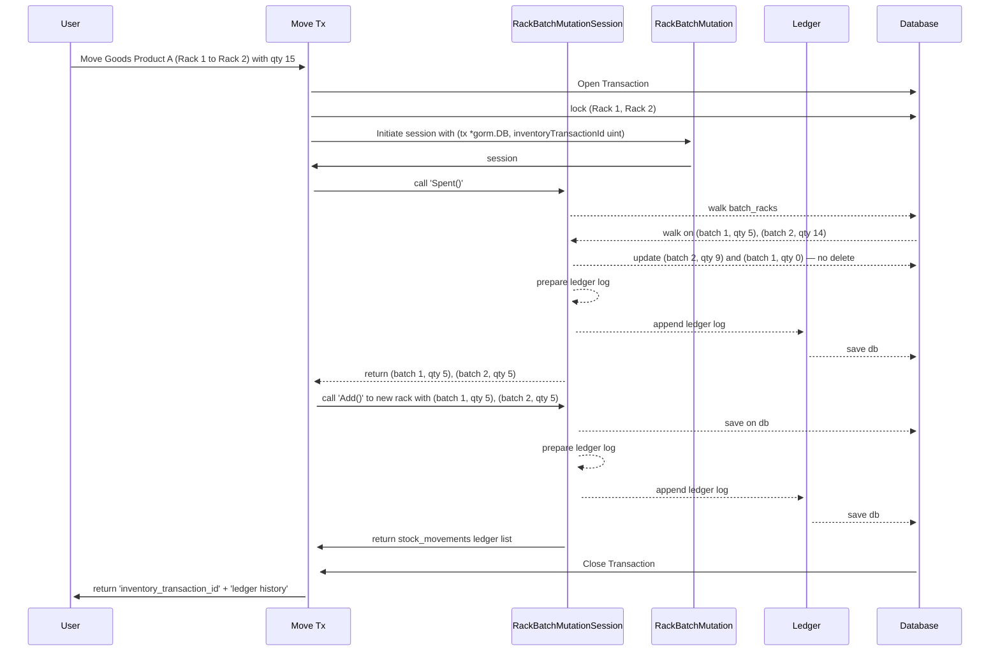

**The concept, in words** — this part is the owner's and is not under argument:

| | |
| --- | --- |
| **a factory and a session** | `RackBatchMutation` is constructed with `(tx, inventoryTransactionID)` and hands out a session. The session is the only thing that writes |
| **the session walks the shelf** | `Spent()` reads `stock_rack_batches` itself and decides which layers to take. The handler passes a **product and a quantity**, never a batch |
| **the plan is the return value** | `Spent()` hands back `(batch, qty)` pairs, and `Add()` at the destination consumes exactly those — so both legs carry the same layers with nothing to keep in sync |
| **the session PREPARES the row, the `Ledger` PERSISTS it** | *"prepare ledger log"* then *"append"* then *"save db"* — deciding what the row says and writing it are two jobs. See [the-ledger-is-stock-movements](#the-ledger-is-stock-movements) |
| **the `stock_movements` ledger is a separate collaborator** | both verbs go through it, and it is not the state table — so the state write and the ledger write are distinguishable steps within the one transaction |
| ✅ **`Ledger` writes `stock_movements` ONLY** (owner) | not the transit table. The transit leg gets its own appender — [the-ledger-is-stock-movements](#the-ledger-is-stock-movements) |
| **the handler owns the transaction and the action** | it opens the db transaction and supplies the `inventory_transaction_id`. The session does not mint the action |
| **the answer is the action plus its history** | the RPC returns `inventory_transaction_id` **and** the movement rows, not a bare OK |

### the-same-flow-corrected

**Four corrections, none of them a change of shape** — each argued below. `qty 15` is carried through so the
arithmetic is checkable.

| # | as drawn | corrected | why |
| --- | --- | --- | --- |
| 1 | the handler locks `(Rack 1, Rack 2)` — source-then-destination | ✅ **ascending rack id, on the `racks` row** (owner). Who calls it is still open | source-then-destination deadlocks against its mirror, and a destination balance row may not exist to lock. [the-rack-is-the-lock-token](#the-rack-is-the-lock-token) · [gates-are-declared-then-enforced](#gates-are-declared-then-enforced) |
| 2 | ~~`delete (batch 1, qty 0)`~~ | ✅ **no delete — the row is updated to 0 and stays** (owner) | my correction is **withdrawn**: never deleting is stronger than deleting carefully. [rows-are-never-deleted](#rows-are-never-deleted) |
| 3 | `Spent` then `Add`, called separately | one `Move()` doing both | the lock set must be known before the first lock, and only `Move` knows both racks |
| 4 | 15 asked, `(b1 5) (b2 5)` returned | `(b1 5) (b2 10)`, `b2` left at **4** | a greedy walk takes `min(need, balance)` per layer |

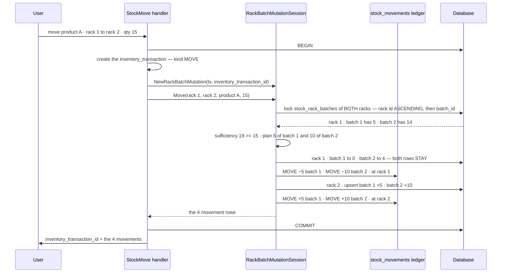

**What the concept settles** (previously open in this doc and in [move_layers](move_layers.md)):

| | |
| --- | --- |
| **the handler creates the `inventory_transaction`** | the session takes its id — it does not mint the action. Answers this doc's question 4 |
| **`Spent()` WALKS `stock_rack_batches` and RETURNS the layers it took** | the caller does not name batches. ⚠ This overrules [move_layers](move_layers.md)'s *"the layers are explicit in the request"* — recorded there, with what it costs |
| **the plan flows through the caller** | `Spent()` returns `(batch, qty)` pairs and `Add()` consumes them, so both legs carry **the same layers** by construction. It is also why a `Move` can never cross a warehouse: `Add` would have to mint |
| **the writes happen inside the verbs** | not deferred to a `Flush()`. See [a-layer-is-written-once-per-action](#a-layer-is-written-once-per-action) |
| **`Ledger` is its own collaborator** | one appender for one table, so the transit leg needs its own — see [the-transit-legs-need-a-sibling](#the-transit-legs-need-a-sibling) |

⚠ **The arithmetic in the original does not close:** 15 asked, layers of 5 and 14, and the walk returned
`(b1 5) (b2 5)` leaving `b2` at 9 — that is 10 units moved. A greedy oldest-first walk takes
`min(need, balance)` per layer, so it is `(b1 5) (b2 10)` and `b2` is left at **4**. Flagged only because the
rule lives exactly there.

---

## Critique

### what-a-deadlock-costs-here

**✅ Ascending rack id was the owner's intent all along**, and [fifo](fifo.md) already fixes the expression:
*"every rack must be locked first — ascending by rack id — and only then is the plan computed."* So the order is
agreed. What follows is why it matters, and the two things about it that are still wrong in the flow.

**A deadlock is a CYCLE, not a slow wait.** Two transactions each hold a lock the other is waiting for, so
neither can ever proceed — no amount of waiting resolves it.

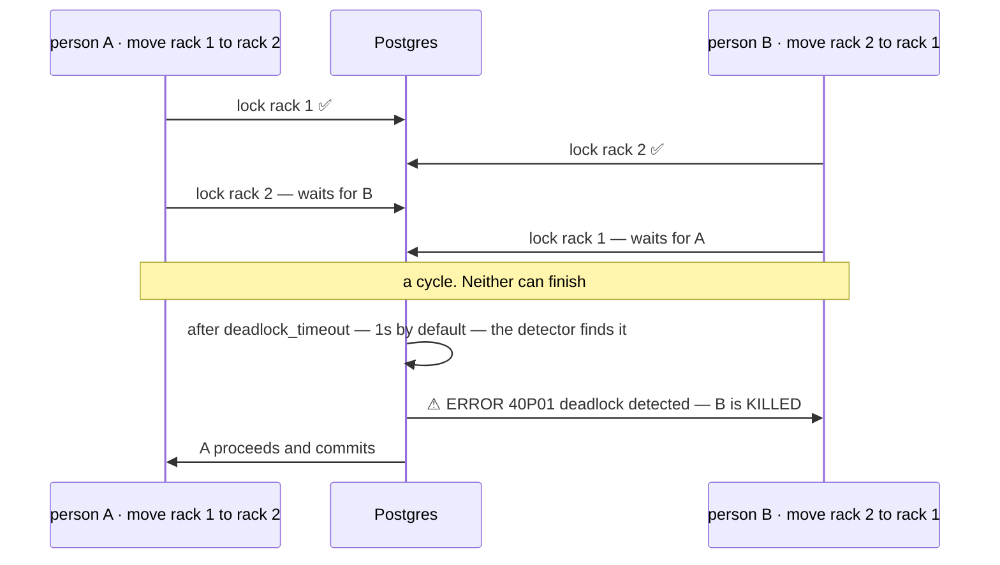

| what it costs | |
| --- | --- |
| **the data** | ⚠ **nothing.** Atomicity holds — the victim's **whole** transaction rolls back, every statement, not just the one that waited. There is no half-move |
| **the person** | a **~1 second freeze**, then a failed action. `deadlock_timeout` is how long Postgres waits before even *looking* for a cycle, so the victim always pays that second |
| **the recovery** | a retry usually succeeds, because the winner has committed by then. Nothing was written, so a retry with a **fresh** `inventory_transaction` is clean — and a retry reusing the **same** id is also safe, because `stock_movements_txn_once` refuses the double write |
| **the physical world** | ⚠ the goods **already moved.** The person carried them, the system recorded nothing, and their screen says it failed. That is the part worth designing against |
| **when it shows up** | only with two people on one shelf at the same second — [which is this app's normal case](../../CLAUDE.md), and never in a single-threaded test. `san_race` and the `audit-sql` skill exist to write the interleaving down and prove it |

⚠ **A plain lock WAIT is not a deadlock and is not a problem** — it is correct serialisation, and it is what makes
two people on one shelf safe. Deadlocks are fixed by fixing the **order** locks are taken in, never by locking
less.

### an-abort-is-the-whole-undo

**✅ Correct, and it is stronger than it sounds** (owner). Any error inside a db transaction — a deadlock, a
`CHECK` violation, a bug in the walk — aborts it. Postgres then refuses **every** following statement with
`25P02 current transaction is aborted`, so there is no such thing as carrying on past the error.

**So the session needs no cleanup, no compensation and no unwinding.** That is what makes streaming writes safe
and what killed the `Flush()` proposal: a half-written action cannot exist.

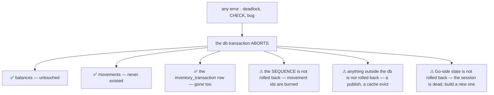

| ⚠ what `ROLLBACK` does NOT undo | what to do about it |
| --- | --- |
| **`nextval` is never rolled back** | a failed action **burns movement ids**, so the `stock_movements` ledger has **gaps**. Harmless — `id` is an order axis, not a count — but it must be written down, because *"append-only"* invites someone to read a gap as a **deletion** and go looking for who removed rows |
| **anything outside the database** | an event publish, a cache eviction, a call to another service. Publish **after** commit, or through an outbox. `PostCODFee` is in-transaction only because it is the **same database** — that is the exception's whole justification |
| **Go-side state** | the session's written-set and its returned rows are stale the moment the transaction dies. **A retry constructs a new session** — never reuse one |
| ⚠ **a SAVEPOINT is not a rollback** | gorm's nested `Transaction()` uses savepoints, so an inner rollback returns to the savepoint and the **outer transaction can still commit**. Then *"abort"* stops meaning *"all of it"*. The session must run in the outermost transaction, never nested |

**→ Recommend: two retry cases, and they need opposite rules.**

| | what we know | the id to use |
| --- | --- | --- |
| **a rollback retry** — `40P01` deadlock, `40001` serialization failure | nothing committed, provably | a **fresh** `inventory_transaction` is fine. Retry once server-side, then return `Aborted` |
| **an unknown-outcome retry** — the scanner's wifi dropped before the answer arrived | the commit **may** have landed | ⚠ the **same** id must be reused, and `stock_movements_txn_once` is what makes the replay a no-op instead of a double-apply |

⚠ **A constraint violation is NOT retryable.** `23505` on the written-once index means a replay or a bug — retry
it in a loop and it fails forever. It maps to *"already applied"*, not to *"try again"*.

✅ **And with the gate in place, a deadlock should be ~zero.** If ascending order holds everywhere, `40P01`
cannot happen — so **a nonzero deadlock rate is the alarm that some path skipped the gate.** The retry hides the
symptom, which is exactly why the metric has to be watched rather than the error swallowed.

### the-rack-is-the-lock-token

**✅ Decided (owner): the gate is the `racks` row, not the balance rows.**

```sql
-- THE GATE. First statement after BEGIN, before any read of stock_rack_batches.
-- ORDER BY id is the deadlock discipline. The two extra predicates are why this
-- statement replaces rackExists() in five handlers.
SELECT id
  FROM racks
 WHERE id IN (:rack_ids)
   AND warehouse_id = :warehouse_id
   AND deleted = FALSE
 ORDER BY id
   FOR UPDATE;
-- fewer rows back than asked  →  ErrRackNotInWarehouse. Never PermissionDenied.
```

| what the gate is, exactly | |
| --- | --- |
| **held until `COMMIT`** | there is no release. See [what happens inside the gate](#what-happens-inside-the-gate) |
| **taken once, ascending** | `Gate()` sorts, so a caller declares a **set** and never an order |
| **also the scope check** | ✅ `rackExists` collapses into it — it becomes impossible to lock a rack without validating it belongs to this warehouse and is not soft-deleted |
| **also `RackDelete`'s guard** | that RPC's *"sum the balances, then soft-delete"* is a check-then-act today. Taking this gate closes it inside the transaction instead of leaving it to the nightly reconcile |
| ⚠ **not enough for the claim pool** | that is a range predicate on a different axis — see [the-pool-is-not-rack-scoped](#the-pool-is-not-rack-scoped) |

**Why it is the parent row and not the balance rows** — you cannot `FOR UPDATE` a row that does not exist.

At the destination, `(rack 2, batch 1)` may have **no row** — a shelf that has never held that layer. So a lock
set built from `stock_rack_batches` is **incomplete by construction** at the destination, and the upsert takes its
row lock at **write** time — after the source, out of canonical order. The cycle comes straight back:

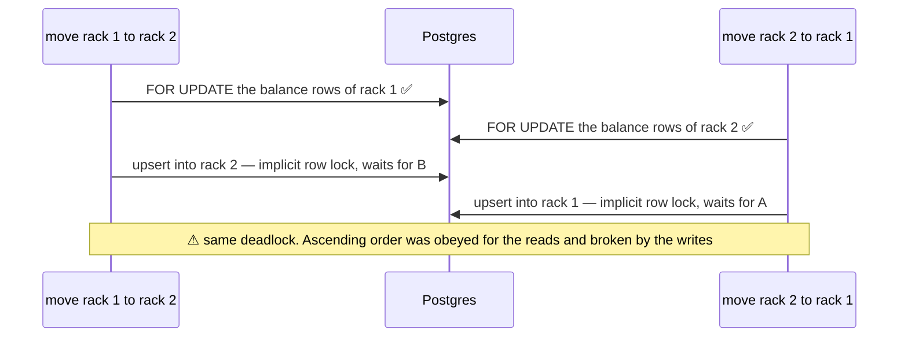

**→ Recommend: the gate is the `racks` row, not the balance rows.**
`SELECT id FROM racks WHERE id IN (…) ORDER BY id FOR UPDATE`, before any read or write. A parent row can be
locked for children **that do not exist yet**, which is exactly the phantom `FOR UPDATE` cannot cover. The
`stock_rack_batches` rows are then read under that gate.

⚠ **This is what [fifo](fifo.md) already says, and the wording turns out to be load-bearing** — *"every **rack**
must be locked"*, not *"every balance row"*. Read as balance rows, the rule is unimplementable at a destination.

| | |
| --- | --- |
| **the gate is per RACK, not per (rack, product)** | so two people moving **different products** between the same two shelves serialise unnecessarily. Accepted: it is one row per rack, it is visible in `pg_locks`, and it is simple |
| **the finer option, if contention appears** | `pg_advisory_xact_lock` keyed on `(rack_id, product_id)` — phantom-proof too, and narrower. ⚠ Advisory locks are invisible to anyone reasoning about locks per table, so they are worth the debugging cost only once the coarse gate is measured to hurt |
| **the balance rows still get `FOR UPDATE`** | the gate serialises writers, the row lock is what `after_balance` and `CHECK (balance >= 0)` are computed under |

### gates-are-declared-then-enforced

**Who takes the gate is the one part still open, and both poles are wrong.**

| | for | against |
| --- | --- | --- |
| **the handler** (as drawn) | it is the only thing that knows the **whole** rack set up front — an acceptance places onto five shelves, a stocktake covers an aisle | ⚠ a chokepoint that cannot verify its own precondition is not a chokepoint. A handler that forgets writes unserialised and **nothing detects it**. `rackExists` is already duplicated in five handlers |
| **the session** | it can guarantee what it enforces | ⚠ it does not know the set. Gating inside each verb takes locks in **call** order, which is the deadlock again with extra steps |

**→ Recommend the synthesis: `Gate(rackIDs…)` — the handler DECLARES, the session ENFORCES.**

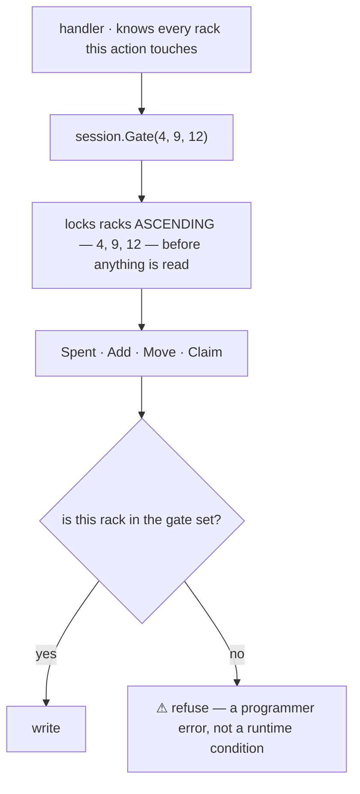

- **Every verb refuses a rack that was not gated**, so forgetting the gate fails loudly on the first write
  instead of intermittently under load.
- **`Move()` gates implicitly** — it knows both racks. The owner's flow then works exactly as drawn, with the
  lock line moved one participant to the right.
- **Gating twice is free.** A held row lock re-selected is a no-op, so a `Move()` inside a handler that already
  gated needs no special case.
- ⚠ **A second `Gate()` call with new racks is the trap** — it would take a lock after writes have begun, out of
  order. Refuse it: one gate per session, declared before the first verb.

#### what the gate actually protects — and what it does NOT

**Being precise about this, because I have been sloppy with it.** The gate does **not** protect the numbers.

| | protected by |
| --- | --- |
| a lost update on a balance | ⚠ **not the gate** — `SELECT … FOR UPDATE` on the balance row plus `CHECK (balance >= 0)`. Those hold with no gate at all |
| an over-draw | the same row lock plus the sufficiency check under it |
| a **deadlock** | ✅ **the gate** — a canonical acquisition order is the only fix, and it must cover every row the action will touch |
| a **phantom** — two first-ever placements of one layer on one shelf | ✅ **the gate** — there is no row to lock, so `FOR UPDATE` cannot serialise them. Without it, both `INSERT` and one dies on `UNIQUE (rack_id, batch_id)` |
| a **range** read, like the claim pool's `WHERE lost_claimable > 0` | ⚠ **neither** — see the hole below |

**So the honest framing: the gate buys determinism and availability, not correctness of balances.** Forgetting it
does not corrupt stock — it produces intermittent `40P01` and `23505` failures that look like flakiness, get
retried, and never get diagnosed. That is a weaker argument than *"the numbers go wrong"*, and it is still worth
the gate: **a system whose people work in pairs on one shelf cannot afford errors that only appear in pairs.**

#### why `Gate()` and not just `Move()`

Because most actions touch more racks than one verb can see:

| action | its rack set | knowable by |
| --- | --- | --- |
| `StockMove` | 2 — source and destination | ✅ `Move()` itself |
| a restock acceptance | one per placement — five shelves for a big delivery | ❌ only the handler, after parsing the whole count |
| a stocktake | every rack in the counted aisle | ❌ only the handler |
| a FIFO draw spanning shelves ([fifo](fifo.md)) | every rack holding the product | ❌ the **query** knows it, before any verb runs |
| a `Claim` | the loss racks **and** the find rack — warehouse-wide | ❌ nobody, until the pool is read |

⚠ **The last two rows are the real problem, and they break my own proposal.** A gate set cannot be *declared* when
the set is *discovered by the read that needs the lock*. For a FIFO draw the fix is the one
[fifo](fifo.md) already states — read the candidate racks first, gate them all ascending, then plan — which means
`Gate()` takes the output of a **preliminary query**, not a list the handler typed.

#### the-pool-is-not-rack-scoped

⚠ **A hole in my own proposal.**

[the-claim-pool](database/stock_design.md#the-claim-pool) walks
**warehouse-wide for a product**: `WHERE warehouse_id, product_id, owner_team_id match AND lost_claimable > 0
ORDER BY batch_id, rack_id FOR UPDATE`. A rack gate cannot cover that:

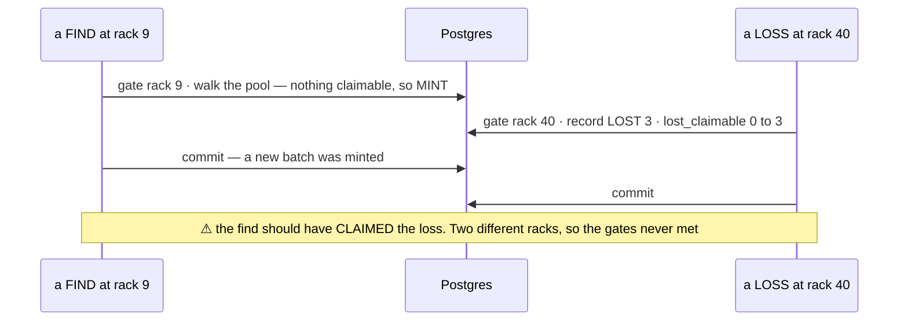

The pool is a **range predicate**, and `FOR UPDATE` locks only rows that exist when it runs — so a `LOST`
committing on **another shelf** mid-find is invisible to it. Neither a rack gate nor a row lock closes that.

**→ Recommend:** a second gate kind — **`GatePool(warehouseID, productID)`**, one advisory lock per
`(warehouse, product)`, taken by every action that reads *or* moves `lost_claimable`. It is the smallest scope that
makes the pool **equality** provable, and it must be taken by `LOST` too, not only by a find — a gate one side
skips is not a gate.

⚠ **This means the gate is not one list of racks.** It is *"everything this action will touch"*, and the pool is a
different axis from a rack. Which is another reason it cannot be a bare `[]rackID` the handler types.

#### how it gets proved

Per the `audit-sql` skill, with `san_race` (real pool, two transactions, build tag `raceaudit`) — not
`san_testdb`, because two goroutines in one transaction never block on each other:

| test | expect |
| --- | --- |
| move 1→2 and 2→1 concurrently, **with** the gate | both succeed, one waits. **No `40P01`** |
| the same, **gate removed** — a negative control | `40P01` reproduces. If it does not, the test is not actually racing |
| two first-ever placements of one layer on one shelf | no `23505` escapes to the caller |
| a `LOST` at rack 40 interleaved with a find at rack 9 | the find **claims**, never mints — this one fails today, see the hole above |

#### the recommendation, in full

**Five rules. The session gates, the handler declares only a SET, and discovery lives in the verb that needs it.**

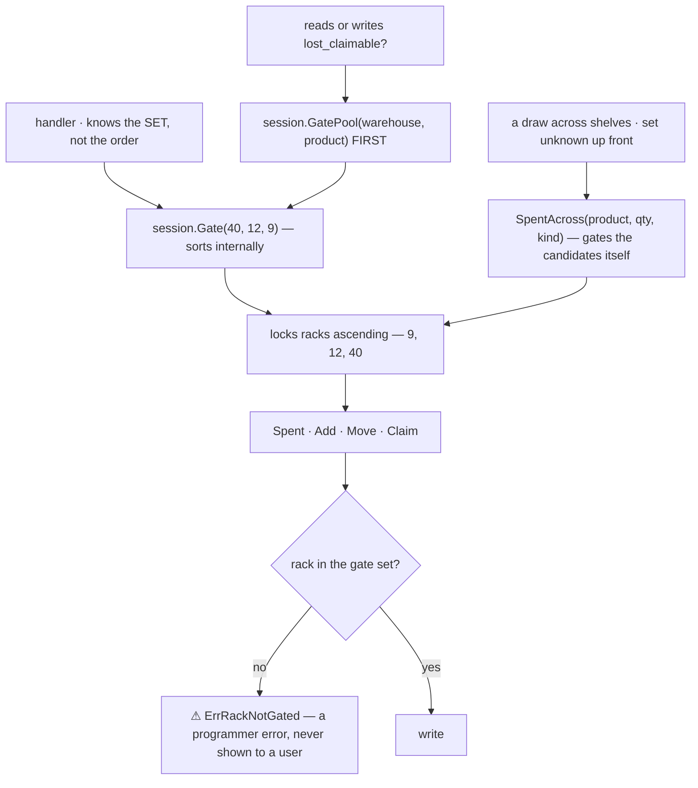

| # | rule | why this and not the alternative |
| --- | --- | --- |
| **1** | **`Gate(rackIDs…)` sorts internally** | the handler declares a **set**, never an order. ⚠ This is the crux: *"remember to pass them ascending"* is a rule that gets forgotten, *"pass the racks you will touch"* is not. The one place that knows the ordering rule is the one place that implements it |
| **2** | **every verb refuses an ungated rack** — `ErrRackNotGated` | a programmer error, surfaced as `Internal` and loud in tests, never a user-facing condition. This is what makes the chokepoint real rather than advisory |
| **3** | **a draw whose racks are unknown gets its own verb** — `SpentAcross(product, qty, kind)` | it reads the candidate racks, gates them ascending **itself**, then walks. So the handler never pre-queries to satisfy a lock rule, and [fifo](fifo.md)'s *"lock every rack first, then plan"* is implemented once instead of per caller |
| **4** | **`GatePool(warehouseID, productID)`, and `LOST` takes it too** | the pool is a range predicate on a different axis, so no rack gate can cover it. Taken by both sides or it is not a gate |
| **5** | **pool gate BEFORE rack gates, one gate per session, before the first verb** | two lock axes need an order between them or they deadlock against each other. Pool-first is the natural one — the pool read is what decides which racks are involved. A later `Gate()` with a new rack is refused: it would lock after writes began |

**Build order, if it is not all at once: rule 4 first.** The rack gate buys **availability** — without it you get intermittent `40P01` that a retry hides. The pool gate buys **correctness** — without it a find **mints new stock** instead of claiming a loss committed on another shelf, and nothing ever detects that, because both outcomes reconcile.

⚠ **What I am deliberately not recommending yet:** advisory locks per `(rack, product)` instead of the coarse
rack row. It is narrower and phantom-proof, and it is invisible to anyone reasoning about locks per table — so it
is worth its debugging cost only once the coarse gate is **measured** to hurt.

#### what happens inside the gate

⚠ **There is no `Release()`. A row lock and `pg_advisory_xact_lock` both hold until `COMMIT`** — so *"inside the
gate"* is **the entire rest of the transaction**, not a short block. Everything the handler does after gating is in
the critical section, whether it needs to be or not.

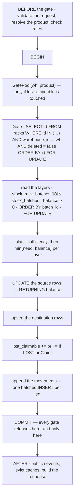

| op inside | does it need the gate? | |
| --- | --- | --- |
| the gate `SELECT` on `racks` | — | ✅ **it also validates.** `AND warehouse_id = :wh AND deleted = false` in the same statement means `rackExists` — [duplicated in five handlers today](stock_movement_log.md) — **collapses into gating.** It becomes impossible to lock a rack without having checked it |
| the layer read | ✅ | ⚠ **one table, no join** — see [the-walk-is-one-table](#the-walk-is-one-table). `stock_rack_batches` already carries every column a movement needs |
| the plan | ✅ | it is only valid under the lock. Planning outside is [fifo](fifo.md)'s *"plan-then-lock"* mistake |
| the state writes | ✅ | `RETURNING balance` is where `after_balance` comes from |
| the `lost_claimable` moves | ✅ the **pool** gate | the rack gate is not the one that matters here |
| the movement appends | ❌ | they need the **transaction**, not the gate — new rows, protected by the unique index. They sit inside only because the gate cannot be released early. **So batch them**: their duration is contention |

**⚠ What must never be inside — the rule is "everything that can be done before the gate, MUST be":**

| | why |
| --- | --- |
| **any network call** — another service's RPC, a Pub/Sub publish, an HTTP hop | it holds a shelf's gate across someone else's latency. A slow dependency then serialises the whole rack, and the failure looks like *"stock is slow"* rather than *"that service is slow"*. `PostCODFee` is the one exception, and only because it is the **same database** |
| **request validation, product lookups, role checks** | they cannot fail differently under the lock, so every millisecond they take is pure contention |
| **a second `Gate()` with new racks** | it locks after writes began — out of order by definition |
| **any retry or backoff** | the transaction is already dead after an error ([an-abort-is-the-whole-undo](#an-abort-is-the-whole-undo)). Retry the whole thing from outside, with a new session |

✅ **A consequence worth taking: `RackDelete` should take the same gate.** stock_design leaves it as
*"a rack holding stock must be refused in CODE — `RackDelete` sums its balances first, and the nightly reconcile
re-checks it"*, which is a **check-then-act**: a move can land on the shelf between the sum and the soft delete.
Gating the rack closes it inside the transaction, and the reconcile stops being the thing that catches it.

**The performance rule this implies:** the contention window is the **transaction's** duration, not the RPC's. So
the `audit-rpc-performance` measurement that matters here is time-from-gate-to-commit — an RPC that is fast
overall but holds a gate through a 200ms publish is the one that hurts a shelf being worked in pairs.

### the-ledger-is-stock-movements

**✅ The appender writes `stock_movements` only, and the term is always qualified (owner).** The
`prepare` → `append` → `save` split stays, and the
boundary is: the session knows a row's **place and balance**, the appender knows the **append-only discipline** for
one table.

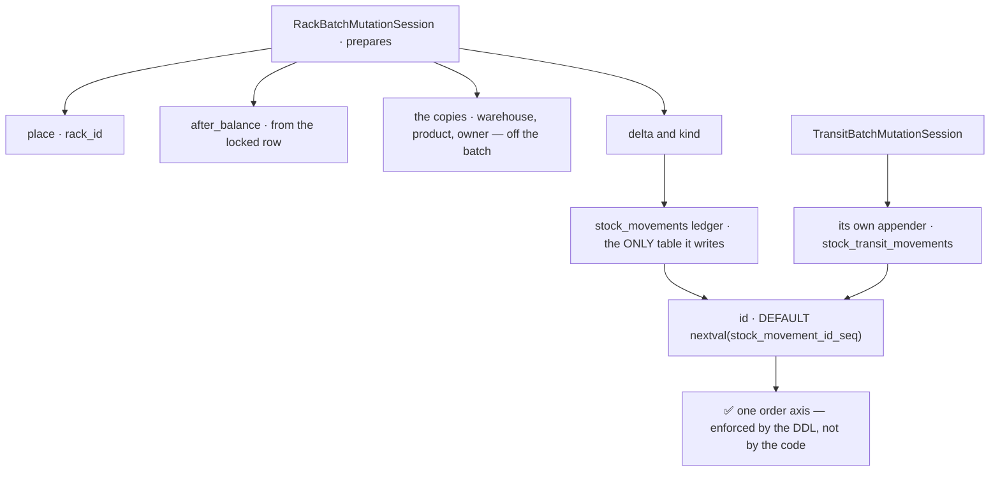

**This is more consistent with the schema than one shared writer was.** stock_design separates on **write** (two
`NOT NULL` tables, so *"neither, or both"* stops being expressible) and unifies on **read** (the read-only
`stock_ledger` view). Two appenders mirror that; one appender re-merged in Go what the tables had just been split
apart to keep separate.

⚠ **Correction to my own argument for one writer:** the order axis does **not** depend on it. Both tables declare
`id BIGINT PRIMARY KEY DEFAULT nextval('stock_movement_id_seq')`, so interleaving is a property of the **DDL** —
two writers cannot break it. stock_design's *"the shared `SEQUENCE` is load-bearing"* is about the column default,
which is exactly where it belongs.

**→ Recommend, so the split cannot rot:**

| | |
| --- | --- |
| ✅ **`Ledger` keeps the owner's name** | it is the label for `stock_movements`, and that is all it needs to be. ⚠ My `RackLedger` **and** the `StockMovementsLedger` taxonomy that followed it are both **withdrawn** — a definition does the work a prefix was buying |
| ⚠ **neither appender ever supplies `id`** | that is the one way two writers *could* break the order axis — an explicit id from a backfill, a fixture, or a `COPY` import. Let the `DEFAULT` fire, always |
| **both keep the same three disciplines** | append-only (no `UPDATE`, no `DELETE`, ever) · the `(txn, place, batch)` unique index · `after_balance` meaning *"that PLACE, that batch"* |
| **`after_balance` is easier apart than together** | its grain is per-place, and a rack and a transfer are different places. One writer had to hold both meanings at once |

⚠ **`after_balance` must come from `UPDATE … RETURNING balance`, not from a read plus arithmetic in Go.** The
flow's *"update `(batch 2, qty 9)`"* and *"prepare ledger log"* are two steps over the same number, and the row is
already locked — so returning it from the update is both cheaper and impossible to get out of step. Computing it
from the earlier `walk` read means two sources for one value, which is how an `after_balance` ends up disagreeing
with the balance it claims to describe.

⚠ **Batch the inserts, one per leg.** As drawn, a move over `N` layers is `N` updates + `N` inserts per leg. The
inserts are all the same shape, so they are one multi-row `INSERT` — worth doing because it is `2N` round trips
turning into `2`, and the per-RPC performance audit will otherwise find it.

### rows-are-never-deleted

**✅ The session UPDATEs to 0 and leaves the row (owner).** My correction — *delete only when
`lost_claimable = 0`* — is **withdrawn.** Never deleting is stronger than deleting carefully, on four counts:

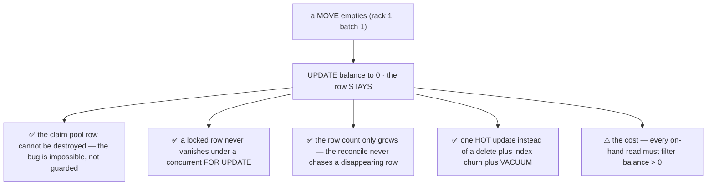

| | |
| --- | --- |
| **the claim pool is safe by construction** | *"a rack that lost its whole stock keeps its row exactly as long as the loss is still claimable"* stops being a rule anyone can break |
| **concurrency gets simpler** | a row that is `FOR UPDATE`-locked and then deleted by the winner forces the loser to re-check whether its row still exists. Rows that only ever appear remove that case entirely — and once a `(rack, batch)` exists, its lock is stable forever |
| **it is cheap** | one row per `(rack, batch)` ever used ≈ `O(batches × racks-per-batch)`, the same order as `stock_batches` itself. Millions of rows over years, all indexed |
| ⚠ **the cost is on the READ side** | *"what is on this shelf"* must say `balance > 0`, every time. Forget it once and a shelf screen lists layers that are not there |

**→ Recommend, so the read cost does not bite:** make the on-hand indexes **partial**. stock_design's three
(`_wh_product_idx`, `_rack_idx`, `_owner_idx`) are unfiltered, which with nothing ever pruned means they index
dead rows forever:

```sql
CREATE INDEX stock_rack_batches_wh_product_idx
    ON stock_rack_batches (warehouse_id, product_id) WHERE balance > 0;
CREATE INDEX stock_rack_batches_rack_idx
    ON stock_rack_batches (rack_id)                  WHERE balance > 0;
CREATE INDEX stock_rack_batches_owner_idx
    ON stock_rack_batches (owner_team_id, warehouse_id, product_id) WHERE balance > 0;
-- the claim-pool index is ALREADY partial, on lost_claimable > 0. Same reasoning, one decision earlier.
```

⚠ **The rack gate is still needed** ([the-rack-is-the-lock-token](#the-rack-is-the-lock-token)). Rows only ever
appear, but the **first** placement of a layer on a shelf still has no row to lock — so the phantom is rarer, not
gone.

### a-layer-is-written-once-per-action

The flow writes inside the verbs, and for a move that is safe: `Spent` writes at rack 1 and `Add` at rack 2, so
the rows never collide. **It stops being safe the moment one action touches one `(rack, batch)` twice** —
`stock_movements_txn_once` is `UNIQUE (inventory_transaction_id, rack_id, batch_id)`, so the second write is a
constraint violation surfacing mid-handler, with half the action already written.

**→ Recommend: keep the streaming shape** — the earlier `Flush()` proposal is **withdrawn**, it bought protection
this flow does not need and cost the caller the ability to read its own results — and give the session a
**written-set** instead: it remembers every `(rack, batch)` it has emitted and refuses a second one with a
sentence a programmer can act on. Never by rewriting the earlier row: the `stock_movements` ledger is append-only,
so merging two touches after the fact is not available.

### the-verbs-are-directions-kind-is-a-parameter

Three verbs cannot carry nine kinds. stock_design is explicit: *"`delta` is signed independently of `kind` —
`kind` says which ACTION, the sign says which direction."* `Add()` is `RECEIVE` **or** `RETURN` **or**
`TRANSFER_IN`, and nothing in the flow says which.

**→ Recommend:** `kind` is a required argument, and the verb constrains which kinds are legal —
`Add(…, RECEIVE)` fine, `Add(…, PICK)` refused at the door. `Move()` is the exception: it **is** its kind, on
both legs, which is why it can take none.

### the-walk-is-one-table

**✅ `Spent()` walks `stock_rack_batches` (owner) — it is a single-table read, not a product lookup.**
`product_id` is a **predicate on the row**, never a join, because the state row already carries the copies:

```sql
SELECT batch_id, product_id, owner_team_id, warehouse_id, balance
  FROM stock_rack_batches
 WHERE rack_id = :rack AND product_id = :product AND balance > 0
 ORDER BY batch_id
   FOR UPDATE;
```

⚠ **So my *"join `stock_batches` for the copied columns"* is withdrawn.** Every column a movement needs is on
that row already:

| `stock_movements` needs | comes from |
| --- | --- |
| `rack_id` · `batch_id` · `warehouse_id` · `product_id` · `owner_team_id` | ✅ the `stock_rack_batches` row |
| `delta` · `kind` | the verb |
| `after_balance` | the `UPDATE … RETURNING` on that same row |
| `inventory_transaction_id` | the session |

**Nothing on `stock_batches` is required** — `unit_cost` and `expires_on` never reach a movement, so the mutation
never reads the batch table at all. ✅ **This is what those copies are FOR**, and stock_design says so: *"a COPY
of the batch's — for the read index"*. A join here would have paid for a column already sitting in the row being
locked.

### a-named-layer-verb-has-no-caller-here

⚠ **Withdrawn — I pulled in a flow that is not this one.** I justified a `SpentAt(rack, batch, qty, kind)` with
*"`BROKEN` and a scanned pick are observations"*. Both are true and **neither belongs to the move flow**:

| | it is actually | why it is not a `Spent` variant |
| --- | --- | --- |
| `BROKEN` · `LOST` · `FOUND` | **`StockAdjust`**, driven by a `reason_type` | it takes a **signed quantity on a named batch** — it never walks, so there is nothing to narrow. And a `DAMAGED`/`LOST` adjust is also meant to **write the frozen cost off to `expense_service`** — money the move flow has none of. Folding it into `Spent` would hide that |
| a **scanned** pick | the pick flow, undesigned here | [batch_selection P6](batch_selection.md) already rules it — the scan records, FIFO only suggests |

**In the move flow itself there is no caller for a named-layer verb.** A move's layers come from the walk
([the-move-flow](#the-move-flow)), so `Spent(rack, product, qty, kind)` is the whole surface this doc needs.

**→ Recommend: decide it in the doc that designs the adjust and the pick**, not here. One observation worth
carrying there, because it is cheap and easy to miss: a named-layer draw is **the same walk with a narrower
`WHERE`** (`rack_id AND batch_id` instead of `rack_id AND product_id`), so it should be one walker rather than a
second code path — otherwise the sufficiency check and the `balance = 0` handling drift apart.

⚠ **One shape this doc genuinely might need and I am not proposing yet: clearing a WHOLE shelf** — every product,
every layer, no quantity. That is a real job (a shelf being decommissioned) and the one case where dropping the
`product_id` predicate is not nonsense.

### the-claim-pool-needs-a-fourth-verb

`lost_claimable` is an **equality** the reconcile checks — `Σ lost_claimable = Σ |LOST| − Σ RECOUNT⁺` — and one of
the two kinds that moves it touches **two rows for one unit**:

| | |
| --- | --- |
| `LOST` | `Spent` at `(R, b)` **and** `lost_claimable += q` at the same row |
| a **claim** | `balance += q` at the rack it was **found** at, **and** `lost_claimable −= q` at the rack it was **lost** from — a different row, often a different shelf |

`Add(kind = RECOUNT)` has one place argument for a two-place operation.

**→ Recommend:** `Claim(lossRackID, foundRackID, batchID, qty)` — visible in the API precisely because it is the
one verb that names two places. `LOST` stays inside `Spent`, keyed on kind.

### it-does-not-mint-and-it-does-not-cross-the-wall

**→ Recommend:** two hard exclusions, both from stock_design's own rules.

| | |
| --- | --- |
| **it never creates a batch** | minting **freezes** `unit_cost`, `owner_team_id`, `expires_on`, `arrived_qty` — decisions, not mutations. `Add` takes a `batch_id` that exists |
| **it never crosses a warehouse** | *"a batch never leaves the warehouse it was minted in"*, and an `inventory_transaction` names **one** building. A transfer is [three transactions](restock_reversal.md#move-is-not-a-transfer) — three sessions, not one call with two warehouse ids |

### the-copies-come-from-the-batch-never-from-the-caller

`warehouse_id`, `product_id` and `owner_team_id` are **copied** onto both tables and no constraint can check
them — *"the batch is authoritative, the rest are copies the reconcile checks"*.

**→ Recommend:** the session reads them off the batch row it has already locked, and **the signature offers no
way to pass them.** This is the strongest single argument for the object: the drift that produced *"Why not the
obvious thing §1"* stops being expressible. Same for `rackExists(warehouse, rack)`, today repeated in **five**
handlers, where the session's one `inventory_transaction` already names the only legal warehouse.

### the-transit-legs-need-a-sibling

A dispatch is `Spent` at a rack **and** `Add` on a **transfer** — `stock_transit_batches` +
`stock_transit_movements`. As named, the second leg has no home. The tempting fix is a `place` parameter that is
*rack-or-transfer*: ⚠ that re-unifies in Go exactly what *"§2 · TWO ledger tables for ONE ledger"* split apart to
kill nullable places.

**→ Recommend:** a sibling **`TransitBatchMutation`** with the same verbs over the transit pair, and — per
[the-ledger-is-stock-movements](#the-ledger-is-stock-movements) — **its own appender**. Two sessions, two
appenders, one sequence held by the DDL.

⚠ **A dispatch spans both, inside ONE `inventory_transaction`:**

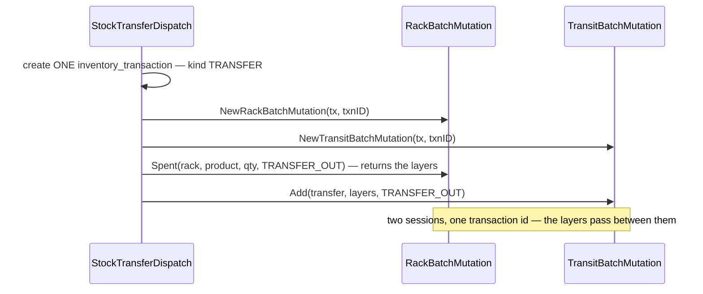

So *"one session per `inventory_transaction`"* becomes **one session per `(place kind, inventory_transaction)`**.
The transaction id is what ties the two halves together, which is exactly what it is for.

---

## Proposed Design

```go
// One session per inventory_transaction — NOT per db transaction. A reversal writes a new
// transaction inside the same tx, so two sessions on one tx is normal, not an abuse.
type RackBatchMutation interface {
    // walks oldest-first and reports the layers it took
    Spent(rackID, productID uint64, qty int64, kind MovementKind) ([]Layer, error)
    // one named layer — a scan, BROKEN, UNRECEIVE
    // ⚠ no named-layer draw here — it has no caller in the move flow. See
    // a-named-layer-verb-has-no-caller-here: BROKEN, a scanned pick and UNRECEIVE
    // all name their layer, and all three belong to flows this doc does not design.
    Add(rackID uint64, layers []Layer, kind MovementKind) error
    // locks both racks ascending, then Spent + Add with the same layers
    Move(fromRackID, toRackID, productID uint64, qty int64) ([]Layer, error)
    // the only verb naming two places — the claim pool's equality lives here
    Claim(lossRackID, foundRackID, batchID uint64, qty int64) error

    Movements() []Movement   // what this session wrote, for the response
}

func NewRackBatchMutation(tx *gorm.DB, inventoryTransactionID uint64) RackBatchMutation
```

**What the session owns**, so that no handler can:

| | |
| --- | --- |
| the lock order | ascending rack id, then `ORDER BY batch_id` — [fifo](fifo.md)'s expression, unchanged |
| sufficiency | checked against the locked rows **before** the first write |
| `after_balance` | from the locked row plus the delta. Not readable any other way |
| the copies | off the batch. Unpassable |
| ✅ **no deletes** | an emptied row is `UPDATE`d to 0 and stays. Nothing in the write path removes a row |
| `lost_claimable` | `+=` on `LOST`, `−=` on a `Claim`. Nowhere else |
| one row per `(action, rack, batch)` | the written-set guard |
| the warehouse | one per `inventory_transaction`, so one per session |

### every kind, and which verb writes it

| `kind` | verb | dir | also touches |
| --- | --- | --- | --- |
| `RECEIVE` | `Add` | + | nothing — the batch was minted before the session ran |
| `RETURN` | `Add` | + | nothing |
| `TRANSFER_IN` | `Add` | + | the destination batch, minted per source layer beforehand |
| `RECOUNT` ⁺ | **`Claim`** | + | `lost_claimable −=` at the **loss** row |
| `PICK` | `Spent` | − | ⚠ a **scanned** pick names its layer — the pick flow, not this doc |
| `BROKEN` | ⚠ **not this doc** | − | `StockAdjust`, by `reason_type`: a signed quantity on a named batch, plus a cost write-off to `expense_service` |
| `LOST` | `Spent` | − | `lost_claimable +=` at the same row |
| `TRANSFER_OUT` | `Spent` | − | the transit leg, via the sibling |
| `MOVE` | `Move` | ∓ | two rows per layer, one batch, source first |
| `UNRECEIVE` *(proposed)* | ⚠ **not this doc** | − | it names the acceptance's own layers — [restock_reversal](restock_reversal.md#unreceive-is-its-own-kind) |
| `RECOUNT` ⁻ | ⚠ **nothing writes it** | − | see [# Contradiction](#contradiction) |

### the decisions this doc proposes

| name | what it decides |
| --- | --- |
| [an-abort-is-the-whole-undo](#an-abort-is-the-whole-undo) | ✅ **owner** — an error aborts the transaction and that is the entire undo. ⚠ except the sequence, anything outside the db, and Go-side state |
| [the-rack-is-the-lock-token](#the-rack-is-the-lock-token) | ✅ **owner** — the gate is the `racks` row, ascending id. It also replaces `rackExists`, and `RackDelete` should take it |
| [gates-are-declared-then-enforced](#gates-are-declared-then-enforced) | `Gate(rackIDs…)` **sorts internally** — the handler declares a set, not an order · verbs refuse an ungated rack · `SpentAcross` gates its own discovered racks · **`GatePool(warehouse, product)` first, and `LOST` takes it too** |
| [the-ledger-is-stock-movements](#the-ledger-is-stock-movements) | ✅ **owner** — `Ledger` writes `stock_movements` only, keeps its name, never supplies `id`. `after_balance` from `RETURNING` |
| [rows-are-never-deleted](#rows-are-never-deleted) | ✅ **owner** — `UPDATE` to 0, the row stays. The on-hand indexes become **partial on `balance > 0`** |
| [a-layer-is-written-once-per-action](#a-layer-is-written-once-per-action) | streaming writes stay, guarded by a written-set. `Flush()` **withdrawn** |
| [the-verbs-are-directions-kind-is-a-parameter](#the-verbs-are-directions-kind-is-a-parameter) | `kind` is required and range-checked per verb. `Move` is its own kind |
| [the-walk-is-one-table](#the-walk-is-one-table) | ✅ **owner** — a single-table read on `stock_rack_batches`. **No join to `stock_batches`**, because the copies are on the row |
| [a-named-layer-verb-has-no-caller-here](#a-named-layer-verb-has-no-caller-here) | ⚠ **withdrawn** — `BROKEN`, a scanned pick and `UNRECEIVE` name their layers, and all three belong to other flows. Decide it there |
| [the-claim-pool-needs-a-fourth-verb](#the-claim-pool-needs-a-fourth-verb) | `Claim` — the only verb with two places |
| [it-does-not-mint-and-it-does-not-cross-the-wall](#it-does-not-mint-and-it-does-not-cross-the-wall) | no batch creation, no second warehouse |
| [the-copies-come-from-the-batch-never-from-the-caller](#the-copies-come-from-the-batch-never-from-the-caller) | the copied columns are unpassable |
| [the-transit-legs-need-a-sibling](#the-transit-legs-need-a-sibling) | `TransitBatchMutation` + its own `TransitLog` appender, no rack-or-transfer place union |

---

# Contradiction

## the schema says an emptied row is pruned — the write path never prunes

> **stock_design, on `stock_rack_batches`:** *"⚠ An emptied row **is pruned**, so the prune condition is
> `balance = 0 AND lost_claimable = 0`."*

> **the owner's write path:** *"we just **update** `(batch 2, qty 9)` and `(batch 1, qty 0)` and **no delete**."*

**Nothing deletes, so the prune condition governs nothing.** It is not a dangerous contradiction — it is a rule
describing behaviour that does not exist, which stock_design itself calls *"worse than one that stays quiet"* in
its own debts section.

**→ RECOMMEND:** the sentence becomes *"a row is never deleted — an emptied row stays at `balance = 0`"*, and the
consequence it was hiding gets written down instead: **the on-hand indexes must be partial on `balance > 0`**,
because with nothing pruned an unfiltered index accumulates dead rows for the life of the system
([rows-are-never-deleted](#rows-are-never-deleted)).

⚠ **The direction of my own correction was wrong and is withdrawn.** I read *"delete"* in the flow and argued for
a **safer delete**; the answer was **no delete at all**, which makes the claim-pool bug impossible rather than
merely guarded. What stops that recurring: **when a step looks unsafe, ask whether the step is needed before
proposing a condition on it.** A guard on an operation is strictly weaker than not having the operation.

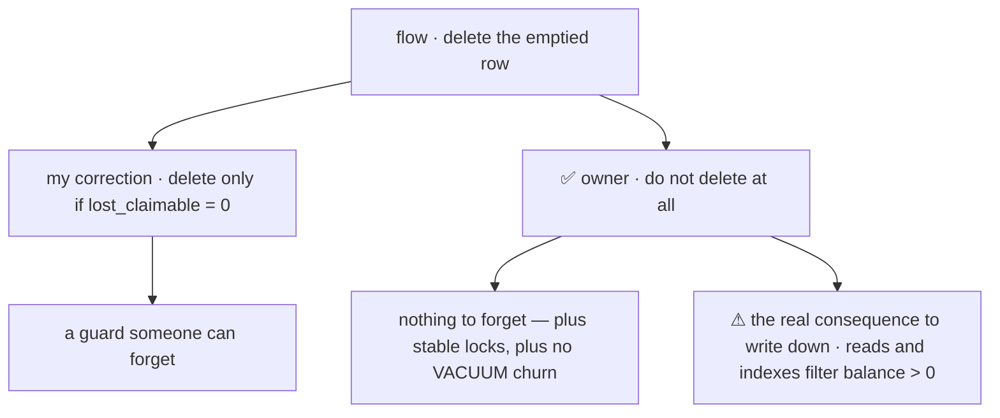

## `RECOUNT` down is a kind with no term in the invariant

Building the kind table is what surfaced it — the row had nowhere to go.

> **stock_design, `stock_movements.kind`:** `RECEIVE PICK MOVE TRANSFER_OUT TRANSFER_IN RETURN RECOUNT LOST BROKEN`

> **stock_design, the per-batch invariant:** `found = Σ delta WHERE kind = RECOUNT AND delta > 0` — and no term
> anywhere for a negative one

> **batch_selection P2:** lists **`LOST` · `RECOUNT` down** as consumptions, both computed pro-rata

A `RECOUNT` with a negative delta satisfies no term on either side, and the claim-pool equality misses it too —
that one counts `Σ |LOST|`.

**→ RECOMMEND:** a shortfall found by counting **is** a `LOST` — that is what makes it claimable back by a later
find. So `RECOUNT` is **positive-only** and P2's row is dead text. What stops it recurring: **a `kind` is not
designed until it appears on BOTH sides of the invariant.**

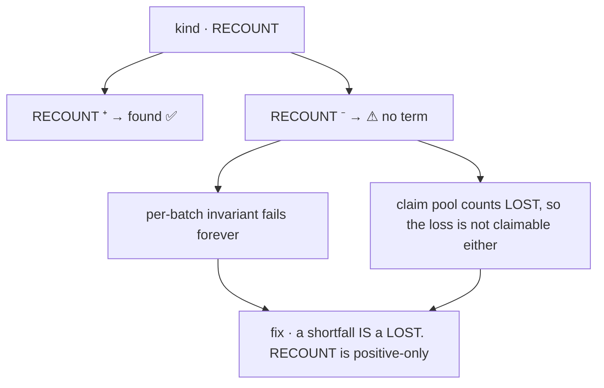

---

## Question

1. **`Gate(…)` — handler declares, session enforces?** The gate **object** is settled — the `racks` row, ascending.
   Two things are left, and the second is the one I would want your answer on most:
   - a gate set is sometimes **discovered by the very query that needs the lock** (a FIFO draw across shelves), so
     `Gate()` takes a preliminary query's output, not a hand-typed list;
   - ⚠ **`Claim()` is not rack-scoped at all** — the pool is walked warehouse-wide for a product, so a
     `LOST` committing on another shelf mid-find is invisible to it. That needs a second gate kind,
     `GatePool(warehouse, product)`, taken by **`LOST` as well as by a find**.
2. **`Claim` as a fourth verb?** The pool's equality needs two rows touched for one unit, and no three-verb
   signature can express that.
3. **`RECOUNT` positive-only?** It is the cleanest reading, it costs nothing today, and it makes every shortfall
   claimable by the same rule.
4. **Is *clearing a whole shelf* a real job?** Every product, every layer, no quantity — the one case where the
   walk legitimately drops its `product_id` predicate. If the answer is yes it wants a verb here, and if no I will
   stop mentioning it.
