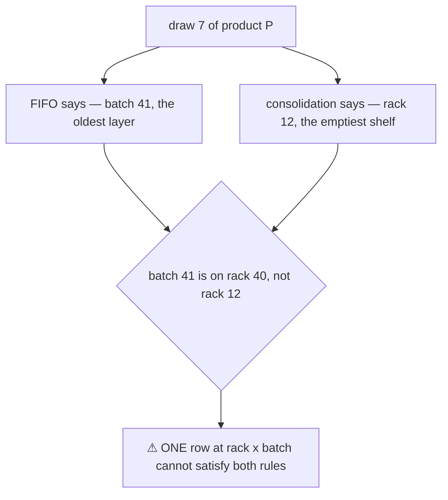
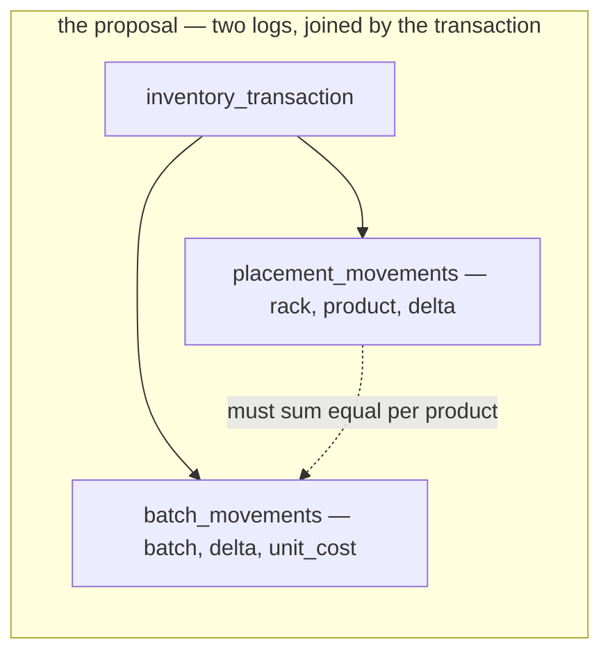
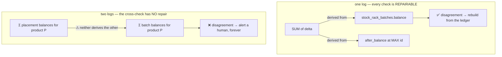
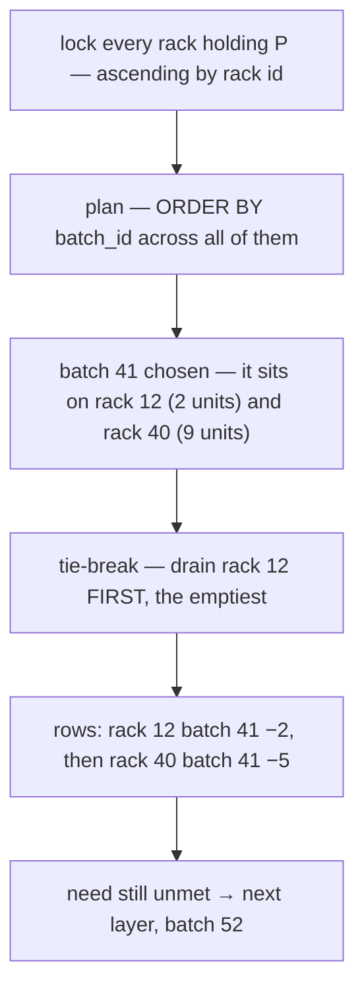
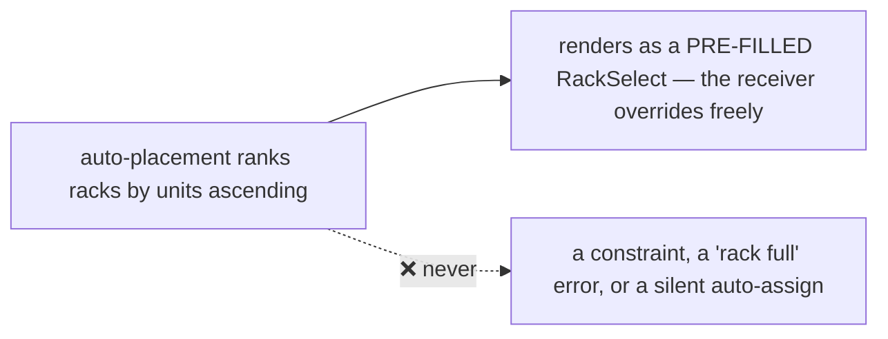
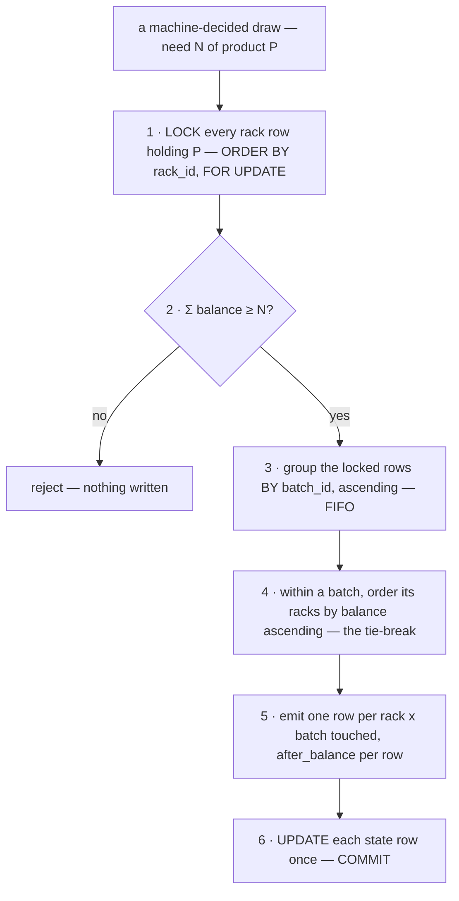
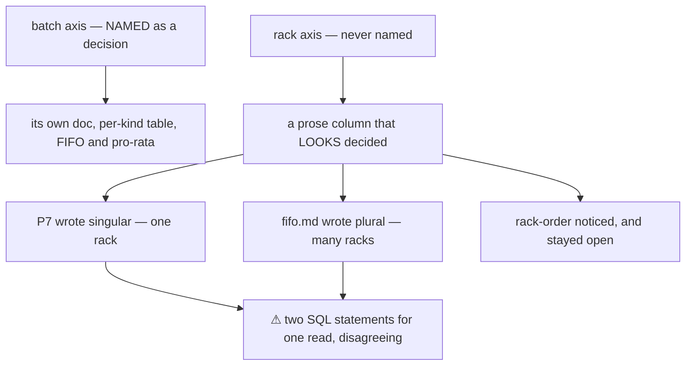

# Rack Selection — which SHELF a draw takes from, and where a receipt puts goods

> ⚠ **GRAIN CHANGED — [ledger-splits-by-question](database/stock_design.md#ledger-splits-by-question) (owner, 2026-08-07).**
> The ledger splits into a **placement** ledger (no `batch_id`) and a **batch** ledger (no `rack_id`), so
> `(rack, batch)` is no longer a grain. **Rules below phrased in those terms are superseded** — see
> [the-cross-product-grain-was-assumed-everywhere](database/stock_design.md#the-cross-product-grain-was-assumed-everywhere).
> This doc is rewritten once the open sub-parts settle, not before.

> ⚠ **`disscuss/` is NOT final.** Mid-argument. Do not build from this.

The mirror of [batch_selection.md](batch_selection.md): that one decides **who chooses the batch**, this
one decides **who chooses the rack**. It exists because the owner asked whether the two axes want
**two separate logs** — one for batches, one for placements.

Siblings: [batch_selection.md](batch_selection.md) · [fifo.md](fifo.md) ·
[stock_movement_log.md](stock_movement_log.md)

> Decisions here are **NAMED and LINKED** (HARD RULE 12).

# Proposal

**Nothing closed yet.** Everything below is argument.

---

## The question, as it actually is

Two features want two different orderings over the same stock:

| Feature | Axis it cares about | Its ordering | Cares about the other axis? |
| --- | --- | --- | --- |
| **pricing queue — FIFO** | `batch` | `ORDER BY batch_id` (oldest layer) | ❌ a rack is an address, not an age |
| **auto placement / provisioning** | `rack` | `ORDER BY balance` (emptiest shelf) | ❌ a shelf does not care whose delivery it holds |



**That collision is real, and it is what the two-log proposal answers.** It is not a schema preference —
the current grain forces one rule to be primary and nothing has said which.

---

## Proposed — still open

| Decision | Proposed |
| --- | --- |
| [pairing-is-physical](#pairing-is-physical) | **`(rack, batch)` is a MEASURABLE fact, not a cross-product** — so it cannot be stored as two independent numbers |
| [two-axes-one-row](#two-axes-one-row) | ⚠ **The log does NOT split.** One ledger row carries both axes. A rack-grain balance is a **rollup**, not a second log |
| [fifo-then-consolidate](#fifo-then-consolidate) | **FIFO picks the layer, the rack is the TIE-BREAK inside it** — the emptiest rack holding the chosen batch. Consolidation is a preference, not an override |
| [placement-is-a-suggestion](#placement-is-a-suggestion) | **Auto put-away RANKS racks, it never constrains one** — P1b deliberately does not model capacity, so "few stock" is a hint a person overrides |
| [split-when-cost-moves-alone](#split-when-cost-moves-alone) | The trigger that WOULD justify a second log is a **cost-only event** (revaluation, landed cost). It does not exist yet — revisit then, not now |

---

## pairing-is-physical

**The steelman for splitting first, because it is a good argument.** FIFO is *already* a costing
convention rather than a physical claim — [batch_selection P3](batch_selection.md) says so outright for
losses (*"an accounting attribution, never a physical claim"*), and [P4](batch_selection.md) confirms
`expires_on` drives no system behaviour. If the batch axis is money and the rack axis is place, then
forcing them onto one row is exactly the confusion, and two logs is the honest model:



**Where it breaks: the pairing is not derived, it is observed.**

| | |
| --- | --- |
| **a RECEIVE observes it** | the receiver shelves 60/25/15 across three racks (P1b). The delivery is a batch — so which batch sits where is a **recorded fact at birth**, not a computation |
| **an ORDER pick observes it** | the picker scans a batch label **while standing at a rack** ([batch_selection P6](batch_selection.md)). Both axes come from one human at one moment |
| **a cycle count measures it** | somebody counts *a shelf*. The recount's pro-rata base is explicitly *"the batches on that shelf"* ([batch_selection P3](batch_selection.md)) — with no pairing, that base widens to every batch in the building, and a different **owner** bears the loss ([batch_selection P5](batch_selection.md)) |
| **a recall needs it** | *"supplier recalled batch 41 — go get it"* has no answer without it |

→ **Recommend: keep the pairing.** Two of the three write paths *already know it for free*, and throwing
away a fact you were handed is not the same as declining to compute one.

## two-axes-one-row

⚠ **The decisive objection is [P20](stock_movement_log.md), not aesthetics.** The owner already ruled:
*a copy disagreeing with its source is REPAIRED — two sources disagreeing is an ALERT.*



Splitting adds a **fifth reconcile check that P20 cannot classify**. Both sides are independent sources
of truth, so when they diverge there is no rule for which one is right — and P15 exists precisely because
*"a copy nothing enforces is a copy nothing notices going wrong."*

⚠ **And it is the war [P1](stock_movement_log.md) already won.** `stock_levels` vs `stock_shelf_batches`
were exactly this: two snapshots at two grains, *"must agree, nothing checks"*. Splitting reinstates that
shape in a new costume — this time as two **logs**, which is worse, because a log is append-only and
cannot be corrected by an `UPDATE`.

### What the placement feature actually needs is a NUMBER, not a LOG

```sql
-- "which racks are emptiest for product P" — one index seek on stock_rack_batches (rack_id)
SELECT rack_id, SUM(balance) AS units
  FROM stock_rack_batches
 WHERE warehouse_id = :w AND product_id = :p AND balance > 0
 GROUP BY rack_id
 ORDER BY units ASC;
```

**A rollup, on the index [P2](stock_movement_log.md) already specifies.** No second table, no second
ledger, no fifth reconcile. The rack rule gets its own `ORDER BY` — it just does not get its own log.

⚠ **The one thing genuinely lost by NOT splitting:** a `MOVE` is a physical-only event, so it writes two
ledger rows that change no cost layer at all. That is noise in the batch lens — and [P5](stock_movement_log.md)
already handles it, filtering `kind <> MOVE` in the owner query. Noise, not a defect.

## fifo-then-consolidate

**FIFO chooses the layer. The rack is the tie-break WITHIN that layer.**

The two rules only actually collide when the chosen batch sits on several racks — which is exactly the
fragmentation case consolidation exists for. So the tie-break gets consolidation for free, at zero cost
to FIFO:



| Alternative | FIFO | Consolidation | Verdict |
| --- | --- | --- | --- |
| **rack-primary** — drain emptiest racks, FIFO inside them | ⚠ **local only** — an old layer on a full shelf is skipped indefinitely | ✅ strong | ❌ FIFO with exceptions is not FIFO |
| **[fifo-then-consolidate](#fifo-then-consolidate)** | ✅ exact | ⚠ weaker — only consolidates within the layer being drawn | ✅ **recommend** |
| **two logs** | ✅ exact | ✅ strong | ❌ [two-axes-one-row](#two-axes-one-row) |

→ **Recommend [fifo-then-consolidate](#fifo-then-consolidate).** FIFO is a **money** rule and must not
have exceptions — money rules that bend for convenience stop being auditable. Consolidation is an
**efficiency preference**, and a preference belongs in a tie-break, not in an override.

✅ **This CLOSES [rack-order](fifo.md#rack-order)**, and it closes it as recommended there — *"a rack is
an address, not a fact about age"* — adding only the tie-break, which that section did not consider.
Its locking constraint survives verbatim: **all racks locked ascending by `rack_id`, then plan across
them.** Selection order and lock order stay different expressions and never conflict.

## placement-is-a-suggestion

The inbound half — *"which rack should these 100 units go on?"*

⚠ **"Few stock" can only mean FEW UNITS, and units are a poor proxy for space.** [P1b](stock_movement_log.md)
deliberately models no capacity: *"no `max_units`, no 'rack full' error."* So the system cannot know that
100 screws fit where 100 monitors do not.



→ **Recommend: rank, pre-fill, never enforce.** It is the same shape [batch_selection P6](batch_selection.md)
already chose for batches — *the system suggests, the human's action is what gets recorded.* Making it a
constraint would smuggle a capacity model in through the back door, which P1b closed on purpose.

⚠ **Open sub-question:** should the ranking prefer a rack that **already holds this product** (keep a
product together) over the **emptiest** rack (keep shelves free)? Those are opposite goals and the doc
has no warehouse fact to settle it — see [Question](#question).

## split-when-cost-moves-alone

**Naming the trigger, so this is not re-argued from scratch.** A second log earns its place when an event
moves ONE axis and not the other:

| Event | Physical | Cost layer |
| --- | --- | --- |
| `RECEIVE` · `PICK` · `LOST` · `BROKEN` · `RECOUNT` | ✅ | ✅ |
| `MOVE` | ✅ | ❌ — absorbed by [P5](stock_movement_log.md)'s filter |
| **revaluation / landed cost** *(does not exist yet)* | ❌ | ✅ — **this is the trigger** |

A cost-only event has nowhere to go in a `(rack, batch)` ledger: it would have to invent a rack for a row
that touches no shelf. **That** is when the cost ledger separates — and it separates as a *cost* ledger
beside the movement log, not as a placement log beside a batch log.

---

## Proposed Design

**No schema change.** Every part of this is a rule over tables [P2](stock_movement_log.md) already
specifies.



```sql
-- one read serves both stages. FIFO is the outer sort, consolidation the inner.
SELECT id, rack_id, batch_id, balance
  FROM stock_rack_batches
 WHERE warehouse_id = :w AND product_id = :p AND balance > 0
 ORDER BY batch_id ASC, balance ASC, rack_id ASC   -- FIFO, then emptiest shelf, then stable
   FOR UPDATE;
```

⚠ **`FOR UPDATE` does not honour `ORDER BY` for lock acquisition.** Postgres locks rows as it finds them,
so this statement alone does **not** give the ascending-`rack_id` lock order hazard 3 requires. Two
statements, in this order:

| | |
| --- | --- |
| **1 · lock** | `SELECT id FROM stock_rack_batches WHERE … ORDER BY rack_id FOR UPDATE` — ⚠ still not a guarantee under a parallel or bitmap plan. The safe form is `ORDER BY rack_id` in a **subquery the planner cannot reorder**, or locking rack ids one statement at a time |
| **2 · plan** | re-read the now-locked rows with the FIFO ordering above. No lock is taken, everything is already held |

**Reconcile: unchanged.** [P15](stock_movement_log.md)'s four checks all still apply, and no fifth is
added — which is the concrete payoff of [two-axes-one-row](#two-axes-one-row).

---

# Contradiction

Per HARD RULE 11. **One, with four sites and one cause.**

## the rack axis was never chosen, so each doc assumed a different answer

**Example.** The two SQL statements meant to be the same read:

| Where | Says |
| --- | --- |
| [stock_movement_log P7](stock_movement_log.md) | `WHERE … AND rack_id = :rack` — **one rack**, and the prose agrees: *"the product's batches at this rack"* |
| [fifo.md · The walk](fifo.md#the-walk) | `WHERE … AND rack_id = ANY(:racks)` — **many racks** |
| [fifo.md · rack-order](fifo.md#rack-order) | *"⚠ Nothing in any doc decides which RACK a machine-decided draw pulls from"* — states the gap, leaves it open |
| [stock_movement_log P7](stock_movement_log.md)'s plan table | a *"Which rack"* column filled with prose — *"A's shelves"*, *"wherever the stock is"*. Not a rule |

**The cause is not carelessness — it is that [batch_selection](batch_selection.md) named the batch axis
as a decision and nobody named the rack axis at all.** So the batch axis got a doc, a table of who
decides per kind, and two named rules — while the rack axis got a prose column that reads like an answer
and is not one.



→ **RECOMMEND.** [fifo-then-consolidate](#fifo-then-consolidate) settles it plural, and P7's SQL and
prose change to match. What stops it recurring: **an axis that something CHOOSES gets a named decision,
never a prose column** — a table cell reading *"wherever the stock is"* is an unanswered question wearing
the costume of an answer.

⚠ **Not yet applied** — P7 and its plan table are edited once the owner closes
[fifo-then-consolidate](#fifo-then-consolidate), so a reversal does not have to be swept twice.

---

## Question

1. **Which reading of "provisioning placement" did you mean?** Both need the same rollup and neither needs
   a second log, but they are opposite features:
   - **outbound** — draw from the emptiest rack to free the shelf ([fifo-then-consolidate](#fifo-then-consolidate))
   - **inbound** — put goods away on the rack with room ([placement-is-a-suggestion](#placement-is-a-suggestion))
2. **Is FIFO allowed to bend for the pick walk?** [fifo-then-consolidate](#fifo-then-consolidate) says no —
   FIFO exact, consolidation as tie-break. Rack-primary consolidates far better and ships newer stock.
   **I hold that money rules do not take efficiency exceptions — argue back if the picker's walk is the
   real cost here.**
3. **Inbound ranking — same product, or emptiest shelf?** Opposite goals, and no doc holds a warehouse
   fact that decides it.
4. **Does this doc close [rack-order](fifo.md#rack-order)?** If yes, that section becomes a link here and
   is deleted there, so one rule lives in one place.
