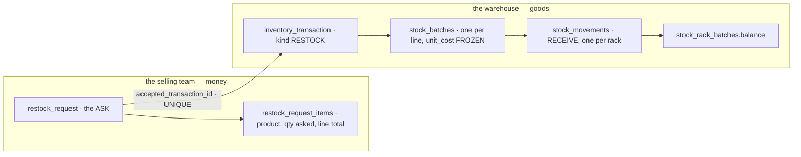
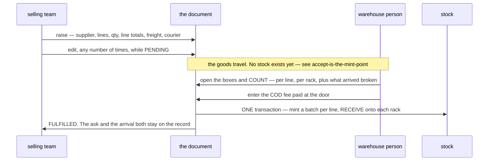
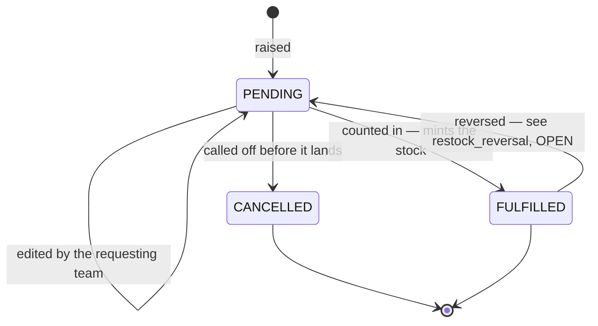
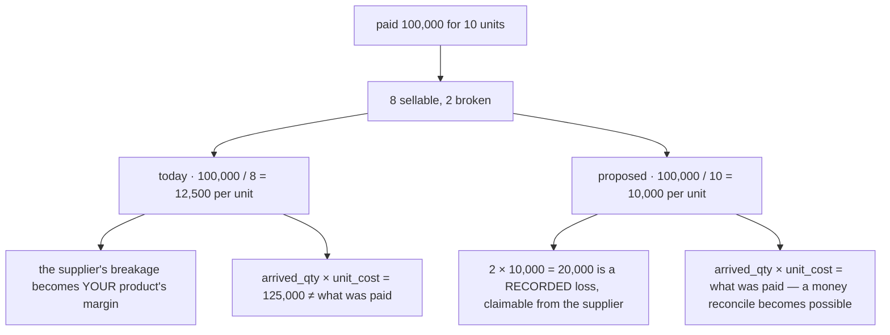
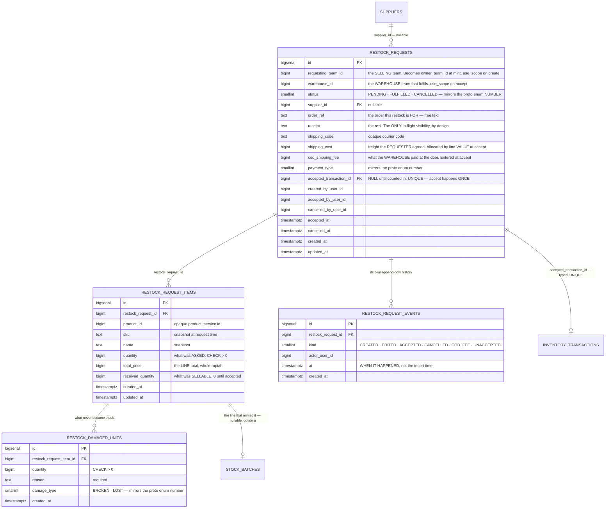
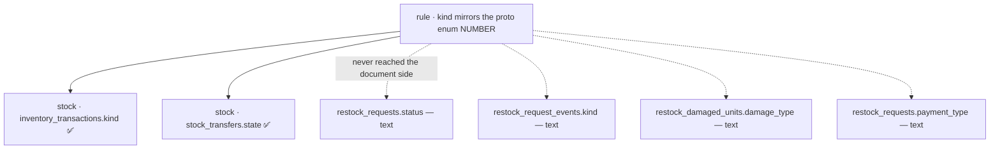

# Restock — raise to accept

> ⚠ **`disscuss/` — NOT final.** Nothing here is decided. It is the flow and the document schema that
> [restock_reversal](restock_reversal.md) sits on top of, re-argued against
> [stock_design](database/stock_design.md) (⚠ **reopened** — the 8 stock tables, no longer authoritative).
> The code today predates that schema, so it is read here as **evidence, never as justification**.

**Nothing is under `# Proposal` yet.**

---

## The shape

**Two documents, and the boundary between them is ownership.** A restock request is a *promise* made by a
selling team about money. An `inventory_transaction` is an *event* performed by a warehouse on goods. They meet
exactly once, at acceptance.

---

## accept-is-the-mint-point

A transfer between warehouses has a **fourth place** for goods in flight (`stock_transit_batches`). A restock
has nothing between *raised* and *arrived* — and that asymmetry looks like a gap.

**→ Recommend: keep it, and write down why.** A transfer moves **our** units, so they need a place the whole
way. A supplier's box on a truck is **not stock** — nobody owns a batch yet, there is no cost layer, and the
only thing anyone wants to see is *"it shipped, the resi is X"*, which `receipt` already carries. This is the
principle the whole flow rests on: **ownership begins at acceptance, so the batch mints there.** A "goods in
transit from supplier" place would be a batch with no owner and no `unit_cost`, and both of those are `NOT NULL`
for good reasons.

⚠ **Money in flight is a real question and it is not this one.** Prepaying a supplier does put the team out of
pocket before anything arrives — that is a **prepayment on the money side**, never a stock place.

## status-is-a-number

`restock_requests.status` is **text with no `CHECK`**. So are `restock_request_events.kind`,
`restock_damaged_units.damage_type` and `payment_type` — all "mapper-guarded". Meanwhile the stock schema's rule
is explicit: *"`kind` mirrors the proto enum number — never a Postgres `ENUM`, never text."*

**→ Recommend:** `SMALLINT` mirroring the proto enum number, on all four columns, for the reason the stock rule
gives — the value's meaning lives in the contract, and text lets a typo become a state nobody can query for.
See [# Contradiction](#contradiction).

## one-act-one-record

Acceptance records **where each line's units went, twice**: `restock_received_placements` (line, rack, qty) and
`stock_movements` (transaction, batch, rack, delta, kind = RECEIVE). Same physical act, same grain, two tables,
no constraint tying them together. [restock_reversal](restock_reversal.md) had to add a *delete the placements*
step purely because the duplicate exists.

**→ Recommend: delete `restock_received_placements`.** The ledger is the receipt — it is append-only, it is
already the thing the reconcile checks, and a rack that a line landed on is
`SELECT rack_id, delta FROM stock_movements WHERE inventory_transaction_id = :accept AND batch_id = :batch`.

⚠ **That needs a line ↔ batch link, which [P11 deliberately dropped](stock_movement_log.md).** Two ways back,
and this is a real fork — I am not picking it silently:

| | |
| --- | --- |
| **a** `stock_batches.restock_request_item_id`, **nullable** typed FK | ⚠ it is the column stock_design's *"Why not the obvious thing §1"* records as gone. It does **not** reopen that argument — §1 needed a **`NOT NULL`** path for `owner_team_id`, and a nullable column can never be one. The transaction stays the origin |
| **b** derive it — one batch per `(accept, product_id)` | free, but it forces **`UNIQUE (restock_request_id, product_id)`** on the lines, and two lines of one product at two prices is a legitimate purchase |

I prefer **a**: it is one nullable column, it keeps the batch's origin as the transaction, and it lets the
receiving screen read back what it wrote without a second copy of the ledger.

## breakage-is-a-loss-not-a-price

`unit_cost = total_price / received_quantity + freight_per_unit`, where `received_quantity` **excludes** what
arrived broken. Pay 100,000 for 10, find 2 smashed, and the layer costs **12,500** a unit instead of 10,000.

**→ Recommend:** divide by **what arrived** (`received + damaged`), and post the damaged units' value as a loss
on the money side — the same shape as the COD fee posting to settlement. Breakage is somebody's fault and
possibly somebody's refund; absorbed into HPP it is invisible, uncollectable, and it makes the product look
more expensive than it is. **`arrived_qty × unit_cost = what the delivery cost` is the check that keeps it
honest.**

## freight-follows-value

`freight_per_unit = freight / Σ received`, floored, spread per **unit**. One TV and 100 cables in one box, and
each cable carries the same freight as the TV.

**→ Recommend:** allocate by line value — `freight × line_total / Σ line_total` — and give the **rounding
remainder to the largest line**, so `Σ (layer cost) = what was actually paid`.

⚠ **The residue is real and must be named, not hidden.** Integer rupiah per unit cannot represent
100,000 / 3 — a per-unit cost loses up to one rupiah per unit. Bounded and acceptable, but it means
`Σ arrived × unit_cost` is *approximately* the delivery, and the money reconcile has to allow exactly that
tolerance rather than pretend it does not exist.

## a-shortfall-is-a-property-not-a-state

10 asked, 8 arrived → **FULFILLED**, and the document closes. Both numbers stay on the line forever, which is
right — but nothing surfaces the gap, so nobody chases the supplier. An over-delivery is the same story in
reverse.

**→ Recommend: no new status.** A shortfall is `Σ quantity − Σ received_quantity` — a computed **property**,
shown as a badge on the row and offered as a filter on the inbound list. A status is an edge in a state machine
and every new one has to be handled everywhere. What is missing is a **screen**, not a state.

---

## Proposed Design

**Named for the event, not the direction** — `accepted_transaction_id`, exactly as `stock_transfers` names its
three. `UNIQUE` is the idempotency guard: a delivery cannot be accepted twice, enforced by the database rather
than by a status re-read.

**Gone from today's schema:** `restock_received_placements` — see [one-act-one-record](#one-act-one-record).

### the accept transaction, in write order

| # | write | why here |
| --- | --- | --- |
| 1 | lock the request `FOR UPDATE`, require `PENDING` | the guard that serialises two people counting one box |
| 2 | validate every line counted exactly once, placements sum to the count, every rack in **this** warehouse | refuse, never interpret — a count that does not add up is two different mistakes |
| 3 | `received_quantity` per line · damaged rows | the count, before any goods move |
| 4 | ONE `inventory_transaction`, `kind = RESTOCK` | the event every batch and every movement hangs off |
| 5 | one `stock_batch` per line that received anything — `unit_cost` frozen, `arrived_qty = received + damaged` | [breakage-is-a-loss-not-a-price](#breakage-is-a-loss-not-a-price) |
| 6 | `stock_movements` RECEIVE per rack · `stock_rack_batches.balance` | the only record of where it went |
| 7 | status, actor, `accepted_at`, COD fee, `accepted_transaction_id` | the document closes last, so a failure leaves it re-countable |
| 8 | events — `COD_FEE` then `ACCEPTED` · settlement posting · the breakage loss | money, after the goods are real |

⚠ **Every unit needs a rack, because [stock_design](database/stock_design.md)
has no nullable place.** Today's *"unplaced pile"* (`rack_id IS NULL`) cannot exist any more. That is not a
problem to solve in the schema — **the receiving area is a rack**, with a code painted on it like every other
shelf. A delivery at 6pm goes onto `RECV-01` and is moved properly tomorrow, and the system says exactly where
it is the whole time.

### the decisions this doc proposes

| name | what it decides |
| --- | --- |
| [accept-is-the-mint-point](#accept-is-the-mint-point) | no in-flight place for a supplier's goods — ownership, and therefore the batch, begins at acceptance |
| [status-is-a-number](#status-is-a-number) | every enum column is `SMALLINT` mirroring the proto number |
| [one-act-one-record](#one-act-one-record) | the ledger is the receipt — `restock_received_placements` is deleted, and the line ↔ batch link comes back nullable |
| [breakage-is-a-loss-not-a-price](#breakage-is-a-loss-not-a-price) | cost divides by what **arrived** — damage is a recorded loss, not HPP inflation |
| [freight-follows-value](#freight-follows-value) | freight allocates by line value, remainder to the largest line |
| [a-shortfall-is-a-property-not-a-state](#a-shortfall-is-a-property-not-a-state) | the ask ≠ the arrival is a badge and a filter, never a status |
| **the receiving area is a rack** | there is no unplaced pile — `RECV-01` is a shelf like any other |

---

# Contradiction

## an enum is a number in stock and text in restock

> **stock_design, the rules table:** *"`kind` mirrors the proto enum number — **never** a Postgres `ENUM`, never
> text — so no constraint here hardcodes a value that lives in the contract."*

> **database-schema, restock:** *"`status` is `RestockRequestStatus` **as text** … no `CHECK`"* — and the same
> for `restock_request_events.kind`, `restock_damaged_units.damage_type`, `payment_type`.

Four sites, one cause: the restock document was built before the rule existed, and the rule was written in the
stock schema's own doc as if it only governed stock.

**→ RECOMMEND:** `SMALLINT` on all four. What stops it recurring: **a rule about column encoding is a
system-wide rule and does not belong in one service's schema doc** — it goes in the service guideline, where a
new service reads it before choosing a column type.

## one physical act, two records, and only one of them is the ledger

> **stock_design:** the ledger is *"append-only"*, *"`INVENTORY_TRANSACTIONS ||--|{ STOCK_MOVEMENTS` — ONE
> action, N rows"*, and the reconcile checks it.

> **today:** `restock_received_placements` holds *"one row per (line, place) with a quantity"* — the same fact
> the `RECEIVE` rows hold, with nothing tying the two together.

The duplicate is not free: it made the reversal design need a **delete** step on an otherwise append-only
correction, and it is a pair of tables that can silently disagree about where a delivery went.

**→ RECOMMEND:** [one-act-one-record](#one-act-one-record). What stops it recurring: when a new table records
*where units went* or *how many are there*, it is answering a question
[stock_design](database/stock_design.md) already owns — **that file's boundary
rule ("it owns what carries a QUANTITY OF RECORD") has to be checked before the table is added**, not after.

---

## Question

1. **The line ↔ batch link** — nullable `restock_request_item_id` on the batch **(a)**, or derive it from
   `product_id` and forbid two lines of one product **(b)**? I prefer **a**.
2. **Breakage** — divide cost by what arrived and record the damaged value as a loss? That changes HPP for
   every future delivery, and it needs a home on the money side. If it is deliberate that breakage inflates
   HPP, say so and I will write it down as a decision instead of a defect.
3. **Freight by value or by unit?** By value is more honest per line, by unit is what exists. Neither is
   correct for weight — a heavy cheap thing costs more to ship than a light expensive one — but value is the
   closer of the two and needs no new data.
4. **Is the receiving area a rack**, or do you want the unplaced pile kept alive as a real concept? The new
   stock schema has no nullable place, so this has to be answered before acceptance can be built on it.
