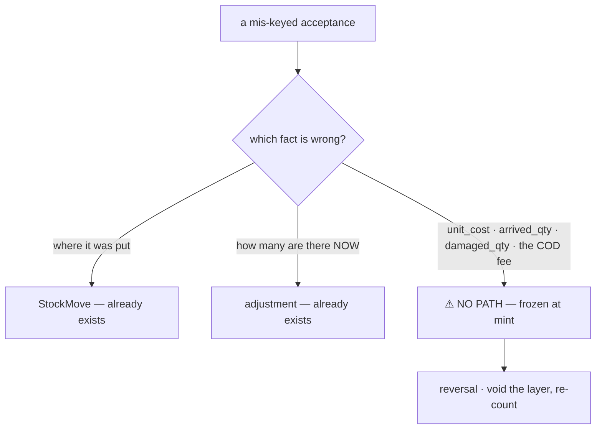
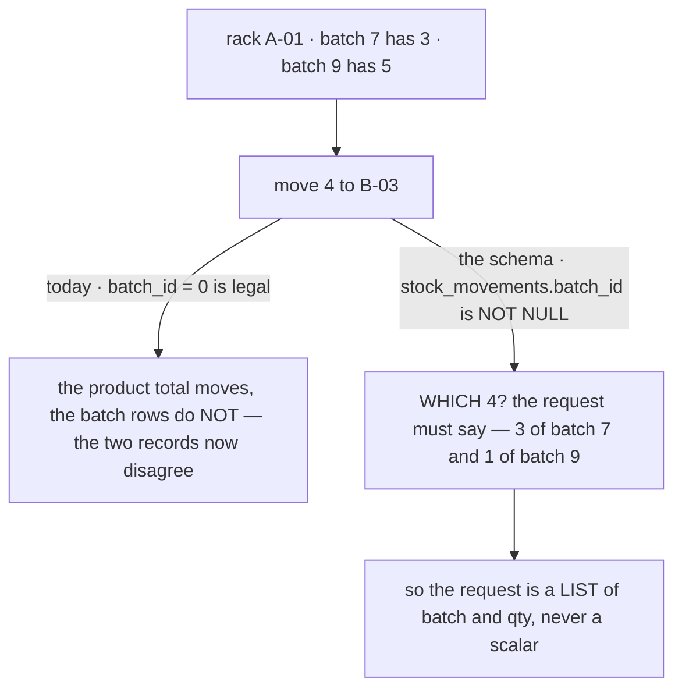
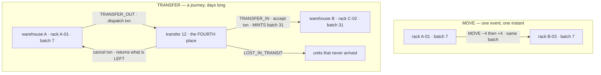
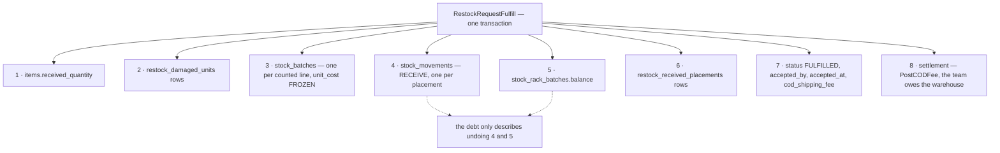
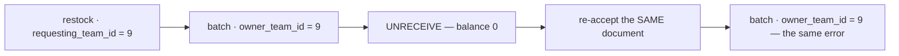
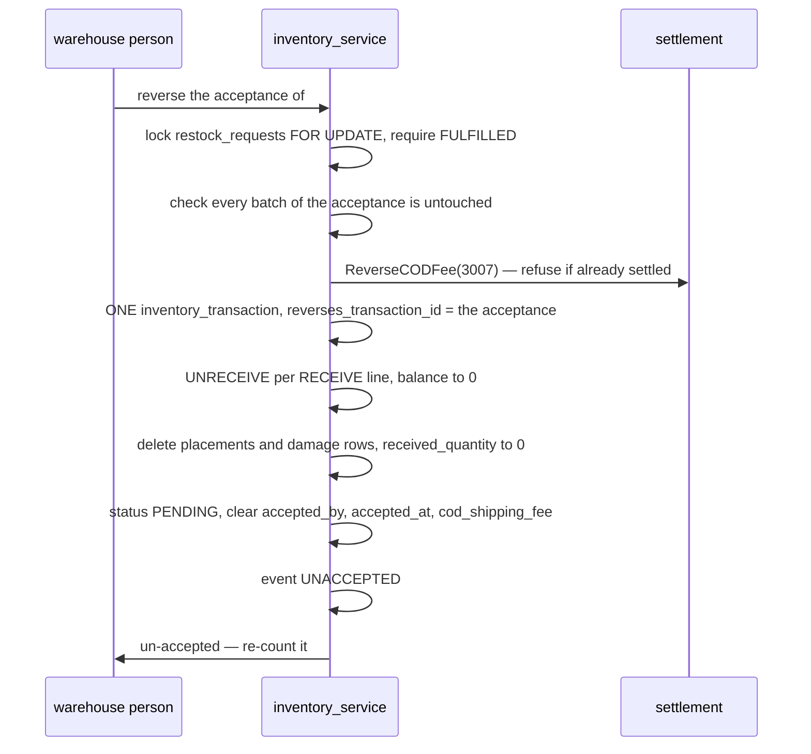
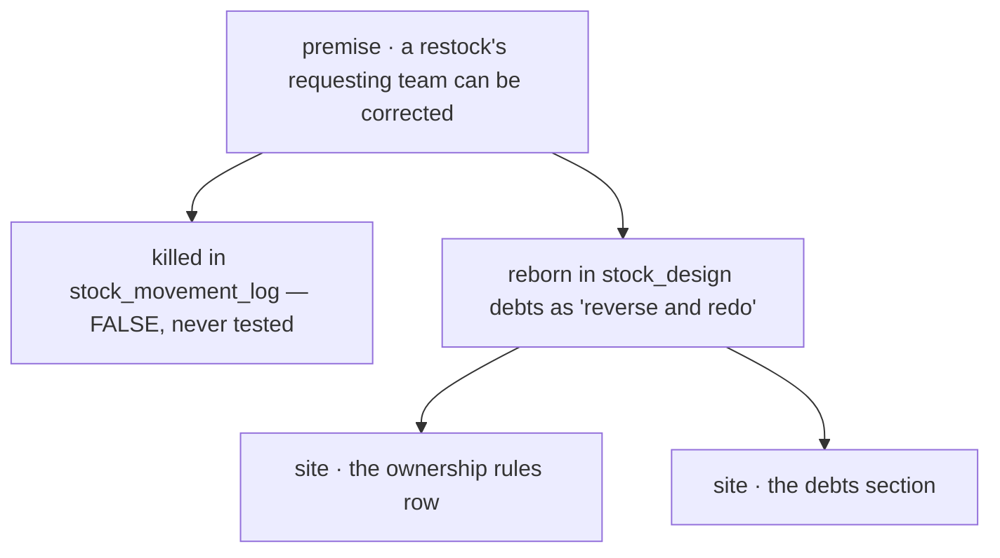
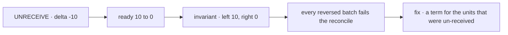

# Reversing a restock acceptance

> ⚠ **`disscuss/` — NOT final.** Nothing here is decided. It answers the deferred debt
> [restock-acceptance-has-no-undo](database/stock_design.md#restock-acceptance-has-no-undo).
> Schema shape comes from [stock_design](database/stock_design.md) (⚠ **reopened — no longer authoritative**)
> — the code today still runs the pre-batch model.

**Nothing is under `# Proposal` yet** — the owner has decided none of this.

---

## Why it exists

**Because acceptance is the only screen that writes FROZEN facts, and freezing removed the `UPDATE` path.**

Everything mutable already has an RPC. Where units sit → `StockMove`. How many are on the shelf → the
adjustment. What a batch **cost**, how many **arrived**, how many were **damaged**, who **owns** them — those
were deliberately frozen at mint so a later delivery cannot rewrite this layer's price. Reversal is the
correction path that decision requires: you cannot edit a frozen fact, so the only honest fix is to void the
layer and mint a new one.



| what was mis-keyed | today's only option | why that is not a fix |
| --- | --- | --- |
| **the count** — said 10, 8 arrived | an adjustment | `unit_cost = total_price / received + freight / Σ received`, so a wrong count mis-prices **every line of the delivery**. An adjustment cannot touch cost — and it records the error as a **`LOST`**, which per [a claim closes at zero](database/stock_design.md#a-find-is-the-only-drain) never expires, so a receiving mistake sits in the claim pool forever waiting to be "found" |
| **the COD fee** — paid 15k, typed 150k | nothing | it is frozen into every batch's `unit_cost` **and** it posted a settlement debt. The warehouse is now claiming 150k of real money from another team, with no RPC that can lower it |
| **the wrong document** — two boxes at the door, #3011's goods counted into #3007 | nothing | one request reads FULFILLED for a delivery that never came, and the stock sits under the wrong team at the wrong price |
| **where it was placed** | `StockMove` | ✅ **not a reason for reversal.** A place is mutable by design |

**The business consequence, stated plainly:** `unit_cost` is HPP. It becomes COGS on every order picked from the
layer, and [FIFO draws by `id`](database/stock_design.md#the-model) — so a
mis-priced layer is drawn **first** and cannot be waited out. Profit per order is wrong until the layer is
exhausted, and nothing on any screen says so.

⚠ **What it is NOT for.** Not a general undo (a transfer's is a cancel, a pick's is a return). Not for goods
that have already moved — that needs the handover, which does not exist. Not for a wrong owner, which is a wrong
document (see [wrong-owner-is-not-a-keying-error](#wrong-owner-is-not-a-keying-error)).

### what-a-move-is-and-is-not

**The row above claims a mis-placement needs no reversal. That claim rests on `MOVE`, so here is exactly what
`MOVE` has to be for it to hold.** (owner asked — the assumption was doing more work than it was carrying.)

A move is **`(rack, batch) → (rack, batch)`, one warehouse, same total, same cost, same owner.** Two movements,
`−q` and `+q`, both `kind = MOVE`. Not *"move qty to another rack"* — the batch is half the grain, and today it
is **optional**:



| the rule | why it is not obvious |
| --- | --- |
| **which layers move is a walk, not a caller's number** | a shelf holds several layers, so *"move 4"* names no fact by itself. The owner's [`Spent()`](rack_batch_mutation.md#the-move-flow) walks oldest-first and *returns* the layers it took — today's `batch_id = 0` instead moves the product total and leaves the per-batch rows behind, which is the drift the reconcile exists to catch |
| ⚠ **a wrong layer on a move is invisible** | no invariant can catch it — the subtopic is [move_layers](move_layers.md), which also records that `batch_selection`'s P1 and P2 disagreed about who chooses |
| **both ends are real racks** | `nil` = the unplaced pile disappears with [the receiving area is a rack](restock_flow.md#proposed-design) — and with it `samePlace`'s nil-is-a-place special case and `IS NOT DISTINCT FROM` in the update. Same lesson as stock_design *"Why not the obvious thing §2"* |
| ⚠ **a move relocates `balance`, NEVER `lost_claimable`** | the claim belongs to the loss, not to the units. Carrying it along would move a recorded loss onto a shelf that never lost anything, and the pool is an **equality** — it would reconcile to a lie. The emptied row stays exactly as long as its claim does |
| **a move changes no money** | no `unit_cost`, no `owner_team_id`, no total. That is the whole reason a mis-placement needs no reversal, and the reason a mis-**price** cannot be fixed by one |

### move-is-not-a-transfer

**They are easy to confuse because today's code makes them nearly identical** — `StockMove` and
`StockTransfer` are both *two `applyDelta` calls in one transaction*, differing only in whether the warehouse
id changes. That resemblance is the bug, not the insight.

**The dividing line is one rule from stock_design: *"a batch never leaves the warehouse it was minted in."***
That single sentence makes a transfer a different **verb**, not a `MOVE` with a second warehouse id — because
crossing the wall has to **mint**, and a move must never mint.



| | `MOVE` | `TRANSFER` |
| --- | --- | --- |
| the warehouse wall | never crosses it | crossing it **is** the act |
| the batch | **the same batch** on both legs | the source layer is drawn down and a **NEW batch is minted** at the destination, copying `unit_cost`, `expires_on`, `owner_team_id` verbatim |
| places | rack → rack | rack → **transit** → rack |
| transactions | **one** | **three** — dispatch, then accept **or** cancel, days apart |
| a document | none. Nothing to track, it already happened | `stock_transfers`, with a state machine |
| the logs | the **ledger** ×2 rows | the **ledger** *and* the **transit log** ([vocabulary](vocabulary.md)) |
| can lose units | no — both legs commit together | yes, `LOST_IN_TRANSIT`. A cancel returns **what is left**, not what was sent |
| its undo | **another move.** Nothing frozen changed | a **cancel**, which has its own inbound leg landing back in A |

⚠ **Today's `StockTransfer` is none of that** — it is instant, unplaced→unplaced, and passes `nil` for the
batch on both legs, so goods arrive at the destination **with no cost layer at all**. Under the new schema
`batch_id` is `NOT NULL` and `warehouse_id` is immutable on a batch, so that implementation cannot survive
contact with it. Flagged here because it is the nearest neighbour to the RPC this doc is about, and *"just add
a warehouse id to `MOVE`"* is the tempting wrong fix.

✅ **This is also the PROOF of the debt's claim that reversal must not be generic.** Three verbs, three undos —
a move undoes itself, a transfer undoes by cancelling, an acceptance undoes by `UNRECEIVE` — because each
touches a different set of frozen facts. A single `TransactionReverse` would have to pick one and be wrong
twice.

---

## What acceptance actually writes

The debt describes the undo as *"one transaction, negative `RECEIVE` lines"*. That is the stock third of it.
`RestockRequestFulfill` writes **eight things across two services**:



| Write | Undoing it |
| --- | --- |
| 3 · the batch | **stays** — append-only, and a batch that existed for an hour is a fact |
| 4 · 5 · the ledger + the state | a reversing transaction. The debt's part |
| 1 · 2 · 6 | document-side count facts — **must be removed, or a re-accept doubles them** |
| 7 | status back to what? |
| 8 · the COD debt | a settlement entry with **no reversal primitive** |

---

## Critique

### unreceive-is-its-own-kind

**A negative `RECEIVE` breaks the per-batch invariant.**

`arrived_qty` is frozen at N, `ready` returns to 0, and nothing on the right side absorbs the difference:

```
arrived + found = ready + in_transit + used + broken + lost + lost_in_transit + damaged_at_acceptance
   10    +   0   =   0   +     0      +   0  +   0    +  0   +       0         +          0
```

Every reversed batch fails the reconcile, forever.

**→ Recommend:** the reversal writes its own kind, **`UNRECEIVE`**, and the invariant gains one term
`unreceived = Σ |delta| WHERE kind = UNRECEIVE`. A named kind over a signed `RECEIVE` because a negative
`RECEIVE` in a rack history reads to a human as a pick, and because `Σ RECEIVE` is what
[the found-goods mint](database/stock_design.md#the-remainder-mints-at-last-price)
already relies on meaning *arrived*.

### wrong-owner-is-not-a-keying-error

**The reversal cannot fix the error it was written for.**

The debt says an acceptance *"keyed to the wrong selling team"* is fixed by reversing and redoing.
**It is not.** `owner_team_id` comes from `restock_requests.requesting_team_id`, and that column is the
request's **access scope** — `RestockRequestUpdate` loads `WHERE id = ? AND requesting_team_id = ?`, so the
team cannot be edited even in principle. Re-accepting the same document mints under the same team again.



**→ Recommend:** narrow the claim. Reversal fixes **what the count said** — quantity, placement, damage, COD
fee. A wrong owner is a **wrong document**: un-accept, then the request is **cancelled** and the right selling
team raises its own. Fix the sentence in `stock_design` too — it currently promises something no reversal can
deliver (see [# Contradiction](#contradiction)).

### money-reverses-with-it

**The precondition is necessary and not sufficient.**

*"No movement on the acceptance's batches other than its own `RECEIVE` rows"* is one clean predicate and it
covers stock. It says nothing about **money**: acceptance may have posted a COD debt, and that debt may
already be **settled**.

**→ Recommend:** two more preconditions, and the interface to enforce the first —
`SettlementPoster.ReverseCODFee(restockRequestID)`, idempotent, in the caller's transaction (same reasoning as
`PostCODFee`: same database, so atomic or nothing). **A settled debt is a hard refuse** — money that has
changed hands is a refund, a different feature and a different person's decision.

### reverse-then-refulfil

**Un-accept leaves the shelf lying.**

Reversed, the goods are still physically on rack A-01 while `stock_rack_batches` says 0. Between un-accept and
re-accept a picker sees nothing there.

| | Two-step — `Reverse`, then `Fulfill` again | One-step — `AcceptanceCorrect(lines)` |
| --- | --- | --- |
| the window | exists, bounded by a person at the shelf | none |
| reuses fulfil's validation | ✅ entirely | ❌ duplicates all of it |
| can fix a line **price** | ✅ document returns to PENDING and its team edits it | ❌ price is the selling team's data |
| document state | PENDING again | never leaves FULFILLED |

**→ Recommend: two-step.** The one-step version buys away a window measured in minutes by duplicating the
whole count path and letting the warehouse rewrite the other side's prices. Mitigate the window instead: the
reversal takes a **reason**, and the restock reads loudly as *un-accepted, awaiting re-count* until it is
fulfilled again.

### the-batch-is-the-record

**The count facts must be deleted, and that loses nothing.**

`received_quantity`, `restock_received_placements`, `restock_damaged_units` — `Fulfill` **creates** placement
and damage rows unconditionally, so leaving them means a re-accept appends a second set and the line reads
double.

**→ Recommend:** delete them and zero `received_quantity`. **The reversed batch is the record of the wrong
count** — it keeps `arrived_qty`, `damaged_qty`, `unit_cost`, `accepted_by` and `accepted_at` forever, at
balance 0, and the `RECEIVE`/`UNRECEIVE` pair keeps the placements. Nothing is forgotten by clearing the
document.

### the-document-is-the-guard

**Do not guard idempotency with a unique index on the link.**

The tempting `UNIQUE (reverses_transaction_id)` is wrong: the column is the **general** undo link, and a pick
legitimately has **several** RETURN transactions reversing it.

**→ Recommend:** the guard is the document — `SELECT … FOR UPDATE` on `restock_requests` plus
`status = FULFILLED`, exactly how `Fulfill` serialises on `PENDING`. One RPC per reversible action means one
guard per document, never one global constraint.

### no-clock-on-the-window

**→ Recommend:** no time limit. An untouched batch is by definition not in use, and the precondition already
says so — the same position [a-find-is-the-only-drain](database/stock_design.md#a-find-is-the-only-drain)
took when it refused an expiry.

---

## Proposed Design

### RestockAcceptanceReverse

One RPC on `RestockRequestService`, warehouse-side, same roles as `RestockRequestFulfill`
(`ROOT, ADMIN, WAREHOUSE_OWNER, WAREHOUSE_ADMIN, WAREHOUSE_STAFF`), `team_id` carrying `use_scope`.

```proto
message RestockAcceptanceReverseRequest {
  uint64 team_id    = 1;  // the accepting warehouse — use_scope
  uint64 request_id = 2;
  string reason     = 3;  // required, non-empty — it lands on the inventory_transaction
}
```



**The precondition, as one predicate:**

```sql
-- refuse unless every movement on every batch of this acceptance is that acceptance's own RECEIVE
SELECT NOT EXISTS (
  SELECT 1
    FROM stock_movements m
    JOIN stock_batches b ON b.id = m.batch_id
   WHERE b.inventory_transaction_id = :acceptance_txn
     AND NOT (m.inventory_transaction_id = :acceptance_txn AND m.kind = RECEIVE)
)
AND NOT EXISTS (   -- and it never left the building
  SELECT 1 FROM stock_transit_movements m
    JOIN stock_batches b ON b.id = m.batch_id
   WHERE b.inventory_transaction_id = :acceptance_txn
);
```

### the decisions this doc proposes

| name | what it decides |
| --- | --- |
| [unreceive-is-its-own-kind](#unreceive-is-its-own-kind) | a named `UNRECEIVE` kind, plus one new invariant term |
| [wrong-owner-is-not-a-keying-error](#wrong-owner-is-not-a-keying-error) | reversal fixes the count, never the owner. A wrong owner cancels the document |
| [money-reverses-with-it](#money-reverses-with-it) | `ReverseCODFee` in the same transaction — a **settled** debt refuses the reversal |
| [reverse-then-refulfil](#reverse-then-refulfil) | two RPCs, document back to PENDING, not one correcting super-call |
| [the-batch-is-the-record](#the-batch-is-the-record) | document count facts are deleted — the zero-balance batch keeps the history |
| [the-document-is-the-guard](#the-document-is-the-guard) | `FOR UPDATE` + `status = FULFILLED`, never a unique on `reverses_transaction_id` |
| [no-clock-on-the-window](#no-clock-on-the-window) | the untouched-batch precondition is the only bound |

### what changes outside this RPC

| | |
| --- | --- |
| `MovementKind` | `+ UNRECEIVE` |
| `RestockRequestEventKind` | `+ UNACCEPTED` (6) — append-only, costs nothing |
| the per-batch invariant | `+ unreceived` on the right side |
| `SettlementPoster` | `+ ReverseCODFee` |
| `stock_design` debts | [restock-acceptance-has-no-undo](database/stock_design.md#restock-acceptance-has-no-undo) shrinks to the count, and the ownership row stops promising a fix |

---

# Contradiction

## the debt promises an ownership fix that no reversal can perform

Two statements, both currently authoritative:

> **stock_design, the rules table:** *"ownership is FROZEN at mint … A keying error is fixed by **reversing the
> acceptance and redoing it**, which is possible until the goods move."*

> **stock_movement_log, line 313:** *"a restock's requesting team can be corrected"* — ❌ **FALSE, and it was
> never tested.**

The second one is right. `requesting_team_id` is the request's access scope, so redoing the same document
reproduces the same owner — the reversal changes nothing about ownership.

**→ RECOMMEND:** the rules-table row keeps *"a keying error"* only for **count** facts and points a wrong owner
at cancel-and-re-raise. What stops it recurring: the same false premise was **already caught once** in
`stock_movement_log` and came back when the debt was written — so **a correction path must name the RPC and the
column it writes**, because *"fixed by reversing"* is unfalsifiable prose and *"fixed by `RestockAcceptanceReverse`,
which does not write `owner_team_id`"* is not.



## the deferred undo contradicts the per-batch invariant

> **debts:** *"carrying a negative `RECEIVE` line for every line the acceptance wrote … its balance returns to zero"*

> **invariants:** `arrived + found = ready + in_transit + used + broken + lost + lost_in_transit + damaged_at_acceptance`

With `arrived_qty` frozen and `ready` back to 0, the equality cannot hold for any reversed batch.

**→ RECOMMEND:** [unreceive-is-its-own-kind](#unreceive-is-its-own-kind). What stops it
recurring: **a deferred behaviour is still checked against the invariants** — this one was written as prose in a
debts section and never run past the equality four screens above it.



---

## Question

1. **Two-step or one-step?** I recommend two-step (`Reverse` → edit → `Fulfill`), accepting a short window where
   the shelf holds goods the system says are not there. One-step removes the window and duplicates the whole
   count path — and cannot fix a line price.
2. **A settled COD debt — hard refuse, or reverse anyway and leave settlement to sort out?** I say hard refuse.
3. **After un-accept, may the requesting team EDIT the request again** (it is PENDING, so #131 says yes), or is it
   locked to *re-count only*? Editing is what makes a wrong line price fixable, but it hands the document back to
   the other side mid-correction.
4. **Who may reverse** — the same five roles that may fulfil, or `WAREHOUSE_ADMIN` and up only? Fulfil is staff
   work; undoing an accepted delivery may not be.
