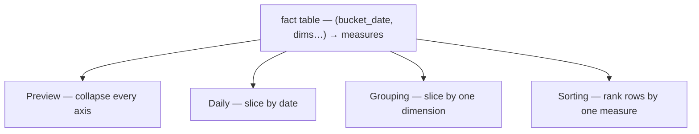
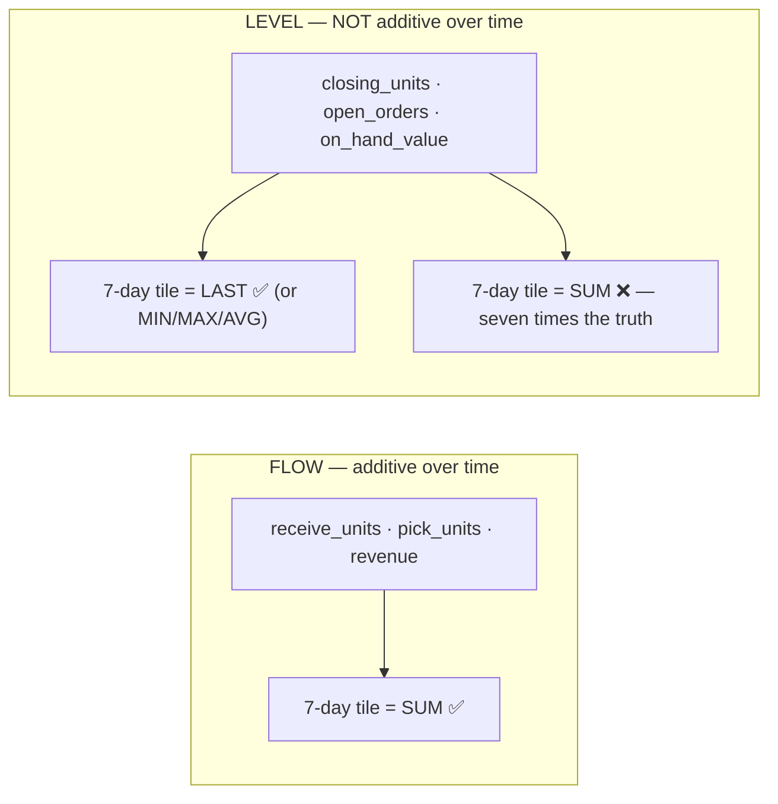
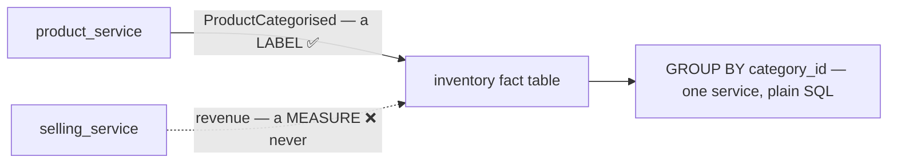
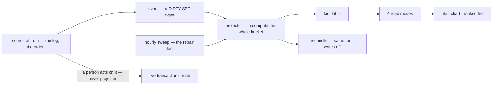
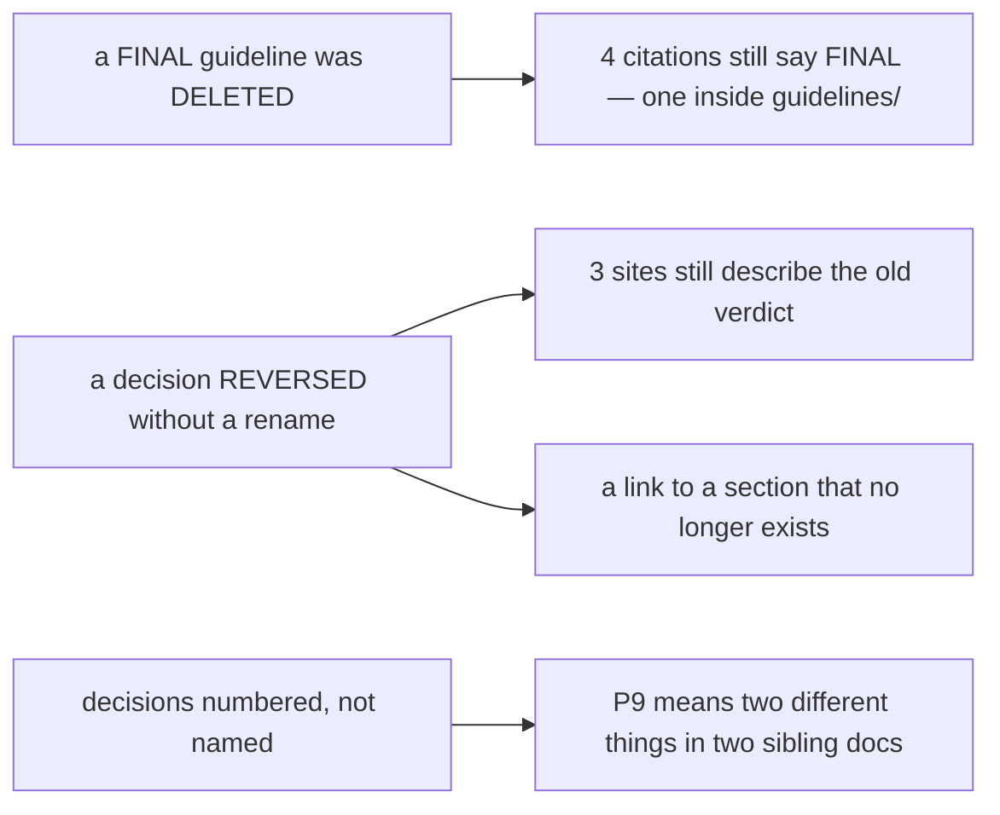

# Statistics — how a metric is defined, produced and served

> ⚠ **`disscuss/` is NOT final.** Mid-argument. Do not build from this.

**Scope.** [stat_event_processing.md](stat_event_processing.md) answers *how inventory's daily balances
get built*. This doc is the level above it: **what a metric IS in this system, which ones get a pipeline
at all, and how any service serves the four-part stat shape** that
[service-guideline.md](../../guidelines/service-guideline.md) §"Interfacing Stat Related" already
mandates.

# Proposal

**Nothing is closed yet.** This doc opens the argument — everything below is mine to defend and yours to
break.

---

## Critique

### the-five-rules-were-deleted

`guidelines/architectures/data_pipeline.md` is **FINAL** and is `D` in the working tree. It was the
authoritative answer to *"how do we process"*, and nothing absorbed it — its text survives only in git
(`git show HEAD:guidelines/architectures/data_pipeline.md`).

Four sites still cite it as FINAL, and **one of them is a guideline**:

| Site | Says |
| --- | --- |
| `event_library.md:10` ⚠ | *"the **pipeline rules** worked out here, which moved there"* |
| `event_library.md:77` | defers a rule to it |
| `stat_event_processing.md:7` | *"all **FINAL**"* |
| `stat_event_processing.md:364, 629, 741` | cites §2, the recompute rule, §5 |

The five rules, recovered:

| | Rule | Why it is load-bearing here |
| --- | --- | --- |
| 1 | **recompute the bucket, never increment** | the only thing that makes redelivery and rebuild safe |
| 2 | **a batch is a dirty-set signal** | three events for 31 July mean *31 July is dirty*, not *31 July = those three* |
| 3 | **two detectors on disjoint axes** — position lag · reconcile | lag sees stalls and is blind to wrong numbers; reconcile is the inverse |
| 4 | **reconcile is the projector run with writes off** | a second query is a second implementation, and then nobody can say which is right |
| 5 | **a day is not complete at its boundary** | a grace hour absorbs transport lag, never a backdated fact |

**→ Recommend: restore it, or say what replaced it.** This is the top blocker — every design below assumes
those five, and right now they are authoritative-but-absent, which is the worst of both.

### four-read-modes-not-four-rpcs

The guideline says *"every stat consist 4 things — Preview, Daily (Time Range), Grouping, Sorting."*
I read that as **one cube with four read modes**, not four features.



Written as four hand-authored queries they **will** disagree: the preview tile says 1,204 units, the
grouped list sums to 1,198, and both numbers are believable. Nobody finds that for months.

**→ Recommend: one fact table per grain, four derived reads over it.** Same rows, one arithmetic. A
disagreement then becomes impossible rather than unlikely.

### flow-and-level-are-different-measures

The trap that a generic aggregator walks straight into:



Both are "a number in a column". Only the *class* says how a time range collapses it — and a level SUMmed
over a week is wrong by a factor of seven while looking entirely plausible.

**→ Recommend: the class is declared, and the NAME carries it.** `*_units` / `*_amount` = flow;
`closing_*` / `open_*` = level. A range read SUMs flows and takes LAST of levels. There is never one
`SUM(*)` across a row.

### one-test-for-the-projection-boundary

[stat_event_processing.md](stat_event_processing.md) draws the right boundary but argues it per metric,
so the next metric re-argues it.

**→ Recommend one test:** *would a 30-second-old answer make someone do the wrong physical thing?*

| Answer | Then | Because |
| --- | --- | --- |
| **yes** | live transactional query, always | HARD RULE 10 — for a picker at a shelf, freshness IS correctness |
| **no** | project it | a dashboard read seconds-old is fine, and a ranked read cannot be a live query at all |

Consequence worth stating out loud: **the pipeline being down degrades a dashboard and never a picking
screen.** That is the property the boundary is bought for.

### cross-service-is-a-dimension-problem

*"Stock value by category"* fails today because `category` lives in `product_service`. It is not a slow
query — it is **not a query**. The reflex answer is an analytics service that consumes everyone's events,
which trades HARD RULE 3 for one join.



**→ Recommend: denormalise DIMENSIONS, never FACTS.** A stat table may copy another service's *labels*
(`category_id`, `supplier_id`, `owner_team_id`) at projection time, fed by that service's events. It may
never copy another service's *measures*. Then almost every "cross-service" stat stops being cross-service.

⚠ **The objection I'd raise against myself: a copied dimension goes stale.** Recategorise a product and
last month's rows still carry the old category. I think that is **correct, not a bug** — a warehouse
report is a statement about what was true then, and a ledger that restates history when someone retags a
product is worse. But it must be *stated*, because "group by category" then means **as-of**, not current.
A screen that genuinely needs current-category grouping is a live join and does not belong in a
projection.

The one case denormalisation does **not** cover is a ratio across two services' *facts* — revenue per unit
picked. **→ Recommend:** compose that on the read side (two RPCs, one screen) until a real screen proves
it too slow. Only that would justify a stat service, and no screen has asked yet.

### a-stat-definition-has-no-home

Today a stat's meaning lives inside one handler's SQL, so *"what exactly does this tile count"* is
answerable only by reading Go. The four read modes then each re-derive it.

**→ Recommend: one `StatSpec` per stat** — grain, dimensions, measures with their class, source table —
with the four reads and the table DDL derived from it.

⚠ **This is the point I hold most weakly.** For ~10 stats it may be a framework nobody needs, and
hand-written SQL per read mode is honest and debuggable. The argument for it is
[four-read-modes-not-four-rpcs](#four-read-modes-not-four-rpcs): without a single definition, the four
reads *are* four implementations. Argue back.

---

## Proposed Design

### The lifecycle



### The shape every fact table takes

```sql
bucket_date  DATE            -- the day boundary, from the ONE shared function
<dimensions>                 -- own ids + denormalised labels from other services
<flow measures>              -- additive over time  → SUM
<level measures>             -- NOT additive        → LAST / MIN / MAX / AVG
row_version  BIGINT          -- from a sequence; the monotonic-upsert guard
UNIQUE (bucket_date, <dimensions>)
PARTITION BY RANGE (bucket_date)
```

### The four read modes, concretely

| Mode | Read | Proto shape |
| --- | --- | --- |
| **Preview** | collapse every dimension over a range | `XStat` → a `Preview` message of scalars |
| **Daily** | `GROUP BY bucket_date` over a range | `XStat` + `time_range` → repeated points |
| **Grouping** | `GROUP BY <one dimension>` | `XStat` + `group_by` enum |
| **Sorting** | rank rows by one measure, paginated | the domain's `XList` + `sort` — HARD RULE 9 applies |

⚠ **Sorting is where the projection earns its keep.** Ranking by a computed metric needs it for *every*
row, so page 1 costs the whole table if it is computed live. Everything else is a convenience.

### Rules the code must hold

| | |
| --- | --- |
| recompute | the whole bucket, never increment — the batch only says *which* buckets |
| the write | one **monotonic upsert** guarded on `row_version` — makes redelivery, concurrency and a two-instance deploy all harmless |
| reconcile | the projector re-run with writes off. Never a second query |
| replay | a first-class command over a date range, never a one-shot migration |
| the day boundary | **one shared function**, never a `time` call near the code that needed it |
| liveness | alert on **staleness**, not on lag — a dead projector reports zero lag and perfect reconciles |
| flows vs levels | a range collapses them differently, always |
| other services | copy their **dimensions**, never their **measures** |

---

# Contradiction

Per HARD RULE 11 — grouped by **cause**.



## a-deleted-final-guideline-left-live-citations

**The example.** `event_library.md:10` — a **guideline**, therefore authoritative — reads:

> *"[data_pipeline.md](data_pipeline.md) — the **pipeline rules** worked out here, which moved there when
> this plan was called final."*

The file is deleted. A reader follows a link from an authoritative doc to nothing, and the five rules it
promises are unreachable outside git.

**→ RECOMMEND:** restore the file (it is 67 lines and still correct), or, if it was superseded, say by
what and fix all four citations in the same change. **What stops it recurring:** deleting anything in
`guidelines/` grep-checks its own filename first — a guideline is by definition something other docs cite.

## p9-reversed-and-left-three-stale-sites

**The example.** `stat_event_processing.md:24` decides:

> | 9 | **`stock_movements` stays AS IS** — `rack_id` keeps its place on the log, no split |

while line 518, inside a banner marked *superseded*, still asserts the opposite:

> *"**P9 removes this problem at the root.** Once `stock_movements` **drops `rack_id`**…"*

and line 876 still schedules it: *"Phase 1 — **P9 split** — `stock_placements` + backfill, `rack_id` off
`stock_movements`"*. The link `[P9](#p9--split-the-log--quantity-vs-place)` points at a heading that no
longer exists, so a reader cannot even reach the definition to check.

⚠ **This one is worse than stale prose.** Line 516 marks a whole correct critique *"superseded by P9"* —
so a real finding about grain 2 reads as closed, on the authority of a decision that reversed.

**→ RECOMMEND:** un-supersede §2, correct Phase 1, and **rename** — a decision whose verdict flipped
cannot keep its old label (HARD RULE 12).

## ordinal-decision-names-collided-in-practice

**The example.** HARD RULE 12 predicts the collision. It has now happened, in two docs in one folder:

| Doc | `P9` means |
| --- | --- |
| `stat_event_processing.md` | *`stock_movements` stays as is — no split* |
| `stock_movement_log.md` | *Vocabulary — `balance` is THE word* |

`stat_event_processing.md` numbers all nine of its decisions and predates RULE 12.

**→ RECOMMEND:** rename its `P1…P9` to verdict-carrying kebab-case names and relink every reference. It is
a mechanical pass over one 899-line doc. **What stops it recurring:** the rule already exists — this doc
is the one that has not been brought up to it.

---

## Question

Where I hold a position it is stated above — argue back.

| # | Question | Why it blocks |
| --- | --- | --- |
| 1 | **`data_pipeline.md` — deliberate deletion, or accident?** | ⚠ **top blocker.** Every rule below quotes it |
| 2 | **Business day = `Asia/Jakarta`?** | unchanged from [stat_event_processing.md](stat_event_processing.md) Q1. Nothing daily can be built until the boundary exists |
| 3 | **Which screens read a stat first** — `home`, `profit`, `revenue`, `inventory`? | grounds the grain. Right now I am designing a shape with no first customer |
| 4 | **`StatSpec`, or hand-written SQL per read mode?** | the one place I would over-engineer |
| 5 | **Are as-of dimensions acceptable** — last month's rows keep the old category? | decides whether cross-service grouping can live inside one service at all |
| 6 | **Do the non-inventory stats** (`OrderActivityStat`, `RestockInboundStat`, revenue, expenses) **get the same machinery**, or stay live queries? | decides whether this is an architecture or one service's implementation detail |
