# Inventory Statistics — Event Processing

> ⚠ **`disscuss/` is NOT final.** Mid-argument. Do not build from this.

Reference: [event_library.md](../../guidelines/architectures/event_library.md) ·
[event-guideline.md](../../guidelines/event-guideline.md) ·
[data_pipeline.md](../../guidelines/architectures/data_pipeline.md) — all **FINAL**. Where this doc
disagreed with them, this doc was wrong (see [§0](#0-what-the-final-guidelines-corrected)).

# Proposal

**Closed by the owner.** Anything outside this section is still argument.

| # | Decided | Still open inside it |
| --- | --- | --- |
| 1 | Statistics move to **event-driven processing** | — |
| 2 | **Streaming over HTTP push** | — |
| 3 | **Three daily balance tables** | §2 project-3-and-roll-up · columns |
| 4 | **One always-running worker instance** | §5c — whether `N=1` may be load-bearing |
| 5 | **Simple: push → process → ack/nack by status code** | §5a/§5b — two guards it needs |
| 6 | **Deduplication is inventory_service's own** — table, migration, retention | ⚠ the shared-namespace and no-partitioning traps in P6 |
| 7 | **Balance comes from the LOG at `MAX(movement id)`, never from a payload** | — |
| 8 | **DENSE** — an absent row means zero | — |
| 9 | **`stock_movements` stays AS IS** — `rack_id` keeps its place on the log, no split | ⚠ whether a placement log still happens — see P9 |

## P1 · Event-driven processing

Stats are computed **out of band** and read from precomputed tables. The boundary that matters is *what
stays a live query*:

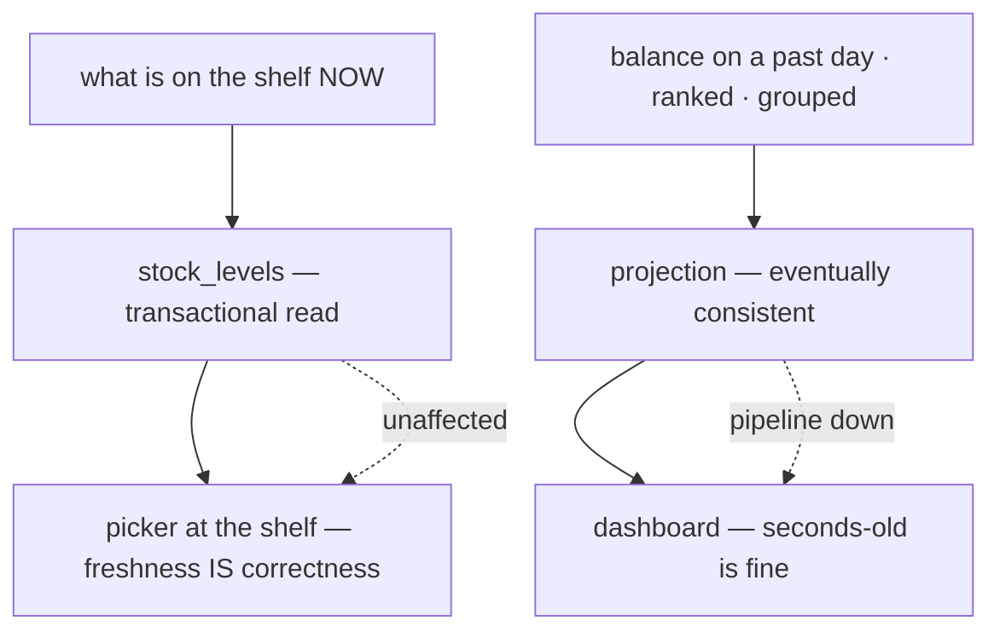

| Goes to the projection | Stays a live query |
| --- | --- |
| history / time series · ranked-by-metric · cross-service grouping | current on-hand, and anything a picker acts on |

**Why:** HARD RULE 10 — an eventually-consistent `ready_qty` is the one property a stock count cannot
have. Consequence: the pipeline being down degrades a dashboard and never a picking screen.

## P2 · Streaming over HTTP push

### The broker's responsibility scope

The boundary is **the server ack**. Before it, ours. After delivery, ours again.

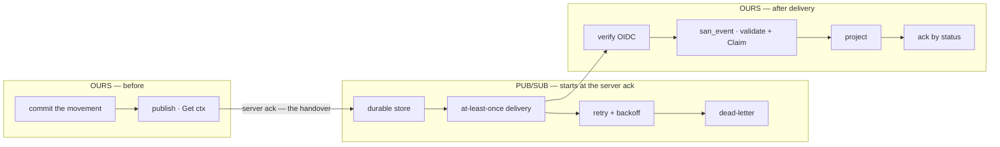

**Pub/Sub owns — rely on it, do not reimplement:** durability · at-least-once delivery to every
subscription · redelivery on non-2xx or ack-deadline expiry · exponential backoff · dead-lettering ·
topic fan-out · and with push, **the delivery rate itself**.

**Pub/Sub does NOT own:**

| Not guaranteed | Why | → Our answer |
| --- | --- | --- |
| **that the publish happened at all** | not in our DB transaction (§5b) | hourly cursor sweep over the log |
| exactly-once processing | at-least-once ⇒ duplicates are normal | `san_event.Claim` on `event_id` + idempotent recompute |
| ordering | none across messages | closing balance from `MAX(movement id)`, never arrival order (§3) |
| history beyond retention | 7d default, **31d max** | replay reads the **log by id range** |
| that the consumer computed correctly | it only moves bytes | the row's own invariant + reconcile |
| endpoint authenticity | Pub/Sub signs OIDC; verifying is the receiver's job | ⚠ currently unverified (§5) |
| that the publisher is still alive | silence and "nothing happened" are identical | heartbeat + staleness alert (§5c) |

### ⚠ Three failure layers — and the DLQ is NOT where bad data goes

Straight from `event_library.md` §2, and it inverts the usual assumption:

| Layer | Trigger | Action | Ends up |
| --- | --- | --- | --- |
| 1 | undecodable / fails validation | `Rejected` → **ACK** | our `RejectHandler` table |
| 2 | `DeliveryAttempt` over threshold | `Rejected` → **ACK** | our `RejectHandler` table |
| 3 | we never ran — panic, OOM, evicted pod | NACK → dead-letter | the DLQ topic |

- **Bad data is ACKed**, not dead-lettered. The DLQ collects *infrastructure* failures, so it works as a
  **detector**: anything in it means our code died before it could even check.
- Set layer 2's threshold **below** `maxDeliveryAttempts`, so our handling always fires first.
- Set `maxDeliveryAttempts` **high (~100)**, not the default 5 — here a NACK only ever means *transient*,
  so a low count dead-letters good events during a short database blip.
- ⚠ Without the IAM grants the dead-letter policy is accepted, looks correct, and **silently does nothing**.

### The driver — what has to be built

`san_event`'s inbound edge is `IncomingMessage`; `event_source` owns drivers. So a push adapter sits
between them. **It does not exist yet** — nothing in `backend/` imports `san_event`.

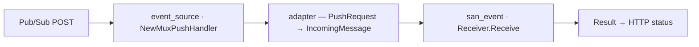

| `Receive` returns | HTTP | Broker |
| --- | --- | --- |
| `Handled` / `Duplicate` / `Rejected`, `err == nil` | `200` | ack |
| any `err != nil` | non-2xx | redeliver |

Convenient: all three Results ack, so the existing `PushHandler func(...) error` shape maps cleanly —
return `nil` on any Result, return the error otherwise.

#### ⚠ Gap 1 — `deliveryAttempt` is not parsed, so layer 2 can never fire

Pub/Sub puts `deliveryAttempt` at the **top level** of the push body, beside `message` and
`subscription`, whenever a dead-letter policy is set. `PushRequest` does not have the field:

```go
type PushRequest struct {
    Message      PushMessage `json:"message"`
    Subscription string      `json:"subscription"`
    // deliveryAttempt — MISSING
}
```

So `IncomingMessage.DeliveryAttempt` would always be `0`, and the receiver's layer-2 test
`msg.DeliveryAttempt > r.maxAttempts` is `0 > 20` — **false forever**.

⚠ **The consequence is the exact inversion `event_library.md` warns about.** `RepeatedFailure` never
fires, so nothing is ever recorded in `inventory_stat_rejects` by that path. Every message our code
keeps dying on rides all 100 attempts and lands in the DLQ — turning the DLQ from a *detector* back
into a queue of bad data, which is the design's stated failure mode.

**→ Recommend:** add `DeliveryAttempt int \`json:"deliveryAttempt"\`` to `PushRequest`. One field, and
it is the difference between layer 2 working and being decorative.

#### ⚠ Gap 2 — the endpoint is unauthenticated

`NewMuxPushHandler` reads the body and dispatches. No OIDC token verification. With push decided this
stops being hypothetical: the URL is public by necessity, and anyone who finds it can POST a forged
`StockMovedEvent` and corrupt a stat table.

**→ Recommend:** verify the Pub/Sub OIDC token in the adapter, before decode.

### ⚠ Push and the sweep are BOTH permanent

The sweep is not a stepping stone that push replaces:

| | Role | Cadence |
| --- | --- | --- |
| **push** | the fast path — a stat is current seconds after the movement | per event |
| **sweep** | the repair floor — everything push structurally cannot deliver (§5b) | hourly, forever |

## P3 · Three daily balance tables

| # | Table | Grain |
| --- | --- | --- |
| 1 | `daily_stock_product` | day × product |
| 2 | `daily_stock_warehouse` | day × warehouse × product |
| 3 | `daily_stock_placement` | day × warehouse × product × rack |

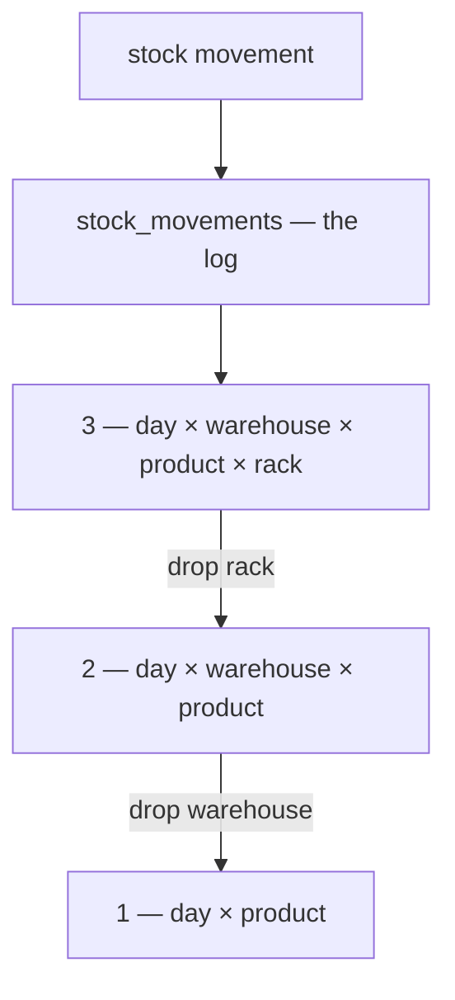

Columns proposed in [§ Proposed Design](#proposed-design); ⚠ dense-vs-sparse is open (§4).

## P4 · One always-running worker instance

A separate binary — not the API mux. It hosts the push endpoint *and* the periodic work.

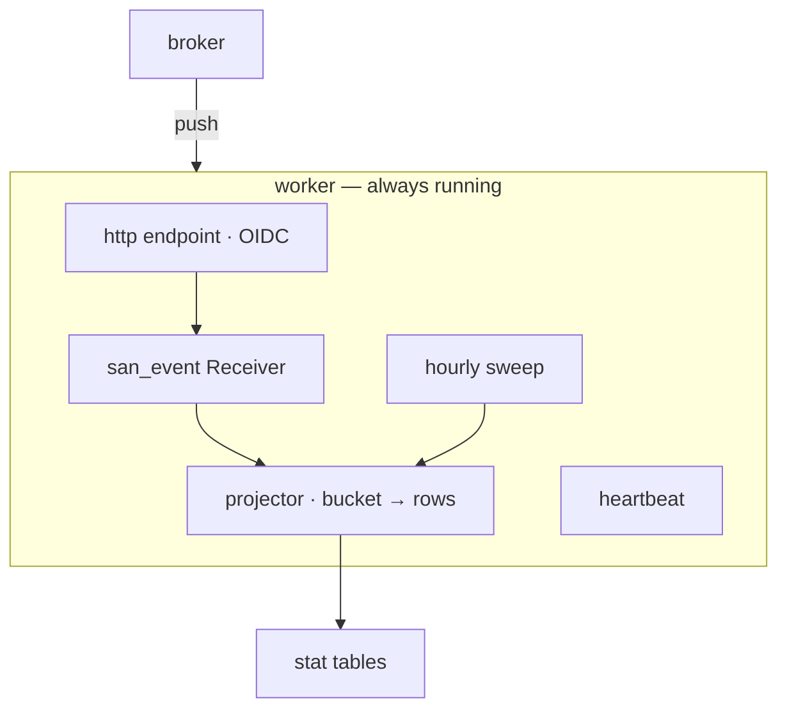

| | |
| --- | --- |
| binary | `backend/cmd/app_worker` — new; `cmd/` holds only `app_development` and `tool` today |
| responsibilities | push endpoint · `san_event` receiver · projector · **daily carry-forward (P8)** · hourly sweep · heartbeat |
| ⚠ still a network service | a push consumer is an HTTP server. "Worker" does not mean "off the network" |

## P5 · Simple: push → process → ack/nack

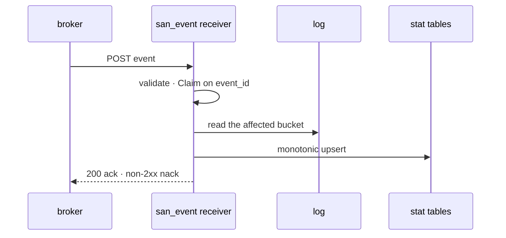

**Status semantics — corrected to `event_library.md` §2:**

| Outcome | Code | Broker does |
| --- | --- | --- |
| `Handled` | `200` | ack |
| `Duplicate` — `Claim` said no | `200` | ack, already done |
| `Rejected` — undecodable / invalid | **`200`** ⚠ | ack. A retry fails identically |
| `error` — db down, deadlock | non-2xx | redeliver with backoff |

⚠ Correct **only** with the two guards in §5a and §5b.

## P6 · Dedup — inventory's own

`san_event` ships `NewDedup(table)` + `ValidateSchema`; **the table, migration and retention are ours**.

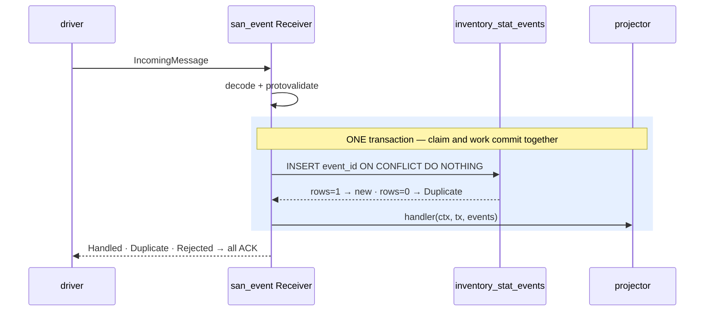

### Tables

```sql
-- inventory_service/db_migrations/000NN_stat_event_dedup.sql
CREATE TABLE inventory_stat_events (
    event_id         TEXT        PRIMARY KEY,              -- the conflict target Claim names
    occurred_at_unix BIGINT      NOT NULL,
    received_at      TIMESTAMPTZ NOT NULL DEFAULT now()    -- Claim leaves this to the DEFAULT on purpose
);
CREATE INDEX inventory_stat_events_received_at_idx ON inventory_stat_events (received_at);

-- a Rejected event is ACKed, so this row is THE ONLY SURVIVING COPY of the payload
CREATE TABLE inventory_stat_rejects (
    message_id   TEXT        PRIMARY KEY,                  -- transport id: repeated rejections collapse
    subscription TEXT        NOT NULL,
    reason       TEXT        NOT NULL,
    err          TEXT        NOT NULL DEFAULT '',
    event_id     TEXT        NOT NULL DEFAULT '',          -- EMPTY when decode failed
    attempt      INT         NOT NULL,
    payload      TEXT        NOT NULL,                     -- protojson — readable without tooling
    attributes   JSONB       NOT NULL DEFAULT '{}',
    rejected_at  TIMESTAMPTZ NOT NULL DEFAULT now()
);
```

### Wiring

```go
dedup, err := san_event.NewDedup("inventory_stat_events")
err = san_event.ValidateSchema(db, "inventory_stat_events")   // refuses to boot on a typo
registry := san_event.NewRegistry()
err = san_event.Register(registry, StockMovedSubscription, projectStockMoved)
receiver, err := san_event.NewReceiver(db, registry, dedup, rejects, 20)   // 20 < maxDeliveryAttempts
```

| Setting | Value | Why |
| --- | --- | --- |
| subscription `maxDeliveryAttempts` | **100** | a NACK here only ever means *transient* — 5 would dead-letter good events during a DB blip |
| receiver `maxAttempts` | **20** | must be **below** 100, so layer 2 fires first and the DLQ stays a *detector* |

### Retention

| Table | Retention | Why |
| --- | --- | --- |
| `inventory_stat_events` | **35 days**, daily `DELETE` by the worker | must outlast every way one `event_id` can return: Pub/Sub retention caps at **31 days**, plus slack |
| `inventory_stat_rejects` | **none — never auto-delete** | the payload is the only copy that exists. Deleting it discards a lost event permanently |

### ⚠ Two traps

**1. The dedup table CANNOT be partitioned.** Postgres requires a partitioned table's unique index to
include the partition key, so `PARTITION BY RANGE (received_at)` forces `UNIQUE (event_id, received_at)`
— and then:

| | |
| --- | --- |
| `ValidateSchema` | **fails at boot** — it requires `indnatts = 1` |
| `ON CONFLICT (event_id)` | **errors at runtime** — no matching unique index |
| ⚠ "fixing" it by keeping the two-column index | **silently destroys dedup** — the same `event_id` at two `received_at` values both insert |

→ Retention is `DELETE`, not `DROP PARTITION`. At ~22,500 rows/day that is trivial.

**2. One table = one GLOBAL `event_id` namespace.** `NewReceiver` takes one `EventDedup` for all
subscriptions, so every event type inventory ever consumes shares this key space. Two types that both
key on a bare row id would collide, and the second is **silently swallowed as a duplicate**.

→ `event_id` MUST carry its own kind prefix — `"stock-moved:8241"`, never `"8241"`. That is already
`event-guideline.md` §1's shape; this makes it load-bearing rather than stylistic.

### Why the DEFAULT implementation, not a substitute

| | |
| --- | --- |
| ✅ **`event_id` is the only key that works for every event type** | inventory consumes `StockMovedEvent` now and product/selling events at phase 5. A natural key like `movement_id` does not exist on those. **Decisive** |
| ✅ boot-time `ValidateSchema` | a substituting service gets **no** boot protection — a migration typo surfaces at the first insert |
| ❌ a `TEXT` key indexes wider than a `BIGINT` | at ~800k rows steady state, irrelevant |

### ⚠ What dedup does NOT do here

The projector is a **full-bucket recompute with a monotonic upsert**, so processing one event twice
produces the same rows. **Dedup is an optimisation for us, not a correctness requirement** — which is
what makes a 35-day retention safe rather than nervous.

It also does **not** cover §5a: that is two *different* events racing on one bucket, and both claims
legitimately succeed.

⚠ And the **hourly sweep bypasses it entirely** — the sweep projects from the log without a claim.
Correct, and only because the projection is idempotent.

## P7 · Balance comes from the log, never from a payload

`event-guideline.md` §3 is binding: **an event carries `delta`, never a level.** So the payload can
never answer "what is the closing balance" — and it must not try.

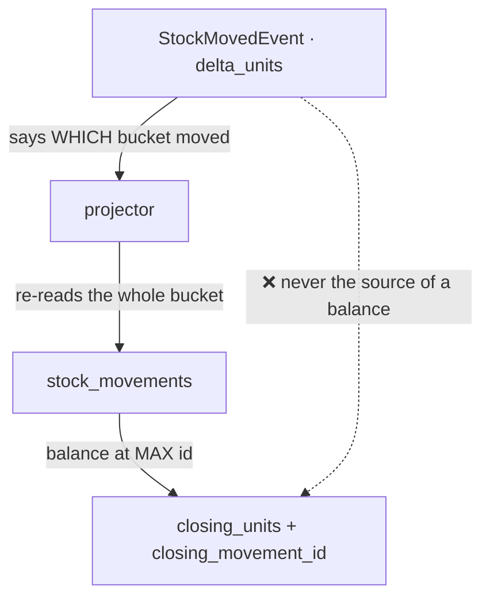

**Spec**

| | |
| --- | --- |
| closing balance | `balance` of the row with **`MAX(id)`** in the bucket — a total order on `BIGSERIAL`, so arrival order is irrelevant |
| stored as | `closing_movement_id`, which is also the §5a monotonic guard |
| the event's role | names the bucket. Its `delta_units` is a fact, not the arithmetic |

**Why this is not a conflict between two final guidelines:**

| Guideline | Says |
| --- | --- |
| `event-guideline.md` §6 | events carry **facts**, never references to look up later |
| `data_pipeline.md` §2 | a batch is a **dirty-set signal** — re-read the whole bucket |

**One event is not a bucket.** The payload carries its own facts (§6 satisfied); the re-read supplies
the other N−1 rows that were never delivered (§2 satisfied). And `stock_movements` is append-only, so
the re-read is of immutable data — the case §6's rationale does not cover.

## P8 · Dense — an absent row means zero

A row exists for **every placement holding stock, every day** — including days it did not move.

| Day | Rows written *(A moves on D2, B on D4, D3 is idle)* |
| --- | --- |
| D1 | A=12, B=5 |
| D2 | A=9, **B=5** |
| D3 | **A=9, B=5** |
| D4 | **A=9**, B=3 |

The bold rows are the cost of dense: statements about things that did not happen. What they buy is that
**every read touches only the day it asks about** — a ranked, paginated query is an index scan inside
one partition, and the §2 rollup is a plain `SUM`.

### ⚠ Dense needs a SECOND writer

The event-driven projector only recomputes buckets that **moved**. Nothing so far writes the unmoved
rows, so density does not happen by itself.

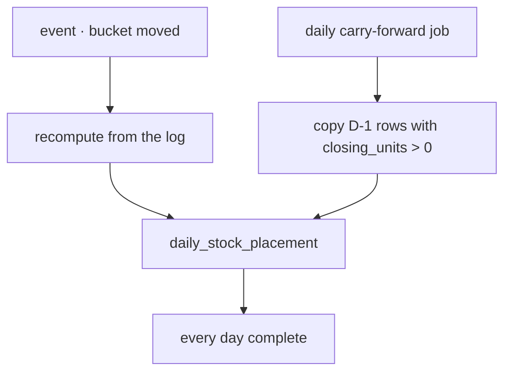

**Carry-forward spec** — for each D−1 row with `closing_units > 0`, write a D row with:

| | |
| --- | --- |
| `opening_units` = `closing_units` | = D−1's `closing_units` |
| every flow column | `0` — nothing happened |
| `closing_movement_id` | D−1's, unchanged |

⚠ A placement whose closing hits **0 is not carried forward**. Its zero-day row still exists (written by
the real recompute, and carrying the `pick_units` that emptied it), and from D+1 absence correctly means
zero. The table never accumulates dead placements.

### ⚠ The two writers race — and the monotonic guard already settles it

Carry-forward and a same-day event can arrive in either order. `closing_movement_id` decides, with no
lock and no scheduling constraint:

| Order | Carry-forward writes | Guard | Result |
| --- | --- | --- | --- |
| carry-forward first, then movement 8500 | id 8000 | `8500 > 8000` ✅ | recompute wins |
| movement 8500 first, then carry-forward | id 8000 | `8000 > 8500` ❌ | carry-forward no-ops |

Both orders land on the same row. This is the §5a guard doing a second job for free.

### ⚠ Consequence: replay is SEQUENTIAL over days

Day D's carried rows are defined by D−1's, so a range replay walks days **in order** from a known-good
day. The moved buckets within one day can still be recomputed in parallel; only the carry-forward pass
chains.

Stated because the obvious optimisation — "replay 90 days in parallel" — is wrong here and would
produce a plausible, wrong table.

### Storage

| | |
| --- | --- |
| ~8.2M rows/year at grain 3 | ≈ 1.6 GB/year — not a number Postgres notices |
| `PARTITION BY RANGE (occurred_on)` | monthly, so old months detach or drop in O(1) |

**Revisit if** occupied-placements ÷ daily-changed-placements rises by ~3 orders of magnitude (a huge,
mostly static catalogue). The escape hatch is sparse + monthly dense anchors, not plain sparse.

## 0. What the final guidelines corrected

Recorded rather than quietly edited, per RULE 8b.9.

| I had written | The guideline says | Effect |
| --- | --- | --- |
| undecodable → `400` → redeliver → DLQ | undecodable → `Rejected` → **ACK 200** → `RejectHandler` | **wrong** — fixed in P5 |
| "no dedup key is needed at all" | `EventDedup.Claim` on `event_id` is part of the receive path, in the caller's transaction | **wrong** — dedup is mandatory. It does *not* solve §5a (see there) |
| "`push_handler.go`'s `MessageID` dedup would break dev" | already resolved: `MessageID` is *"TRANSPORT id — logging only, NEVER the dedup key"*; dedup keys on `event_id`, so dev dedups correctly | **stale** — the comment is legacy text, just delete it |
| the DLQ catches bad messages | the DLQ catches *infrastructure* failure; bad data is ACKed into `RejectHandler` | **wrong** — inverted |
| "lost publish" as a generic dual-write risk | already documented with a sharper concrete cause — see §5b | **corroborated and sharpened** |
| balance is order-sensitive (§3) | promoted to a **contract** rule: an event carries `delta`, never a level | **corroborated** |

---

## Critique

### 1. "Heavy" undersells it — two breaks have no query-side fix

| Break | Why no index helps |
| --- | --- |
| **Metric-sorted pagination** (`RackProductSort.PRODUCT_AMOUNT`) | sorting by a computed metric needs it for *every* row — page 1 costs the whole table |
| **Cross-service grouping** ("stock value by category") | category is in `product_service`. Not a slow query — **not a query** |
| Time series | rescans per request, and `staleTime: 0` means every mount |

**→ Recommend:** the P1 boundary — project history, ranked reads and cross-service only.

### 1b. There is ONE log — and it is already placement-grained

There is no separate "placement log". `stock_movements` carries `rack_id` on **every** row, and its
`balance` is the balance *of that place*. Movement and placement are the same table, at the same grain.

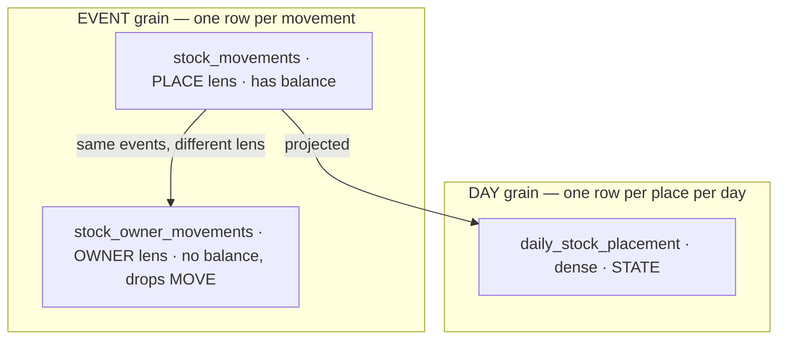

| | Grain | One row per | Answers | Dense in time? |
| --- | --- | --- | --- | --- |
| `stock_movements` | place × **event** | movement | what **happened** | ❌ sparse by nature |
| `stock_owner_movements` | owner × **event** | movement, minus `MOVE` | what happened to **my** goods | ❌ |
| `daily_stock_placement` | place × **day** | day | what was **true** | ✅ dense (P8) |

So the daily table is not a second log: it differs on the **time axis** (event → day) and in **meaning**
(change → state). That is exactly why §4 rejected sparse — a sparse daily table *would* have been a
coarser copy of the log.

#### ⚠ But two event-grain logs DO already exist

`stock_owner_movements` is a second ledger of the same events in a different lens, written by
`appendMovement` in the same transaction. Its own migration says so: *"the same events as
`stock_movements`, projected into the lens of the team that owns the goods."*

That is the duplication in the system today — and §7 already flags it as reference, not template.

**→ Recommend:** do **not** add a third. If the owner grain becomes a fourth daily table (Q4), derive it
from `stock_movements` directly — the log carries `batch_id`, so the batch → restock line → team climb
is available at the source. `stock_owner_movements` is a convenience, not a prerequisite.

#### ⚠ A free invariant nobody checks

`balance` is a **level stored on a change log** — a denormalisation of `SUM(delta)` for that place,
computed by the caller and passed into `appendMovement`. Nothing verifies the two agree.

**→ Recommend:** make it a reconcile check — for any place, `balance` at `MAX(id)` must equal
`SUM(delta)` up to that id. It is the source-side twin of the daily row invariant, and if it ever fails,
**every** daily figure built on that place is wrong at the root.

### 2. ⚠ Grain 2 cannot be computed the way grain 3 is — *superseded by [P9](#p9--split-the-log--quantity-vs-place)*

> **P9 removes this problem at the root.** Once `stock_movements` drops `rack_id`, its `balance` **is**
> the warehouse total and grain 2 becomes a direct read. Kept because the reasoning still governs
> **grain 1 over grain 2**, and because the `row_version` finding below survives.

`stock_movements.Balance` *is today* the on-hand of **that place** — the model says so: *"not the
warehouse's total for the product … a ledger row is a statement about one place."*

#### The trap, with numbers

Warehouse W, product P, racks A and B. Opening: A=12, B=5 — **20 in the building**. During the day:

| id | movement | that rack's balance after |
| --- | --- | --- |
| 101 | pick 3 from A | A = 9 |
| 102 | pick 1 from B | B = 4 |
| 103 | receive 6 onto A | A = 15 |

Truth at end of day: A=15, B=4 → **19**.

Apply grain 3's method at grain 2 — *"the balance at `MAX(id)` for (day, W, P)"* — and `MAX(id)` is 103,
whose balance is **15**. The warehouse appears to hold only what is on the last rack anyone touched.

⚠ **The error is not small and not obvious.** Had the day ended with a movement on a nearly-empty rack,
the building's total would read as almost nothing — and the number is perfectly plausible.

#### There are exactly three ways to get grain 2, and only one is both correct and cheap

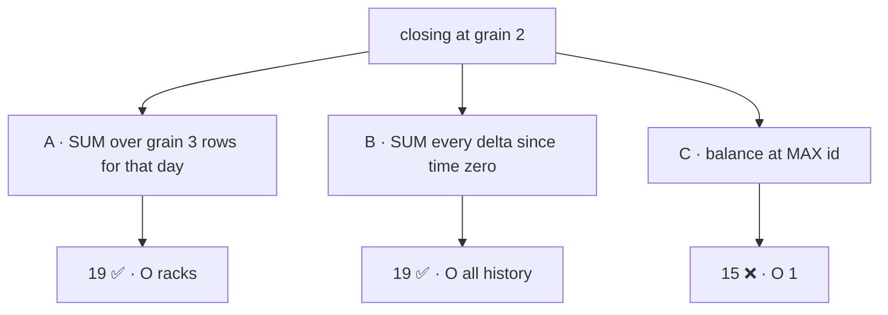

| | Correct | Cost | |
| --- | --- | --- | --- |
| **A — roll up grain 3** | ✅ | O(racks per product) | **the only cheap correct path** |
| **B — sum all deltas from time zero** | ✅ | O(entire history) | independent of grain 3, but unbounded and gets slower forever |
| **C — balance at `MAX(id)`** | ❌ | O(1) | the trap: cheap, plausible, and the natural analogue of grain 3 |

⚠ **Note what this means for "three independent projectors".** Path B is the only genuinely independent
one, and it is unusable. Path A *is* grain 3. So computing grain 2 correctly and affordably **already
contains grain 3** — the choice was never really three projectors versus one.

#### Rolling up also gets the internal-movement rules for free

| At | `MOVE` (rack→rack) | `TRANSFER_OUT`/`IN` (warehouse→warehouse) |
| --- | --- | --- |
| grain 3 | real — two rows, both matter | real |
| grain 2 | **nets to zero** — sums out automatically | real |
| grain 1 | zero | **nets to zero** — sums out automatically |

Projected independently, each of those would be a hand-written special case in a different projector —
and `TRANSFER` is the nastier one, because its two legs live in **different warehouses**, so a grain-1
projector would have to reason across rows it was never handed.

#### ⚠ Materialising the rollups needs invalidation

A rollup that is *stored* rather than computed on read can go stale: change a grain-3 row and the
grain-2 row above it is silently wrong. So every grain-3 upsert must cascade.

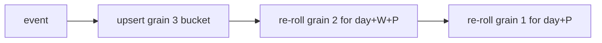

#### ⚠ And the §5a monotonic guard does NOT work on the rollups

This is the part that surprised me. `closing_movement_id` is monotonic **for one bucket**, which is why
it guards grain 3. A grain-2 row's version would be `MAX(closing_movement_id)` over its racks — and
that does **not** move when a non-maximum rack changes:

| | rack A | rack B | grain 2 `MAX` | |
| --- | --- | --- | --- | --- |
| before | 8600 | 8000 | 8600 | |
| after B updates | 8600 | 8550 | 8600 | ⚠ unchanged — but the SUM did change |

The guard would reject a re-roll that is genuinely needed, leaving grain 2 permanently short of B's
correction. Silent, and it only happens when the changed rack is not the day's latest.

**→ Recommend:** give grain 3 a **`row_version BIGINT` from a sequence**, bumped on every write, and let
grains 2 and 1 guard on `MAX(row_version)`. Any change to any input then raises the max, so the guard
fires exactly when it should. `closing_movement_id` stays as grain 3's guard and as provenance.

#### Recommendation

**Project grain 3 only; cascade the rollups from it.** One arithmetic definition, so the grains cannot
disagree; internal movements cancel structurally rather than by special case; and each grain still reads
as a seek.

### 3. ✅ Settled — balance is order-sensitive

Closed by the owner, and moved to [P7](#p7--balance-comes-from-the-log-never-from-a-payload).

### 4. ✅ Settled — dense

Closed by the owner, and moved to [P8](#p8--dense--an-absent-row-means-zero).

The three things sparse would have cost, kept as the reason: it **defeats §1** (a ranked read cannot
sort until carry-forward resolves every product, a full history scan per query), its **read cost grows
with total history** rather than with the answer, and it **breaks the §2 rollup** — an idle day sums to
0 instead of 14, because an unchanged placement is invisible rather than zero.

And the framing: `stock_movements` is already the sparse, change-only record, so a sparse daily table
would be a *second log* rather than a projection.

### 5. On P5 — inline processing is right

I had recommended a dirty table plus a ticker. That argument does not survive the grain: a grain-3
bucket is *one day, one warehouse, one product, one rack*, so fan-in is **1–5 movements**, not hundreds.
Inline also wins on latency, and `data_pipeline.md`'s recompute rule is satisfied either way.

*(Batching is still available for free when it is wanted: `san_event`'s handler signature is
`Handler[T](ctx, tx, events []T)` — a **slice**. A driver delivering several messages lets the handler
collapse buckets across that delivery with no dirty table at all.)*

#### ⚠ 5a. Concurrent handlers lose updates — and dedup does NOT prevent this

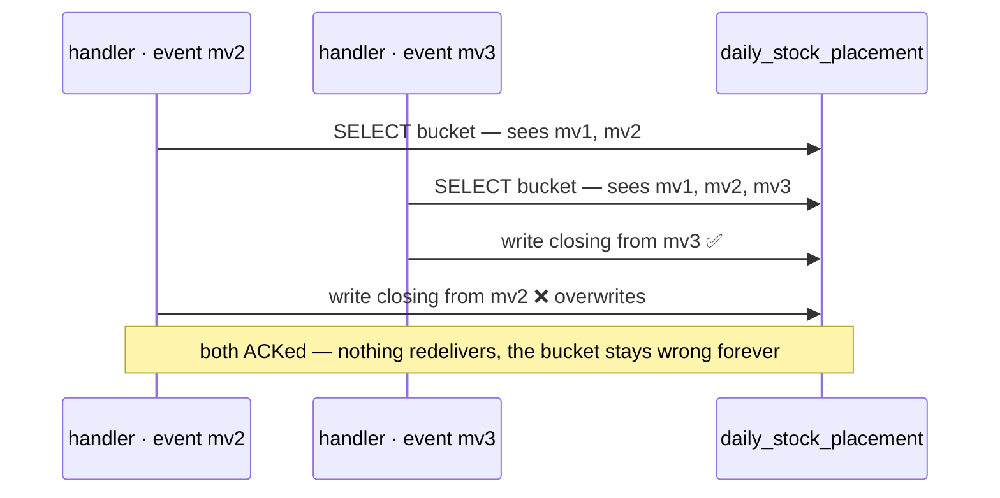

⚠ **`Claim` does not help here.** These are two *different* events with two different `event_id`s —
both are legitimately new. Dedup defends against the *same* event twice; this is different events
racing on the *same bucket*.

**→ Recommend: a MONOTONIC upsert** — one statement that refuses to go backwards:

```sql
INSERT INTO daily_stock_placement (...) SELECT ... FROM stock_movements WHERE <bucket>
ON CONFLICT (occurred_on, warehouse_id, product_id, rack_id) DO UPDATE SET ...
  WHERE excluded.closing_movement_id > daily_stock_placement.closing_movement_id
```

No locks, no ordering requirement — and it also covers two workers during a rolling deploy (§5c).

#### ⚠ 5b. Lost publish — already documented as `san_event`'s architectural blind spot

`event_library.md` records a **sharper cause** than the generic dual-write I had described: both
publishers pass the *request* context to `result.Get(ctx)`, so **a client disconnecting between COMMIT
and durability kills the publish of an already-committed row.**

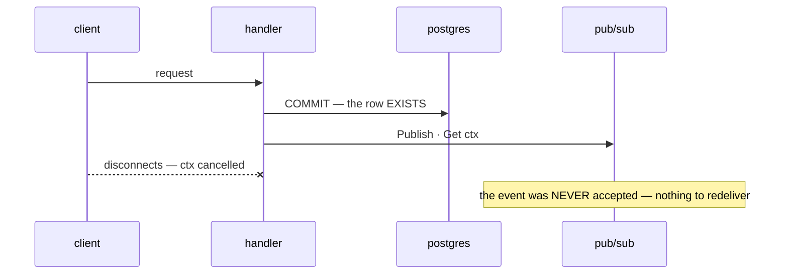

> *"Every recovery mechanism in this plan begins after a successful publish — so this is the hole
> `san_event` is architecturally unable to cover."*

⚠ And it is **biased toward the bad case**: a slow network lengthens the publish *and* raises the chance
of a disconnect during it.

**→ Recommend, in order:**

1. **Apply the fix that is already specified and not yet done** — `context.WithoutCancel` plus a publish
   timeout, inside `NewPubsubEventSender`. It is one edit in one place.
2. **Still keep the hourly cursor sweep.** `WithoutCancel` closes the cancellation window, not a pod
   kill, an OOM, or a quota rejection. And the sweep pays for itself three more times:

| Also repairs | Why the broker cannot |
| --- | --- |
| dead-lettered messages | giving up is *correct* broker behaviour — the bucket is still uncomputed |
| a projector bug fixed later | delivery was fine; the arithmetic was wrong |
| a stat table added next quarter | it needs every movement ever; retention is 31 days at most |

So the sweep is really **the replay mechanism**. Covering lost publishes is the side benefit.

#### Remaining push issue

| ⚠ | → Recommend |
| --- | --- |
| **The push endpoint is UNAUTHENTICATED** — `NewMuxPushHandler` dispatches with no OIDC verification. Anyone who reaches the URL can forge an event and corrupt a stat table | verify the token before the endpoint writes anything |

### 5c. On P4 — do not let `N=1` be load-bearing

| ⚠ | → Recommend |
| --- | --- |
| **One INSTANCE is not one WORKER** — push delivers concurrent requests to one process, so §5a still applies | the monotonic upsert handles it without locks |
| **"One instance" is a deployment promise, not a code property** — a rolling deploy briefly runs two | with the monotonic upsert, two workers are wasteful and never wrong. Then run one |
| **⚠ A single instance is a silent single point of failure** — worker dead → nothing recomputes, lag reads zero, processed days reconcile perfectly. **A stalled projector and a quiet warehouse are indistinguishable** | heartbeat row, alert on **staleness**, not on lag |

### 6. Smaller, but each silent

| ⚠ | → Recommend |
| --- | --- |
| **Missing: value at cost** — FIFO changes which layers remain; #74 says an unknown-cost batch adds **nothing**, not 0 | carry `closing_value` **and `unknown_cost_units`**, or `value = 0` cannot be told from "worthless" |
| **Missing: owner** — one rack holds two teams' batches, so not a free column; but it is why `ProductStats` shows 4 of 5 tiles as em dashes | a **fourth grain** (day × owner × product), not a column on these three |
| **Balance-only cannot say WHY** — a recount 40→37 and a pick of 3 are both `-3` | split the day's flow **by Kind** on the row |
| **No business date on the log** — only `created_at`; `revenue_list.go:242` already parses UTC, so revenue months run 07:00→07:00 Jakarta | see §6b — it is not as simple as adding a column |

#### ⚠ 6b. The day boundary — a genuine trade, not a free column

`event_library.md` deliberately keeps `occurred_at_unix` a **timestamp, not a date**: *"which day it
belongs to is the consumer's decision — a stored date would freeze that choice into every event ever
published."*

The same argument applies one layer down, to storing `occurred_on DATE` on the log:

| | ✅ | ❌ |
| --- | --- | --- |
| **stored column** | partitioning by range needs it; bucket re-reads are an index seek | freezes the timezone into an append-only table — changing it is a full backfill |
| **expression index** on `(created_at AT TIME ZONE tz)::date` | nothing frozen; changing tz rebuilds an index | cannot `PARTITION BY` a bare expression |

**→ Recommend: the stored column, with the freeze stated up front** — partitioning is worth more than
timezone flexibility, and a tz change is a once-ever event. But it **must** be written by the single
shared day-boundary function `data_pipeline.md` §5 already requires, not by whatever `time` call is
nearest.

### 7. What already exists is reference, not template

| Existing | Weakness worth not copying | → Recommend |
| --- | --- | --- |
| `stock_owner_movements` written **in the movement's transaction** | every pick pays a 3-table ownership climb inline, on the hottest write path | keep projection **out** of the write transaction |
| its backfill is one-shot SQL in a migration | no rebuild machinery | make replay a **first-class command** |
| ownership pinned at write time | correct a restock's requesting team later and the projection is silently wrong | reconcile must cover **restated** source rows |

---

## Recommendation

**P5 is right. It needs exactly two guards, plus one fix that already has a specification:**

1. **A monotonic upsert per bucket** (§5a) — concurrency, redelivery, out-of-order arrival and a
   two-instance deploy all become harmless in one statement.
2. **An hourly cursor sweep** (§5b) — the replay mechanism, and the floor under everything push loses.
3. **`context.WithoutCancel` + timeout in `NewPubsubEventSender`** — already specified in
   `event_library.md`, not yet implemented, and it is the single largest source of lost events today.

---

## Proposed Design

*The parts P1–P5 do not yet settle.*

### The event

Per `event-guideline.md` — derived id, business time, delta not level, unit in the name:

```proto
message StockMovedEvent {
  option (warehouse.event_base.v1.event_config).event_topic = "stock-moved";

  string event_id         = 98;  // "stock-moved:<movement_id>" — DERIVED, never a UUID (§1)
  int64  occurred_at_unix = 99;  // movement.CreatedAt — never time.Now() (§2)

  uint64 movement_id  = 1;       // the immutable log row; becomes closing_movement_id
  uint64 warehouse_id = 2;
  uint64 product_id   = 3;
  uint64 rack_id      = 4;       // 0 = unplaced
  int64  delta_units  = 5;       // CHANGE, never balance (§3) — and unit in the name (§4)
  int32  kind         = 6;
}
```

Dedup and reject tables are specified in [P6](#p6--dedup--inventorys-own).

### Columns

The 7 movement kinds split two ways, and that split decides the columns:

| Class | Kinds | Changes what is HELD? |
| --- | --- | --- |
| **External** | `RECEIVE`, `RETURN`, `PICK`, `ADJUST` | yes — at every grain |
| **Internal** | `MOVE` (rack→rack), `TRANSFER_OUT`/`IN` (warehouse→warehouse) | no — it only relocates |

**Each rollup level cancels exactly one internal kind:**

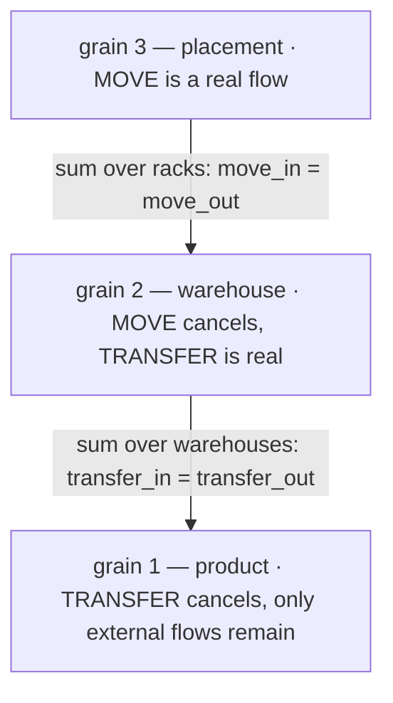

```sql
-- GRAIN 3 · daily_stock_placement — the only table read from the log
occurred_on DATE, warehouse_id, product_id, rack_id        -- rack_id NULL = unplaced
opening_units, closing_units                               -- closing = balance at MAX(movement id)
closing_movement_id                                        -- provenance AND grain 3's monotonic guard
row_version BIGINT                                         -- from a sequence; the ROLLUPS' guard (§2)
receive_units, return_units, pick_units, adjust_units      -- external; adjust is SIGNED
transfer_in_units, transfer_out_units                      -- internal, cancels at grain 1
move_in_units, move_out_units                              -- internal, cancels at grain 2
closing_value, unknown_cost_units
movement_count
UNIQUE (occurred_on, warehouse_id, product_id, rack_id) NULLS NOT DISTINCT
PARTITION BY RANGE (occurred_on)                           -- monthly

-- GRAIN 2 · daily_stock_warehouse — rollup of grain 3
+ transfer_in_units, transfer_out_units   (still real)
+ internal_move_units                     (metric only)
+ placement_count

-- GRAIN 1 · daily_stock_product — rollup of grain 2
+ internal_transfer_units                 (metric only)
+ warehouse_count, placement_count
```

**Every row is self-checking.** The invariant simplifies as internal flows cancel:

| Grain | Invariant |
| --- | --- |
| 3 | `opening + receive + return + transfer_in + move_in − pick − transfer_out − move_out + adjust = closing` |
| 2 | `opening + receive + return + transfer_in − pick − transfer_out + adjust = closing` |
| 1 | `opening + receive + return − pick + adjust = closing` |

⚠ **`TRANSFER` only cancels at grain 1 while it stays single-step.** `stock_transfer.go` writes both
legs in one transaction today. Dispatch-then-receive with days in transit breaks grain 1's invariant.

### Supporting tables

```sql
stat_projector_cursor ( name, last_movement_id )               -- the hourly sweep
stat_projector_health ( name, last_tick_at, last_sealed_on )   -- staleness alerting
```

Plus `inventory_stat_events` and `inventory_stat_rejects` — specified in [P6](#p6--dedup--inventorys-own).

Change to the log: **`occurred_on DATE`**, written by the shared day-boundary function (§6b).

### Rules the code must hold

| | |
| --- | --- |
| closing balance | `balance` at **MAX(id)** from the log — never a payload, never "last arrived" |
| the write | **one monotonic upsert per bucket** — grain 3 guards on `closing_movement_id`, the rollups on `MAX(row_version)` (§2) |
| dedup | `Claim` on `event_id`, in the projecting transaction — but it does **not** cover §5a |
| `Rejected` | ACK, and record before acking — the payload is the only copy |
| replay / reconcile | the projector over a range; reconcile is the same run with writes off |
| grain 2 and 1 | rolled up from grain 3, never projected from the log |
| current stock | never from these tables |
| liveness | heartbeat; alert on **staleness**, because a dead projector shows zero lag |

### Phasing

| Phase | Delivers |
| --- | --- |
| 0 | `WithoutCancel` + timeout in `NewPubsubEventSender`; `deliveryAttempt` on `PushRequest`; delete the stale `push_handler.go` dedup comment |
| 1 | **P9 split** — `stock_placements` + backfill, `rack_id` off `stock_movements`; `occurred_on` on both logs + timezone decision + the shared day-boundary function |
| 2 | `cmd/app_worker` + grain 3 projector + monotonic upsert + **daily carry-forward** + hourly sweep — **useful on its own**, stats at hourly latency with no broker |
| 3 | `StockMovedEvent` + push adapter with OIDC + P6 dedup and reject tables + 35-day cleanup — **drops latency to seconds** |
| 4 | grain 2 and 1 rollups |
| 5 | cross-service stats — the case that actually needs the broker |

---

## Question

Where I hold a position it is stated — argue back.

1. **Business day = `Asia/Jakarta`?** ⚠ **Now the top blocker** — P8's carry-forward runs per day, so
   nothing daily can be built until the boundary is defined (§6b).
2. **How many racks does one product usually sit on?** A warehouse fact I do not have. At ~1.5, grain 2
   is two-thirds the storage of grain 3 to save a GROUP BY over 1.5 rows — close to waste.
3. **`opening_units` — worth a column?** *I say yes*; it makes every row verify itself.
4. **Owner — fourth grain, or out of scope for now?** If yes, derive it from `stock_movements`, not from
   `stock_owner_movements` — no third log (§1b).
5. **Does one event recompute all three grains, or only grain 3** with 2 and 1 rolled up on a tick?
6. **Where do the stat tables live** — inventory, or an analytics service?
7. **What runs the worker — Cloud Run, k8s, a VM?** Decides whether a public push endpoint is free.
8. **Is multi-day `TRANSFER` on the horizon?** It breaks grain 1's invariant.
9. **Which screen reads these first?**
