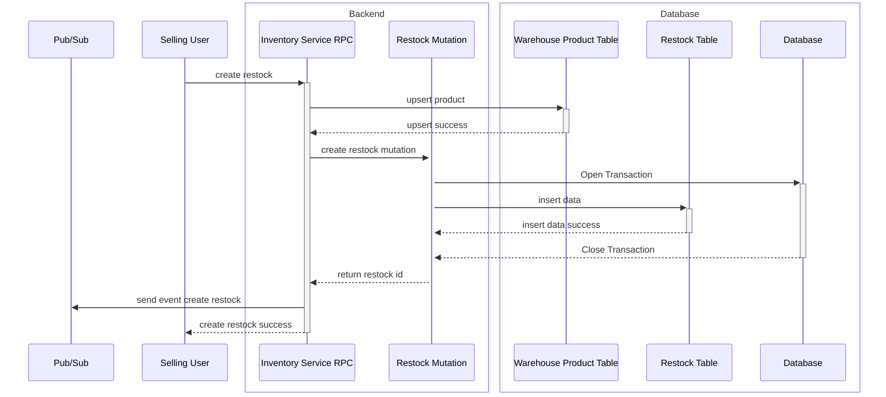
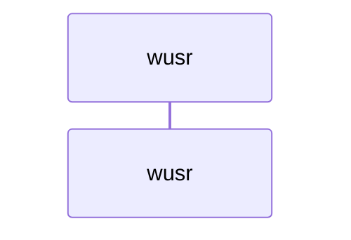
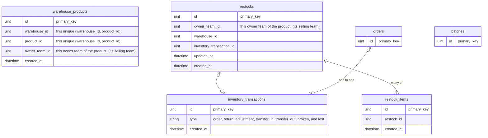

# Stock Design
**This is architectural design for stock related.**

## General Brief
1. In Stock there is 2 component that we track the movement.
    - stock quantity &rarr; that be `int`
    - stock valuation &rarr; that be `float64`

2. important thing component should be know in this design.

## Implementing The Ledger from [Mutation & Ledger](./mutation_and_ledger.md)
1. Because we have 2 thing that be tracked. the `state` should be have:
    - stock_balance
    - valuation_balance
2. Because we have 2 thing that be tracked. the `ledger log` should be have:
    - stock_balance_after
    - valuation_balance_after
    - stock_change
    - valuation_change

4. smallest grain that we tracked is by `batch_id`

## Flow Of Create Restock.

## Flow Of Accept Stock.

## Entity Relationship.

## Batch
Batch is usefull data table for how we provisioning stock later.

