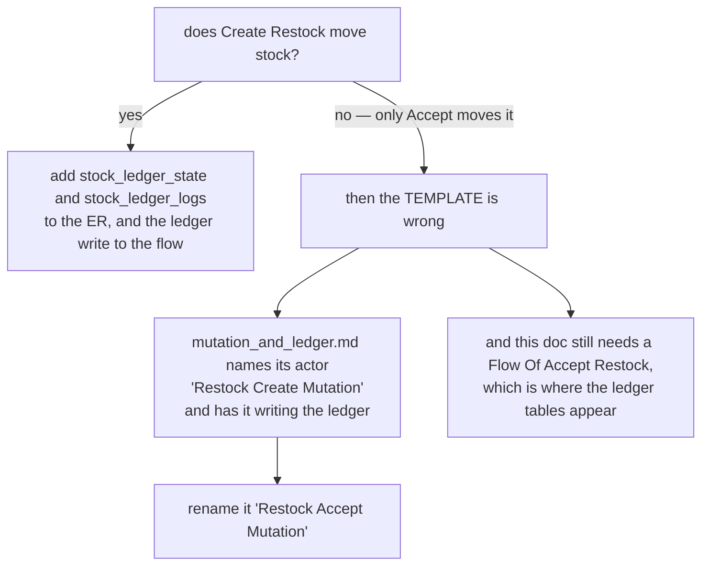
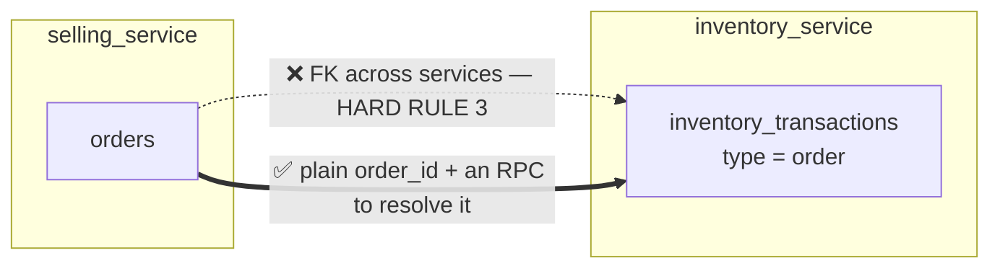
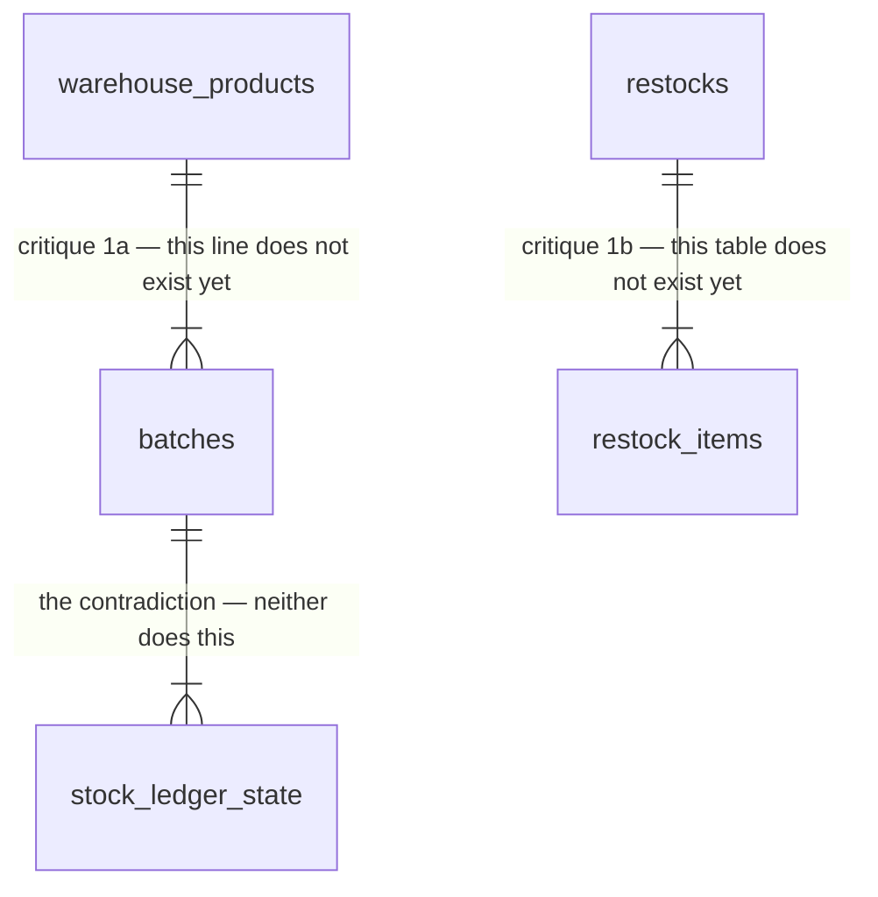
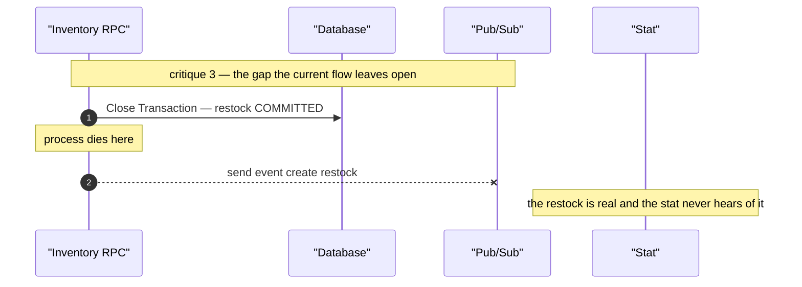
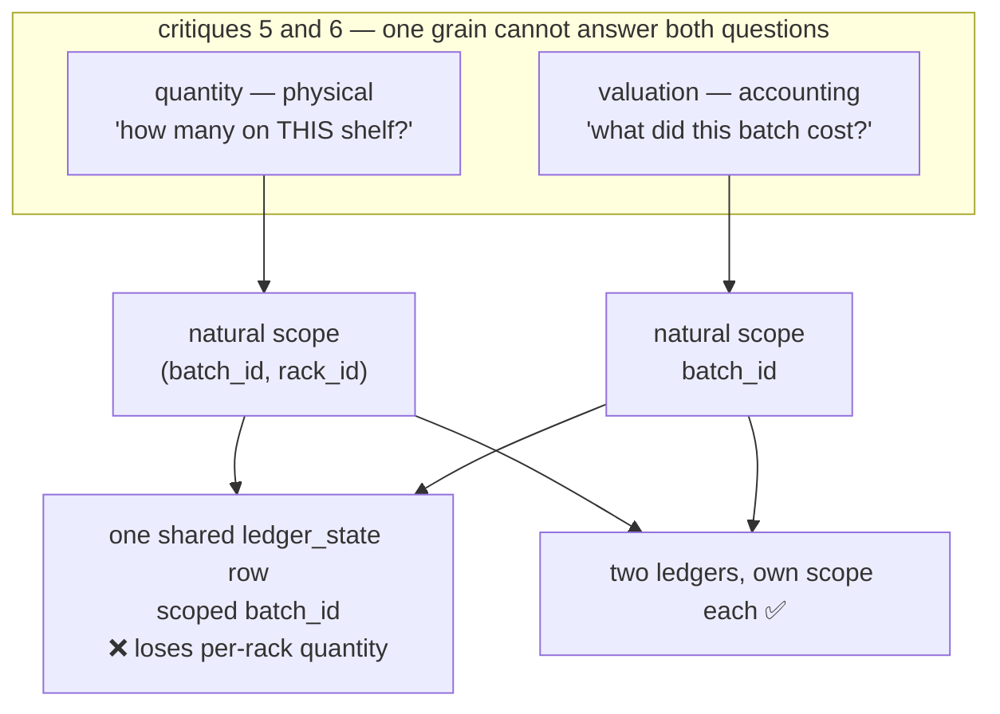

# Clarity — `stock_design.md`

Critique, questions and warnings about [stock_design.md](stock_design.md). That doc is yours; this
one is mine. Re-examined whenever you update it — answered points are **deleted** here, not struck
through, so this file is always the *current* open set.

> **Last pass:** `inventory_transactions.type` was added — that closes the "no way to tell what caused
> a ledger entry" critique, deleted. The enum it lists, and the new `orders` table beside it, open the
> two contradictions below.

---

# Contradiction

## Stock declares a ledger, and then designs a schema without one

Five statements, and they cannot all be true.

| where | says |
| --- | --- |
| [mutation_and_ledger.md](mutation_and_ledger.md) `## Ledger Log.` | *"cannot change the `State` without log recorded in `Ledger Log`"* |
| `## Implementing The Ledger` (this doc) | state holds `stock_balance` / `valuation_balance`, the log holds their `change` / `after` |
| `## Entity Relationship.` (this doc) | **no `ledger_state` table. No `ledger_logs` table.** The schema that would hold the above does not exist in it |
| `## Flow Of Create Restock.` (this doc) | opens a transaction, inserts a restock row, closes it — no ledger write |
| [mutation_and_ledger.md](mutation_and_ledger.md) stat flow | the event is *"restock_id **+ ledger log**"* — there is no ledger log to send |

The ER diagram is the strongest site: `## Implementing The Ledger` is a *statement of intent*, and the
schema right below it is where that intent either exists or does not.

**→ Recommend:** pick the fork, then make the ER diagram carry the answer.

I lean **no — only Accept moves stock**: goods announced but not received are not on a shelf, and a
warehouse that counts them is lying to itself. But then the template's worked example is the misleading
one, and it is what every other service will copy.

**Three changes now point that way without saying it:**

| change | what it implies |
| --- | --- |
| `## Flow Of Accept Stock.` exists as its own section | Accept is a distinct operation, not a status flip |
| `re \|o--o\| tx` — weakened from `\|\|--\|\|` | a restock can exist with **no** transaction, so the transaction is minted later |
| Accept's actor is **`wusr`**, Create's is **`susr`** | *different people*: the selling team announces, the warehouse team receives |

The third is the one I find most convincing, and it is a warehouse argument rather than a schema one —
the person who says goods are coming is not the person who puts them on a shelf, so the count cannot
move on the first one's say-so. It is still only implied: the fork is not resolved until a sentence
says which mutation moves stock, and the template's `Restock Create Mutation` is renamed to match.

## The transaction type list has no value for a restock

`inventory_transactions.type` is *"order, return, adjustment, transfer_in, transfer_out, broken, and
lost"*. Two lines below it, `re |o--o| tx` says a restock points at one. **A restock is none of those
seven** — goods arriving from a supplier is not a transfer between warehouses, and it is not an
adjustment.

**→ Recommend:** add `restock` (and, once Accept exists, decide whether accept is a *second*
transaction or the same one completing). Also — the list reads as the union of everything that ever
moves stock, which makes it the most valuable line in the ER: it is a complete inventory of the
mutations this design owes a flow to.

## The ER crosses a service boundary

`orders` appears as a table with `ord |o--o| tx` drawn to `inventory_transactions`. But **`order.go`
lives in `selling_service/selling_service_models/`**, while the inventory tables live in
`inventory_service/inventory_service_models/`. HARD RULE 3: *"A model belongs to exactly one service.
If two services need the same data, that is a contract question (an RPC), not a reason to share a model
package."* An FK between them is exactly the coupling that rule forbids.

**→ Recommend:** if `orders` is drawn as *context* — showing where an `order`-type transaction comes
from — mark it so, and drop the relation line. If it is a real FK, it is not implementable as drawn:
carry `order_id` as a plain uint reference with no constraint, and treat resolving it as an RPC.

---

# Critique

| | Problem | → Recommend |
| --- | --- | --- |
| **1** | **The ER's tables and its relations do not yet agree with the design.** (a) **`restock_items` has no product, no quantity, no cost** — so a restock still cannot say *what* or *how many*, and there is nothing for a ledger change list to be built from. (b) **`batches` has only `id` and no relation** — yet `batch_id` is the declared smallest grain of the whole ledger, so the grain has no schema behind it. (c) **`re \|o--o\| tx` says the transaction is OPTIONAL, but `restocks.inventory_transaction_id` is a plain `uint`** — a non-nullable integer cannot express "none", so absence becomes `0`, a magic sentinel that joins to nothing and reads as a real id in every query that forgets to exclude it. (d) **`type` is an unconstrained `string`** — seven values written in a comment is a spec, not a constraint, so `"transfer_in"` and `"transfer-in"` both insert cleanly. | (a) `restock_items`: `product_id` (or `batch_id`), `qty`, `unit_cost`. Its `qty` × `unit_cost` **is** the ledger change list, so this is the table the whole design rests on. (b) Link `batches` to `warehouse_products` and give it what makes it a batch — supplier, cost, expiry, received-at. (c) Make the column **nullable** (`*uint`) and say when it is filled. If it is filled at Accept, that is the contradiction above answering itself in the schema — write it down rather than leaving it implied by a cardinality glyph. (d) A proto enum or a check constraint, so the seven values are enforced where they are stored. |
| **2** | **The transaction is not the atomicity boundary.** (a) `upsert product` runs *before* `Open Transaction`, so a failed restock insert leaves an orphan `warehouse_products` row with nothing to clean it up — and it is an unguarded concurrent write. (b) There is **no commit/rollback branch**: the template has `alt Error Happen → rollback / else → commit`, this has an unconditional `Close Transaction`. | Move the upsert **inside** the transaction as `INSERT … ON CONFLICT DO UPDATE`, and draw the `alt`. Everything the request writes should commit or vanish together. |
| **3** | **`inv->>pub` fires AFTER commit, outside the transaction.** Crash between `Close Transaction` and the publish and the event is gone permanently — the restock is real, the stat never hears of it, nothing detects the gap. This is [`mutation_and_ledger_clarity.md`](mutation_and_ledger_clarity.md) critique #7 in its first concrete instance, on the highest-volume write in the system. | A **transactional outbox**: write the event row in the same transaction, a relay publishes it. If you would rather not, say explicitly that midnight reconcile is the recovery path — but reconcile cannot rebuild what was never ledgered, so that only works after the contradiction above is resolved. |
| **4** | **`stock valuation → float64`.** Binary float cannot represent `0.1`, so `sum(valuation_change)` and the stored balance drift apart. Quantity as `int` is right and closes half of this — valuation is the half that breaks the rule `## Ledger Log.` committed to. | **`numeric`**, or integer minor-units (rupiah has no sub-unit in practice, so `int64` rupiah is exact and fastest). Not float. |
| **5** | **Can one batch sit in more than one rack?** If yes, `batch_id` is **not** the smallest grain for *quantity* — `(batch_id, rack_id)` is — and the ledger cannot answer "how many of this batch are on that shelf". That is what a person standing at the shelf during a stocktake is asking, so a count they cannot reconcile is a count they cannot trust. | If a batch can span racks, scope quantity at `(batch_id, rack_id)`. If a batch lives in exactly one rack by definition, **say that sentence** — it is load-bearing and currently only implied. |
| **6** | **Quantity and valuation may not HAVE the same natural grain.** Quantity is physical and belongs where the goods are. Valuation is an accounting fact about the *batch* — it does not sit on a shelf. Scope both at `(batch_id, rack_id)` and valuation fragments across racks arbitrarily. Scope both at `batch_id` and per-rack quantity is lost (#5). | Be willing to split: **quantity scoped `(batch_id, rack_id)`, valuation scoped `batch_id`** — two `ledger_state` tables, each with its own log. Not against the template: the template is *per ledger*, and this is two ledgers. |
| **7** | **If `rack_id` enters the scope, "unplaced" makes it NULLABLE — and that breaks uniqueness.** This system treats unplaced stock as a real state, not an absence (why `RackSelect` keeps "unplaced" selectable). A nullable `rack_id` hits Postgres `NULL != NULL`: the unique index stops constraining, duplicate state rows appear, and the upsert loses its conflict target. | Never NULL in a scope column. Use a **sentinel "unplaced" rack row** so every state row has a real `rack_id`. |
| **8** | **The real problem with valuation is DIVISION, and the column type alone does not fix it.** Average cost is `total / qty`, non-terminating the moment qty is 3. Round the derived unit cost and `333.33 × 3 = 999.99` against a `1000.00` balance — `sum(change) != balance` returns by a different door whatever the type. | Round the **`change`**, never the derived unit cost, and give the remainder its own log row. Then replay reproduces state exactly. |
| **9** | **`int` quantity needs its BASE UNIT stated.** "3" of what — pieces, grams, ml? If anything is ever sold by weight, the base unit is the difference between `int` working and `int` forcing a migration of every ledger row. | One line: *quantity is an integer count of the product's base unit, fixed per product.* |
| **10** | **The per-measure shape is decided in the INSTANCE, but it is a TEMPLATE rule.** You answered it fully — one `change`/`after` pair per measure. [mutation_and_ledger.md](mutation_and_ledger.md) still shows a single pair and never mentions measures, so the next service invents its own. | Promote it into the template. Stock then reads as an instance of a stated rule. |

---

# Question

1. **Does Create Restock move stock, or only Accept?** (contradiction) The one I need most — it decides
   whether this flow and this ER are missing the ledger, or the template's example is mislabelled.
   I lean **only Accept**.
2. **Can a batch occupy more than one rack?** (#5) Decides the scope, and the scope decides the tables.
3. **One ledger for both measures, or two?** (#6) I recommend **two**.
4. **Valuation type — `numeric`, or integer rupiah?** (#4) I recommend **integer rupiah (`int64`)**.
5. **Outbox, or reconcile-as-recovery?** (#3) I recommend the **outbox**.

---

# Awaiting

- **`## Batch`** — one line, saying what a batch is **for** but not what it **is**. Three things written
  there would **close** open points rather than add to them: whether a batch can be in more than one
  rack (settles #5, #6); whether a batch is per receipt or per product-per-supplier-per-cost (decides
  whether #8's rounding is one-time or recurring); and whether a batch can be **split or merged** — if
  yes, the ledger needs that as an explicit movement, or balances change with no log entry.
- **`## General Brief` item 2** — *"important thing component should be know in this design."* is a stub.
