# The Stock Movement Log — and the histories read from it

> ⚠ **GRAIN CHANGED — [ledger-splits-by-question](database/stock_design.md#ledger-splits-by-question) (owner, 2026-08-07).**
> The ledger splits into a **placement** ledger (no `batch_id`) and a **batch** ledger (no `rack_id`), so
> `(rack, batch)` is no longer a grain. **Rules below phrased in those terms are superseded** — see
> [the-cross-product-grain-was-assumed-everywhere](database/stock_design.md#the-cross-product-grain-was-assumed-everywhere).
> This doc is rewritten once the open sub-parts settle, not before.

> ⚠ **`disscuss/` is NOT final.** Mid-argument. Do not build from this.

Siblings: [stat_event_processing.md](stat_event_processing.md) projects the log into *daily state* ·
[batch_selection.md](batch_selection.md) decides **who** chooses a batch · [fifo.md](fifo.md) is **how**
the machine walks the layers when it is the one choosing · [rack_selection.md](rack_selection.md) decides
**which rack** — and answers whether the log splits in two. This one is about the log itself and the
**event-grain** reads over it.

⚠ **The SCHEMA has been REOPENED** and moved back to
[database/stock_design.md](database/stock_design.md) — it is a `disscuss/` doc again, so **nothing about
the stock schema is authoritative right now**. It is still the best statement of the shape and this doc
should keep deferring to it; it just no longer settles anything. **This doc keeps the RULES**, and several
of its decisions below are marked superseded where the schema work overturned them.

⚠ **This doc DRIFTS from the schema in two places, and the schema doc is the later thinking.** It still diagrams a
single `stock_movements` with a nullable `rack_id` — the ledger is
[two tables sharing one sequence](database/stock_design.md#the-ledger-is-two-tables) —
and it describes found goods by a rule that was
[reversed](database/stock_design.md#the-claim-pool). Read this doc for the
**argument**, never for the **shape**.

⚠ **P7's rack scope is contradicted and pending** — see
[rack_selection § Contradiction](rack_selection.md#the-rack-axis-was-never-chosen-so-each-doc-assumed-a-different-answer).

# Proposal

**Closed by the owner.** Everything outside this section is still argument.

| § | Decided |
| --- | --- |
| P1 | **The grain is `(rack, batch)`** — no `stock_places` table |
| P1b | **ALL stock is PLACED — `rack_id` is NOT NULL.** No unplaced pile, no staging: receiving lands directly on the shelf. **Strict about WHERE, silent about how much a rack holds** — capacity is a human judgement, not a model |
| P2 | **One state table at that grain, carrying the `balance`** — `stock_levels` and `stock_shelf_batches` both fold into it. Every FK single-column, and only `rack_id` / `batch_id` can have one |
| P3 | **The ledger records at the same grain**, one row per batch a change touches — so FIFO attribution stops happening off-ledger |
| P4 | **`stock_levels` goes** — one snapshot, no coarser rollup |
| P5 | **`stock_owner_movements` goes** — the owner lens is a JOIN, not a second ledger |
| P6 | **The ledger keeps an `after_balance`**, at `(rack, batch)` grain |
| P7 | **Write protocol: lock the state rows, read `old`, accumulate in memory** — plus its four hazard rules, and **READ COMMITTED is required, with no retry loop** |
| P8 | **Migration is a FRESH START** — new tables created empty, no backfill. Nothing is in production |
| P9 | **Vocabulary: `balance` is THE word.** State carries `balance`, the log carries `after_balance`. `on_hand` and `qty` are retired |
| P10 | **There is no unit without a batch.** ⚠ *Was: "Found goods are recorded by **creating a batch**, then placing it."* **SUPERSEDED** — found goods RECOVER a recorded loss and rejoin the batches they were lost from ([found-recovers-a-loss](database/stock_design.md#found-recovers-a-loss)). Minting is the **refused** path: no prior loss means the goods *arrived*, so they enter by restock |
| P11 | **An `inventory_transactions` table — for EVERY stock action, not just inbound.** Batches and movements both reference it. The **document** points at the transaction with a `UNIQUE` typed FK — a delivery is accepted exactly once — and the ledger's `source_kind` / `source_id` are deleted |
| P12 | **A TRANSFER MINTS new batches in the destination** — one per source layer drawn ([mint-per-layer](fifo.md#mint-per-layer)). A batch never leaves the warehouse it was created in — so `warehouse_id` on the stock rows is a plain copy, not a second fact |
| P12b | **Aggregates stay LIVE for now**, statistics become event-fed projections later — so the ledger optimises for a believable page, not for `GROUP BY` |
| P13 | **One event per `inventory_transaction`, carrying its movement lines** — not one per ledger row. `event_id = "inventory-txn:<id>"` |
| P14 | **Every lens coarser than `(rack, batch)` DERIVES its running balance** — anchor + walk, bounded by the page. Never a full-history window |
| P15 | **A nightly reconcile is part of the design, not a nice-to-have** — four checks, because two stored numbers and two unenforceable copies exist precisely so nobody recomputes them |
| P16 | **`created_at` is the only time on a row.** No `occurred_at` |
| P17 | **`ADJUST` splits into `RECOUNT` · `LOST` · `BROKEN`** — three movement kinds, so the batch lifecycle becomes fully derivable from the ledger |
| P18 | **Two defects fixed with the build** — history filters move server-side (with `rack_id` added), and the indexes follow the new grain |
| P19 | **A `stock_transfers` document with a lifecycle** and TWO transactions — `TRANSFER_OUT` in the source at dispatch, `TRANSFER_IN` in the destination at receipt. In transit, stock is in **no warehouse** |
| P20 | **The reconcile says what to DO** — a copy disagreeing with its source is REPAIRED; two sources disagreeing is an ALERT. `after_balance` is derived, so it rebuilds |
| P21 | **Empty state rows are pruned** — `balance = 0` older than a grace period, and **strictly after** the reconcile, never before |
| P22 | **`delta` is naturally signed**, independent of `kind` — and the sign guard is in the **write path**, not a `CHECK`, because a constraint would hardcode enum numbers that live in the proto |
| P23 | **A transfer is THREE RPCs**, each with one scope — dispatch and cancel in the source, receive in the destination. **A refusal is not a cancel, it is a new transfer** |

## P1 · The grain is `(rack, batch)`

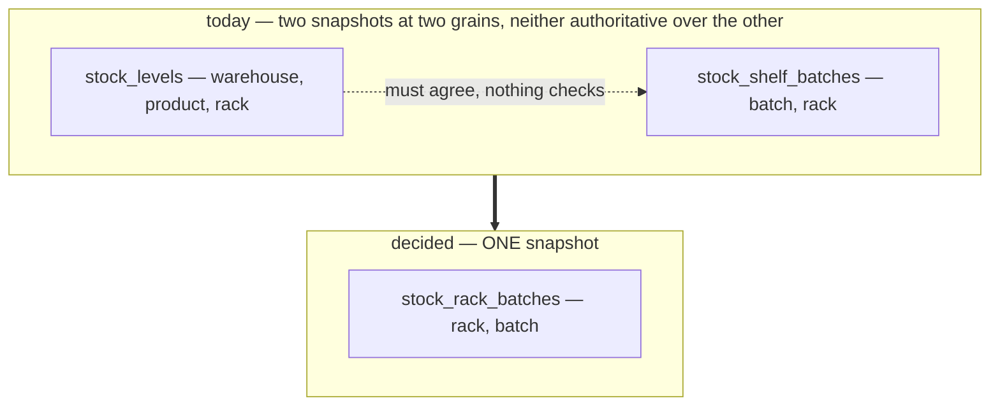

**A batch already determines its warehouse and product**, so `(rack, batch)` is the whole address —
adding product to the key would store it twice and need machinery to stop the two copies disagreeing.
`stock_shelf_batches` is already keyed on `(batch_id, rack_id)`, so this is a rename and a column rather
than a new table.

| | |
| --- | --- |
| **the place is the RACK**, which already has an id | nothing new is needed to address a shelf. ⚠ **Capacity is deliberately NOT modelled** — see P1b |
| **min/max and put-away targets are SLOTTING** | their own `product_slotting (warehouse, product, rack, …)` table when that day comes. Slotting is not stock, and the ledger must not depend on it |

## P1b · All stock is PLACED — `rack_id` is NOT NULL

This reverses #135's *unplaced pile*, and it deletes four separate special cases at once:

| Gone | Was |
| --- | --- |
| `NULLS NOT DISTINCT` on the state key | the clause stopping one batch from having six different "somewhere" rows |
| `IS NOT DISTINCT FROM` in every lock and read | `rack_id = NULL` is never true in SQL, so a plain `=` silently found nothing and reported phantom "insufficient stock" |
| "unplaced first" in the lock ordering rule | NULL is not comparable, so it needed a hand-written exception |
| a nullable FK, and the `MATCH SIMPLE`/`MATCH FULL` trap that came with it | see P2 |

### Receiving lands DIRECTLY on the rack — there is no staging (owner)

I proposed a staging rack twice: first as the place everything arrives, then as the home of a
not-yet-shelved remainder. **Both are withdrawn. Goods go straight to the shelf they will live on, and
the receiver records which.**

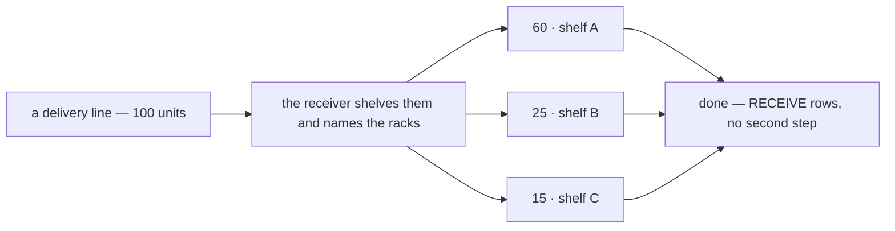

`restock_received_placements` already holds **one row per (line, place)** with a quantity
([00013](backend/services/inventory_service/db_migrations/00013_restock_placements_and_damage.sql)), so
the shape is there. What changes is that its `rack_id` stops being nullable.

### ✅ What this deletes

| Gone | Was |
| --- | --- |
| the **unplaced pile** in every form | `rack_id = NULL`, and the "staging" rack I invented to replace it |
| `restock_received_placements.rack_id` nullable | *"NULL is the UNPLACED PILE — received, not shelved yet"* |
| **put-away as its own operation** | #136 existed to place the unplaced. With nothing unplaced, there is nothing to place |
| a per-warehouse hot row | staging would have been touched by every receive in the building |

**Receiving IS placing.** One step, not two.

### The point: STRICT about where, SILENT about how much fits (owner)

I framed forced placement as a cost. **It is the intent.** Every unit having a known location at all
times is what makes the warehouse manageable later — and the flexibility comes from the other half:

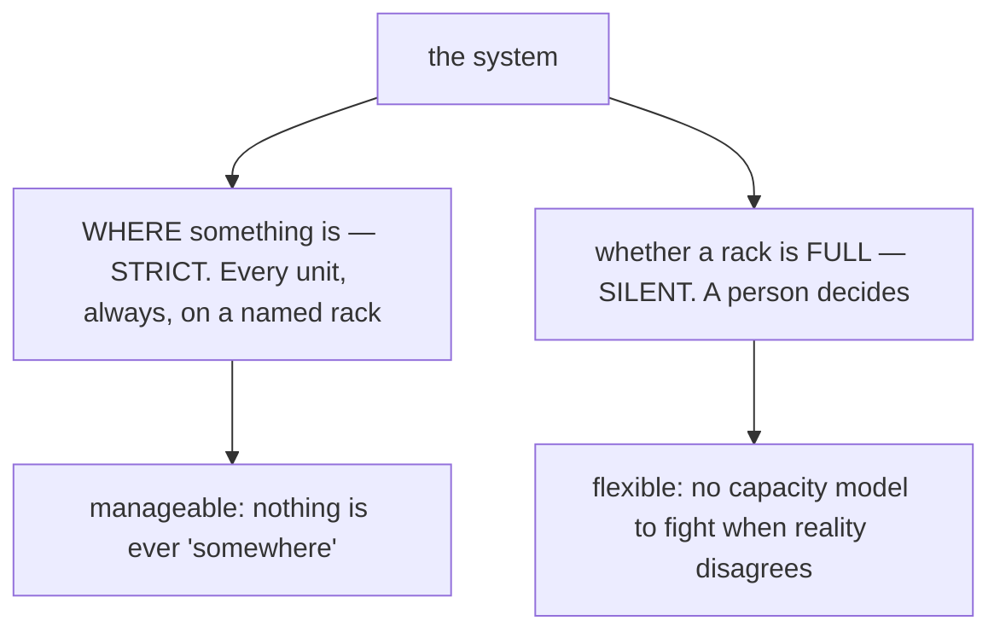

| | |
| --- | --- |
| **rack capacity is NOT modelled** (owner) | a person looks at the shelf and decides. No `max_units`, no "rack full" error, nothing to keep in step with a warehouse that gets rearranged |
| **so a wrong placement is not an error** | it is a `MOVE` later — the ordinary correction, on the ordinary path |
| **and there is no limbo to hide in** | *"it is here, I do not know where yet"* cannot be recorded, which is precisely why the location is always known |

⚠ **This corrects P1's speculation.** I wrote that *"capacity and cycle-count schedules attach to
`racks`"* as a reason a rack needed identity. **Capacity is deliberately not modelled at all** — the
rack's identity earns itself simply by being where stock is.

⚠ **The one thing to watch is the receiving flow, not the schema.** A truck of 40 lines means 40
placement decisions taken while the driver waits. If that ever feels slow, the answer is a faster
screen — not a limbo state, which would trade a known location for a queue nobody empties.

## P2 · The state table

```sql
CREATE TABLE stock_rack_batches (          -- replaces stock_levels AND stock_shelf_batches
    id           BIGSERIAL PRIMARY KEY,

    -- REAL FKs — racks and batches both live in THIS service
    rack_id      BIGINT NOT NULL                       -- P1b · all stock is placed
                 REFERENCES racks (id)                 ON DELETE RESTRICT,
    batch_id     BIGINT NOT NULL
                 REFERENCES stock_batches (id)         ON DELETE RESTRICT,

    -- NO FK BY DESIGN — opaque cross-service ids · the seam for a later service split
    warehouse_id BIGINT NOT NULL,          -- a WAREHOUSE team, owned by team_service
    product_id   BIGINT NOT NULL,          -- owned by product_service

    balance      BIGINT NOT NULL DEFAULT 0 CHECK (balance >= 0),
    updated_at   TIMESTAMPTZ NOT NULL DEFAULT NOW(),

    UNIQUE (rack_id, batch_id)             -- plain: no NULLs to collapse (P1b)
);

CREATE INDEX ON stock_rack_batches (warehouse_id, product_id);   -- "how much of P in W"
CREATE INDEX ON stock_rack_batches (rack_id);                    -- "what is on this shelf"
```

### Every FK is single-column, and only two exist (owner)

**`warehouse_id` and `product_id` carry no foreign key, on purpose.** They are **opaque ids owned by
other services** — a warehouse is a team in `team_service`, a product lives in `product_service` — and
that absence is the **seam**: a table with no FK across a service boundary is a table that can be moved
to its own database without untangling anything first. `stock_levels`' migration already states the
convention — *"opaque team_service id (a WAREHOUSE team) — no FK"*.

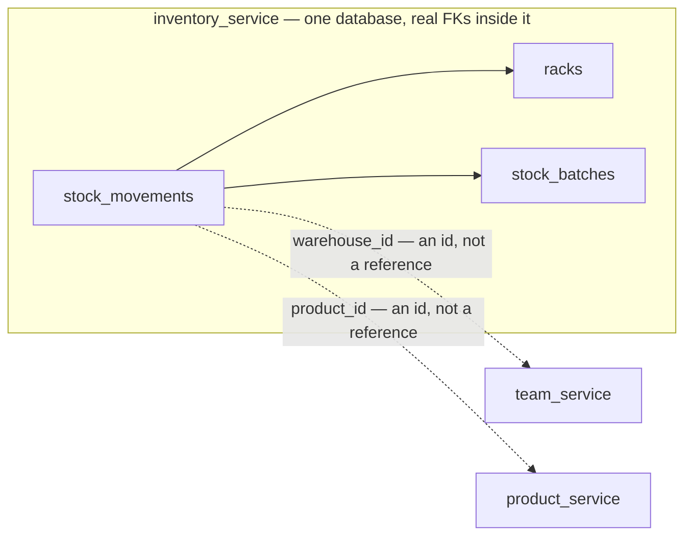

Only `rack_id` and `batch_id` point at tables in this service, so they are the only two that can be
enforced by the database. The rest is enforced by the code that writes them, and by P15.

Two composite FKs were proposed and **both dropped** — `(rack_id, warehouse_id) → racks` and
`(batch_id, warehouse_id, product_id) → stock_batches`. What each would have guaranteed, and why it is
not needed:

| | Would have guaranteed | Why not |
| --- | --- | --- |
| rack composite | a rack and a batch are in the same building | every entry point that accepts a rack from a caller already calls `rackExists(tx, warehouseID, rackID)` — `StockAdjust`, `StockMove`, `RestockRequestFulfill`, `RackUpdate`, `RackDelete`. The rest never take one |
| batch composite | `warehouse_id` / `product_id` agree with the batch | there is **one writer**. The plan selects batches *by* `(warehouse, product)`, so the values it writes are the ones it searched with — they agree by construction |

*(The rack composite would also have sat on a nullable column and depended on `MATCH SIMPLE` semantics —
a trap P1b removes independently by making `rack_id` NOT NULL.)*

✅ **The batch composite also cost two redundant unique indexes** — `racks (id, warehouse_id)` and
`stock_batches (id, warehouse_id, product_id)` — maintained on every insert to those tables purely to be
FK targets. Both go.

**Residual risk, stated plainly:** `product_id` on these rows is an unguarded copy of the batch's
product. A single writer makes that a code-bug risk rather than a data-path risk, and P15 is where it would show up.

**`warehouse_id` is a copy in exactly the same way (P12).** A batch never leaves the warehouse it was
created in — a transfer mints new ones — so the row's warehouse and the batch's are always the same
number, and P15 checks both.


## P3 · What this fixes at the source

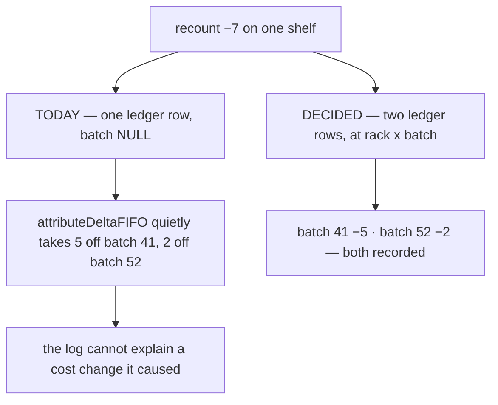

| Was a separate problem | Why it stops existing |
| --- | --- |
| FIFO attribution is silent — `attributeDeltaFIFO` moves batch quantities the ledger never records | at this grain the recount **is** N rows. Nothing happens off-ledger |
| cost layers (`ready`, `used`) maintained by side-effect `UPDATE`s — the drift its own header documents | derived from the ledger, not maintained |
| `stock_owner_movements` needs a **second** owner rule for batch-less rows | with a batch always present: batch → restock → team, one rule |
| two snapshots that must agree | one row. Nothing to agree with |

### The two write paths collapse into one

Today a movement is written **two different ways, in opposite directions**:

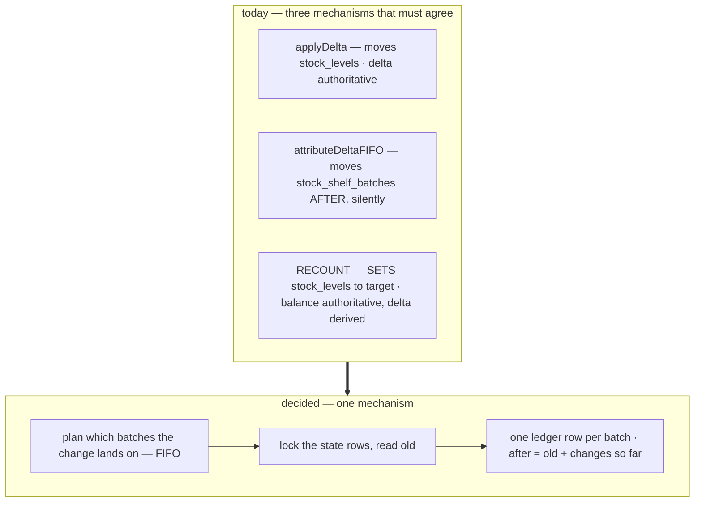

`attributeDeltaFIFO` stops being an after-the-fact reconciler and becomes the **planner** — it decides
which rows to write *before* anything is written. The recount stops being a special path.

⚠ **But the planner is no longer one rule.** [batch_selection](batch_selection.md) splits it by kind: an
order pick is the **picker's scan** (P6), a transfer's out-leg is **FIFO** (P7), a loss is **pro-rata**
(P3), and a receive or a move already knows its batch. FIFO survives as *one* of four rules, not as the
rule. The thing that changes here is only that the decision happens **up front and on the record**.

**Something must choose batches for every draw**, and that choice was always being made. It was made
after the fact, by a function the ledger never recorded.

### What has to change at the read sites

| Read | today | becomes |
| --- | --- | --- |
| `StockPick` candidates | one row per shelf | one row per **shelf × batch** — FIFO becomes the candidate *ordering*, not a later correction |
| `StockAdjust` recount | `SELECT on_hand … FOR UPDATE` | `SUM(balance)` over the product's batches at that rack, then **pro-rata** down / mint a batch up (batch_selection P3, P10) |
| `ProductStockSummary` | `SUM` over racks | `SUM` over the `(warehouse, product)` index — same seek, more rows |
| `ProductPlaces` / `PlacementList` | one row per shelf | `GROUP BY rack_id` |
| `RackDelete` guard | `SUM(on_hand) WHERE rack_id = ?` | **unchanged** — still a direct seek |

## P4 · `stock_levels` goes — no coarser rollup survives

`stock_rack_batches` is the **only** snapshot, and it inherits all three of `stock_levels`' jobs: the
`CHECK (balance >= 0)`, the **row lock** that serialises two people on one shelf, and being the number
every after-balance is read from (P6).

A snapshot is mandatory — deriving on-hand from `SUM(delta)` makes the picker's read O(history), and
HARD RULE 10 says that number's freshness *is* correctness. What goes is the second, coarser copy.

✅ **The over-draw guard gets stricter.** `CHECK (balance >= 0)` on a `(rack, batch)` row refuses to draw
5 units off a batch holding 3 — today that is only caught at the coarser shelf sum, so a draw could
over-pull one batch as long as the shelf's total covered it.

## P5 · The owner lens is a QUERY, not a ledger

> ⚠ **PARTLY SUPERSEDED by [ownership-is-copied](database/stock_design.md#ownership-is-copied) (owner).**
> `owner_team_id` is now **a real column on `inventory_transactions`, `stock_batches` and
> `stock_rack_batches`**, `CHECK (owner_team_id > 0)` — and it is always a **SELLING** team, never the
> **warehouse** team named by `warehouse_id`. Those are two different kinds of team: one handles the
> goods and carries the access scope, the other owns them and carries the money.
>
> | This section says | Status |
> | --- | --- |
> | delete `stock_owner_movements` | ✅ **stands** — and is now paid for in full: the ledger carries that table's exact index |
> | the owner lens is a **JOIN** | ❌ **reversed.** It is an index seek on `stock_movements` |
> | ⚠ **do NOT copy it onto the LEDGER** | ❌ **REVERSED (owner).** `stock_movements` carries `owner_team_id`. I reported twice that this half survived — it does not |
> | *"Copy immutable facts for the index. Join mutable ones"* | ✅ **the RULE stands** — this section just put `owner_team_id` in the wrong column of it |
| *"a restock's requesting team can be corrected"* | ❌ **FALSE, and it was never tested.** See [ownership-is-frozen-at-mint](database/stock_design.md#ownership-is-frozen-at-mint) |
>
> ✅ **So nothing rewrites ledger rows.** The owner is frozen at mint, `owner_team_id` on a movement is an
> **event fact**, and the ledger stays append-only in the strong sense. *(I first argued this was a
> [P20](#p20--what-the-reconcile-does-when-a-check-fails) "copy repair" — **withdrawn**, it answered a
> correction that never happens.)*
>
> **Why it had to change:** two reasons, and the second is the real one.
> **1 ·** P11 dropped `restock_request_item_id`, severing `batch → restock → team` — the join had no
> source left. **2 ·** the fact was never mutable in the first place, so *"join mutable ones"* never
> applied to it. **The rule was right; the classification was wrong.**

`stock_owner_movements` copies **every movement** to carry a fact that changes **once per delivery**.
Ownership is batch-grained: a batch arrives on a restock, the team that raised it owns it, and no
subsequent pick or move alters that.

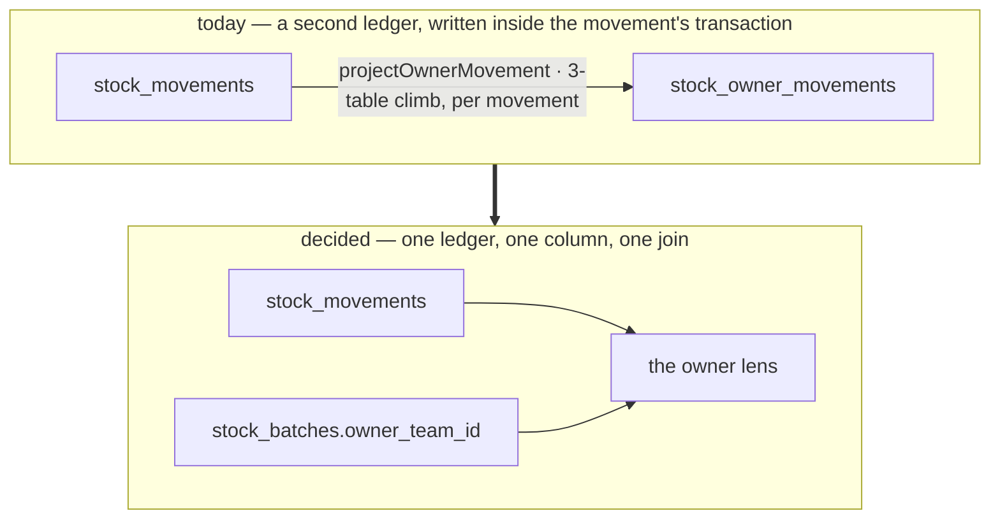

```sql
SELECT m.* FROM stock_movements m
JOIN stock_batches b ON b.id = m.batch_id
WHERE b.owner_team_id = ? AND m.product_id = ?
  AND m.kind <> MOVEMENT_KIND_MOVE          -- noise reduction, NOT correctness (see below)
ORDER BY m.id DESC
```

It also takes `projectOwnerMovement` off the hottest write path — what
[stat_event_processing §7](stat_event_processing.md) already recommended, and it settles that doc's §1b
complaint about two event-grain logs.

### ~~⚠ Do NOT copy `owner_team_id` onto the ledger~~ — ❌ REVERSED (owner)

> ❌ **The ledger DOES carry `owner_team_id`** — see
> [ownership-is-copied](database/stock_design.md#ownership-is-copied).
>
> ⚠ **And the hazard below is not merely answered — its PREMISE is false.** The argument turns entirely on
> `owner_team_id` being **mutable**, which this section asserts and never tests. It is not:
> [ownership-is-frozen-at-mint](database/stock_design.md#ownership-is-frozen-at-mint) freezes it at
> acceptance beside `unit_cost` and `arrived_qty`, and a change of hands is a **handover event**, not an
> `UPDATE`. So the row below belongs in the ❌ column, not the ✅ one.
>
> *(I first defended the copy as a "copy repair" under [P20](#p20--what-the-reconcile-does-when-a-check-fails).
> That is **withdrawn** — it answered a correction that never happens.)*

Tempting, for the same reason `warehouse_id`/`product_id` are copied. **Don't** — the two differ on one
property:

| | Mutable? | So |
| --- | --- | --- |
| `warehouse_id`, `product_id` | ❌ a batch is one product to one building, forever | **copy**, bound by composite FK |
| `owner_team_id` | ❌ **NO — the premise is false.** *"A restock's requesting team can be corrected"* was asserted here and never tested. See [ownership-is-frozen-at-mint](database/stock_design.md#ownership-is-frozen-at-mint): the owner is frozen at mint like `unit_cost` and `arrived_qty`, and changing hands is a **handover event**, not an `UPDATE` | ⚠ **STORED**, on all three goods tables. With the fact immutable, the "join mutable ones" rule simply does not apply to it |

Copying it re-creates the weakness [stat_event_processing §7](stat_event_processing.md) flagged —
*"ownership pinned at write time … correct a restock's requesting team later and the projection is
silently wrong."* Joining fixes it for free: one `UPDATE` on one batch row and all history re-reads
correctly.

**Copy immutable facts for the index. Join mutable ones.**

⚠ **This conclusion is REVERSED for `owner_team_id`** — see
[ownership-is-copied](database/stock_design.md#ownership-is-copied). The rule assumed a join path existed;
[P11](#p11--inventory_transactions--the-event-a-batch-was-born-in) removed it in the same doc. A mutable
fact with **no source to join to** must be stored, and the mutability is paid for by an `UPDATE` bounded
to one delivery.

## P6 · `after_balance` — at `(rack, batch)` grain

**Definition:** the balance of **that rack, that batch** after this row. Nothing coarser.

### What it buys

| | |
| --- | --- |
| the log is **auditable offline** | a row states the state it produced. No replay, no anchor query |
| [stat_event_processing P7](stat_event_processing.md) works **unchanged** | the daily projector takes closing from `after_balance` at `MAX(id)` — an index seek, not a sum since time zero |
| a history page at this grain costs **one query** | no anchor, no walk |

⚠ **P7's grain must be restated in that doc:** `after_balance` at `MAX(id)` is now the closing of one
`(rack, batch)`. Its grain-3 daily row (`day × warehouse × product × rack`) becomes a `SUM` of the
per-batch closings — the same rollup argument that doc's §2 already makes one level up.

### ⚠ What it costs — the rule the code must hold

The column is honest at **exactly one grain**. Every coarser screen gets a column whose consecutive rows
describe different subjects:

| Read | grain asked | column is |
| --- | --- | --- |
| one batch on one shelf | (rack, batch) | ✅ its own grain |
| `RackHistory` — one shelf | rack | ❌ steps between batches |
| `StockHistory` — one product | warehouse × product | ❌ steps between racks **and** batches |

1. **Qualify the grain at the API boundary.** DB column `after_balance` (the table's grain is implicit,
   `rack_id` and `batch_id` sit beside it) — **proto field `rack_batch_after_balance`**, because that is
   where a consumer can no longer see which table the number came from. A generic `balance` on the wire
   is why `MovementTable` ended up pushing its header to the caller
   ([MovementTable.tsx:67-73](frontend/src/features/inventory/MovementTable.tsx#L67-L73)).
2. **A coarser read does not display it.** It omits the "After" column, or derives one by anchor + walk
   (P14) — never renders the stored value under a coarser label.
3. **A nightly reconcile is mandatory, not optional** (P15).

## P7 · The write protocol — lock, read `old`, accumulate

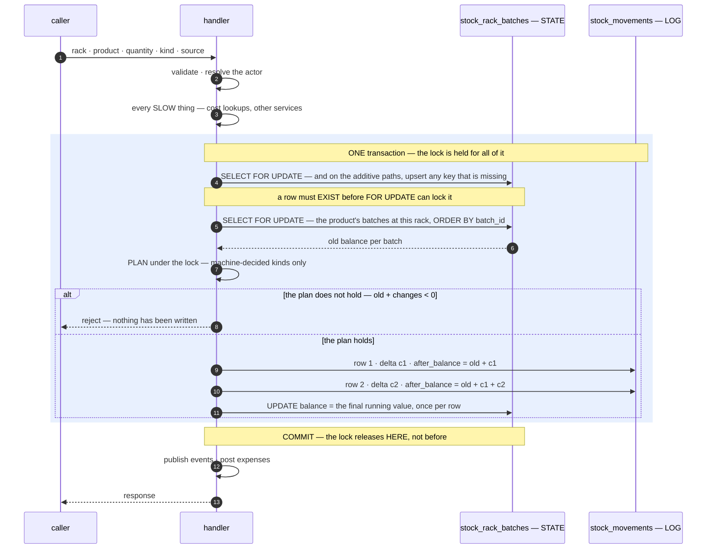

```sql
-- lock everything the plan COULD touch. A DRAW locks the product's whole batch set at that rack,
-- because FIFO cannot choose its batches until it has read them.
SELECT id, batch_id, balance FROM stock_rack_batches
 WHERE warehouse_id = :w AND product_id = :p AND rack_id = :rack
 ORDER BY batch_id
   FOR UPDATE;
```

✅ **A plain `=` on `rack_id`, because of P1b.** Every read and lock in the old design needed
`IS NOT DISTINCT FROM` — `rack_id = NULL` is never true in SQL, not even for a NULL row, so a plain `=`
silently found nothing and reported a phantom "insufficient stock" for goods sitting right there.
`applyDelta` documents that trap today. With placement mandatory it cannot arise.

### The plan, per kind — the only thing that varies

| Movement | Who decides the batch | Which rack |
| --- | --- | --- |
| `RECEIVE` | **the caller** — the batch is the delivery being received | the racks the receiver named — directly, no staging (P1b) |
| `PICK` | ⚠ **the picker SCANS what they take** (batch_selection P6). FIFO is the suggestion, the scan is the record | wherever the stock is |
| `MOVE` | **the caller** — the same batch at two racks, a `−qty` leg and a `+qty` leg | named by the caller |
| `TRANSFER` dispatch | **the system, FIFO** — ⚠ *not* scanned: both ends are ours and B mints fresh batches (batch_selection P7) | A's shelves |
| `TRANSFER` receipt | **the system mints ONE PER SOURCE LAYER** drawn at A (P12, [mint-per-layer](fifo.md#mint-per-layer)) | the racks B's receiver names |
| `RETURN` | **the ledger** — the exact batches the original pick took, reversed. `reverses_transaction_id` (P11) | the racks the pick drew from |
| `RECOUNT` **down** | **the system, PRO-RATA** across the rack's batches (batch_selection P3) | the rack being counted |
| `RECOUNT` **up** | ⚠ **the warehouse names the selling team, then the system credits back that team's unrecovered `LOST` rows — oldest first, at the price they were lost at** ([found-recovers-a-loss](database/stock_design.md#found-recovers-a-loss)). **No prior loss → REFUSED**, add by restock | the rack being counted |
| `LOST` | **the system, PRO-RATA** — nobody knows whose units went (batch_selection P3) | where the units were |
| `BROKEN` | **the caller names it** — they are holding the box (batch_selection P2) | where the units were |

⚠ **`LOST` and `BROKEN` are not a pair.** They look alike and are decided oppositely: one is the only
consumption nobody could observe, the other is the one somebody is holding in their hands.

**`TRANSFER_IN` lands on named shelves** — P1b removed the unplaced pile that `stock_transfer.go` uses
for both legs today, and goods arriving from another building are in exactly the same state as goods off
a truck.

**And the two legs are days apart** (P19) — `TRANSFER_OUT` draws from A's shelves at dispatch,
`TRANSFER_IN` mints B's batches at receipt. Between them the stock is in no warehouse at all.

### Worked example

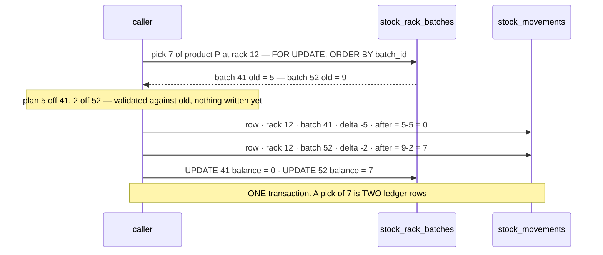

**A single user action is N ledger rows**, one per batch it touched. Screens showing "what happened
here" group by `inventory_transaction_id` (P11), not by row.

### Four hazards — all four resolved as recommended (owner)

The rules, before the reasoning:

| | Rule |
| --- | --- |
| 1 | Read `FOR UPDATE` first — fall back to an `ON CONFLICT DO UPDATE … RETURNING` upsert, **additive paths only** |
| 2 | Plan **after** locking for machine-decided kinds — which now includes a transfer's out-leg (P7). Only an **order pick** suggests, waits for the human's scan, then writes (P6) |
| 3 | Lock racks **ascending by rack id** — independently of which way goods move |
| 4 | **READ COMMITTED is a requirement.** No retry loop |

#### 1 · `FOR UPDATE` on a row that does not exist locks nothing

It returns no rows and takes no lock, so two concurrent first-receives both reach `INSERT` and the second
dies on the unique violation — the constraint stops the duplicate, but the **request fails**, and the
frontend does not retry mutations.

**Read first, and make only the FALLBACK an upsert:**

```sql
-- 1 · the common path — the row exists, so no write at all
SELECT id, balance FROM stock_rack_batches
 WHERE rack_id = :r AND batch_id = :b FOR UPDATE;

-- 2 · only if that returned nothing. Creates the row, OR locks and returns one a racer just made
INSERT INTO stock_rack_batches (rack_id, batch_id, warehouse_id, product_id, balance)
VALUES (:r, :b, :w, :p, 0)
ON CONFLICT (rack_id, batch_id) DO UPDATE SET updated_at = stock_rack_batches.updated_at
RETURNING id, balance;
```

⚠ **`DO UPDATE` locks the conflicting row and `RETURNING` yields it. `DO NOTHING` does neither.** That is
the whole reason for the no-op `SET updated_at = updated_at` — it is what turns the conflict path into
"give me the row someone else just made", instead of silently returning nothing and needing a second
statement.

⚠ **Only the additive paths reach step 2 at all.** A draw cannot create anything — you cannot pick from a
batch that is not on the shelf. An unconditional pre-`INSERT` would also leave zero-balance rows behind
for keys a rejected plan never touched.

| Can reach the fallback | Never does |
| --- | --- |
| `RECEIVE` · `TRANSFER_IN` · the `+qty` leg of a `MOVE` · `RETURN` | `PICK` · `TRANSFER_OUT` · the `−qty` leg · a `RECOUNT` downward |

⚠ **A unique-index wait participates in deadlock detection**, so the fallback inserts obey hazard 3's
ordering too: all reads ascending by rack, then all inserts ascending by rack — F2never interleaved.

#### 2 · Plan AFTER locking — except where a HUMAN decides

A machine-decided draw reads balances to choose, and an unlocked read is stale. Locking first removes
the stale-plan branch entirely.

The scope differs by kind: a draw must lock the product's whole batch set at that rack, a `RECEIVE`
names its batch and locks one row. Locking the whole set on a receive would block a concurrent draw for
no reason.

⚠ **An ORDER PICK no longer works this way** — [batch_selection P6](batch_selection.md) makes it
**observed**: the picker scans the batch label, so the batch is reported rather than computed. A human
cannot stand inside the transaction, so the shape inverts — **for that one kind only.**

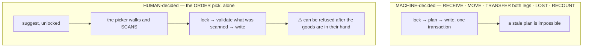

✅ **P7 put the transfer back on the machine side**, so the fragile shape covers exactly one kind rather
than two.

**So P7's rules split by who decides.** Everything else in this section — canonical lock ordering, the
guarded upsert, READ COMMITTED, the accumulate-in-memory arithmetic — is unchanged for both. Only *when
the batch is chosen* moves, and with it the guarantee that a plan cannot go stale.

#### 3 · Deadlock across racks

A `MOVE` or `TRANSFER` holds one rack and wants another. Two of them in opposite directions close a
cycle:

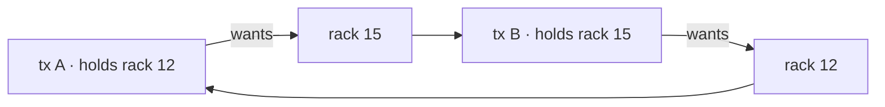

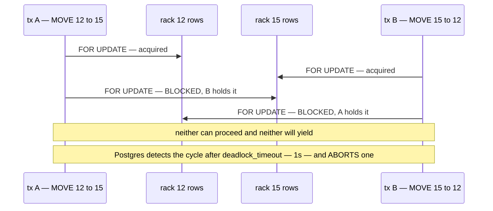

**→ The fix: sort the racks and lock ascending — independently of which way the goods are moving.**

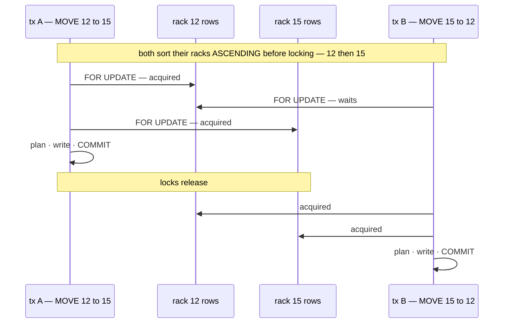

⚠ **Lock order is independent of business direction.** B is moving goods *from* 15 *to* 12 and still
locks 12 first. The moment lock order follows the operation's direction, the cycle is back.

⚠ **`ORDER BY batch_id … FOR UPDATE` does NOT order lock acquisition.** Postgres locks rows as it
*fetches* them — index-scan order — and sorts afterwards. Within one rack that is still safe, for a
different reason: two transactions running the same statement get the same plan and acquire in the same
order, and a targeted single-row lock cannot deadlock at all. **The rack ordering is what carries the
guarantee**; the batch ordering is for the output.

#### 4 · The protocol assumes READ COMMITTED

Under Postgres' default, a blocked `SELECT … FOR UPDATE` re-reads the **updated** row when the lock
frees — which is exactly what makes `old` correct.

Under **REPEATABLE READ** the same contention raises a `40001` serialization failure instead, and every
contended write fails unless the caller retries the whole transaction.

**Decided: state the requirement, do not build a retry loop.** A retry loop around a transaction that
also publishes events and posts expenses is a far larger commitment than it looks — every side effect
must become replay-safe. READ COMMITTED plus row locks is already the correct tool.

⚠ **So it must be asserted, not assumed.** Isolation level is the kind of thing raised globally "for
safety" in a later change, and it would turn a working shelf into intermittent errors under exactly the
two-people-one-shelf condition this system is built for. A startup assertion on
`SHOW default_transaction_isolation` is cheap and makes the dependency impossible to break silently.

⚠ **The lock is held longer than today's** — `FOR UPDATE` at *plan* time is earlier than an `UPDATE` at
*write* time. Everything that is not the ledger write happens outside the transaction: cost lookups and
other services before `BEGIN`, events and expenses after `COMMIT`. **Never a network call with a shelf
locked.**

## P8 · Migration — a fresh start

Nothing is deployed, so there is no data to preserve and **no backfill is written**. This is not a
deferral: there is no production run to reconcile later. If that ever changes before this lands, the
decision changes with it.

**ONE migration drops the old tables and creates the new**, rather than a chain of `ALTER`s:

```sql
-- 1 · the three stock tables go, ledger included (see below)
DROP TABLE stock_movements, stock_shelf_batches, stock_levels;

-- 2 · the new shape, each stated once
CREATE TABLE inventory_transactions (...);      -- P11
CREATE TABLE stock_rack_batches (...);          -- P2
CREATE TABLE stock_movements (...);             -- P6 · P11 · P16 · P17

-- 3 · stock_batches SURVIVES — it holds cost layers, and P8's fresh start empties it rather than
--     dropping it. But its origin model changes (P11)
TRUNCATE stock_batches CASCADE;
ALTER TABLE stock_batches
    ADD COLUMN inventory_transaction_id BIGINT NOT NULL REFERENCES inventory_transactions (id),
    DROP COLUMN restock_request_item_id,        -- identity moves to the transaction
    DROP COLUMN delivery_id;                    -- the document points at the transaction now

-- 4 · the document's own typed FK — one per document table (P11)
ALTER TABLE restock_requests
    ADD COLUMN inventory_transaction_id BIGINT UNIQUE REFERENCES inventory_transactions (id);
```

Twenty migrations of accreted `ALTER`s are why the current shape has to be read across a dozen files.
Starting the central tables from one readable statement is worth more than migration purity here — and
it costs nothing when there is no data.

⚠ **`stock_batches` is truncated, not dropped.** Its columns are mostly still right; only its origin
model changes. And truncating it is what makes `ADD COLUMN … NOT NULL` legal without a default — a
non-empty table would need a backfill, which P8 exists to avoid.

### The ledger must be dropped too, not just the state

Empty state beside a populated history is worse than either: every P15 check fails on day one, and
every history screen shows movements for stock that no longer exists. They go together or not at all.

Existing rows could not survive anyway — `batch_id NOT NULL` and `after_balance NOT NULL` have no
truthful value for a row written before batches were required.

### Two consequences worth expecting

| | |
| --- | --- |
| **the app comes up empty** | `seed dev` populates accounts, teams and categories — not stock. Every stock screen is blank until someone receives goods through the UI again |
| **it is ONE commit, not a series** | dropping `stock_levels` breaks `applyDelta` the moment it lands, so schema + every write path + the six read sites + the frontend go together, or `dev` is red. There is no green intermediate state |

Same commit, per HARD RULE 3: [docs/database-schema.md](../../docs/database-schema.md) gets the new
`erDiagram`.

## P9 · Vocabulary — one word for one quantity

Today the same idea has three names in three tables: `stock_levels.on_hand`,
`stock_shelf_batches.qty`, `stock_movements.balance`. That is how the frontend ended up with one
`balance` field meaning three different things.

**Decided: `balance` is THE word. `on_hand` and `qty` are retired.**

| Where | Name | Means |
| --- | --- | --- |
| state — `stock_rack_batches` | **`balance`** | how many are here **now**. No "after" — there is no event |
| log — `stock_movements` | **`after_balance`** | the balance **after this row**. `before` is never stored — it is `after_balance − delta` |
| a derived, coarser figure | **`after_balance`**, grain in the **field name** | `rack_after_balance`, `product_after_balance` |

**Unqualified means the table's own grain. Anything else is qualified.** The DB column stays short
because both key columns sit beside it; the **proto field** is where the grain must be spelled out,
because that is the boundary at which a screen can no longer see which table the number came from.

*Why `balance` and not `on_hand`:* it extends. `after_balance` reads correctly, `after_on_hand` does
not — and the log needs *some* word for "after". `on_hand` is warehouse language and `balance` is
accounting language, but the screens say "After" either way — UI copy is i18n's job, not the field's.

---

## P10 · There is no unit without a batch

The question was *"where do units with no batch come from?"*. **The answer is that they do not exist.**
Goods arrive with a batch, and goods the warehouse finds unrecorded are **recorded by creating one** —
then placed like any other stock.

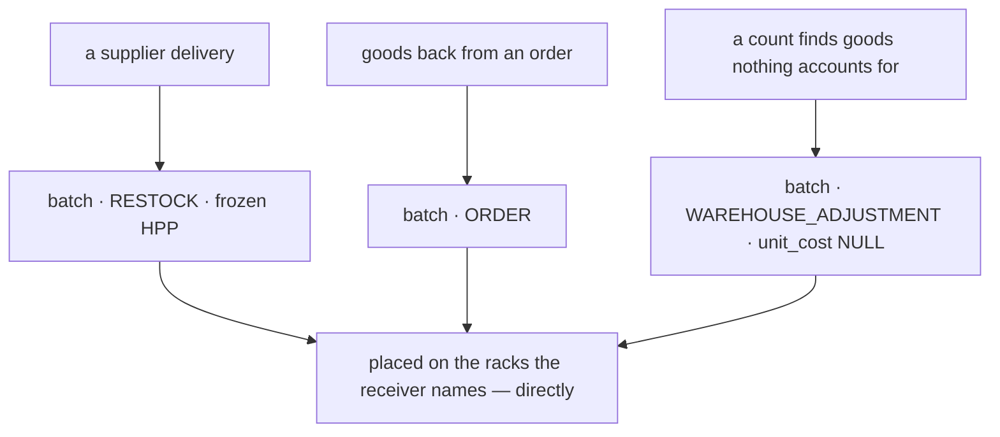

A batch's origin is **the kind of the `inventory_transaction` it was born in** (P11), not an enum on the
batch itself. Four kinds create batches:

| Origin | `unit_cost` | Born when |
| --- | --- | --- |
| `RESTOCK` | the frozen HPP | a delivery is accepted |
| `ORDER` | inherited, or NULL | goods come back from an order |
| `WAREHOUSE_ADJUSTMENT` | **NULL — unknown** (#74) | a count finds goods nothing accounts for |
| `TRANSFER` | **copied** from the source batch | goods arrive from another warehouse (P12) |

### What this fixes that was live and wrong

`attributeDeltaFIFO` puts a gain on the **oldest existing batch**
([stock_adjust.go:287-289](backend/services/inventory_service/inventory_v1/stock_adjust.go#L287)), so
found units silently inherit that layer's `unit_cost` — valuing goods nobody can account for at a price
they were never bought at. #74 is explicit that an unknown cost adds **nothing**, not a borrowed number.
Under P10 the found units get their own layer, and it says outright that its cost is unknown.

### ~~Found goods are a RECEIVE in shape~~ — ❌ they are the UNDOING of a LOSS

> ⚠ **SUPERSEDED by [found-recovers-a-loss](database/stock_design.md#found-recovers-a-loss) (owner).**
> Found goods **create no cost layer**. They rejoin the batches they were lost from, at the price they
> were lost at. A find with no prior loss is **refused** — the goods arrived, and an arrival is a restock.

The **movement kind** is still `RECOUNT` ([P17](#p17--adjust-splits-into-recount--lost--broken)) — it
describes a correction of the record — and the **transaction kind** is still `WAREHOUSE_ADJUSTMENT`.

⚠ **What was wrong was the ASYMMETRY, and this section argued for it:**

> *"A count that finds fewer units draws down existing batches FIFO — nothing is created. Only an upward
> count mints a batch. You cannot lose units from a batch that does not exist, but **you can find units
> that belong to no known batch**."*

**That last clause is the error.** You cannot — not on a shelf in a running warehouse. Units on a shelf
that belong to no known batch **did not appear by miscounting**; they arrived without paperwork, and the
fix is the paperwork. Treating them as a mint is what would have produced a `unit_cost = NULL` layer for
every counting slip in the building.

✅ **So the two directions are symmetric after all** — both work off what the ledger already recorded. A
count down consumes existing batches; a count up **restores** them.

⚠ **`TRANSFER` was a late addition, and how it got missed is worth keeping.** I read the first three as
a closed list and argued *from* it that a transfer must not mint a batch. An enum's current membership
was never evidence about what the warehouse does — reading it as evidence is how a list of examples
hardens into a constraint nobody chose.

---

## P11 · `inventory_transactions` — the event a batch was born in

A batch no longer points at a restock **line**. It points at a **transaction**: the event that brought
goods in.

### The document points at the transaction, never the reverse (owner)

I had put `delivery_id` on the transaction — *"the restock request or the order"*. **Withdrawn.** That is
the same untyped pointer we had just deleted from the ledger as `source_kind` / `source_id`, rebuilt one
table higher: a bare id whose meaning depends on a sibling `kind` column, with no foreign key possible.

**The reference inverts.** Each document carries its own **typed** FK:

```sql
ALTER TABLE restock_requests
    ADD COLUMN inventory_transaction_id BIGINT UNIQUE
        REFERENCES inventory_transactions (id);
-- and the same shape on any other document that moves stock
```

⚠ **`UNIQUE` is a policy, not only an idempotency guard (owner).** It says a delivery is accepted
**exactly once** — one acceptance, one transaction, N batches. `RestockRequestFulfill` already works that
way: one call carries every line's received quantity and placement.

The constraint is what makes that rule enforceable rather than conventional. If a delivery ever has to
be received across two sessions, the constraint will block the second — and that is the right moment to
decide what an *acceptance* is, rather than discovering later that two half-receipts silently produced
two transactions and two sets of batches.

| | `delivery_id` on the transaction | **the document points at the transaction** |
| --- | --- | --- |
| type safety | one polymorphic column, no FK possible | a real FK per document table |
| meaning | depends on reading `kind` first | unambiguous from the column itself |
| idempotency | a partial unique index on `(kind, delivery_id)` | plain `UNIQUE` on the document's own column |
| a new document type | widen the meaning of `delivery_id` | add a column to that table. Nothing here changes |

The transaction stays generic: it records *what happened to stock*, and never needs to know what caused
it. `kind` stays, so a ledger read can say what sort of action it was without searching every document
table for a back-reference.

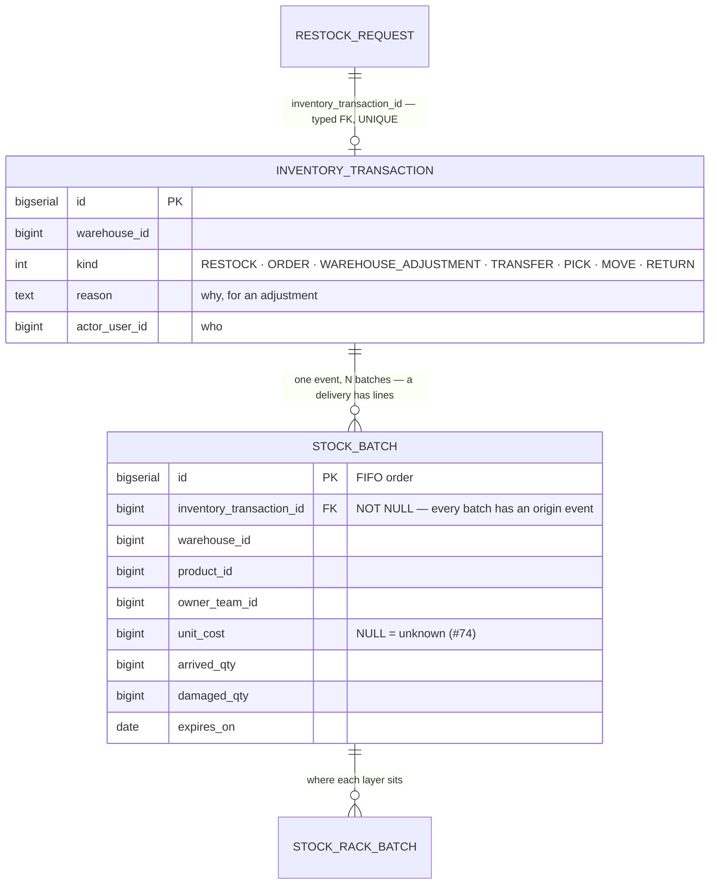

### Why this beats a `source` enum on the batch

I had proposed `stock_batches.source` plus a **nullable** `restock_request_item_id` and a partial unique
index. The transaction table is better on every count:

| | `source` enum on the batch | **`inventory_transactions`** |
| --- | --- | --- |
| the FK | nullable, so a partial unique index is required | **`NOT NULL`, always** — nothing to special-case |
| where polymorphism lives | nullable columns spread across `stock_batches` | one table, one `kind` |
| idempotency | `UNIQUE (restock_request_item_id)` — N guards, one per line | **one guard on the transaction** — accepting a delivery twice conflicts once |
| the shape of a delivery | "the LINE is the batch" (#207) — no row for the delivery itself | one transaction, N batches. The **delivery** is a thing again |
| actor and timestamp | denormalised onto **every** batch | on the transaction, where they belong |

```sql
CREATE TABLE inventory_transactions (
    id            BIGSERIAL PRIMARY KEY,
    warehouse_id  BIGINT NOT NULL,
    kind          INT    NOT NULL,        -- RESTOCK · ORDER · WAREHOUSE_ADJUSTMENT
                                          -- TRANSFER · PICK · MOVE · RETURN
    reverses_transaction_id BIGINT REFERENCES inventory_transactions (id),  -- the UNDO link: a RETURN's PICK, a CANCEL's dispatch
    reason        TEXT   NOT NULL DEFAULT '',
    actor_user_id BIGINT NOT NULL DEFAULT 0,
    created_at    TIMESTAMPTZ NOT NULL DEFAULT NOW()
);

ALTER TABLE stock_batches
    ADD COLUMN inventory_transaction_id BIGINT NOT NULL REFERENCES inventory_transactions (id),
    DROP COLUMN restock_request_item_id,
    DROP COLUMN delivery_id;

-- accepting the same delivery twice conflicts on the DOCUMENT's own column
ALTER TABLE restock_requests
    ADD COLUMN inventory_transaction_id BIGINT UNIQUE REFERENCES inventory_transactions (id);
```

⚠ **What is lost: batch → LINE traceability.** Two lines of the *same product* on one delivery become
two batches under one transaction, distinguishable by their `unit_cost` and their ids but no longer
traceable to a specific line. If that matters, the batch keeps a nullable `restock_request_item_id` as
**provenance only** — with identity and idempotency still on the transaction. **Open — Question 1.**

### EVERY stock action gets one — the ledger references it too (owner)

A transaction is not only what *creates batches*. It is the **user action**, and every ledger row is one
of its lines.

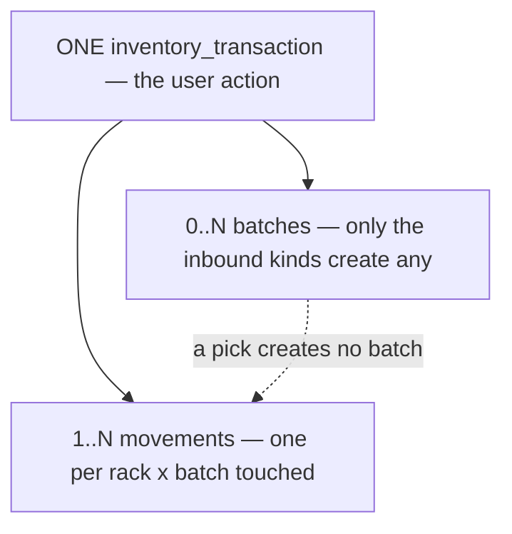

| kind | creates batches? | produces |
| --- | --- | --- |
| `RESTOCK` | ✅ one per line | N `RECEIVE` rows onto the named racks (P1b) |
| `ORDER` | ✅ if the goods cannot be traced back | `RECEIVE` rows |
| `WAREHOUSE_ADJUSTMENT` | ✅ when a count finds more (P10) | `RECOUNT` · `LOST` · `BROKEN` rows (P17) |
| `TRANSFER` | ✅ **one in the destination, at RECEIPT (P12)** | **two transactions, days apart** (P19) — `TRANSFER_OUT` in A at dispatch, `TRANSFER_IN` in B at receipt |
| `PICK` · `MOVE` · `RETURN` | ❌ | 1..2N movements |

### ✅ What this deletes from the ledger

`source_kind` and `source_id` were an untyped pair standing in for exactly this. So were `reason` and
`actor_user_id` — both describe the **action**, not each of the N rows it produced.

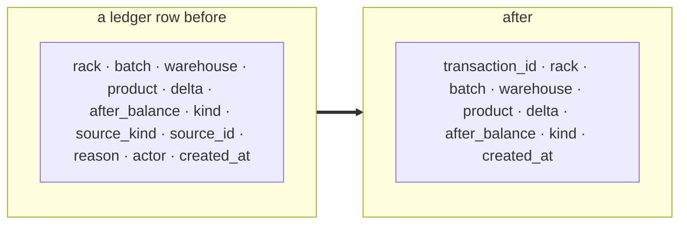

| Column | Where it goes |
| --- | --- |
| `source_kind` · `source_id` | **deleted** — the FK *is* the source |
| `reason` · `actor_user_id` | to the transaction. One action, one reason, one actor — not N copies |
| `occurred_at` | **not added at all (owner)** — `created_at` is the only time. See P16 |

⚠ **The retry-safety index gets simpler too.** It was
`(source_kind, source_id, rack_id, batch_id) WHERE source_kind <> MANUAL` — the awkward partial `WHERE`
existed only because a manual adjustment had no document to key on. Every action now has a transaction:

```sql
CREATE UNIQUE INDEX stock_movements_txn_once
    ON stock_movements (inventory_transaction_id, rack_id, batch_id);
```

That also mostly dissolves the old "does one document touch the same `(rack, batch)` twice" question: a
`MOVE` touches two *different* racks, a pick spans different *batches*, and a return is its own
transaction. One transaction × one `(rack, batch)` = one row.

### ⚠ Two things to watch

**A reversal now links transaction-to-transaction**, not row-to-row. A `RETURN` reverses a `PICK`, so
`inventory_transactions.reverses_transaction_id BIGINT NULL` replaces the per-row
`source_kind = MOVEMENT` convention — one link instead of N.

**"Transaction" now means two things in this doc** — a database transaction and an inventory
transaction, and P7 is written almost entirely about the first. Every mention has to say which. If that
proves too easy to misread, the fix is a rename, not a convention.

---

## P12 · A TRANSFER mints a new batch in the destination — one per source layer

A batch belongs to **one** warehouse and never leaves it. Moving goods between buildings creates a new
cost layer in the destination, linked to the one it came from.

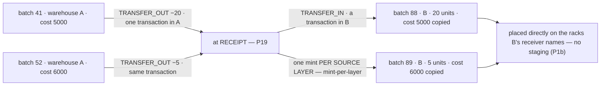

| | |
| --- | --- |
| how many batches | **one per source layer** the FIFO draw touched ([mint-per-layer](fifo.md#mint-per-layer)) — usually 1, never more than A's shelf was fragmented |
| `unit_cost` | **copied verbatim** from each source batch, `nil` included — goods do not get cheaper, or newly-priced, by moving |
| `expires_on` | **copied verbatim** ([facts-travel](fifo.md#facts-travel)) — crossing a building must not switch off the expiring badge |
| FIFO order in B | by arrival **in B**, which is what B's pickers draw by |
| the batch's origin | `inventory_transaction_id` → the `TRANSFER` transaction (P11), so the source is traceable |
| the destination rack | **the racks B's receiver names** — a receipt is a receipt (P1b) |

**This fixes a live gap:** transfers are batch-less today
([stock_transfer.go:45,56](backend/services/inventory_service/inventory_v1/stock_transfer.go#L45) passes
`nil`), so the destination warehouse gains stock with **no cost layer at all** — its stock value and its
unknown-cost units are both wrong, and nothing surfaces it.

### ✅ What this settles elsewhere

**`warehouse_id` on the stock rows is a plain COPY of the batch's**, not an independent fact. I had
argued at length that it was *"where the stock is"* against the batch's *"where it arrived"* — that
distinction only existed under *same batch spans buildings*, and it dies with it.

| Consequence | |
| --- | --- |
| the `arrived_warehouse_id` rename | **not needed** — one meaning, one name |
| the Batches tab | **unchanged** — `stock_batches WHERE warehouse_id = B` finds the transfer-minted batches, because they are B's |
| P15 | now **also** compares `warehouse_id` against the batch. It was deliberately excluded on the grounds they could legitimately differ. They cannot |
| the composite FK I proposed | would have been correct after all — but it stays dropped for the reasons in P2, and the reconcile covers it |

⚠ **The cost is the one I named for this option, and it is real:** one physical delivery becomes **two
batch rows** — two HPPs, two expiry dates, two owners. Correcting the source batch's cost or owner does
**not** correct the transferred one. That is what `inventory_transaction_id` on the new batch is for, and
a correction flow has to walk it.

⚠ It does not disturb [stat_event_processing](stat_event_processing.md)'s rollup — the legs are still
`−q` and `+q` on the same product, so `TRANSFER` nets to zero at grain 1.

---
## P12b · The boundary — aggregate LIVE now, project LATER

Aggregates stay live queries for now. Statistics become **precomputed tables fed by events** — which is
what [event-guideline.md](../../guidelines/event-guideline.md) and
[event_library.md](../../guidelines/architectures/event_library.md) exist for, and what
[stat_event_processing.md](stat_event_processing.md) designs.

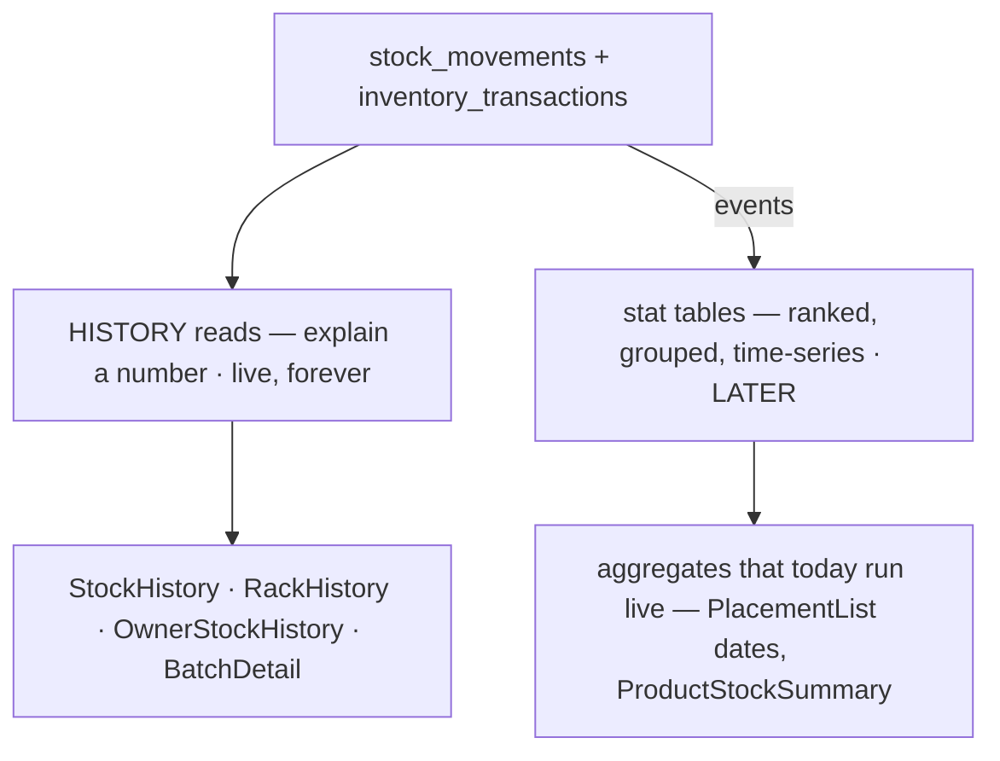

**This decides what the ledger has to be GOOD at.** Its permanent job is *history* — four screens whose
only purpose is to make a number believable. It does **not** have to be fast at aggregation, because the
aggregates leave. So the read contract optimises for a stable, seekable page (P14), not for `GROUP BY`.

## P13 · The event grain is the TRANSACTION, not the ledger row

P11 makes this a real choice, and the answer is not the obvious one:

| | one event per **movement row** | **one event per transaction** |
| --- | --- | --- |
| a pick spanning 3 batches | 3 messages a consumer must correlate | **1 message carrying 3 lines** |
| atomicity | a consumer can see 2 of 3 legs and project a half-action | the action arrives whole or not at all |
| `event_id` | needs the row id — fine, but N of them | `"inventory-txn:<id>"` — a derived id, exactly [event-guideline §1](../../guidelines/event-guideline.md)'s shape, one per action |
| volume | N× the messages | one |

⚠ **A half-projected `MOVE` is the failure this prevents** — its `−q` leg applied and its `+q` leg not
yet, which reads as stock having *vanished* rather than moved. Per-row events make that a normal
intermediate state a consumer must defend against; per-transaction events make it impossible.

**Decided: one event per `inventory_transaction`, carrying its movement lines.** It is also the only
grain at which [event-guideline §3](../../guidelines/event-guideline.md)'s *"carry a delta, never a
level"* stays honest for a multi-leg action — a single `MOVE` leg's delta is true but meaningless alone.

⚠ **This changes [stat_event_processing.md](stat_event_processing.md).** That doc specifies
`StockMovedEvent` at **per-movement** grain, with `event_id = "stock-moved:<movement_id>"` and a dedup
table keyed on it. Both change shape — one message with N lines, `"inventory-txn:<id>"`, one dedup row
per action instead of per row. Its `Claim` and reject-table design survive unchanged.

---


## P14 · Coarser lenses DERIVE — anchor + walk

P6 serves exactly one grain. The lenses above it — one shelf, one product, one owner — still need a
running total, and the two mechanisms in the system today are the two bad ends of one axis:

| | How | Cost | Can drift? |
| --- | --- | --- | --- |
| `stock_movements.balance` | **stored** — a copy of `stock_levels.on_hand` at commit | free | ✅ yes, and nothing checks |
| `OwnerStockHistory` | `SUM(delta) OVER (ORDER BY id)` at read | **whole history, every page** | ❌ no |

The owner ledger's migration argues correctly that storing it races. Its answer scans all history to
render 20 rows and gets slower forever — HARD RULE 9's failure mode through the back door. P5 deletes
the table but **not** this problem: the same window would just move onto the join.

A history page is contiguous in `id`, so there is a third way, and it is the one every coarser lens uses:

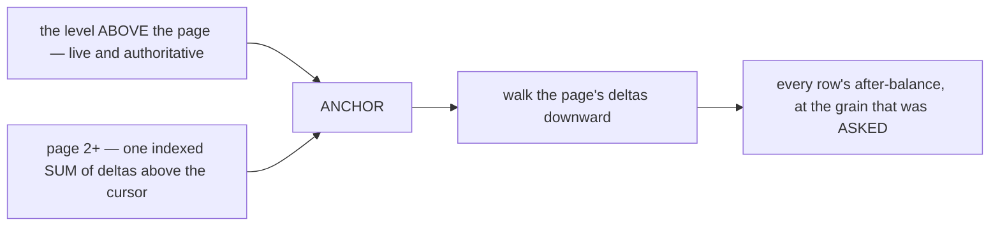

Worked, on product P at warehouse W across racks A and B — the stored column reads `15 → 4 → 9`, three
true statements about three different subjects. Anchored on the live total of 19 and walked down, the
same rows give `19 → 13 → 14`, which verifies forward: `17 − 3 = 14`, `− 1 = 13`, `+ 6 = 19`. ✅

O(page) plus one aggregate, anchored on the authoritative number rather than on a copy of it. The cursor
and the anchor are the same value — see [pagination.md](pagination.md).

## P15 · The nightly reconcile — four checks

For one `(rack, batch)`: `stock_rack_batches.balance`, `after_balance` at `MAX(id)`, and `SUM(delta)`.
All three must agree, and **nothing compares them**. If they diverge, every figure built on that shelf is
wrong at the root, and the first symptom is a stock count nobody can explain.

P4 removed a fourth (`stock_levels`). P6 keeps `after_balance`, so three is where it stops — and both
stored numbers exist precisely *because* nobody wants to compute the sum, which is exactly why nobody
would notice either drifting. A `cmd/tool` reconcile is **part of the design**, not a nice-to-have.

```sql
-- A · the three quantities must agree
SELECT s.rack_id, s.batch_id, s.balance,
       (SELECT after_balance FROM stock_movements m
         WHERE m.rack_id = s.rack_id AND m.batch_id = s.batch_id
         ORDER BY m.id DESC LIMIT 1)                              AS balance_at_max_id,
       (SELECT COALESCE(SUM(delta), 0) FROM stock_movements m
         WHERE m.rack_id = s.rack_id AND m.batch_id = s.batch_id) AS sum_delta
FROM stock_rack_batches s;

-- B + D · product_id AND warehouse_id must still agree with the batch they name
SELECT s.id, s.product_id, b.product_id AS batch_product_id
FROM stock_rack_batches s JOIN stock_batches b ON b.id = s.batch_id
WHERE s.product_id <> b.product_id OR s.warehouse_id <> b.warehouse_id;
-- the same query over stock_movements

-- C · the rack must be in the warehouse the row claims — the composite FK that was dropped (P2)
SELECT s.id, s.warehouse_id, r.warehouse_id AS rack_warehouse_id
FROM stock_rack_batches s JOIN racks r ON r.id = s.rack_id
WHERE s.warehouse_id <> r.warehouse_id;
```

**This is what pays for the seam.** The cross-service ids carry no FK by design (P2), and `product_id`
is a copy nothing enforces — a copy nothing enforces is a copy nothing notices going wrong. The
reconcile is the price of keeping the service boundary clean, and a much lower price than an FK that
would have to be untangled later.

**C replaces the dropped rack composite FK.** Dropping it was right — five call sites already hold the
rule with `rackExists` — but "held by convention at five call sites" and "held by the database" differ
in exactly one way: only one of them tells you when it stops being true.

**D compares `warehouse_id` against the batch.** I had excluded it while *same batch spans buildings*
was live, on the grounds the two could legitimately differ. **P12 settles that they cannot.**

## P16 · `created_at` is the only time

I had wanted a separate `occurred_at`, for goods that arrived yesterday and were keyed this morning. In
this warehouse the gap is **minutes, not days** — goods are accepted at the terminal as they land, picks
are recorded as they happen, a count is recorded as it is counted.

Two timestamps always seconds apart cost an extra column on the biggest table and invite a worse bug
than the one they prevent: half the code filtering on one, half on the other, and nobody noticing
because they agree in every test. **`id` orders, `created_at` filters.**

⚠ **Revisit only if backdated entry becomes a real flow** — and then it goes on the transaction first,
not the ledger.

---

## P17 · `ADJUST` splits into RECOUNT · LOST · BROKEN

40 → 37 because the count was always 37, 40 → 37 because three units walked, and 40 → 37 because three
units smashed are **three different events**. Today they are one row separated only by free text, so
"how much did we lose this month" is unanswerable.

`MOVEMENT_KIND_ADJUST` becomes three kinds. The existing `StockAdjustReason`
([inventory.proto:279-289](proto/warehouse/inventory/v1/inventory.proto#L279)) already had them as
reasons — this promotes them to the thing the ledger is keyed on.

| Kind | Sign | Means |
| --- | --- | --- |
| `RECOUNT` | **signed** | the record was wrong. Counting up **recovers a loss** ([found-recovers-a-loss](database/stock_design.md#found-recovers-a-loss)) — that is where `FOUND` goes, and it is refused if nothing was lost |
| `LOST` | always **negative** | units are gone and nobody knows where |
| `BROKEN` | always **negative** | units were destroyed. `DAMAGED` under the old name |

⚠ **`FOUND` disappears as a separate concept** — it is a `RECOUNT` whose delta is positive. ⚠ *Was: "and
P10 already says what happens: a new batch with `unit_cost = NULL`."* **No longer** — see
[found-recovers-a-loss](database/stock_design.md#found-recovers-a-loss): it rejoins the batches it was
lost from, **at their price**, so a find produces no unknown-cost layer at all.

✅ **And `FOUND` still needs no kind of its own.** It has a distinct *rule* now, but the ledger reads it
as it always did — `kind = RECOUNT AND delta > 0` — which is exactly what the recovery arithmetic and
[P17](#p17--adjust-splits-into-recount--lost--broken)'s new `found` term both count.

### ✅ Why this matters more than a reporting nicety

The batch's lifecycle is `Arrived = Damaged + Used + Ready`, and `Used` is derived as
`arrived − damaged − Ready`. That arithmetic assumes **everything not damaged and not on a shelf was
shipped.**

```mermaid
flowchart TD
  A["arrived 100"] --> R["Ready — Σ balance on shelves"]
  A --> D["damaged at acceptance"]
  A --> U["Used = arrived − damaged − Ready"]
  L["3 units LOST after acceptance"] -.->|"balance falls, damaged does not"| U
  B["2 units BROKEN after acceptance"] -.->|"same"| U
  U --> X["Used silently absorbs 5 units that never shipped"]
```

**Lost and broken units read as SOLD.** Cost of goods sold, margin, and every "how much did this
delivery earn" figure inherit five units of someone else's money.

**→ The fix is P3's own rule: derive all of it from the ledger.** `arrived_qty` stays — it is the
acceptance fact. Everything else is an aggregate over kinds:

```sql
ready      = Σ stock_rack_batches.balance      -- for that batch
in_transit = Σ stock_transit_batches.balance   -- transit-is-a-place
used       = Σ |delta| WHERE kind = PICK
broken     = Σ |delta| WHERE kind = BROKEN
lost       = Σ |delta| WHERE kind = LOST
lost_transit = Σ |delta| WHERE kind = LOST_IN_TRANSIT
found      = Σ  delta  WHERE kind = RECOUNT AND delta > 0   -- found-recovers-a-loss

-- the CHECKABLE invariant, with every place a unit can be:
arrived + found = ready + in_transit + used + broken + lost + lost_transit + damaged_at_acceptance
```

That last line is the payoff: the batch gets an invariant that closes, which is exactly what
`arrived − damaged − Ready` could never be, because it was a definition rather than a check.

⚠ **`stock_batches.damaged_qty` narrows in meaning** — it becomes *damage found at acceptance*, before
the units ever became stock. Damage after that is a `BROKEN` movement. Two different facts that shared a
column.

---

## P18 · Two defects fixed with the build

Neither is a design question — both are the code disagreeing with a rule the system already states.

### Filtering moves to the server, where the contract already put it

[stock_history.go:26-38](backend/services/inventory_service/inventory_v1/stock_history.go#L26-L38)
argues at length why batch and kind filters must be server-side — *"the ledger is paginated and grows
forever, so a client-side filter would narrow the loaded page only"*. Then
[warehouse-product/index.tsx:158-165](frontend/src/pages/warehouse-product/index.tsx#L158-L165) filters
the loaded page in JS, for a `batch_id` the server already accepts.

⚠ **The symptom is a lie, not a slowdown:** filter a shelf's history to one batch and you get *the rows
of that batch **that happened to be on page one*** — which reads as "this batch has barely moved".
Keyset paging (see [pagination.md](pagination.md)) does not fix it; it is orthogonal.

**→ Pass the filter down, and add `rack_id` to `StockHistoryFilter`** for the placement tab, which has
no server-side equivalent at all today.

### The indexes follow the new grain

```sql
CREATE INDEX ... ON stock_movements (rack_id,  id DESC);   -- RackHistory: a seek, not a sort
CREATE INDEX ... ON stock_movements (batch_id, id DESC);   -- batch detail, same shape
```

`RackHistory` orders `id DESC` under `(warehouse_id, rack_id)` today, but the only rack index is
`(rack_id) WHERE rack_id IS NOT NULL` — no `id`, so every page turn sorts. P1b removes the partial
`WHERE` as well, since there are no NULL racks left to exclude.

---

## P19 · `stock_transfers` — a document with a lifecycle

A transfer is not instant: goods sit in a truck for days. It gets a document, and **exactly two** stock
actions — one per warehouse, at the two ends of the journey.

```sql
CREATE TABLE stock_transfers (
    id                BIGSERIAL PRIMARY KEY,
    from_warehouse_id BIGINT NOT NULL,        -- no FK by design (P2)
    to_warehouse_id   BIGINT NOT NULL,
    state             INT    NOT NULL,        -- DISPATCHED · RECEIVED · CANCELLED
    dispatched_at     TIMESTAMPTZ NOT NULL,
    received_at       TIMESTAMPTZ,            -- NULL while on the road

    -- ⚠ SUPERSEDED — see below
    out_transaction_id BIGINT UNIQUE REFERENCES inventory_transactions (id),  -- in A · at DISPATCH
    in_transaction_id  BIGINT UNIQUE REFERENCES inventory_transactions (id),  -- in B · at RECEIPT

    CHECK (from_warehouse_id <> to_warehouse_id)
);
```

> ⚠ **The two transaction columns are SUPERSEDED by
> [transitions-name-the-columns](database/stock_design.md#transitions-name-the-columns) (owner).** There
> are **THREE PAIRS**, each named for the transition that wrote it — a transaction FK and its timestamp:
> `dispatched_transaction_id` (`NOT NULL`) + `dispatched_at` · `accepted_transaction_id` + `accepted_at` ·
> `cancelled_transaction_id` + `cancelled_at`.
>
> **Why:** *"two stock actions"* is wrong — this section's own lifecycle has **three** transitions, and
> the cancel leg writes its transaction **in A**. Sharing `in_transaction_id` between acceptance and cancel
> made one column mean two different warehouses, so B's "incoming" screen would silently pick up A's
> cancel returns.
>
> ⚠ **`received_` became `accepted_`** — *accept* is already this system's word for taking goods in
> (`stock_batches.accepted_at`), so the `state` enum is **`DISPATCHED · ACCEPTED · CANCELLED`**.

✅ **And this removes `inventory_transactions.related_transaction_id`.** I had added it to link a
transfer's two sides before this document existed. The document is the proper home — P11's own rule is
*the document points at the transaction, never the reverse*, and a column on the transaction is exactly
the reverse.

### The lifecycle

```mermaid
stateDiagram-v2
    [*] --> DISPATCHED: TRANSFER_OUT in A — stock leaves A entirely
    DISPATCHED --> RECEIVED: TRANSFER_IN in B — mints B's batches onto named racks
    DISPATCHED --> CANCELLED: REVERSES the dispatch — same batches, same racks
    RECEIVED --> [*]
    CANCELLED --> [*]
```

| Step | What is written | Where the goods are |
| --- | --- | --- |
| **dispatch** | one transaction in **A** — `TRANSFER_OUT`, drawn FIFO from A's shelves | on the road. In **neither** warehouse |
| **receipt** | one transaction in **B** — `TRANSFER_IN` onto the racks B's receiver names, minting B's batches — one per source layer (P12, [mint-per-layer](fifo.md#mint-per-layer)) | in B |
| **cancel** | ⚠ **SUPERSEDED — one transaction in A that REVERSES the dispatch** (`reverses_transaction_id`), restoring the exact batches and racks it drew from. See [cancel-reverses-the-dispatch](database/stock_design.md#cancel-reverses-the-dispatch). *Was: "a `TRANSFER_IN` onto the racks A's receiver names… it arrives like any other inbound, because that is what it is."* **It is not** — nothing is named and nothing is minted | back in A, exactly where it was |

### ⚠ In transit, stock is in NO warehouse — and that is a carve-out of P1b

P1b says every unit is on a rack. Units on a truck are on no rack, because **they are in no building**.
The document holds them: `state = DISPATCHED` and the movements of `dispatched_transaction_id` say how
many.

*(I had proposed an in-transit rack in the source, so the goods stayed on A's books. Two transaction
columns rule it out — zeroing an in-transit rack at receipt is a movement in A, which would need a
third, A-scoped transaction. The rack and the two-column shape cannot both be true.)*

**→ P1b restated precisely: every unit IN A WAREHOUSE is on a rack.** Stock in transit is a fourth
place, and the transfer document is what holds it.

```mermaid
flowchart LR
  A["warehouse A — racks"] -->|"TRANSFER_OUT at dispatch"| T["IN TRANSIT — held by the document"]
  T -->|"TRANSFER_IN at receipt"| B["warehouse B — the racks its receiver names"]
  T -.->|"cancel — reverses the dispatch"| A
```

### ⚠ Total stock is now three terms, not two

[stat_event_processing](stat_event_processing.md) warned that *"dispatch-then-receive with days in
transit breaks grain 1's invariant"* — the `−q` and `+q` landing on different days and no longer netting
to zero.

**That is true, and the invariant was the thing that was wrong.** Transfers only net to zero daily if
they are instantaneous. With a real journey, the company's total legitimately dips for three days —
because the goods really are somewhere else.

```
total = Σ warehouses  +  Σ transfers WHERE state = DISPATCHED
```

**→ Grain 1 needs an in-transit term**, not a repair. Any "total stock" figure that omits it will read
as unexplained shrinkage every time a truck is on the road.

⚠ **And a dispatched transfer is a liability nothing ages.** Goods that left A and never arrived at B
sit in `DISPATCHED` forever, in no warehouse, visible on no shelf report. ~~**Recommend an alert on
`state = DISPATCHED AND dispatched_at < now() - interval`.**~~

> ✅ **TOLERATED (owner) — no alert, no `expected_at`, no ageing rule.** The recommendation is withdrawn.
>
> ⚠ **And the premise it rested on is now false.** *"Visible on no shelf report"* was true when in-transit
> stock had no state row. [transit-is-a-place](database/stock_design.md#transit-is-a-place) gives it one:
> a stuck transfer holds a real, non-zero `stock_transit_batches` balance that
> [P15](#p15--the-nightly-reconcile--four-checks)'s closure check reads. **It is no longer invisible — it
> is just not chased**, which is a business call rather than a gap.

## P20 · What the reconcile DOES when a check fails

P15 said what to detect and not what to do. One rule decides every case:

```mermaid
flowchart TD
  D["a check fails"]
  D --> Q{"is it a COPY disagreeing with its SOURCE?"}
  Q -->|"yes"| R["REPAIR — recompute the copy. The source was never in doubt"]
  Q -->|"no — two SOURCES disagree"| A["ALERT — a human decides which is true"]
```

| Check | Kind | Remedy |
| --- | --- | --- |
| `balance` vs `SUM(delta)` | copy vs source — the snapshot caches the ledger | **repair**: `balance = SUM(delta)` |
| `product_id` / `warehouse_id` vs the batch | copy vs source | **repair**: re-copy from the batch |
| `after_balance` vs `SUM(delta)` up to that id | **derived** vs its own inputs | **repair by recomputation** — see below |
| the rack's warehouse vs the row's | ⚠ **source vs source** | **ALERT.** Nobody can tell whether the goods are in the wrong building or the label is wrong. A repair would pick one at random |

### ✅ Correcting myself: `after_balance` IS repairable

I had written that it is not — *"the ledger is append-only, so a wrong row cannot be rewritten."* That
conflates two things.

**Append-only protects the FACTS, not the arithmetic over them.** `delta`, `kind`, `batch_id`,
`rack_id` are assertions about what happened and are never touched. `after_balance` is a **derivation**
— `old + changes so far` — and recomputing a derived column adds no row, removes no row, and changes no
claim about the world.

```mermaid
flowchart LR
  subgraph F["FACTS — never rewritten"]
    D1["delta · kind · batch_id · rack_id · created_at"]
  end
  subgraph DER["DERIVED — recomputable"]
    A1["after_balance"]
    B1["stock_rack_batches.balance"]
  end
  F --> DER
  DER -.->|"a rebuild replays F over DER"| DER
```

**A rebuild** walks each `(rack, batch)` in `id` order, accumulates `delta`, and writes the result back
to `after_balance`. Deterministic, idempotent, and it can be re-run.

⚠ **But the alert still fires, and it is the important half.** A divergence means **the write protocol
has a bug** — P7 computes `after_balance` under a lock precisely so it cannot drift. Repairing the
column without fixing the code just resets a counter that will drift again by morning.

⚠ **P8 makes a rebuild cheap TODAY and expensive later.** Rebuilding an empty-start ledger is seconds.
Rebuilding two years of movements is an outage. Worth knowing before the first rebuild is needed rather
than during it.

## P21 · Empty state rows are pruned — after the reconcile, never before

`stock_rack_batches` gains a row per `(rack, batch)` ever touched and never loses one. A batch drawn to
zero leaves a `balance = 0` row on every rack it ever sat on — accumulating in the table that carries
the **write lock** and the hottest reads.

```sql
-- runs in the SAME nightly job as P15, and STRICTLY AFTER it
DELETE FROM stock_rack_batches
 WHERE balance = 0
   AND updated_at < now() - INTERVAL '7 days';
```

### ⚠ The ordering is the whole rule

P15's checks join **from** `stock_rack_batches`. A pruned row is a `(rack, batch)` the reconcile stops
looking at — so pruning before checking would delete exactly the evidence that a zero is *wrong*.

```mermaid
flowchart LR
  R["1 · RECONCILE — every state row checked against the ledger (P15)"]
  R --> P["2 · PRUNE — delete the zeros that just passed"]
  P -.->|"reverse the order and a wrong zero is deleted UNCHECKED"| X["silent loss"]
```

**Reconcile, then prune. Never the reverse, and never in parallel.**

### Why a grace period rather than "the batch is fully consumed"

| | |
| --- | --- |
| **churn** | a fast shelf empties and refills daily. Delete-on-zero would drop and re-insert the same row every day, burning `BIGSERIAL` ids and writing for nothing |
| **simplicity** | "fully consumed" needs a `SUM` across every rack the batch touched. `balance = 0 AND updated_at` old is one indexed predicate |
| **recency is what anyone reads** | a shelf that emptied this morning is still interesting on screen. One that emptied in March is not |

### Nothing is lost

*"Which racks has this batch ever been on"* is a ledger question, and P18's `(batch_id, id DESC)` index
already answers it. The state table holds the **present**; the ledger holds the past. Pruning the
present of rows that say *"nothing here"* removes no history.

⚠ **Re-creation is already handled.** P7's hazard 1 upserts a missing `(rack, batch)` on the additive
paths, so a pruned row that receives stock again is simply re-created — no special case, no lookup for
"did this exist once".

---
## P22 · `delta` is naturally signed — and the sign guard lives in CODE

**`delta` carries its NATURAL sign, independent of `kind`** — the convention the schema already states:
*"signed: + in, − out"*
([00001_create_inventory.sql:22](backend/services/inventory_service/db_migrations/00001_create_inventory.sql#L22)).
`kind` says *why*; `delta` says *which way and how much*.

⚠ **Because they are independent, they can contradict each other**, and nothing rejects the
contradiction. That is the whole of 5a.

*Why not make the contradiction impossible — store a magnitude and let `kind` decide the sign?*

| | **signed delta** (kept) | unsigned + kind decides |
| --- | --- | --- |
| `after_balance = old + delta` (P6, P7) | direct arithmetic | a sign lookup per kind first |
| `SUM(delta)` (P15, P20, the daily projection) | one aggregate | `CASE WHEN kind IN (…)` in **every** query |
| adding a kind later | just works | every aggregate must be updated — and missing one is silent |
| kind and sign contradicting | ⚠ possible — needs the `CHECK` below | impossible by construction |

**Signed wins.** `SUM(delta)` and `old + delta` are the two hottest computations in the design; making
each carry per-kind branching to avoid one guard is a bad trade. **So a sign guard is the price of that
choice, not an oversight.**

**Most kinds have a mandatory sign, and only two genuinely carry information in it:**

```mermaid
flowchart TD
  subgraph NEG["must be NEGATIVE"]
    N["PICK · TRANSFER_OUT · LOST · BROKEN"]
  end
  subgraph POS["must be POSITIVE"]
    P["RECEIVE · TRANSFER_IN · RETURN"]
  end
  subgraph FREE["sign CARRIES the meaning"]
    F["MOVE — the leg · RECOUNT — up or down"]
  end
```

⚠ **A positive `LOST` does not just look odd — it breaks the batch invariant.** P17 derives
`lost = Σ |delta| WHERE kind = LOST`, so a `LOST` of **+3** raises `ready` by 3 *and* `lost` by 3:

```
arrived = ready + used + broken + lost + damaged_at_acceptance
                  ↑ +3                ↑ +3      ← the sum overshoots by 6
```

The invariant P17 was built to make **checkable** stops closing — and the row that caused it looks
completely ordinary.

### The guard is in CODE, not a `CHECK` (owner)

**Decided: enforce it in the write path, beside the plan.** A `CHECK` constraint would have to hardcode
the enum's **numbers** in SQL — `kind IN (5, 3, 8, 9)` — and `MovementKind` lives in the proto
([inventory.proto:90](proto/warehouse/inventory/v1/inventory.proto#L90)), which is where the numbering is
allowed to grow.

```mermaid
flowchart TD
  E["MovementKind — the proto is the source of truth"]
  E --> C["a CHECK constraint copies the NUMBERS into a migration"]
  E --> G["a code guard IMPORTS the enum"]
  C --> D["add or renumber a kind — the migration silently enforces the old set"]
  G --> OK["add a kind — the guard is a compile-time exhaustive switch"]
```

⚠ **That is the reliability argument, and it is the right one.** A constraint that quietly enforces a
stale enum is worse than no constraint: it passes, so nobody looks, and it is guarding the wrong thing.

**The composite, so nothing rests on one layer:**

| Layer | Job |
| --- | --- |
| **the write path** | rejects a wrong-signed row before it is written — one place, because P7's plan is the only way in |
| **P15's reconcile** | catches anything that got past it, since a sign violation shows up as `arrived ≠ ready + used + broken + lost + damaged` |
| the database | keeps only the guards that do **not** depend on the enum — `balance >= 0`, the FKs, the unique indexes |

⚠ **`delta <> 0` is worth guarding on its own**, for every kind — a zero-delta movement asserts that
nothing happened, and it would still consume a `(transaction, rack, batch)` slot in P11's unique index,
blocking the real row that follows it.


---

## P23 · The transfer is THREE RPCs — sketched end-to-end

The blocker, walked as screens. **It resolves into three RPCs, each with exactly one scope** — and the
constraint that looked like an obstacle turns out to be the thing that gives the right answer.

### Why "scope both warehouses" is not available, and should not be

`ValidateDescriptors` refuses to boot on a second `use_scope` field —
*"exactly one is allowed, or the scope silently depends on field order"*
([policy.go:145](backend/pkgs/san_auth/policy.go#L145)). But it fails on **meaning** before it fails on
implementation:

| "scoped to both" would mean | |
| --- | --- |
| a role in **both** warehouses | only someone with roles in A *and* B could transfer. The whole point is that **two different people** act |
| a role in **either** | someone in B could dispatch stock out of A — **privilege escalation** |

**A single request has one actor, in one warehouse, at one moment.** The interceptor's rule is that fact
written as a constraint.

### The end-to-end

```mermaid
sequenceDiagram
    autonumber
    actor DA as dispatcher · warehouse A
    participant SA as A's screens
    participant SYS as inventory_service
    participant SB as B's screens
    actor RB as receiver · warehouse B

    DA->>SA: "send 20 of product P to warehouse B"
    SA->>SYS: TransferDispatch — scoped to from_warehouse_id
    Note over SYS: stock_transfers row · state DISPATCHED<br/>A's transaction · TRANSFER_OUT, FIFO from A's shelves
    SYS-->>SB: appears on "incoming transfers"
    Note over SB,RB: for days, the goods are in NO warehouse
    RB->>SB: "these arrived" — names the racks
    SB->>SYS: TransferReceive — scoped to to_warehouse_id
    Note over SYS: B's transaction · TRANSFER_IN onto named racks<br/>mints B's batches (P12) · state RECEIVED
```

### The three RPCs

| RPC | `use_scope` | Who | When |
| --- | --- | --- | --- |
| `TransferDispatch` | `from_warehouse_id` | a manager in A | creates the document, writes A's `TRANSFER_OUT` |
| `TransferReceive` | `to_warehouse_id` | a receiver in B | writes B's `TRANSFER_IN`, mints B's batches (one per source layer), names the racks |
| `TransferCancel` | `from_warehouse_id` | A only | **only while `DISPATCHED`** — and it takes **no racks and no batches**: it reverses the dispatch ([cancel-reverses-the-dispatch](database/stock_design.md#cancel-reverses-the-dispatch)). Its whole request is a transfer id |

⚠ **`StockTransferRequest` is a leftover, not a gap.** One RPC was correct when both legs committed
together. P19 made a transfer two events days apart, and the RPC never followed.

### ⚠ A refusal is NOT a cancel — it is a new transfer

Two things look alike and are not:

```mermaid
flowchart TD
  Q{"the transfer is not going to complete"}
  Q -->|"goods never reached B"| C["CANCEL — A reverses its own dispatch"]
  Q -->|"goods ARE at B, and B will not keep them"| R["B RECEIVES them — that is the truth"]
  R --> N["then B dispatches a NEW transfer back to A"]
  C --> OK1["one document, closed"]
  N --> OK2["two documents, both describing something that happened"]
```

**A cancellation would erase a journey that occurred.** The goods are on B's dock; the only truthful
record is that they arrived and then went back. It also keeps stock out of the one state where the
design lets it go invisible — a refusal modelled as "reject without receiving" leaves the row
`DISPATCHED` forever, in no warehouse, on no shelf report.

### The screens this implies

| Screen | Warehouse | Needs |
| --- | --- | --- |
| **raise a transfer** | A | product, quantity, destination. **Not batches** — the plan computes those (P7) |
| **outgoing** | A | what is on the road, how long it has been, and Cancel while `DISPATCHED` |
| **incoming** ⚠ | B | **does not exist today.** A list scoped on `to_warehouse_id` — the screen the whole gap was hiding |
| **receive** | B | name the racks, like any receipt (P1b). Not a confirm button |

~~⚠ **Overdue is a screen concern, not only an alert.**~~ ✅ **Withdrawn — an overdue transfer is
TOLERATED** (owner). The "outgoing" list still shows `dispatched_at`, so a human *can* see an old one; it
simply is not flagged, chased or given a promised date.

### 2. Lock SCOPE — the concern that survived two corrections

I raised this twice as "staging is a per-warehouse singleton every receive touches". **P1b killed the
premise outright — there is no staging rack, and a receipt spreads across the shelves it names.**

What survives was never about staging: **the danger is how wide the lock is drawn, on any rack.**

```mermaid
flowchart TD
  subgraph W["WIDE — lock the product's whole batch set at the rack"]
    W1["receive batch 41 of product P"] --> WL["locks 41, 52, 63 — every batch of P on that rack"]
    W2["receive batch 52 of product P"] -.->|"BLOCKED"| WL
  end
  subgraph N["NARROW — lock only the keys the plan names"]
    N1["receive batch 41"] --> NL1["locks (rack, 41)"]
    N2["receive batch 52"] --> NL2["locks (rack, 52) — no contention"]
  end
  W ==> N
```

P7 already states the rule — *"lock only what the plan could touch"* — and a **receive names its batch**,
so it locks one row. Drawing it wide would serialise every receive of the same product in the warehouse,
which is precisely the burst that happens when a truck arrives.

⚠ **A DRAW cannot be narrow, and that is correct.** A put-away or a pick must read the product's whole
batch set at that rack to choose FIFO, so it blocks concurrent receives *of that product, on that rack*
for its duration. Short, and the right trade.

**Worth measuring, not worth designing around yet.** With no staging rack there is no obvious hot spot
left — contention is spread across whatever shelves a delivery actually lands on.

### 3. ✅ Settled — there is no transfer transport fee (owner)

I had raised an asymmetry: inbound freight is capitalised into `unit_cost`, so a transfer that costs
money to run would make the same goods carry two different costs depending on the route they took.

**The premise is false. There is no transfer fee anywhere in the system.**

| | Carries money |
| --- | --- |
| a **restock** | `shipping_cost` ([00006](backend/services/inventory_service/db_migrations/00006_restock_request_order_ref_payment.sql)) and `cod_shipping_fee` ([00014](backend/services/inventory_service/db_migrations/00014_restock_cod_shipping_fee.sql)) |
| a **transfer** | ❌ nothing — `StockTransferRequest` is from, to, product, quantity, reason ([inventory.proto:562-581](proto/warehouse/inventory/v1/inventory.proto#L562)) |

So P12's copied `unit_cost` is exactly right: nothing was added to the goods on the journey, and the
destination batch costs what the source batch cost.

⚠ **The trigger that would reopen it:** the day a transfer carries a fee — a hired vehicle, a
third-party courier between buildings — the question comes straight back, and **P12's "copy `unit_cost`"
is the line where it lands.** Noted so it is recognised rather than rediscovered.

---


## Critique — problems in the settled design

A fresh adversarial read after every decision was closed. **Five of the six are settled:**

| Was | Went to |
| --- | --- |
| P12 re-creates P5's owner-pinning bug | ✅ **closed** — the consumed batch ids are computed and recorded, so nothing is lost. `transferred_from_batch_id` withdrawn. See [batch_selection.md](batch_selection.md) |
| the reconcile detects and specifies no remedy | ✅ **P20** |
| zero-balance rows accumulate forever | ✅ **P21** |
| sign is not enforced per kind | ✅ **P22** |
| transfer freight is not capitalised | ✅ **premise false** — there is no transfer fee. See §3 |
| the transfer had no screen and no workable scope | ✅ **P23** — sketched end-to-end, three RPCs |

**All six are settled.** §2 below is "measure later", not a question. §1 is kept because its *other*
three findings are still unbuilt work, and because the reasoning is why P23 exists.

### 1. ⚠ Three of the four invented concepts still have no screen

*jobs → screens → API → data model.* The charge was never that the whole doc is model-first — half of it
legitimately is:

```mermaid
flowchart TD
  subgraph OK["GROUNDED — a screen already existed"]
    G1["P6 · P14 — after-balance, anchor + walk"]
    G2["P2 · P4 — the state table"]
    G3["P18 — the filter and index defects"]
    G4["these RE-DERIVE a model under four live history screens"]
  end
  subgraph BAD["INVENTED — no screen exists or was drawn"]
    B1["P19 — the transfer · NOW SKETCHED as P23"]
    B2["P17 — LOST vs BROKEN as separate kinds"]
    B3["P11 — the transaction, as a thing a user causes"]
    B4["P1b — receiving that must fully place its goods"]
  end
```

**Refactoring a model under screens that exist is fine. Inventing four concepts that have none is what
HARD RULE 6 forbids.** P19 has since been walked — it became P23, and the walk found a blocker no schema
review had. **The other three have not been walked, and the same is likely true of them.**

#### ✅ P19 had an authorization gap — this is the walk that found it

`StockTransferRequest` scopes on `from_warehouse_id` — *"you must have a role in the warehouse you are
moving stock OUT of"* ([inventory.proto:573](proto/warehouse/inventory/v1/inventory.proto#L573)). P19
then requires **the destination** to act: someone in B receives the goods.

```mermaid
flowchart LR
  A["warehouse A · team 7 creates the transfer"] --> D["stock_transfers row · scoped to A"]
  D --> Q{"warehouse B needs to SEE it and RECEIVE it"}
  Q -->|"B has no role in A"| X["B cannot read the document that names them"]
```

| The screen B needs | What is missing |
| --- | --- |
| *"what is arriving here"* | an RPC scoped on `to_warehouse_id` — none exists |
| *"receive this shipment"* | B acting on a document A created. Two warehouses, two scopes, one workflow |
| *"refuse it"* | if B can cancel, a third scope question; if only A can, B is stuck with goods it rejected |

**This was not a UI detail.** P19 assumed a two-party workflow while the authorization model is
one-party per request — it could not be built as specified. **[P23](#p23--the-transfer-is-three-rpcs--sketched-end-to-end)
is the answer**, and it is the case for walking the other three: the gap was invisible to every schema
review and obvious the moment somebody asked who was looking at the screen.

#### ⚠ P3 · P11 · P17 together make one action produce many rows, and nothing absorbs it

Each was reasonable alone. Together they multiply:

| Action | Rows today | Rows after |
| --- | --- | --- |
| pick 7 from one shelf | 1 | **2–3** — one per batch drawn (P3) |
| a recount finding 3 short | 1 | **up to 5** — pro-rata across the shelf's batches ([batch_selection P3](batch_selection.md)) |
| a transfer | 2 | **2 transactions, days apart** (P19) |

`MovementTable` renders one row per movement. A loss of 3 units becoming five 1-unit rows is not a
history a person can read — and **P11's transaction is the fix that nobody has drawn**: group by action,
expand for detail. The grouping exists in the schema and nowhere on screen.

#### ⚠ P17 changes the SHAPE of the adjust form, not just its enum

[batch_selection P2](batch_selection.md) says `BROKEN` takes its batch from the caller and `LOST` does
not. So the form gains a field that appears or disappears with the reason chosen — a real interaction
nobody has specified, on a screen a person uses while holding a damaged box.

#### ⚠ P1b contradicts a rule `RackSelect` was specifically built around

CLAUDE.md records it: *`RackSelect` keeps "unplaced" selectable while its placeholder stays disabled,
because a place is not an absence (#136/#139)*. **P1b deletes "unplaced."** There is nothing for it to
select — every rack is an ordinary rack in the ordinary list — so that special case, and the tests around
it, should go.

### ⚠ This is not a frontend backlog

The **method** is frontend-first. The **findings** mostly are not frontend work:

| Finding | Where the fix lands |
| --- | --- |
| **P19's scope gap** | ⚠ **proto + authorization.** An RPC scoped on `to_warehouse_id`, and a two-party workflow. No UI change fixes it |
| row counts multiply per action | frontend — `MovementTable` grouped by transaction |
| P17 changes the adjust form's shape | frontend, driven by a backend rule |
| P1b vs `RackSelect`'s "unplaced" | frontend cleanup, plus its tests |

**One blocker in the backend, three consequences in the frontend.**

HARD RULE 6 is not *"the UI matters most"*. It is that **screens are where you discover who does what**,
and that is what determines the API's scope model. Skip them and the scope model gets designed
per-request — which is exactly what happened. `StockTransferRequest` scopes on one warehouse because a
transfer *looked* like one action by one person. Drawing the receiving screen makes it obvious it is two
people in two buildings.

---

## Recommendation

**One grain writes, every coarser grain derives.** The ledger records `delta` and `after_balance` at
`(rack, batch)` — the only grain anything is stored at. Every lens above it derives its running total by
anchor + walk (P14), and paging is keyset so the cursor and the anchor are the same value — see
[pagination.md](pagination.md).

The rule that keeps it honest: **a stored balance is displayed only at its own grain.**

---

## Proposed Design

### The structure

```mermaid
erDiagram
    RESTOCK_REQUEST ||--o| INVENTORY_TRANSACTION : "the DOCUMENT points here — typed FK, UNIQUE (P11)"
    STOCK_TRANSFER ||--o| INVENTORY_TRANSACTION : "out — TRANSFER_OUT in A, at dispatch"
    STOCK_TRANSFER ||--o| INVENTORY_TRANSACTION : "in — TRANSFER_IN in B, NULL until arrival"
    INVENTORY_TRANSACTION ||--o{ STOCK_BATCH : "batch-creating kinds — a delivery has lines"
    INVENTORY_TRANSACTION ||--|{ STOCK_MOVEMENT : "EVERY action — one per rack x batch touched"
    INVENTORY_TRANSACTION ||--o| INVENTORY_TRANSACTION : "reverses — a RETURN points at its PICK"
    RACK ||--o{ STOCK_RACK_BATCH : "holds — every unit is on a rack (P1b)"
    STOCK_BATCH ||--o{ STOCK_RACK_BATCH : "how much of this delivery sits where"
    RACK ||--o{ STOCK_MOVEMENT : "every change here"
    STOCK_BATCH ||--o{ STOCK_MOVEMENT : "every change to this delivery — and the OWNER LENS is this join (P5)"

    RESTOCK_REQUEST {
        bigserial id PK "another domain's table — shown for its one new column"
        bigint inventory_transaction_id FK "UNIQUE — a delivery is accepted exactly once (P11)"
    }
    INVENTORY_TRANSACTION {
        bigserial id PK "the USER ACTION — every stock change belongs to one"
        bigint warehouse_id "ONE building — a TRANSFER is therefore TWO transactions"
        int kind "RESTOCK · ORDER · WAREHOUSE_ADJUSTMENT · TRANSFER · PICK · MOVE · RETURN"
        bigint reverses_transaction_id FK "the UNDO link — a RETURN points at its PICK, a transfer CANCEL at its dispatch"
        text reason "WHY — one per action, not per row"
        bigint actor_user_id "WHO — one per action"
        timestamptz created_at "when we were told"
    }
    STOCK_TRANSFER {
        bigserial id PK "the DOCUMENT — goods are in a truck for days (P19)"
        bigint from_warehouse_id
        bigint to_warehouse_id
        int state "DISPATCHED · RECEIVED · CANCELLED"
        timestamptz dispatched_at
        timestamptz received_at "NULL while on the road"
    }
    RACK {
        bigserial id PK
        bigint warehouse_id "the building"
        text code "a shelf. No staging, no special racks (P1b)"
        bool deleted "soft delete · refused while it holds stock (#138)"
    }
    STOCK_RACK_BATCH {
        bigserial id PK
        bigint rack_id FK "NOT NULL — all stock is placed (P1b)"
        bigint batch_id FK
        bigint warehouse_id "a COPY of the batch's (P12) — the read index"
        bigint product_id "a COPY of the batch's — the read index"
        bigint balance "THE snapshot · CHECK >= 0 · the row lock"
        timestamptz updated_at
    }
    STOCK_BATCH {
        bigserial id PK "FIFO order — oldest id drawn first"
        bigint inventory_transaction_id FK "NOT NULL — the event it was born in (P11)"
        bigint warehouse_id "the ONE warehouse this layer lives in (P12)"
        bigint product_id "immutable — one delivery is one product"
        bigint owner_team_id "THE OWNER · CHECK greater than 0, never unowned (ownership-is-copied)"
        bigint unit_cost "FROZEN HPP · NULL = UNKNOWN, never 0 (#74)"
        bigint arrived_qty "fixed at acceptance — ready, used, broken and lost are DERIVED (P17)"
        bigint damaged_qty "damage found AT ACCEPTANCE. Later damage is a BROKEN movement (P17)"
        date expires_on "NULL = does not expire"
    }
    STOCK_MOVEMENT {
        bigserial id PK "THE order axis"
        bigint inventory_transaction_id FK "NOT NULL — the action this row is a line of"
        bigint rack_id FK "NOT NULL — all stock is placed"
        bigint batch_id FK
        bigint warehouse_id "a COPY of the batch's (P12) — the read index"
        bigint product_id "a COPY of the batch's — the read index"
        bigint delta "the change"
        bigint after_balance "the balance of THIS rack+batch after this row (P6)"
        int kind "RECEIVE · PICK · MOVE · TRANSFER_OUT · TRANSFER_IN · RETURN · RECOUNT · LOST · BROKEN"
        timestamptz created_at "the ONLY time on the row (P16)"
    }
```

### The ledger

```sql
-- P11 · the ACTION. Every stock change is one of its lines
inventory_transactions (
  id            BIGSERIAL PRIMARY KEY,
  warehouse_id  BIGINT NOT NULL,           -- no FK by design
  kind          INT    NOT NULL,           -- RESTOCK · ORDER · WAREHOUSE_ADJUSTMENT
                                           -- PICK · MOVE · TRANSFER · RETURN
  reverses_transaction_id BIGINT REFERENCES inventory_transactions (id),   -- the UNDO link: a RETURN's PICK, a CANCEL's dispatch
  reason        TEXT   NOT NULL DEFAULT '',-- WHY — one per action
  actor_user_id BIGINT NOT NULL DEFAULT 0, -- WHO — one per action
  created_at    TIMESTAMPTZ NOT NULL DEFAULT NOW()
);

-- the DOCUMENT points here, never the reverse (P11) — one typed FK per document table
-- restock_requests.inventory_transaction_id BIGINT UNIQUE REFERENCES inventory_transactions (id)

-- the LEDGER · lean, because the action's facts live on the transaction
stock_movements (
  id            BIGSERIAL PRIMARY KEY,     -- THE order axis. Never order by a timestamp
  inventory_transaction_id BIGINT NOT NULL -- P11 · the action this row is a line of
                REFERENCES inventory_transactions (id),
  rack_id       BIGINT NOT NULL,           -- FK · all stock is placed (P1b)
  batch_id      BIGINT NOT NULL,           -- FK · every unit has a batch (P10)
  warehouse_id  BIGINT NOT NULL,           -- no FK by design — opaque team_service id
  product_id    BIGINT NOT NULL,           -- no FK by design — opaque product_service id

  delta         BIGINT NOT NULL,           -- the change
  after_balance BIGINT NOT NULL,           -- P6 · old + changes so far, read under FOR UPDATE (P7)
  kind          INT    NOT NULL,           -- P17 · RECEIVE · PICK · MOVE · TRANSFER_OUT/IN · RETURN
                                           --       RECOUNT · LOST · BROKEN
                                           -- what THIS row did — a TRANSFER's two legs differ

  created_at    TIMESTAMPTZ NOT NULL,      -- P16 · the ONLY time on the row — filter and record

  FOREIGN KEY (rack_id)  REFERENCES racks (id)          ON DELETE RESTRICT,
  FOREIGN KEY (batch_id) REFERENCES stock_batches (id)  ON DELETE RESTRICT
);

CREATE INDEX ... (warehouse_id, product_id, id DESC);   -- StockHistory — unchanged from today
CREATE INDEX ... (rack_id,   id DESC);                  -- RackHistory — a direct seek
CREATE INDEX ... (batch_id,  id DESC);                  -- batch detail
CREATE INDEX ... (inventory_transaction_id);            -- "what else happened in this action"
CREATE UNIQUE INDEX stock_movements_txn_once
    ON stock_movements (inventory_transaction_id, rack_id, batch_id);   -- retry safety (P11)
```

`warehouse_id` and `product_id` are both **copies of the batch's** (P12), held honest by a single writer
and by P15 — without them the hottest read becomes a join through `stock_batches` on the
largest table in the service.

⚠ **`kind` survives on the ledger even though the transaction has one.** They are not the same
question: a `TRANSFER` transaction produces a `TRANSFER_OUT` row and a `TRANSFER_IN` row, so the row's
kind is not derivable from the action's. It also keeps a ledger row self-describing without a join, and
the daily projection splits its flow columns by it.

### The read contract

| | |
| --- | --- |
| order | `id DESC`, always. `created_at` filters, it never orders |
| paging | keyset on `id`. No `OFFSET` on any ledger read |
| after-balance at `(rack, batch)` | read `after_balance` off the row (P6) |
| after-balance, **any coarser lens** | anchor + walk, bounded by the page (P14). Never a full-history window |
| closing balance for a DAY | `after_balance` at `MAX(id)` in that day's bucket — an index seek, no window, no sum |
| the owner lens | ❌ **no longer a join.** An index seek on `stock_movements (owner_team_id, product_id, warehouse_id, id DESC)` — the exact index the deleted `stock_owner_movements` carried ([ownership-is-copied](database/stock_design.md#ownership-is-copied)) |
| reversals | a new transaction carrying `reverses_transaction_id`. Nothing is ever updated or deleted |
| grouping | one user action is N ledger rows — group by `inventory_transaction_id`, never by row |
| "corrections" | **not a concept.** A wrong count is fixed by counting (P11) |

---

## Question

**Nothing is open in this doc.** What remains lives elsewhere:

| | Where |
| --- | --- |
| how these reads page — keyset, the cursor's home, the `PageFilter` → `CommonPagination` deprecation | [pagination.md](pagination.md) |
| the projection itself — daily tables, the worker, dedup, the day boundary | [stat_event_processing.md](stat_event_processing.md) |

⚠ **[stat_event_processing.md](stat_event_processing.md) is now stale against this doc** and needs
**five** corrections before it is built from:

1. **P13's event grain** — it specifies `StockMovedEvent` per movement, with
   `event_id = "stock-moved:<movement_id>"`. One event per transaction changes the message and the
   dedup key.
2. **P6's balance grain** — it takes a day's closing from `balance` at `MAX(id)`, which is now the
   closing of one `(rack, batch)`. Its grain-3 daily row becomes a `SUM` of per-batch closings.
3. **P17's kinds** — `ADJUST` became `RECOUNT` · `LOST` · `BROKEN`, so its daily flow columns split
   three ways where it had one.
4. **P19/P23's in-transit stock** — a transfer's legs are now days apart, so its grain-1 invariant
   needs an in-transit term: `total = Σ warehouses + Σ transfers WHERE state = DISPATCHED`.
5. **P16** — there is no `occurred_at`. Its day-boundary question keys off `created_at`.

It also still links `guidelines/architectures/data_pipeline.md` as FINAL, which is deleted in the
working tree.

---

# Contradiction

Per HARD RULE 11 — every contradiction found in this doc, grouped by **cause**, not by symptom.

**They share one shape:** a decision changes one paragraph and leaves several others asserting the old
answer. Stale text inside a settled section is worse than an open question, because it reads as
authoritative.

```mermaid
flowchart LR
  D["ONE decision"] --> P1["the section it was written in — updated"]
  D -.->|"missed"| P2["a summary table"]
  D -.->|"missed"| P3["another doc's cross-reference"]
  D -.->|"missed"| P4["a diagram label"]
  P2 --> S["all three still assert the OLD answer, and look settled"]
  P3 --> S
  P4 --> S
```

## 1 · A topic SPLIT into a sub-doc left five stale sites in the parent

**The cause is the split, not any one decision.** `batch_selection.md` was carved out of this doc, and
four decisions closed *there* — P2, P3, P6, P10. Every place this doc still **summarised** batch
selection went stale at once. The sub-doc has no way of knowing who summarised it.

**Example.** The plan-per-kind table said:

> | `RECOUNT` | `target − Σ old` at that rack, **FIFO-distributed** |
> | `LOST` · `BROKEN` | the named batches, drawn down |

Two separate wrongs, from separate decisions: a recount down is **pro-rata** (P3), not FIFO; and `LOST`
and `BROKEN` are decided **oppositely** (P3 vs P2) — one is the only consumption nobody could observe,
the other is the one somebody is holding.

| Site | Stale because of |
| --- | --- |
| table · `RECOUNT` — one row, FIFO | P3, and P10 for the up case |
| table · `LOST · BROKEN` — one row | P3 + P2 |
| ⚠ *"a `RECOUNT` upward has no batch to land on"* — still posed as open | P10, which had answered it |
| the planner paragraph — *"`attributeDeltaFIFO` becomes the planner"* | P3 (and P6, partly) |
| read-sites table · `StockAdjust` — *"then FIFO-distribute"* | P3 + P10 |

⚠ **A sixth site was recorded here and was NOT stale** — the `TRANSFER` dispatch row. See contradiction
4: I broke a correct row while fixing the others.

**→ Recommend. A parent must POINT at a sub-doc, or CITE it per row — never restate it bare.** This
table earns its restatement (it is the only place every kind appears together), so every row now names
its source — `batch_selection P2` / `P3` / `P6`, `P10`, `P11`, `P12`. That makes the table visibly
*derived*, so a decision closing in the sibling has one obvious place to land. The column heading moved
from *"The plan"* — which invited a mechanism — to **"Who decides the batch"**, a question with exactly
one answer per row.

⚠ **This predicts the next one:** [pagination.md](pagination.md) was split off the same way.

```mermaid
flowchart TD
  SP["batch_selection.md — split out of this doc"]
  SP --> D2["P2 · BROKEN is caller-named"]
  SP --> D3["P3 · losses are PRO-RATA"]
  SP --> D6["P6 · a pick is OBSERVED"]
  SP --> D10["P10 · a recount up MINTS"]
  D2 -.-> T["the plan-per-kind table"]
  D3 -.-> T
  D10 -.-> T
  D3 -.-> R["the read-sites table"]
  D10 -.-> R
  D6 -.-> P["the planner paragraph"]
  D3 -.-> P
  T --> W["5 sites still described a world where FIFO decides every draw"]
  R --> W
  P --> W
  W --> F["FIX — every row cites its source decision"]
```

**Not counted:** the table also carried the `LOST · BROKEN` row **twice**. That is a paste slip, not a
contradiction — it was fixed in the same pass and the commit miscounted it as a seventh.

## 2 · An INCIDENTAL detail of the writing was read as part of the decision — twice

**Example A — a list's membership.** P10 listed three batch origins and I argued *from* the list:

> *"The three sources are `RESTOCK`, `ORDER`, `WAREHOUSE_ADJUSTMENT`. **There is no `TRANSFER`** — so a
> transfer does not mint a batch in the destination."*

P12 then decided a transfer **does** mint one. The enum's membership was never evidence about what the
warehouse does.

**Example B — a phrasing's cardinality.** P12 was written as *"mints **a** new batch"*, and the plan
table as *"the system mints **one** in B"*. **P12 answered "mint or carry across?", never "how many?"** —
but I then framed [fifo.md](fifo.md)'s Question 1 *from* that singular, presenting "one averaged batch"
as the incumbent. The owner chose one per source layer, and the singular turned out to be **eleven stale
sites**, none of which anyone had decided.

**→ Recommend. Separate what was DECIDED from how it was WRITTEN.** A list's membership, a phrase's
number, a diagram's arity — none of them are decisions until someone says so. When quoting a settled
section as a premise, quote the **question it answered**, not the sentence it answered in.

```mermaid
flowchart LR
  W["what was WRITTEN — 'the three sources', 'mints A batch'"]
  D["what was DECIDED — a batch has an origin · a transfer mints rather than carries"]
  W -->|"⚠ read as the decision"| C["'a transfer cannot mint' · 'B gets exactly one batch'"]
  C --> X["conclusions nobody had agreed — 1 reversal, then 11 stale sites"]
  D -.->|"the premise that was actually available"| OK["ask the open question instead"]
```

## 3 · The staging rack survived its own removal — six places, then two more

**Example.** Staging was removed — receiving lands directly on the rack. Six places still named it: the
P1b summary row, the `RECEIVE` and `TRANSFER receipt` plan rows, P12's diagram, P19's lifecycle table,
and the `RACK` entity's comment in the structure diagram.

⚠ **And a later sweep found two MORE**, after "it is gone" had already been claimed:

> P12's flow diagram — `"placed on B's STAGING rack, then put away (P1b)"` — **citing the very decision
> that abolished it**, and the `RackSelect` note: *"Staging is an ordinary rack in the ordinary list."*

**→ Recommend. Grep, and grep AGAIN after the fix — a removed concept is the one class of change where a
mechanical sweep beats reading.** ⚠ Worse, both survivors sat next to a **correct citation of P1b**, so
the sentence read as current and sourced. That is why eyeballing missed them twice: the surrounding text
was right.

```mermaid
flowchart TD
  R["remove the STAGING concept"] --> D["P1b — the section that defined it. Rewritten"]
  R -.->|"6 sites found"| U["every place it was USED"]
  U --> U1["2 plan-table rows"]
  U --> U2["2 diagrams"]
  U --> U3["a lifecycle table"]
  U --> U4["an ER entity comment"]
  R -.->|"⚠ 2 MORE, found only on a re-sweep"| V["P12's flow diagram · the RackSelect note"]
  V --> V1["both cited P1b correctly in the same sentence — so they read as current"]
```

## 4 · Fixing a contradiction CREATED one — a decision was over-generalised

**Example.** Fixing contradiction 1, I read [batch_selection P6](batch_selection.md) — *"a pick is
OBSERVED"* — and applied it to the `TRANSFER` dispatch row too, on the reasoning *"the out-leg is a draw
from a shelf like any other"*:

> | `TRANSFER` dispatch | ~~the source rack's batches, **oldest-first**~~ → ⚠ **the picker SCANS** |

**The original row was RIGHT.** The owner: *"transfer is no need scan — its provisioned by fifo"*. P6 was
about the **customer pick**, and I widened it to every draw from a shelf on a similarity I invented. The
warehouse reason it does not extend is now P7: an order pick's batch leaves the company as COGS, a
transfer's stays on our own books at both ends.

**→ Recommend. A fix is a DECISION and takes the same care as one.** Specifically: **do not widen a
decision to a case the owner did not name.** *"It is the same kind of thing"* is an argument, not a
verdict — and it belongs in the Critique for the owner to answer, not in the Proposal as if it were
settled. ⚠ This is the more dangerous class of contradiction: the others left old text standing, while
this one wrote *new* text that had never been agreed.

```mermaid
flowchart TD
  P6["P6 · an ORDER PICK is observed — what the owner decided"]
  P6 -->|"correct"| A["the PICK row — scan"]
  P6 -.->|"⚠ WIDENED by me, unasked"| B["the TRANSFER dispatch row — scan"]
  B --> C["a correct row overwritten during a contradiction FIX"]
  C --> D["owner: 'transfer is no need scan — provisioned by fifo'"]
  D --> E["P7 — the boundary the widening had erased, now written down"]
```

## 5 · A decision DEPENDED on a path a sibling decision deleted — seven sites

**Example.** [P5](#p5--the-owner-lens-is-a-query-not-a-ledger) built the owner lens on a join:

> *"Copy immutable facts for the index. **Join mutable ones**."* — and `owner_team_id` was the mutable one.

[P11](#p11--inventory_transactions--the-event-a-batch-was-born-in), **in this same doc**, then wrote
`DROP COLUMN restock_request_item_id, DROP COLUMN delivery_id` — deleting `batch → restock → team`, the
only path that join could read. Neither decision mentions the other. The column had **no source at all**,
and a transfer-minted batch had no owner by any route.

**Seven sites went stale from that one cause** — P5's flowchart, its SQL, its mutability table, its
"do not copy" heading, P11's erDiagram, `Proposed Design`'s erDiagram, and the read contract.

```mermaid
flowchart TD
  P5["P5 · owner lens = JOIN to the batch's team"] --> N["depends on batch → restock → team"]
  P11["P11 · the batch's origin is a TRANSACTION"] -->|"drops restock_request_item_id"| X["⚠ the path is deleted"]
  N --> X
  X --> Z["the column had no source — unbuildable, and nobody noticed"]
  Z --> F["owner: store it. ownership-is-copied"]
```

→ **RECOMMEND.** Fixed — [ownership-is-copied](database/stock_design.md#ownership-is-copied) stores
`owner_team_id` on three tables and the transaction supplies it, so the deleted path is *replaced* rather than
restored. **What stops it recurring: a decision that DELETES a column must name what read it.** P11 listed
what it added and what it dropped, but not who depended on the drop.

⚠ **This is the first contradiction found by ASSEMBLING the schema rather than reading it** — P5 and P11
each read correctly on their own page, and only collided in a `CREATE TABLE` neither doc contains. That is
the argument for [database/stock_design.md](database/stock_design.md) existing at all.

## What they have in common — and where the FIFTH breaks the pattern

⚠ **The plan-per-kind table was involved all four times** — three times going stale, once being wrongly
"fixed". Only the first was a sub-doc split, so the table is not merely a victim of that. It is the only
place where every movement kind appears together, so **any rule that varies by kind must be restated
there N times**. That makes it structurally the most contradiction-prone paragraph in the doc: the first
place to check after any decision, and the one worth reading twice.

```mermaid
flowchart LR
  D1["1 · a sub-doc split — 4 decisions"] --> T["the plan-per-kind table"]
  D2["2 · P12 mints on transfer"] --> T
  D3["3 · staging removed"] --> T
  D4["4 · a fix that over-generalised P6"] --> T
  T --> Y["every rule that varies by kind is restated here — so every decision, and every FIX, can break it"]
```

⚠ **And N rows is exactly what makes it dangerous in both directions.** Restating a rule per kind is what
keeps a stale row visible — and also what tempts a row to be filled in by analogy with the row above it,
which is contradiction 4.

### ⚠ Contradiction 5 does NOT fit this pattern — and that is the finding

It never touched the plan-per-kind table. **1–4 were all a rule restated in several places, one copy going
stale.** 5 is different in kind: **two decisions that were each internally consistent, where one deleted
something the other depended on.** No text was stale — the text was fine on both pages.

```mermaid
flowchart TD
  A["1–4 · ONE rule, restated N times → a copy goes stale"] --> AF["found by RE-READING the doc"]
  B["5 · TWO rules, one deletes the other's dependency"] --> BF["invisible on both pages — found only by ASSEMBLING"]
  BF --> C["⚠ re-reading cannot catch this class. A CREATE TABLE can"]
```

**→ So "check the plan-per-kind table after every decision" is necessary and NOT sufficient.** The second
check is: **when a decision drops a column, grep for what read it.** P11 listed what it added and what it
dropped, and never asked who was using the drop.

---

## Withdrawn — arguments that did not survive

Recorded rather than quietly edited, per RULE 8b.9.

| I had proposed | Why it went |
| --- | --- |
| **`stock_places` — a place is `(warehouse, product, rack)` with an id** | a batch already determines warehouse and product, so the key stored them twice and needed two composite FKs to stop the copies disagreeing. A shelf's address is `racks.id`, which exists. Slotting wants its own table |
| **`corrects_movement_id`** | nobody knows *which* movement was wrong — a shelf reads 37 where the system says 40, and the cause is unknowable. The column would be NULL on nearly every row and a **guess** on the rest. Nothing is physically corrected: the fix is a count |
| **a database VIEW for the owner lens** | its justification was that a balance including both `MOVE` legs is "arithmetically wrong". **False** — both legs are the same batch, hence the same owner, and sum to zero. The filter is cosmetic. And `CREATE VIEW … SELECT m.*` freezes the column list at creation, so every ledger migration would need a `CREATE OR REPLACE` beside it |
| **a guarded `UPDATE … RETURNING` per row, re-planning on 0 rows** | that branch only existed because it was not holding a lock. P7's lock makes a stale plan impossible, rejects an over-draw before the first write, and halves the round-trips |
| **two composite FKs** — `(rack_id, warehouse_id) → racks` and `(batch_id, warehouse_id, product_id) → stock_batches` | the rack one duplicated a check five call sites already make with `rackExists`, and sat on a nullable column so it depended on `MATCH SIMPLE`. The batch one would have **forbidden transfers**, not caught a bug (P12). Both also cost a redundant unique index on the parent, maintained on every insert. Replaced by reconcile checks B, C and D (P15) |
| **`racks.is_staging`, then the staging rack itself** | the flag went first — it only supported behaviours I had invented. Then the rack went too (owner): receiving lands directly on the shelf, so there is no staging state to name. **Two rounds of removing something that only existed because I had put it there** |
| **an unconditional `INSERT … ON CONFLICT DO NOTHING` before every lock** | it wrote on the common path where the row already exists. Read-first with an `ON CONFLICT DO UPDATE … RETURNING` fallback keeps the no-write path and still closes the concurrent-first-insert race (hazard 1) |
| **"legacy stock" as the reason for a batch-less state** | P8's fresh start means every unit enters through the accept flow. The permanent case is a `FOUND` recount, which is a different argument with a different answer (P10) |
| **`delivery_id` on the transaction** — *"the restock request or the order"* | the same untyped pointer just deleted from the ledger as `source_kind` / `source_id`, rebuilt one table higher: a bare id whose meaning depends on a sibling `kind`, with no FK possible. **The reference inverts** — each document carries its own typed, `UNIQUE` FK (P11) |
| **`occurred_at` as a second time column** | the gap between an event and its keystroke is minutes here, not days. Two timestamps always seconds apart invite a worse bug than they prevent — half the code filtering on one, half on the other, agreeing in every test (P16) |
| **"the same batch spans buildings"** | argued from the batch *being* the cost layer wherever it sits. The owner chose minting a new batch in the destination (P12) — which also collapses the "`warehouse_id` is two facts" argument I had built on top of it, and ~106 lines with it |
