# Stocktake — counting a shelf, and what the count is allowed to do

> ⚠ **GRAIN CHANGED — [ledger-splits-by-question](database/stock_design.md#ledger-splits-by-question) (owner, 2026-08-07).**
> The ledger splits into a **placement** ledger (no `batch_id`) and a **batch** ledger (no `rack_id`), so
> `(rack, batch)` is no longer a grain. **Rules below phrased in those terms are superseded** — see
> [the-cross-product-grain-was-assumed-everywhere](database/stock_design.md#the-cross-product-grain-was-assumed-everywhere).
> This doc is rewritten once the open sub-parts settle, not before.

> ⚠ **`disscuss/` is NOT final.** Mid-argument. Do not build from this.

⏸ **This doc is no longer a blocker, and two of its decisions were overtaken** (owner, 2026-08-05). It
was written to answer *"what event drains `lost_claimable`?"* —
[a-find-is-the-only-drain](database/stock_design.md#a-find-is-the-only-drain) settled that **a find
drains it and nothing else does**, which rejects
[coverage-drains-the-pool](#coverage-drains-the-pool), and
[the-remainder-mints-at-last-price](database/stock_design.md#the-remainder-mints-at-last-price)
withdraws [a-surplus-line-fails-alone](#a-surplus-line-fails-alone). **The counting design itself stands
untouched** — the sheet, blind entry, the watermark, post-per-rack.

Siblings: [stock_movement_log.md](stock_movement_log.md) (the write protocol) ·
[batch_selection.md](batch_selection.md) (a short count is **pro-rata**) ·
[rack_selection.md](rack_selection.md) (*"a cycle count measures a shelf"*) ·
[stock_design.md](database/stock_design.md) (the tables — ⚠ **reopened, no longer final**).

> Decisions here are **NAMED and LINKED** (HARD RULE 12).

# Proposal

**Nothing closed yet.** Everything below is my proposal and is argument.

| Decision | Proposed |
| --- | --- |
| [the-sheet-is-the-document](#the-sheet-is-the-document) | A stocktake is a **document with a lifecycle**, like `stock_transfers`. The line grain is **(rack, product)** — a person counts a shelf |
| [blind-by-default](#blind-by-default) | The counter **never sees the expected number**. Showing it turns a measurement into a confirmation |
| [count-against-a-watermark](#count-against-a-watermark) | The expected balance is **frozen when the line is counted**. The variance is measured against that and **applied as a delta** to whatever the balance is at post |
| [post-per-rack-not-per-sheet](#post-per-rack-not-per-sheet) | **One `inventory_transaction` per counted RACK**, not one per sheet. A building-wide count in one DB transaction would lock every shelf for minutes |
| [variance-is-recounted-once](#variance-is-recounted-once) | A line with a non-zero variance is **counted a second time before it can post**. Only variance lines — the cost stays at the exceptions |
| [a-short-count-fills-the-pool](#a-short-count-fills-the-pool) | A short count writes `RECOUNT −` **and credits `lost_claimable`**, exactly as `LOST` does. Absence feeds the pool — asserting a cause is a separate question |
| ❌ [coverage-drains-the-pool](#coverage-drains-the-pool) | **REJECTED** — a coverage write-off is an expiry, and there is no expiry. Kept as the best statement of what a count proves |
| ❌ [a-surplus-line-fails-alone](#a-surplus-line-fails-alone) | **WITHDRAWN** — a surplus no longer fails. The excess mints at the last known price. ⚠ The sheet must now REPORT what it minted |
| ❌ [a-find-crosses-owners](#a-find-crosses-owners) | **WITHDRAWN** — a warehouse person names the selling team from a select at review, and that scopes the pool. *"The counter cannot know"* did not mean nobody could |

---

## The person, and the job

**Design order is jobs → screens → API → data model** (HARD RULE 6), so this is the top of the doc, not
an appendix.

| Person | Job | What they must not be asked |
| --- | --- | --- |
| **warehouse admin** | *"is my record true?"* — opens a count over a scope, reviews variance, posts | to count anything themselves |
| **counter** — staff at the shelf, on a phone | *"how many of this are actually here?"* — one shelf at a time, then the next | which batch · which selling team · what the system expected |
| **finance** | *"what did we actually lose this quarter?"* | to read a count sheet — they read the ledger |

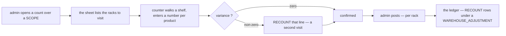

⚠ **The counter's job is to MEASURE, not to reconcile.** Every question the design cannot answer from the
count itself — the batch, the owner, the cause — is answered by the system or by the **admin at review**.
That single constraint drives [blind-by-default](#blind-by-default), the surplus owner select in
[a-surplus-line-fails-alone](#a-surplus-line-fails-alone), and the pro-rata attribution already settled in
[batch_selection P3](batch_selection.md).

## Screens

| Route | Screen |
| --- | --- |
| `/opname` | the sheets — open, in review, posted. **The page exists today as a stub** |
| `/opname/new` | choose the **scope**: the whole warehouse · a named set of racks · one product everywhere |
| `/opname/:id` | the sheet — racks with progress, variance count, the **post** action |
| `/opname/:id/rack/:rackId` | ⚠ **the counting screen** — phone-shaped, scanner-first, one number per product, no expected column |

---

## the-sheet-is-the-document

A count is not one action. It is **hours of walking**, several people, and a review before anything hits
the ledger — the same shape `stock_transfers` already has: a document, a lifecycle, and transactions
hung off the transitions.

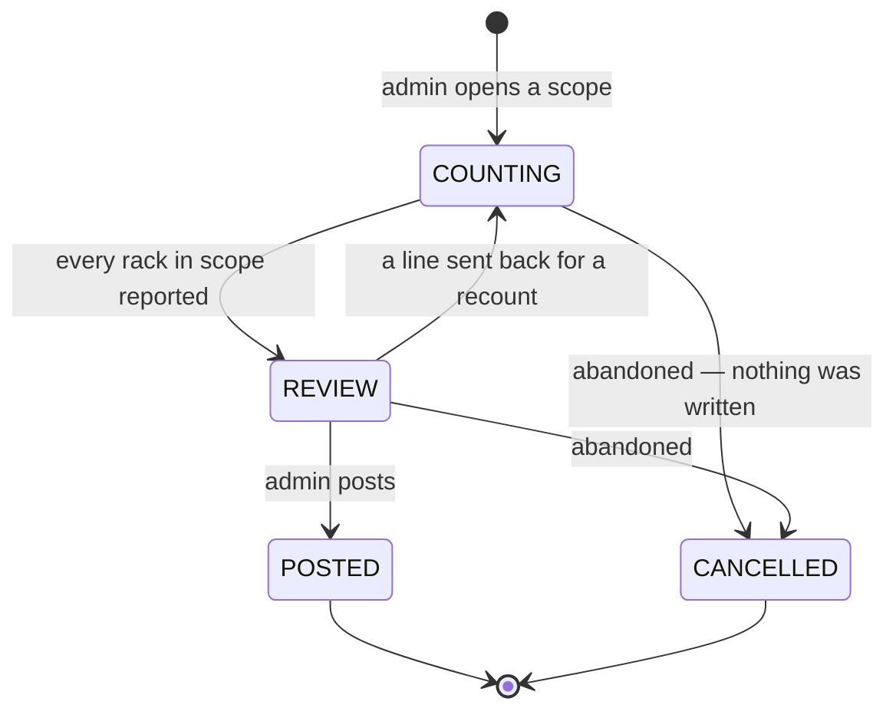

**The line grain is `(rack, product)`** — not `(rack, batch)`, which is the grain of everything else here.

| | |
| --- | --- |
| ✅ **the counter can produce it** | *"17 of this product on this shelf"* is a fact a person can establish |
| ❌ **`(rack, batch)` is not** | it needs a label scan per carton — [batch_selection](batch_selection.md) already parks label design as its own topic |
| the batch falls out | **pro-rata down** ([batch_selection P3](batch_selection.md)), **pool-walk up** ([found-recovers-a-loss](database/stock_design.md)) — both already decided |

→ **Recommend `(rack, product)`.** A per-batch count would replace a *guessed* attribution with an
*observed* one — genuinely better accounting, and the one thing that would unstack
[the two guesses](batch_selection.md) — but it multiplies the walking by the number of layers on a shelf.
**Worth offering later as a per-product opt-in for high-value goods, not as the default.**

⚠ **A rack's count is complete only when every product the system expects there has a line.** A product
with no line was **counted zero**, not skipped — otherwise the commonest shrinkage of all, *"the shelf is
empty and nobody noticed"*, is exactly the one a count cannot see.

## blind-by-default

**The counter does not see the expected number.** Anchoring is not a small effect: shown *"40"*, a person
who counts 37 counts again until they find 40, or types 40. The count then measures the record, which is
the one thing it was supposed to be independent of.

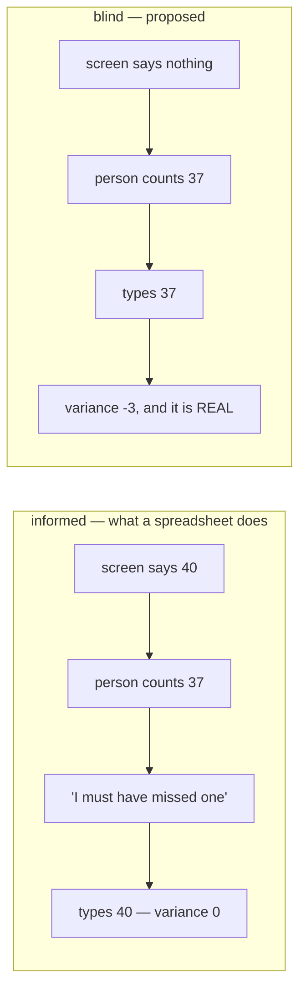

**The variance is revealed at review, to the admin — never at entry, to the counter.** That is also what
makes [variance-is-recounted-once](#variance-is-recounted-once) meaningful: a second blind count that
independently says 37 is evidence, and a second *informed* count is not.

## count-against-a-watermark

⚠ **The central hazard of the whole feature.** Picking does not stop while somebody counts, so *when* the
expected balance is read decides whether a real loss is recorded or silently absorbed.

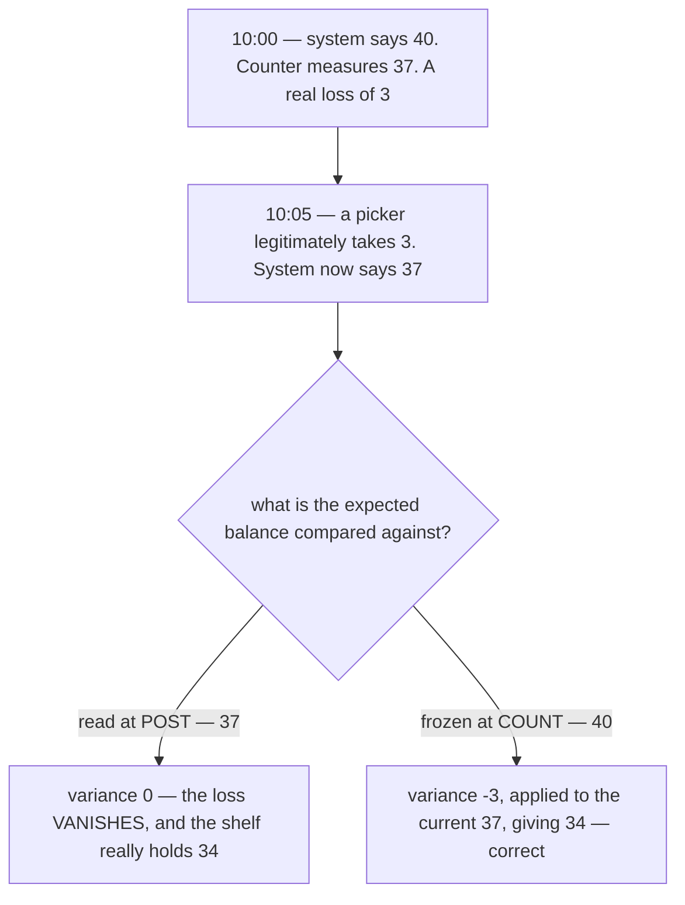

→ **Recommend: `expected_balance` is snapshotted onto the line the moment it is counted, and the post
applies `delta = counted − expected` to whatever the balance then is.** The count measures the shelf at a
moment, the ledger keeps moving, and the correction rides on top. Never re-derive the expected at post.

**The watermark is a second, cheaper thing:** `MAX(stock_movements.id)` at that rack when the line was
counted. It is **not** used in the arithmetic — it exists so the review screen can say *"this shelf moved
twice while you were counting it — count it again."* One column, an index seek on
`stock_movements_rack_idx`, and it turns the most confusing class of variance into a visible one.

⚠ **The post still refuses if `current_balance + variance < 0`** — the shelf cannot go negative, and a
count that says so is stale, not authoritative.

## post-per-rack-not-per-sheet

A building-wide count is thousands of lines. **One transaction over all of them is not an option:**

| | One transaction per SHEET | ✅ One per RACK |
| --- | --- | --- |
| DB locks | every `stock_rack_batches` row in the building, held for the length of the post | one shelf, released immediately |
| the event ([ledger P13](stock_movement_log.md)) | one message carrying ~10 000 movement lines — past Pub/Sub's limit | one message per rack, naturally bounded |
| a rack whose post must refuse (a count that would drive a balance negative) | the whole count fails on the last rack | that rack is rejected, 199 racks posted |
| what it means | *"the count"* is not an action anyone performed | ✅ **a rack IS what a person counted** |

→ **Recommend one `inventory_transaction` of kind `WAREHOUSE_ADJUSTMENT` per posted rack**, with
`reason` naming the sheet, and the sheet holding the grouping. This is the transfer pattern exactly — the
document is not the transaction, it **owns** transactions ([ledger P19](stock_movement_log.md)).

⚠ Consequence: **the post is not atomic across the sheet, and must not pretend to be.** The sheet's state
becomes `POSTED` or `POSTED_WITH_EXCEPTIONS`, and a rejected rack stays visible with its reason.

## variance-is-recounted-once

A line whose variance ≠ 0 cannot post until a **second count** exists. Agreement posts it, disagreement
sends it back to the admin as a judgement call rather than a third mechanical loop.

| | |
| --- | --- |
| why only variance lines | a zero-variance line already agrees with the record — recounting the whole sheet doubles the labour to re-confirm what two sources already say |
| why blind | see [blind-by-default](#blind-by-default). An informed recount is a rubber stamp |
| ⚠ same counter or a different one? | **open.** A different person is the real control, but in a small warehouse it may mean *nobody is available*. → **Recommend: prefer different, do not enforce** |

## a-short-count-fills-the-pool

`LOST` and a downward `RECOUNT` are decided identically ([batch_selection P3](batch_selection.md):
pro-rata, system-chosen) and differ only in what they **assert** — `LOST` names a cause, a count names
only a disagreement. **So the counter must behave identically too:**

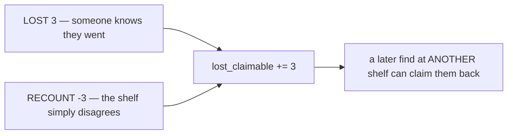

⚠ **Without this the design is broken in its commonest case.** A mislaid unit is found on a *different*
shelf ([the-claim-pool](database/stock_design.md#the-claim-pool)). If a short
count fed no pool, that later find would have no loss to recover, would be **refused**, and the operator
would be told to enter a restock for goods the company already owned — conjuring a cost layer, which is
the exact failure [found-recovers-a-loss](database/stock_design.md) exists
to prevent.

→ **Recommend: absence fills the pool, whatever kind asserted it.** The `kind` stays the honest record of
what was claimed.

## coverage-drains-the-pool

❌ **REJECTED (owner, 2026-08-05).**
[a-find-is-the-only-drain](database/stock_design.md#a-find-is-the-only-drain) closed it: a claim is
closed when `lost_claimable` reaches 0 and by nothing else. **A coverage write-off is an expiry, and there
is no expiry.** ⚠ It also kept the reconcile an **equality**, which any write-off would reopen.

The argument is kept below because it is the best statement of *what a count actually proves* — if an
expiry is ever wanted, this is the shape it should take.

A count writes off `lost_claimable` for a product **only if every rack that could still be hiding those
units was counted in this sheet.** Otherwise the count proves nothing — the units may be on an uncounted
shelf, which is where mislaid units always are.

⚠ **And "could be hiding" means EVERY rack in the building, not every rack the record associates with the
product** — see [coverage-must-be-the-whole-building](#coverage-must-be-the-whole-building). That makes
the drain strictly rarer than the table below first suggested.

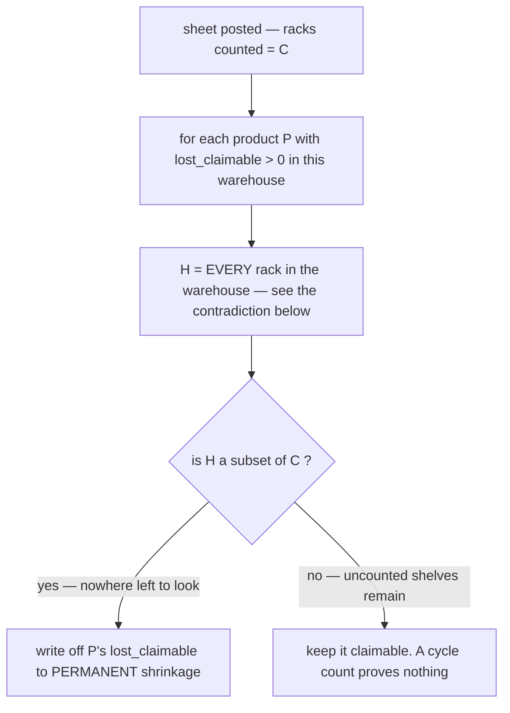

| | |
| --- | --- |
| a **warehouse-wide** count | drains everything — every shelf was visited |
| a **one-product** count across **every rack in the building** | drains that product only. ✅ the cheap, useful case — but it must be every shelf, not every shelf the record links to the product |
| a **three-rack cycle count** | ⚠ **drains nothing**, ever. Three racks are never the whole building |
| ⚠ the write-off itself | has **no ledger row** — the units already left `balance` when the short was written. ❌ **This is what killed it.** The claim-pool check is now an **EQUALITY** ([the-claim-pool](database/stock_design.md#the-claim-pool)), and a write-off is exactly the unrecorded decrement that would force it back to an inequality |

→ **Recommend the write-off be RECORDED on the sheet**, per product and quantity, so *"the count wrote
off 14 units that had been claimable since March"* is readable by the admin who posted it and by finance
later. A counter silently going to zero is exactly the drift the reconcile exists to catch.

⚠ **A cancelled sheet drains nothing** — coverage is a property of a *posted* count.

## a-surplus-line-fails-alone

❌ **WITHDRAWN (owner, 2026-08-05) — a surplus line no longer fails at all.**
[the-remainder-mints-at-last-price](database/stock_design.md#the-remainder-mints-at-last-price)
removed the refusal entirely: the excess **mints a batch at the last known price**, in the same action.

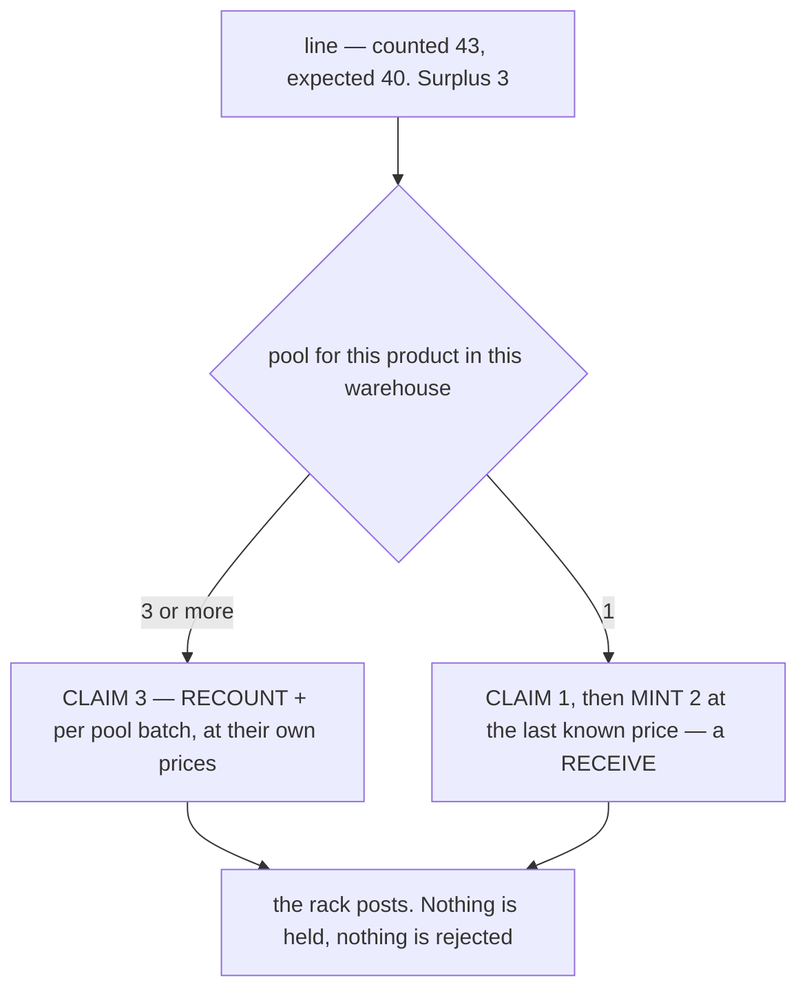

✅ **This is a strictly better answer to the same problem**, and it removes the need for the
`REJECTED` rack state and the restock-task flow this section invented. ⚠ It also removes the *signal* —
a surplus with no recorded loss used to stop and ask a person. Now it posts silently, so the sheet must
**report what it minted** (*"3 units of P had no recorded loss and were minted at Rp 12.000"*) or a
receiving problem becomes invisible.

### ⚠ A mint needs an OWNER, and the counter must not be the one to pick it

[the-owner-is-named-by-a-person](database/stock_design.md#the-owner-is-named-by-a-person)
makes the selling team **a request field a warehouse person picks from a select** — and it is chosen
*before* anything is written, so it scopes the **claim pool** as well as owning the mint. That lands
squarely on this doc's own division of labour — *"the counter's job is to MEASURE, not to reconcile"* —
so it cannot be asked at the shelf.

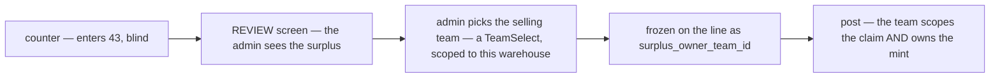

→ **Recommend the line carry `surplus_owner_team_id`, set at REVIEW.** ⚠ *Was `mint_owner_team_id` —
wrong, because the team is chosen before the claim, not after it.* There is **no default**: the post
refuses a surplus line with no team, which is deliberate — a placeholder owner is a question nobody comes
back to.

⚠ It must be **frozen on the line**, not resolved at post — the same reason `expected_balance` is
([count-against-a-watermark](#count-against-a-watermark)).

⚠ **Use the shared [`TeamSelect`](../../frontend/src/components/), scoped to teams trading in this
warehouse.** An unscoped picker lets an admin assign found goods to any team in the company.

⚠ **`STOCK_COUNT_RACKS.state` keeps `REJECTED`** — the post can still refuse for the other reason:
`current_balance + variance < 0` ([count-against-a-watermark](#count-against-a-watermark)).

→ **What stops it recurring:** the earlier rule was written for an *ad-hoc find at one shelf*, where a
preview is genuinely possible, and then nominated as the stocktake's draining event without re-checking
whether its escape hatch survived the new context. Recorded in
[the-preview-does-not-survive-a-blind-count](#the-preview-does-not-survive-a-blind-count).

## a-find-crosses-owners

❌ **WITHDRAWN (owner, 2026-08-05) — a find does NOT cross owners. The team is named.**
[the-owner-is-named-by-a-person](database/stock_design.md#the-owner-is-named-by-a-person):
a warehouse person picks the selling team from a select before anything is written, and that choice scopes
the pool.

**The argument below was built on a premise that turned out to be false.** It said:

> [ledger's plan-per-kind table](stock_movement_log.md) says a `RECOUNT` up requires *"the warehouse names
> the selling team."* **The counter cannot know that** — a shelf holds several teams' batches (#232) and
> the units are indistinguishable. → walk the pool across owner teams instead.

⚠ **"The counter cannot know" was true and led to the wrong conclusion.** It does not follow that *nobody*
can know — this doc's own design already splits the work in two, and the **admin at review** is the person
the question belongs to. The ledger's original line was right all along.

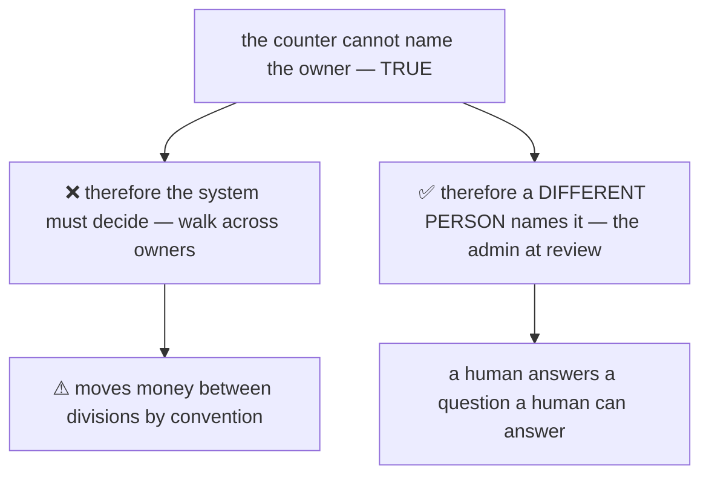

→ **What it saves:** ownership stays a stated fact rather than a convention, and nothing has to justify
repaying team 7's loss with team 9's units.

⚠ **It does move money between teams** — team 7's loss is repaid by units that might have been team 9's.
So does every pick under P5, and this one repays at the price it was written off at, which is the fairest
number available. See [the contradiction](#fungible-to-a-pick-but-named-to-a-find).

---

## Proposed Design — the tables

Three tables in `inventory_service`. **No change to the seven final ones** except the two counters already
proposed in [the-claim-pool](database/stock_design.md#the-claim-pool) — now **one** column,
`lost_claimable`.

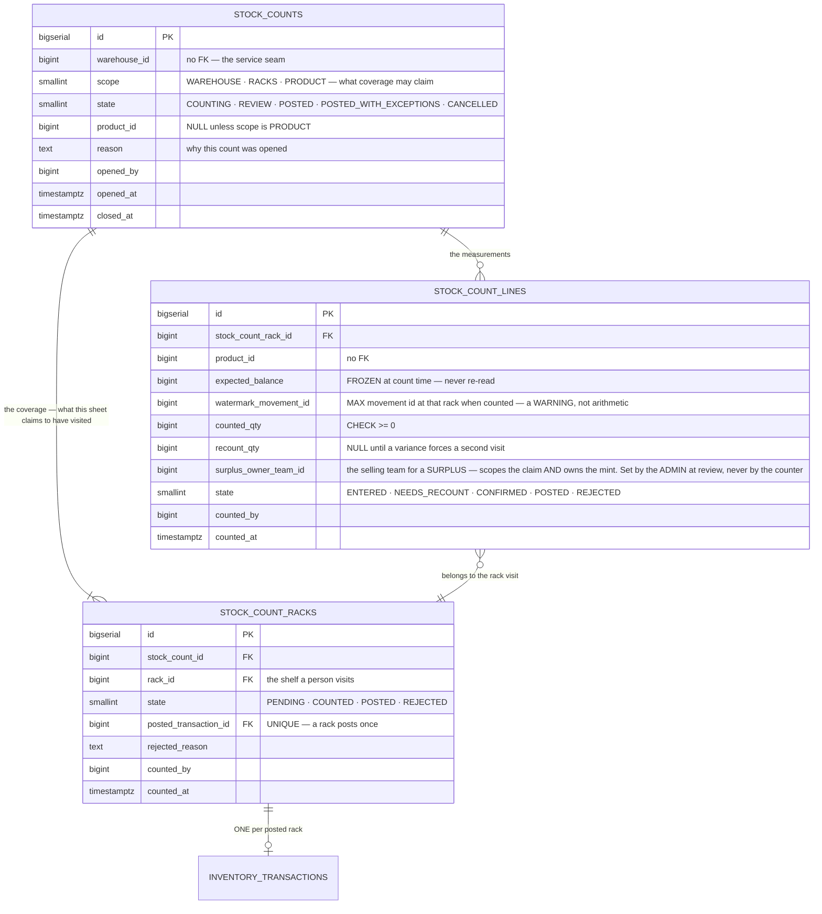

**The post, per rack, in one DB transaction:**

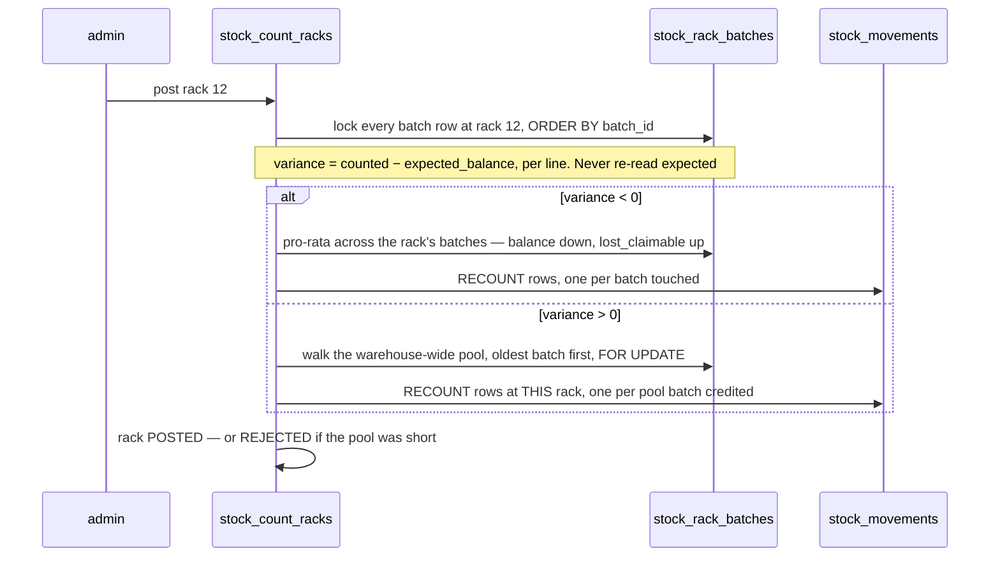

**Two things this must also do, and they are easy to forget:**

| | |
| --- | --- |
| `racks.last_counted_at` | the proto **already carries** `last_opname_unix` on the rack and placement reads, amber when stale. Posting is what feeds it — that column does not exist yet |
| the mint report | ❌ the coverage write-off is rejected, so nothing runs at sheet close. What the sheet **must** now carry instead is **what it MINTED** — see [a-surplus-line-fails-alone](#a-surplus-line-fails-alone). Without it, a receiving problem posts silently |

---

# Contradiction

## coverage-must-be-the-whole-building

**One cause, two sites.** The hiding-place set `H` was derived from *where the system records the product*
— but the entire premise of the claim pool is that a mislaid unit is somewhere the system **does not**
record it.

| Site | Says |
| --- | --- |
| [the-claim-pool](database/stock_design.md#the-claim-pool) · [a-short-count-fills-the-pool](#a-short-count-fills-the-pool) | *"a mislaid unit is found on a **different** shelf"* — the pool exists because the record is wrong about where it is |
| [coverage-drains-the-pool](#coverage-drains-the-pool) | *"H = every rack holding P, **or holding a P loss counter**"* — the racks the record says it is on |

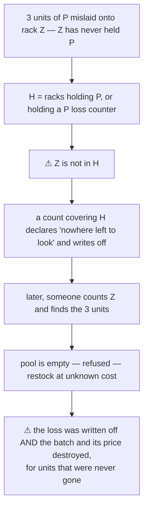

→ **RECOMMEND: `H` is every rack in the warehouse.** A posted count drains a product's `lost_claimable`
only if it visited **every shelf**, whether or not the system expected that product there. The scope table
survives — walking the whole building for one product is still a `PRODUCT`-scope count — only the
definition of `H` was wrong.

⚠ **The drain becomes rarer than the section implies:** a three-rack cycle count drains nothing (already
stated), and so does *any* partial count, for *any* product. **Only a building-complete sweep terminates
the pool.** That is the honest price of an evidence-based drain, and it is still better than a clock,
which terminates on no evidence at all.

→ **What stops it recurring:** `H` was built from a query that was easy to write rather than from the
claim being made. **When a rule asserts "we looked everywhere", the set must come from the PHYSICAL
space, never from the record the rule exists to doubt.**

## the-preview-does-not-survive-a-blind-count

**One cause, two sites.** The found-goods rule was designed for an ad-hoc find at one shelf, then
nominated as the stocktake's draining event without re-checking that its escape hatch still worked.

| Site | Said |
| --- | --- |
| the remainder rule, as it then stood | *"the excess refuses the whole action — the screen **previews the pool before submit**, so the operator never sends a number that fails"* |
| the drain question, as it then stood | *"Recommend the STOCK-TAKE"* — a count that is **blind** and posts **hours later** |

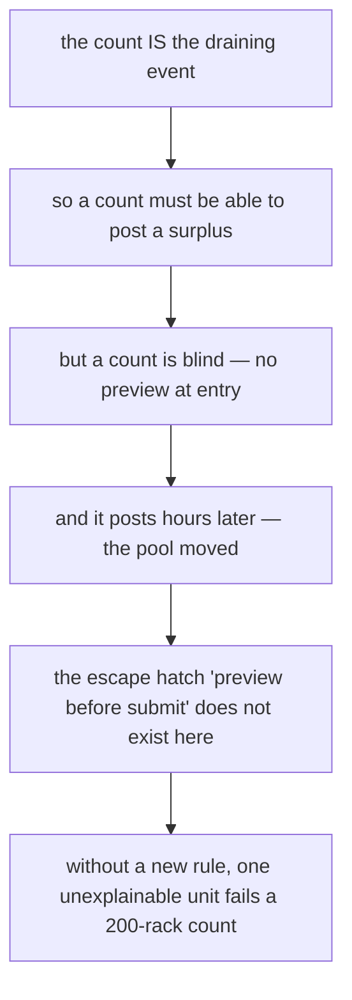

✅ **RESOLVED, and not the way this doc proposed.**
[the-remainder-mints-at-last-price](database/stock_design.md#the-remainder-mints-at-last-price)
(owner) **removed the refusal entirely** instead of shrinking its blast radius. A rule that leaned on a
screen was replaced by one that needs no screen at all — which is a better answer to *"the escape hatch
does not exist here"* than inventing a second escape hatch.

→ **What stops it recurring:** *"the screen prevents it"* is a UI guarantee inside a data rule. When a
rule leans on a screen, name the screen — so nominating a second caller makes the dependency visible
instead of inherited.

## fungible-to-a-pick-but-named-to-a-find

**One cause, two sites** — ownership was made *irrelevant* for consumption and *required* for recovery,
and nothing compared the two.

| Site | Says |
| --- | --- |
| [batch_selection P5](batch_selection.md) | *"Stock is **FUNGIBLE across owners** on a shelf — a pick draws FIFO regardless of which division owns the batch"* |
| [ledger, plan-per-kind](stock_movement_log.md) | a `RECOUNT` up — *"the **warehouse names the selling team**, then the system credits back that team's unrecovered `LOST` rows"* |

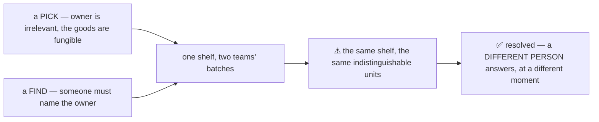

✅ **RESOLVED — and it is not a contradiction after all.** The two sites differ because a pick and a find
ask the question at **different moments, of different people**. A pick happens at the shelf, in seconds,
by someone holding a picking list — there is nobody there to ask. A find is reviewed before it posts, by
an admin who can. **Fungible-at-the-shelf and named-at-review are compatible**, and the ledger's line
needed no change.

⚠ *Was: "RECOMMEND a-find-crosses-owners — it repays one team's loss with another's units, but the
alternative asks a counter a question the shelf cannot answer."* **Withdrawn** — see
[a-find-crosses-owners](#a-find-crosses-owners).

→ **What stops it recurring:** ⚠ **"nobody can answer this" is almost always "nobody AT THIS MOMENT can
answer this."** The fix was never a cleverer rule — it was noticing that the flow already had a second
person standing at a later step. Before designing a convention to paper over a missing answer, check who
else the flow touches.

---

## Question

1. **Does the sheet REPORT what it minted?** With the refusal gone, a surplus posts silently — *"3 units
   of P had no recorded loss, minted at Rp 12.000"* is the only thing left that makes a receiving problem
   visible. → **Recommend yes**, on the sheet and in the post event.
2. **[blind-by-default](#blind-by-default)** — confirm the counter never sees the expected number. It is
   the single biggest quality lever here, and it is the thing operators most often ask to have removed.
3. **Does the REVIEW screen carry the team select?** The flow needs it there —
   `surplus_owner_team_id`, a scoped [`TeamSelect`](../../frontend/src/components/), frozen on the line —
   and the review screen has not been designed yet.
4. **Does a count also record BROKEN?** A counter finds 40 sellable and 3 damaged. → **Recommend
   `quarantine-is-a-rack`**: damaged stock is *moved to a quarantine shelf*, so a normal count compares
   against `balance` alone and never has to carry a second number per line. ✅ **`broken_claimable` has
   since been dropped** ([the-claim-pool](database/stock_design.md#the-claim-pool)), so a
   **place** is now the only candidate for expressing damaged stock — which makes this question the one
   that decides whether quarantine gets designed at all.
6. **Which service owns it?** `inventory_service` holds the stock tables today, so the sheet belongs
   there — but a count is arguably its own workflow. Recommend **`inventory_service`**: the post must run
   in the same DB transaction as the balances it moves.
