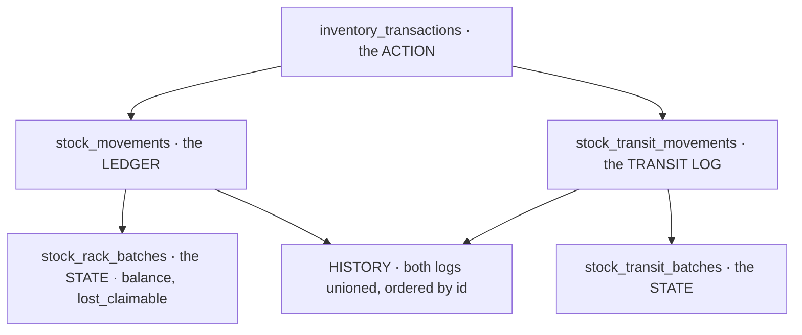

# Stock vocabulary — one word, one thing

> ⚠ **`disscuss/` — NOT final.** One ruling and the words it disambiguates. Linked from
> [rack_batch_mutation](rack_batch_mutation.md) · [move_layers](move_layers.md) ·
> [restock_flow](restock_flow.md) · [restock_reversal](restock_reversal.md).

# Proposal

**✅ `ledger` = `stock_movements`** (owner). It is the label for that one table — not the pair of movement
tables, not the transit table, not the state tables. In prose, write **`stock_movements` ledger** so nobody has
to remember it.

| term | is exactly |
| --- | --- |
| **the `stock_movements` ledger** | one table, at a rack, append-only |
| **a movement** | one row of it — one line of one action, at one rack, for one layer |
| **the transit log** | `stock_transit_movements` |
| **history** | both logs unioned and ordered by `id` — one batch's whole story |
| **the state** | `stock_rack_batches` · `stock_transit_batches` — balances. Mutable, lockable |
| **the action** | one `inventory_transactions` row |
| **the db transaction** | the Postgres transaction. ⚠ never *"the transaction"* unqualified — the action is one too |
| **a layer** / **a batch** | one `stock_batches` row |
| **a place** | a rack, or a transfer in flight |
| **the gate** | the `racks` row lock ([the-rack-is-the-lock-token](rack_batch_mutation.md#the-rack-is-the-lock-token)) |

**Why it needed a ruling:** *"the ledger is two tables"* and *"`stock_movements` · THE LEDGER"* are both in
stock_design. Read the first and `stock_movements_txn_once` looks like it spans both tables; read the second and
it does not. **A word that names either one table or two cannot carry a uniqueness rule** — and that is what the
file uses it for.
