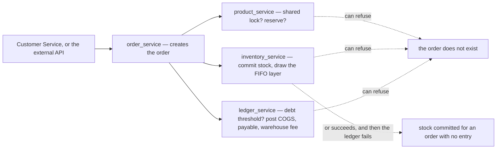

# Clarity — `architectures/architecture_context.md`

The service decomposition I read out of
[architecture_context.md](../../../docs/requirements/architectures/architecture_context.md), and what
drawing those lines now forces the business to answer. **That doc is yours — this one is mine.** Answered
points are **deleted**, so this file is always the current open set.

> **Re-examined now the layer has content.** ✅ **Closed and deleted:** *what does `architectures/` hold?* —
> it holds **service boundaries**, answered by demonstration. My recommendation for this layer was the
> *business* shape rather than a technical decomposition. You chose otherwise and that is yours: recorded,
> not re-argued. **Still open and now narrower:** the `systems/` half — that layer is still a single empty
> heading, and it is the only rung of the ladder with nothing in it ([Question 1](#question)).
>
> Six lines of doc, and **every one of my three top-ranked business questions now has a service boundary
> running through it**. That is the finding, not the list itself.

Siblings: [business_level](../business_level_clarity.md) · [product_context](../product_context_clarity.md) ·
[order_context](../order_context_clarity.md) · [stock_context](../stock_context_clarity.md) ·
[balance_context](../balance_context_clarity.md) ·
[systems/systems_product_context](../systems/systems_product_context_clarity.md).

---

## Proposed Design

### The rules, named

#### six-services-split-the-domain
`user_service` (identity, roles, ACL) · `team_service` (the four team kinds, membership) ·
`product_service` (catalogue, markup, reserve, shared lock, supplier) · `inventory_service` (batches/FIFO,
placement, restock, opname, return, broken/lost) · `order_service` (order lifecycle, marketplace info, CS
entry + external API) · `ledger_service` (the book). *(§Microservice For Breakdown Complexity)*

#### one-book-for-all-money
**COGS, payable/receivable, team balance, debt threshold, warehouse fee, expenses and payments are ONE
double-entry book**, in one service. *(§Microservice 6)*

✅ **This is the strongest line in the doc, and it answers in one stroke the problem this analysis kept
running into.** Double entry only balances if **both legs are written in one place** — and the two
contradictions `order_context_clarity` carried were each a rule naming one leg while a sibling doc named
the other. One book makes "every debit has its credit" an invariant something can check, rather than an
agreement between services. No question attached: recorded so it is not re-litigated.

### What one order now touches

**Three of the four services can refuse one order, and any of them can fail after another has already
succeeded** — see [Critique 1](#critique).

### Capability to service, and what has no home

| `business_level.md` §What Should Be Covered | service |
| --- | --- |
| 1 · order management | `order_service` ✅ |
| 2 · stock management | `inventory_service` ✅ |
| 3 · **transparency accounting** | ⚠ **none** — the entries are in the ledger, but the promise is that a team can *trace* every charge against it, which spans four services |
| 4 · **flexible statistics** — order, accounting, cost | ⚠ **none** — spans `order_service`, `ledger_service`, `inventory_service` |
| 5 · sharing stock between selling teams | covered, but by **three**: `product_service` (the controls), `inventory_service` (the stock), `ledger_service` (the money) |
| 6 · team balance | `ledger_service` ✅ |
| 7 · cost tracking — electricity, ads, payroll | `ledger_service` ("expenses") ✅ |
| — · **the shipping / COD leg** | ⚠ **none** — no service owns couriers, and *"cover shipping fee"* has been homeless for several rounds |

---

## Critique

| | Problem | → Recommend |
| --- | --- | --- |
| **1** | **One business moment, four services, and no failure story.** Creating an order tests the lock and the reserve in `product_service`, commits stock in `inventory_service`, checks the debt threshold and posts in `ledger_service`, and writes the order in `order_service`. Three can refuse it, and any can fail *after* another has succeeded — stock committed for an order with no ledger entry, or an order standing against stock nobody reserved. **Nothing in the requirement set says what the business wants to happen then**, and this is the most frequent transaction in the business. | State the **business** answer, not the mechanism: *an order exists completely or not at all, and a partial one is visible to a person who can finish or void it.* Whether that is a saga, a compensation or a queue is a `plans/` question. ⚠ Left unstated, the default is silence — and silent partial state in the money path is the failure nobody notices until a reconciliation. |
| **2** | **The ledger owns COGS and inventory owns the FIFO layers, so which service decides the AMOUNT?** The book records the cost, but the number comes from drawing a layer, and only inventory knows which layer and at what unit price. If inventory computes and the ledger records, the frozen figure is a **message between two services** — losable, duplicable, arrivable stale. If the ledger computes, it must read another service's layers to do it. | **Inventory decides the amount; the ledger records it verbatim** — the service holding the layers is the only one that can say what a draw cost. Then say the freeze out loud: **the amount is fixed when the layer is drawn and never recomputed**, so a redelivered message cannot change a posted figure. That sentence is what makes the boundary safe. |
| **3** | **`product_service` owns the reserve and the lock; `inventory_service` owns the stock. A reserve is a claim ON stock the reserving service does not hold.** *"Below the reserve it cannot be shared"* is a rule about a **quantity** that lives in inventory, enforced by a service that knows only the **threshold**. Whoever evaluates it needs both halves at the same instant, and two teams drawing the last units at once is the normal case here. | Split the two ideas: **the reserve NUMBER is the product's** (catalogue policy, set by the owner) and **the reserve CHECK is inventory's** (only it can compare the number to a live quantity, atomically with the commitment). Say which service refuses the line — today both could believe the other does. |
| **4** | **Three capabilities have no service, and two are stated project goals.** *Transparency accounting* (§3) and *flexible statistics* (§4) span several services by nature — a team tracing a charge, an owner asking about orders, cost and accounting together. A read spanning four services either becomes a query nobody owns, or quietly forces one service to reach into another's data. Separately, **nothing owns couriers**. | Name where a **cross-service read** lives rather than letting it emerge — I recommend money reporting as an explicit capability of `ledger_service`, and the rest as a stated reporting concern. And decide whether shipping belongs to `order_service` or to a service of its own: either is defensible, **unowned** is not. |

---

## Question

1. **What does `systems/` hold, now that context and `architectures/` both have content?** It is the only
   empty rung left. **→ I recommend the same rule stated precisely enough to implement — inputs, outputs,
   invariants, edge cases — and if that cannot be told from a context doc in one line, drop the layer.**
2. **What should happen when one order half-succeeds across the four services?** ([Critique 1](#critique))
   **→ I recommend: it exists completely or not at all, and a partial one is visible to a person.**
3. **Which service decides the COGS amount — the one holding the layers, or the one holding the book?**
   ([Critique 2](#critique)) **→ I recommend inventory decides, the ledger records verbatim, never recomputed.**
4. **Who enforces the reserve — the service owning the number, or the one owning the quantity?**
   ([Critique 3](#critique)) **→ I recommend the number is the product's, the check is inventory's.**
5. **Which service serves transparency accounting, statistics, and the shipping leg?**
   ([Critique 4](#critique))

---

# Contradiction

**None between this doc and the requirement set.** I checked the six services against the responsibilities
in `business_level.md` and the rules in the five context docs: every boundary is consistent with what those
docs assign — including **placement landing in `inventory_service`**, which matches the responsibility added
to §Warehouse Team 8. Recorded as an answer rather than as silence.

The gaps in [Critique 4](#critique) are **capabilities with no owner**, not two statements that cannot both
hold — filed as critique, not here.

---

# Awaiting

- **No service is described beyond its noun list.** What each **owns as data** versus what it merely reads
  is the question every boundary above turns on, and the doc names responsibilities rather than ownership.
- **Nothing says which services may talk to which**, or whether any share a database. Both are
  business-visible: they decide whether one team's outage stops another team's selling.

---

# One factual note on the built code

Stated as fact, not as an argument in either direction (HARD RULE 8b.5 — what exists is never a
justification): `backend/services/` currently holds **twelve** service directories, and the naming differs
from this doc in three places — the order domain is built as `selling_service`, the money domain is split
across `settlement_service`, `revenue_service` and `expense_service` rather than one `ledger_service`, and
`category_service`, `document_service`, `region_service` and `shipping_service` exist without appearing in
this list. Worth knowing when this doc is used to judge what to build next. It settles nothing.
