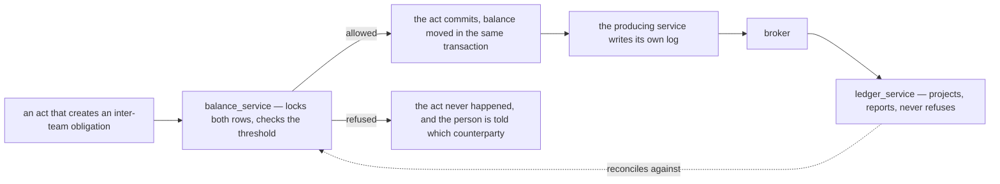
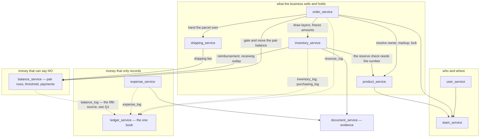
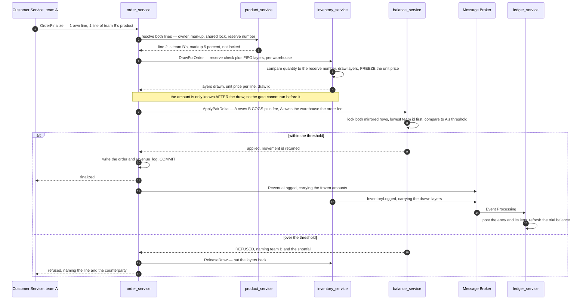
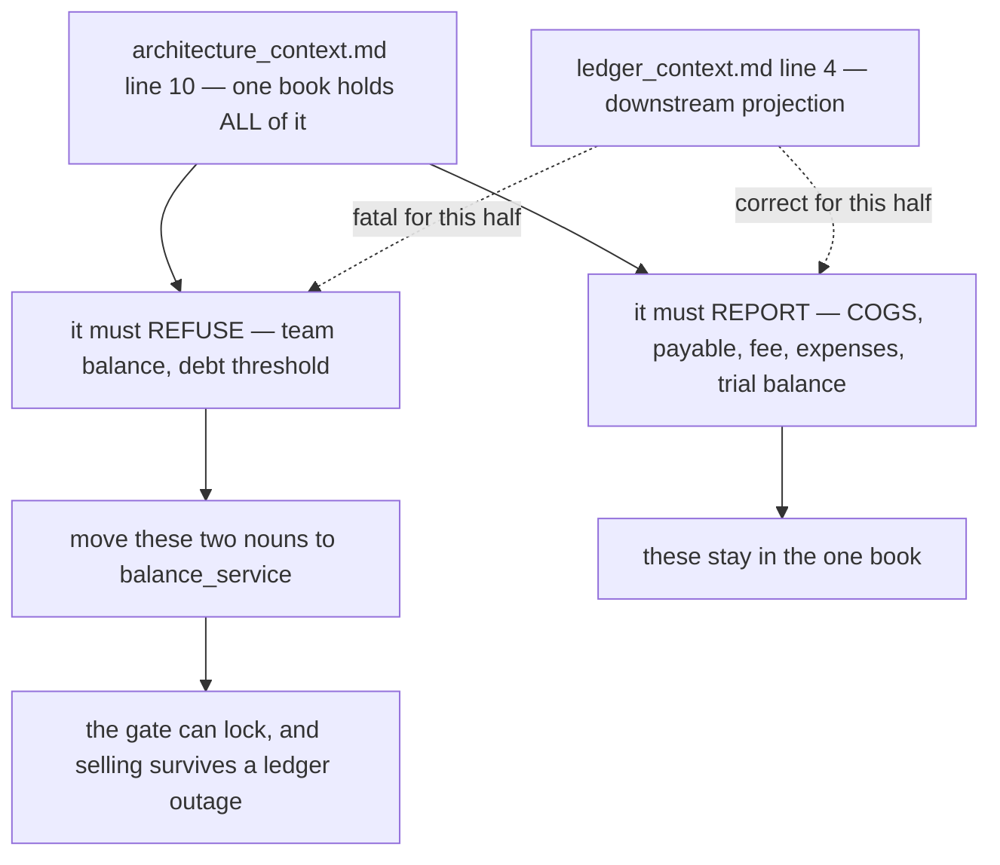
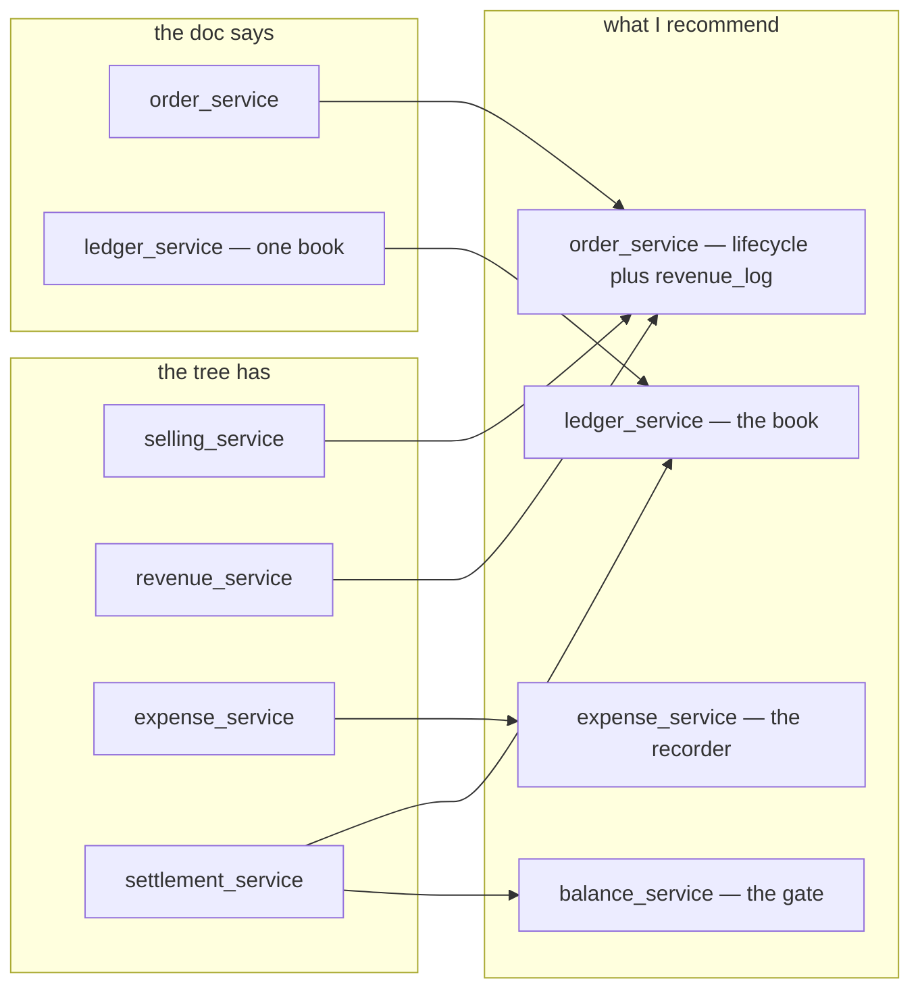

# Clarity — `architectures/architecture_context.md`

The service decomposition I read out of
[architecture_context.md](../../../docs/requirements/architectures/architecture_context.md), what it
leaves homeless, and the **complete breakdown I recommend instead**. **That doc is yours — this one is
mine.** Answered points are **deleted**, so this file is always the current open set.

> **Re-examined after `ledger_context.md` gained its flow.** ✅ **Closed and deleted:** *which service
> decides the COGS amount* — [ledger is downstream projection](../../../docs/requirements/ledger_context.md)
> settles it by construction: a book that cannot refuse cannot compute, so the amount must arrive **already
> frozen** in the producing service's log. It is now a rule, not a question —
> [inventory-freezes-the-amount](#inventory-freezes-the-amount). ✅ **Also deleted:** the "capabilities with
> no owner" critique — it is replaced by [the map](#capability--service--nothing-homeless), which gives every
> one of them a recommended home.
>
> ⚠ **What the same edit OPENED:** line 10 of your doc puts the **debt threshold** inside the ledger, and
> the ledger is now a projection. **A projection cannot refuse anything, so the gate has no home** — the
> single largest consequence of the settlement, recorded in
> [Contradiction](#the-gate-was-left-in-a-service-that-can-no-longer-refuse) and answered by
> [gate-lives-in-balance-service](#gate-lives-in-balance-service).

Siblings: [business_level](../business_level_clarity.md) · [product_context](../product_context_clarity.md) ·
[order_context](../order_context_clarity.md) · [stock_context](../stock_context_clarity.md) ·
[balance_context](../balance_context_clarity.md) · [ledger_context](../ledger_context_clarity.md) ·
[user_context](../user_context_clarity.md) ·
[systems/systems_product_context](../systems/systems_product_context_clarity.md).

---

## Proposed Design

**Ten services.** Your six, kept and kept named — plus four the requirement set demands and the six do not
contain: a **gate** the ledger can no longer hold, an **expense recorder** your own ledger diagram draws as
its own box, a **parcel** nobody owns after handover, and an **evidence store** that "transparency
accounting" cannot be proven without.

### What is settled, and what the settlement forces

#### one-book-many-record-of-truth-sources
[one-book-for-all-money](#one-book-for-all-money) survives whole — **there is exactly one journal**. What
[ledger is downstream projection](../../../docs/requirements/ledger_context.md) adds is that the journal is
**not the record of truth**: the producing domains are. *One book, N sources* is not a weakening of your
line — it is the only reading of it that both docs support at once.

#### one-book-for-all-money
**COGS, payable/receivable, warehouse fee, expenses and payments are ONE double-entry book**, in one
service. *(§Microservice 6)* — kept verbatim, minus the two nouns that cannot live in a projection
([Contradiction](#the-gate-was-left-in-a-service-that-can-no-longer-refuse)).

#### logs-live-in-their-producing-service
`revenue_log` is drawn **inside** the Sales/Order box, `inventory_log` inside Inventory, `expense_log`
inside Other Expense *(ledger_context.md:8-44)*. A log is written in the same local transaction as the act
it records, by the service that performed the act. **This is what makes the four logs records of truth
rather than an outbox** — and it is why `expense_service` must exist as a service and not as a table in the
ledger.

#### inventory-freezes-the-amount
The service holding the FIFO layers is the only one that can say what a draw cost, and the ledger cannot
recompute it — so **the amount is fixed when the layer is drawn, written into `inventory_log` and the
order's `revenue_log`, and the ledger records it verbatim.** A redelivered event can never change a posted
figure. *(derived from [batch-fifo-pricing](../product_context_clarity.md#batch-fifo-pricing) plus the
settlement)*

#### gate-lives-in-balance-service
**The debt threshold moves out of the ledger into a `balance_service` that owns the mirrored rows and can
lock them.** Anything that may **refuse a person** must be written in the same transaction as the act it
refuses. `balance_service` is small, synchronous and boring: two mirrored rows per pair, a threshold, an
append-only movement log — and it is the only service in the system whose job is to say *no*.

#### balance-service-owns-the-mirrored-rows
`team_balance` is a **stored row per ordered pair**, not `SUM(ledger_line)` —
[balance_context.md:16](../../../docs/requirements/balance_context.md) says *"two mirrored row"*, and a gate
needs a row it can `SELECT … FOR UPDATE`. The ledger's trial balance is a **different artefact with a
different freshness contract**: the pair balance gates, the trial balance reports.

#### reserve-number-is-the-products-check-is-inventorys
The reserve **number** and the shared **lock** are catalogue policy set by the owning selling team →
`product_service`. The **check** compares that number against a live quantity and must happen atomically
with the draw → `inventory_service`. One refusal point, not two services each believing the other does it.

#### order-lifecycle-is-one-service
Draft, finalize, CS entry, the external create API, warehouse-accept, pack/pick, handover and the shipped
statuses are **one row's lifecycle** — they do not split. The external API is an **ingest surface**, not a
service. ⚠ Splitting CS entry from the lifecycle would put two services on one aggregate, which is the one
shape that guarantees a contradiction.

#### purchasing-is-the-restock-document
`ledger_context.md:18` draws Purchasing as its own box, and **no other requirement doc describes it** — no
buyer, no supplier payable, no cash account, no payment moment. I recommend the restock document in
`inventory_service` **is** the purchase (the selling team mints it, the price lands at accept) and emits
`purchasing_log`. Split a `purchasing_service` out the day supplier payables or prepayments are described —
not before. **A service for an undescribed flow is speculation with a migration attached.**

#### shipping-owns-the-courier-and-the-parcel
*"cover shipping fee"* (`business_level.md:20`) has been homeless for several rounds, and
`business_level.md:56` ends the warehouse's job at *"taken by shipment channel"*. `shipping_service` owns
the courier catalogue, the shipment record (awb, fee, status) and the in-transit leg. `order_service` owns
the order's status — **the parcel and the order are two lifecycles that diverge exactly when the problem
happens.**

### Capability → service — nothing homeless

⚠ **Rows marked ⓘ name a capability the requirement set never mentions.** That is a finding, not an
oversight I routed around: four things the business plainly needs are in no requirement doc.

| # | Capability | Named at | Service | Why there |
| --- | --- | --- | --- | --- |
| 1 | identity, login, one person across teams | `user_context.md:4` | `user_service` | the person is one row regardless of how many teams they serve |
| 2 | roles per team, the ACL | `user_context.md:30-46` | `user_service` | a role is a membership, and enforcement must sit with what it reads |
| 3 | the four team kinds, membership | `business_level.md:37-41` | `team_service` | the team is the scope every other service is partitioned by |
| 4 | shops in the marketplace | `business_level.md:67` | `team_service` | a shop is a selling team's storefront identity — master data an order only references ([Q6](#question)) |
| 5 | product catalogue | `product_context.md:45` | `product_service` | the selling team's own list |
| 6 | cross/shared fee markup percent | `product_context.md:51-57` | `product_service` | a product attribute, set by its owner |
| 7 | reserved stock **number** | `product_context.md:61` | `product_service` | policy, not quantity |
| 8 | reserved stock **check** | `product_context.md:61` | `inventory_service` | only the holder of the quantity can compare atomically |
| 9 | shared lock | `product_context.md:62` | `product_service` | the owner's consent switch |
| 10 | supplier | `business_level.md:70,186` | `product_service` | the selling team's sourcing master data, per `architecture_context.md:7` ⚠ the tree puts it in inventory |
| 11 | product LinkMap (return ownership) | `order_context.md:233-235` | `product_service` | it maps a **product** to a product — catalogue identity, not stock |
| 12 | batches / FIFO layers, unit price | `product_context.md:27,33-41` | `inventory_service` | the layer is stock, and it is where the amount freezes |
| 13 | placement / racks | `business_level.md:62` | `inventory_service` | [warehouse-manages-placements](../business_level_clarity.md#warehouse-manages-placements) |
| 14 | restock mint | `business_level.md:69` | `inventory_service` | a two-party document — the warehouse accepts the same row |
| 15 | receiving (restock and return), fee input | `stock_context.md:8-40` | `inventory_service` | one flow, one screen, one person at the door |
| 16 | opname | `business_level.md:61` | `inventory_service` | a count against the layers |
| 17 | broken / lost / found-back declaration | `business_level.md:59`, `balance_context.md:10-11` | `inventory_service` | the goods are the fact — the money is a consequence |
| 18 | order draft, finalize, CS entry, external API | `order_context.md:12-13,115-146` | `order_service` | [order-lifecycle-is-one-service](#order-lifecycle-is-one-service) |
| 19 | marketplace order info | `order_context.md:7` | `order_service` | the buyer reference support is asked about |
| 20 | own vs cross line resolution | `order_context.md:16-19` | `order_service` | the line is where the two kinds differ |
| 21 | warehouse accept, packing/picking | `order_context.md:102-103` | `order_service` | the task and its states — the **draw** is inventory's |
| 22 | handover to courier | `order_context.md:104` | `order_service` then `shipping_service` | the status is the order's, the parcel becomes shipping's |
| 23 | shipped / problem / completed | `order_context.md:106-111` | `shipping_service` | the outcome is the courier's, mirrored onto the order |
| 24 | courier catalogue | ⓘ **nowhere** | `shipping_service` | bounded reference data with no other home |
| 25 | shipping fee cover | `business_level.md:20` | `shipping_service` then `balance_service` | priced by shipping, charged as a pair delta |
| 26 | warehouse order fee | `balance_context.md:7` | `order_service` then `balance_service` | caused per order, settled as a pair delta |
| 27 | estimated revenue (statistic only) | `order_context.md:150` | `order_service` | explicitly not a ledger fact |
| 28 | true revenue and `revenue_log` | `order_context.md:168`, `ledger_context.md:10` | `order_service` | your diagram draws Revenue Log **inside** the Sales/Order box |
| 29 | platform withdrawal | `order_context.md:176-177` | `order_service` | the wallet is fed by that shop's orders — reconciled against them ([Q7](#question)) |
| 30 | purchasing and `purchasing_log` | `ledger_context.md:18-24` | `inventory_service` | [purchasing-is-the-restock-document](#purchasing-is-the-restock-document) |
| 31 | expenses — electricity, ads, payroll | `business_level.md:22`, `ledger_context.md:36-44` | `expense_service` | its own box in your ledger flow, its own recorder and approver |
| 32 | payments between teams | `balance_context.md:12` | `balance_service` | it moves the pair balance and must be atomic with it |
| 33 | team balance, mirrored rows | `balance_context.md:15-16` | `balance_service` | [balance-service-owns-the-mirrored-rows](#balance-service-owns-the-mirrored-rows) |
| 34 | debt threshold **gate** | `balance_context.md:66-67` | `balance_service` | [gate-lives-in-balance-service](#gate-lives-in-balance-service) |
| 35 | journal, entries, lines | `ledger_context.md:55-62` | `ledger_service` | the one book |
| 36 | trial balance | `ledger_context.md:59` | `ledger_service` | downstream of the entries |
| 37 | **money** statistics — accounting, cost | `business_level.md:11-15` | `ledger_service` | it is already the projection engine — do not build a second one |
| 38 | **operational** statistics — order, stock | `business_level.md:11-15` | the owning service | an order count is not an accounting question ([Q5](#question)) |
| 39 | transparency accounting | `business_level.md:10` | `ledger_service` and `document_service` | a charge, its frozen amount, its actor, its evidence — a **claim**, not a screen |
| 40 | evidence — receiving photos, receipts, proof | ⓘ **nowhere** | `document_service` | row 39 cannot be proven without it |
| 41 | categories | ⓘ **nowhere** | `product_service` | a taxonomy has no life outside the catalogue |
| 42 | regions / addresses | ⓘ **nowhere** | `shipping_service` | a region exists to route and price a parcel ([Q8](#question)) |

### The ten services

| Service | OWNS (tables) | EXPOSES (key RPCs) | PUBLISHES | NEVER owns |
| --- | --- | --- | --- | --- |
| `user_service` | `user`, `team_member_role`, credentials | `UserList`, `SearchUser`, `UserTeams`, `TeamAccessList` | `RoleChanged` | a team's business data — it answers *who, and what may they do* |
| `team_service` | `team`, `warehouse_info`, `shop`, `shop_user` | `TeamList`, `TeamInfoUpdate`, `ShopList` | `TeamCreated` | balances, thresholds, stock — a team's **money** is not the team record |
| `product_service` | `product`, `product_image`, `category`, `supplier`, `product_link_map`, markup / reserve number / shared lock | `ProductList`, `ProductByIds`, `SetSharingPolicy`, `ResolveLinkMap` | `ProductPolicyChanged` | **any quantity.** A catalogue that stores a count is a second stock system |
| `inventory_service` | `stock_batch`, `stock_level`, `stock_movement`, `rack`, `restock_request`, `restock_cost_line`, receiving / opname / return / breakage records, **`inventory_log`**, **`purchasing_log`** | `Receive`, `DrawForOrder`, `ReleaseDraw`, `Opname`, `DeclareBroken`, `Place`, `StockByProduct` | `InventoryLogged`, `PurchaseLogged` | the markup, the reserve **number**, the journal. It states amounts — it does not book them |
| `order_service` | `order`, `order_item`, `order_draft`, `order_event`, estimated and true revenue, withdrawal, **`revenue_log`** | `OrderDraftCreate`, `OrderFinalize`, `OrderAccept`, `OrderPack`, `OrderHandover`, `OrderCancel`, `OrderList` | `RevenueLogged`, `OrderFinalized` | stock, layers, the markup value, the balance row. It **asks**, it does not compute |
| `balance_service` | `team_balance` (mirrored pair rows), `debt_threshold`, `balance_movement` (append-only), `payment` | **`ApplyPairDelta`** (locks, gates, commits), `PaymentCreate`, `PaymentAccept`, `ThresholdSet`, `BalanceByPair` | `BalanceMoved` | the journal, COGS, any product or stock fact. **It knows amounts and counterparties, never what was sold** |
| `expense_service` | `expense_record`, expense category, **`expense_log`** | `ExpenseCreate`, `ExpenseApprove`, `ExpenseList` | `ExpenseLogged` | the journal. It records that money was spent, not how it is posted |
| `shipping_service` | `courier`, `shipment` (awb, fee, status), `region` | `ShippingList`, `ShipmentCreate`, `ShipmentStatusUpdate`, `RegionSearch` | `ShipmentStatusChanged` | the order. A parcel's problem is not an order's status — it **causes** one |
| `document_service` | `document` (blob metadata), the object store | `DocumentUpload`, `DocumentByRefs` | — | business meaning. It stores evidence and never interprets it |
| `ledger_service` | `ledger_entry`, `ledger_line`, `account`, `trial_balance`, consumer offsets and dedupe | `TrialBalance`, `EntriesFor`, `FinancialStat`, **`ReconcileBalances`** | `LedgerEntryPosted` | **anything synchronous.** It cannot refuse, cannot gate, cannot sit in a finalize's critical path |

### The map

**Solid edges are synchronous and can refuse. Dotted edges are the broker and can only report.** Every
edge into `ledger_service` is dotted — that is the settlement, drawn.

### One cross-team order, finalized

**Step 7 is the whole design.** The draw must happen before the gate can run, so **the draw must be
reversible** — and the `ReleaseDraw` in the `else` branch is a compensation, which is the failure story
[Critique 1](#critique) says nothing in the requirement set has yet told.

### Reconciling with the twelve directories already in `backend/services/`

Stated as fact and as a proposal, never as a justification (HARD RULE 8b.5).

| Existing | Verdict | Reason |
| --- | --- | --- |
| `user_service` | **keep** | matches `architecture_context.md:5` exactly |
| `team_service` | **keep, absorb `shop`** | a shop is team master data — it sits in `selling_service` today |
| `product_service` | **keep, absorb `category_service`**, and gain supplier + LinkMap | catalogue master data belongs with the catalogue |
| `category_service` | **absorb** into `product_service` | a taxonomy with no catalogue is an orphan tree |
| `inventory_service` | **keep** — already the closest match | it already holds batches, levels, racks, restock, movements |
| `selling_service` | **rename to `order_service`, minus `shop`** | `architecture_context.md:9` names the domain *order*, and the doc's noun should win over the folder's |
| `shipping_service` | **keep, absorb `region_service`** | courier and destination are one bounded reference domain |
| `region_service` | **absorb** into `shipping_service` | a region exists to route a parcel ([Q8](#question)) |
| `document_service` | **keep** | it is what makes "transparency accounting" provable |
| `expense_service` | **keep** | `ledger_context.md:36` draws it as its own source box |
| `revenue_service` | **absorb** into `order_service` | `ledger_context.md:8-14` draws Revenue Log **inside** the Sales/Order boundary |
| `settlement_service` | **split** into `balance_service` (pair rows, threshold, payments) and `ledger_service` (entries, trial balance) | it holds `settlement_balance`, `settlement_entry`, `settlement_payment`, `settlement_terms` — a **gate**, a **book** and a **policy** in one box, and the settlement makes those three different freshness contracts |
| — | **create** `balance_service` | nothing in the tree can refuse a finalize |
| — | **create** `ledger_service` | nothing in the tree holds `ledger_entry` or `ledger_line` |

⚠ **On `revenue_service` + `expense_service` + `settlement_service` vs
[one-book-for-all-money](#one-book-for-all-money):** three money-shaped services is **not** three books,
provided each is a *recorder* and none is a *journal*. Under
[one-book-many-record-of-truth-sources](#one-book-many-record-of-truth-sources), `expense_service` records
that money was spent and `order_service` records that revenue was earned — **neither decides an account or
a debit.** `settlement_service` is the one that genuinely breaks the rule today, because
`settlement_entry` is a journal living outside the journal.

---

## Critique

| | Problem | → Recommend |
| --- | --- | --- |
| **1** | **One business moment, five services, and no failure story.** A finalize now touches `order`, `product`, `inventory`, `balance` and — asynchronously — `ledger`. Two of them can refuse it, and the sequence above shows the draw must succeed *before* the gate can even be evaluated. Nothing in the requirement set says what the business wants when the middle fails: stock drawn for an order that was refused, or a balance moved for an order that never committed. This is the **most frequent transaction in the business**. | State the **business** answer, not the mechanism: *an order exists completely or not at all, and a partial one is visible to a person who can finish or void it.* Concretely I recommend **draw → gate → commit → release on failure**, with `ReleaseDraw` and a reversing `balance_movement` as the only two compensations. Whether that is a saga is a `plans/` question — **that it must be reversible is a business question, and it is yours.** |
| **2** | **`architecture_context.md:10` still lists `debt threshold` inside the ledger, and the ledger can no longer refuse.** Left as written, the gate is either not built or built twice. | [gate-lives-in-balance-service](#gate-lives-in-balance-service) — and edit line 10 to drop `team balance` and `debt threshold` from the ledger's list. See [Contradiction](#the-gate-was-left-in-a-service-that-can-no-longer-refuse). |
| **3** | **The reserve is a claim ON stock by a service that does not hold it.** `product_service` knows the threshold, `inventory_service` knows the quantity, and two teams drawing the last units at once is the normal case here. | [reserve-number-is-the-products-check-is-inventorys](#reserve-number-is-the-products-check-is-inventorys). Say which service refuses the line — today both could believe the other does. |
| **4** | **Four capabilities the business obviously needs appear in NO requirement doc** — the courier catalogue, evidence/documents, categories, regions (rows ⓘ in [the map](#capability--service--nothing-homeless)). Three of them already exist as service directories, which means they were built without ever being described. | One line each in the context doc they belong to, or accept that they are undescribed infrastructure. My homes are recommended above — **the courier one is not optional: `business_level.md:20` promises to cover a shipping fee that nothing in the system can price.** |
| **5** | **`balance_service` would be a FIFTH money source, and your ledger diagram has four.** A payment between teams *(balance_context.md:12)* is caused by none of Sales/Order, Purchasing, Inventory or Other Expense. | Either add a fifth box — **Balance/Settlement** — to `ledger_context.md`, or say a payment is an *Other Expense*. I recommend the **fifth box**: a payment between two teams is neither a cost nor a sale, and calling it an expense puts it in the P&L where it does not belong. |
| **6** | **Nothing says which services may talk to which, and the answer is business-visible.** With ten services, "can team A still sell while the ledger is down" has an answer, and it should be a chosen one. | State it as an availability promise: **selling survives a ledger outage, and does not survive a balance outage** — the first only delays a report, the second removes a control. That one sentence justifies the whole solid/dotted split in [the map](#the-map). |
| **7** | **`systems/` is still one empty heading** — the only rung of the ladder with nothing in it, now that `architectures/` has content. | The same rule stated precisely enough to implement — inputs, outputs, invariants, edge cases. **If that cannot be told from a context doc in one line, drop the layer.** |

---

## Question

1. **Is a payment between teams a FIFTH source into the book, or an Other Expense?** ([Critique 5](#critique))
   **→ I recommend a fifth source — a payment is neither a cost nor a sale.**
2. **What should happen when one order half-succeeds across five services?** ([Critique 1](#critique))
   **→ I recommend it exists completely or not at all — draw, gate, commit, release on failure.**
3. **Who enforces the reserve — the service owning the number, or the one owning the quantity?**
   ([Critique 3](#critique)) **→ I recommend the number is the product's, the check is inventory's.**
4. **Is purchasing its own service, or the restock document?**
   ([purchasing-is-the-restock-document](#purchasing-is-the-restock-document))
   **→ I recommend the restock document, until a supplier payable or a payment moment is described.**
5. **Do statistics get their own service?**
   **→ I recommend no — money statistics are `ledger_service` (already the projection engine), operational
   statistics stay in the service that owns the rows. A `report_service` reading five databases is the one
   design that makes every boundary above meaningless.**
6. **Does a shop belong to `team_service` or to `order_service`?**
   **→ I recommend `team_service` — a shop exists before any order and outlives every one of them.**
7. **Where does a platform WITHDRAWAL live?** *(order_context.md:176)* It is a shop-level cash event, not a
   per-order one. **→ I recommend `order_service`, because the wallet is fed by that shop's orders and the
   withdrawal is reconciled against them. If a bank or cash account is ever modelled, it moves.**
8. **Is `region` shipping's, or shared master data?**
   **→ I recommend shipping's — every use of a region in the requirement set is a destination.**
9. **What does `systems/` hold?** ([Critique 7](#critique))

---

# Contradiction

## the gate was left in a service that can no longer refuse

**One cause, two sites, and the second one is new this round.**

> `architectures/architecture_context.md:10` — *"`ledger_service`, one double-entry book: COGS,
> payable/receivable, **team balance**, **debt threshold**, warehouse fee, expenses, payments"*
>
> `ledger_context.md:4` — *"**ledger is downstream projection**"*, and `ledger_context.md:50-61` gives it no
> synchronous path in at all.

**Which one I think is wrong: line 10, and only in two of its nouns.** *Downstream projection* is settled
and I am not re-arguing it. `one-book-for-all-money` is the strongest line in the requirement set and I
would keep it verbatim. What cannot stand is `team balance` and `debt threshold` sitting inside a
projection: a projection cannot lock a row, and a gate that arrives after the act it gates is not a gate.

**→ RECOMMEND** move exactly two nouns out of line 10 into a `balance_service`
([gate-lives-in-balance-service](#gate-lives-in-balance-service)), and leave COGS, payable/receivable,
warehouse fee, expenses and payments in the book as *entries*. What stops this recurring is naming the
**property**, not the component — **any control that may refuse a person is written in the same
transaction as the act it refuses.** That sentence also decides the shared lock and the reserve, which are
the next two gates in this system.

## the doc's six services and the tree's twelve are still not the same set

> `architectures/architecture_context.md:5-10` names **`order_service`** and **`ledger_service`**.
> `backend/services/` contains **neither** — it has `selling_service`, `revenue_service`,
> `expense_service`, `settlement_service`, plus `category_service`, `document_service`, `region_service`,
> `shipping_service`.

**Which one is wrong is yours to say**, and it is not cosmetic: it decides which service owns
`ledger_entry`, `team_balance` and the gate. My reconciliation is
[the table above](#reconciling-with-the-twelve-directories-already-in-backendservices) — **6 named + 4
undescribed = 10**, with `settlement_service` the one directory that must **split** rather than move,
because it holds a gate and a journal in the same box.

---

# Awaiting

- **No service is described beyond its noun list.** What each service **owns as data** versus what it
  merely **reads** is the question every boundary above turns on — the ten-row table is my proposal for it,
  and it stays a proposal until you say otherwise.
- **No availability promise.** [Critique 6](#critique) — whether one team's outage stops another team's
  selling is a business decision currently being made by accident.
- **No actor for the money screens.** Who reads the trial balance, on what day, to decide what? That job
  is what makes `ledger_service`'s reporting half worth building, and no requirement doc has a person in it.
